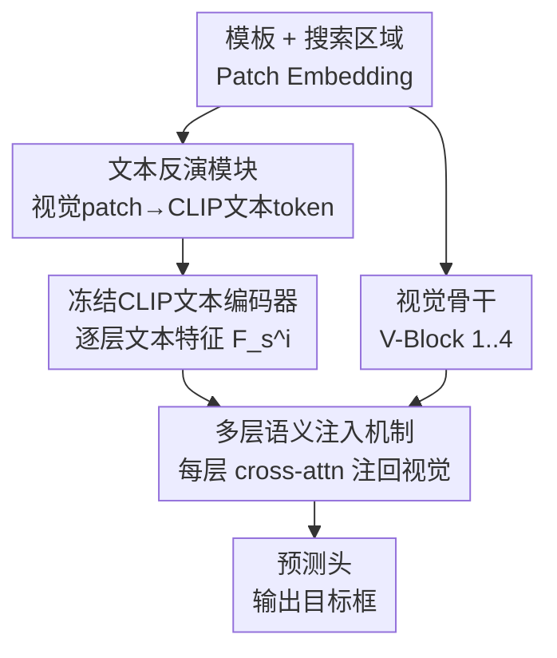

# Beyond Explicit Language: Plug-and-Play Visual-to-Linguistic Modeling Toward General Object Tracking

**会议**: CVPR 2026  
**论文**: [CVF Open Access](https://openaccess.thecvf.com/content/CVPR2026/html/Lan_Beyond_Explicit_Language_Plug-and-Play_Visual-to-Linguistic_Modeling_Toward_General_Object_Tracking_CVPR_2026_paper.html)  
**代码**: 无（原文称"Code will be made publicly available"，待开源）  
**领域**: 视频理解 / 视觉目标跟踪  
**关键词**: 视觉目标跟踪, 文本反演, 视觉-语言, 即插即用, CLIP语义注入

## 一句话总结
针对视觉-语言跟踪依赖静态文本、缺文本即失效的痛点，本文提出一个即插即用模块 TIMI：用"文本反演模块"把模板和搜索区域的视觉 patch 反向映射成 CLIP 文本嵌入空间里的伪描述（pseudo-description），再通过"多层语义注入机制"把这些隐式语言线索逐层注回视觉骨干，从而无需任何显式文本输入就能为跟踪提供动态自适应的语义引导，在 MCITrack/DUTrack/SeqTrack 等多个跟踪器上以极小开销稳定涨点。

## 研究背景与动机
**领域现状**：视觉目标跟踪（VOT）给定首帧目标框，逐帧预测目标位置。纯视觉跟踪器（OSTrack、SeqTrack、MCITrack 等）只靠模板与搜索区域的外观匹配；而视觉-语言跟踪（VLT，如 JointNLT、DUTrack、UVLTrack）额外引入一句自然语言描述，用高层语义（属性、外观、上下文关系）帮助消歧。

**现有痛点**：作者指出现有 VLT 范式有两个致命缺陷。其一，依赖**预定义、静态**的语言描述——一句"水池里的熊"在熊爬上岩石后立刻失效，无法跟随目标动态变化，产生**语义漂移（semantic drift）**，甚至给出错误线索误导预测（论文 Fig.1(b)）。其二，对文本输入有**强依赖**——一旦没有文本，模型要么退化成纯视觉、要么直接失败。在线生成逐帧描述虽能缓解不一致，但人工标注无法规模化，推理期调用 LLM/BLIP（如 DUTrack 用 BLIP 在线生描述）又严重拖慢速度，且生成风格与训练标注不一致。

**核心矛盾**：语言线索要有用，就得**实时跟上目标状态**；但实时生成显式文本又**昂贵且不一致**。显式语言这条路本身把"语义引导"和"文本输入"绑死了。

**本文目标**：在不要任何显式文本输入的前提下，仍然让跟踪器享受到语言级语义引导，并且这套机制要能即插即用地装到现有跟踪器上、训练代价小。

**切入角度**：既然 CLIP 已经把视觉和文本对齐到了同一嵌入空间，那"语言"不一定要以文字形式出现——可以直接把视觉特征**反演（invert）**成 CLIP 文本空间里的 token，让它充当"伪文本"。这样语义引导天然跟随当前视觉状态，且永远可得。

**核心 idea**：用"从视觉特征反演出的隐式伪描述"代替"外部显式语言"，再把它逐层注回视觉骨干，做到 implicit linguistic guidance。

## 方法详解

### 整体框架
方法名为 **TIMI**（Textual Inversion + Multi-layer Injection）。它把一个标准的 one-stream 视觉跟踪器看成三段：patch embedding → 视觉 Transformer 骨干 → 预测头（decoder）。TIMI 在不改动原跟踪器输入输出的前提下，做两件事：(1) **文本反演模块（Textual Inversion Module）**把模板+搜索区域的视觉嵌入在 patch 级别反演成 CLIP 文本空间里的伪描述，喂进一个**冻结的 CLIP 文本编码器**得到逐层文本特征；(2) **多层语义注入机制（Multi-Layer Semantic Injection）**把视觉骨干和文本骨干各均匀切成 4 个 block（V-Block / T-Block），对每一对同层 block 用 cross-attention 把文本语义注回视觉特征，从浅到深逐层引导。

训练上极省：视觉骨干和 CLIP 文本骨干全程**冻结**，只训练文本反演模块、语义注入模块和 decoder——本质是学一个"把视觉特征映射到冻结文本空间"的适配器，借用 CLIP 的视觉-语言先验。

### 关键设计

**1. 文本反演模块：把视觉 patch 反演成 CLIP 文本空间里的伪描述**

这一步直接针对"显式文本要么静态漂移、要么缺失"的痛点：既然要语言引导又不想要文字，那就**从视觉特征里造出语言**。具体做法是先把模板区域和搜索区域的 patch 嵌入沿空间维拼成一个统一表示，输入一个伪描述生成器，经 Projection → MLP → Alignment 三步操作映射进 CLIP 文本编码器的输入空间，得到一组向量——这些向量就是"伪描述"。作者类比 CLIP 处理真实文本时的 Tokenizer + Embedding Lookup 两步，文本反演模块相当于一次性把"造 token + 查嵌入"都做了（论文 Fig.3）。

两个关键设计抉择让它有效：其一，**patch 级**反演——每个视觉 patch 对应一个文本 token，从而保留局部细节、让生成的伪描述精确反映目标当前状态（这正是静态文本做不到的"动态自适应"）；其二，在拼接阶段建模模板与搜索区域的**全局上下文交互**，把模板的潜在上下文信息注入搜索区域的语义表示，增强其判别力。生成的伪描述嵌入再过**冻结的** CLIP 文本编码器抽出高层语言特征，作为随帧变化、上下文感知的隐式语义线索。整个过程不需要人工标注、不需要外部 captioning 模型，保证了一致性与效率。

**2. 多层语义注入机制：按层把语言语义 cross-attention 注回视觉特征**

光有伪文本特征还不够——怎么让它真正改变视觉骨干的特征分布，且既影响浅层底层特征又传递深层语义？作者把视觉骨干堆叠的 Transformer 层均匀切成 4 个 V-Block，把 CLIP 文本编码器同样切成 4 个 T-Block，两者一一配对、形状相同。对第 $i$ 对，处理流程为：

$$F^i_{vx} = \text{V-Block}_i(F^{i-1'}_{vx}),\quad F^i_s = \text{T-Block}_i(F^{i-1}_s),\quad F^{i'}_s = \text{Alignment}_i(F^i_s),\quad F^{i'}_{vx} = \text{Injection}_i(F^{i'}_s, F^i_{vx})$$

其中 Alignment 是一组 MLP，先把文本特征对齐到视觉空间。注入模块内部是一个 **Multi-Head Cross-Attention**：把视觉特征当 Query、对齐后的文本特征当 Key/Value（先各自 LayerNorm），cross-attention 结果乘一个**可学习缩放因子** $\alpha_i$ 后残差加回视觉特征：

$$Q_i = \text{Norm}_i(F^i_{vx}),\ K_i,V_i = \text{Norm}_i(F^{i'}_s),\ \text{Attn}_i = \text{MHCA}_i(Q_i,K_i,V_i),\ F^{i'}_{vx} = F^i_{vx} + \alpha_i \cdot \text{Attn}_i$$

⚠️ 注意公式 (2) 里 Query 用的是 $F^i_{vx}$（视觉）、Key/Value 用文本，与正文"用文本 modulate 视觉"的描述方向一致——以原文为准。可学习的 $\alpha_i$ 让每层自适应决定语义注入强度，残差结构保证不破坏原视觉特征。逐层注入的意义在于：浅层基础视觉特征被深层语义信息逐步丰富，从而同时提升跨模态表示的完整性和模态间语义对齐的准确性。消融显示注入层数并非越多越好（见下文），4 层左右是性能-速度的甜点区。

### 损失函数 / 训练策略
两阶段训练：第一阶段按原跟踪器设置训练，让视觉骨干抽出高质量特征；第二阶段冻结视觉与文本骨干，**只训文本反演模块、语义注入模块、decoder**。所有模型训 10 个 epoch，第 6 个 epoch 后学习率衰减。这种"骨干全冻、只训适配器"的策略把学习重心放在"视觉特征→冻结文本空间"的映射上，最大化利用 CLIP 预训练的视觉-语言先验。

## 实验关键数据

### 主实验
在 4 个大规模基准（LaSOT、GOT-10K、TrackingNet、TNL2K）上，把 TIMI（标 `*`）装进纯视觉的 SeqTrack/MCITrack 和视觉-语言的 DUTrack，均稳定涨点：

| 跟踪器 | 基准 | 指标 | 原始 | +TIMI(`*`) | 提升 |
|--------|------|------|------|-----------|------|
| SeqTrack-B256 | LaSOT | AUC | 69.9 | 71.0 | +1.5* |
| SeqTrack-B256 | GOT-10K | AO / SR0.75 | 74.7 / 71.8 | 76.6 / 74.5 | +2.5 / +3.8 |
| SeqTrack-B256 | TNL2K | AUC | 54.9 | 56.5 | +1.6 |
| MCITrack-B224 | LaSOT | AUC | 75.3 | 76.1 | +1.1* |
| MCITrack-B224 | GOT-10K | AO / SR0.75 | 77.9 / 76.8 | 79.4 / 80.0 | +2.0 / +4.2 |
| DUTrack-B256 | LaSOT | AUC | 73.0 | 73.6 | +0.9* |
| DUTrack-B256 | TNL2K | AUC / PNorm / P | 64.9 / 82.9 / 70.6 | 67.2 / 85.6 / 73.0 | +3.5 / +3.2 / +3.3 |

⚠️ 标 `*` 的提升幅度，原文 LaSOT 处分别记为 SeqTrack +1.5、MCITrack +1.1、DUTrack +0.9（AUC），上表保留原文口径。开销很小（Tab.1）：以 SeqTrack-B256 为例，参数 89M→129M、FLOPs 66G→98G、速度 40→29 fps；FPS 下降约 10 中有 7 来自 CLIP 文本编码器本身，TIMI 自身模块贡献极小。

### 消融实验
**① 伪描述的作用**（DUTrack-B256 为基线，LaSOT）：

| 配置 | AUC | PNorm | P | Δ |
|------|-----|-------|---|---|
| Baseline：仅真实文本 | 73.0 | 83.8 | 81.1 | - |
| 去掉描述（纯视觉） | 72.3 | 83.4 | 80.3 | -0.7 |
| 仅伪描述 | 73.4 | 84.2 | 81.4 | +0.4 |
| 真实文本 + 伪描述 | 73.6 | 84.3 | 81.6 | +0.6 |

"仅伪描述"比"纯视觉"高 1.1%、还反超"仅真实文本"基线 0.4%，说明**没有任何文本输入时，伪描述就能顶上甚至更好**；真实文本叠伪描述再 +0.6%，说明该模块也能给 VLT 跟踪器锦上添花。

**② 文本骨干选择**（SeqTrack-B256* 为基线，LaSOT）：

| 配置 | AUC | Δ | 说明 |
|------|-----|---|------|
| 用 CLIP 文本编码器 | 71.0 | - | 完整 |
| None（无文本骨干） | 70.5 | -0.5 | 伪描述直接喂注入模块 |
| 换成 BERT | 70.4 | -0.6 | 与 None 相近 |

换 BERT 几乎等于没有文本骨干，因为 CLIP 文本骨干在预训练阶段就与视觉骨干对齐过（CLIP 当过视觉骨干的 teacher），二者经预训练对齐时才最有效。

**③ 注入层数**（SeqTrack-B256*，LaSOT）：

| 层数 | AUC | fps |
|------|-----|-----|
| 1 层 | 70.4 | 36 |
| 2 层 | 70.6 | 34 |
| 3 层 | 70.7 | 31 |
| 6 层 | 70.6 | 26 |

1 层最差（70.4），3 层最好（70.7），6 层反而回落且更慢——多层注入有效但过度交互会增加复杂度、可能掉点。⚠️ 主框架默认把骨干切成 4 个 block，而消融里 3 层略优于 6 层，整体呈"3-4 层是甜点、再多无益"的趋势。

### 关键发现
- **伪描述能独立替代真实文本**：纯视觉 +1.1%（72.3→73.4 AUC），是该模块最核心的卖点——证明语义引导可以完全从视觉里"反演"出来。
- **文本骨干必须与视觉骨干预训练对齐**：CLIP 有用、BERT 无用，差距来自模态对齐先验而非模型容量。
- **干净数据集涨点更明显**：LaSOT/GOT-10K 涨幅大，TrackingNet（in-the-wild、噪声/遮挡/相机抖动多）几乎持平甚至 MCITrack 无提升——高层语义在嘈杂场景里可靠性下降，跟踪更依赖底层视觉鲁棒性。
- **定性上对相似外观/遮挡帮助大**：Fig.4 显示原跟踪器在相似干扰物、全遮挡后重现等场景会锁错目标或无法恢复，加 TIMI 后能维持正确跟踪。

## 亮点与洞察
- **"文本反演"把语言变成视觉的副产品**：不再把语言当外部输入，而是从视觉 patch 反演出 CLIP 文本 token，根本上解开了"语义引导↔文本输入"的绑定——这是最让人"啊哈"的地方，思路可迁移到任何"想用语言先验但不想要文本标注"的视觉任务（检测、分割、Re-ID）。
- **借冻结 CLIP 做零标注语义引导**：全程不需人工标注/在线 captioning，避开了 DUTrack 用 BLIP 在线生描述的速度与风格不一致问题。
- **真·即插即用 + 极省训练**：骨干全冻只训适配器，10 epoch 就能给 SeqTrack/MCITrack/DUTrack 三种异构跟踪器涨点，工程落地友好。
- **可学习缩放 $\alpha_i$ + 残差注入**：让每层自适应决定语义注入强度，是稳定注入外来模态信息的实用 trick。

## 局限与展望
- **嘈杂真实场景收益小**：TrackingNet 上提升微弱甚至为 0，作者承认高层语义在 in-the-wild 噪声下不可靠——这是隐式语义引导的天花板。
- **速度仍有约 10 fps 损失**：主要来自冻结的 CLIP 文本编码器（约 85M 参数、40G FLOPs），对实时跟踪是不小的负担；能否蒸馏掉文本骨干、或用更轻量对齐模型值得探索。
- **伪描述不可解释**：反演出的是 CLIP 文本空间向量而非真实词，无法验证它"描述"得对不对、是否真的捕捉了目标状态，缺少可视化/可解释性分析（⚠️ 论文未给伪描述的语义可视化）。
- **层数/切分较粗**：均匀切 4 block 是经验设定，非均匀或自适应切分、注入位置搜索可能进一步提升。

## 相关工作与启发
- **vs DUTrack（CVPR2025）**：DUTrack 用 BLIP 在推理期动态生成显式文本描述来解决静态文本漂移，但显著拖慢推理且生成风格与训练标注不一致；本文从视觉特征反演隐式伪描述，免外部 captioner、更快更一致，且能反过来叠加到 DUTrack 上再涨点。
- **vs QueryNLT（CVPR2024）**：QueryNLT 用过滤机制剔除与目标不一致的文本，但过滤会损失有效信息；本文不过滤而是直接重生成跟随目标状态的隐式语言，信息更完整。
- **vs UVLTrack / VLT**：它们都依赖显式自然语言输入（对比损失对齐、语言重加权视觉特征），缺文本即退化；本文核心区别是**完全不需要文本输入**，语义来自视觉自身反演。
- **vs 文本反演（Textual Inversion，扩散模型）**：同样是"把视觉概念反演进文本嵌入空间"的思想，但本文用于跟踪的逐帧动态语义引导，且 patch 级、配合多层注入，应用场景全新。

## 评分
- 新颖性: ⭐⭐⭐⭐⭐ "从视觉反演隐式伪文本替代显式语言"在跟踪里是很干净的新范式，解开了语义引导与文本输入的绑定。
- 实验充分度: ⭐⭐⭐⭐ 4 基准 × 3 跟踪器验证泛化性，三组消融到位；但缺伪描述的可解释性分析，TrackingNet 收益弱也未深挖。
- 写作质量: ⭐⭐⭐⭐ 动机-方法-实验逻辑清晰，公式完整；个别符号方向（Q/K/V）表述需对原文核对。
- 价值: ⭐⭐⭐⭐ 即插即用、训练省、对相似外观/遮挡场景实测有效，工程可用性高；速度损失与嘈杂场景收益小限制了上限。

<!-- RELATED:START -->

## 相关论文

- [\[CVPR 2026\] VRR-QA: Visual Relational Reasoning in Videos Beyond Explicit Cues](vrr-qa_visual_relational_reasoning_in_videos_beyond_explicit_cues.md)
- [\[CVPR 2026\] An Efficient Token Compression Framework for Visual Object Tracking](an_efficient_token_compression_framework_for_visual_object_tracking.md)
- [\[CVPR 2026\] CineSRD: Leveraging Visual, Acoustic, and Linguistic Cues for Open-World Visual Media Speaker Diarization](cinesrd_leveraging_visual_acoustic_and_linguistic_cues_for_open-world_visual_med.md)
- [\[CVPR 2026\] Drift-Resilient Temporal Priors for Visual Tracking](drift-resilient_temporal_priors_for_visual_tracking.md)
- [\[CVPR 2026\] Rethinking Occlusion Modeling for UAV Tracking](rethinking_occlusion_modeling_for_uav_tracking.md)

<!-- RELATED:END -->
