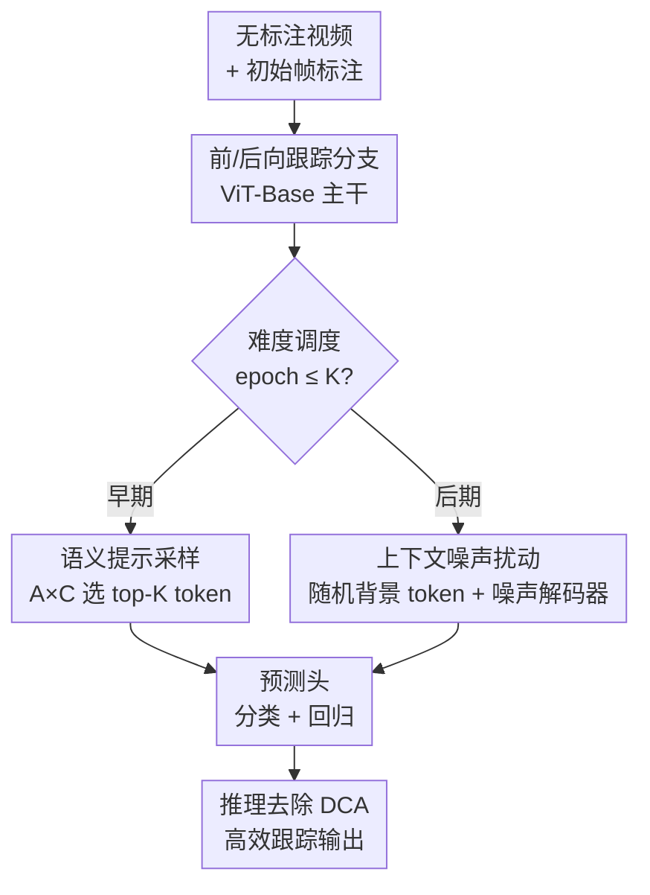

# Boosting Self-Supervised Tracking with Contextual Prompts and Noise Learning

**会议**: CVPR 2026  
**arXiv**: [2605.06092](https://arxiv.org/abs/2605.06092)  
**代码**: 无  
**领域**: 视频理解 / 自监督学习 / 视觉目标跟踪  
**关键词**: 自监督跟踪, 上下文关联, 语义提示, 特征扰动, 课程学习

## 一句话总结
PNTrack 给自监督跟踪器装上一套「双模态上下文关联（DCA）」机制——训练早期把语义 patch token 当提示喂给前/后向跟踪分支加速收敛，后期再注入随机背景 token 当噪声扰动特征空间逼模型学鲁棒表征，且整套机制只在训练时启用、推理时完全去掉，在 8 个跟踪基准上刷新了自监督 SOTA。

## 研究背景与动机

**领域现状**：视觉目标跟踪靠 LaSOT、GOT10K、TrackingNet 这类大规模标注数据集喂出了一批强力的全监督跟踪器，但人工逐帧标注框成本极高、可扩展性差。自监督跟踪因此兴起，主流做法是「循环一致性（cycle consistency）」框架：用前向跟踪分支处理无标注帧、再用后向跟踪分支回推初始帧目标位置，靠一致性约束训练，只需要极少量标注。

**现有痛点**：两条路都有缺陷。一是普通自监督跟踪器（如 TADS、SSTrack）压根没有显式的上下文建模，学不到跨帧的上下文线索来指导跟踪；二是直接把全监督跟踪里成熟的「query 关联」范式搬过来也不行——那些 query 是随机初始化、无语义的向量，在无标注场景下根本提取不出可靠的上下文线索，长时、复杂场景下泛化能力被拖垮。

**核心矛盾**：自监督跟踪的本质目标是最大化输入视频序列与目标状态之间的互信息 $\max_{\theta} I(f_\theta(\mathcal{D}); y_0^l)$，但受限于稀疏标注子集 $\mathcal{D}^l$ 和无语义的 token 关联方式，学到的特征 $\mathcal{F}$ 与目标信号 $y_0^l$ 之间的互信息被压低，海量无标注数据 $\mathcal{D}^u$ 里的目标信息没被榨干。

**本文目标**：在自监督框架内构造一条灵活的上下文信息流，既要在早期帮模型快速学到跟踪知识，又要在后期把它逼向更难的特征分布学鲁棒表征，还不能拖慢推理。

**切入角度**：作者观察到 ViT 的注意力图本身就隐含目标的空间位置信息——既然有这个免费信号，就能从真实视频帧里采样「有语义」的 token 来做跨帧关联，而不必依赖无语义的随机 query。同时把「背景 token」也当成一种上下文：目标 token 告诉模型该关注什么，背景 token 告诉模型该抑制什么，两者互补。

**核心 idea**：按「由易到难」的课程式调度，前期注入语义提示 token 降难度、后期注入背景噪声 token 升难度，用同一套双模态机制动态调控前/后向分支的学习难度。

## 方法详解

### 整体框架
PNTrack 沿用前向 + 后向双分支的循环一致性自监督跟踪骨架，主干是 ViT-Base（12 层，DropMAE 预训练初始化）。它的创新全部集中在一个叫 **Dual-mode Contextual Association（DCA）** 的机制上：DCA 根据当前训练 epoch 决定往两条跟踪分支里传哪种上下文 token——早期传「语义提示」加速学习，后期传「背景噪声」扰动特征——从而像调旋钮一样调控训练难度。关键是这套机制**只在训练阶段运行，推理时整体摘除**，所以不增加任何在线推理开销（PNTrack-384 在 A100 上跑 59 FPS）。

整条流水线自上而下是：无标注视频 + 初始帧稀疏标注 → ViT 双向跟踪分支提特征 → DCA 按 epoch 二选一地采样上下文 token → 喂入预测头出分类/回归 → 推理时去掉 DCA 直接输出跟踪框。

### 关键设计

**1. 语义提示采样：用注意力×分类图选出高置信目标 token 加速早期学习**

痛点是无标注帧里没有监督，单靠网络输出（如最高分类分的框）很难准确定位目标，早期训练容易优化漂移。DCA 早期阶段（epoch $\le K$）的做法是：先缓存主干最后一层 transformer 的空间注意力图 $\mathcal{A}$（参考帧与搜索帧之间的交叉注意力，刻画目标在当前搜索帧的状态分布），再与分类响应图 $\mathcal{C}$（目标的空间定位）做交叉相关，得到一个 token 级的「是目标还是背景」打分函数，按这个打分排序从搜索特征 $\mathcal{F}_x$ 里取 top-K 个 token 作为实例提示：

$$T = \text{topk}\left(\mathcal{F}_x,\ \frac{1}{n}\sum_{j=1}^{n}\mathcal{A}\times\mathcal{C}\right)$$

其中 $n$ 是注意力头数，做交叉相关前先把多头注意力 $\mathcal{A}$ 沿头维度平均以对齐维度。采到的高置信目标 token 被当作上下文提示喂给下一帧的前向/后向分支。它之所以有效，是因为在模型还没学到可靠跟踪模式之前就提供了更丰富、有语义的目标线索，比无语义随机 query 信息量大得多，稳住了早期优化

**2. 上下文噪声扰动：随机背景 token 升难度逼出鲁棒表征**

光靠提示会让训练一直停在「简单模式」，模型见不到难样本就学不鲁棒。后期阶段（epoch $> K$）DCA 切换策略：不再精挑细选，而是从每帧里随机采样背景 token 当噪声 $T = \text{random}(\mathcal{F}_x)$，并配一个**噪声解码器**（一层 transformer + 分类/回归头）——把搜索特征与来自其它序列的背景 token 做交叉注意力扰动，再送进预测头。作者解释它为什么有效有两点：一是经过早期阶段，跟踪器已经攒下一定的实例跟踪知识，不容易被噪声 token 带偏优化；二是注入背景噪声扰乱了搜索特征的语义嵌入空间，等于人工模拟了一个更难的跟踪环境，逼模型学出更鲁棒的目标定位能力

**3. 由易到难的时序难度调度：同一机制双模切换、且只在训练时存在**

前两个设计要靠一个调度器粘起来才成立。DCA 遵循一个时序调度原则，用同一个超参 $K$（epoch 阈值）作为开关：$\le K$ 时走提示模式、$> K$ 时走噪声模式，前向、后向两条分支都按这个规则各自取 token（见 Algorithm 1）。这种「先降难度快速起步、再升难度打磨鲁棒性」的课程式安排，让模型像爬坡一样从简单场景逐步适应复杂场景，避免了一上来就硬学难样本导致的不收敛。更关键的是整套 DCA 被设计成**训练专属**——推理时直接去掉提示采样和噪声解码器，跟踪器退回成一个干净高效的 ViT 跟踪器，因此鲁棒性的提升不以牺牲推理速度为代价

### 损失函数 / 训练策略
分类用 focal loss $\mathcal{L}_{cls}$，回归用 GIoU loss 与 $\mathcal{L}_1$ loss 组合，总损失为：

$$\mathcal{L} = \mathcal{L}_{cls} + \lambda_1 \mathcal{L}_1 + \lambda_2 \mathcal{L}_{GIoU}$$

训练集为 LaSOT + GOT10K + TrackingNet + COCO，AdamW 优化器，2 张 A100、batch size 8，共训 150 epoch（每 epoch 随机采 10000 对图像），120 epoch 后学习率衰减 10 倍；主干学习率 $2.5\times10^{-5}$、其余组件 $2.5\times10^{-4}$，weight decay $10^{-4}$。

## 实验关键数据

### 主实验
PNTrack 在 8 个基准（GOT10K、LaSOT、LaSOText、TrackingNet、VOT2020、TNL2K、UAV123、OTB100）刷新自监督 SOTA。下表对比最强自监督基线 SSTrack（同样仅用初始帧框 Init.BBox 监督）：

| 基准 | 指标 | SSTrack-384 | PNTrack-384 | 提升 |
|------|------|-------------|-------------|------|
| GOT10K | AO / SR0.5 / SR0.75 | 72.4 / 83.6 / 66.2 | 72.7 / 83.4 / 69.9 | AO +0.3, SR0.75 +3.7 |
| LaSOT | AUC | 65.9 | 67.1 | +1.2 |
| LaSOext | AUC | 48.5 | 49.1 | +0.6 |
| TrackingNet | AUC / PNorm / P | 80.4 / 86.3 / 77.9 | 81.8 / 87.4 / 79.7 | AUC +1.4, P +1.8 |

> 256 分辨率下相比 SSTrack-256，GOT10K 的 AO / SR0.5 / SR0.75 分别 +1.9 / +2.5 / +3.6。PNTrack-384 把与全监督方法的 AUC 差距在 LaSOT / LaSOext 上缩小到 8.2% / 5.5%。

其余基准（AUC / EAO）：TNL2K 55.3（SSTrack-256 为 52.1）、OTB100 71.2、UAV123 66.4、VOT2020 EAO 0.522（已追平全监督 SeqTrack 的 0.522），其中 OTB100、UAV123 比 SSTrack 各高 0.7、0.3。

### 消融实验
在 LaSOT 上验证各组件贡献（指标 AUC / PNorm / P）：

| # | 配置 | AUC | PNorm | P | 说明 |
|---|------|-----|-------|---|------|
| 1 | PNTrack（完整） | 65.9 | 76.3 | 70.2 | 完整模型 |
| 2 | 换无语义 Query | 64.6 | 74.1 | 68.3 | AUC −1.3，证明语义 token 优于随机 query |
| 3 | − 上下文噪声 | 65.1 | 75.5 | 68.9 | AUC −0.8，特征扰动有效 |
| 4 | − 上下文提示 | 64.1 | 74.9 | 68.6 | AUC −1.8，掉点最多 |
| 5 | − 注意力图（改用分类置信图采样） | 64.8 | 75.6 | 69.5 | AUC −1.1，空间感知变弱 |

上下文 token 长度敏感性：长度 4 → AUC 65.4，长度 8 → 65.9（+0.5），再加长反而下降——token 太多会引入非目标区域噪声、损害早期训练稳定性。

### 关键发现
- **上下文提示贡献最大**：去掉提示掉 1.8% AUC，去掉噪声掉 0.8%，说明早期的语义提示对建立时空一致性最关键，噪声更多是锦上添花的鲁棒性增强。
- **语义 token > 无语义 query**：用真实视频帧采的 patch token 关联比随机初始化 query 在三项指标上全面更好（AUC +1.3），印证了从 Fig.1(b) 到 Fig.1(c) 的动机。
- **注意力图采样比分类置信图采样更准**：用 $\mathcal{A}\times\mathcal{C}$ 而非单纯分类响应来采 token，多出 1.1% AUC，因为注意力图提供了更强的空间定位感知。

## 亮点与洞察
- **「目标 token 提示 + 背景 token 噪声」的对偶视角很巧**：把跟踪里通常被丢弃的背景信息也利用起来——目标 token 定义「关注什么」、背景 token 定义「抑制什么」，用同一套采样框架（一个 topk、一个 random）实现两种互补的上下文调控。
- **课程学习落到「token 采样策略切换」这个粒度**：不改网络结构、不改 loss，只靠一个 epoch 阈值 $K$ 切换喂给分支的 token 类型，就实现了由易到难的难度调度，工程上极轻。
- **训练增强、推理零开销**：DCA 完全是训练时脚手架，推理时摘除，这个「只在训练注入辅助信号」的思路可迁移到任何不想增加在线开销的表征学习任务。
- **复用注意力图当弱定位信号**：把 ViT 自带的注意力图 $\mathcal{A}$ 与分类响应图 $\mathcal{C}$ 交叉相关当作 token 级目标性打分，这个无监督定位 trick 在缺标注的自监督场景里很实用。

## 局限与展望
- 论文未提供代码，DCA 中 $K$、token 长度等关键超参对不同数据集是否需重调没充分讨论，复现成本与普适性存疑。
- 相比全监督 SOTA（如 MCITrack LaSOT AUC 75.3）仍有 8.2% 的明显差距，自监督跟踪整体性能天花板尚未触及；提升主要来自鲁棒性而非定位精度上限。
- 噪声采样是「从其它序列随机取背景 token」，随机性较强，论文未分析噪声 token 的质量/分布对结果方差的影响，可能存在训练不稳定隐患。
- 难度调度目前是硬切换（epoch $\le K$ / $> K$），未来可探索提示与噪声混合比例随训练平滑过渡的软调度，或按样本难度自适应而非按 epoch 全局调度。

## 相关工作与启发
- **vs SSTrack [59]**：同属循环一致性自监督跟踪、同用 Init.BBox 监督，SSTrack 靠解耦时空一致性 + 实例级对比损失学细粒度对应；PNTrack 在其基础上加 DCA 的双模态上下文关联，靠语义提示 + 背景噪声进一步榨取无标注帧信息，8 个基准全面超越（如 GOT10K SR0.75 +3.7）。
- **vs 全监督上下文跟踪器（ODTrack [60]、AQATrack [44]）**：它们用随机初始化的非语义 query / 时序 token 做跨帧关联，依赖大规模标注；PNTrack 指出这种无语义 query 在无标注场景下提不出可靠线索（消融 #2 验证 −1.3 AUC），改用从真实帧采的语义 patch token。
- **vs TADS [19]**：TADS 靠数据增强让自监督跟踪即插即用；PNTrack 不在数据增强层面，而在上下文 token 关联与训练难度调度层面发力，且推理零开销。

## 评分
- 新颖性: ⭐⭐⭐⭐ 首次把语义提示 + 背景噪声的双模态上下文关联引入自监督跟踪，「目标/背景 token 对偶 + 课程式调度」组合有新意。
- 实验充分度: ⭐⭐⭐⭐ 覆盖 8 个基准 + 完整消融（关联方式/各组件/采样信号/token 长度），但缺代码、缺方差与超参敏感性的深入分析。
- 写作质量: ⭐⭐⭐⭐ 动机从信息论与 Fig.1 三类范式对比讲清，方法配 Algorithm 1，逻辑清晰。
- 价值: ⭐⭐⭐⭐ 缩小自监督与全监督跟踪差距，「训练注入、推理摘除」的轻量增强范式有迁移价值。

<!-- RELATED:START -->

## 相关论文

- [\[CVPR 2026\] Exploring Adaptive Masked Reconstruction for Self-Supervised Skeleton-Based Action Recognition](exploring_adaptive_masked_reconstruction_for_self-supervised_skeleton-based_acti.md)
- [\[CVPR 2026\] Learning from Noisy Supervision: A Denoising-Debiasing Framework for Weakly Supervised Video Anomaly Detection](learning_from_noisy_supervision_a_denoising-debiasing_framework_for_weakly_super.md)
- [\[ECCV 2024\] Self-Supervised Any-Point Tracking by Contrastive Random Walks](../../ECCV2024/video_understanding/self-supervised_any-point_tracking_by_contrastive_random_walks.md)
- [\[CVPR 2026\] Self-Paced and Self-Corrective Masked Prediction for Movie Trailer Generation](self-paced_and_self-corrective_masked_prediction_for_movie_trailer_generation.md)
- [\[CVPR 2026\] Joint Learning of General and Diverse Patterns with Mixture of Memory Experts for Weakly-Supervised Video Anomaly Detection](joint_learning_of_general_and_diverse_patterns_with_mixture_of_memory_experts_fo.md)

<!-- RELATED:END -->
