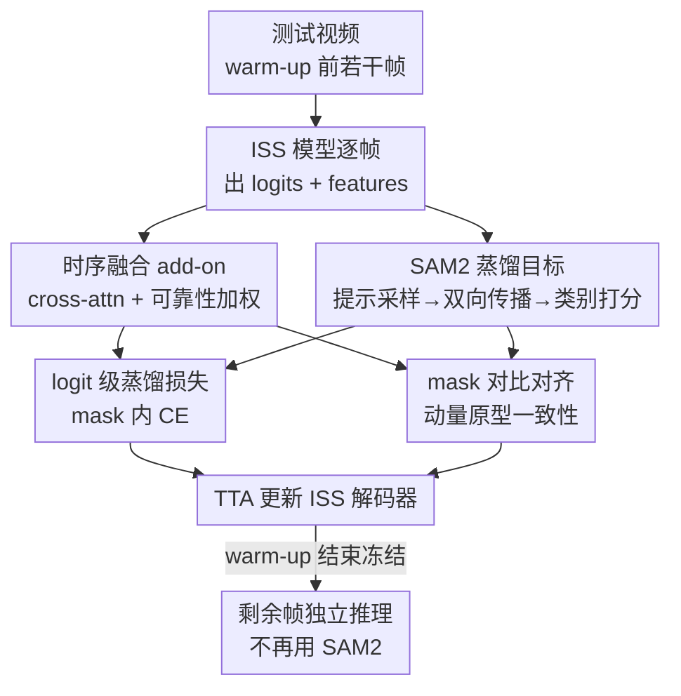

# Bootstrapping Video Semantic Segmentation Model via Distillation-assisted Test-Time Adaptation

**会议**: CVPR 2026  
**arXiv**: [2604.10950](https://arxiv.org/abs/2604.10950)  
**代码**: https://github.com/jihun1998/DiTTA (有)  
**领域**: 视频理解 / 语义分割 / 测试时自适应  
**关键词**: 视频语义分割, 测试时自适应, SAM2 蒸馏, 时序一致性, 无标注

## 一句话总结
DiTTA 用一个轻量时序 add-on，把只会逐帧分割的图像分割（ISS）模型在测试视频的前若干帧上、靠蒸馏 SAM2 的时序传播能力做测试时自适应（TTA），把它"自举"成视频专用的 VSS 模型，之后冻结模型对剩余帧高速推理，无需任何视频标注，且在 VSPW 上反超全监督 VSS 方法。

## 研究背景与动机

**领域现状**：视频语义分割（VSS）要给视频每一帧每个像素分类。主流做法是在 VSPW 这类逐帧密集标注的视频数据集上做全监督训练，但 15fps 逐帧像素标注的成本极高，能用的视频数据集稀缺。一个省事的替代是直接拿图像语义分割（ISS）模型逐帧推理（Fig.1A），绕开视频标注，但它把每帧孤立处理，完全丢掉时序连续性，在遮挡、运动模糊下预测会跨帧抖动、前后不一致。

**现有痛点**：近期出现的 SAM2 能做高质量的可提示视频掩码传播，一个直觉做法是用它在零样本后处理里 refine ISS 的逐帧输出（Fig.1B）——把首帧 ISS 结果转成 object-level 提示，用 SAM2 沿时间传播。但这条路有两个硬伤：(1) 每帧都要调用 SAM2 来跟踪多个目标，计算/显存开销巨大（实测仅 1.41 FPS），还要处理"新目标何时加入跟踪、旧目标何时丢弃"的麻烦；(2) 它彻底依赖首帧 ISS 结果，首帧错了就会沿时间一路传播，几乎没有纠错能力。

**核心矛盾**：想要时序一致性，要么花钱标注视频数据，要么推理时反复重调 SAM2 付出巨额算力——两条路都不实用。能不能只在"很短的初始片段"上把 SAM2 的时序知识一次性"吸"进 ISS 模型，之后就甩掉 SAM2？

**本文目标**：在无视频标注、且推理时不依赖 SAM2 的前提下，把一个现成 ISS 模型变成对当前测试视频时序感知的 VSS 模型。

**切入角度**：作者把这看成测试时自适应（TTA）问题——但传统 TTA（熵最小化、自伪标签）只靠模型自己的预测，提升有限。关键观察是：ISS 模型擅长"语义判类"，SAM2 擅长"时空一致的掩码传播"，两者互补，可以让 SAM2 当"助教"在测试时给 ISS 模型蒸馏出时序监督信号。

**核心 idea**：用 SAM2 在测试视频的前几帧做一次性"时序知识蒸馏"，把 ISS 模型 bootstrap 成视频专用 VSS 模型，然后冻结、丢掉 SAM2 独立推理。

## 方法详解

### 整体框架

DiTTA 要解决的是"把逐帧 ISS 模型在测试视频上自举成时序感知的 VSS 模型"。整体分三块协同：给 ISS 模型挂一个**轻量时序融合 add-on**让它能跨帧聚合信息；用 **SAM2 蒸馏目标**在测试视频的前若干帧（warm-up 片段）上提供时序监督信号，做 logit 级蒸馏；再加一个 **mask 对比对齐**在特征空间强化同一物体跨帧的一致性。三块联合驱动 TTA，warm-up 结束后模型冻结，对剩余帧独立、高速推理——这正是作者提出的 **Warm-Up then Freeze（W2F）** 评测协议（如前 10% 帧自适应、后 90% 帧只推理）。整个适应过程只需 SAM2 跑一遍（single pass），推理阶段完全不碰 SAM2。

### 关键设计

**1. 时序融合 add-on：给逐帧 ISS 模型装上跨帧的"时间桥"**

ISS 模型天生只看单帧、没有任何跨帧聚合机制，逐帧推理必然丢时序。作者挂一个轻量的 cross-attention add-on 当作相邻帧之间的时间桥：给定连续两帧 $(I_{t-1}, I_t)$，ISS 模型分别产出特征 $(F_{t-1}, F_t)$ 和 logits $(S_{t-1}, S_t)$，把当前帧特征投影为 query、前帧特征投影为 key、前帧 logits $S_{t-1}$ 当 value，算出对齐到当前帧的注意力输出 $S^{\text{add-on}}_{t-1}=\mathrm{softmax}(Q_t K_{t-1}^T)\,S_{t-1}$。但前帧未必可靠（遮挡、运动模糊），所以融合时按像素可靠性加权：定义可靠性图 $R_t(x,y)=1-E_t(x,y)/\max E_t$（$E_t$ 是该像素类别分布的归一化熵，熵越低越可靠），当 $R_t$ 高于阈值 $\tau$ 时直接用当前帧 $S_t$，否则按 $R_t$ 与 $R^{\text{add-on}}_{t-1}$ 的相对大小在当前帧与对齐前帧之间做凸组合。这样既引入了时序上下文，又不会被低质量的历史帧拖累——只在 TTA 阶段微调解码器即可点亮这个能力

**2. SAM2 蒸馏目标：让 SAM2 当助教，造出测试时没有的时序监督**

TTA 最根本的难题是测试时没标签，纯熵最小化/自伪标签只靠模型自己的预测，天花板很低。DiTTA 的核心新意是用 ISS 和 SAM2 的互补优势"造监督"：先从首帧 ISS 预测里按类别过滤 + 熵阈值采样出高可靠像素当提示点（保证语义和空间多样性），交给 SAM2 做**双向传播**生成一组时空一致的物体掩码 $\{M^i_t\}$；这些掩码不求覆盖整帧，只覆盖 ISS 与 SAM2 都自信的区域，因此是可靠的"物体级时序锚点"。每条时空掩码 $M^i$ 再用一个软打分聚合帧内 ISS 预测来赋类别标签：$\sigma^c=\sigma^c_{\text{rel}}\cdot(\sigma^c_{\text{area}})^{\gamma_{\text{area}}}\cdot(\sigma^c_{\text{freq}})^{\gamma_{\text{freq}}}$，其中 $\sigma^c_{\text{rel}}$ 是该类在掩码内的平均可靠性、$\sigma^c_{\text{area}}$ 是被判为该类的面积占比（压掉小噪声）、$\sigma^c_{\text{freq}}$ 补偿长尾类别。拿到类别标签后只在掩码区域内施加 logit 级交叉熵 $L^{\text{Distill}}_t=\sum_i\sum_{(x,y)\in m^i_t}\big[\mathrm{CE}(S_t,c^i)+\mathrm{CE}(S^{\text{add-on}}_{t-1},c^i)\big]$，对原 logits 和 add-on logits 同时监督。"空间从哪儿来"由 SAM2 决定、"语义是什么"由 ISS 决定，分工把两边长处拧成一股

**3. mask 对比对齐：在特征空间逼出同一物体跨帧的一致表示**

logit 级蒸馏只约束了物体区域的语义对齐，没管特征层面跨帧是否连贯。作者补一个基于掩码的对比损失：用动量编码器（EMA 更新）从动量分支算每条时空掩码 $M^i$ 的物体原型 $P^i_t=\frac{1}{|m^i_{1:t}|}\sum_{u\le t}\sum_{(x,y)\in m^i_u}F^{mo}_u\cdot R^{mo}_u$（可靠性加权聚合到第 $t$ 帧），再让主模型当前特征在同一掩码内向自己的原型靠拢、推开其他物体原型：$L^{\text{Contra}}_t=-\sum_i\sum_{(x,y)\in m^i_t}\log\frac{\exp(F_t\cdot P^i_t)}{\sum_j \exp(F_t\cdot P^j_t)}$。动量原型提供了稳定的对齐目标，让"同一物体在不同帧的表示"在表示空间里聚拢，与 logit 级损失互补，从特征侧再强化物体级时序一致性。总损失 $L^{\text{DiTTA}}_t=L^{\text{Distill}}_t+L^{\text{Contra}}_t$

### 损失函数 / 训练策略
默认 ISS 模型用 SegFormer（MiT-B5 backbone，在 VSPW 训练集上逐帧预训练）。TTA 阶段**只更新解码器参数**，学习率 0.001，每帧迭代 5 次。超参 $\tau=0.8$、$\gamma_{\text{area}}=0.3$、$\gamma_{\text{freq}}=0.8$，固定随机种子。除特别说明外所有实验都在 W2F 协议下进行。

## 实验关键数据

### 主实验
VSPW 数据集、W2F 协议下与各类基线对比（SegFormer 同 backbone；mVC 衡量跨帧平滑度，FPS 在单张 RTX 3090 上测）：

| Warm-up | 方法 | FPS | mIoU | wIoU | mVC8 | mVC16 |
|---------|------|-----|------|------|------|-------|
| 10% | SegFormer (ISS) | 18.58 | 49.0 | 66.3 | 88.3 | 84.3 |
| 10% | CFFM++ (全监督 VSS) | 5.85 | 49.6 | 66.1 | 90.4 | 86.8 |
| 10% | CoTTA (ISS+TTA) | 18.48 | 49.6 | 66.7 | 89.7 | 86.4 |
| 10% | Zero-shot Refine. (ISS+SAM2) | 1.41 | 49.7 | 66.5 | 94.7 | 92.9 |
| 10% | **DiTTA (Ours)** | 13.45 | **51.1 (+2.1)** | 66.5 | 94.1 | 92.2 |
| 50% | SegFormer (ISS) | 18.58 | 48.7 | 66.4 | 88.3 | 84.2 |
| 50% | Zero-shot Refine. | 1.41 | 50.1 | 67.3 | 95.0 | 93.3 |
| 50% | **DiTTA (Ours)** | 13.45 | **52.3 (+3.6)** | 67.1 | 94.9 | 93.0 |

仅用前 10% 帧自适应，DiTTA 的 mIoU 就比 ISS 基线 +2.1%p、比全监督 VSS 的 CFFM++ +1.5%p；同时速度（13.45 FPS）几乎是零样本 refine（1.41 FPS）的 10 倍。warm-up 比例越大优势越明显（50% 时 +3.6%p）。

### 消融实验（50% W2F 协议）
| 配置 | Add-on | Distill. | Contrast. | mIoU |
|------|:------:|:--------:|:---------:|------|
| ISS 基线 | | | | 48.7 |
| A | ✔ | | | 49.9 |
| B | | ✔ | | 50.8 |
| C | | | ✔ | 50.2 |
| DiTTA (Full) | ✔ | ✔ | ✔ | **52.3** |

三个组件单独都能涨点，其中 SAM2 蒸馏目标（B，+2.1）贡献最大，三者组合达到 52.3 mIoU，体现互补性。（注：无蒸馏目标的变体按 TTA 惯例改用 ISS 自身预测当自监督目标。）

### 关键发现
- **SAM2 蒸馏是涨点主力**：消融里单独加蒸馏目标（B）就把 mIoU 从 48.7 抬到 50.8，比 add-on（A，49.9）和对比对齐（C，50.2）单独贡献都大——印证"从 SAM2 蒸结构化时序知识"比纯无监督 TTA 目标更有效。
- **改进不是简单"白嫖 SAM2"**：与同样用 SAM2 的零样本 refine 直接对比，DiTTA 在所有 warm-up 比例下 mIoU 都更高、且快近 10 倍，说明把时序知识"蒸进模型"优于推理时反复重调 SAM2。
- **跨域泛化**：VSPW→Cityscapes 跨数据集，DiTTA mIoU 46.9（+2.7 over ISS）、wIoU 77.9（+3.7），还超过全监督 VSS 的 CFFM。
- **不靠视频先验**：把 ISS 模型换成纯静态图像数据集 ADE20K 训练的版本，迁到 VSPW 上 DiTTA 仍涨 mIoU +1.1、mVC16 +17.7，排除了"靠 VSPW 隐含视频先验"的质疑。

## 亮点与洞察
- **"一次性蒸馏 + 冻结推理"这个范式很巧**：把昂贵的 foundation model（SAM2）只在 warm-up 阶段用一遍，知识转移进轻量模型后就甩掉它独立跑，既拿到时序一致性又把推理拉回实时——这个"warm-up then freeze"思路可迁移到任何"foundation model 太贵、但只需在初始片段提供监督"的在线任务。
- **可靠性图（归一化熵）一物多用**：同一个 $R_t$ 既用于 add-on 的可靠性加权融合，又用于蒸馏提示采样、又用于对比原型的加权聚合，是个简洁好用的 trick。
- **分工式监督构造**：让 ISS 管语义、SAM2 管时空，再用软打分赋类别——这种"把两个互补模型的强项拧成监督信号"的造标方式，对其他缺监督的 TTA/蒸馏场景有借鉴意义。
- **W2F 协议本身是贡献**：明确把"前若干帧适应、后续帧冻结推理"形式化，比"每帧都适应"更贴近机器人/监控这类资源受限的真实部署。

## 局限与展望
- **依赖 warm-up 片段的代表性**：若视频前 10% 帧与后续场景差异很大（剧烈场景切换、新类别在后半段才出现），冻结后的模型可能跟不上——本质上是"用初段知识外推全片"的假设。
- **首帧/初段 ISS 质量仍有影响**：虽然蒸馏比零样本 refine 更鲁棒，但提示采样和类别打分都建立在 ISS 预测上，初段 ISS 系统性误判某类时，蒸馏目标也会带偏。
- **类别打分超参较多**：$\sigma^c$ 里 $\gamma_{\text{area}}$、$\gamma_{\text{freq}}$ 等需要调，论文给了 VSPW 上的值，跨数据集是否稳健、对长尾分布的敏感性还需更多验证（⚠️ 公式 (4) 中各项的精确组合以原文为准）。
- **wIoU 提升有限**：主表里 DiTTA 的 wIoU 相对 ISS 基本持平（+0.2~+0.7），主要收益集中在 mIoU 和时序一致性 mVC，说明它更擅长修"跨帧抖动/碎片化"而非整体加权精度。

## 相关工作与启发
- **vs 全监督 VSS（CFFM / CFFM++ / TV3S）**：他们在 VSPW 视频上直接训练光流/注意力时序模块，需要昂贵的视频标注且推理慢（~5-6 FPS）；DiTTA 不用任何视频标注，靠测试时蒸馏自举，反而 mIoU 更高、速度更快（13.45 FPS）。
- **vs ISS+TTA（TENT / AuxAdapt / CoTTA）**：他们逐帧做无监督适应（熵最小化/伪标签），没有显式时序建模，提升有限；DiTTA 引入 SAM2 的结构化时序知识 + add-on 显式跨帧融合，10% warm-up 下比最强的 CoTTA 还 +1.5%p。AuxAdapt 是最接近的工作（也想把 ISS 适配成 VSS），但它逐帧伪标签、忽略跨帧时序，是真正的"自给自足"适应。
- **vs 零样本 SAM2 refine**：他们推理时每帧反复调 SAM2 做后处理，慢（1.41 FPS）且首帧错就一路传；DiTTA 只在 warm-up 单次用 SAM2 把知识蒸进模型，推理时完全不依赖 SAM2，更快更准。

## 评分
- 新颖性: ⭐⭐⭐⭐⭐ "测试时蒸馏 SAM2 + warm-up then freeze" 把 TTA、foundation model 蒸馏、VSS 三者新颖地缝在一起
- 实验充分度: ⭐⭐⭐⭐ 三类基线、跨域、非视频源、full-video 都覆盖了，消融清晰；但仅 VSPW/Cityscapes 两个域、backbone 较单一
- 写作质量: ⭐⭐⭐⭐ 动机和分工讲得清楚，图示直观；个别公式排版与符号（如 $\sigma$ 各项）需对照原文
- 价值: ⭐⭐⭐⭐⭐ 给"无视频标注 + 不可反复用 SAM2"的真实部署场景提供了实用、可扩展的解，反超全监督很有说服力

<!-- RELATED:START -->

## 相关论文

- [\[CVPR 2026\] Dual-level Adaptation for Multi-Object Tracking: Building Test-Time Calibration from Experience and Intuition](tcei_test_time_calibration_experience_intuition_mot.md)
- [\[CVPR 2026\] Scene-Centric Unsupervised Video Panoptic Segmentation](scene-centric_unsupervised_video_panoptic_segmentation.md)
- [\[CVPR 2026\] Polyphony: Diffusion-based Dual-Hand Action Segmentation with Alternating Vision Transformer and Semantic Conditioning](polyphony_diffusion-based_dual-hand_action_segmentation_with_alternating_vision_.md)
- [\[CVPR 2026\] Robust Promptable Video Object Segmentation](robust_promptable_video_object_segmentation.md)
- [\[CVPR 2026\] Self-Critical Distillation Network for Video-based Commonsense Captioning](self-critical_distillation_network_for_video-based_commonsense_captioning.md)

<!-- RELATED:END -->
