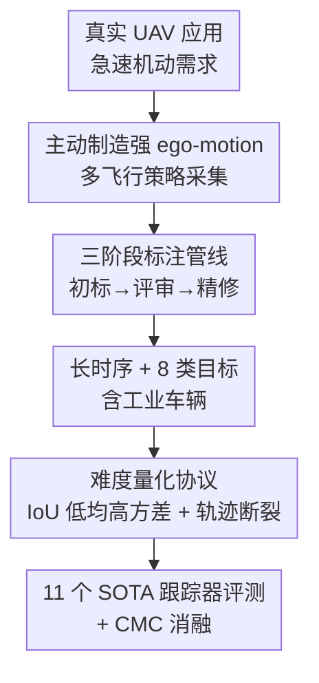

# Breaking Smooth-Motion Assumptions: A UAV Benchmark for Multi-Object Tracking in Complex and Adverse Conditions

**会议**: CVPR 2026  
**论文**: [CVF Open Access](https://openaccess.thecvf.com/content/CVPR2026/html/Ye_Breaking_Smooth-Motion_Assumptions_A_UAV_Benchmark_for_Multi-Object_Tracking_in_CVPR_2026_paper.html)  
**代码**: https://github.com/kxzhang-lab/DynUAV  
**领域**: 视频理解 / 无人机感知 / 多目标跟踪  
**关键词**: UAV-MOT、ego-motion、跟踪基准、运动模糊、轨迹断裂

## 一句话总结
作者提出 DynUAV——一个故意用激进无人机机动制造强烈自运动（ego-motion）的多目标跟踪基准（42 段视频、170 万+ 标注框、8 类目标），打破现有 UAV-MOT 数据集"平滑近线性运动"的隐含假设，并用 11 个 SOTA 跟踪器证明：在剧烈视角/尺度突变下，现有方法的检测和关联会同时崩盘。

## 研究背景与动机
**领域现状**：多目标跟踪（MOT）在监控、自动驾驶上已相当成熟，无人机视角（UAV-MOT）也有 VisDrone、UAVDT、MDMT 等基准。这些数据集大多在高空悬停或匀速巡航下采集，相机轨迹平滑，物体在像面上的轨迹近似线性。

**现有痛点**：现实里无人机经常做非线性、急速的机动——避障、变速追拍、绕飞、推拉变焦，这些动作会带来剧烈的视角突变、尺度突变和运动模糊。但现有基准几乎不覆盖这类高动态工况：单段视频里的目标轨迹通常很"直"，场景也局限于城市街道路口、目标局限于常见车辆。换句话说，现有 UAV-MOT 评测的"难"主要来自遮挡和小目标，而不是相机自身的剧烈运动。

**核心矛盾**：现代 MOT 算法（卡尔曼滤波、匀速运动先验、基于外观的 ReID）都隐含一个"平滑运动假设"——相邻帧里目标位移小、外观稳定。一旦相机做激进机动，这个假设被打破：目标在相邻帧间位移巨大、外观因模糊和视角变化而剧烈漂移，检测和关联会被同时拖垮。已有的 DanceTrack/SportsMOT 虽然也"反平滑假设"，但难点来自**目标自身**的复杂行为，而非**传感器的 ego-motion**；BioDrone 抓了无人机抖动但只是单目标跟踪（SOT），缺少多目标的数据关联挑战。

**本文目标**：造一个专门暴露"相机自运动诱发的观测不稳定"的 MOT 基准，并系统量化它到底比现有基准难在哪、难多少。

**核心 idea**：不是被动记录动态物体，而是**主动用无人机的机动能力去制造强 ego-motion**——通过受控变速和灵活相机位姿，刻意生成复杂表观轨迹与频繁的急速运动事件，把"平滑运动假设"打碎，逼跟踪器去做真正的时序推理。

## 方法详解
这是一篇基准（benchmark）论文，没有提出新的跟踪算法，"方法"即**数据集的构建管线 + 难度刻画协议 + 评测方案**。整体可分四步：先设计能制造强 ego-motion 的飞行策略，再用消费级无人机在多场景采集，接着用三阶段标注管线保证轨迹 ID 的可靠性，最后用一组统计指标量化证明 DynUAV 比同类基准更难，并在其上评测 11 个 SOTA 跟踪器。

### 整体框架

### 关键设计

**1. 主动制造强 ego-motion 的飞行策略：把"平滑运动假设"采集进数据**

针对"现有基准相机轨迹太平滑"这个根本痛点，作者不靠后期挑选困难片段，而是在**采集阶段就刻意制造困难**。他们用一台消费级 DJI Mini 4 Pro（1/1.3 英寸 CMOS、1080p），在 80–120 米高度组合多种飞行策略——悬停、巡航、变速运动、旋转、推拉变焦，并特意加入绕飞（orbital）和推近/拉远（fly-in/pull-away）机动，主动诱发剧烈视角突变、尺度突变和运动模糊。同时在采集设计里埋了两个研究导向的特性：一是**长时序鲁棒性**，序列平均时长在同类基准里最长，逼跟踪器在长时间窗口内对抗误差累积导致的漂移与轨迹断裂；二是**ego-motion 解耦**，专门安排"相机剧烈运动但物体静止"的序列，使表观轨迹的复杂性纯粹来自相机而非目标，方便分离两类难度。此外还采集了大量夜间序列增加时空多样性。

**2. 三阶段标注管线：在剧烈运动下保住轨迹 ID 的时序一致性**

剧烈 ego-motion 会让目标频繁出框再回框、回来时尺度和视角剧变，普通标注极易标错 ID。作者用 CVAT 平台、三阶段流水线（Initial → Review → Refinement）来保证 ground-truth 质量：初标阶段做半自动标注，评审阶段做同行交叉核验，精修阶段用一个自研可视化脚本，按**帧级**和 **ID 级**两种采样自动检测错误，引导标注员严格遵守边界框精度和时序 ID 一致性。标注协议还定得很细：目标只从它**首次完全可见**的那一帧开始标；遮挡期间只要能从轨迹上下文可靠推断位置，就持续标注其位置（而不是一遮挡就断开）——这直接保住了长时序轨迹的连续性，也让后面"轨迹断裂"统计反映的是真实跟踪难度而非标注缺失。

**3. 长时序 + 8 类目标（含工业车辆）：把场景与类别多样性也做成难点**

DynUAV 定义了 8 个目标类别，跨越车辆与行人，除常规 car/truck 外特意引入 excavator（挖掘机）、crane（吊车）、bulldozer（推土机）这类工地工业车辆；为标注一致，所有两轮车统一归为 "cycle"、骑手为 "cycler"、行人为 "person"。场景覆盖校园、城市道路、夜间三大类：校园人群密集考验关联能力，道路高速车流考验运动建模，夜间变照明利于跨域检测研究。配合最长的平均序列时长，类别+场景+时长三重多样性共同抬高了泛化与时序建模的门槛。

**4. 难度量化协议：用统计指标证明 DynUAV 确实更难**

光说"更难"不够，作者给出可量化证据。其一用相邻帧同一目标框的 **IoU 均值/方差**刻画时序一致性：DynUAV 落在独特的"低均值、高方差"区——低均值说明帧间位移大，高方差说明运动模式最多样，与 MOT20 那种"稳定可预测"的分布形成鲜明对比。其二用**平均目标面积占帧面积之比**衡量小目标程度，DynUAV 仅次于 MDMT（约 $1.17\times10^{-3}$），属于极端小目标。其三用**轨迹断裂分布**衡量跟踪难度：UAV 下断裂有两个来源——被其他物体遮挡、以及被无人机自身机动甩出视野；VisDrone/UAVDT/MDMT 里绝大多数目标是单条完整轨迹，而 DynUAV 呈现明显长尾，大量目标被切成多段。三个指标共同把"DynUAV 是同类最难基准"坐实。

### 评测方案
统一检测器：所有跟踪器都用 YOLOv11 作为检测骨干，在 1280×1280 输入、单张 RTX 4090 上训 100 epoch，输出检测作为所有跟踪器的统一输入，以隔离检测差异、公平比较关联能力。所报告结果均为**在 DynUAV 上微调后**的模型。评测 11 个代表性跟踪器，覆盖五大家族：无监督（Path-Consistency）、运动模型增强（OC-SORT、DiffMOT）、单阶段关联（BoostTrack、TrackTrack）、不确定性感知（U2MOT）、自适应记忆/融合（AdapTrack、StrongSORT）。指标用 MOTA（综合 FP/FN/IDSW）、IDF1（时序身份一致性）、HOTA 及其分解的 DetA（检测）/ AssA（关联），从而能判断瓶颈究竟出在检测还是关联。

## 实验关键数据

### 数据集统计对比
| 数据集 | 任务 | 序列数 | BBox | 平均帧长 | 平均目标面积比 |
|--------|------|--------|------|----------|----------------|
| VisDrone | UAV | 92 | 1621k | 417 | $2.58\times10^{-3}$ |
| UAVDT | UAV | 50 | 799k | 815 | $2.59\times10^{-3}$ |
| MDMT | UAV | 88 | 2212k | 451 | $9.72\times10^{-4}$ |
| DanceTrack | General | 100 | 574k | 1059 | $3.19\times10^{-2}$ |
| **DynUAV** | UAV | 42 | 1720k | **1828** | $1.17\times10^{-3}$ |

DynUAV 序列数不多，但**平均帧长（1828）和最小帧长（1076）都是同类最高**，刻意押注长时序连续性；目标面积比极小（仅次于 MDMT），是典型极端小目标基准。

### 跟踪器在 DynUAV 上的表现（微调后）
| 跟踪器 | MOTA↑ | IDF1↑ | HOTA↑ | AssA↑ | IDSW↓ |
|--------|-------|-------|-------|-------|-------|
| TrackTrack | 66.95 | **74.81** | **62.74** | **68.89** | **256** |
| AdapTrack | 67.96 | 73.26 | 62.33 | 66.71 | 583 |
| Deep OC-SORT | 66.44 | 72.25 | 61.09 | 65.49 | 567 |
| DiffMOT | 67.32 | 71.72 | 61.21 | 65.73 | 430 |
| StrongSORT | **68.18** | 71.21 | 60.87 | 63.15 | 1394 |
| U2MOT | 55.16 | 58.92 | 51.47 | 53.90 | 6452 |
| BoostTrack | 56.72 | 63.77 | 53.71 | 58.98 | 609 |

单阶段的 TrackTrack 凭统一匹配（跨所有置信度层级整体关联）在多数关联指标上夺冠；StrongSORT 的 DetA/MOTA 高但 AssA/IDF1 明显落后——它过度依赖外观特征，而 DynUAV 的运动模糊+剧烈位姿变化把外观特征严重退化；BoostTrack 那套放大阈值、生成伪框来召回漏检的激进策略在杂乱动态场景里反噬，引入大量 FP 和身份碎片化；U2MOT 的不确定性建模在如此极端的外观/运动变化下也力不从心（IDSW 高达 6452）。

### 跨数据集性能跌幅（DynUAV 相对各基准）
| 跟踪器 | vs MOT17 MOTA | vs MOT17 IDF1 | vs MOT20 MOTA | vs DanceTrack MOTA |
|--------|---------------|----------------|----------------|---------------------|
| BoostTrack | -23.98 | -18.43 | -20.98 | — |
| U2MOT | -24.54 | -19.28 | -21.94 | — |
| OC-SORT | -17.31 | -19.38 | -14.82 | -31.51 |
| Deep OC-SORT | -12.96 | -8.35 | -9.16 | -25.86 |
| StrongSORT | -11.42 | -8.29 | -5.62 | -22.92 |

相对 MOT17/20，DynUAV 上 MOTA、IDF1 跌幅最大——MOTA 对 FN 敏感，掉分主要来自 ego-motion 和尺度突变引发的检测失败；IDF1 掉分则源于剧烈视角变化导致的 IDSW 与轨迹断裂。相对 DanceTrack，MOTA 跌幅尤其惊人（OC-SORT 达 -31.51）：DanceTrack 静止相机+干净背景下 MOTA 几乎只衡量关联质量，而 DynUAV 的强自运动从根上破坏了检测，呈现"HOTA 中等但 MOTA 暴跌"——说明难点不在定位歧义，而在整条跟踪管线被系统性施压。

### CMC 消融
| 跟踪器 | 配置 | MOTA↑ | IDF1↑ | AssA↑ | IDSW↓ |
|--------|------|-------|-------|-------|-------|
| AdapTrack | w/o CMC | 63.57 | 65.53 | 58.97 | 1123 |
| AdapTrack | **w/ CMC** | 67.96 | 73.26 | 66.71 | 583 |
| TrackTrack | w/o CMC | 65.31 | 71.04 | 65.95 | 439 |
| TrackTrack | **w/ CMC** | 66.95 | 74.81 | 68.89 | 256 |

开启相机运动补偿（CMC）显著改善**关联**指标（AssA 大涨、IDSW 近乎减半），但对 DetA 几乎无益——证实 ego-motion 主要污染的是关联而非检测。

### 关键发现
- **CMC 的增益强度 = ego-motion 强度的直接代理**：相机运动越剧烈的序列（如频繁平移的 Seq.009、工地复杂轨迹的 Seq.029），CMC 带来的 IDSW 下降越大；相机平稳的序列里 CMC 几乎无用。这把"DynUAV 难在 ego-motion"从论断变成了可测量的因果证据。
- **CMC 存在权衡**：图像 warp 会引入伪影，偶尔抬高 FP——朴素套用 CMC 对检测并非全是好事，作者建议把检测与补偿联合优化作为未来方向。
- **失败的根因有二**：长期遮挡后无法重识别、剧烈视角变化导致身份碎片化；overpass（Seq.009）、校园入口（Seq.016）等"复杂相机运动+持续遮挡+小目标"叠加的序列是 IDSW 重灾区。
- 表现最好的是"鲁棒运动模型 + 轻量外观线索"组合（Deep OC-SORT）或专为不确定场景设计的方法（AdapTrack、TrackTrack）。

## 亮点与洞察
- **"主动制造难度"的采集哲学**：不是事后筛困难样本，而是在飞行策略层面刻意制造强 ego-motion，让数据集天然具备"反平滑假设"属性——这种采集思路可迁移到任何想暴露特定鲁棒性短板的基准构建。
- **把难度做成可量化协议**：用 IoU 低均高方差、平均面积比、轨迹断裂长尾三个互补统计量，从运动、尺度、连续性三个维度证明"更难"，而非空喊口号；这套刻画方法对后续基准很有参考价值。
- **用 CMC 当"诊断探针"**：把相机运动补偿的收益当作 ego-motion 强度的代理指标，反过来定位哪些序列最难——一个很巧的"用工具反向分析数据"的思路。
- **ego-motion 解耦序列**（相机动、物体静）的设计，干净地把"表观轨迹复杂性"归因到相机而非目标，便于学界分离研究两类难度。

## 局限与展望
- 作者承认的局限：受人工标注高成本约束，**数据集规模有限**（42 段）；出于飞行安全法规，**缺少极端天气**条件。
- 自己发现的局限：① 检测器统一固定为 YOLOv11，跟踪器表现可能受这一检测上限牵制，"检测 vs 关联"的归因结论与所选检测器耦合；② 只用一款消费级无人机（DJI Mini 4 Pro）采集，传感器/平台多样性不足，结论对工业级或固定翼无人机的可迁移性存疑 ⚠️；③ 评测全部基于微调后模型，零样本泛化能力未充分展开。
- 改进思路：把检测与相机运动补偿联合优化（作者已指出）；扩充极端天气与多平台数据；引入显式利用 ego-motion 估计（如 IMU/位姿）的跟踪 baseline 作为对照。

## 相关工作与启发
- **vs DanceTrack / SportsMOT**：它们也打破平滑假设，但难点来自**目标自身**的复杂运动（舞蹈、运动员）；DynUAV 的难点来自**传感器 ego-motion**，二者互补。实验也显示 DynUAV 上 MOTA 跌幅远大于 DanceTrack，因为后者静止相机让 MOTA 几乎只反映关联。
- **vs BioDrone**：同样抓无人机抖动，但 BioDrone 是单目标跟踪（SOT），缺少多目标数据关联挑战；DynUAV 是完整 MOT 基准。
- **vs VisDrone / UAVDT / MDMT**：这些多用途 UAV 基准在高空悬停/慢巡航下采集，相机轨迹平滑；DynUAV 系统化制造剧烈自运动，填补了"评测相机诱发动态鲁棒性"的空白。
- **vs MOT17 / MOT20**：固定/地面视角，难点是密集人群遮挡；DynUAV 把核心难度从"拥挤歧义"转到"运动诱发的不稳定"，是正交的难度维度。

## 评分
- 新颖性: ⭐⭐⭐⭐ 首个系统化"主动制造强 ego-motion"的多目标跟踪基准，问题定位精准，但属基准贡献而非算法创新。
- 实验充分度: ⭐⭐⭐⭐⭐ 11 个 SOTA 跨 4 基准对比 + CMC 消融 + 序列级细粒度分析，证据链完整。
- 写作质量: ⭐⭐⭐⭐ 动机清晰、难度量化扎实，定性分析到位；个别统计图表依赖原文。
- 价值: ⭐⭐⭐⭐ 暴露了现有 MOT 在强自运动下的真实短板，是推动 UAV-MOT 走向实用的有用 testbed。

<!-- RELATED:START -->

## 相关论文

- [\[CVPR 2026\] Rethinking Occlusion Modeling for UAV Tracking](rethinking_occlusion_modeling_for_uav_tracking.md)
- [\[CVPR 2026\] Hypergraph-State Collaborative Reasoning for Multi-Object Tracking](hypergraph-state_collaborative_reasoning_for_multi-object_tracking.md)
- [\[ICCV 2025\] UMDATrack: Unified Multi-Domain Adaptive Tracking Under Adverse Weather Conditions](../../ICCV2025/video_understanding/umdatrack_unified_multi-domain_adaptive_tracking_under_adverse_weather_condition.md)
- [\[CVPR 2026\] OmniGround: A Comprehensive Spatio-Temporal Grounding Benchmark for Real-World Complex Scenarios](omniground_a_comprehensive_spatio-temporal_grounding_benchmark_for_real-world_co.md)
- [\[CVPR 2026\] ProgTrack: A Multi-Object Tracking Algorithm with Progressive Matching Strategy](progtrack_a_multi-object_tracking_algorithm_with_progressive_matching_strategy.md)

<!-- RELATED:END -->
