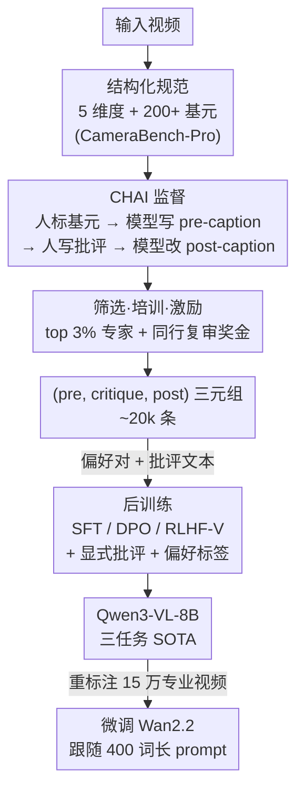

# Building a Precise Video Language with Human-AI Oversight

**会议**: CVPR 2026 (Highlight)  
**arXiv**: [2604.21718](https://arxiv.org/abs/2604.21718)  
**代码**: https://linzhiqiu.github.io/papers/chai/ (项目页，含数据与模型)  
**领域**: 视频理解 / 多模态VLM  
**关键词**: 视频字幕、可扩展监督、人机协作标注、批评式反馈、后训练

## 一句话总结
针对视频字幕"无规范、无监督、模型爱幻觉"的老问题，本文用一套**结构化规范（5 个维度 + 200+ 视觉基元）** 定义"该描述什么"，再用 **CHAI（批评式人机监督）** 让模型先写 pre-caption、人类只写"批评"指出错误、模型据此改成 post-caption，自然产出 (pre-caption, critique, post-caption) 三元组；用这些偏好和批评信号做 SFT/DPO 后训练，让开源 Qwen3-VL-8B 在字幕生成、奖励建模、批评生成三项任务上全面超过 Gemini-3.1-Pro，并能反哺 Wan2.2 文生视频跟随 400 词的长 prompt。

## 研究背景与动机
**领域现状**：视频-语言模型（VLM）靠语言监督学习视觉世界的"动力学"——什么物体、在哪、如何随时间变化。现有视频-文本数据集（MSR-VTT、ActivityNet、ShareGPT4Video、UltraVideo、Dream1K、PerceptionLM 等）要么靠人写、要么靠模型生成字幕，规模虽大但质量参差。

**现有痛点**：作者请专业标注员逐条审了 8 个主流数据集，归纳出两类系统性病灶。其一**缺规范（specification）**：标注员不知道"该描述什么、描述多细"，于是 ① 术语不精确（把"镜头平移 translation"说成"变焦 zoom"，把"全景 full shot"叫"特写 close-up"，把鱼眼畸变说成"圆形场景"）、② 信息缺失（只写主体动作、漏掉摄像机抖动/对焦变化/跟拍）、③ 主观描述（写"很有感染力"这类无法复核的情绪词）。其二**缺监督（oversight）**：④ 写作糟糕（错别字、事件顺序乱、多主体指代不清）、⑤ 视觉幻觉（模型自信地编造不存在的物体/运动，或说镜头静止其实在动）、⑥ 细节出错（人和模型都分不清画面"左/右"与主体"左/右"，漏掉细微手持运动）。

**核心矛盾**：写一条专业级长字幕（200–400 词）认知负荷极高——一个 5 秒短片可能有多个主体进出画面、各自动作 + 摄像机运动，写一条要十几分钟。让人从零写则慢且易错（痛点 ④⑥），让模型从零写则流畅但爱幻觉（痛点 ⑤）。二者各有短板，而现有数据集要么纯人写、要么纯模型写，**没有把两者的长处组合起来**。

**本文目标**：把"精确的视频语言"当成**要被构建（built）而非简单收集（collected）** 的东西，需要三块拼图：(1) 一套清晰的**规范**说明描述什么；(2) 一套可扩展的**监督框架**保证标注质量；(3) 一套能用少量专家监督就放大模型能力的**后训练策略**。

**切入角度**：借鉴 NLP 里的"可扩展监督（scalable oversight）"思想——当模型在某些技能上已超过人类（如写作流畅度），让模型干它擅长的（生成文本），人类专注于它擅长的（核查视觉事实）。把这套"分工"落到视频字幕上。

**核心 idea**：用**"模型写 + 人批评 + 模型改"** 替代"人从零写"或"模型从零写"，把人的有限注意力从"文本生成"转移到"事实核查"，并让这一过程顺带产出可直接用于后训练的偏好对与自然语言批评。

## 方法详解

### 整体框架
整篇工作是一条"从规范到数据到模型再到下游应用"的流水线，分三段：**(A) 先立规范**——和 100+ 专业影视创作者花一年时间，从下而上把电影行业的共享视觉词汇形式化成覆盖 *subject / scene / motion / spatial / camera* 五大维度、200+ 基元（primitives）的结构化规范（即 CameraBench-Pro），每个基元配定义、视频示例、边界情况和判定规则；**(B) 再用 CHAI 采数据**——在规范指导下，人类先标好"易漏但关键"的基元（如摄像机抖动、对焦平面、视角、景别、字幕叠层），模型据此起草 pre-caption，人类**只写批评**指出哪里错/漏及如何改，模型据批评产出 post-caption，外加严格的筛选-培训-激励质控；**(C) 后训练 + 应用**——CHAI 天然产出 (pre-caption, critique, post-caption) 三元组，既给 SFT 提供 post-caption 目标、又给 DPO/RLHF-V 提供现成偏好对（post 优于 pre）、还提供显式批评文本，训练后让开源模型反超闭源大模型，并用它重新标注 15 万条专业视频去微调 Wan2.2 文生视频。

### 关键设计

**1. 结构化规范：把"该描述什么"从模糊变可教**

针对痛点①②③（术语乱、信息漏、主观词），作者认为根因是"描述一个视频本身就有歧义"——你可以盯主体动作、也可以盯摄像机运动、还可以盯构图变化。解法是和 100+ 影视/游戏/动效创作者（2–5 年以上经验）合作，用**自下而上**的方式把他们工作中已在用的共享语言形式化：先让创作者自由描述各类视频、收集他们自然提到的方面，再归并成五大维度——*subject*（类型/属性/关系）、*scene*（视角/叠层/场景/时间）、*motion*（动作/交互/群体活动）、*spatial*（景别/画面位置/空间纵深/移动）、*camera*（播放速度/机位高度/角度/镜头/焦平面/稳定性/运动）。每个维度落到具体**基元**上，共 200+ 个，覆盖摄像机运动（~50，与 CameraBench 重叠）、摄像机设置（~100）、视频摄影学（~70）；每个静态属性（如焦平面、景别）在镜头**起止两端各标一次**以捕捉时间变化。关键是只描述**客观可观察**的视觉事实，明确排除主观情绪，从源头堵住痛点③。⚠️ 200+ 基元的完整分类法在 Moodio 技术报告（CameraBench-Pro）里，本文只给出概览，以原文为准。

**2. CHAI 批评式人机监督：让人写"批评"而不是写"字幕"**

这是本文方法核心，直接对治痛点④⑤⑥。流程五步：(1) 人类先标好所有视觉/运动基元（这些细节写字幕时最容易漏）；(2) 视频-语言模型据这些标签起草一条尽量高召回的 **pre-caption**；(3) 人类审 pre-caption，写一条**纠错型批评（correctional critique）**，说明哪里错、哪里漏、该怎么改；(4) 模型吸收批评产出精炼的 **post-caption**；(5) 必要时人类再改批评，直到字幕完全准确。为进一步提精度，标注员**先**完成 *subject* 和 *scene* 的 post-caption，再用它们提示模型生成更准的 *motion* 和 *spatial* pre-caption。这套分工的好处是把人的认知资源从"生成"转向"验证"：字幕因此 ① 更准（人专注核查而非措辞）、② 更全（模型更能遵循冗长指南、用满所有标注基元）、③ 更流畅（文本全由模型润色）。它和先前依赖"人工逐字编辑字幕"的做法（如 RLHF-V、PerceptionLM）的本质区别在于——人不再为措辞和从零组织语言耗费注意力。

**3. 筛选-培训-激励：保证"批评"本身足够专业**

人机协作只解决了分工，但人和模型仍可能漏掉细微空间/运动细节（如面向镜头的人"向他的左"其实出现在画面右侧）。作者用一套近乎招聘的质控来保证标注员真的够格：只招有内容创作经验者（影视、动效、游戏录制），所有申请者要做**六轮**基于基元的选择题考试（覆盖 150+ 视频，考摄像机运动/设置/摄影学），只录取 600+ 人中六轮排名前 20% 里的**前 3%**；录取后做**一个月带薪培训**练基元级判别力，再升任字幕角色、先影子学习 100 条作者亲写的金标准批评。更关键的是引入**复审员（reviewer）角色**和**准确率奖金**：复审员检查每条批评和 post-caption 并纠错，标注员若标对无误得奖金、复审员纠出真错也得奖金，双方都被激励去保证细节精确。这条质控正是后面消融里"第二阶段质量检查"带来大幅提升的来源。

**4. 后训练用显式偏好 + 批评双信号，而不仅是隐式比较**

CHAI 产出的三元组天然支持后训练：post-caption 是偏好输出、pre-caption 是被拒输出，构成现成偏好对。标准 **SFT** 直接学生成 post-caption；**DPO** 加对比目标 + KL 正则奖励偏好、惩罚被拒；**RLHF-V** 在此基础上对 pre/post 之间"被编辑的文本片段"加大梯度。但 DPO/RLHF-V 只**隐式**比较 preferred 与 rejected，本文进一步**显式**训练两件事：(1) **批评生成**——对每个 (video, caption) 学着生成参考批评，若字幕已正确则目标批评为 "*The caption is accurate and requires no edits.*"，从而习得推理时的自我批评能力；(2) **偏好标签**——把 (video, caption) 二分类为 {Yes, No}，Yes 表偏好的 post-caption、No 表被拒的 pre-caption，推理时仿照 VQAScore 用模型输出 "Yes" 的概率作为奖励分（比直接问 Likert 评分更可靠，见原文 scoring 消融）。这样同一份数据同时撑起字幕生成、奖励建模、批评生成三项能力。

### 损失函数 / 训练策略
- **SFT**：监督学习生成 post-caption（同时学批评文本与 Yes/No 偏好标签）。
- **DPO**：偏好对比目标 + KL 正则，奖励 post-caption、惩罚 pre-caption。
- **RLHF-V**：在 DPO 基础上对 pre→post 的编辑片段加大梯度权重。
- **奖励分**：推理时取 "Yes" token 概率作为标量奖励（VQAScore 式），用于奖励建模与推理时扩展（best-of-N 等）。
- 主力骨干为 Qwen3-VL-8B-Instruct（SFT 在其上效果最佳）。

## 实验关键数据

数据规模：CHAI 共采集 **~20k 三元组**（横跨电影、游戏、广告、UGC 约 4k 视频），其中 **5k 留作 benchmark**、其余训练。这是首个统一评测 **字幕生成 / 奖励建模 / 批评生成** 三任务、且每条视频覆盖 5 个维度的基准（规模远超 DREAM-1K、TUNA-Bench 等 ~1k 级别）。

### 主实验
字幕生成与批评生成报 BLEU-4，奖励建模报二分类准确率（随机=50）。下表取每类代表（数值为各方法的 **Avg**，五维度平均）：

| 方法 | 字幕生成 (BLEU-4) | 奖励建模 (Acc) | 批评生成 (BLEU-4) |
|------|------|------|------|
| Qwen3-VL-8B-Instruct（原始） | 3.7 | 38.4 | 1.3 |
| GPT-5（闭源） | 5.7 | 59.5 | 2.8 |
| Gemini-2.5-Pro（闭源） | 6.2 | 62.0 | 3.0 |
| Gemini-3.1-Pro（闭源） | 5.1 | 49.9* | 3.3 |
| SFT (Caption-only) | 12.0 | 50.9 | 5.5 |
| **SFT (Full data)** | **18.2** | **89.8** | **41.7** |
| RLHF-V (Full data) | 15.7 | 81.0 | 25.7 |
| DPO (Full data) | 15.8 | 80.8 | 25.5 |

（*Gemini-3.1 不支持 logprobs，奖励建模直接用文本输出当 0/1 二值分。）

关键结论：(1) 现成模型在 *subject/scene* 上还行，但在 *motion/camera* 上普遍很差——这两维在训练数据里被低估；(2) 仅用 **少量专家监督**，Full-data SFT 让 8B 开源模型在三项任务上全面超过 Gemini-3.1-Pro；(3) 加入**显式偏好 + 批评**信号（Full data 对比 Caption-only）让 SFT 和 RL 全部大涨——奖励建模从 ~50 跳到 ~90、批评生成从 5.5 跳到 41.7。

### 消融实验
**批评质量决定后训练成败**（用 Gemini-2.5 在金标准批评上注入受控错误，破坏精确度/召回/建设性三者之一）：

| 批评类型 | Precision | Recall | Constructive | 字幕 | 奖励 | 批评 |
|----------|-----------|--------|--------------|------|------|------|
| Blind Gemini-2.5（只看 pre-caption 凭空编） | — | — | — | 10.9 | 44.5 | 21.1 |
| Gemini-2.5（看视频 + pre-caption） | — | — | — | 12.7 | 62.0 | 26.2 |
| 不精确批评（错点替换） | ✗ | ✓ | ✓ | 12.1 | 47.1 | 21.9 |
| 不完整批评（删必要纠正） | ✓ | ✗ | ✓ | 12.5 | 56.6 | 28.7 |
| 非建设性批评（只说错、不给改法） | ✓ | ✓ | ✗ | 13.4 | 67.2 | 32.9 |
| 本文批评（无质量检查） | — | — | — | 14.8 | 73.1 | 35.7 |
| **本文批评（含二阶段质量检查）** | ✓ | ✓ | ✓ | **18.2** | **89.8** | **41.7** |

### 关键发现
- **三项批评属性缺一不可**：破坏精确度/召回/建设性任何一个，三任务都明显掉分；其中破坏"精确度"（注入错误信息）伤害最大（奖励 89.8→47.1）。
- **第二阶段质量检查贡献巨大**：从"无质检"到"有质检"，字幕 14.8→18.2、奖励 73.1→89.8、批评 35.7→41.7——印证了筛选-培训-复审-激励这套质控不是摆设。
- **当前模型还写不好批评**：即便给 Gemini-2.5 看了视频，它生成的批评仍很差（字幕仅 12.7、奖励 62.0），说明"产出准确、完整、有建设性的批评"对现有模型仍是难题，人类专家不可替代。
- **下游应用验证**：用后训练 Qwen3-VL 重标注 15 万专业视频去微调 Wan2.2，文生视频能跟随长达 400 词的 prompt，对 dolly zoom、等距(2.5D)视角、rack focus、Dutch angle 等专业摄影效果实现更细控制；200 样本评测显示显著优于"零样本 Qwen3-VL 字幕微调的 Wan"。

## 亮点与洞察
- **把"可扩展监督"从 NLP 搬到视频字幕**：核心洞见是"人和模型各有所长"——模型擅长流畅写作、人擅长视觉核查，让人写批评而非写字幕，既提质又提效。这个"生成 vs 验证"的分工思路可迁移到任何"产出长且专业、但易幻觉"的多模态标注场景（如医学报告、文档理解）。
- **数据天然多用途**：CHAI 一次产出的三元组同时撑起字幕/奖励/批评三任务训练，把"采数据"和"造偏好信号"合二为一，省掉单独跑偏好标注的成本。
- **"批评质量 > 批评数量"**：消融把它量化得很彻底——先前工作（MM-RLHF、OpenAI GDC）常收集"只指错不给改法"的非建设性批评，本文证明这会显著拖累后训练，提供了一条很实用的数据质控准则。
- **小钱办大事**：用学术级资源（精挑 3% 专家 + 适量监督）就把 8B 开源模型推到超过闭源 Gemini-3.1-Pro，对资源有限的团队是很强的范式示范。

## 局限性 / 可改进方向
- **作者承认**：当前聚焦视频"理解"，视频"生成"的专门 benchmark 尚未建立；未来可用更强的批评模型去辅助人类标注，进一步放大规模。
- **重度依赖专家与规范**：整套质量建立在 100+ 专业创作者一年的协作、六轮考试筛人、一个月培训之上，复现门槛高；规范（CameraBench-Pro 完整分类法）放在外部技术报告，本文细节有限，⚠️ 完整基元定义以 Moodio 报告为准。
- **横向分数不可直接比**：作者自己强调不同数据集的视频内容/规范/详细度差异大，表中分数仅作参考；BLEU-4 作为长字幕主指标也偏表面，更细的 LLM-as-judge/ROUGE 指标在附录。
- **语言/文化覆盖**：标注员来自美国和中国，规范是否对其他影视传统、其他语言同样适用未充分验证。

## 相关工作与启发
- **vs 纯模型生成的数据集（ShareGPT4Video / UltraVideo / MiraData）**：它们让 VLM 按人给的指令直接写字幕，流畅但爱幻觉、无质控；本文保留模型写作的流畅性，但插入"人写批评"这一核查环节，从源头压制幻觉。
- **vs 纯人写的数据集（MSR-VTT / ActivityNet / Dream1K）**：人写慢、易有错别字/顺序乱/指代不清，且无规范导致术语乱；本文让人专注"验证 + 标基元"，把生成交给模型，效率与一致性都更高。
- **vs RLHF-V / PerceptionLM（人工逐字编辑字幕）**：它们仍要人去改写字幕文本；本文让人写自然语言批评、模型据批评改，认知负荷更低，且批评本身就是可训练的监督信号。
- **vs OpenAI GDC / MM-RLHF（批评式监督）**：先前批评常只"指错不给改法"（非建设性）；本文用消融证明建设性是后训练成败关键，并用工作流强制批评同时满足精确、完整、建设性三性。
- **启发**：当模型在某子技能上超过人类时，与其追求"人全程主导"，不如重新设计分工——让人聚焦自己仍占优的环节（视觉核查），并把这个核查过程结构化成可训练数据，这是"用人监督超人模型"的一条可落地路径。

## 评分
- 新颖性: ⭐⭐⭐⭐⭐ 把 NLP 的可扩展监督系统性落到视频字幕，"人写批评+模型改"+三元组多用途的组合很新。
- 实验充分度: ⭐⭐⭐⭐⭐ 20+ 开闭源基线、三任务统一评测、批评质量消融彻底，还有文生视频下游验证。
- 写作质量: ⭐⭐⭐⭐⭐ 痛点编号(①–⑥)贯穿全文、规范/监督/后训练三段清晰，图表对应严谨。
- 价值: ⭐⭐⭐⭐⭐ 开源数据/规范/模型 + 一套可复用的人机协作数据质控范式，对专业级视频理解与生成都有推动。

<!-- RELATED:START -->

## 相关论文

- [\[CVPR 2026\] Your One-Stop Solution for AI-Generated Video Detection](your_one-stop_solution_for_ai-generated_video_detection.md)
- [\[CVPR 2026\] Learning to Assist: Physics-Grounded Human-Human Control via Multi-Agent Reinforcement Learning](learning_to_assist_physics-grounded_human-human_control_via_multi-agent_reinforc.md)
- [\[CVPR 2026\] CoCoVideo: The High-Quality Commercial-Model-Based Contrastive Benchmark for AI-Generated Video Detection](cocovideo_the_high-quality_commercial-model-based_contrastive_benchmark_for_ai-g.md)
- [\[CVPR 2026\] Dual-level Adaptation for Multi-Object Tracking: Building Test-Time Calibration from Experience and Intuition](tcei_test_time_calibration_experience_intuition_mot.md)
- [\[ICML 2026\] ProAct-VL: A Proactive VideoLLM for Real-Time AI Companions](../../ICML2026/video_understanding/proact-vl_a_proactive_videollm_for_real-time_ai_companions.md)

<!-- RELATED:END -->
