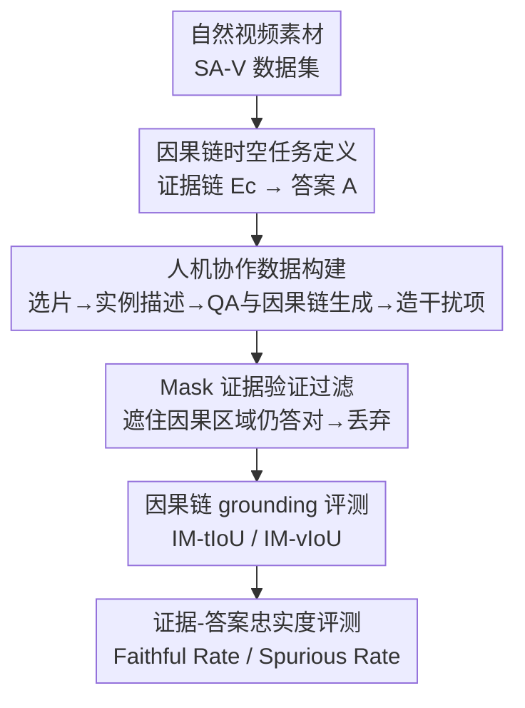

# CaST-Bench: Benchmarking Causal Chain-Grounded Spatio-Temporal Reasoning for Video Question Answering

**会议**: CVPR 2026  
**arXiv**: [2605.23216](https://arxiv.org/abs/2605.23216)  
**代码**: 无  
**领域**: 视频理解 / 多模态VLM / 视频问答 / 因果推理 / Benchmark  
**关键词**: 因果链、时空 grounding、视频问答、VLM 评测、忠实度

## 一句话总结
CaST-Bench 提出"因果链时空 grounding 视频问答"这一新任务——模型不仅要答对，还要把答案落到一条由时间段 + bounding box 标注的因果证据链上；通过人机协作流水线构建了 1,015 段视频、2,066 道题的高质量数据集，并设计了同时评估答案正确性与证据 grounding 的指标，实测 15 个主流 VLM 表现远低于人类（最佳 50.34% vs 人类 91.89%）。

## 研究背景与动机

**领域现状**：VLM 在视频理解上进步很快，但绝大多数视频问答基准（MVBench、Video-MME 等）问的都是"描述性"问题——"那个女人的包是什么颜色"，模型只要定位并描述物体/动作即可，本质是表层感知。

**现有痛点**：真正的因果推理要回答"为什么"（"那个女人为什么停下来"），需要模型主动去视频里搜寻一条因果链：既要找到原因证据（"小孩弯下腰"），也要找到结果证据（"女人在等待"），而且关键证据往往不在问题文本里出现。现有基准在这件事上有三类缺陷：① 大多数完全不要求推理过程有视觉 grounding；② 少数（如 NExT-GQA）只做时间定位，无法应对杂乱场景里的空间歧义；③ 还有些只为"问题中提到的物体"提供 grounding，而忽略了因果相关的隐藏证据。

**核心矛盾**：因果推理的正确性高度依赖能否定位到"真正起因果作用的时空证据"，但现有基准既没有提供这种细粒度的链式证据标注，也没有能区分"答对是靠真证据还是靠伪相关（confounder）"的评测指标，导致无法严格衡量 VLM 的因果能力。

**本文目标**：构建一个能联合考核「答得对」+「证据链找得准」的视频因果推理基准，覆盖时间段与空间框两种细粒度 grounding。

**切入角度**：作者把视频因果 QA 形式化成一张因果图——给定视频 $V$ 与问题 $Q$，模型要发现并 grounding 出原因证据 $V_c$ 和结果证据 $V_e$，连成因果链得到答案 $A$，同时要抵抗会引入伪相关的混淆因子 $C$。

**核心 idea**：用"因果链 = 多条带时间戳和 bbox 轨迹的证据"作为标注与评测的中心对象，让 grounding 准确性成为可量化、可诊断的一等公民。

## 方法详解

### 整体框架
CaST-Bench 不是一个模型，而是"任务定义 + 数据构建流水线 + 评测套件"三件套。任务输入是视频 $V$ 和问题 $Q$，模型需先输出一条变长证据链 $E_C=[E_1,\dots,E_K]$ 再给出答案 $A$；每条证据 $E_i$ 包含起止时间 $t_{start,i}, t_{end,i}$、文字理由 $R_i$ 和一组按 1-FPS 时间戳索引的 bounding box $B_i=\{s_j:b_j\}$。数据这一侧由一条多阶段人机协作流水线产出：先从自然视频里选难度足够的素材，再为每个被追踪实例生成时空细粒度描述，然后由"因果思考 VLM"基于这些描述生成带因果链的 QA，接着造干扰项并用三步过滤（含一个新颖的 mask 验证）保证题目难且因果链完整。最后用一套自定义指标，把"答案对不对"和"证据链准不准"拆开评。

### 关键设计

**1. 因果链时空任务定义：把"答对"和"找对证据"绑成一个目标**

针对"现有基准只看答案、不看推理是否落在真证据上"这个痛点，CaST-Bench 重新定义了任务输出：模型不能直接吐答案，必须先产出一条结构化因果链，链上每条证据都带显式时间段 $[t_{start,i}, t_{end,i}]$、文字理由 $R_i$ 和逐帧 bbox 映射 $B_i=\{s_j:b_j\}_{j=1}^{P_i}$（$s_j$ 是 1-FPS 时间戳，$b_j=[x_{min},y_{min},x_{max},y_{max}]$）。这条链同时编码了"原因证据 $V_c$"和"结果证据 $V_e$"，并要求抵抗会造成伪相关的混淆因子 $C$。这样设计的好处是：grounding 准确性从"附加信息"变成任务的强制组成部分，既能逼模型基于真实因果线索而非语言/视觉捷径作答（提升准确率），又能把视觉证据连同答案一起呈现给用户（提升透明度与可信度）

**2. 人机协作数据构建流水线：用 VLM 当苦力、人类当质检**

针对"既要造因果链 QA、又要配细粒度时空证据，纯人工成本爆炸、纯 AI 又不可靠"的痛点，作者设计了一条多阶段流水线。视频来源刻意避开电影/电视剧（构图太工整、空间 grounding 太简单），改用 SA-V 数据集里带专家实例分割与追踪的自然视频，再用 VLM 过滤出"多物体各自在做不同事"的复杂场景，得到 1,015 段。接着是关键的实例描述阶段：视频里小物体多、互相干扰，VLM 直接描述容易出错，于是作者把"静态全帧 + 围绕目标实例裁剪的视频片段"组合成精心设计的视觉/文本 prompt 喂给 VLM 生成动作描述，再由人类专家用定制标注工具复核改写，最终产出 10,728 条高质量动态实例描述。然后让一个"因果思考 VLM"（Gemini-2.5-Pro）以实例描述 + 视频 + 问题类型 taxonomy 为输入，生成带因果链的结构化 QA——问题覆盖因果解释（CE）、反事实推理（CR）、预测预期（PA）、推断描述（ID）四大类。这种分工让大规模因果链标注变得可行，同时靠人类质检守住了证据时间戳和文字的质量

**3. 干扰项 + Mask 证据验证过滤：保证"答对必须靠看视频"**

针对"基准容易被语言先验或数据集偏差刷分"的痛点，作者从两端下手。造干扰项时按混淆来源分两类：文本型干扰项（只给问题文本、不看视频，让 LLM 生成貌似合理但错误的选项，抓"只读文本就猜"的模型）和视频型干扰项（挑视频里因果无关的实例造选项，抓"被视觉偏差带跑"的模型），每题共 6 个选项。过滤则是三步：① 文本过滤——LLM 不看视频就能答对的题删掉；② 新颖的视频 mask 过滤——把因果证据所在的所有时空区域遮黑，再让 VLM 答，若仍答对说明因果链不完整或题目能靠偏差解出，丢弃；③ 人工终审证据、答案、因果链。三轮过滤后只剩 40% 的初始 QA，从而保证留下的题既难、因果链又完整

**4. 解耦的评测套件：把 grounding 质量和答案忠实度量化出来**

针对"以前只有单目标时空定位指标、应付不了多实例多时段的因果链"的痛点，作者先用贪心匹配算法按时空重叠把预测实例和 GT 实例配对，再在配对上算两个指标：IM-tIoU（实例匹配时间 IoU，衡量时间准确性）

$$\text{IM-tIoU}=\frac{1}{|G|}\sum_{(p,g)\in M}\frac{|\text{span}(p)\cap\text{span}(g)|}{|\text{span}(p)\cup\text{span}(g)|}$$

和 IM-vIoU（在时间 IoU 基础上再乘上重叠帧上的逐帧空间 IoU 均值，衡量时空准确性）。更关键的是引入忠实度指标：忠实答案率 $\mathcal{F}=\mathbb{E}[\mathbb{I}(\text{Acc}=1)\cdot\mathbb{I}(\text{IM-vIoU}\geq\tau_{st})]$ 统计"答对且证据 grounding 也好"的比例，伪答案率 $\mathcal{S}=\mathbb{E}[\mathbb{I}(\text{Acc}=1)\cdot\mathbb{I}(\forall p,\text{vIoU}_p<\tau_{st})]$ 统计"答对但证据完全没 ground 准"的比例（实验取 $\tau_{st}=0.1$）。这套指标第一次让"这个答案到底是真懂还是蒙对的"变得可测量，也是本基准最核心的诊断价值所在

### 一个完整示例
以"那个女人为什么停下来"这道题走一遍：模型拿到视频 $V$ 和问题 $Q$ 后，要主动搜寻因果链——先定位原因证据 $V_c$"小孩弯下腰"（给出它出现的时间段 + 逐帧追踪框），再定位结果证据 $V_e$"女人在等待"（同样带时空标注），把两条证据连成链后推出答案"她在等小孩"。评测时：若预测证据的时空框和 GT 重叠达标（IM-vIoU ≥ 0.1）且答案正确，记一次"忠实答对"；若答案对但证据框完全没对上，则记入"伪答对"——这正是当前 VLM 的常态，说明它多半是靠语言先验蒙对而非真看到了因果线索。

## 实验关键数据

### 主实验
评测 4 个闭源 + 多个开源 VLM 变体（共 15 个代表性模型），所有模型必须先生成时空因果链再给答案；开源模型用 LLaMA-Factory 本地跑，GPT-5 系列因无原生视频输入改喂 1-FPS 均匀采样帧。

| 模型 | MCQ 答案准确率 | IM-tIoU(时间) | IM-vIoU(时空) | 忠实率 ℱ | 伪答率 𝒮 |
|------|------|------|------|------|------|
| 随机猜 | 16.67 | – | – | – | – |
| Gemini-2.5-Pro(纯文本) | 23.14 | – | – | – | – |
| **人类** | **91.89** | – | – | – | – |
| Gemini-2.5-Pro | 50.34 | 21.53 | 2.46 | 7.60 | 42.26 |
| Gemini-2.5-Flash | 45.60 | 27.63 | 3.52 | 9.97 | 33.35 |
| GPT-5 | 46.32 | 26.61 | 4.31 | 12.68 | 32.91 |
| Qwen3-VL-4B-Instruct | 45.30 | 11.21 | 0.93 | 2.76 | 42.30 |
| InternVL-3.5-30B-A3B | 44.53 | 8.33 | 0.25 | 0.48 | 44.00 |
| Qwen2.5-VL-7B-Instruct | 41.09 | 3.72 | 0.09 | 0.29 | 40.80 |

最佳闭源模型 Gemini-2.5-Pro 仅 50.34%，最佳开源 Qwen3-VL-4B 仅 45.30%，离人类 91.89% 差一大截。纯文本输入 Gemini 只有 23.14%，证明视觉证据不可或缺。所有模型的时空 grounding（IM-vIoU）都极低（闭源 2–4%、开源大多 <1%），伪答率却高达 30–44%——意味着大量"答对"其实是建立在没 ground 准的证据上。

### 消融实验
| 配置 | Gemini-2.5-Pro | GPT-5 | GLM-4.1V-9B | Qwen2.5-VL-7B |
|------|------|------|------|------|
| w/o 因果链(直接答) | 45.98 | 43.90 | 38.09 | 40.90 |
| w/ 自生成因果链 | 50.34 | 46.32 | 39.55 | 41.09 |
| Given GT 因果链 | 75.61 | 71.88 | 65.25 | 59.68 |

按问题类型看 Given GT 因果链下的准确率：反事实推理（CR）最难（30% 左右），因果解释（CE）最容易（Gemini 56.83），预测预期（PA）和推断描述（ID）居中。

### 关键发现
- **因果链是核心瓶颈**：从"自生成链"到"喂入 GT 链"准确率猛涨约 20–25 个点（Gemini 50.34→75.61），且作者已用 LLM 抹去 GT 理由里可能泄露答案的句子、只留事实描述，说明这 20–25 点反映的是"正确因果 grounding 的贡献"而非答案泄露——当前模型自产因果链与理想链之间存在巨大且一致的差距。
- **答对 ≠ 看对**：高伪答率（30–44%）+ 极低 IM-vIoU 共同说明，模型常靠伪相关蒙对；忠实率最高的 GPT-5 也才 12.68%。
- **"思考"变体未必更强**：Qwen3-VL-8B-Instruct 反而比其 Thinking 版准确率高，过度的文本"思考"可能干扰视觉-语言对齐、甚至导致漏答。
- **规模不保证 grounding**：InternVL-3.5-30B 比小模型 MCQ 更高，但 grounding/忠实度没有相应提升；多个模型家族里越大的变体伪答率反而越高。
- **干扰项分析**：文本型干扰项最具迷惑性（trap rate 最高），视频型最低，说明模型仍偏好"听起来合理的文字选项"而非真实视觉证据。

## 亮点与洞察
- **把"忠实度"做成可测指标**：$\mathcal{F}$/$\mathcal{S}$ 这对忠实率/伪答率，第一次把"答对到底是真懂还是蒙对"量化出来，比单看准确率更能诊断模型的真实因果能力，这个思路可迁移到任何"答案 + 证据"型评测。
- **Mask 证据验证过滤很巧**：遮掉因果证据区域后还能答对就丢题，等于用反事实的方式自动筛掉"靠偏差可解"的题，保证了每道留下来的题都真依赖那条因果链——这是个可复用的数据集去偏 trick。
- **GT 因果链消融把瓶颈钉死在"链构建"上**：通过对照 w/o、w/、Given GT 三档，并提前消除答案泄露，干净地证明了"模型不是不会推理，而是找不准证据"，为后续研究指明方向（先攻 grounding 再谈推理）。
- **数据构建的"VLM 生成 + 人类质检"分工**对任何需要细粒度时空标注的数据集都有借鉴价值，尤其是用"全帧 + 实例裁剪片段"组合 prompt 来缓解小物体描述错误。

## 局限与展望
- **只有基准、没有方法**：本文诊断出"因果链构建是瓶颈"，但没有提出能改进 grounding 的模型方法，留给后续工作。
- **规模偏小**：2,066 题相比 MVBench(4000)、CG-Bench(12129) 等并不大，主要因为 40% 的严苛过滤率；覆盖面与统计显著性上可能受限。
- **依赖 Gemini-2.5-Pro 当生成与评测引擎**：因果链 QA 由 Gemini 生成、开放式评测又用它当 LLM judge，存在潜在的"出题人即裁判"偏置，可能对 Gemini 系模型略有利（其 MCQ 也确实最高，需注意 caveat）。
- **视频偏短**：平均时长仅 13.68s、证据平均 5.65s，长视频/长程因果链的难度未被覆盖。
- **改进思路**：可引入专门的时空证据检索/grounding 模块（如显式定位头）再做因果推理，或用 GT 因果链做监督微调来缩小自生成链与理想链的差距。

## 相关工作与启发
- **vs MVBench / Video-MME**: 它们以描述性 MCQ 为主、完全无视觉 grounding；CaST-Bench 聚焦因果问题且强制要求链式时空 grounding，难度与诊断性质完全不同。
- **vs NExT-GQA / V-STaR**: 这类做时空定位，但只针对"问题中提到的物体"做直接定位，不要求主动发现隐藏的因果证据链；CaST-Bench 是首个同时支持空间 + 时间链式证据 grounding 并配套 grounding 准确率评测的基准。
- **vs Causal-VidQA / Video-Holmes / VR-Bench**: 它们也想测因果推理，但要么只给文字线索、要么缺时空标注、要么不评 grounding 准确率；CaST-Bench 补上了"链式时空证据 + 评测"这块空白（见 Table 1）。

## 评分
- 新颖性: ⭐⭐⭐⭐⭐ 首个同时要求链式时空证据 grounding + 配套忠实度评测的视频因果基准，任务定义和 $\mathcal{F}/\mathcal{S}$ 指标都是新东西。
- 实验充分度: ⭐⭐⭐⭐ 覆盖 15 个主流 VLM、四维度评测 + GT 链消融 + 干扰项/类别分析，但缺方法侧验证、规模偏小。
- 写作质量: ⭐⭐⭐⭐ 动机清晰、任务定义与指标公式严谨，流水线讲得明白。
- 价值: ⭐⭐⭐⭐⭐ 把"答对≠看对"这个长期被准确率掩盖的问题量化出来，且干净地证明因果链构建是瓶颈，对后续 VLM 研究有实打实的指导意义。

<!-- RELATED:START -->

## 相关论文

- [\[CVPR 2026\] Streaming Video Crime Anticipation with Spatio-Temporal Causal Reasoning](streaming_video_crime_anticipation_with_spatio-temporal_causal_reasoning.md)
- [\[CVPR 2026\] MovieRecapsQA: A Multimodal Open-Ended Video Question-Answering Benchmark](movierecapsqa_a_multimodal_open-ended_video_question-answering_benchmark.md)
- [\[ECCV 2024\] TimeCraft: Navigate Weakly-Supervised Temporal Grounded Video Question Answering via Bi-directional Reasoning](../../ECCV2024/video_understanding/timecraft_navigate_weakly-supervised_temporal_grounded_video_question_answering_.md)
- [\[CVPR 2026\] HERBench: A Benchmark for Multi-Evidence Integration in Video Question Answering](herbench_a_benchmark_for_multi-evidence_integration_in_video_question_answering.md)
- [\[CVPR 2026\] Ego-Grounding for Personalized Question-Answering in Egocentric Videos](ego-grounding_for_personalized_question-answering_in_egocentric_videos.md)

<!-- RELATED:END -->
