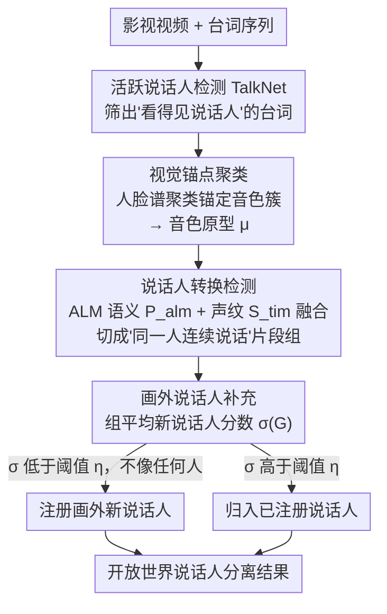

# CineSRD: Leveraging Visual, Acoustic, and Linguistic Cues for Open-World Visual Media Speaker Diarization

**会议**: CVPR 2026  
**arXiv**: [2603.16966](https://arxiv.org/abs/2603.16966)  
**代码**: [有](https://github.com/BSTLL/CineSRD)  
**领域**: 视频理解  
**关键词**: 说话人分离, 多模态融合, 视觉锚点聚类, 音频语言模型, 开放世界

## 一句话总结

提出 CineSRD，一个免训练的多模态说话人分离框架，通过视觉锚点聚类进行说话人注册，结合音频语言模型进行说话人转换检测，解决影视作品中长视频、大量角色、音视频不同步等开放世界挑战。

## 研究背景与动机

传统说话人分离（Speaker Diarization）主要聚焦于会议、访谈等受限场景，说话人数量少、声学条件简单。将其扩展到影视作品等视觉媒体领域面临四大挑战：

**长视频理解**：电影通常2小时，电视剧累计数十小时

**大量说话人**：单部作品可包含数十甚至数百个角色

**音视频不同步**：角色说话时脸可能不在画面中（旁白、画外音）

**野外变化性**：真实拍摄环境中声学条件和视觉动态复杂多变

现有方法从单模态（音频）到双模态（音视频），再到三模态（音视频+文本）逐步发展，但仍局限于简单场景。

## 方法详解

### 整体框架

CineSRD 要解决的是把说话人分离从会议室搬进影视作品后冒出来的开放世界难题：视频动辄几十小时、角色成百上千、说话人的脸还经常不在画面里。它的整体思路是**不训练任何模型，而是把一串现成的预训练模型编排成一条三阶段流水线**——先靠"看得见脸"的台词把可靠说话人注册下来当锚点，再用音频语言模型判断相邻台词有没有换人，最后把那些从头到尾没露脸的画外说话人补回来。三阶段层层递进：视觉锚点聚类给出一批高置信度的说话人原型，转换检测在此基础上把台词切成连续的"同一人说话"片段，画外补充则负责捞回视觉模态够不着的角色。

### 关键设计

**1. 视觉锚点聚类：用判别力更强的人脸特征当聚类的"定盘星"**

纯音频聚类在影视场景里很脆——音色相近的角色、嘈杂的现场录音都会把簇分错。CineSRD 的应对是：对每条台词 $s$ 先用活跃说话人检测（TalkNet）判断对应视频片段里有没有人正在说话，对这些"看得见说话人"的台词，一路用 CurricularFace 抽人脸嵌入 $f_v(s)$ 做谱聚类得到视觉标签 $c_v(s)$，另一路用 ERes2NetV2 抽音色嵌入 $f_a(s)$ 聚类得到音频标签 $c_a(s)$。关键在于人脸特征比音色判别力强得多，所以它**以视觉簇为锚点**，在每个视觉簇 $\mathcal{S}_i$ 内部对音频标签做多数投票，挑出占比最高的那个音色簇：

$$\hat{c}_a(i) = \underset{k}{\arg\max}\, |\{s \in \mathcal{S}_i \mid c_a(s) = k\}|$$

再取该音色簇内台词的平均音色嵌入作为这个说话人的**音色原型 $\mu_i$**。这样得到的原型既绑定了一张稳定的脸、又带上了一段干净的声纹，后续两个阶段都拿它当参照系，避免了纯音频聚类一步错步步错的问题。

**2. 说话人转换检测：让音频语言模型从语义层面判断"这句和上句是不是同一个人"**

光靠声纹相似度区分不开音色接近的角色，尤其是对白你来我往时。CineSRD 把判断交给音频语言模型 Qwen2-Audio-7B：一次喂进连续 10 条台词及其音频，让它结合台词的语义连贯性、对话逻辑，为每一对相邻台词输出"是否同一说话人"的概率 $P_{alm}$。同时保留音色嵌入余弦相似度归一化后的 $S_{tim}$ 作为声学证据，两者加权融合成最终的转换检测分数：

$$P_{std} = w \cdot P_{alm} + (1-w) \cdot S_{tim}$$

其中 $w = 0.45$ 用来平衡语义判断和声学证据的话语权。引入 ALM 的好处是它能用"这句是反问、上句在质问，语气在接龙"这类语义信号补上纯声学分不开的边界，这也是文本模态能在中文方言等硬场景把 DER 进一步压下去的原因。

**3. 画外说话人补充：给"没露过脸"的角色一个被注册进来的机会**

旁白、画外音这些角色全程不在画面里，前两步基于视觉锚点的注册根本覆盖不到。CineSRD 先用转换检测的结果把台词按"连续同一说话人"切成若干组 $G$，再对每条台词算一个新说话人分数：

$$\sigma(s) = \mathbb{I}(s) + (1 - \mathbb{I}(s)) \max_{1 \leq i \leq n_v} \text{sim}(f_a(s), \mu_i)$$

其中 $\mathbb{I}(s)$ 表示这条台词是否检测到活跃说话人——若有则 $\sigma(s)=1$ 视为已被可靠覆盖；若没有，就退而取它的音色和所有已注册原型 $\mu_i$ 的最大相似度。一整组台词的平均分 $\sigma(G)$ 若低于阈值 $\eta=0.45$，说明这组声音和现有任何说话人都不像，于是把它注册成一个新说话人（或并入此前已补充的某个画外说话人）。这一步专门把视觉模态的盲区补齐，让最终的说话人集合不再受"必须露脸"的限制。

### 一个完整示例

设想一段电视剧片段：前 8 条台词里角色 A、B 频繁出镜对话，第 9、10 条切到一段没有任何人脸的旁白。流水线这样跑：**视觉锚点聚类**先处理前 8 条——TalkNet 确认它们都有活跃说话人，人脸谱聚类把它们分成两个视觉簇（A、B），各自簇内对音色簇投票，得到 A、B 两个绑定了脸的音色原型 $\mu_1, \mu_2$。**转换检测**接着扫描相邻台词对，发现第 3、4 条之间 $P_{std}$ 骤降，判定此处换了人，于是把前 8 条切成若干"同一人连续说话"的组。**画外补充**最后处理第 9、10 条旁白：它们没检测到活跃说话人（$\mathbb{I}=0$），算出的音色与 $\mu_1, \mu_2$ 的最大相似度都很低，组平均分 $\sigma(G) < 0.45$，于是注册成一个全新的"旁白"说话人 C。最终这段被标注为 A、B、C 三个说话人，其中 C 全程没露脸却依然被正确捞了出来。

### 损失函数 / 训练策略

CineSRD 为**免训练**框架，没有任何训练过程，全靠编排预训练模型组合：活跃说话人检测用 TalkNet，人脸检测与嵌入用 RetinaFace + CurricularFace，音色嵌入用 ERes2NetV2，语义层判断用 Qwen2-Audio-7B（temperature=1.2, top_k=50, top_p=0.95）。所有可调项只有融合权重 $w=0.45$ 和补充阈值 $\eta=0.45$ 两个超参数。

## 实验关键数据

### 主实验

**表5：SubtitleSD 基准上的视觉媒体说话人分离（DER↓ / JER↓）**

| 方法 | 模态 | Chinese DER | Chinese JER | English DER | English JER |
|------|------|------------|------------|------------|------------|
| AHC | A | 0.1398 | 0.4522 | 0.1248 | 0.4102 |
| EC2P | AVT | 0.1345 | 0.3801 | 0.1180 | 0.3557 |
| **CineSRD** | AV | 0.0833 | 0.4144 | 0.1027 | 0.3133 |
| **CineSRD** | **AVT** | **0.0756** | **0.3197** | **0.0893** | **0.2909** |

CineSRD 仅用双模态（AV）已超过 EC2P 的三模态（AVT）结果。

**表6：AVA-AVD 传统基准**

| 方法 | 模态 | DER↓ | SPKE↓ |
|------|------|------|-------|
| EC2P | AV | 0.2032 | 0.1740 |
| **CineSRD (SC)** | **AV** | **0.1969** | **0.1677** |

### 消融实验

原文通过对比不同模态组合（AV vs AVT）展示文本模态的增益：
- Chinese：DER 从 0.0833 降至 0.0756（-9.2%）
- Chinese-Hard（方言）：DER 从 0.1018 降至 0.0947（-7.0%）
- 文本模态通过 ALM 提供语义连贯性推理，有效解决音色相似角色的区分

### 关键发现

1. **视觉锚点策略至关重要**：人脸特征判别力远高于音色，以视觉为锚点可大幅降低聚类错误
2. **免训练方案的强泛化力**：CineSRD 在自建 SubtitleSD 和传统 AVA-AVD 基准上均取得最优
3. **方言场景鲁棒**：在 Chinese-Hard（317个说话人、多方言）极端条件下 DER 仅 0.0947

## 亮点与洞察

1. **问题定义新颖**：首次系统性将说话人分离扩展到影视作品的开放世界场景，并构建专用基准
2. **免训练设计务实**：通过精心编排预训练模型的流水线，避免了在特定领域训练的高成本
3. **层级式策略设计**：先视觉锚点注册→语义转换检测→画外补充，逐步完善说话人标注
4. **SubtitleSD 基准贡献**：覆盖中英双语+方言，92.5小时视频，平均21.2个说话人/视频

## 局限与展望

1. 依赖活跃说话人检测模型的准确性，当人脸检测失败时退化为纯音频方案
2. 对旁白、画外音等完全无视觉线索的场景，新说话人补充策略可能遗漏
3. ALM 推理成本较高（Qwen2-Audio-7B），长视频处理效率需考量
4. 当前假设每条台词仅一个说话人，未处理多人同时说话的情况

## 相关工作与启发

- **AVR-Net**：引入可学习模态掩码动态调整视觉/音频权重
- **EC2P**：音视频+语义三模态约束传播优化相似矩阵
- **TalkNet / CurricularFace**：关键预训练组件
- 免训练的"编排预训练模型"路线值得借鉴：每个阶段的模型（人脸/音色/ALM）都可独立替换升级，无需重训整条流水线即可跟进更强的基座

## 评分

- **新颖性**: ★★★★☆ — 场景定义新颖，方法组合有创意
- **技术深度**: ★★★☆☆ — 免训练方案技术深度有限，但工程设计巧妙
- **实验充分性**: ★★★★☆ — 自建基准+传统基准验证，消融充分
- **写作清晰度**: ★★★★☆ — 问题刻画清晰，方法流程图表达力强

<!-- RELATED:START -->

## 相关论文

- [\[CVPR 2026\] VRR-QA: Visual Relational Reasoning in Videos Beyond Explicit Cues](vrr-qa_visual_relational_reasoning_in_videos_beyond_explicit_cues.md)
- [\[CVPR 2026\] Beyond Explicit Language: Plug-and-Play Visual-to-Linguistic Modeling Toward General Object Tracking](beyond_explicit_language_plug-and-play_visual-to-linguistic_modeling_toward_gene.md)
- [\[CVPR 2026\] OmniVTG: A Large-Scale Dataset and Training Paradigm for Open-World Video Temporal Grounding](omnivtg_a_large-scale_dataset_and_training_paradigm_for_open-world_video_tempora.md)
- [\[CVPR 2026\] Adaptive Capacity Autoregressive Visual Tracking](adaptive_capacity_autoregressive_visual_tracking.md)
- [\[CVPR 2026\] Drift-Resilient Temporal Priors for Visual Tracking](drift-resilient_temporal_priors_for_visual_tracking.md)

<!-- RELATED:END -->
