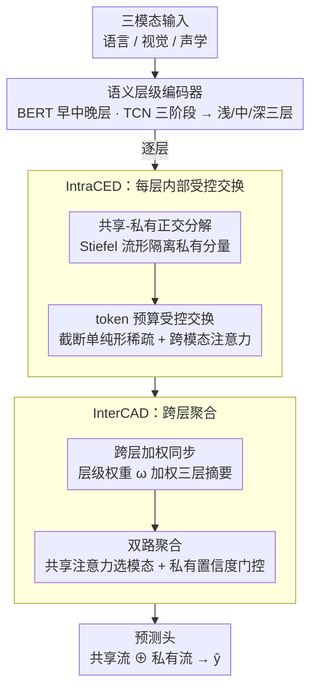

# CLCR: Cross-Level Semantic Collaborative Representation for Multimodal Learning

**会议**: CVPR 2026  
**arXiv**: [2602.19605](https://arxiv.org/abs/2602.19605)  
**代码**: 无  
**领域**: 视频理解  
**关键词**: 跨层语义对齐, 共享-私有解耦, 多模态融合, 情感分析, 事件定位

## 一句话总结

提出 CLCR 框架，将每个模态特征组织为三层语义层级（浅/中/深），通过层内受控交换域（IntraCED）限制跨模态交互仅在共享子空间进行，通过层间协同聚合域（InterCAD）实现跨层自适应融合，解决多模态学习中的跨层语义不同步问题。

## 研究背景与动机

多模态学习旨在从多个模态（语言、视觉、声学）中捕获共享与私有信息。现有方法的两大主流方向存在共同局限：

**特征解耦方法**（MISA、DMD 等）：学习模态不变/模态特定子空间，但假设跨模态交互在单一语义层级进行

**动态校准方法**（MLA、ARL 等）：在样本/模态层面调整贡献权重，但同样忽略层级结构

**核心问题：跨层语义不同步（Cross-Level Semantic Asynchrony）**
- 浅层捕获词汇/帧级线索，中层编码短语/韵律结构，深层反映话语意图/事件上下文
- 不同层级的 token 混合融合会导致语义混淆、错误传播和私有信息泄露
- 从信息瓶颈角度看，非结构化混合倾向于增加 $I(Z;N)$ 而非 $I(Z;Y)$

## 方法详解

### 整体框架

CLCR 想解决的是这样一件事：语言、视觉、声学三个模态各自的特征其实分布在不同的语义层级上——文本里浅层是词、深层是意图，视频里浅层是外观、深层是事件，而以往的多模态融合往往把所有 token 拍平到同一层级直接混在一起，导致浅层的细节和深层的语义相互污染。CLCR 的做法是把"层级"显式保留下来：先让每个模态各自摊成浅/中/深三层（语义层级编码器），然后在**每一层内部**只让跨模态的共享信息做一次受控交换、把各模态的私有信息隔离开（IntraCED），最后再把三层的结果按重要性加权同步、聚合成一个任务表示（InterCAD）。整条链路是 编码三层 → 逐层受控互通 → 跨层加权聚合 → 输出预测。

### 关键设计

**1. 语义层级编码器：把每个模态摊成浅/中/深三层，而不是压成一个向量**

跨层语义不同步的根子在于"模态内部本来就有层级，却被融合阶段抹平了"。CLCR 第一步就是把这个层级显式建出来：对每个模态 $m \in \{L, V, A\}$，构造统一宽度 $d$ 的三层特征 $H_\ell^{(m)} = \text{LN}(Z_\ell^{(m)} W_\ell^{(m)} + P_\ell^{(m)})$，其中 $\ell \in \{1,2,3\}$。语言模态直接取预训练 BERT 的早/中/晚层，分别对应词汇句法、短语情感、话语意图；视觉和声学模态则用三阶段、感受野递增的 TCN 来逼近同样的浅→深结构——局部外观、部件结构、长程场景上下文。这样后续所有的交换和聚合都能在"对齐的层级语义"上进行，而不是把帧级线索和事件级意图硬塞进一个注意力里。

**2. IntraCED：每层内部只让共享子空间互通，而且只交换最值得交换的少量 token**

即便分了层，如果还把整层特征一股脑做跨模态注意力，私有信息照样会泄露、噪声 token 照样会互相干扰。IntraCED 用两道闸门收住这件事。第一道是**共享-私有正交分解**：通过 Stiefel 流形参数化学到正交基，把每个 token 投影成共享分量 $h_{\ell,t,sh}^{(m)} = h_{\ell,t}^{(m)} P_\ell^{sh}$ 和私有分量 $h_{\ell,t,pr}^{(m)} = h_{\ell,t}^{(m)} P_{\ell,m}^{pr}$——正交性保证两者在结构上互不重叠，于是只有共享分量被放出去交换，私有分量物理隔离。第二道是**受控的 token 预算**：并不是每个共享 token 都值得跨模态发言，于是按共享证据强度 $e_{\ell,t}^{(m)} = \|h_{\ell,t,sh}^{(m)}\|_2$ 给每个 token 打分，经可学习尺度和层级阈值映射成激活权重后，再投影到一个带预算上限的截断单纯形上强制稀疏：

$$\boldsymbol{\alpha}_\ell^{(m)} = \text{Proj}_{\Delta(B_\ell)}(\tilde{\boldsymbol{\alpha}}_\ell^{(m)})$$

其中 $B_\ell$ 是可学习预算，直接卡住"这一层最多放多少 token 进交换池"。真正的交换是每个模态拿自己的 query 去查其余两个模态的共享 token 池 $\tilde{h}_{\ell,t,sh}^{(m)} = \alpha_{\ell,t}^{(m)} \text{Attn}(Q_{\ell,t}^{(m)}, K_\ell^{(-m)}, V_\ell^{(-m)})$，而预算权重 $\alpha$ 又乘在外面，控制每个 token 到底吸收多少外部证据。正交分解管"交换什么"、token 预算管"交换多少"，两者叠起来就把稠密融合容易带进的噪声压住了。

**3. InterCAD：把三层结果按重要性加权同步，再按模态置信度聚合成任务表示**

三层各自交换完，还需要决定哪一层、哪个模态对当前样本更重要——直接平均会让强弱层级互相稀释。InterCAD 先做**跨层同步**：对每层每模态的共享流、私有流各自均值池化 + LN 得到摘要 $s_\ell^{(m)}$、$p_\ell^{(m)}$，再用 MLP + softmax 算出一组层级权重 $\omega = [\omega_1, \omega_2, \omega_3]$，加权得到模态级摘要 $\bar{s}^{(m)} = \sum_{\ell} \omega_\ell s_\ell^{(m)}$、$\bar{p}^{(m)} = \sum_{\ell} \omega_\ell p_\ell^{(m)}$。接着分两条路聚合：共享路径用全局上下文 $\bar{g}$ 当 query、各模态 $\bar{s}^{(m)}$ 当 key 做缩放点积注意力，自动挑出当前样本最有信息量的模态；私有路径则用置信度门控 $\eta_m = \sigma(w_p^\top \text{LN}(W_p \bar{p}^{(m)}))$ 决定每个模态私有信息的保留程度。两路拼接后过预测头得到 $\hat{y} = f_\theta(z_{sh} \oplus u_{pr})$。正因为层级权重 $\omega$ 和模态注意力都是样本自适应的，CLCR 才能在 MOSI 上让语言主导、在 KS 上让视觉主导。

### 一个完整示例：一条带讽刺的 MOSI 视频片段怎么走完全程

以一句"配着夸张笑脸、语气却很平的台词"为例（讽刺/情感判别正是跨层语义最容易打架的场景）：

- **编码三层**：语言侧 BERT 浅层抓到逐词的字面（"还不错"），中层抓到短语情感，深层抓到整句的反讽意图；视觉侧 TCN 浅层是表情外观、深层是"笑容与语气不一致"的场景上下文；声学侧浅层是音高、深层是平淡的韵律轮廓。
- **逐层受控互通（IntraCED）**：在浅层，字面词、表情、音高都属于"局部线索"，共享分量互相印证；但 token 预算只放行少量证据强的 token（如那张笑脸、那个重音），噪声帧被截断单纯形挡在交换池外，私有分量（说话人身份等）则完全不参与。⚠️ 具体放行多少 token 由可学习预算 $B_\ell$ 决定，原文给的是参与率 $r \approx 0.68$ 最优，以原文为准。
- **跨层加权同步（InterCAD）**：到了判别讽刺这一步，深层的"语气与表情冲突"比浅层的字面更关键，于是层级权重 $\omega$ 把更大份额压到深层；共享注意力发现声学+视觉的"不一致"信号比文字字面更可信，自动调高这两个模态的权重。
- **输出**：共享路径（冲突证据）与私有路径（各模态独有线索）拼接后，预测头判出"负向/讽刺"，而不是被浅层"还不错"的字面带偏。

### 损失函数 / 训练策略

$$\mathcal{L}_{all} = \mathcal{L}_{task} + \lambda_{inter} \mathcal{L}_{Inter} + \lambda_{intra} \mathcal{L}_{Intra}$$

**层内正则化 $\mathcal{L}_{Intra}$**：基于白化互相关的可辨识性正则，惩罚不同模态私有流间相关性 + 同模态私有-共享间相关性

**层间正则化 $\mathcal{L}_{Inter}$**：三项约束——
- $\mathcal{L}_{pr}$：减少跨层私有冗余
- $\mathcal{L}_{sp}$：抑制跨层共享-私有泄露
- $\mathcal{L}_{mix}$：惩罚语义不兼容层级对的同时激活

训练配置：SGD（momentum 0.9），lr 1e-3，weight decay 1e-4，batch 64，100 epochs，A100 GPU。

## 实验关键数据

### 主实验

**表1：音频-视觉基准（Acc% / F1%）**

| 方法 | CREMA-D Acc | KS Acc | AVE Acc | UCF101 Acc |
|------|-----------|--------|---------|-----------|
| ARL | 76.46 | 74.09 | 72.61 | 83.06 |
| D&R | 73.52 | 69.10 | 69.62 | 82.11 |
| **CLCR** | **77.92** | **75.41** | **73.82** | **83.64** |

**表2：多模态情感分析（CMU-MOSI / CMU-MOSEI）**

| 方法 | MOSI MAE↓ | MOSI Acc-2 | MOSEI MAE↓ | MOSEI Acc-2 |
|------|----------|-----------|-----------|-----------|
| DLF | 0.731 | 85.06 | 0.536 | 85.42 |
| EMOE | 0.710 | 85.4 | 0.536 | 85.3 |
| **CLCR** | **0.678** | **88.05** | **0.511** | **87.96** |

### 消融实验

**表3：关键组件消融（MOSI MAE↓ / KS Acc）**

| 变体 | MOSI MAE | KS Acc |
|------|---------|--------|
| w/o Hierarchy | 0.720 | 71.9 |
| w/o IntraCED | 0.703 | 73.0 |
| w/o InterCAD | 0.699 | 73.4 |
| Full Mix（层级打乱） | 0.743 | 70.3 |
| w/o 两种正则化 | 0.725 | 71.2 |
| **CLCR（完整）** | **0.678** | **75.41** |

### 关键发现

1. **语义层级是核心**：去除层级结构导致最大性能下降，Full Mix（完全打乱）表现最差
2. **IntraCED 比 InterCAD 更关键**：移除 IntraCED 的降幅通常更大，说明层内共享/私有分离和受控交换是关键
3. **Token 预算的最优稀疏度**：参与率 $r \approx 0.68$（$\gamma \approx 1.0$）时性能最佳，完全稠密交换反而最差
4. **噪声鲁棒性**：在高斯噪声注入实验中，CLCR 相较基线方法的性能下降幅度最小
5. **模态重要性自适应**：在 MOSI 上语言模态主导，在 KS 上视觉模态权重最高，CLCR 自动适应

## 亮点与洞察

1. **跨层语义不同步的问题定义**：从信息瓶颈视角阐述了为什么不同层级混合融合会降低表示质量
2. **受控的 Token 预算机制**：通过截断单纯形投影实现可微的稀疏 token 选择，避免稠密噪声融合
3. **共享-私有的双重保护**：正交投影（结构约束）+ 白化互相关正则化（统计约束）双管齐下
4. **六个基准全面验证**：覆盖情感识别、事件定位、情感分析、动作识别四大任务类型

## 局限与展望

1. 三层层级是硬编码设计，不同任务可能需要不同层数
2. 计算开销分析不足——白化操作和 Stiefel 参数化的实际训练时间未报告
3. 仅在分类/回归任务上验证，未扩展到生成式多模态任务
4. 对缺失模态场景的处理（仅做了消融分析）未形成系统方案

## 相关工作与启发

- **MISA**：模态不变+模态特定子空间分解的经典方法，CLCR 在此基础上引入层级结构
- **DMD**：图基跨模态知识蒸馏，CLCR 用受控注意力替代蒸馏
- **ARL**：双路径校准策略，CLCR 通过 InterCAD 的模态选择机制实现类似功能
- Token 预算机制可迁移到视觉-语言预训练中控制跨模态交互的粒度

## 评分

- **新颖性**: ★★★★☆ — 跨层语义不同步的问题定义和受控交换设计新颖
- **技术深度**: ★★★★★ — 正交分解+截断单纯形+白化正则化，理论基础扎实
- **实验充分性**: ★★★★★ — 六个基准、详细消融、t-SNE 可视化、噪声鲁棒性、超参敏感性
- **写作清晰度**: ★★★★☆ — 框架图清晰，但公式较多，阅读门槛较高

<!-- RELATED:START -->

## 相关论文

- [\[CVPR 2026\] VideoChat-M1: Collaborative Policy Planning for Video Understanding via Multi-Agent Reinforcement Learning](videochatm1_collaborative_policy_planning_for_vide.md)
- [\[CVPR 2025\] SEAL: SEmantic Attention Learning for Long Video Representation](../../CVPR2025/video_understanding/seal_semantic_attention_learning_for_long_video_representation.md)
- [\[CVPR 2026\] SAIL: Similarity-Aware Guidance and Inter-Caption Augmentation-based Learning for Weakly-Supervised Dense Video Captioning](sail_similarity-aware_guidance_and_inter-caption_augmentation-based_learning_for.md)
- [\[CVPR 2026\] OpenMarcie: Dataset for Multimodal Action Recognition in Industrial Environments](openmarcie_dataset_for_multimodal_action_recognition_in_industrial_environments.md)
- [\[ICLR 2026\] From Vicious to Virtuous Cycles: Synergistic Representation Learning for Unsupervised Video Object-Centric Learning](../../ICLR2026/video_understanding/from_vicious_to_virtuous_cycles_synergistic_representation_learning_for_unsuperv.md)

<!-- RELATED:END -->
