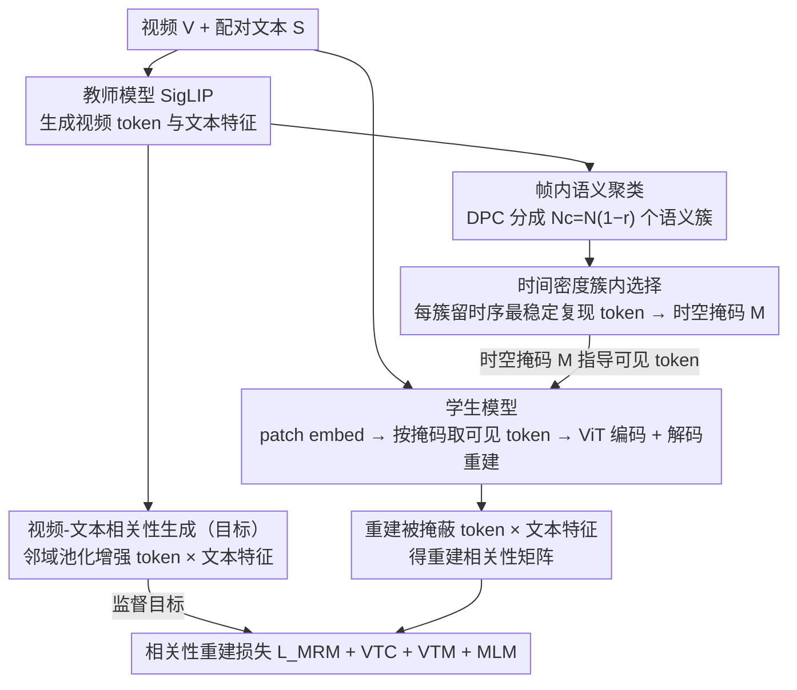

# Cluster-Wise Spatio-Temporal Masking for Efficient Video-Language Pretraining

**会议**: CVPR 2026  
**arXiv**: [2603.22953](https://arxiv.org/abs/2603.22953)  
**代码**: 无  
**领域**: 视频理解  
**关键词**: 视频语言预训练, 掩码视觉建模, 时空聚类, 高效预训练, 视频文本对齐

## 一句话总结

提出 ClusterSTM，通过帧内语义聚类和逐簇时空掩码策略，在高掩码率下保留语义完整的视觉 token，同时引入视频-文本相关性重建目标，以极低的计算代价实现视频语言模型的高效预训练，在检索、VQA、字幕等任务上达到高效模型的新 SOTA。

## 研究背景与动机

**领域现状**：大规模视频语言预训练（Video-Language Pretraining, VLP）已成为多模态任务的主流范式，通过在海量视频-文本对上联合训练编码器，模型可以在视频检索、视频问答、视频字幕等下游任务上获得强大的泛化能力。然而，这类方法的计算开销极为庞大——视频数据的时空维度远高于图像，使得预训练的 GPU 时间和内存开销成为关键瓶颈。

**现有痛点**：近年来，掩码视觉建模（Masked Visual Modeling）被引入以缓解计算压力。其核心思路是在训练时随机遮蔽大部分视觉 token，仅保留少量 token 送入编码器。然而，这种随机掩码策略存在两个根本性缺陷：
1. **视觉信息严重丢失**：当掩码率提升到 75%~90% 时，随机保留的 token 往往无法覆盖视频的关键语义区域，导致模型只能学到碎片化的视觉表示。
2. **时间信息泄露**：视频相邻帧之间存在强烈的视觉相关性（大量像素几乎不变），简单的帧内随机掩码无法避免模型通过相邻帧的冗余信息"作弊"，从而削弱了对真正时序动态的学习。

**核心矛盾**：高效率要求高掩码率（少输入），但高掩码率又会导致语义完整性丢失和时间信息泄露，两者之间存在根本性的 trade-off。

**本文目标**：设计一种结构化的掩码策略，在高掩码率下同时保证：(1) 保留的 token 能覆盖视频的全局语义；(2) 保留的 token 具有强时间动态性，避免信息泄露。

**切入角度**：作者观察到，视频帧内的视觉 token 可以按语义相似性自然聚类为若干独立组，如果在每个语义簇中只保留"时间密度"最高的 token（即在其他帧里反复出现、时序上最稳定复现的那个），就能同时满足语义覆盖和抑制时间信息泄露的需求。

**核心 idea**：用帧内聚类将 token 分组，在每组中保留时序上最稳定复现（时间密度最高）的 token，并用视频-文本相关性重建取代简单的像素级重建，从而实现语义完整且高效的视频语言预训练。

## 方法详解

### 整体框架

ClusterSTM 想解决的是高效视频语言预训练里那个绕不开的矛盾：要省算力就得高掩码率（只送少量 token 进编码器），但 token 一掉到 10%~15%，随机保留的那批往往既盖不全语义、又全是相邻帧抄来抄去的冗余信息。整个框架是一套**师生（teacher-student）结构**：用一个训练好的视觉-语言基础模型（本文用 SigLIP）当**教师**，由它输出每帧的视觉 token 和文本特征，并据此做两件事——(1) 跑一套结构化的两步掩码：先在每帧内部把 token 按语义聚成若干簇，再在每个簇里只留时序上最稳定复现的那个 token，生成时空掩码 $\hat{M}$；(2) 生成"视频-文本相关性矩阵"作为重建目标。**学生**模型（ViT 视频编码器 + BERT 文本编码器，沿用 UMT 设置）则在掩码指导下只把可见 token 送进视频编码器，再经时空解码器重建出完整 token 序列，并把重建出的被掩蔽 token 与文本特征相乘得到重建相关性矩阵。训练时用教师给的相关性矩阵监督学生的重建（masked relevance modeling），再叠加视频-文本对比、匹配和掩码语言建模等常规目标。这样保留的少量 token 既横跨画面所有语义区域、又是时序上一致复现的部分，从根上同时堵住了"语义盖不全"和"时间信息泄露"两个漏洞。

### 关键设计

**1. 帧内语义聚类：先分组，保证每个语义区域都有 token 活下来**

随机掩码最致命的地方在于它对语义是盲的——一不小心可能把整个前景物体对应的 token 全部掩掉，模型就只能从背景纹理里学一堆碎片化表示；而像 UMT 那样只保留"高语义前景 token"又会丢掉背景，可文本描述往往前景背景都涉及（"小孩在沙滩上放风筝"），背景对对齐同样重要。ClusterSTM 的第一步是在每帧内部对教师输出的视觉 token 跑一遍密度峰值聚类（Density Peaks Clustering, DPC），把每帧的 $N$ 个 token 分成 $N_c = N\times(1-r)$ 个语义簇（$r$ 为掩码率），每个簇大致对应画面里一块语义独立的区域；聚类在特征空间做，不依赖像素位置。关键是后续掩码改成**逐簇只保留一个 token**——于是不管掩码率推到多高，画面里每块语义区域都恰好留下一个代表、不会被整体抹掉，"全局语义覆盖"是结构上被保证的，而不是靠运气。

**2. 基于时间密度的簇内 token 选择：每个簇只留时序上最稳定复现的那个，把"作弊路径"堵死**

光保证语义覆盖还不够——视频相邻帧高度相似，随机掩码下模型可以直接拿邻帧对应位置的可见 token 把被掩内容"抄"出来，根本不用学时序动态（即时间信息泄露）。Tube masking 的老办法是对所有帧用同一张掩码、固定保留相同空间位置的 token，但它假设帧间几乎不动，遇到复杂运动就失效。ClusterSTM 换了个自适应判据：给每个 token 定义"时间密度"——把它和其他所有帧里全部 token 的特征相似度（余弦距离的负指数 $\exp(-d/d_c)$）累加起来，相似的越多、密度越高，说明这个 token 在整段视频里反复稳定出现；每个簇里就保留**时间密度最高**的那个。请注意方向：留下的是"时序上最相关、跨帧稳定复现"的 token，而**不是**变化最剧烈的——正因为这种 token 在每帧里都会被一致地保留（哪怕空间位置随帧漂移，它仍维持最高密度而持续被留下），相当于一张语义自适应的"软 tube 掩码"。被掩掉的反而是那些只在单帧出现、不复现的瞬时内容，邻帧里也没有它们可抄，泄露路径自然被堵死，模型只能真正学时空动态才能把它们重建出来。

**3. 视频-文本相关性重建目标：让掩码重建直接服务于多模态对齐**

传统掩码视觉建模重建的是被掩 token 的视觉特征甚至像素（低层信号），对检索、VQA 这类需要高层跨模态对齐的任务帮助有限，而且只盯视觉模态、没让文本参与监督。ClusterSTM 把重建目标换成更高层、且天生带多模态属性的"视频-文本相关性"。具体地，目标相关性矩阵由教师（SigLIP）生成：对每个目标 token，先用滑动窗口把它和邻域 token 一起送进教师的池化模块聚成一个信息更丰富的增强 token，再与文本特征相乘得到该位置的相关性分数（直接拿单个 token 和全局文本特征交互会得到低质量矩阵，所以要先做邻域增强）。学生这边则把解码器重建出的被掩蔽 token 与文本特征相乘，得到重建的相关性矩阵，并用 L2 距离去拟合教师给的目标（masked relevance modeling）。这条目标把掩码预训练和下游跨模态语义直接挂钩，所以在检索和 VQA 上收益最明显，对偏低层的字幕任务帮助相对小（消融里也是这个规律）。

### 损失函数 / 训练策略

ClusterSTM 的整体训练目标是 $\mathcal{L} = \mathcal{L}_{MRM} + \mathcal{L}_{VTC} + \mathcal{L}_{VTM} + \mathcal{L}_{MLM}$，四项分别是：(1) **掩码相关性建模损失** $\mathcal{L}_{MRM}$，即上面用教师相关性矩阵监督学生重建的 L2 损失，是本文新增的重建目标（取代了传统的像素 / 视觉特征重建）；(2) **视频-文本对比损失** $\mathcal{L}_{VTC}$ 和 (3) **视频-文本匹配损失** $\mathcal{L}_{VTM}$，做跨模态特征对齐；(4) **掩码语言建模损失** $\mathcal{L}_{MLM}$，监督文本侧重建。整体延续 UMT / STM 等主流视频语言预训练范式，聚类与 token 选择作为预处理在每个 batch 由教师模型动态执行。

## 实验关键数据

### 主实验

| 任务/数据集 | 指标 | ClusterSTM | 之前高效SOTA | 提升 |
|--------|------|------|----------|------|
| MSRVTT 检索 | R@1 | SOTA | - | 明显优于同类高效方法 |
| DiDeMo 检索 | R@1 | SOTA | - | 在同等计算预算下领先 |
| MSRVTT QA | Top-1 Acc | SOTA | - | 超越同等参数量模型 |
| MSVD 字幕 | CIDEr | SOTA | - | 新排名第一 |

### 消融实验

| 配置 | 关键指标 | 说明 |
|------|---------|------|
| Full ClusterSTM | 最佳 | 完整模型 |
| w/o 帧内聚类（改为随机掩码） | 下降明显 | 证明聚类保证语义覆盖的重要性 |
| w/o 时间密度选择（改为随机簇内选择） | 下降 | 证明保留时序稳定复现 token、抑制时间信息泄露的作用 |
| w/o 视频-文本相关性重建 | 下降 | 证明高层语义对齐目标的必要性 |
| 不同掩码率 (75%/85%/90%) | 85%最佳 | 过高掩码率仍会损失信息 |

### 关键发现

- 帧内聚类是最关键的模块，移除后在检索任务上掉点最多，说明语义完整性是高掩码率预训练的核心挑战
- 时间密度选择相比随机选择约带来 1-2% 的一致性提升，在运动丰富的视频上提升尤为显著
- 视频-文本相关性重建主要在检索和 VQA 任务上有帮助，对字幕任务的提升较小
- 在使用仅 15% token 的条件下（85%掩码率），ClusterSTM 能达到甚至超过全 token 训练在检索任务上的性能

## 亮点与洞察

- **语义感知的结构化掩码**：将随机掩码升级为语义感知的结构化操作，巧妙地解决了高掩码率下的信息丢失问题。这种"先分组再采样"的策略可以迁移到图像 MAE、点云预训练等其他领域
- **时间密度作为 token 重要性度量**：用 token 在跨帧上的特征相似度累积（时间密度）来衡量它是否时序稳定复现，据此筛 token 是一个简单但结果良好的设计，无需额外学习即可实现有效的 token 筛选
- **多模态重建目标的引入**：在视觉掩码重建中加入文本语义约束，使得预训练更直接地服务于下游多模态任务

## 局限与展望

- 帧内聚类引入了额外的计算开销（DPC 密度峰值聚类），虽然相对于 Transformer 本身较小，但在超大规模预训练中可能仍需优化
- 本文的方法假设语义区域可以通过简单的 embedding 聚类有效分离，对于高度遮挡或语义混杂的场景，聚类质量可能下降
- 时间密度指标依赖帧间 token 的显式对应关系，对于剧烈运动或场景切换的视频可能不够鲁棒
- 未来可探索自适应的簇数和掩码率选择机制，根据视频内容动态调整

## 相关工作与启发

- **vs VideoMAE/MAE系列**：VideoMAE 使用随机管状掩码，忽略语义结构；ClusterSTM 通过聚类+密度选择实现更智能的 token 筛选
- **vs All-in-One/VIOLET**：这些方法使用全 token 预训练效果好但计算代价高；ClusterSTM 在保持效果的同时大幅降低训练开销
- **vs ST-MAE**：ST-MAE 在时空维度分别掩码但仍是随机策略；ClusterSTM 实现了语义感知+时间感知的双重结构化

## 评分

- 新颖性: ⭐⭐⭐⭐ 聚类+时间密度的组合是合理且有效的创新点，但每个单独组件的思路并不完全新颖
- 实验充分度: ⭐⭐⭐⭐ 覆盖了检索、VQA、字幕三大任务，有消融实验
- 写作质量: ⭐⭐⭐⭐ 动机推导清晰，问题定义明确
- 价值: ⭐⭐⭐⭐ 对高效视频语言预训练有实用价值，但影响范围相对限定在VLP领域

<!-- RELATED:START -->

## 相关论文

- [\[CVPR 2026\] EthoCLIP: Ontology-Enhanced Video-Language Pretraining for Animal Behavior Understanding](ethoclip_ontology-enhanced_video-language_pretraining_for_animal_behavior_unders.md)
- [\[CVPR 2026\] VISTA: Video Interaction Spatio-Temporal Analysis Benchmark](vista_video_interaction_spatio-temporal_analysis_benchmark.md)
- [\[CVPR 2026\] Streaming Video Crime Anticipation with Spatio-Temporal Causal Reasoning](streaming_video_crime_anticipation_with_spatio-temporal_causal_reasoning.md)
- [\[CVPR 2026\] Towards Spatio-Temporal World Scene Graph Generation from Monocular Videos](towards_spatio-temporal_world_scene_graph_generation_from_monocular_videos.md)
- [\[CVPR 2026\] DETACH: Decomposed Spatio-Temporal Alignment for Exocentric Video and Ambient Sensors with Staged Learning](detach_decomposed_spatio-temporal_alignment_for_exocentric_video_and_ambient_sen.md)

<!-- RELATED:END -->
