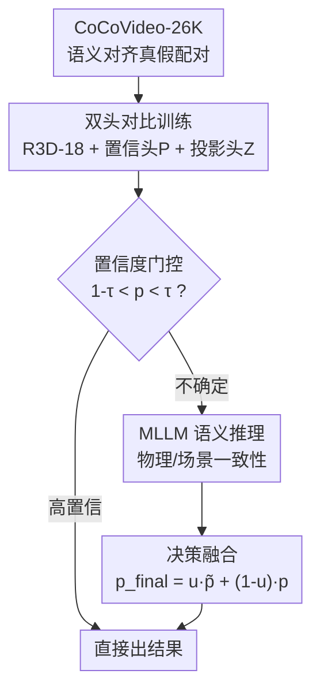

# CoCoVideo: The High-Quality Commercial-Model-Based Contrastive Benchmark for AI-Generated Video Detection

**会议**: CVPR 2026  
**arXiv**: [2606.00101](https://arxiv.org/abs/2606.00101)  
**代码**: https://github.com/DonoToT/CoCoVideo (有)  
**领域**: 视频理解 / AIGC 检测 / Benchmark  
**关键词**: AIGC 视频检测, 商业生成模型, 对比学习, 配对真假数据, 置信度门控 MLLM

## 一句话总结
针对现有 AIGC 视频检测数据集普遍依赖低质量开源生成模型、难以泛化到高保真商业模型的问题，本文构建了覆盖 13 个商业生成模型、26K 段"语义对齐真假配对"的 CoCoVideo-26K 基准，并提出 CoCoDetect 框架——用 R3D-18 双头对比训练捕捉纹理级差异、再用置信度门控把不确定样本路由给 MLLM 做物理/语义推理，在自建集上平均 Acc 90.69%、AUC 95.93%，均超过现有方法。

## 研究背景与动机

**领域现状**：随着扩散类文生视频 / 图生视频系统（Sora、Kling、Veo 等）的爆发，AIGC 伪造视频日益逼真，深度伪造检测的研究重心正从早期换脸（face-swap、GAN）转向"通用 AIGC 视频真伪判别"。

**现有痛点**：现有 AIGC 视频检测数据集（GenVideo、GenVidBench、GenBuster 等）几乎全部用**开源生成模型**造假，输出在纹理保真度和场景一致性上远逊于商业模型。即便个别数据集混入少量商业样本，往往残留可见水印，破坏真实性。在这种低质数据上训练的检测器会过拟合开源模型的低级伪影，一旦面对高保真商业视频就失效。

**核心矛盾**：检测器学到的是"开源模型特有的低级伪影"而非"真假视频的本质差异"。同时，传统检测方法多为特定生成架构/操作设计，泛化差，也无法利用物理逻辑、场景连贯这类高层语义线索；而纯 MLLM 方法又难以捕捉细微的低级纹理伪影。

**本文目标**：(1) 造一个高质量、可公开访问、贴近真实部署场景的商业级 AIGC 视频基准；(2) 设计一个能同时利用"纹理级"与"语义级"线索的检测框架。

**切入角度**：作者观察到，如果让真视频和假视频**共享同一首帧、同一文本提示**（即语义严格对齐的"真假配对"），检测器就能在内容一致的条件下学到细粒度的外观差异，而不是去记忆某个生成模型的整体风格。

**核心 idea**：用"商业模型 + 语义对齐真假配对"的对比式数据，配合"低层对比学习 + 置信度门控 MLLM 语义推理"的双层检测，把高保真伪造的纹理破绽和物理/场景破绽一起抓出来。

## 方法详解

本文由两部分组成：**基准 CoCoVideo-26K**（数据侧贡献）和**检测框架 CoCoDetect**（方法侧贡献）。前者提供语义对齐的真假配对监督，后者据此先做双头对比训练抓纹理差异，再对不确定样本用 MLLM 补语义推理。

### 整体框架

CoCoDetect 训练阶段以"成对视频"为输入：R3D-18 时空骨干抽特征 $\mathbf{F}$，送入两个并行 head——置信度头输出真伪置信度 $\mathbf{P}$，投影头输出对比嵌入 $\mathbf{Z}$，二者分别由 BCE 损失与配对对比损失监督。推理阶段则用阈值 $\tau$ 做置信度门控：高置信样本直接出结果，落在 $1-\tau<p<\tau$ 的不确定样本被路由给 MLLM，让它就物理合理性、时序一致性、场景连贯性做推理，输出结构化 JSON，再与基模型置信度做决策融合得到 $p_{\text{final}}$。

### 关键设计

**1. CoCoVideo-26K：用商业模型 + 语义对齐真假配对，逼出"本质差异"而非"生成风格"**

针对"数据集用开源模型造假、检测器只学到低级伪影"的痛点，作者从 OpenVid-1M 精选约 13,000 段高保真真实视频（统一约 5 秒，匹配主流生成模型默认时长），直接复用其自带文本描述作为生成提示词；再用 13 个当下最强商业生成模型（Jimeng 3.0、Kling 2.5、Veo3、Sora v1、Runway Gen4 等，依 ArtificialAnalysis.ai 的 ELO 排名筛选），**每个模型贡献正好 1000 段**假视频，共 26K 段。关键在于"对比式结构"：每段真视频与其合成对应物**共享同一首帧、同一文本提示**，构成一对一的 real–fake pair。这样真假之间只剩"生成与否"这一个变量，对比学习能在内容受控下学到细粒度外观差异。与 GenVideo/GenVidBench/GenBuster 相比（它们 Model Source 为 Mixed、无对齐配对），CoCoVideo 是首个 Commercial 来源 + Aligned Pairs + 含文本模态的基准，统一帧率 24-30 FPS。数据由四阶段流水线产出：① 从 OpenVid-1M 采集多样原始视频；② 按首帧质量、提示词适配性、真实视频标准过滤；③ 经 API/网页接口做配对生成；④ 后处理与归档，得到时长分辨率可比的严格对齐配对

**2. 双头配对对比训练：只拉开"配对"内的真假，绕开 AIGC 高类内方差**

传统监督对比学习会把同类样本全部拉近、不同类推远，但在 AIGC 检测里这会适得其反——真视频跨越各种场景内容、假视频又来自不同生成方法，"真"和"假"各自的**类内语义方差极高**，强行做全局类级聚类反而有害。本设计的做法是只在**语义对齐的真假配对**之间施加分离约束：对每个满足 $\pi_i=\pi_j$ 且 $y_i\neq y_j$ 的配对 $(i,j)$，算余弦相似度 $s_{ij}=\mathbf{z}_i\cdot\mathbf{z}_j$，当相似度超过目标阈值时用 hinge 罚：

$$\mathcal{L}_{\text{pair}}=\frac{1}{N_{\text{pairs}}}\sum_{\pi_i=\pi_j,\,y_i\neq y_j}\max(0,\,s_{ij}-(1-m))$$

其中 margin $m\in[0.5,1.5]$ 控制目标分离度：$m$ 从 0.5 增到 1.5，余弦阈值从 0.5 降到 $-0.5$，对应嵌入分离从 $60°$ 强化到 $120°$。配合骨干 R3D-18（输出 $d_{\text{feat}}=512$）、置信度头（三层 MLP + Sigmoid 出 $\mathbf{P}$）和投影头（两层 MLP + BN，映到 128 维 $\ell_2$ 归一化嵌入），总损失 $\mathcal{L}_{\text{total}}=\alpha\mathcal{L}_{\text{conf}}+(1-\alpha)\mathcal{L}_{\text{pair}}$（$\alpha=0.65$，$\mathcal{L}_{\text{conf}}$ 为 BCE）。因为只约束配对、不碰非配对样本，模型学到的是"同一内容下真假的细微外观差"，泛化性更稳

**3. 置信度门控 MLLM 推理 + 决策融合：纹理拿不准时交给语义推理**

高保真商业视频纹理破绽往往细微多样，低级伪影线索并不可靠；但即便纹理逼真，合成视频仍可能违反物理或语义逻辑。本设计基于一个经验观察——模型预测准确率与置信度强相关——只把**不确定样本**（落在 $1-\tau<p<\tau$，$\tau=0.9$）路由给 MLLM（LLaVA-NeXT-Video-7B），高置信样本直接出结果，省算力又避免 MLLM 误伤已经确定的样本。MLLM 输入含三部分：关键帧序列、基模型置信度 $p$、以及引导其分析物理合理性/时序一致性/场景连贯的文本指令；输出强制为三段式 JSON：预测 $\hat{y}\in\{0,1\}$、语义确定度 $\hat{p}\in[0,1]$、自然语言 reasoning（不符合 JSON 格式的记录在案，作为 MLLM 选型依据之一）。由于 $\hat{p}$ 与基模型 $p$ 语义不同，先做语义对齐 $\tilde{p}=0.5(\hat{y}(1+\hat{p})+(1-\hat{y})(1-\hat{p}))$，再自适应加权融合 $p_{\text{final}}=u\tilde{p}+(1-u)p$，其中 $u=\sqrt{2|\tilde{p}-0.5|}$——MLLM 越笃定（$\tilde{p}$ 离 0.5 越远）权重越大。作者提到曾试图学习 $u$，但导致过度依赖 MLLM、泛化变差，于是改用这个固定公式以保持跨基准的稳健

### 损失函数 / 训练策略

总损失 $\mathcal{L}_{\text{total}}=\alpha\mathcal{L}_{\text{conf}}+(1-\alpha)\mathcal{L}_{\text{pair}}$，$\alpha=0.65$，配对对比 margin $m=1.0$，门控阈值 $\tau=0.9$。单张 A6000，batch size 8，时序维 $T=16$，AdamW（初始 lr $10^{-4}$、weight decay $10^{-4}$），训练 30 epoch 约 10 小时。

## 实验关键数据

### 主实验（CoCoVideo 测试集，13 个商业模型平均，%）

| 方法 | Acc | F1 | Recall | AUC |
|------|------|------|--------|------|
| 3D ResNet | 78.69 | 78.57 | 78.10 | 86.51 |
| 3D ResNeXt | 80.49 | 80.65 | 81.33 | 88.16 |
| VideoMAE | 79.64 | 77.98 | 72.10 | 89.26 |
| TALL | 70.97 | 67.36 | 59.90 | 80.51 |
| D3（免训练） | 48.95 | 11.47 | 6.62 | 48.40 |
| DeMamba | 82.59 | 83.49 | 88.05 | 91.03 |
| **CoCoDetect（本文）** | **90.69** | **90.62** | 89.95 | **95.93** |

本文在四项指标的平均值上均居首，DeMamba 第二。值得一提：本文在 13 个模型中有 8 个 Recall 只是次优，但 F1 更高，反映了"以精度优先的保守决策"——置信门控只对不确定样本融合 MLLM，减少误报、宁可漏检少量。在 Jimeng、Veo3 上未夺冠，原因是这两个模型会扩展输入内容以匹配预设分辨率，导致真假配对间分辨率不一致，破坏了本文依赖的语义对齐。

### 消融实验（CoCoVideo，%）

| 配置 | Acc | F1 | AUC | 说明 |
|------|------|------|------|------|
| Backbone only | 78.69 | 78.57 | 86.51 | 仅 3D ResNet + 置信头 |
| w/o Projection Head | 81.05 | 83.17 | 91.39 | 去掉配对对比分支 |
| w/o MLLM | 88.92 | 88.79 | 95.46 | 双头训练但推理只用置信度 |
| **CoCoDetect（Full）** | **90.69** | **90.62** | **95.93** | 完整系统 |

### 跨数据集泛化（开源基准，Acc，%）

| 方法 | GVD | GVF | GenVideo | GenVidBench | GenBuster |
|------|------|------|----------|-------------|-----------|
| 3D ResNeXt | 45.20 | 33.83 | 35.20 | 51.90 | 35.80 |
| VideoMAE | 46.38 | 29.74 | 27.22 | 36.99 | **68.20** |
| DeMamba | 24.11 | 26.91 | 48.17 | 32.62 | 67.35 |
| **CoCoDetect** | **71.49** | **74.56** | **57.04** | **64.78** | 64.80 |

### 关键发现
- **MLLM 与对比头是互补主力**：从 Backbone only → +投影头（Acc 78.69→81.05）→ +MLLM（→88.92）→ Full（90.69），配对对比补"纹理级"、MLLM 补"语义级"，叠加才达最优。
- **门控带来保守而稳健的决策**：8/13 模型 Recall 次优却 F1 更高，说明只对不确定样本调用 MLLM 能有效压低误报。
- **泛化优势明显但有短板**：前四个开源基准 Acc 大幅领先；但 GenVideo 上 F1 仅 33.19%（真视频 84.8% vs 假视频 23.55%），因其假视频多为极短近静态片段，16 帧需求要尾帧重复、破坏时序连贯，MLLM 难提语义线索；GenBuster 上略逊，因其用了 CoCoVideo 同款模型的早期版本，别的方法可钻"生成特有伪影"的空子，反衬本文更少依赖此类模式。
- **Case study**：Case 1 纹理破绽明显（$p=0.023$）直接判假；Case 2 模糊（$p=0.792$）触发 MLLM，识别"悬索桥被误生成成烟囱"的语义错误纠正为假；Case 3 失败案例——简单山谷溪流场景纹理与语义都无明显破绽，两模块都误判为真。

## 亮点与洞察
- **"共享首帧 + 同提示"的配对设计很巧**：把真假之间的混杂变量压到只剩"生成与否"，让对比学习学到的是本质差异而非生成风格，这一构造可迁移到图像/音频伪造检测。
- **置信度门控是性价比很高的工程化思路**：用一个阈值把昂贵的 MLLM 推理只留给"拿不准"的样本，既省算力又避免 MLLM 误伤已确定样本——这种"低成本模型打底 + 大模型兜底难例"的级联范式可复用到很多分类任务。
- **拒绝可学习融合权重反而更稳**：作者发现学习融合权重 $u$ 会过度依赖 MLLM、损害泛化，改用固定公式 $u=\sqrt{2|\tilde{p}-0.5|}$，这是一个"少即是多"的反直觉发现。
- **配对对比损失的动机讲得透**：明确指出 AIGC 真/假各自类内方差极高、全局类级聚类有害，因此只约束配对内分离——这个对"何时不该用标准 SupCon"的判断很有启发。

## 局限与展望
- **强依赖语义对齐**：一旦真假配对的语义对齐被破坏（如生成模型自行改分辨率），性能明显下降（Jimeng、Veo3 上未夺冠即为例证）。
- **对简单自然场景的细微伪影乏力**：Case 3 显示在缺乏明显语义破绽、纹理又细微的简单场景下，纹理头和 MLLM 会双双失手。
- **对短/近静态视频不友好**：16 帧固定输入需求在 GenVideo 这类极短片段上靠尾帧重复，破坏时序连贯，拖垮 MLLM 语义推理（F1 仅 33.19%）。
- **规模与模态仍有限**：26K 相对开源百万级基准偏小；作者计划扩展音频等更大规模多模态数据与更丰富语义标注。
- **MLLM 成本与延迟**：虽有门控筛选，被路由样本仍需逐帧采样 + 大模型推理，实时部署成本待评估。

## 相关工作与启发
- **vs GenBuster / GenVideo / GenVidBench**：它们主要用开源模型（Model Source 为 Mixed）造假、无对齐配对，输出肉眼可辨；本文用 13 个商业模型 + 语义对齐真假配对 + 文本模态，质量与真实场景代表性更强，但规模（26K）小于它们的十万至百万级。
- **vs 传统 CNN/频域检测（如 D3、TALL）**：它们靠捕捉特定生成架构的低级伪影，面对高保真商业视频几乎失效（D3 在 CoCoVideo 上 Acc 仅 48.95%）；本文用配对对比 + 语义推理双层互补。
- **vs 纯 MLLM 检测**：现有 MLLM 方法多靠调优/提示大模型，缺乏与细粒度网络结构的结合，难抓低级伪影；本文反过来用 CNN 抓纹理、MLLM 只兜底语义难例。
- **vs DeMamba（次优方法）**：DeMamba 在 CoCoVideo 上 Acc 82.59、Recall 88.05（Recall 反超本文），但综合 F1/AUC 与跨数据集泛化均逊于本文，说明其更依赖可记忆的生成模式。

## 评分
- 新颖性: ⭐⭐⭐⭐ 商业模型 + 语义对齐配对的基准构造 + 置信门控级联检测，组合新颖且切中真实痛点，单点技术（对比/门控/MLLM）则相对成熟
- 实验充分度: ⭐⭐⭐⭐ 13 模型逐一对比 + 6 个基线 + 5 个跨数据集泛化 + 消融 + case study，较完整；部分细节（超参敏感性、MLLM 选型）放在补充材料
- 写作质量: ⭐⭐⭐⭐ 动机与设计动因讲得清楚，配对对比"为何不用全局聚类"的论证到位
- 价值: ⭐⭐⭐⭐ 高质量商业级 AIGC 视频检测基准 + 可复用的级联检测范式，对可信内容检测社区有实用价值

<!-- RELATED:START -->

## 相关论文

- [\[CVPR 2026\] Your One-Stop Solution for AI-Generated Video Detection](your_one-stop_solution_for_ai-generated_video_detection.md)
- [\[CVPR 2026\] MDS-VQA: Model-Informed Data Selection for Video Quality Assessment](mds-vqa_model-informed_data_selection_for_video_quality_assessment.md)
- [\[CVPR 2026\] VISTA: Video Interaction Spatio-Temporal Analysis Benchmark](vista_video_interaction_spatio-temporal_analysis_benchmark.md)
- [\[CVPR 2025\] Q-Bench-Video: Benchmark the Video Quality Understanding of LMMs](../../CVPR2025/video_understanding/q-bench-video_benchmark_the_video_quality_understanding_of_lmms.md)
- [\[CVPR 2026\] Spk2VidNet: A Hierarchical Recurrent Architecture for High-Fidelity Video Reconstruction from Long Spike-Camera Streams](spk2vidnet_a_hierarchical_recurrent_architecture_for_high-fidelity_video_reconstr.md)

<!-- RELATED:END -->
