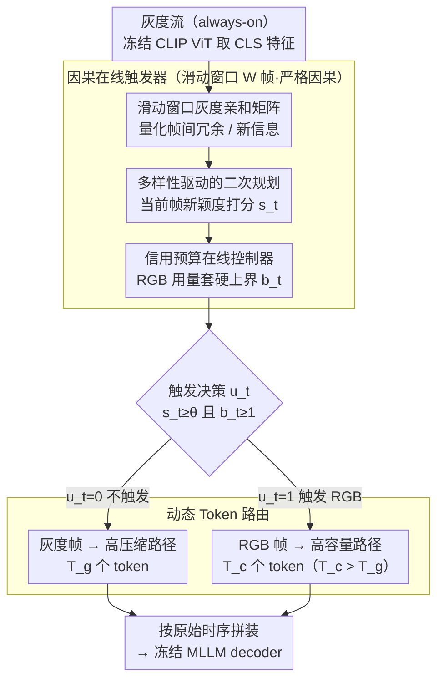

# Color When It Counts: Grayscale-Guided Online Triggering for Always-On Streaming Video Sensing

**会议**: CVPR 2026  
**arXiv**: [2603.22466](https://arxiv.org/abs/2603.22466)  
**代码**: [lvgd.github.io/ColorTrigger](https://lvgd.github.io/ColorTrigger/)  
**领域**: 视频理解  
**关键词**: 流式视频理解, 边缘设备, 灰度引导触发, 能效感知, 动态Token路由

## 一句话总结

提出"灰度常开、彩色按需"新范式，通过 ColorTrigger 在灰度流上用轻量二次规划在线检测色彩冗余，仅使用 8.1% 的 RGB 帧即保持全彩基线 91.6% 的性能，实现资源受限设备的 always-on 视频感知。

## 研究背景与动机

Always-on 感知是下一代可穿戴/边缘 AI 系统的核心需求，但持续高保真 RGB 视频捕获在资源受限平台上代价极高：

**能耗瓶颈**：智能眼镜等设备持续 RGB 录像仅能维持约 30-60 分钟，远达不到全天候助手的需求。即使推理offload到云端，端到端能耗瓶颈仍被连续相机曝光和无线传输主导。

**现有方案的缺陷**：EgoTrigger 等方法通过音频线索触发 RGB 相机，但触发失败时会造成长时间视觉信息完全缺失，关键上下文不可恢复。

**关键发现——颜色并非始终必要**：作者通过预研实验发现，在 Qwen2.5-VL-7B 上，将大部分帧替换为灰度、仅保留少量 RGB 帧（保持时序结构），视频理解性能仪轻微下降。这说明自然视频中存在大量**色彩冗余**——动作识别、布局推理、计数等语义任务大多不依赖颜色，仅在少数关键时刻需要色彩细节。

基于这一洞察，ColorTrigger 提出：灰度流持续运行保持时序连续性，仅在必要时触发 RGB 捕获，从根本上降低感知成本。

## 方法详解

### 整体框架

ColorTrigger 的目标是让设备「灰度常开、彩色按需」：灰度流持续运行保住时序连续性，只有少数关键时刻才触发昂贵的 RGB 捕获。它由两个组件接力——因果在线触发器在灰度特征的滑动窗口里判断「这一帧是否带来新信息、且预算是否允许」，决定要不要开彩色；动态 Token 路由器再按帧的类型分配算力，灰度帧走少量 token 的高压缩路径、RGB 帧走多 token 的高容量路径，拼好时序后一并送进冻结的 MLLM decoder。整条管线 training-free、严格因果，不动 MLLM 一根参数。

### 关键设计

**1. 滑动窗口灰度亲和矩阵：用相似度判断哪一帧带来了新信息**

要在不看颜色的前提下判断「现在值不值得开 RGB」，先得量化帧与帧之间的冗余。在每个时间步 $t$，ColorTrigger 维护大小为 $W$ 的因果滑动窗口 $\mathcal{W}_t$，用冻结的 CLIP 视觉编码器取各帧 CLS token 的 $\ell_2$ 归一化特征 $\mathbf{f}_i$，构建亲和矩阵 $\tilde{\mathbf{A}}_t = \frac{1}{2}(\mathbf{F}_t \mathbf{F}_t^\top + \mathbf{I}_{n_t}) \in [0,1]^{n_t \times n_t}$。$\tilde{A}_{ij}$ 高代表帧 $i,j$ 冗余（相似），低则代表有新变化。矩阵对称、半正定，且只用当前窗口内的帧，保证严格因果——这是 always-on 在线场景的硬约束。

**2. 多样性驱动的二次规划：把「该不该触发」变成一道带预算的优化**

光有相似度还不够，得把它转成对当前帧的一个打分。ColorTrigger 把帧选择写成连续 QP：$\mathbf{w}_t = \arg\min_{\mathbf{w}} \lambda \mathbf{w}^\top \tilde{\mathbf{A}}_t \mathbf{w}$，约束 $\mathbf{1}^\top \mathbf{w} = m_t$，给窗口内每帧分配权重 $\mathbf{w}_t \in [0,1]^{n_t}$。二次项 $\mathbf{w}^\top \tilde{\mathbf{A}}_t \mathbf{w}$ 会惩罚把权重压在彼此相似的帧上，于是预算自然被摊到时序多样的帧。当前帧拿到的权重 $s_t = (\mathbf{w}_t)_{n_t}$ 越高，说明它贡献了近期历史没覆盖的新信息，越该触发 RGB。

**3. 信用预算在线控制器：给长期 RGB 用量套一个硬上界**

只看几何新颖度会在画面剧烈变化时疯狂触发，反而失去省电意义。控制器维护标量信用余额 $b_t \in [0, C]$，以目标速率 $r$ 每帧累积、每次触发消耗一单位：$b_{t+1} = \text{clip}(b_t - u_t + r,\; 0, C)$。最终触发要同时过几何关 $s_t \geq \theta$ 和预算关 $b_t \geq 1$：$u_t = \mathbb{I}[s_t \geq \theta \wedge b_t \geq 1]$。这样长期 RGB 用量被钉死在 $\sum_{t=1}^T u_t \leq rT + C$，无论场景多动都不会超支。

**4. 动态 Token 路由：把算力按帧的信息量花在刀刃上**

触发决策定了哪些帧是彩色，路由器再据此分配 token 预算。灰度帧低分辨率输入产生 $T_g$ 个 token，RGB 帧高分辨率产生 $T_c > T_g$ 个 token，按触发位拼装：$\mathbf{Z}_t = (1 - u_t)\psi_g(g_t) \oplus u_t \psi_c(c_t)$。当 RGB 稀疏时，总成本 $\sum_t [(1-u_t)T_g + u_t T_c]$ 远低于全彩的 $T \cdot T_c$，等于把算力集中到真正信息量大的少数时刻。

### 损失函数 / 训练策略

本方法完全 training-free，无需额外监督或微调——所有触发和路由决策都只来自灰度流的几何关系，直接挂到冻结的 MLLM 上即可使用。

## 实验关键数据

### 主实验

在 StreamingBench 实时视觉理解任务上的表现：

| 方法 | #Frames | RGB(%) | All (Acc) | 说明 |
|------|---------|--------|-----------|------|
| Qwen2.5-VL-7B (全彩) | 1fps | 100% | 73.68 | 全彩基线 |
| Human | - | - | 91.46 | 人类表现 |
| TimeChat-Online-7B | 1fps | 100% | 75.36 | Streaming MLLM SOTA |
| InternVL-3.5-8B | 128 | 100% | - | 开源强模型 |
| **ColorTrigger** | 1fps | **8.1%** | **67.49** | 仅8.1% RGB帧 |

ColorTrigger 以 8.1% 的 RGB 帧实现全彩基线 91.6% 的性能（67.49/73.68），在各子任务（物体感知、因果推理、动作感知等）上表现均衡。

### 消融实验

| 配置 | RGB(%) | All (Acc) | 说明 |
|------|--------|-----------|------|
| 全灰度 | 0% | ~60 | 纯灰度，性能显著下降 |
| 均匀采样 5% RGB | 5% | ~63 | 随机插入少量 RGB |
| 均匀采样 10% RGB | 10% | ~66 | 均匀采样 |
| ColorTrigger 8.1% | 8.1% | 67.49 | 智能触发优于均匀采样 |
| ColorTrigger + Token路由 | 8.1% | 67.49 | Token路由进一步减少推理成本 |
| 全彩 100% RGB | 100% | 73.68 | 上界 |

### 关键发现

- 自然视频中存在大量色彩冗余：仅 5-10% RGB 帧即可恢复大部分性能
- 智能触发优于均匀采样：在相同 RGB 比例下，ColorTrigger 的性能更高
- 动态 Token 路由进一步降低推理成本，但不牺牲性能
- 该范式可直接用于现有冻结 MLLM，无需任何训练

## 亮点与洞察

- **"颜色并非始终必要"是一个深刻的观察**：从根本挑战了"更多 RGB = 更好性能"的隐含假设
- **灰度常开 + 彩色按需的范式**对边缘 AI 的实际部署意义重大——智能眼镜、安防摄像头等场景下可显著延长续航
- **QP + 信用预算的设计**优雅地平衡了局部触发灵活性与全局预算约束
- 完全 training-free，即插即用，与任何冻结 MLLM 兼容

## 局限与展望

- 灰度相机的分辨率和画质通常低于 RGB 相机，实际部署中的硬件异质性处理有待验证
- 当前仅用 CLIP CLS token 做亲和分析，可能遗漏局部细节变化
- QP 求解虽轻量但仍有计算开销，超低功耗芯片上的实时性需进一步评估
- 仅在流式视频理解 benchmark 上验证，缺少实际边缘设备上的功耗和延迟评测
- 某些高度依赖颜色的任务（如颜色识别）可能受影响较大

## 相关工作与启发

- 与事件相机的先验类似（活动驱动采样），但无需专用硬件
- 与 EgoTrigger（音频触发RGB）互补：ColorTrigger 保持灰度视觉连续性，不会有视觉信息完全中断的问题
- Token 剪枝/合并（ToMe, ATP-LLaVA）是在抓取后做压缩，ColorTrigger 在**抓取前**就减少了成本

## 评分

- **新颖性**: ⭐⭐⭐⭐⭐ 灰度常开+彩色按需是全新范式，实际意义深远
- **实验充分度**: ⭐⭐⭐⭐ 在 StreamingBench 上验证充分，但缺少实际硬件功耗评测
- **写作质量**: ⭐⭐⭐⭐⭐ 预研→洞察→方法→实验的故事线非常流畅
- **价值**: ⭐⭐⭐⭐⭐ 对边缘 AI 的 always-on 感知有直接工程价值，启发性强

<!-- RELATED:START -->

## 相关论文

- [\[CVPR 2026\] StreamReady: Learning What to Answer and When in Long Streaming Videos](streamready_learning_what_to_answer_and_when_in_long_streaming_videos.md)
- [\[CVPR 2026\] StreamGaze: Gaze-Guided Temporal Reasoning and Proactive Understanding in Streaming Videos](streamgaze_gaze-guided_temporal_reasoning_and_proactive_understanding_in_streami.md)
- [\[CVPR 2026\] FluxMem: Adaptive Hierarchical Memory for Streaming Video Understanding](fluxmem_adaptive_hierarchical_memory_for_streaming_video_understanding.md)
- [\[ICCV 2025\] Online Dense Point Tracking with Streaming Memory](../../ICCV2025/video_understanding/online_dense_point_tracking_with_streaming_memory.md)
- [\[NeurIPS 2025\] LiveStar: Live Streaming Assistant for Real-World Online Video Understanding](../../NeurIPS2025/video_understanding/livestar_live_streaming_assistant_for_real-world_online_video_understanding.md)

<!-- RELATED:END -->
