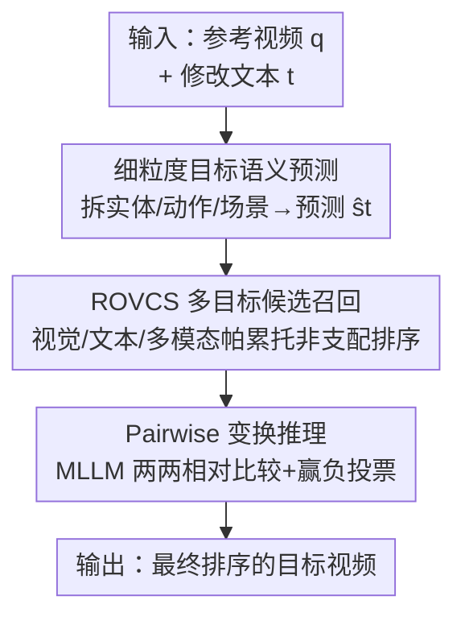

# Compositional Transformation Reasoning for Composed Video Retrieval

**会议**: CVPR 2026  
**论文**: [CVF Open Access](https://openaccess.thecvf.com/content/CVPR2026/html/Huang_Compositional_Transformation_Reasoning_for_Composed_Video_Retrieval_CVPR_2026_paper.html)  
**代码**: 无（论文未公开仓库）  
**领域**: 视频理解  
**关键词**: 组合视频检索, 多目标优化, MLLM 推理, 零样本检索, 实体-动作-场景分解  

## 一句话总结
针对"给定参考视频 + 修改文本、检索目标视频"的组合视频检索任务，本文提出零样本框架 MoRe：先用多目标帕累托排序召回一小批高质量候选，再让 MLLM 把视频拆成"实体/动作/场景"三维语义、以两两比较的方式推理哪个候选最符合修改意图，在 EgoCVR / WebVid-CoVR 上 R@1 分别提升 +5.8 / +10.8。

## 研究背景与动机
**领域现状**：组合视频检索（Composed Video Retrieval, CoVR）的输入是"一段参考视频 + 一句修改文本"，目标是从库里检索出"按文本要求改造后"的目标视频（如"把走路换成跑步""换成夜晚拍摄的同一街景"）。主流做法是监督训练：要么从 WebVid2M 这类网络语料里自动挖 video–text–video 三元组、用对比学习对齐联合 embedding（CoVR-BLIP、Dense-CoVR），要么用 LLM 生成更密的修改文本/视频描述来强化跨模态对齐（ECDE、FDCA）。

**现有痛点**：这些监督方法吃的是 web 规模的噪声三元组，学到的更多是"数据集特有的相关性"而非可迁移的组合推理能力——一换到 egocentric（第一视角）或细粒度场景就崩。更密的文本标注只增加了"描述的丰富度"，并没有真正教会模型"修改文本应该如何随时间改写原视频内容"。近期 TFR-CVR 走免训练路线（先用视觉相似度粗筛、再用 LLM 按预测的目标语义重排），泛化更好，但有两个硬伤：第一阶段纯靠视觉相似度过滤，相关目标可能在召回阶段就被提前丢掉；重排又只依赖静态的 video–text 相似度，抓不住细粒度的时序/语义变换。

**核心矛盾**：CoVR 的难点在于"组合式的多模态变换"——实体、动作、场景三个维度会随细粒度文本编辑各自演化，而现有两阶段免训练方法的"召回 ↔ 精排"是断裂的：召回只看一个模态（视觉相似），精排只能在召回剩下的池子里做绝对判断，一旦目标被召回阶段筛掉就无力回天；而 MLLM 直接判断"单个候选是否匹配"的绝对可分性又偏低。

**本文目标**：拆成两个子问题——(1) 设计一个不丢相关目标的高召回候选选择，把视觉、文本、多模态三种信号一起考虑；(2) 设计一个能讲清"实体/动作/场景各自怎么变"、且规避 MLLM 绝对判断不准的推理机制。

**切入角度**：作者观察到 MLLM 做"两两相对比较"远比做"单个候选的绝对相关性打分"可靠，于是把精排建模成成对比较；同时把"召回阶段只看视觉"升级成"视觉/文本/多模态三目标帕累托均衡"，保证目标视频更可能留在候选集里。

**核心 idea**：用"多目标帕累托召回 + 实体-动作-场景语义预测 + MLLM 两两相对推理"替代"单模态粗筛 + 绝对相关性重排"，全程零样本、不训练。

## 方法详解

### 整体框架
给定参考视频 $q$ 和修改文本 $t$，要从数据库 $V$ 里检索最符合 $t$ 所描述变换的目标视频。MoRe 是一条两阶段、全程免训练的流水线：**第一阶段**用召回导向的候选选择模块（ROVCS），在"视觉/文本/多模态"三个相互冲突的目标上做非支配（帕累托）排序，选出一小批既高召回又语义多样的候选；**第二阶段**让 MLLM 对候选两两比较、按"赢-输"投票聚合成全局排序。两阶段之间还插了一个关键桥梁——细粒度目标语义预测：把短而模糊的修改文本 $t$ 改写成"实体/动作/场景"三维的目标语义 $\hat{s}_t$，再用 $\hat{s}_t$ 替换 $t$ 去算文本/多模态相似度，让召回阶段的"文本目标"更精准。

### 关键设计

**1. ROVCS：用三目标帕累托非支配排序召回，不靠单一模态筛掉真目标**

针对"召回阶段只看视觉相似度、相关目标被提前丢掉"的痛点。每个候选视频 $v_i$ 在三个互补空间里各打一个分：视觉相似 $s^{vis}_i=\mathrm{Sim}(f_v(q),f_v(v_i))$、文本相关 $s^{txt}_i=\mathrm{Sim}(f_t(t),f_t(v_i))$、多模态一致 $s^{mul}_i=\mathrm{Sim}(f_m(q,t),f_m(v_i))$（$\mathrm{Sim}$ 为余弦相似度）。这三者本质冲突：比如"同一场景但夜晚"，白天的视觉相似视频 $s^{vis}$ 高但 $s^{txt}$ 低，夜景反之，单个视频无法同时最优三项。作者因此不做加权求和，而借多目标优化里的非支配关系——候选 $v_a$ 支配 $v_b$ 当且仅当它三项都不差、至少一项严格更优：

$$s^{vis}_a \ge s^{vis}_b,\quad s^{txt}_a \ge s^{txt}_b,\quad s^{mul}_a \ge s^{mul}_b \;(\text{且至少一项严格 }>)$$

不被任何候选支配的集合构成帕累托前沿 $P_1$。召回过程是迭代式贪心：从空集出发，分 $K$ 步逐步扩张，每步把已保留的大小为 $k{-}1$ 的集合各加入一个新候选，对所有扩展算 $(s^{vis},s^{txt},s^{mul})$ 并做非支配排序、保留落在当前前沿的前 $L_{max}$ 个集合；同前沿内用拥挤距离（crowding distance）维持多样性、防止模式坍塌。$K$ 轮后取各轮前沿之并 $V^\ast=\bigcup_{k=1}^{K}P_k$ 作为最终召回池。和"只优化一个模态"的传统选择相比，它显式平衡了多模态查询的多面需求，实测目标视频留在候选集里的比例从 64.5%/79.2% 提到 74.5%/85.4%（EgoCVR/WebVid-CoVR）。

**2. 细粒度目标语义预测：把短修改文本改写成"实体/动作/场景"三维目标语义**

针对"修改文本 $t$ 太短太概括，直接 embed 会匹配得过宽/模糊"的痛点，这一步是连接两阶段的桥梁。先让 MLLM $G(\cdot)$ 对参考视频生成三类结构化语义 token：$E_q=G(p_{Entity},q)$、$A_q=G(p_{Action},q)$、$C_q=G(p_{Scene},q)$，分别描述参考视频里的实体、动作、场景。再结合修改文本 $t$ 和参考视频解说 $n_q$，让 MLLM 推理每一维"应该变成什么"：

$$\hat{E}_t=G(p_{EChange},E_q,n_q,t),\quad \hat{A}_t=G(p_{AChange},A_q,n_q,t),\quad \hat{C}_t=G(p_{SChange},C_q,n_q,t)$$

这一步显式解耦了修改文本的组合含义——哪几维该变、怎么变。最后用融合提示 $p_{Fusion}$ 把三维预测整合成连贯的目标语义 $\hat{s}_t=G(p_{Fusion},\hat{E}_t,\hat{A}_t,\hat{C}_t)$，并用 $\hat{s}_t$ 替换原始文本 $t$ 去算上面的 $s^{txt}$ 和 $s^{mul}$。效果很直接：在纯文本→视频检索里，用 $\hat{s}_t$ 当查询比用原文 $t$ 在 EgoCVR R@1 从 0.9 飙到 5.9、WebVid-CoVR 从 24.4 到 47.6——因为原文常常只覆盖实体级线索（如"Scoop them from it"只点出实体），而 $\hat{s}_t$ 把动作、场景也补全了。

**3. Pairwise 变换推理：让 MLLM 两两相对比较而非绝对打分，再投票聚合排序**

针对"MLLM 对单个候选做绝对相关性判断精度低"的痛点。在召回池 $V^\ast$ 上，对任意两个候选 $(v_i,v_j)$ 构造比较提示 $p_{cmp}$，让 MLLM 在参考视频 $q$、解说 $n_q$、修改文本 $t$ 的语境下判断哪个更符合变换：$o_{i,j}=G(p_{cmp},q,n_q,t,v_i,v_j)$，输出离散标签 $o_{i,j}\in\{win_i,win_j,tie,uncertain\}$。MLLM 的链式思考被显式约束成四步——列出参考视频的实体/动作/场景 → 判定修改文本改了哪几维 → 更新得到目标语义 → 拿候选去对照。再把成对结果聚合成"赢-输"置信分：

$$T_i=\frac{1}{|V^\ast|-1}\sum_{j\ne i}\big[\mathbb{1}(o_{i,j}=win_i)-\mathbb{1}(o_{i,j}=win_j)\big]$$

赢加分、输减分，tie/uncertain 计零，按 $T_i$ 降序即得最终排序。把绝对判断换成相对比较带来的提升是数量级的：MoRe（绝对相关性）R@1 仅 7.4，换成相对比较直接到 20.4。代价是成对比较随候选数量平方增长（这也正是第一阶段要把池子压小的原因），论文还给了 Swiss 锦标赛策略来降复杂度。

## 实验关键数据

### 主实验
三个 CoVR benchmark：EgoCVR（第一视角、动作中心，2295 query）、WebVid-CoVR（第三视角、物体中心）、Dense-WebVid-CoVR（修改文本平均 31 词的细粒度版）。骨干用 LanguageBind 抽视觉/文本特征、Qwen2.5-VL-Instruct 当推理 MLLM，候选数 $K=15$、$L_{max}=3$，全程零样本免训练。

| 数据集 | 指标 | 本文 MoRe | 之前最好 | 提升 |
|--------|------|-----------|----------|------|
| EgoCVR (Global) | R@1 | 20.4 | 14.6 (Dense-CoVR) | +5.8 |
| EgoCVR (Global) | R@10 | 72.1 | 54.9 (Dense-CoVR) | +17.2 |
| WebVid-CoVR | R@1 | 63.0 | 52.2 (FDCA-BLIP, zero-shot) | +10.8 |
| Dense-WebVid-CoVR | R@1 | 49.6 | 48.1 (Dense-CoVR) | +1.5 |

值得注意的是，MoRe 的零样本结果在 WebVid-CoVR 上甚至超过了用域内数据微调的迁移学习方法（如 ECDE 迁移 60.1、CoVR-BLIP 迁移 53.1，仍低于 MoRe 的 63.0）。

### 消融实验
作者以同为两阶段免训练的 TFR-CVR 为基线，逐阶段替换（Stage 1 召回 / Stage 2 精排）：

| 配置 | Stage 1 | Stage 2 | EgoCVR R@1 | WebVid R@1 | 说明 |
|------|---------|---------|------------|------------|------|
| Baseline (TFR-CVR) | 视觉相似 | 文本相似 | 14.1 | 51.7 | 起点 |
| 只换 Stage 1 | ROVCS($\hat{s}_t$) | 文本相似 | 8.4 | 47.6 | 召回涨、精排崩（见下） |
| 只换 Stage 2 | 视觉相似 | MLLM 推理 | 15.8 | 60.3 | MLLM 单独已很强 |
| 换 Stage 1+2 (Full) | ROVCS($\hat{s}_t$) | MLLM 推理 | **20.4** | **63.0** | 完整模型 |

另外两个关键对照：用 $\hat{s}_t$ 替换原文 $t$ 做候选选择，文本相似/MLLM 推理两种精排下都优于用原文（Table 6）；相对比较 vs 绝对相关性，R@1 从 7.4 → 20.4（Table 8）。

### 关键发现
- **ROVCS 单独用会"涨召回、掉精度"**：只换 Stage 1 时 EgoCVR R@1 反而从 14.1 掉到 8.4——因为 ROVCS 会把"匹配指令文本但视觉证据冲突"的干扰项也召回进来，纯文本的第二阶段重排压不住。必须配 MLLM 联合视觉+文本推理才能把召回收益兑现成最终排名，这解释了为什么两个模块缺一不可。
- **相对比较是最大杠杆**：把绝对相关性判断换成两两相对比较，R@1 直接从 7.4 → 20.4，是单项最大增益，印证了"MLLM 绝对可分性差、相对判断可靠"的出发点。
- **细粒度语义预测立竿见影**：纯文本检索里 $\hat{s}_t$ 把 EgoCVR R@1 从 0.9 拉到 5.9，因为它补全了原文缺失的动作/场景维度。
- **效率-精度可调**：$K=15$ 时 R@1=20.4 但单 query 23.9s；$K=10$ 时成对比较从 105 降到 45、runtime 10.4s（接近基线 8.2s），R@1 仍有 17.2 高于基线。Swiss 锦标赛策略可进一步降时延。

## 亮点与洞察
- **把"召回"建模成多目标帕累托而非加权求和**：视觉/文本/多模态本质冲突，加权求和要调权重且会偏科；非支配排序 + 拥挤距离天然保留"三方均衡且多样"的候选集，这个思路可迁移到任何多信号召回（如组合图像检索、多模态推荐）。
- **"绝对判断不准就改成相对比较"是本文最 aha 的点**：它不是堆模型能力，而是换了一种询问 MLLM 的方式，把 +13 个点的提升几乎白捡——对所有用 MLLM 做打分/排序的任务都有启发。
- **$\hat{s}_t$ 替换 $t$ 的桥梁设计很巧**：第一阶段的"文本目标"不再用模糊的原始指令，而是用 MLLM 推理出的细粒度目标语义，让召回和精排共享同一套"实体-动作-场景"语言，两阶段不再各说各话。

## 局限与展望
- **算力/时延偏重**：默认 $K=15$ 时单 query 23.9s（成对比较 $O(K^2)$），相比基线 8.2s 慢近 3 倍；虽可用更小 $K$ 或 Swiss 锦标赛缓解，但大库实时检索仍是瓶颈。
- **强依赖 MLLM 质量**：实体/动作/场景的拆分、目标语义预测、成对判断全压在 Qwen2.5-VL 一个模型上，⚠️ 论文未系统分析换更弱 MLLM 时性能如何退化（leave-one-out 维度分析放在了补充材料）。
- **召回-精排耦合敏感**：消融显示 ROVCS 单独用会掉点，说明它对后端 MLLM 推理有较强依赖，若精排模型不够强，召回引入的干扰项反而拖累结果。
- **改进方向**：可探索自适应 $K$（按候选难度动态决定比较预算）、把成对比较的平方复杂度降到近线性（如基于不确定性的稀疏比较），以及缓存参考视频的三维语义以摊薄重复计算。

## 相关工作与启发
- **vs TFR-CVR（同为两阶段免训练）**：TFR-CVR 第一阶段只用视觉相似度粗筛、第二阶段用文本相似度重排；本文把召回升级成三目标帕累托（更高召回、不丢真目标）、把精排升级成 MLLM 两两相对推理（规避绝对判断不准）。两处升级共同把 EgoCVR R@1 从 14.1 提到 20.4。
- **vs Dense-CoVR / ECDE / FDCA（监督方法）**：它们靠 web 规模三元组或更密的文本标注做对比训练，泛化受限且偏向数据集特有相关性；本文全程零样本，靠 MLLM 的组合推理能力，在 WebVid-CoVR 上零样本反超它们的迁移学习结果。
- **vs FDCA（同样做修改文本分解）**：FDCA 把修改文本拆成"保留/注入/排除"组件在 token 级对齐；本文则把变换拆成"实体/动作/场景"三维语义并显式预测目标态 $\hat{s}_t$，更贴合"视频随时间演化"的时序变换语义。

## 评分
- 新颖性: ⭐⭐⭐⭐ 帕累托多目标召回 + 相对比较推理的组合在 CoVR 上是新颖且自洽的设计，单点技术多为已有思想的巧妙嫁接。
- 实验充分度: ⭐⭐⭐⭐ 三个 benchmark + 逐阶段消融 + 效率分析 + 召回率/相对vs绝对对照，论证链完整；部分维度分析放在补充材料。
- 写作质量: ⭐⭐⭐⭐ 动机与两阶段设计讲得清晰，公式与图示到位；个别记号（如 $\hat{s}_t$ 的具体形态）略抽象。
- 价值: ⭐⭐⭐⭐ 零样本即超监督迁移，"相对比较替代绝对打分"的洞察对一切 MLLM 排序任务有普适借鉴意义。

<!-- RELATED:START -->

## 相关论文

- [\[CVPR 2026\] Beyond Caption-Based Queries in Video Moment Retrieval](beyond_caption-based_queries_in_video_moment_retrieval.md)
- [\[CVPR 2026\] Towards Sparse Video Understanding and Reasoning](towards_sparse_video_understanding_and_reasoning.md)
- [\[CVPR 2026\] StreamRAG: Enhancing Real-Time Video Understanding with Retrieval Augmentation](streamrag_enhancing_real-time_video_understanding_with_retrieval_augmentation.md)
- [\[NeurIPS 2025\] VGEnt: Graph-Based Retrieval-Reasoning-Augmented Generation for Long Video Understanding](../../NeurIPS2025/video_understanding/vgent_graph-based_retrieval-reasoning-augmented_generation_for_long_video_unders.md)
- [\[CVPR 2026\] VAST: Video Ability-Stratified Taxonomy for Data-Efficient Video Reasoning](vast_video_ability-stratified_taxonomy_for_data-efficient_video_reasoning.md)

<!-- RELATED:END -->
