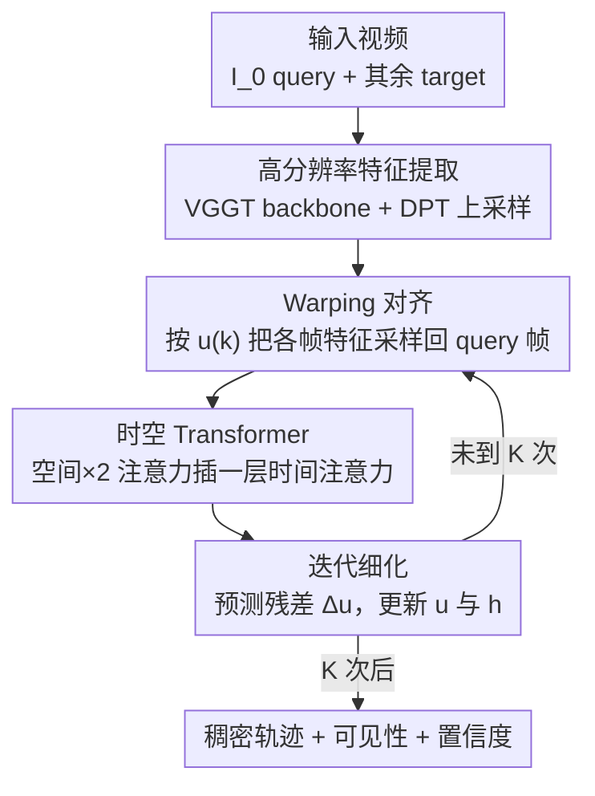

# CoWTracker: Tracking by Warping instead of Correlation

**会议**: CVPR 2026  
**论文**: [CVF Open Access](https://openaccess.thecvf.com/content/CVPR2026/html/Lai_CoWTracker_Tracking_by_Warping_instead_of_Correlation_CVPR_2026_paper.html)  
**代码**: 项目页 https://cowtracker.github.io （代码待确认）  
**领域**: 视频理解  
**关键词**: 点追踪, 光流, 特征 warping, 时空 Transformer, 稠密对应

## 一句话总结
CoWTracker 把稠密点追踪里"算 cost volume 找匹配"换成"按当前轨迹估计把目标帧特征 warp 回参考帧 + 时空 Transformer 全局推理"，去掉了随分辨率平方增长的代价体，在 TAP-Vid / RoboTAP 上拿到 SOTA，且同一个模型零样本迁移到光流也能打过专门的光流方法。

## 研究背景与动机
**领域现状**：从 PIPs 开始，主流的 track-any-point（TAP）追踪器几乎都沿用一套范式——用 cost volume（代价体 / 相关体）在帧之间匹配特征，再用 Transformer 把每条轨迹当 token 序列做时序细化（CoTracker、LocoTrack、AllTracker 都是这条线）。cost volume 来自光流文献（RAFT），它显式地把源图每个位置和目标图一片候选位置逐一比相似度。

**现有痛点**：cost volume 的代价随空间分辨率**平方增长**——源图 $H'\times W'$ 个位置，每个都要和目标图一片邻域比一遍。为了把显存压住，这类方法只能在低分辨率特征上算匹配，于是细小结构（如自行车车把、过山车轨道）、大视角变化、遮挡后重定位都容易丢。AllTracker 就在过山车这种细结构场景上追丢前半段。

**核心矛盾**：追踪精度想要高分辨率特征对齐，但 cost volume 的平方复杂度又逼着你降分辨率——分辨率和效率/显存之间是硬 trade-off。

**切入角度**：作者注意到光流领域最近开始质疑 cost volume。WAFT 证明可以用一个 **warping 机制**替代代价体：每次迭代不去搜一片候选，而是按当前流场把目标帧特征**只采样一个点**（current estimate 指定的那个位置）warp 回源帧，再和源特征拼起来交给网络更新流场。乍看每个源位置每轮只配一个目标位置似乎匹配不上，但 WAFT 的关键洞察是——把配好的特征再过一层 self-attention，模型仍能全局地推理对应关系。

**核心 idea**：作者发现 WAFT 里"自注意力全局推理匹配"和 CoTracker 里"跨轨迹自注意力做联合追踪"在概念上是同一件事，于是把 warping 从光流搬到稠密点追踪——**用 warping 代替 correlation**：对参考帧每个像素估计轨迹，按当前轨迹把所有其他帧的特征 warp 回参考帧，再用一个空间/时间分离注意力的 Transformer 迭代细化。复杂度从随分辨率平方降到线性，于是能直接在高分辨率上对齐特征。

## 方法详解

### 整体框架
CoWTracker 输入一段 $T+1$ 帧的视频，第 0 帧 $I_0$ 是 query 帧、其余是 target 帧，要为 query 帧上每个像素 $p$ 在每个 target 帧 $I_t$ 预测位置 $x_t(p)$，同时给可见性 $v_t(p)$ 和置信度 $\sigma_t(p)$。轨迹用位移场表达：$x_t(p) = p + u_t(p)$，初始假设所有点静止即 $u^{(0)}=0$。

整条 pipeline 三步：**Backbone**（VGGT 等强预训练模型）抽每帧低分辨率特征 → **DPT 上采样器**把特征 lift 到接近输入分辨率的高分辨率 → **warping-only 追踪器**用一个轻量 update operator 迭代 $K$ 次：每轮按当前位移 $u^{(k)}$ 把所有帧特征 warp 回 query 帧，拼接后送进时空 Transformer 预测残差位移、更新位移场和隐状态。$K$ 次后用最终隐状态的线性头读出可见性和置信度。关键是——整个 head 里**没有任何 correlation volume**，唯一做跨帧特征配对的地方就是那个 warping 操作（Eq. 2），所以 head 的开销随帧数 $T$、分辨率 $|P|$、迭代数 $K$ 都是**线性**的。

### 关键设计

**1. Warping 对齐：用单点采样代替平方复杂度的 cost volume**

这是全文的核心，直接针对"cost volume 平方复杂度逼着降分辨率"的痛点。给定当前位移估计 $u$，warping 操作 $G = W(F, u, p)$ 把每个 target 帧 $t$ 的特征在 $p+u_t(p)$ 处做双线性采样，对齐回 query 帧 0 时刻的位置 $p$：

$$G_t(p) = \text{sample}(F_t,\ p + u_t(p))$$

和 cost volume 把每个源位置对一片候选位置都比一遍不同，warping **每轮只评估一个配对**（当前轨迹指向的那个点）。这就是复杂度从平方降到线性的根源——没有相关体、没有多分辨率金字塔要构造和存储。代价是单点采样信息很稀疏，匹配是否对上完全靠后面的 Transformer 去全局推理纠正（设计 2、3 承接这一点）。消融里把 warping 拿掉换成"始终查原始特征"（Ours no warp），$\delta_{avg}$ 在 DAVIS 上暴跌 23.4，直接证明显式 warping 不可或缺。

**2. 空间-时间分离的 Transformer：补上"没有 cost volume 显式搜匹配"的全局推理**

warping 每轮只给一个稀疏配对，光靠它建立不了可靠对应，所以需要一个全局推理模块。update operator 把 warp 后的目标特征 $G_t$、query 特征 $F_0$、当前位移 $u_t^{(k)}$、隐状态 $h_t^{(k)}$ 沿通道拼成 token 张量 $z$：

$$z_t = G_t^{(k)} \,\|\, F_0 \,\|\, u_t^{(k)} \,\|\, h_t^{(k)}, \quad t \in T$$

这些 token 按时间×空间组织，加上时空位置编码后过一个改造自 ViT 的视频 Transformer：**每两层空间自注意力插一层时间注意力**——空间注意力对固定时刻 $t$ 在所有位置 $P$ 上跑，时间注意力对固定位置 $p$ 在所有帧 $T$ 上跑。空间注意力承接了 WAFT 里"全局推理匹配"的作用，时间注意力则等价于 CoTracker 的跨轨迹联合追踪，让模型即使在遮挡时也能借相邻轨迹推断当前点该在哪。消融显示时间注意力在 600 帧的长视频（RGB-Stacking / RoboTAP）上分别带来 +11.7 / +11.2 $\delta_{avg}$ 的巨大提升。

**3. 迭代细化：从零位移出发逐步收敛**

追踪器维护两个状态——位移场 $u^{(k)}$ 和隐状态 $h^{(k)}$（$h^{(0)}$ 由 $F_0$ 与 $F_t$ 通道拼接后经一个 $1\times1$ 卷积 + LayerNorm 的小网络 $\xi$ 降维初始化）。每轮 update operator 输出残差位移并累加：

$$\Delta u^{(k+1)} = h^{(k+1)} W_u, \qquad u^{(k+1)} = u^{(k)} + \Delta u^{(k+1)}$$

由于初始 $u^{(0)}=0$（假设点静止），第一轮 warp 基本等于原地采样，之后每轮用更准的位移重新 warp、得到更对齐的特征、再修正位移，形成"warp→细化→再 warp"的闭环。实验里性能从 $K=1$ 到 $K=2$ 大幅提升，约在 $K=5$–$6$ 饱和（默认 $K=5$）。消融显示单遍 vs 迭代在 DAVIS 上差 +6.6 $\delta_{avg}$。

**4. DPT 高分辨率上采样：把 warping 索引喂到接近输入分辨率**

cost volume 方法被迫在低分辨率算匹配，而 warping-only 设计没有大代价体要存，正好可以吃高分辨率。作者用 DPT 上采样器（带 backbone skip 连接的轻量卷积解码器）把 backbone 的低分辨率特征 $\hat F$ lift 到 stride $s' = 2s$ 的高分辨率，并仿照 WAFT 再用一个小 U-Net 直接吃原图、把输出和上采样特征拼接。把特征分辨率拉到接近输入，对追踪贴近边界的细小物体（车把、轨道）帮助很大。消融里 indexing stride 从 1/16 细到 1/2，DAVIS $\delta_{avg}$ 从 70.9 一路涨到 78.0，证明"优先高分辨率索引"这个判断成立。

### 损失函数 / 训练策略
仅在 Kubric 合成数据上训练。位移用 Huber loss 监督（可见和被遮挡轨迹都算），各迭代步权重按指数递增（follow CoTracker3）；可见性和置信度在每个迭代步用 BCE 监督，ground-truth 置信度由"预测轨迹是否落在真值 12 像素内"的指示函数给出。AdamW，学习率 $5\times10^{-4}$ 余弦衰减，batch 32 段视频、每段最多 16 帧、分辨率 $336\times560$，训 50k 步；随机化帧率和视频长度做增强，用混合精度 + 梯度检查点。

## 实验关键数据

### 主实验
仅用 Kubric 训练，在 TAP-Vid（DAVIS / RGB-Stacking / Kinetics）和 RoboTAP 上，CoWTracker 在全部四个数据集、三项指标（AJ / $\delta_{avg}$ / OA）上都超过最强的稠密追踪器 AllTracker。下表为四数据集均值：

| 方法 | 训练数据 | Mean AJ↑ | Mean $\delta_{avg}$↑ | Mean OA↑ |
|------|---------|----------|----------|----------|
| CoTracker3 (offl.) [19] | Kub+15k | 62.0 | 74.4 | 89.6 |
| DELTA [29] | Kub | 61.1 | 74.6 | 87.2 |
| AllTracker [14] | Kub+Mix | 68.9 | 80.5 | 91.5 |
| **CoWTracker** | **Kub** | **71.3** | **81.8** | **93.3** |

相对 AllTracker（Kub+Mix）均值提升 AJ +2.4 / $\delta_{avg}$ +1.3 / OA +1.8；在同样只用 Kubric 训练的公平对比下（vs AllTracker Kub），差距进一步拉大到 +3.3 / +2.2 / +3.0。遮挡分类（OA）提升尤其明显，DAVIS 上 +4.3——作者归因于 head 直接在图像特征上工作，而非像 cost volume 那样把外观压成相关分数、丢掉边界处预测可见性的通道线索。

**零样本光流**：把帧对当成两帧视频、用同一个未在任何光流数据上训过的模型直接跑：

| 方法 | Sintel Clean↓ | Sintel Final↓ | KITTI EPE↓ | KITTI Fl-all↓ |
|------|---------------|---------------|-----------|---------------|
| RAFT [37] | 1.15 | 1.86 | 1.53 | 7.81 |
| SEA-RAFT (M) [44] | 0.97 | 1.96 | 1.60 | 8.26 |
| WAFT (twins-a2) [43] | 0.94 | 2.09 | 1.15 | 5.29 |
| **CoWTracker（零样本）** | **0.78** | **1.48** | **1.04** | **4.87** |

在 Sintel Clean/Final 上相对最好的专门光流模型分别相对降低 17%/20% EPE，KITTI 上相对最强 WAFT 降 9.6% EPE / 7.9% Fl-all——一个为点追踪训的模型零样本反超专门光流方法。

### 消融实验
（均以 $\delta_{avg}$ 报告）

| 配置 | DAVIS | RGB-S | RoboTAP | 说明 |
|------|-------|-------|---------|------|
| Full（VGGT + DPT + warp + 时空 + iter） | 78.0 | 92.8 | 83.4 | 完整模型 |
| Ours (no warp) | 54.6 | 85.5 | 73.8 | 去 warping → DAVIS 暴跌 23.4 |
| ViT (img., 仅空间注意力) | 74.7 | 81.1 | 72.6 | 去时间注意力 → 长视频掉 11+ |
| 单遍（非迭代） | 71.4 | 90.0 | 79.4 | 去迭代 → DAVIS −6.6 |
| 无上采样器 | 72.5 | 90.3 | 80.0 | 低分辨率索引 → DAVIS −5.5 |
| backbone 换 CoTracker ConvNet | 62.9 | 77.1 | 68.3 | 弱 backbone 明显更差 |

### 关键发现
- **warping 是命门**：去掉 warping 换成"查原始特征"在 DAVIS 上掉 23.4 $\delta_{avg}$，是所有消融里最大的降幅，证明显式按轨迹采样对齐特征不可替代。
- **时间注意力对长视频至关重要**：在最长 600 帧的 RGB-Stacking / RoboTAP 上加时间注意力分别 +11.7 / +11.2，说明跨帧联合推理是遮挡/长程鲁棒的来源。
- **高分辨率索引值得**：indexing stride 越细越好（1/2 > 1/4 > 1/8 > 1/16），即便用更大 patch size 补偿算力，高分辨率仍明显占优——这正是 warping-only 去掉平方复杂度后才负担得起的红利。
- **越强的视频 backbone 越受益**：VGGT > Pi3 > ViT > CoTracker 的 ConvNet，head 能直接吃 backbone 红利。

## 亮点与洞察
- **一个统一视角**：作者把"WAFT 的 warp + self-attention"和"CoTracker 的跨轨迹注意力"指认为同一件事，从而把光流的 warping 范式干净地搬到点追踪——这个概念连接是全文最"啊哈"的地方，也让一个模型能同时统一稠密点追踪和光流。
- **复杂度换维度**：去掉 cost volume 省下的不只是显存，而是把省下的预算花到"更高分辨率索引"上，反而换来更准的边界/细结构追踪——这是"省 → 再投资"的巧妙工程取舍，可迁移到任何被代价体平方复杂度卡住分辨率的匹配任务。
- **遮挡鲁棒的副产品**：warping-indexed 特征保留了通道级外观线索，相比把外观压成点积相似度的 cost volume，在边界遮挡处给可见性头更多信息，OA 提升明显。

## 局限与展望
- **依赖强预训练 backbone**：性能高度依赖 VGGT 这类强视频特征提取器（消融里换弱 backbone 大幅掉点），单独看 warping head 的贡献和对 backbone 的依赖耦合较深。
- **低运动区间优势消失**：在 Spring（平均位移仅 3.5 像素）这种极低运动场景上，CoWTracker 略逊于专门的 WAFT，作者也承认此时各方法误差都接近噪声尺度、难下强结论。⚠️ 这提示 warping 的优势主要体现在大位移/纹理稀疏场景。
- **仅 Kubric 合成训练**：虽然泛化到真实域不错，但没探索真实数据自训练（如 CoTracker3、BootsTAPIR 的大规模自训练）能否再上一层。
- 改进方向：把 warping head 接到更轻的 backbone 上做端侧版本；或探索 3D/深度感知的 warping 追踪。

## 相关工作与启发
- **vs AllTracker**：同是稠密追踪、同走"统一追踪所有点"路线，但 AllTracker 仍用 cost volume + 多分辨率金字塔，被迫低分辨率匹配；CoWTracker 用 warping-only head 去掉代价体、吃高分辨率索引，四数据集三指标全面超越，且遮挡精度（OA）优势最明显。
- **vs CoTracker / CoTracker3**：CoTracker 用跨轨迹自注意力做联合追踪、仍依赖相关特征；CoWTracker 借用了它的时间注意力思想，但把匹配机制整体换成 warping，且是稠密而非稀疏。
- **vs WAFT**：WAFT 在光流上提出 warp 替代 cost volume；CoWTracker 指出其 self-attention 与联合追踪等价，把这套搬进点追踪，并加入时间注意力处理长视频——反过来在零样本光流上还超过了 WAFT。
- **vs TAPTRv2**：TAPTRv2 用 deformable attention 去掉稀疏点追踪的 cost volume，但每个 query 只出单个位移、难扩到稠密；CoWTracker 的 warping 天然支持每像素稠密轨迹。

## 评分
- 新颖性: ⭐⭐⭐⭐⭐ 把 warping 范式从光流干净地迁到稠密点追踪，并用概念连接统一了两个任务，思路简洁有力。
- 实验充分度: ⭐⭐⭐⭐⭐ 点追踪 + 零样本光流双线 SOTA，六项消融逐一拆解 backbone/上采样/分辨率/时间注意力/迭代/head 设计。
- 写作质量: ⭐⭐⭐⭐ 动机推导清晰、公式到位；个别符号渲染（OCR 来源）需对照原文。
- 价值: ⭐⭐⭐⭐⭐ 去掉 cost volume 平方复杂度、统一追踪与光流，对后续匹配类任务有方法论参考价值。

<!-- RELATED:START -->

## 相关论文

- [\[CVPR 2026\] Efficient All-Pairs Correlation Volume Sampling for Optical Flow Estimation](efficient_all-pairs_correlation_volume_sampling_for_optical_flow_estimation.md)
- [\[CVPR 2026\] One-Shot Flow, Any-Time Frame: A Bidirectional Warping Framework for Event-Based Video Frame Interpolation](one-shot_flow_any-time_frame_a_bidirectional_warping_framework_for_event-based_v.md)
- [\[AAAI 2026\] BAT: Learning Event-based Optical Flow with Bidirectional Adaptive Temporal Correlation](../../AAAI2026/video_understanding/bat_learning_event-based_optical_flow_with_bidirectional_adaptive_temporal_corre.md)
- [\[AAAI 2026\] Task-Specific Distance Correlation Matching for Few-Shot Action Recognition](../../AAAI2026/video_understanding/task-specific_distance_correlation_matching_for_few-shot_action_recognition.md)
- [\[CVPR 2026\] Rethinking Occlusion Modeling for UAV Tracking](rethinking_occlusion_modeling_for_uav_tracking.md)

<!-- RELATED:END -->
