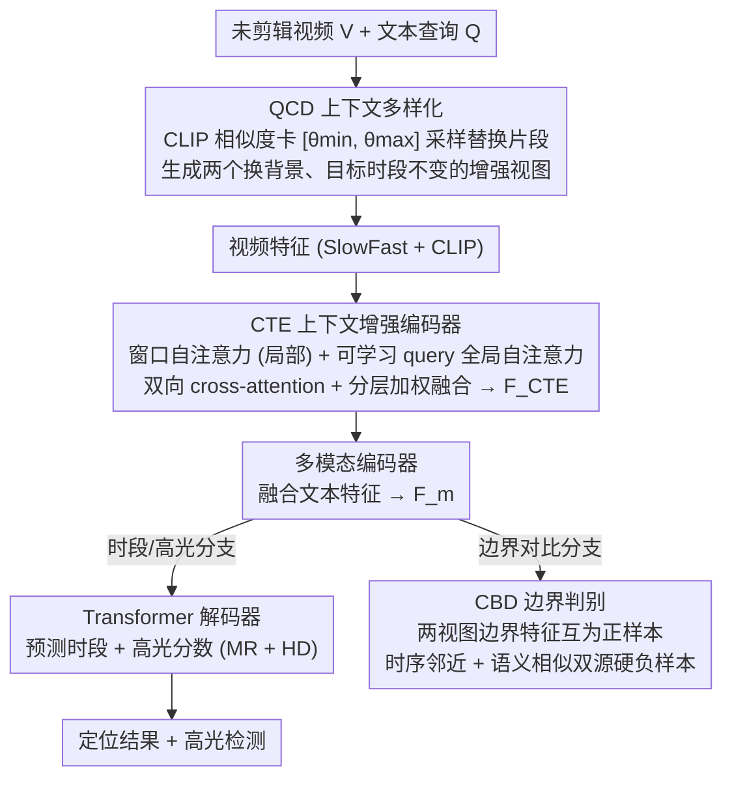

# CVA: Context-aware Video-text Alignment for Video Temporal Grounding

**会议**: CVPR 2026  
**arXiv**: [2603.24934](https://arxiv.org/abs/2603.24934)  
**代码**: [https://byeol3325.github.io/projects/CVA/](https://byeol3325.github.io/projects/CVA/)  
**领域**: 视频理解 / 时序定位  
**关键词**: 视频时序定位, 数据增强, 对比学习, 上下文不变性, 视频-文本对齐

## 一句话总结
提出 CVA（Context-aware Video-text Alignment）框架，通过 Query-aware Context Diversification（QCD）、Context-invariant Boundary Discrimination（CBD）损失和 Context-enhanced Transformer Encoder（CTE）三个协同组件，解决视频时序定位中的假阴性和背景关联问题，在 QVHighlights 上 R1@0.7 提升约 5 个点。

## 研究背景与动机

**领域现状**：视频时序定位（VTG）旨在根据文本查询定位未剪辑视频中的目标时段，包含视频时刻检索（VMR）和高光检测（HD）两个子任务。近年来基于 DETR 的端到端方法成为主流。

**现有痛点**：(1) 模型倾向学习虚假关联——将文本查询与静态背景过度关联，而非聚焦目标动作/事件；(2) TD-DETR 提出内容混合增强来打断此关联，但替换片段的选择与文本查询无关，可能引入假阴性（替换了与查询语义相关的片段却标为负样本）。

**核心矛盾**：内容混合增强的有效性取决于替换片段的语义——query-agnostic 的混合无法保证替换片段确实与查询无关。

**本文要解决**：如何在多样化上下文的同时避免假阴性？如何使模型在边界处学到对上下文变化鲁棒的表征？

**切入角度**：(1) 基于 CLIP 预计算文本-视频相似度统计，从数据集级别构建 query-aware 的有效替换池；(2) 用对比学习强化时序边界处的上下文不变表征；(3) 用分层 Transformer 捕获多尺度时序上下文。

**核心 idea**：Query-aware 数据增强 + 边界聚焦对比学习 + 分层时序建模 = SOTA 时序定位。

## 方法详解

### 整体框架
CVA 想解决的核心问题是：视频时序定位模型容易把文本查询和静态背景绑死，而既有的"内容混合"增强又会误伤与查询相关的片段、制造假阴性。它在标准的 DETR-based 框架上挂了三个相互配合的组件——训练时先由 QCD 生成"换了背景但语义没变"的增强视频对，再让 CTE 取代普通 Transformer 编码器去捕获多尺度时序上下文，最后由 CBD 在两个增强视图之间、专门盯着时段边界拉一个对比约束。三者一前一后：QCD 管"喂什么数据"，CTE 管"怎么编码"，CBD 管"边界处学到什么表征"。下游沿用 DETR 范式：CTE 输出再与文本特征过多模态编码器，分流到 Transformer 解码器（出时段 + 高光分数）和对比头（接 CBD 损失）。

### 关键设计

**1. Query-aware Context Diversification（QCD）：让上下文替换"挑对片段"，从源头掐断假阴性**

痛点很直接：TD-DETR 用内容混合打断"查询↔背景"的虚假关联，但它替换片段时根本不看查询，很可能把一段其实和查询语义相关的片段换进来、却照样标成负样本，反而教坏了模型。QCD 的做法是把替换这件事变成"有依据地挑"：先用 CLIP 预计算所有视频片段与所有查询之间的余弦相似度矩阵，再根据 GT 对（$\mathcal{S}_{\text{gt}}$）和非 GT 对（$\mathcal{S}_{\text{non}}$）两组相似度的分布，用百分位卡出一个有效采样区间

$$\theta_{\min} = \text{Percentile}_\alpha(\mathcal{S}_{\text{non}}), \quad \theta_{\max} = \text{Percentile}_\beta(\mathcal{S}_{\text{gt}})$$

替换片段只从另一段视频里相似度落在 $[\theta_{\min}, \theta_{\max}]$ 内的片段中采样，同时把 GT 时段及其前后各 $p$ 个相邻片段原样保留下来（上下文保持）。这两道闸刀分工明确：下界 $\theta_{\min}$ 滤掉那些和查询八竿子打不着的 trivial 片段（它们提供不了有意义的负样本信号），上界 $\theta_{\max}$ 滤掉相似度过高、很可能本就是假阴性的片段。举例来说，某段视频有 30 个候选片段，低于 $\theta_{\min}$ 的太无关、高于 $\theta_{\max}$ 的疑似假阴性都被剔除，剩下"够相关又不至于撞上正样本"的那一档才进采样池。用百分位而不是固定阈值，是因为不同数据集的相似度尺度天差地别，分位数能自适应地划线，比拍脑袋的固定值稳得多。

**2. Context-enhanced Transformer Encoder（CTE）：用窗口注意力补上局部时序，再分层融合多尺度上下文**

标准 Transformer 编码器一上来就做全局自注意力，缺的是对"局部时序模式"的显式建模——而时序定位恰恰要靠局部的动作起伏来找边界。CTE 把编码器换成 $N_b$ 个堆叠块，每块里干三件事：用窗口自注意力处理视频特征、专盯局部时序依赖；用全局自注意力处理一组可学习 query、给整段视频提供全局语义锚点；再用双向 cross-attention 让视频和 query 互相交换信息。最后不只取最后一层，而是把各层输出拼起来、经 MLP 压缩后和原视频特征做可学习权重的加权融合：

$$\mathbf{F}_{\text{CTE}} = \omega \cdot \mathbf{F}_v + (1-\omega) \cdot \text{Norm}(\text{MLP}(\text{Concat}_{l=1}^{N_b}(\mathbf{F}^{(l)})))$$

这样局部依赖（窗口）、全局语义（可学习 query）和跨层多尺度信息（分层聚合）被一并喂给下游头，比单纯堆全局注意力更贴合"既要看清局部动作、又要把握整体语境"的定位需求。

**3. Context-invariant Boundary Discrimination（CBD）：把对比学习钉在边界上，逼出对上下文变化鲁棒的判别表征**

边界是定位里最关键、也最容易翻车的地方——差几帧就掉一个 IoU 档位。CBD 的思路是：既然 QCD 能对同一段视频生成两个"换了背景但目标时段不变"的增强视图 $\mathbf{V}'_{\text{mix}}$ 和 $\mathbf{V}''_{\text{mix}}$，那就在这两个视图的 GT 时段边界处（起/止帧）取特征，互为 anchor 和 positive，强迫它们对齐。负样本特意从两个维度找硬的：一是空间上紧挨边界的背景帧（hard boundary negatives，逼模型分清"刚好在边界内 vs 刚好在边界外"），二是远处但语义最相似的背景帧（hard semantic negatives，逼模型别被长得像的背景骗走）。对比损失写成

$$\mathcal{L}_{CBD} = -\frac{1}{|\mathcal{B}|} \sum_{b \in \mathcal{B}} \log \frac{\exp(s_{p,b})}{\exp(s_{p,b}) + \sum_{\mathbf{z}_n \in \mathcal{Z}^-} \exp(s_{n,b})}$$

之所以有效，是因为它在"背景被换掉"的扰动下仍要求边界表征保持一致，等于直接训练出一种和上下文无关的边界判别力；而时序邻近 + 语义相似这对双源硬负样本，又保证了这种判别力在时间和语义两个方向上都立得住。

### 损失函数 / 训练策略
- $\mathcal{L}_{\text{total}} = \mathcal{L}_{\text{MR}} + \mathcal{L}_{\text{HD}} + \lambda_{\text{CBD}} \mathcal{L}_{\text{CBD}}$
- MR 损失：$\lambda_{\text{L1}} \mathcal{L}_{\text{L1}} + \lambda_{\text{gIoU}} \mathcal{L}_{\text{gIoU}}$
- HD 损失：$\lambda_{\text{HD}}(\mathcal{L}_{\text{margin}} + \mathcal{L}_{\text{rank}})$
- $\lambda_{\text{L1}}=10$, $\lambda_{\text{gIoU}}=1$, $\lambda_{\text{HD}}=1$, $\lambda_{\text{CBD}}=0.005$
- QCD 参数：$\alpha=10$, $\beta=60$, 替换比例 0.3, 上下文保持窗口 $p=1$
- AdamW 优化器，cosine annealing，batch size 32

## 实验关键数据

### 主实验——QVHighlights test split

| 方法 | R1@0.5↑ | R1@0.7↑ | mAP Avg↑ | HD mAP↑ |
|------|---------|---------|----------|---------|
| Moment-DETR | 52.89 | 33.02 | 30.73 | 35.69 |
| QD-DETR | 62.40 | 44.98 | 39.86 | 38.94 |
| CG-DETR | 65.43 | 48.38 | 42.86 | 40.33 |
| TD-DETR | 64.53 | 50.37 | 46.69 | - |
| CDTR | 65.79 | 49.60 | 44.37 | - |
| **CVA (Ours)** | **70.05** | **55.32** | **47.49** | **44.43** |

提升幅度：R1@0.5 +4.26 (vs CDTR), R1@0.7 +4.95 (vs TD-DETR), HD mAP +4.1 (vs CG-DETR)

### Charades-STA 和 TACoS

| 数据集 | 方法 | R1@0.5↑ | R1@0.7↑ | mIoU↑ |
|--------|------|---------|---------|-------|
| Charades | BAM-DETR (prev best) | 59.95 | 39.38 | 52.33 |
| Charades | **CVA** | **62.61** | **40.78** | **53.35** |
| TACoS | BAM-DETR (prev best) | 41.45 | 26.77 | 39.31 |
| TACoS | **CVA** | **43.21** | **27.73** | **41.07** |

### 消融实验

| 配置 | R1@0.5↑ | R1@0.7↑ | HD mAP↑ | 说明 |
|------|---------|---------|---------|------|
| Baseline (QCD basic) | ~63 | ~48 | ~39 | 基础增强 |
| + QCD (query-aware) | ~68 | ~52 | ~41 | 大幅提升 R1 |
| + QCD + CTE | ~68.5 | ~53.5 | ~43 | 架构增强 |
| + QCD + CTE + CBD | **70.05** | **55.32** | **44.43** | 完整 CVA |

### 关键发现
- R1 指标的大幅提升（~5 points）直接证明了 QCD 减少假阴性的有效性
- CBD 对精确定位贡献最大，特别是 R1@0.7（严格 IoU 阈值下边界判别更重要）
- 三个组件协同效应明显：QCD 提供多样化高质量训练样本，CTE 提供更好的时序建模，CBD 确保边界判别性
- 方法在三个不同特征的 benchmark（QVHighlights/Charades-STA/TACoS）上一致有效

## 亮点与洞察
- **数据中心视角**：不仅改进模型架构，更重视训练数据的质量——QCD 从数据增强角度解决假阴性是关键创新
- **边界聚焦**：CBD 将对比学习精确定向到最关键的边界区域，比全帧对比更高效
- **统计驱动的阈值**：用数据集级别的相似度分布统计（百分位阈值）替代手动设定，具有自适应性
- **双源硬负样本**：同时考虑时序邻近和语义相似两种硬负样本，更全面地增强判别性

## 局限与展望
- QCD 需要预计算 CLIP 相似度矩阵（一次性开销），数据集非常大时可能较慢
- 窗口大小和 query 数量等超参选择未充分讨论
- 仅使用 SlowFast + CLIP 视频特征，更强的视频编码器可能带来更多提升
- 未与最新的 VLM-based 方法对比

## 相关工作与启发
- TD-DETR 识别了背景关联问题并用内容混合解决，CVA 的 QCD 修复了其假阴性缺陷——这是典型的"问题→partial solution→改进"研究链
- 窗口注意力（Swin Transformer 启发）和可学习 query（DETR 启发）的结合在时序任务中很有效
- 边界对比学习的思路可推广到动作检测、视频分割等需要精确时序边界的任务

## 评分
- 新颖性: ⭐⭐⭐⭐ QCD 的 query-aware 增强和 CBD 的边界聚焦对比有创新，CTE 较常规
- 实验充分度: ⭐⭐⭐⭐⭐ 三个 benchmark+完整消融+组件级分析
- 写作质量: ⭐⭐⭐⭐ 问题定义清晰，方法描述详细
- 价值: ⭐⭐⭐⭐⭐ R1 提升约 5 点是非常显著的，对 VTG 领域有实质推动

<!-- RELATED:START -->

## 相关论文

- [\[CVPR 2026\] TF-CADE: Foreground-Concentrated Text-Video Alignment for Zero-Shot Temporal Action Detection](tf-cade_foreground-concentrated_text-video_alignment_for_zero-shot_temporal_acti.md)
- [\[CVPR 2026\] T2SGrid: Temporal-to-Spatial Gridification for Video Temporal Grounding](t2sgrid_temporal-to-spatial_gridification_for_video_temporal_grounding.md)
- [\[CVPR 2026\] Learning to Refuse: Refusal-Aware Reinforcement Fine-Tuning for Hard-Irrelevant Queries in Video Temporal Grounding](learning_to_refuse_refusal-aware_reinforcement_fine-tuning_for_hard-irrelevant_q.md)
- [\[CVPR 2026\] HieraMamba: Video Temporal Grounding via Hierarchical Anchor-Mamba Pooling](hieramamba_video_temporal_grounding_via_hierarchical_anchor-mamba_pooling.md)
- [\[CVPR 2026\] DETACH: Decomposed Spatio-Temporal Alignment for Exocentric Video and Ambient Sensors with Staged Learning](detach_decomposed_spatio-temporal_alignment_for_exocentric_video_and_ambient_sen.md)

<!-- RELATED:END -->
