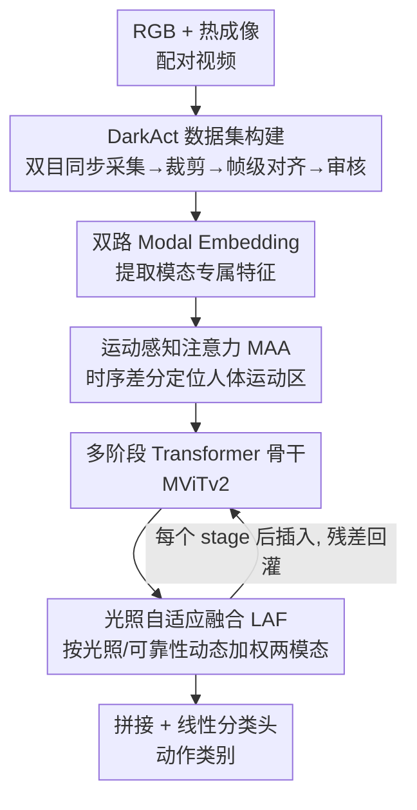

# DarkAct: A RGB-Thermal Dataset and Fusion Framework for Multimodal Low-Light Action Recognition

**会议**: CVPR 2026  
**论文**: [CVF Open Access](https://openaccess.thecvf.com/content/CVPR2026/html/Tan_DarkAct_A_RGB-Thermal_Dataset_and_Fusion_Framework_for_Multimodal_Low-Light_CVPR_2026_paper.html)  
**代码**: https://github.com/darkact-creator/DarkAct  
**领域**: 视频理解  
**关键词**: 低光照动作识别, RGB-热成像融合, 多模态数据集, 运动注意力, 光照自适应融合

## 一句话总结
针对夜间/低光照下人体动作识别缺数据、缺方法的空白，作者构建了首个大规模 RGB–热成像配对视频数据集 DarkAct（12,778 对视频、27 类动作），并提出融合框架 DarkAct-Net——用运动感知注意力提取人体运动显著区、用光照自适应融合按可靠性动态整合两模态，在多模态识别上达到 74.4% Top-1，大幅超越所有单模态与现有融合基线。

## 研究背景与动机

**领域现状**：人体动作识别（HAR）已经相当成熟，CNN、3D 卷积、Video Transformer 在 Kinetics、UCF101、HMDB51 等基准上刷得很高。但这些主流数据集与方法几乎都默认"光照充足"——视频里人体外观清晰、纹理可辨。

**现有痛点**：到了低光照（夜间、弱光基础设施、安防监控）场景，RGB 画面急剧退化：可见度下降、运动模糊、人体外观判别信息几乎丢失。一个自然的解法是 RGB–热成像融合——热成像不依赖可见光、能在黑暗中稳定成像，正好补 RGB 的短板。但这个方向被一个硬约束卡住：**没有大规模、高质量的配对 RGB–热成像视频数据集**。已有的低光数据集 ARID 只有 RGB、11 类、且多是固定视角的静态场景；多模态数据集（深度、骨架、惯性传感器）要么传感器昂贵不实用，要么是正常光照采集的。

**核心矛盾**：要在黑暗里稳健识别动作，就需要一种廉价、对光照不变的互补模态（热成像天然满足），但训练这样的融合模型又缺乏配对数据——数据缺口和方法缺口互相锁死。而且作者实测发现：即便把现成的多模态融合框架搬过来，在这种低光异构信号上**反而打不过单模态**，说明现有融合机制并不为"光照退化 + 跨谱配准误差"设计。

**本文目标**：拆成两件事——(1) 造出第一个专为低光动作识别设计的大规模配对 RGB–热成像数据集；(2) 设计一个真正吃得下"低光 + 跨谱"的融合基线。

**切入角度**：作者用一台双目可见光/热红外相机同步采集，保证 RGB 与热成像帧级对齐；方法侧则抓住低光场景的两个本质特征——背景噪声主导（要靠运动而非外观定位人体）、模态可靠性随光照变化（暗处该信热、亮处可信 RGB）。

**核心 idea**：用"运动显著性"代替"外观"来定位人体（MAA），再用"按光照与模态可靠性动态加权"代替"固定融合"来整合两模态（LAF）。

## 方法详解

DarkAct 这篇论文有两个并列贡献：**数据集**（DarkAct）和**融合框架**（DarkAct-Net）。下面先讲数据怎么造出来、为什么这么造，再讲融合框架的两个核心模块。

### 整体框架

数据侧：用一台 Dahua 双目相机同时拍可见光 + 热红外两路，夜间（20:00–23:00）在中国中部多场景采集，11 名志愿者表演 27 类日常夜间动作，经裁剪、帧级同步、第三方审核（人工处理 >650 小时）得到 12,778 对帧级对齐的 RGB–热成像视频。

方法侧：DarkAct-Net 是个 Transformer 框架，骨干用 MViTv2。给定一对 RGB–热成像视频，两路各自先做 modal embedding 提取模态专属特征，再各自过 **运动感知注意力（MAA）** 突出人体运动显著区、压掉低光下占主导的噪声背景；增强后的双路特征送进多阶段 Transformer，每个 stage 后插一个 **光照自适应融合（LAF）** 模块按光照可靠性动态融合两模态；最后一阶段的融合特征拼接后过线性分类头预测动作类别，标准交叉熵训练。

### 关键设计

**1. DarkAct 数据集：第一个大规模配对 RGB–热成像低光动作数据集**

这个设计针对的是"低光 HAR 没数据"这个根本缺口。作者用一台 Dahua DH-TPC-BF2241 双目相机（可同时出可见光与热红外）固定在 0.8–3m 可调三脚架上、俯仰角 ±30°，刻意覆盖三个维度的多样性：**多光照**（从弱可见到几乎不可见）、**多视角**（俯视/平视/仰视）、**多场景/多距离**（露台、走廊、楼梯、会议室、林荫道等室内外，近/中/远）。动作设计参考 Kinetics/HMDB51/ARID/UCF101，选 27 类夜间常见且实用的日常动作（走路、挥手、蹲下、喝水…），并刻意排除依赖光照的活动（户外球类、骑行）。数据规模上：12,778 对视频、30fps、训练 9,040 / 测试 3,738，时长 4.5–19.1s（均值 ~5.4s）、总时长 >19.2 小时。像素强度统计显示绝大多数像素值集中在 0 附近——客观印证了"低光"属性。质控环节尤其重，专人裁剪保证动作完整、逐帧同步两路、再由独立第三方审核，人工耗时 >650 小时。相比之下 ARID 只有 RGB/11 类/固定视角，DarkAct 在模态、视角、场景、距离上都更全（见下表对比），这是后续融合方法能成立的数据前提。

**2. Motion-Aware Attention（MAA）：用运动显著性而非外观来锁定人体**

针对低光下"外观信息丢失、背景噪声主导"的痛点，MAA 不靠纹理、改靠"动起来的区域"定位人体。给定某模态编码特征 $G\in\mathbb{R}^{C\times T\times H\times W}$，先算相邻帧时序差分得到运动图：$\Delta_t(i,j)=N(\sin(G_t(i,j)-G_{t-1}(i,j)))$，其中 $N(\cdot)$ 是逐帧归一化，$\sin$ 映射用来放大细微时序变化的局部对比度；首尾帧之间再补一个差分以保持时间维 $T$，结果过 MLP 得到时序显著图 $E_S$。同时，因为双目相机采的 RGB 与热成像并非像素级完美对齐，MAA 还构造一个**空间容错查询** $E_Q$：把 $G$ 分别做最大池化与平均池化、沿通道拼接后过 MLP 降维得 $\bar{E}$，再乘可学习映射矩阵得 $E_Q=\bar{E}W_M^A$。最后沿**通道维**做注意力 $Y=\mathrm{Softmax}\!\big(\frac{E_Q(E_S)^\top}{\sqrt{C}}\big)E_S$，建模通道间依赖、放大运动判别性通道、抑制冗余噪声响应。通道维（而非空间维）注意力 + 池化得到的查询，正是为了对跨模态的像素级错位"宽容"——这样后面 LAF 融合时不会被配准误差带歪。

**3. Light-Adaptive Fusion（LAF）：按光照与模态可靠性动态加权融合**

针对"暗处该信热、亮处可信 RGB，固定融合权重不合理"的痛点，LAF 在每个 Transformer stage 后做一次动态融合注意力 $\mathrm{Att}(F^Q,F^K,F^V)$。**光照自适应查询**把两模态的运动增强特征与 stage 特征逐元素相乘再拼接、过轻量映射网络得到 $F^Q=\phi([Y^r\odot F^r;\,Y^t\odot F^t])$，让查询同时编码运动显著性与光照线索。**模态专属键**对每路用 3×3 空洞卷积 + Sigmoid 提取结构与局部光照变化：$F^K_{r/t}=\mathrm{ConvBlock}(F_{r/t})$。**跨模态值**先做交叉注意力——RGB 用自身 query/key、热成像作 value（反之亦然）：$F^r_A=\mathrm{Att}(F^r,F^r,F^t)$，再把两路交叉增强特征拼接、做层级池化 + MLP 得 $F^V$。每路的光照自适应输出 $F^{r/t}_d=\mathrm{Softmax}\!\big(\frac{F^Q(F^K_{r/t})^\top}{\sqrt{C}}\big)F^V$，两路各过 MLP 后相加得融合特征 $F_{LAF}=\mathrm{MLP}(F^r_d)+\mathrm{MLP}(F^t_d)$，再以残差连接加回 stage 输出送入下一阶段。关键在于：query 携带光照/运动线索、两个模态各有自己的 key，softmax 出来的权重就会随场景光照与该模态当前可靠性自适应偏向——亮场景偏 RGB、暗场景偏热，而不是一刀切平均，这正是它能跑赢"直接拼接"式融合的原因。

### 损失函数 / 训练策略

整网用标准交叉熵训练。优化器 AdamW（weight decay 5e-3），两阶段学习率：先 warmup 20 epochs，再 100 epochs 余弦退火从 1e-3 降到 1e-4，batch size 8，双卡 RTX A800（80GB）。最终各模态在最后 stage 的输出展平拼接后过线性分类器预测。

## 实验关键数据

### 主实验

DarkAct 数据集与现有 HAR 数据集对比（MS=多场景, MV=多视角, MD=多距离）：

| 数据集 | 类别 | 片段数 | 模态 | 光照 | MS/MV/MD |
|--------|------|--------|------|------|----------|
| UCF101 | 101 | 13,320 | RGB | 正常 | ✓/✓/✗ |
| Kinetics-400 | 400 | 254,380 | RGB | 正常 | ✓/✓/✗ |
| ARID | 11 | 5,572 | RGB | 低光 | ✓/✗/✗ |
| **DarkAct (本文)** | 27 | 12,778 | RGB+热成像 | 低光 | ✓/✓/✓ |

DarkAct-Net 与单模态/多模态方法对比（Top-1 %）：

| 方法 | 类型 | RGB | 热成像 | 多模态融合 |
|------|------|------|--------|-----------|
| Conv2Former | 单模态(最佳RGB) | 62.1 | 63.9 | – |
| MViTv2-B | 单模态(最佳热) | 57.1 | 69.1 | – |
| CMX | 多模态融合 | – | – | 52.6 |
| MRFS | 多模态融合 | – | – | 52.7 |
| DFormerv2 | 多模态融合 | – | – | 51.1 |
| **DarkAct-Net (本文)** | 多模态融合 | – | – | **74.4** |

两个反直觉发现：① 热成像单模态普遍大幅碾压 RGB 单模态（如 MViTv2-B 69.1 vs 57.1），印证黑暗里热感知更关键；② 现有多模态融合方法（CMX/MRFS/DFormerv2 等都在 52% 上下）**反而打不过单模态热成像**，因为它们是为别的传感器/任务设计的、扛不住低光异构信号。DarkAct-Net 用专门的运动感知 + 光照自适应融合做到 74.4%，比最强单模态热成像还高 5.3 个点，验证了为这个场景定制融合机制的必要性。

### 消融实验

| 配置 | Top-1 | Top-5 | 说明 |
|------|-------|-------|------|
| DarkAct-Net (完整) | 74.4 | 92.9 | 完整模型 |
| w/o MAA | 71.2 | 89.8 | 去掉运动感知，直接处理原始帧 |
| w/o LAF | 72.3 | 88.4 | 去掉光照自适应，改为直接拼接融合 |
| w/o MAA + LAF | 70.9 | 90.7 | 退化为普通双流 Transformer |

### 关键发现

- 两个模块都不可或缺：去掉 MAA 掉 3.2 个点、去掉 LAF 掉 2.1 个点，同时去掉掉 3.5 个点（74.4→70.9），说明运动感知表示与光照自适应融合是互补的。
- VLM 在低光下全线崩溃：作者零样本评测了 Cosmos-Reason、LLaVA-Video、Qwen3-VL、Gemini-2.5-Pro、Claude 4.0、GPT-5 等 10 个 VLM，**全部 < 20% Top-1**（GPT-5 多模态仅 17.9%、Gemini-2.5-Pro 13.2%），且热成像输入 > RGB > 多模态最高，暴露了当前 VLM 对跨谱、低光场景几乎没有泛化能力。
- 距离与视角影响显著：所有模型随人离相机变远准确率单调下降（DarkAct-Net 近/中/远 78.9/77.7/74.2）；DarkAct-Net 对视角较鲁棒（俯/平/仰 78.4/77.3/78.1），而基线 CMX 在不同视角间波动很大（69.9/54.0/56.1）。

## 亮点与洞察

- **"运动代替外观"在低光下是对的切口**：低光最致命的是外观信息丢失，MAA 不去抢救纹理、转而用时序差分锁定"动起来的人"，并刻意用通道维注意力 + 池化查询对配准误差宽容——把"双目不对齐"这个工程麻烦顺手化解了。
- **融合权重应该是光照的函数**：LAF 把光照/运动线索编进 query、让两模态各持 key，softmax 自然得到随场景变化的融合权重，这个"动态而非固定"的思路可直接迁移到任何"模态可靠性随环境波动"的融合任务（如雨雾天的多传感器感知）。
- **一个有说服力的负结果**：现成融合方法在 DarkAct 上跑不过单模态，这条"反例"本身就证明了数据集的价值和定制融合的必要，比单纯刷高 SOTA 更有信息量。
- **VLM 全军覆没的基准**：把 GPT-5/Gemini/Claude 等放进来零样本测且全 < 20%，给"基础模型是否真的通用"提供了一个干净的低光反例，对社区是有价值的压力测试。

## 局限与展望

- 数据采集集中在中国中部、两个月（5–6 月）、11 名志愿者、20:00–23:00 时段，地域/人群/季节/时段都偏窄，泛化到其他气候与人种有待验证。
- 27 类动作刻意排除了依赖光照的活动，且每类样本不均衡（走路/打电话多、开关门/打伞少），长尾类别表现可能被掩盖。⚠️ 论文未给出按类别的细粒度准确率，长尾鲁棒性存疑。
- DarkAct-Net 提升主要来自两个注意力/融合模块，骨干仍是 MViTv2；论文未充分分析推理开销与实时性，安防等部署场景的算力代价不明。
- 远距离仍是明显短板（远处比近处低 ~5 个点），超低光、超远距离下融合是否还成立，作者未深入。

## 相关工作与启发

- **vs ARID（低光 HAR 数据集）**：ARID 只有 RGB、11 类、固定视角、偏静态人体；DarkAct 提供配对 RGB–热成像、27 类、多视角多场景多距离，把"低光 + 多模态 + 多样性"一次补齐，是 ARID 的实质升级。
- **vs CMX / MRFS / DFormerv2（通用多模态融合）**：这些方法为分割/通用跨模态任务设计、融合方式相对固定，在 DarkAct 低光异构信号上反而劣于单模态热成像（~52% vs 69%）；DarkAct-Net 用运动感知定位 + 光照自适应动态融合专门适配低光，做到 74.4%。
- **vs 基于 VLM 的动作识别**：现有 VLM 方法基本在正常光照 RGB 上开发，DarkAct 的零样本评测显示它们在低光跨谱下全部 < 20%，说明"接个大模型"远不足以解决该问题，跨谱融合仍需专门设计。

## 评分
- 新颖性: ⭐⭐⭐⭐ 首个大规模配对 RGB–热成像低光动作数据集 + 针对性融合框架，问题切口清晰；模块本身（运动注意力、动态融合）思路不算颠覆但组合贴合场景。
- 实验充分度: ⭐⭐⭐⭐ 单模态/多模态/VLM 三类共数十个基线，含消融、距离/视角分析；缺按类别细粒度结果与开销分析。
- 写作质量: ⭐⭐⭐⭐ 动机—数据—方法—实验逻辑顺，图表清楚；部分公式细节（如 $\phi$ 子网络）留到附录。
- 价值: ⭐⭐⭐⭐⭐ 填补低光多模态 HAR 的数据与基线空白，数据集 + 代码开源，对夜间安防/具身感知有直接落地价值。

<!-- RELATED:START -->

## 相关论文

- [\[CVPR 2026\] OpenMarcie: Dataset for Multimodal Action Recognition in Industrial Environments](openmarcie_dataset_for_multimodal_action_recognition_in_industrial_environments.md)
- [\[CVPR 2026\] DarkShake-DVS: Event-based Human Action Recognition under Low-light and Shaking Camera Conditions](darkshake-dvs_event-based_human_action_recognition_under_low-light_and_shaking_c.md)
- [\[CVPR 2026\] VideoNet: A Large-Scale Dataset for Domain-Specific Action Recognition](videonet_a_large-scale_dataset_for_domain-specific_action_recognition.md)
- [\[CVPR 2026\] SHANDS: A Multi-View Dataset and Benchmark for Surgical Hand-Gesture and Error Recognition Toward Medical Training](shands_a_multi-view_dataset_and_benchmark_for_surgical_hand-gesture_and_error_re.md)
- [\[CVPR 2026\] Seeing Motion Through Polarity for Event-based Action Recognition](seeing_motion_through_polarity_for_event-based_action_recognition.md)

<!-- RELATED:END -->
