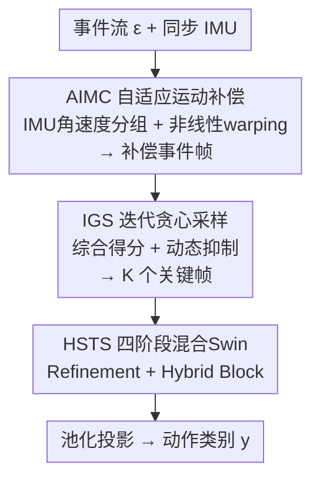

# DarkShake-DVS: Event-based Human Action Recognition under Low-light and Shaking Camera Conditions

**会议**: CVPR 2026  
**论文**: [CVF Open Access](https://openaccess.thecvf.com/content/CVPR2026/html/Chen_DarkShake-DVS_Event-based_Human_Action_Recognition_under_Low-light_and_Shaking_Camera_CVPR_2026_paper.html)  
**代码**: 承诺开源（论文标注 [Code]，待确认仓库地址）  
**领域**: 视频理解  
**关键词**: 事件相机, 动作识别, IMU运动补偿, 关键帧采样, Swin Transformer  

## 一句话总结
针对"低光 + 手持 6-DoF 抖动"这一真实但被长期忽视的动作识别场景，本文先用 IMU 角速度驱动一套自适应运动补偿（AIMC）把抖动造成的事件流畸变矫正掉，再用迭代贪心采样（IGS）挑出最有信息量的关键帧，最后用四阶段混合 Swin Transformer（HSTS）做识别，并配套发布了首个低光 + 强抖动 + 同步 IMU 的事件动作数据集 DarkShake-DVS（18,041 段、62 类），在三个基准上均超过 SOTA。

## 研究背景与动机

**领域现状**：人体动作识别（HAR）的主流方法几乎都建立在"光照充足 + 相机静止"的理想假设上，用 RGB 视频喂给 3D 卷积 / Transformer / Swin 类骨干。

**现有痛点**：真实部署（夜间监控、手持设备、无人机）同时违反这两条假设——低光把信噪比压垮，6-DoF 自由相机运动又引入运动模糊，二者叠加会同时破坏空间外观和时间连续性。RGB 传感器在这种条件下几乎拍不到可用信息（论文 Fig.1(b) 给出 RGB 同位置准确率仅 2.24%）。

**核心矛盾**：事件相机本来很适合这种场景——它有微秒级时间分辨率和高动态范围，低光下依然敏感。但现有事件 HAR 方法在"低光 + 抖动"组合下仍然崩，根因有两条：一是**没有数据集**同时覆盖低光、自我运动、同步 IMU，无法评测；二是现有方法**几乎不做显式运动补偿**，而 IMU 辅助补偿在 HAR 里基本是空白。

**本文目标**：补齐这两块——造一个真正困难的基准，再设计一条"先稳像、后采样、再识别"的鲁棒识别管线。

**切入角度**：DAVIS 事件相机自带 IMU，能给出角速度和线加速度，正好是估计并抵消自我运动的天然线索；而事件流的微秒级时间戳又让逐时刻补偿成为可能。

**核心 idea**：用 IMU 角速度的频域特性自适应地切分时间窗、再用非线性 warping 把旋转畸变映射回去补偿事件坐标，把"脏"的事件流先洗干净，再交给采样 + 识别网络——即 Event–IMU Stabilized HAR（EIS-HAR）。

## 方法详解

### 整体框架
EIS-HAR 是一条三段串行的管线：原始事件流 + 同步 IMU 进来，先经 **AIMC（自适应 IMU 运动补偿）** 把抖动造成的旋转畸变矫正、聚合成清晰的补偿事件帧；补偿后帧序列数量很多且高度冗余，于是用 **IGS（迭代贪心采样）** 按综合得分 + 动态抑制挑出一小撮关键帧；最后这些关键帧送入 **HSTS（混合时空 Swin Transformer）** 的四阶段架构，联合建模长程结构与局部时空线索，池化后投影到动作类别。数据侧另有 **DarkShake-DVS 基准** 支撑训练与评测。

### 关键设计

**1. AIMC：用 IMU 角速度频域特性自适应切窗，把旋转畸变 warping 回去**

痛点直接对准"抖动让事件流位置漂移"。事件流记作 $\varepsilon \in \mathbb{R}^{W\times H\times T}=\{e_1,\dots,e_N\}$，每个事件 $e_i=\{x_i,y_i,t_i,p_i\}$ 含像素坐标、微秒时间戳和极性。IMU 给出相机系角速度 $\omega_c = R_{ci}\,\omega_i$（$R_{ci}$ 是 IMU 到相机的外参旋转）。补偿的核心是对角速度积分得到三轴旋转角 $\phi,\theta,\psi$，再建立映射 $\varphi:\mathbb{R}^3\to\mathbb{R}^3$ 把原坐标转成补偿坐标：$x'_t = [R(x_t-c_o)-T]+c_o$，其中 $c_o$ 是像平面中心，$R$ 是 z 轴旋转构成的 2D 旋转矩阵，$T$ 是 x/y 轴旋转引起的等效平移。关键的非线性项来自入射角几何（以 y 轴旋转为例）：$\alpha=\tan^{-1}(x\cdot w/f)$、$\beta\approx\alpha-\theta$，位移量 $\Delta l = x-\rho\tan\beta$（$\rho=f/w$），于是 $T=(x_t-c_o)-\rho\tan\beta$。这一步解决了"大入射角下相同旋转角对应的位移并不相同"的差分位移问题。

但作者发现一个工程坑：相邻事件帧的微秒间隔让补偿值只有 $10^{-6}$ 量级，而像素坐标是整型存储，取整直接把位移抹成 0——补偿在实现层面"物理失效"。为此他们提出**基于角速度频域特性的自适应分组**：先按角速度符号（极性）分正负区，再在每个单调区内以局部极值为切分点，最后按累积角位移中位数定组；每组的时间边界用首尾 IMU 时间戳并与事件流同步。再叠一个 **IMU 时间感知的动态缩放因子**，把相邻事件间隔 $\Delta t_{event}$ 对齐到 IMU 采样间隔 $\Delta t_{imu}$，缩放因子按

$$\gamma_{group}=\gamma_{min}+\frac{\gamma_{max}-\gamma_{min}}{a\cdot N_{imu}+b}$$

随每组 IMU 采样数 $N_{imu}$ 自适应变化（$a,b$ 为调节系数，$\gamma_{min},\gamma_{max}$ 为缩放界）。这就把固定缩放因子在动态角速度下的失配问题解决了，让补偿粒度随角速度动态变化——也正是它比"靠优化求解"的传统运动补偿快得多的原因（70ms vs 优化法 210–300ms）。

**2. IGS：综合得分 + 动态抑制的迭代贪心选帧，替代均匀采样**

补偿后帧序列总数高度可变、长样本极其冗余，而传统均匀采样会漏掉稀疏但关键的瞬间。IGS 给每个候选帧 $i$ 算一个综合得分：

$$S_{comb}(i)=w_{rel}\hat S_{rel}(i)+w_{q}\hat S_{qual}(i)+w_{u}\hat S_{uni}(i)+w_{d}\hat S_{div}(i)$$

其中 $\hat S_{rel}$（与动作的相关性）、$\hat S_{qual}$（帧质量）代表帧的**内在价值**，$\hat S_{uni}$（时间均匀性）、$\hat S_{div}$（视觉多样性）代表**动态抑制**。算法迭代地建关键帧集：第一轮只看内在价值（$\hat S_{rel},\hat S_{qual}$）选最高分帧；一旦选中就激活动态抑制，对剩余帧重算 $\hat S_{uni},\hat S_{div}$——与已选帧视觉冗余或时间扎堆的帧综合得分被压低，再从被抑制后的分布里选下一个最高分帧。这样既保证选到的帧信息密度高，又强制它们在时间和外观上分散，避免连续相似帧堆在一起。

**3. HSTS：四阶段混合 Swin，全局注意力与局部时空卷积并行**

$K$ 个关键帧 $X\in\mathbb{R}^{C\times K\times H\times W}$ 先被切成不重叠 3D patch 并由 3D 卷积投影：$P_{emb}=E_{patch}(X)$，随后进入四个阶段，每阶段含一个 patch merging、一个宏观 Refinement Block 和两个微观 Hybrid Block。**Refinement Block** 用来抵消 patch merging 带来的语义漂移：并行用轻量 2D / 1D 深度可分离卷积施加空间一致性与时间连续性先验，$P_{sp}=C^S_i(P_{in})$、$P_{tp}=C^T_i(P_{in})$，融合为 $P_r=P_{sp}+P_{tp}$。**Hybrid Block** 是核心，设三条并行路径：$P_A=\mathcal{A}_{Swin}(P_r)$（Swin 注意力建全局相关）、$P_{LS}=L^S_i(P_r)$（局部空间，稳特征）、$P_{LT}=L^T_i(P_r)$（局部时间，抑噪），用可学习标量加权融合 $P_{out}=w_A P_A+w_{LS}P_{LS}+w_{LT}P_{LT}$。最后归一化 + 全局平均池化 + 投影头出 logits：$y=H(P_{avg}(N(P_{out})))$，训练用交叉熵。这套"全局注意力 + 局部卷积"并行混合的设计，是为同时抓住动作的长程结构和事件帧里的局部时空细节——单纯 Swin 注意力对局部噪声不够稳，单纯卷积又缺长程建模。

**4. DarkShake-DVS：首个低光 + 强 6-DoF 抖动 + 同步 IMU 的事件 HAR 基准**

数据是本文与方法并列的核心贡献。用 DAVIS-346（346×260）在弱光真实场景手持采集，采集者故意引入 6-DoF 运动模拟真实抖动，同步记录加速度计 + 陀螺仪 IMU。覆盖室内外（办公室、操场、厨房、卧室），多视角（前后左右 + 四对角 + 上下俯仰），并含手/脚/物体遮挡。共 62 类（30 类单人 + 32 类双人协作，如劈柴、跳舞、做饭、心肺复苏），15 名表演者、18,041 段，按 6:3:1 划分训练/验证/测试。难度分级很巧：用陀螺仪平均角速度作为客观抖动强度判据，把数据分成低/中/高抖动三个子集（30%/40%/30%），消除主观判断、给鲁棒性评测提供连续的运动强度谱。

### 损失函数 / 训练策略
隐层维度 96，Adam 优化器（weight decay 2e-2），学习率初始 5e-4 配 CosineAnnealingLR（最小 1e-5）；2×NVIDIA 4090，250 epoch，batch size 20；分类用交叉熵。

## 实验关键数据

### 主实验
三个基准（HARDVS、DailyDVS-200、DarkShake-DVS）上 EIS-HAR 全面领先。

| 数据集 | 指标 | 本文 (Ours) | 之前最强 | 提升 |
|--------|------|------|----------|------|
| HARDVS | acc top-1 | **53.21** | Swin-T 51.91 / ESTF 51.22 | +1.30 |
| DailyDVS-200 | acc top-1 | **51.99** | Evmamba 49.65 | +2.34 |
| DarkShake-DVS | acc (w/ AIMC) | **91.35** | Swin-T 88.86 | +2.49 |

在 DarkShake-DVS 上，本文模型仅 34.0M 参数却拿到最高分；且把 AIMC 当作即插即用的预处理接到别的骨干上，几乎所有方法都涨点（如 SlowFast 83.91→87.25、Spikformer 80.17→85.77），唯独 Mamba/SSM 系（VMamba、Vision Mamba、VideoMamba）反而很差，作者推测 SSM 对相机抖动特别敏感。

### 消融实验
DarkShake-DVS 上逐模块消融（完整模型 91.35）：

| 配置 | acc | 说明 |
|------|------|------|
| Full (Ours) | **91.35** | AIMC + IGS + Re + Hi 全开 |
| w/o AIMC | 88.61 | 去运动补偿，掉 2.74 |
| w/o IGS | 85.76 | IGS 换均匀采样，掉 5.59（最致命） |
| w/o Re | 89.43 | 去 Refinement Block，掉 1.92 |
| w/o Hi | 87.36 | 去 Hybrid Block 的空间/时间路径，掉 3.99 |

补偿效率对比（单线程 AMD EPYC 7B12）：本文 70ms 完成整段补偿，而优化法光流 [11] 需 210ms、4-DOF [29] 需 300ms（每步 10ms × 30+ 步），且本文像素-事件密度（yaw/pitch/roll 3.74/2.45/2.13）更高。

### 关键发现
- **IGS 贡献最大**：换成均匀采样掉 5.59 个点，远超去掉补偿（2.74）或去掉混合块（3.99）——说明"挑对帧"比"算法骨干"更关键，均匀采样会漏掉稀疏关键瞬间或塞进一堆相似冗余帧。
- **运动补偿是必要预处理**：t-SNE 可视化显示去掉 AIMC 时多类特征纠缠（红框），加上后类间可分性明显提升；但作者诚实指出，抖动幅度过大的少数类即便补偿后仍难区分，存在特征塌缩。
- **SSM 在抖动下反常**：Mamba 系是少数加 AIMC 不涨甚至掉点的模型，提示状态空间模型对相机自我运动的鲁棒性可能存在结构性短板。

## 亮点与洞察
- **把"整型取整导致补偿失效"这个工程坑写进方法**：很多运动补偿论文不会暴露这种实现细节，本文直接点出微秒间隔补偿值 $10^{-6}$ 被整型 round 抹零，并用频域分组 + 动态缩放因子绕过——这是真正落地过才会发现的问题。
- **抖动强度用陀螺仪角速度客观分级**：把数据集难度做成可量化的低/中/高三档，比拍脑袋打标签更可信，也给后续工作提供了标准化的鲁棒性评测轴。
- **AIMC 可即插即用**：它是独立预处理模块，能接到任意现有骨干上普遍涨点，迁移价值高——任何事件 HAR 工作只要有同步 IMU 都能复用。

## 局限与展望
- **依赖同步 IMU 与近似假设**：方法把深度近似为常数（相机无测深、且假设物-相机距离大致一致），在距离剧烈变化的场景下补偿模型可能失准。
- **极端抖动仍难救**：作者自己承认部分高抖动类别补偿后特征仍塌缩、无法区分，说明纯旋转补偿对平移性大畸变能力有限。
- **缩放因子的 $a,b,\gamma_{min},\gamma_{max}$ 等超参细节放在补充材料**，正文未给敏感性分析，复现时需自行调参（⚠️ 具体取值以原文/补充材料为准）。
- 多数对比与消融集中在 DarkShake-DVS 自建集上，跨域泛化（如真实无人机平台）尚未充分验证。

## 相关工作与启发
- **vs IMU 运动补偿 [55]**：本文沿用其旋转补偿框架但修复了浮点精度导致的网格状伪影，并加上频域自适应分组 + 动态缩放，重建更锐利、像素-事件密度更高。
- **vs 优化型补偿（对比度最大化 [11] / 联合运动估计 [29]）**：优化法靠昂贵迭代求解（210–300ms），且局部光流缺全局约束会重叠、4-DOF 模型牺牲局部精度；本文用 IMU 时空相关性做实时补偿（70ms），避开优化。
- **vs 通用视频骨干（Swin-T / TimeSformer / SlowFast）**：它们假设清晰稳定输入，直接喂抖动事件帧效果有限；本文先稳像再识别，且 HSTS 的全局注意力 + 局部卷积并行更贴事件数据的稀疏时空特性。

## 评分
- 新颖性: ⭐⭐⭐⭐ 首个低光+6-DoF+IMU 事件 HAR 基准，加上自适应 IMU 补偿这条少有人走的路线，问题设定新颖
- 实验充分度: ⭐⭐⭐⭐ 三数据集 + 完整模块消融 + 补偿质量/效率对比 + t-SNE 可视化，但部分超参细节藏在补充材料
- 写作质量: ⭐⭐⭐⭐ 动机清晰、公式完整，实现坑点交代诚实，少数符号略密
- 价值: ⭐⭐⭐⭐ 数据集 + 可即插即用的 AIMC 对事件 HAR 社区有实际推动价值

<!-- RELATED:START -->

## 相关论文

- [\[CVPR 2026\] Seeing Motion Through Polarity for Event-based Action Recognition](seeing_motion_through_polarity_for_event-based_action_recognition.md)
- [\[CVPR 2026\] DarkAct: A RGB-Thermal Dataset and Fusion Framework for Multimodal Low-Light Action Recognition](darkact_a_rgb-thermal_dataset_and_fusion_framework_for_multimodal_low-light_acti.md)
- [\[CVPR 2026\] SMV-EAR: Bring Spatiotemporal Multi-View Representation Learning into Efficient Event-Based Action Recognition](smv-ear_bring_spatiotemporal_multi-view_representation_learning_into_efficient_e.md)
- [\[CVPR 2026\] EgoXtreme: A Dataset for Robust Object Pose Estimation in Egocentric Views under Extreme Conditions](egoxtreme_a_dataset_for_robust_object_pose_estimation_in_egocentric_views_under_.md)
- [\[CVPR 2026\] SDTrack: A Baseline for Event-based Tracking via Spiking Neural Networks](sdtrack_a_baseline_for_event-based_tracking_via_spiking_neural_networks.md)

<!-- RELATED:END -->
