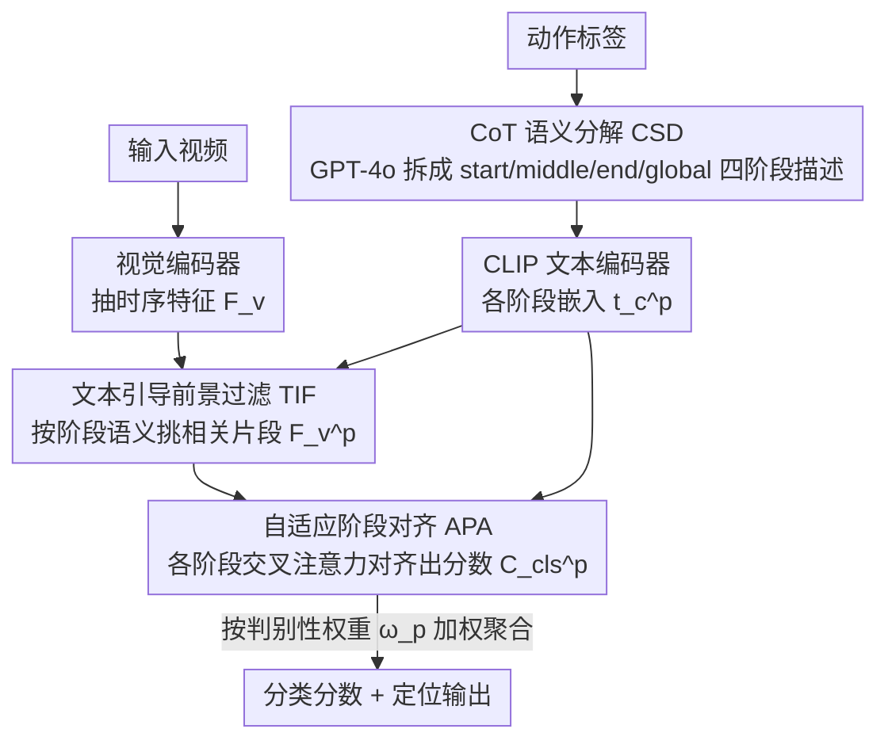

# Decompose and Transfer: CoT-Prompting Enhanced Alignment for Open-Vocabulary Temporal Action Detection

**会议**: CVPR 2026  
**arXiv**: [2603.24030](https://arxiv.org/abs/2603.24030)  
**代码**: 无  
**领域**: Video Understanding  
**关键词**: 开放词汇时序动作检测, 链式思维提示, 动作阶段分解, 跨模态对齐, 知识迁移

## 一句话总结
提出 Phase-wise Decomposition and Alignment (PDA) 框架，利用 LLM 的 CoT 推理能力将动作标签分解为"开始-中间-结束"三个阶段描述，通过文本引导的前景过滤和自适应阶段对齐实现细粒度动作模式迁移，在 THUMOS14 OV-TAD 上 Avg mAP 达 46.9（超越 SOTA Ti-FAD 的 41.2）。

## 研究背景与动机
**领域现状**: 开放词汇时序动作检测 (OV-TAD) 要求对未见过的动作类别进行定位和分类，核心是从已见类别迁移知识。

**现有痛点**: 现有方法仅进行标签级别的全局文本-视觉对齐，难以捕捉不同动作间共享的细粒度时序模式。例如 "LongJump" 和 "PoleVault" 标签相似度低，但起跑和起跳阶段视觉上高度相似。

**核心矛盾**: 标签级语义对齐无法发现跨类别的可迁移视觉模式，导致对未见类别的泛化能力有限。

**本文目标**: 如何提取和迁移不同动作之间共享的阶段级视觉先验，实现更好的开放词汇泛化。

**切入角度**: 模拟人类认知——理解一个动作是逐步展开的（启动→执行→完成），利用 LLM 的 CoT 能力自动将动作分解为多个阶段。

**核心 idea**: 将动作标签分解为阶段描述 → 每个阶段独立做文本-视觉对齐 → 自适应聚合各阶段的对齐结果。

## 方法详解

### 整体框架
PDA 想解决的是：开放词汇时序动作检测要把知识从已见类别迁到未见类别，但只对齐整条标签（"LongJump" 对 "PoleVault"）相似度低，迁不动。它的思路是把"动作是逐步展开的"这件事显式建模出来——一段视频进来先经视觉编码器抽特征，动作标签则交给 GPT-4o 用 CoT 推理拆成 {start, middle, end, global} 四个阶段描述；接着每个阶段各自做一次"文本找前景片段 → 跨模态对齐 → 出分类分数"，最后用一个自适应权重把四个阶段的结果加权汇总。整条链路是 CSD（拆阶段）→ TIF（按阶段挑片段）→ APA（按阶段对齐再聚合）。

### 关键设计

**1. CoT 语义分解 CSD：把整条标签拆成"开始-中间-结束"，让跨类别共享的阶段模式浮出来**

标签级对齐的死结在于，"LongJump" 和 "PoleVault" 作为整体语义离得远，但它们的起跑加速、蹬地起跳两段在视觉上几乎一样——这些可迁移的先验全被压在一个标签里看不见。CSD 让 GPT-4o 用 CoT 把每个动作沿自然时间顺序拆成四段描述，例如 "LongJump" 拆成 start="跑道加速"、mid="蹬地起跳"、end="落地沙坑"，再用 CLIP 文本编码器把每段描述编成阶段嵌入 $t_c^p = \Phi_{txt}(s_c^p)$。拆开之后，原本被标签掩盖的共享阶段就显式成了独立的对齐单元，未见类别只要某个阶段和已见类别撞上，就能直接借到那段的判别先验。

**2. 文本引导前景过滤 TIF：按阶段语义挑出相关片段，替代固定的均匀时序切分**

把视频按时间均匀切三段听起来直接，但现实里一段视频可能含多个动作、每个动作时长还不一样，硬切会把阶段切错位。TIF 改成让文本来挑片段：对每个阶段 $p$，用该阶段的文本嵌入和视频各时刻特征算相似度，沿类别维取 max 再 Softmax 得到阶段级前景置信度 $S_{fg}^p$，用全时刻平均相似度作阈值二值化后，过滤出真正属于这个阶段的片段 $F_v^p = \hat{S}_{fg}^p \cdot F_v$。这样每个阶段拿到的是语义上对得上的那段视频，而不是机械切出来的固定窗口，对多动作、变时长场景更稳。

**3. 自适应阶段对齐 APA：每段单独对齐后按判别性加权聚合，而非一刀切平均**

不同动作里各阶段的信息量并不均等——有的看开头就能认（起跳姿态很特殊），有的得看到落地才能定。APA 先让每个阶段独立做交叉注意力融合 $\bar{F}_v^p = \text{CrossAttn}(F_v^p, F_t^p)$ 得到阶段分类分数 $C_{cls}^p = \bar{F}_v^p \cdot F_t^{p\top}$，再用一个 Sigmoid 网络从阶段视觉特征预测权重 $\omega_p = \text{Sigmoid}(W_p(F_v^p))$，最终分类按权重汇总：

$$C_{cls} = \sum_{p} \omega_p \cdot C_{cls}^p$$

权重由数据学出来，等于让模型自己决定每个动作该重点听哪一段，比对四个阶段简单取平均更灵活，也解释了消融里加上 APA 后那一档的提升。

### 一个完整示例：LongJump → PoleVault 的跨类别迁移
设 PoleVault 是测试时才出现的未见类别。CSD 先用 GPT-4o 把它拆成 start="跑道持杆加速"、mid="插杆蹬地起跳"、end="越过横杆落地"。轮到 start 阶段时，TIF 用"跑道加速"这段文本在整条视频上算相似度，把前段助跑片段筛成前景 $F_v^{start}$，丢掉后面越杆的无关帧；mid 阶段同理筛出起跳片段。由于训练时已见类别 LongJump 的 start/mid 也是"跑道加速""蹬地起跳"，PoleVault 的这两段在对齐空间里直接撞上了已学好的共享先验，于是即便整条 "PoleVault" 标签没见过，前两个阶段也能给出高分。APA 再看到这段视频里 start、mid 判别性强、end 较弱，相应调高前两段权重，加权后正确把这条样本判成 PoleVault——这就是标签级全局对齐做不到、而阶段分解能做到的迁移。

### 损失函数 / 训练策略
- 总损失 $\mathcal{L} = \mathcal{L}_{cls} + \mathcal{L}_{fg} + \mathcal{L}_{loc}$：分类（交叉熵）+ 前景感知 + DIoU 定位损失
- 推理时对测试类别同样用 LLM 做阶段分解，最后用 SoftNMS 去冗余

## 实验关键数据

### 主实验（THUMOS14, 50% Seen / 50% Unseen）

| 方法 | 0.3 | 0.5 | 0.7 | Avg mAP |
|------|-----|-----|-----|---------|
| Ti-FAD (NeurIPS'24) | 57.0 | 43.3 | 21.2 | 41.2 |
| STOV (WACV'25) | 56.3 | 34.4 | 11.3 | 34.0 |
| **PDA (Ours)** | **65.4** | **49.7** | **24.3** | **46.9** |

**ActivityNet v1.3**

| 方法 | 0.5 | 0.75 | Avg mAP |
|------|-----|------|---------|
| Ti-FAD | 50.6 | 32.2 | 32.0 |
| **PDA (Ours)** | **53.1** | **35.3** | **34.6** |

### 消融实验

| 配置 | Avg mAP | 说明 |
|------|---------|------|
| 全局对齐 baseline | ~41.2 | 仅标签级别对齐 |
| + CSD | 提升 | 阶段分解暴露可迁移模式 |
| + CSD + TIF | 进一步提升 | 自适应前景过滤替代静态时序分割 |
| + CSD + TIF + APA | **46.9** | 自适应权重优于平均聚合 |

### 关键发现
- 在 THUMOS14 50/50 划分下，与最强 baseline Ti-FAD 相比，Avg mAP 提升 5.7 个点。
- 在 LongJump→PoleVault 的跨类别迁移案例中，阶段分解后模型能识别出共享的"起跑加速"和"蹬地起跳"模式，显著提升未见类别的检测性能。
- 自适应聚合相比简单均值显示出更大的灵活性。

## 亮点与洞察
- 将 CoT 推理从 NLP 扩展到动作理解：不仅是文本增强，而是结构化的时序分解，直接关联动作的认知过程
- 阶段分解天然暴露了跨类别的可迁移知识，这是标签级方法无法做到的
- TIF 的文本引导式前景过滤优于静态时序分割，能处理多动作和变时长场景
- 在 LongJump→PoleVault 的迁移案例中，阶段分解后模型能识别共享的"起跑加速"和"蹬地起跳"模式
- 75/25 划分验证了方法在不同 seen/unseen 比例下的鲁棒性
- THUMOS14 上 IoU@0.5 的 mAP 从 43.3 提升到 49.7（+6.4%），说明细粒度对齐也提升了定位精度

## 局限与展望
- 依赖 GPT-4o 做阶段分解，成本较高且分解质量受限于 LLM 的动作知识。
- 固定三阶段分解（start/mid/end）可能对某些动作不够灵活（如周期性动作）。
- 未探索阶段数量的自适应确定。
- CLIP 文本编码器对阶段描述的编码质量可能成为瓶颈。- 未在更大规模视频数据集（如 Kinetics）上验证
- CoT 分解的质量在不同 LLM 间可能有较大差异

## 相关工作与启发
- 与 DeTAL、Ti-FAD 的区别：它们使用全局对齐或简单文本增强，本文通过结构化阶段分解实现细粒度知识迁移。
- CoT 提示在视觉任务中的应用是新兴方向，本文展示了其在时序理解中的潜力。
- 自适应阶段权重的设计可以推广到其他需要多粒度对齐的任务。
- 75/25 划分下 Avg mAP 从 Ti-FAD 的 42.9 提升到 47.3，泛化到不同比例

## 技术细节补充
- **GPT-4o Prompt**: "Decompose the action of ⟨Action⟩ into coherent three phases based on the natural temporal progression"
- **阶段文本模板**: 'a video of people's motion that [Description]'
- **交叉注意力融合**: $\bar{F}_v^p = \text{Softmax}(\frac{Q(F_v^p)K(F_t^p)^\top}{\sqrt{D}})V(F_t^p)$
- **自适应权重**: $\omega_p = \text{Sigmoid}(W_p(F_v^p))$，允许不同阶段在不同动作上有不同重要性
- **定位分支**: 拼接所有阶段视觉特征 → MLP 投影 → 前景感知头 + 回归头
- **推理**: 测试类别同样用 LLM 分解为阶段，SoftNMS 去冗余
- **75/25 划分结果**: THUMOS14 Avg mAP 47.3 (vs Ti-FAD 42.9)，ActivityNet Avg mAP 36.6 (vs DeTAL 25.5)
- **训练目标**: $\mathcal{L} = \mathcal{L}_{cls} + \mathcal{L}_{fg} + \mathcal{L}_{loc}$，分类+前景感知+DIoU 定位
- **阶段集合**: $\mathcal{P} = \{start, middle, end, glob\}$，共 4 个阶段
- **前景二值化阈值**: 取所有时间位置的平均相似度作为二值化阈值
- **适用视觉编码器**: 兼容 CLIP ViT-B/16 等标准视觉编码器

## 评分
- 新颖性: ⭐⭐⭐⭐ CoT + 阶段分解的思路新颖，从认知角度出发合理
- 实验充分度: ⭐⭐⭐⭐ THUMOS14 + ActivityNet 两个 benchmark，多种划分设置
- 写作质量: ⭐⭐⭐⭐ 动机图示直观，但公式较多
- 价值: ⭐⭐⭐⭐ 在 OV-TAD 上取得显著提升，但该任务的应用范围相对有限

<!-- RELATED:START -->

## 相关论文

- [\[CVPR 2026\] HERO: Hierarchical Embedding-Refinement for Open-Vocabulary Temporal Sentence Grounding in Videos](hero_hierarchical_embedding-refinement_for_open-vocabulary_temporal_sentence_gro.md)
- [\[CVPR 2026\] TF-CADE: Foreground-Concentrated Text-Video Alignment for Zero-Shot Temporal Action Detection](tf-cade_foreground-concentrated_text-video_alignment_for_zero-shot_temporal_acti.md)
- [\[CVPR 2026\] Alert-CLIP: Abnormality-aware Latent-Enhanced Representation Tuning of CLIP for Video Anomaly Detection](alert-clip_abnormality-aware_latent-enhanced_representation_tuning_of_clip_for_v.md)
- [\[CVPR 2026\] DETACH: Decomposed Spatio-Temporal Alignment for Exocentric Video and Ambient Sensors with Staged Learning](detach_decomposed_spatio-temporal_alignment_for_exocentric_video_and_ambient_sen.md)
- [\[CVPR 2026\] Prototypical Action Reasoning Facilitated by Vision-Language Alignment for Egocentric Action Anticipation](prototypical_action_reasoning_facilitated_by_vision-language_alignment_for_egoce.md)

<!-- RELATED:END -->
