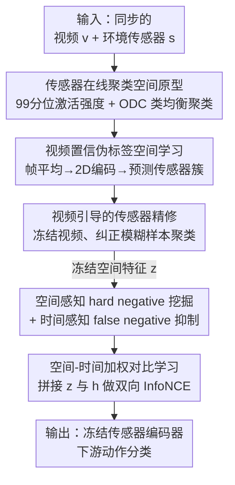

# DETACH: Decomposed Spatio-Temporal Alignment for Exocentric Video and Ambient Sensors with Staged Learning

**会议**: CVPR 2026  
**论文**: [CVF Open Access](https://openaccess.thecvf.com/content/CVPR2026/html/Yoon_DETACH__Decomposed_Spatio-Temporal_Alignment_for_Exocentric_Video_and_Ambient_CVPR_2026_paper.html)  
**代码**: https://github.com/JaemoJeong/DETACH  
**领域**: 视频理解  
**关键词**: 跨模态对齐, 人体动作识别, 环境传感器, 时空解耦, 对比学习  

## 一句话总结
针对"固定摄像头视频 + 环境传感器"这一全新的非侵入式动作识别场景，DETACH 把视频和传感器都拆成"空间分量 + 时间分量"，先用在线聚类建立跨模态的空间对应，再用空间引导的加权对比损失做细粒度时间对齐，在 Opportunity++ / HWU-USP 上比改编自第一人称基线的方法 F1 提升最高 30%、mAP 提升最高 50%。

## 研究背景与动机

**领域现状**：多模态人体动作识别（HAR）近年主流是把**第一人称视频（egocentric）和可穿戴传感器（IMU）**对齐——两者天然同步、空间时间高度相关，用对比/蒸馏把整段视频和整段传感器各压成一个向量对齐（即 **Global Alignment**，全局对齐），效果不错（IMU2CLIP、PRIMUS、EVI-MAE、COMODO 等）。

**现有痛点**：第一人称 + 可穿戴的方案落地有硬伤——要用户一直戴设备（不舒服）、暴露隐私、多用户难扩展。一个更实用的替代是**第三人称视频（exocentric，固定安装的摄像头）+ 环境传感器（ambient，贴在物体/墙上的接触开关、物体 IMU）**，非侵入、可扩展。但这个组合此前**没人做过**，而且直接照搬 Global Alignment 会失败。

**核心矛盾**：作者指出 Global Alignment 在新场景下有两个结构性失败（不同视觉条件下各占一个）：
- **P1 抓不住局部细节**：当动作视觉变化很小、背景又是静态时，把整段视频压成一个向量会让静态背景压垮时间动态，导致"开抽屉""关洗碗机""开冰箱"这类语义不同的动作在特征空间里相似度都很高、彼此难分。
- **P2 过度依赖模态不变的时间特征**：第三人称视频带的是视觉时空上下文，而环境传感器是**把空间语义隐式编码在"哪个位置的通道被激活"里**的时间序列。两种模态唯一共享的就是时间动态，于是时间特征主导对齐，扭曲了负样本关系——例如锚点"开橱柜1"，模型会错误地把空间不同的"开橱柜2"（easy negative，本该好区分）拉得比空间相同、只是动作相反的"关橱柜1"（hard negative，本该语义接近）更近。

**本文目标**：在缺乏共享空间信号的第三人称-环境场景下，既保住视频里微弱的时间线索（解 P1），又重建跨模态的空间对应、纠正被时间相似度扭曲的负样本结构（解 P2）。

**核心 idea**：**把"空间"和"时间"解耦后分两阶段对齐**——先在各自模态内部把"空间"结构立起来（视频靠帧平均的空间特征、传感器靠在线聚类把隐式通道激活变成显式的空间原型），建立跨模态空间 grounding；再冻结空间特征、用**空间引导的加权对比损失**专攻细粒度时间区分，加权 hard negative、压低 false negative。

## 方法详解

### 整体框架

DETACH 处理的是一个 mini-batch 内 $N$ 个同步的视频-传感器对 $B=\{(v_i,s_i)\}_{i=1}^N$。每个模态都配两套编码器：空间编码器 $f_{\{v,s\}}$ 产出空间嵌入 $z_{v,i}=f_v(v_i),\ z_{s,i}=f_s(s_i)\in\mathbb{R}^{d_S}$，时间编码器 $g_{\{v,s\}}$ 产出时间嵌入 $h_{v,i}=g_v(v_i),\ h_{s,i}=g_s(s_i)\in\mathbb{R}^{d_T}$。整体是**两阶段串行**：

- **Stage 1（跨模态空间表示学习）**：让视频和传感器在各自隐空间里"按空间来源组织表示"。传感器侧靠在线聚类发现位置激活模式，视频侧学着预测传感器簇的伪标签，再反过来用视频去精修传感器里模糊的样本——建立稳固的空间 grounding。
- **Stage 2（跨模态时间对齐）**：**冻结** Stage 1 学到的空间特征，用它来挑负样本、给负样本加权，再做空间引导的加权对比学习，把注意力逼到时间动态的细粒度区分上。

### 关键设计

**1. 传感器在线聚类空间原型：把隐式的"哪儿被激活"变成显式空间表示**

这是解 P2 的第一步。环境传感器本身没有"空间坐标"，但**每个激活都反映某个位置的活动**——同一扇门上的 IMU 和逻辑开关共享一个位置。作者用在线聚类（ODC，参考 [52]）把这种位置语义显式化：簇数直接设成"装了传感器的位置数"，建立"簇 ↔ 空间源"的一一对应。具体先用 1D CNN + GRU 的 base encoder 编码激活模式；为了增强空间区分度，再取**每个通道信号的 99 分位数**作为"通道激活强度向量"（用分位数而非最大值是为了抗离群点），投影后与编码输出逐元素相加融合。聚类目标是类均衡交叉熵：

$$\mathcal{L}_{\text{cluster}} = -\frac{1}{N}\sum_{i=1}^{N} w_{\hat{y}_i}\,\log p(\hat{y}_i\mid z_{s,i})$$

其中 $\hat{y}_i$ 是伪标签，$w_{\hat{y}_i}=1/|C_{\hat{y}_i}|^{0.5}$ 是按簇内样本数的逆频率权重，用来缓解簇不平衡。这一步把"开/关同一物体"映射到同一空间簇，给后面跨模态空间对应打底。

**2. 置信伪标签 + 视频引导精修：让视频学会传感器的空间结构，再回头修传感器**

光有传感器聚类还不够，要让**视频**也按同样的空间结构组织起来，才能跨模态对齐空间。但环境传感器会误触发、无监督聚类也会给出噪声分配，直接全量训练不靠谱。作者用两道闸：① 视频侧——把视频帧时间平均后过 2D 卷积编码器，接线性分类器去预测传感器伪标签；同时**按样本到簇心的欧氏距离评估质量**，每个簇内距离前 75 分位的标为 confident、其余为 ambiguous（per-cluster 阈值能适应不同簇的密度）。联合学习时传感器聚类在全部样本上继续，而视频空间编码器**只在 confident 样本上训**：

$$\mathcal{L}_{\text{videospatial}} = -\frac{1}{\sum_i m_i}\sum_{i=1}^{N} m_i\,\log p(\hat{y}_i\mid z_{v,i})$$

$m_i$ 是 confident 指示位。② 视频引导精修——联合学习后视频空间编码器已较可靠，于是**冻结它**，用它的硬预测 $\tilde{y}_i=\arg\max_c p(c\mid z_{v,i})$ 去纠正 ambiguous 传感器样本的聚类，$(1-m_i)$ 作门控只在传感器聚类不可靠时生效：

$$\mathcal{L}_{\text{refine}} = -\frac{1}{\sum_i (1-m_i)}\sum_{i=1}^{N}(1-m_i)\,\log p(\tilde{y}_i\mid z_{s,i})$$

传感器总损失 $\mathcal{L}_{\text{sensor}}=\alpha\mathcal{L}_{\text{cluster}}+\beta\mathcal{L}_{\text{refine}}$。这种"传感器→视频→再回修传感器"的双向监督，让两个模态的空间表示彼此校准、收敛到一致的空间组织。

**3. 空间-时间自适应权重：先挑 hard negative、再剔 false negative**

进入 Stage 2，空间结构已立好且被冻结。easy negative（空间就不同）经 Stage 1 已可分，所以这里只盯**空间相同、但时间动态不同的 hard negative**（如开抽屉 vs 关抽屉），逼时间编码器在"空间没区分价值时"精确分辨动作。由于视频和传感器空间表示在各自隐空间，作者**分别算模态内相似度**再取强者（ReLU 去掉负相似）：

$$\mathcal{S}_{ij}^{\text{spatial}} = \text{ReLU}\!\left(\max\big(\text{sim}(z_{v,i},z_{v,j}),\ \text{sim}(z_{s,i},z_{s,j})\big)\right)$$

据此给负对加权，从 easy（$\mathcal{S}^{\text{spatial}}\approx 0$，权重 1.0）插值到 hard（$\approx 1$，权重 $\lambda_{\text{hard}}$）：$W_{ij}^{\text{spatial}}=1.0+(\lambda_{\text{hard}}-1.0)\cdot\mathcal{S}_{ij}^{\text{spatial}}$。但只看空间会误伤 **false negative**——空间和时间都相似的对其实多半是同一动作、不该被强推开。于是再用时间相似度降权：时间特征由模态专用编码器抽（视频用帧差上的 3D 卷积，传感器用 1D CNN-GRU-attention），且为稳定起见用 **momentum 编码器（EMA, m=0.999）**；时间特征投到共享空间后直接算跨模态相似度 $\mathcal{S}_{ij}^{\text{temporal}}=\text{ReLU}(\text{sim}(h'_{v,i},h'_{s,j}))$，权重为

$$W_{ij}^{\text{temporal}} = 1.0 - (\mathcal{S}_{ij}^{\text{spatial}}\cdot\mathcal{S}_{ij}^{\text{temporal}})$$

最终自适应权重 $W_{ij}=W_{ij}^{\text{spatial}}\cdot W_{ij}^{\text{temporal}}$（$W_{ii}=0$）：空间又像、时间又像的对被压低（防 false negative），空间像、时间不像的 hard negative 被抬高。

**4. 空间-时间加权对比学习：把时间特征"条件"在空间上下文上**

为消除"不同动作共享相似时间动态"的歧义，作者把冻结的空间嵌入和时间嵌入**拼接**成统一表示 $u_{x,i}=[z_{x,i},h_{x,i}]\in\mathbb{R}^{d_S+d_T},\ x\in\{v,s\}$，让时间特征始终带着空间上下文。再把上面的自适应权重 $W_{ij}$ 注入双向 InfoNCE，视频→传感器方向为：

$$\mathcal{S}_{ij}=\text{sim}(u_{v,i},u_{s,j})/\tau_{\text{contrast}},\quad \mathcal{L}_{\text{v2s}}=-\frac{1}{N}\sum_{i=1}^{N}\log\frac{\exp(\mathcal{S}_{ii})}{\exp(\mathcal{S}_{ii})+\sum_{j\neq i}W_{ij}\cdot\exp(\mathcal{S}_{ij})}$$

传感器→视频方向 $\mathcal{L}_{\text{s2v}}$ 对称定义，最终 $\mathcal{L}_{\text{CL}}=\frac{1}{2}(\mathcal{L}_{\text{v2s}}+\mathcal{L}_{\text{s2v}})$。与把所有负样本一视同仁的标准 InfoNCE 不同，这里权重直接进了分母的负样本项，使梯度按"hard / false"区别对待。

### 损失函数 / 训练策略
两阶段分开训：Stage 1 含 10 个 epoch 的联合学习（数据集相关的总 epoch 数）；Stage 2 固定 50 epoch。优化器 AdamW（weight decay $1\times10^{-4}$，初始 lr $1\times10^{-4}$），batch size 256。两数据集都设 $K=7$ 个簇（HWU-USP 为 6 个物体交互 + 1 个非交互态）。传感器损失平衡权重 $\alpha=1.0,\ \beta=1.5$；对比学习 $\tau_{\text{contrast}}=0.10,\ \lambda_{\text{hard}}=3.0$。

## 实验关键数据

### 主实验
两个室内固定背景数据集：**Opportunity++**（物体上贴 IMU + 逻辑开关，视频 10fps / 传感器 30Hz，选 14 个中层标签 = 7 物体的开/关）和 **HWU-USP**（逻辑开关 + 运动传感器，视频 25fps / 传感器 50Hz，5 个高层标签）。滑窗 2 秒、重叠 1 秒。评估时**冻结传感器编码器**、接线性分类器，报告加权 F1 与 mAP。基线为改编到第三人称-环境场景的 IMU2CLIP / PRIMUS / COMODO / EVI-MAE（去掉文本分支、解冻视频编码器端到端微调）。

| 数据集 | 指标 | DETACH | 次优(EVI-MAE) | 提升 |
|--------|------|--------|---------------|------|
| Opportunity++ | F1 (加权) | **0.73** | 0.56 | +0.17（≈+30.4%） |
| Opportunity++ | mAP | **0.87** | 0.58 | +0.29（≈+50.0%） |
| HWU-USP | F1 (加权) | **0.73** | 0.60 | +0.13（≈+21.7%） |
| HWU-USP | mAP | **0.67** | 0.55（COMODO 为 0.64） | +0.12 vs EVI-MAE |

EVI-MAE 虽有多模态掩码建模加持，但仍依赖 Global Alignment，成了瓶颈；DETACH 靠时空解耦对齐全面超出。其余基线（IMU2CLIP/PRIMUS/COMODO）在 Opportunity++ 上 F1 仅 0.28–0.43，差距更大。

### 消融实验

**自适应权重两分量**（表 2）：

| 配置 | Opp++ F1 | Opp++ mAP | HWU F1 | HWU mAP |
|------|----------|-----------|--------|---------|
| Full ($\mathcal{L}_{\text{CL}}$) | **0.73** | **0.87** | **0.73** | **0.67** |
| w/o $W^{\text{spatial}}$ (去 hard negative 挖掘) | 0.56 | 0.71 | 0.65 | 0.61 |
| w/o $W^{\text{temporal}}$ (去 false negative 抑制) | 0.62 | 0.71 | 0.60 | 0.61 |

**损失组件**（表 3，对照普通 InfoNCE）：

| Refinement | Contrastive | Opp++ F1 | Opp++ mAP | HWU F1 | HWU mAP |
|------------|-------------|----------|-----------|--------|---------|
| × | InfoNCE | 0.59 | 0.70 | 0.68 | 0.62 |
| × | $\mathcal{L}_{\text{CL}}$ | 0.60 | 0.70 | 0.69 | 0.65 |
| ✓ | InfoNCE | 0.59 | 0.73 | 0.49 | 0.62 |
| ✓ | $\mathcal{L}_{\text{CL}}$ (Ours) | **0.73** | **0.87** | **0.73** | **0.67** |

### 关键发现
- **两个权重分量互补缺一不可**：去掉 $W^{\text{spatial}}$ 在 Opportunity++ 上掉得最狠（F1 0.73→0.56），说明 hard negative 挖掘是空间歧义场景的主力；去掉 $W^{\text{temporal}}$ 则两个数据集一致下滑，证明 false negative 抑制在防误推上同样关键。
- **refine 与 $\mathcal{L}_{\text{CL}}$ 要配合用**：有意思的是 refine + 普通 InfoNCE 反而把 HWU F1 拖到 0.49（比都不加更差），说明视频引导精修必须和空间-时间加权对比配套，单独叠加会失稳；只有两者同开才到 0.73。
- **负样本能在特征空间里沿时间轴分开**：训练推进中 hard / false negative 的权重 CDF 从重叠逐渐分离（false negative 移向更低权重区），easy negative 始终保持单位权重；对 "Open Dishwasher" 的可视化也显示 hard/false 同处高空间相似区，但沿时间相似度轴清晰分开。
- **可分性与动作幅度相关**：分离效果好的类多是大幅度清晰动作，分离差的是细微/近乎静止的动作——这类难分的动作共存时模型仍难严格区分 false 与 hard negative。

## 亮点与洞察
- **"环境传感器通道激活 = 隐式空间编码"这个洞察很关键**：作者没把传感器当成纯时间序列，而是看出"哪个位置被激活"本身携带空间信息，再用聚类把它显式成原型——这把一个看似无空间信息的模态硬生生提供了跨模态空间 grounding，是整套方法成立的地基。
- **把负样本细分成 easy / hard / false 三类并各自处理**，比"所有负样本一视同仁"的 InfoNCE 精细得多；尤其 false negative 抑制用"空间相似 × 时间相似"联合判定，避免把同一动作误当负样本强推开，思路可迁移到任何对比学习里负样本噪声大的场景。
- **用 99 分位激活强度替代最大值**抗离群、**per-cluster 的 75 分位距离阈值**适应簇密度差异——这些小设计透着对传感器噪声的实际经验，是可复用的 trick。
- **"先空间后时间、冻结再对齐"的分阶段**避免了空间和时间互相干扰：先把空间结构稳住再冻结，时间对齐才有可靠的空间锚点，这种 staged learning 对"两类信号易互相压垮"的多模态问题有借鉴价值。

## 局限与展望
- 作者承认两点：① 只处理**捕捉显式运动动态**的传感器，音频、光照等其他环境传感器的融合留作未来；② 因缺多用户交互数据集，框架**只针对单用户场景**，可扩展性受限。
- 自己观察：评估只在两个**室内固定背景、物体交互**的数据集上，动作类型偏"开/关物体"，对开放场景、人-人交互、室外等是否成立未知。⚠️ 簇数 $K=7$ 直接绑定"传感器位置数"，依赖已知的传感器布置先验，换到传感器位置未知/动态的部署可能要重新设定。
- HWU-USP 只有高层标签、要时间池化后分类，细粒度时间对齐的收益在该数据集上不如 Opportunity++ 明显（mAP 仅 0.67），细粒度时间标注缺失时方法优势会打折。
- 改进方向：把空间原型数从硬编码改成可自适应估计；引入更多异质环境传感器；探索多用户场景下的空间-身份联合解耦。

## 相关工作与启发
- **vs Global Alignment（IMU2CLIP / EVI-MAE / COMODO）**：他们把整段视频和传感器各压成一个向量做全局对齐，在第一人称-可穿戴下因模态天然同步而有效；本文指出在第三人称-环境下这会让静态背景压垮时间线索（P1）、并被模态不变的时间特征主导而扭曲负样本（P2）。DETACH 用空间-时间解耦 + 分阶段对齐绕开瓶颈，相似度分布分析显示它把负样本视频对的相似度从 EVI-MAE 的 0.7 尖峰拉低展宽到 0.2–0.5。
- **vs 细粒度解耦对齐（DiCoSA / ProST）**：DiCoSA 把视频-文本拆成多个潜在语义因子做集合对齐，ProST 用物体-短语/事件-句子的层次原型逐步对齐空间与时间；本文把这种"语义解耦"范式从视频-文本扩展到**第三人称视频-环境传感器**这一全新且更不对称的模态对，并额外解决了传感器"空间信息隐式"的问题。

## 评分
- 新颖性: ⭐⭐⭐⭐⭐ 首次提出并系统分析第三人称-环境对齐问题，"传感器通道激活当空间原型 + 空间引导时间对比"的组合很新。
- 实验充分度: ⭐⭐⭐⭐ 两数据集 + 充分消融 + 多角度可视化分析到位，但数据集仅 2 个、均为室内固定背景物体交互，泛化性证据有限。
- 写作质量: ⭐⭐⭐⭐⭐ 问题定义（P1/P2）和图示清晰，方法层层递进、动机具体，公式与设计对应明确。
- 价值: ⭐⭐⭐⭐ 为非侵入式、可扩展的环境 HAR 开了新方向，方法对"负样本细分"和"隐式模态显式化"有可迁移价值。

<!-- RELATED:START -->

## 相关论文

- [\[CVPR 2026\] CVA: Context-aware Video-text Alignment for Video Temporal Grounding](cva_context-aware_video-text_alignment_for_video_temporal_grounding.md)
- [\[CVPR 2026\] VISTA: Video Interaction Spatio-Temporal Analysis Benchmark](vista_video_interaction_spatio-temporal_analysis_benchmark.md)
- [\[CVPR 2026\] Streaming Video Crime Anticipation with Spatio-Temporal Causal Reasoning](streaming_video_crime_anticipation_with_spatio-temporal_causal_reasoning.md)
- [\[CVPR 2026\] Cluster-Wise Spatio-Temporal Masking for Efficient Video-Language Pretraining](cluster-wise_spatio-temporal_masking_for_efficient_video-language_pretraining.md)
- [\[CVPR 2026\] Decompose and Transfer: CoT-Prompting Enhanced Alignment for Open-Vocabulary Temporal Action Detection](decompose_and_transfer_cot-prompting_enhanced_alignment_for_open-vocabulary_temp.md)

<!-- RELATED:END -->
