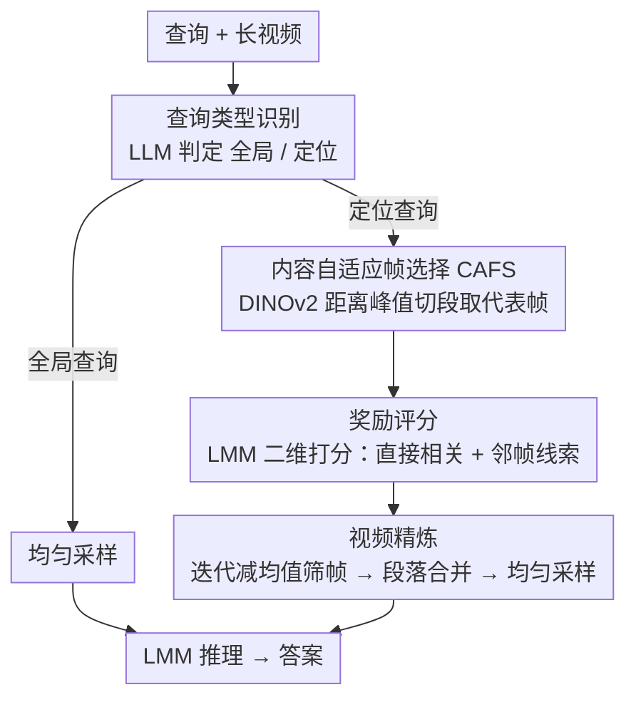

# DIvide, then Ground: Adapting Frame Selection to Query Types for Long-Form Video Understanding

**会议**: CVPR 2026  
**arXiv**: [2512.04000](https://arxiv.org/abs/2512.04000)  
**代码**: [GitHub](https://github.com/Jialuo-Li/DIG)  
**领域**: Video Understanding  
**关键词**: 长视频理解, 帧选择, 查询分类, 内容自适应采样, 大多模态模型

## 一句话总结

提出 DIG，一个免训练的帧选择框架，通过将查询分为全局查询和定位查询两类，对全局查询使用均匀采样、对定位查询使用一套专门的内容自适应帧选择+LMM奖励评分+视频精炼流水线，在三个长视频理解基准上持续超越现有方法。

## 研究背景与动机

大多模态模型（LMM）在视频理解中面临一个核心矛盾：视频token量巨大但LLM上下文长度有限，只能输入采样后的帧子集。均匀采样虽然最大化时间覆盖，但完全与查询无关。

现有工作提出了查询感知的自适应帧选择机制（如AKS、Q-Frame），但计算开销大。作者提出了一个**被频繁忽视的关键问题**：

> 复杂的搜索机制是否对所有查询类型都必要？答案是**否**。

作者的核心发现驱动了整个方法设计：

**全局查询**（如"这段视频的主题是什么？"）：需要全面的视频信息，均匀采样已经足够好且高效

**定位查询**（如"那个人骑的是什么车？"）：针对特定时间段，均匀采样会注入大量无关帧导致性能下降

**更多帧≠更好性能**：实验发现所有LMM的准确率在某个最优帧数后反而下降，且下降主要由定位查询贡献

## 方法详解

### 整体框架

DIG 想解决的问题是：在 LMM 上下文有限、只能塞进几十帧的前提下，怎么把这几个名额花在刀刃上。它的做法不是给所有问题套同一套复杂搜索，而是先看问题"想问什么"再决定怎么采帧。整篇流程从一个查询分流开始，分成两条互不相同的路径：如果是问全局的题（"这段视频讲了什么"），就直接走均匀采样喂给 LMM，不做任何额外搜索；如果是问局部的题（"那个人骑的是什么车"），才进入一条专门的定位流水线——先用 CAFS 把视频按内容切成代表帧，再用 LMM 给每个代表帧打相关性分，迭代筛掉低分帧，最后把幸存帧所在的视频段合并、均匀采样后送进 LMM 推理。一句话：**先分类，再决定要不要费力气找帧。**

### 关键设计

**1. 查询类型识别：用问题类型决定该不该启动搜索**

DIG 的全部价值都建立在这个分流上。作者发现一个被普遍忽视的事实：复杂帧选择对全局查询几乎没收益、甚至是负的——因为全局查询本来就要全片信息，均匀采样的时间覆盖已经最优，再做内容筛选反而会漏掉某些时间段。于是 DIG 用一个现成 LLM（Qwen3-Next-80B-A3B）把查询自动判成"全局"或"定位"两类：全局直接走均匀采样省掉所有开销，只有定位查询才值得启动后面那条昂贵的流水线。这一步把"该不该花算力"的决策提前到了最前面，避免了对每个问题都无差别地跑搜索。

**2. 内容自适应帧选择（CAFS）：让采样密度跟着画面变化走**

固定帧率采样有个两难：帧率低会漏掉关键瞬间，帧率高又堆出一堆几乎重复的冗余帧。CAFS 的思路是不按时间均匀切，而按"内容变化"切。它先以 2fps 采出 $M$ 帧，用 DINOv2 提特征，再算相邻帧的余弦距离序列

$$d_i = 1 - \text{sim}(V_{I_i}, V_{I_{i+1}})$$

距离大的地方意味着画面发生了明显变化，对应一次场景切换。CAFS 在这条距离序列上检测显著峰值（prominence > 0.1）当作分割点，把视频切成若干语义连贯的段，每段取中点帧当**代表帧（r-frame）**。这样画面变化快的地方代表帧密、画面静止的地方代表帧稀，既不漏关键事件也不产生冗余。

**3. 奖励评分：用 LMM 而非 CLIPScore 来判断帧和问题相不相关**

有了一批代表帧，还要判断哪些真正和查询有关。常规做法是用 CLIPScore 这类表面特征匹配，但定位查询往往需要推理（"骑车的人"要先认出人、再判断他在骑什么），CLIP 这种浅层相似度并不可靠。DIG 干脆直接让 LMM 自己来打分，而且分两个维度评：一是当前帧与查询的**直接相关性**，二是当前帧内容是否**暗示相邻帧可能藏着补充信息**——比如一帧拍到车把但没拍到整车，它会提示"附近还有值得看的帧"。第二维让评分不只盯着单帧，而是为后面"把代表帧扩成视频段"提供依据。

**4. 视频精炼：参数无关地筛帧，再把幸存帧还原成连续片段**

评分之后要决定留哪些帧。Top-K 的麻烦在于 K 是个固定超参，对不同视频未必合适。DIG 改用一个**迭代奖励引导选择**：反复减去当前集合的均值、剔掉低于平均的代表帧，直到集合稳定，留下的就是奖励始终高于平均的那批，整个过程不需要任何阈值或 K。光留稀疏的几帧又会丢上下文，所以 DIG 再做一次**段落合并**——对每个选中的代表帧，不只取它本身，而是把它所在的分割段连同窗口 $w_{len}$ 内的相邻段一起合并成连续视频段。最后从这段精炼后的视频里均匀采样得到送入 LMM 的最终帧。这样既靠迭代筛掉了无关内容，又用段落保住了细粒度的连续信息，而不是给 LMM 一堆孤立的快照。

### 一个完整示例：一道定位查询怎么从全片收敛到几帧

以"那个人骑的是什么车"为例走一遍定位路径：

1. **分类**：LLM 判定这是定位查询（问的是某个特定时刻的对象），启动定位流水线。
2. **CAFS 切段**：2fps 采出比如 $M=300$ 帧，DINOv2 算相邻距离，检出若干 prominence > 0.1 的峰值，把视频切成约 40 个语义段，每段取中点 → 得到 40 个代表帧。
3. **LMM 评分**：LMM 给这 40 个代表帧逐个打二维分，骑车镜头附近的帧拿到高分，与查询无关的段落（如室内对话）得低分。
4. **迭代精炼**：反复减均值剔低分帧，40 → 18 → 9 收敛稳定，留下 9 个奖励持续高于平均的代表帧。
5. **段落合并 + 采样**：把这 9 帧所在段连同 $w_{len}=2$ 窗口内相邻段合并成几段连续视频，再均匀采样出最终的 32 帧送进 LMM 作答。

整条链路把"全片 300 帧"逐步收敛到"和问题真正相关的 32 帧"，而全局查询则完全跳过这一切、直接均匀采样。

### 损失函数 / 训练策略

DIG 是完全**免训练**的框架，不涉及任何训练过程。所有组件（DINOv2、LLM 分类器、LMM 评分器）都用现成预训练模型，超参数仅每帧 56 token、$w_{len}=2$ 两项。

## 实验关键数据

### 主实验

**Qwen2.5-VL-32B 作为基础LMM：**

| 方法 | #帧 | MLVU | LVB | VideoMME-Med | VideoMME-Long |
|------|-----|------|-----|-------------|--------------|
| UNI | 32 | 61.91 | 57.89 | 57.89 | 53.33 |
| AKS | 32 | 66.42 | 59.31 | 59.89 | 56.00 |
| Q-Frame | 32 | 60.95 | 57.37 | 60.43 | 55.90 |
| **DIG** | 32 | **70.69** | **61.86** | **60.87** | **57.76** |

**Qwen2.5-VL-7B 作为基础LMM：**

| 方法 | #帧 | MLVU | LVB | VideoMME-Med | VideoMME-Long |
|------|-----|------|-----|-------------|--------------|
| UNI | 32 | 59.52 | 56.92 | 59.08 | 52.02 |
| **DIG** | 32 | **67.20** | **60.43** | **61.62** | **53.24** |

**高帧数扩展性（7B模型）：**

| 方法 | #帧 | MLVU | LVB |
|------|-----|------|-----|
| UNI | 256 | 69.15 | 61.48 |
| AKS | 256 | 71.50 | 61.03 |
| **DIG** | 256 | **72.46** | **64.62** |

### 消融实验

| 配置 | 关键指标 | 说明 |
|------|---------|------|
| UNI on GQ vs DIG pipeline on GQ | 性能相当 | 全局查询无需复杂帧选择 |
| UNI on LQ vs DIG pipeline on LQ | DIG显著领先 | 定位查询是DIG的主要收益来源 |
| CLIPScore奖励 vs LMM奖励 | LMM奖励+1~3% | LMM评分在复杂推理中更可靠 |
| 帧选择从8扩展到256 | DIG持续领先 | AKS和Q-Frame在高帧数时可能低于UNI |

### 关键发现

1. **32帧下DIG比均匀采样提升7.68%（MLVU）和4.51%（LVB）**
2. **查询类型分类是关键**：全局查询用均匀采样最优，定位查询才需复杂搜索
3. **帧数增加的性能下降主要来自定位查询**：全局查询对帧数增加保持稳定
4. **高帧数下DIG保持优势**：AKS和Q-Frame在128+帧时可能退化到不如均匀采样
5. **CAFS比固定帧率采样更高效**：用更少的帧达到更高的覆盖度

## 亮点与洞察

- **简洁有力的核心洞察**：不是所有查询都需要复杂帧选择——这个观察简单但被普遍忽视
- **免训练设计**：完全利用现成模型，无需任何额外训练，部署成本极低
- **内容自适应采样**：基于DINOv2特征距离的峰值检测是一种优雅的视频分割方案
- **迭代奖励引导选择**：参数无关的选择算法，避免了Top-K中K值的超参数调优
- **二维LMM评分**：不仅评估当前帧的直接相关性，还考虑相邻帧的潜在补充价值
- **可扩展性强**：从8帧到256帧均保持稳定增益

## 局限与展望

1. **查询分类依赖LLM**：分类准确率直接影响后续流水线，分类错误时可能比均匀采样更差
2. **计算开销**：虽然全局查询路径高效，但定位查询需要DINOv2特征提取+LMM评分+视频精炼，总开销仍不小
3. **二分法可能过于简化**：有些查询介于全局和定位之间（如"视频前半段和后半段的情绪变化"），更细粒度的类型划分值得探索
4. **r-frame选择的峰值prominence阈值（0.1）固定**：可能不适合所有视频类型（如慢镜头vs快剪辑）
5. **仅在VQA任务验证**：视频摘要、视频字幕等其他视频理解任务的适用性待验证

## 相关工作与启发

- 与AKS、Q-Frame等当前SOTA帧选择方法直接对比，展示了策略自适应的优势
- DINOv2作为视觉特征提取器的通用性再次得到验证
- LMM自身作为评分器（而非依赖CLIP）是一个有前景的趋势
- 查询分类+策略路由的设计模式可推广到其他多模态理解任务
- 段落合并的思想在视频检索、视频摘要中也有应用潜力

## 评分

- 新颖性: ⭐⭐⭐⭐ — 核心洞察（查询类型决定最优策略）简洁有力
- 实验充分度: ⭐⭐⭐⭐⭐ — 三基准、两LMM、8~256帧全覆盖，含充分消融
- 写作质量: ⭐⭐⭐⭐ — 动机清晰，实验图表丰富
- 价值: ⭐⭐⭐⭐ — 实用性强，可直接部署到现有LMM视频理解流水线

<!-- RELATED:START -->

## 相关论文

- [\[CVPR 2026\] Efficient Frame Selection for Long Video Understanding via Reinforcement Learning](efficient_frame_selection_for_long_video_understanding_via_reinforcement_learnin.md)
- [\[CVPR 2026\] Wavelet-based Frame Selection by Detecting Semantic Boundary for Long Video Understanding](wavelet-based_frame_selection_by_detecting_semantic_boundary_for_long_video_unde.md)
- [\[CVPR 2026\] VideoARM: Agentic Reasoning over Hierarchical Memory for Long-Form Video Understanding](videoarm_agentic_reasoning_over_hierarchical_memory_for_long-form_video_understa.md)
- [\[CVPR 2026\] Thinking with Drafts: Speculative Temporal Reasoning for Efficient Long Video Understanding](thinking_with_drafts_speculative_temporal_reasoning_for_efficient_long_video_und.md)
- [\[CVPR 2026\] Video Panels for Long Video Understanding](video_panels_for_long_video_understanding.md)

<!-- RELATED:END -->
