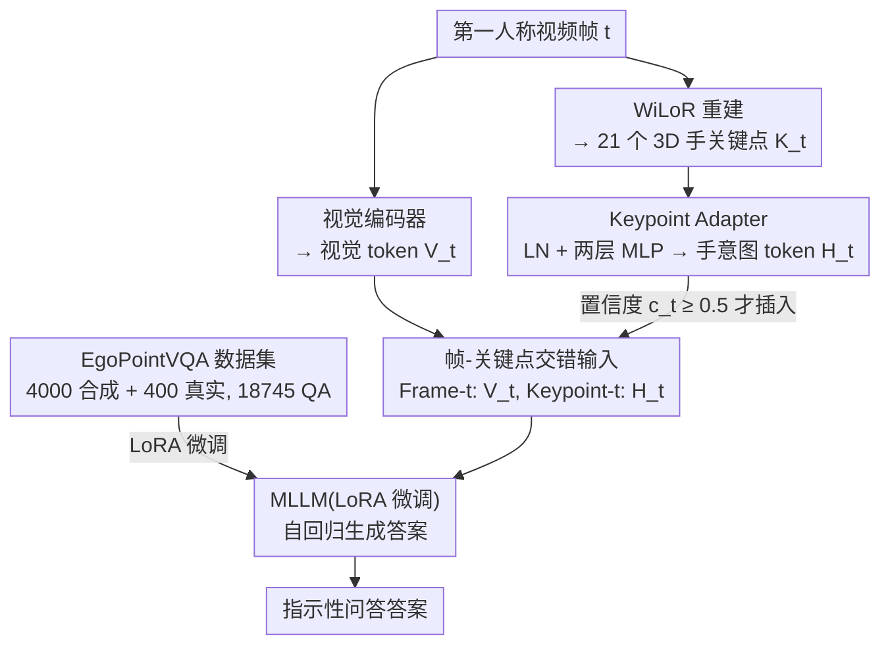

# Do You See What I Am Pointing At? Gesture-Based Egocentric Video Question Answering

**会议**: CVPR 2026  
**arXiv**: [2603.12533](https://arxiv.org/abs/2603.12533)  
**代码**: [https://yuuraa.github.io/papers/choi2026egovqa](https://yuuraa.github.io/papers/choi2026egovqa) (即将发布)  
**领域**: 视频理解  
**关键词**: 第一人称视频QA, 手势理解, deictic指示, 3D手关键点, 多模态大模型

## 一句话总结
提出 EgoPointVQA 数据集和 HINT（Hand Intent Tokens）方法，通过将 3D 手部关键点编码为手意图 token 并与视觉 token 交错输入 MLLM，解决第一人称视频中基于手势指向的指示性问答任务，HINT-14B 达 68.1% 准确率超越 InternVL3-14B 5.4pp。

## 研究背景与动机
随着 AR/VR 设备（Apple Vision Pro、Meta Orion）和智能眼镜日益普及，AI 助手需要理解用户在环境中的注意力指向。自然交流中人们频繁使用指示性表达（如"这个是什么？"、"应该用这个吗？"），这些问题只有结合用户的手势指向才能回答。

**现有痛点**：当前 MLLM（包括 GPT-4o、Qwen3-VL-32B）在此类任务上表现很差，原因有二：(1) 训练数据中缺乏手势丰富的第一人称视频；(2) 架构层面没有显式编码手势信息的机制——模型只做全局视觉-文本融合，无法将"这个"映射到手指指向的具体物体。

**核心 idea**：用一个轻量 adapter 把 3D 手部关键点编码成与视觉 token 对齐的手意图 token，显式地给模型提供手势指向信息。

## 方法详解

### 整体框架
HINT 的目标是让 MLLM 听懂"这个/那个"到底指向哪——而这只有结合用户的手势才能确定。它没有改动主干，而是在标准 MLLM 旁边并起一条手意图流：逐帧处理时，视觉编码器照常吐出视觉 token $V_t$，同时用现成的 WiLoR 从画面里重建出 21 个 3D 手关键点 $K_t \in \mathbb{R}^{21 \times 3}$，再由一个轻量 Keypoint Adapter 把这串几何坐标压成一个手意图 token $H_t$。最后不是把两路特征拼到一起，而是按时间顺序交错排列（某帧的视觉 token 后紧跟该帧的手意图 token）一起喂给 LLM，让模型在生成答案时同时看到"画面里有什么"和"手指向了哪"。整套方法还配套了一个专门的数据集 EgoPointVQA，因为缺训练数据本身就是问题的一半。

### 关键设计

**1. EgoPointVQA 数据集：先补上"手势指向问答"这块缺失的训练数据**

性能瓶颈的根源之一不在模型而在数据——现有第一人称 VQA 数据集没有一个聚焦于手势指向场景，模型从没见过"用户指着某物问这是什么"的样本。作者因此自建了 EgoPointVQA：4000 条合成视频来自 AI2-THOR 模拟器（184 个室内场景），用 MIXAMO 逆运动学动画生成自然的指向手势；另有 400 条真实视频，由 20 名参与者戴 Meta Ray-Ban 智能眼镜采集（360 段室内 + 40 段室外）。合起来 18,745 个 QA 对，覆盖 6 类任务：Reference（认出被指物体）、Counting（同类计数）、Spatial（空间关系）、Temporal（多次指向的先后顺序）、Attribute（属性）、Feedback（功能反馈）。测试集单独取 300 条真实视频共 672 个 QA 对，并经人工逐条核验答案正确性与指示是否唯一无歧义。合成数据保证规模和手势标注的精确，真实数据保证分布贴近落地场景，两者混合训练后都能用上。

**2. Keypoint Adapter：把 3D 手关键点学习式地编码成一个 token，而不是画在画面上**

有了手关键点，怎么把它喂给模型才是关键。最直觉的做法——在帧上叠加关键点或箭头——消融实验里反而掉点，因为视觉叠加会干扰 MLLM 原本的视觉理解；把坐标当文本读进去也几乎没用。HINT 改走学习式编码：先把 $K_t$ flatten 成 63 维向量 $\tilde{k}_t = \text{flatten}(K_t) \in \mathbb{R}^{63}$，再过 LayerNorm 和两层带 GeLU 的 MLP，直接映射到 LLM 的隐层维度，得到一个手意图 token

$$H_t = W_2\,\sigma\!\big(W_1\,\text{LN}(\tilde{k}_t)\big), \quad W_1 \in \mathbb{R}^{d_h \times 63},\; W_2 \in \mathbb{R}^{d \times d_h}.$$

当某帧手部检测置信度 $c_t < \tau = 0.5$ 时就不插入这个 token，自然跳过没有手的帧。这样做的好处是把"怎么利用几何信息"这件事交给模型自己学，而不是人为规定视觉提示的形式；而且 adapter 极轻量，手意图 token 占总 token 数不到 1%，推理仅多 0.26s。

**3. 帧-关键点交错输入：让手势 token 和它所属的帧在时间轴上对齐**

光有手意图 token 还不够，得让模型知道这只手是哪一帧的手。HINT 把序列排成 `Frame-1: <vis> Keypoint-1: <key> Frame-2: <vis> ...` 的交错形式，每帧的视觉 token 后面紧跟该帧的手意图 token，于是 LLM 自回归生成答案时是条件化在手势信号上的：

$$p(X_a \mid V, X_q, H) = \prod_{i=1}^{L} p\big(x_i \mid V, X_{q,<i}, X_{a,<i}, H_{<i}\big).$$

相比把所有手意图 token 单独拼成一段，交错排列让模型沿时间维度天然地把每个手势和对应画面绑定起来，从而在"第几次指向了什么"这类时序问题上也能对齐时空。

### 损失函数 / 训练策略
- 用 LoRA 微调视觉编码器和 LLM，Keypoint Adapter 从零训练
- AdamW + cosine 学习率，batch size 32，训练 1 个 epoch
- 训练数据为合成数据混合 100 条真实视频

## 实验关键数据

### 主实验

| 模型 | 参数量 | Reference | Temporal | Spatial | Count | Attr. | Feed. | 平均 |
|------|--------|-----------|----------|---------|-------|-------|-------|------|
| GPT-5 | - | 75.6 | 53.6 | 62.3 | 50.0 | 56.1 | 77.8 | 62.6 |
| Qwen3-VL | 32B | 63.7 | 67.9 | 65.8 | 66.7 | 63.4 | 77.2 | 67.5 |
| InternVL3 | 14B | 63.1 | 66.1 | 61.4 | 50.0 | 58.5 | 77.2 | 62.7 |
| **HINT-InternVL3** | **14B** | **73.8** | **69.6** | **64.9** | **54.2** | **63.4** | **82.5** | **68.1** |
| InternVL3 | 8B | 66.1 | 57.5 | 63.2 | 33.3 | 51.3 | 76.8 | 58.0 |
| **HINT-InternVL3** | **8B** | **75.0** | **66.1** | **64.9** | **35.4** | **61.0** | **79.8** | **63.7** |

HINT-14B 平均 68.1%，超越 InternVL3-14B baseline 5.4pp，甚至超过 GPT-5（62.6%）。

### 消融实验

| 配置 | Reference | Temporal | Spatial | Attribute | 说明 |
|------|-----------|----------|---------|-----------|------|
| InternVL3-8B (zero-shot) | 66.1 | 57.5 | 63.2 | 51.3 | 无任何微调 |
| + SFT only | 68.5 | 60.7 | 59.6 | 56.7 | 仅微调，无手意图token |
| + SFT + HINT | **75.0** | **66.1** | **64.9** | **61.0** | 完整方法 |

| 手意图建模方式 | Reference | Temporal | Spatial |
|---------------|-----------|----------|---------|
| None (SFT only) | 68.5 | 60.7 | 59.6 |
| Visual Keypoints（帧上画点） | 57.1 | 60.7 | 61.4 |
| Visual Arrow（帧上画箭头） | 70.2 | 60.7 | 62.3 |
| 3D Keypoints in Text | 68.5 | 55.4 | 58.8 |
| **HINT（学习式编码）** | **75.0** | **66.1** | **64.9** |

### 关键发现
- 单纯 SFT 只带来 +2.4pp 提升，加上 HINT 则带来 +8.9pp（Reference），显式手势编码远比数据驱动更重要
- 在帧上画关键点反而伤害性能（Reference 降到 57.1%），视觉叠加干扰 MLLM 的视觉理解
- 即使 78B 的 InternVL3 也只有 66.6% 平均准确率，scale up 不解决问题
- HINT token 仅占总 token 数 <1%，推理时间仅增加 0.26s（2.58s → 2.84s）
- 合成+真实混合训练优于任一单独使用

## 亮点与洞察
- 精准定位了一个关键且被忽视的问题：MLLM 不理解"这个"指的是什么
- 数据集设计完善：合成+真实、6 类任务、严格人工质量控制
- HINT 方法极其轻量（<1% token 开销），却带来显著提升
- 多种 backbone（LLaVA-OV, InternVL3-8B, InternVL3-14B）上一致有效
- 对 embodied AI / AR 助手方向有很强的启发性

## 局限与展望
- 仅支持指向手势，未涵盖其他手势类型（如抓取、挥手、比划大小）
- 依赖 WiLoR 手部重建的准确性，复杂场景（强遮挡、手部不完整）可能失效
- 合成数据与真实场景仍有 gap，真实数据量偏少（仅 400 视频，100 用于训练）
- 测试集仅 672 个 QA 对，规模偏小
- 未探索多人场景中的手势消歧

## 相关工作与启发
- 与 Region-specific VQA（Ferret, Osprey, Artemis）不同，本文不依赖给定 bbox 而是从手势推断指向区域
- Visual prompting（SoM, alphanumeric tags）用人工标记引导 MLLM，本文用自然手势信号
- EgoGPT、Ego-R1 等聚焦长期记忆和习惯分析，本文聚焦精细的手势指向理解，两者互补

## 评分
- 新颖性: ⭐⭐⭐⭐⭐ 首个指示性手势第一人称 VQA 任务和数据集，HINT 设计新颖有效
- 实验充分度: ⭐⭐⭐⭐ 15 个 baseline 对比 + 丰富消融，但数据集规模偏小
- 写作质量: ⭐⭐⭐⭐ 问题定义清晰，结构完整，图表丰富
- 价值: ⭐⭐⭐⭐⭐ 为 AR/VR 助手指明了关键方向，数据集和方法都有广泛影响力

<!-- RELATED:START -->

## 相关论文

- [\[CVPR 2026\] Ego-Grounding for Personalized Question-Answering in Egocentric Videos](ego-grounding_for_personalized_question-answering_in_egocentric_videos.md)
- [\[CVPR 2026\] LensWalk: Agentic Video Understanding by Planning How You See in Videos](lenswalk_agentic_video_understanding_by_planning_how_you_see_in_videos.md)
- [\[CVPR 2026\] Time Blindness: Why Video-Language Models Can't See What Humans Can?](time_blindness_why_video-language_models_cant_see_what_humans_can.md)
- [\[CVPR 2026\] MovieRecapsQA: A Multimodal Open-Ended Video Question-Answering Benchmark](movierecapsqa_a_multimodal_open-ended_video_question-answering_benchmark.md)
- [\[CVPR 2026\] HERBench: A Benchmark for Multi-Evidence Integration in Video Question Answering](herbench_a_benchmark_for_multi-evidence_integration_in_video_question_answering.md)

<!-- RELATED:END -->
