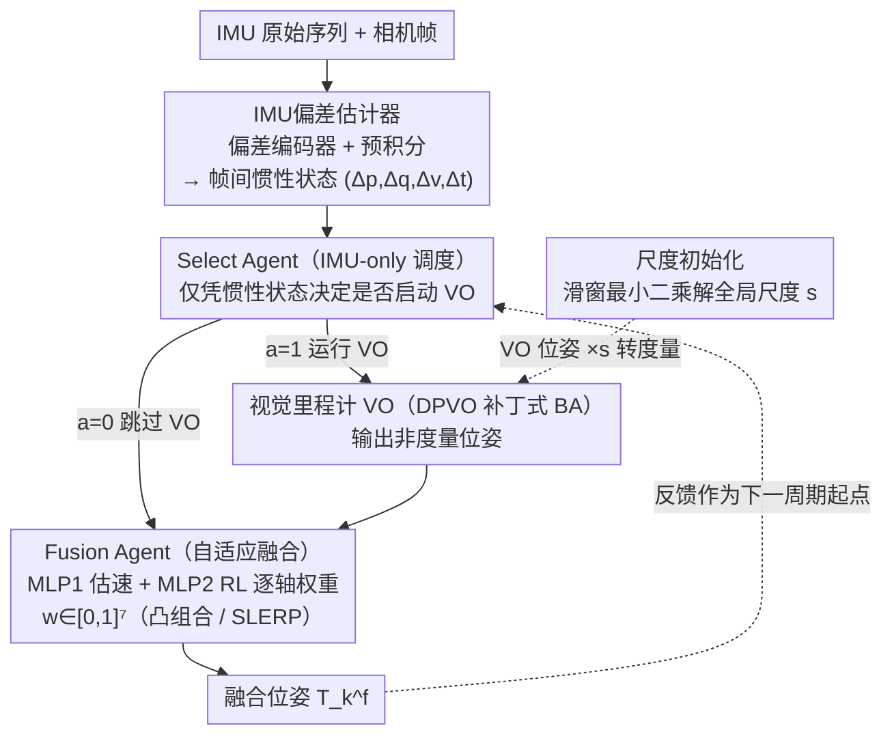

<!-- 由 src/gen_stubs.py 自动生成 -->
# Dual-Agent Reinforcement Learning for Adaptive and Cost-Aware Visual-Inertial Odometry

**会议**: CVPR2026  
**arXiv**: [2511.21083](https://arxiv.org/abs/2511.21083)  
**代码**: 待确认  
**领域**: 视频理解 / 视觉里程计  
**关键词**: Visual-Inertial Odometry, 强化学习, 自适应融合, 计算调度, IMU偏差估计, PPO

## 一句话总结

提出双智能体强化学习框架，通过 Select Agent（基于IMU信号决定是否启动视觉前端）和 Fusion Agent（自适应融合视觉-惯性状态）两个轻量RL策略，在不完全移除VIBA的前提下大幅降低其调用频率和计算开销，实现精度-效率-显存的更优折中。

## 研究背景与动机

**VIO的核心矛盾**：滤波方法（MSCKF、ROVIO）高效但漂移严重；优化方法（VINS-Mono、ORB-SLAM3）精度高但VIBA计算量大，难以部署在资源受限的边缘设备上。

**端到端深度学习方法局限**：VINet、SelfVIO等直接回归位姿，精度和泛化性仍不及成熟优化框架。

**混合方法未解决根本瓶颈**：iSLAM、DPVO等引入学习模块增强特征匹配或优化，但仍受限于VIBA的计算瓶颈。

**现有关键帧选择策略低效**：传统策略需要先处理图像才能判断帧是否有用，无法在视觉计算之前做出跳过决策。

**固定融合权重不够灵活**：静态的EKF或固定增益融合无法根据运动强度和传感器可靠性动态调整视觉/惯性的信任程度。

**RL在里程计中的应用尚浅**：已有工作（Messikommer et al.）仅用RL优化VO内部启发式，未从"是否启动整个VO流水线"的高层调度角度切入。

## 方法详解

### 整体框架

系统是一条带反馈回环的 VIO 流水线，由四个解耦模块串联，核心思路是用两个轻量 RL 智能体分别管「要不要算视觉」和「怎么融合」：

- **IMU 预处理（IMU Preprocess）**：偏差编码器先估计陀螺/加速度计偏差，校正后做预积分，输出帧间惯性状态 $(\Delta\mathbf{p}, \Delta\mathbf{q}, \Delta\mathbf{v}, \Delta t)$
- **Select Agent（选择智能体）**：RL 策略，仅凭 IMU 惯性状态决定是否激活高成本的视觉里程计（VO）
- **视觉里程计（VO）**：基于 DPVO 的补丁式循环优化，仅当 Select Agent 输出 1 时激活，输出稀疏高精度但非度量的位姿
- **Fusion Agent（融合智能体）**：复合模块，MLP1 监督估计度量速度、MLP2 用 RL 输出逐轴融合权重，把 VO 观测与 IMU 传播自适应融合成最终位姿

此外，系统启动时通过**尺度初始化**用滑窗内 IMU 预积分与 VO 相对平移构造超定线性系统、最小二乘求出全局度量尺度 $s$，VO 位姿乘以 $s$ 转为度量后才进入融合。每一周期融合得到的位姿会反馈给状态传播模块，作为下一周期的起点，闭合回环。

### 关键设计

**1. IMU偏差估计器**
- 训练两个轻量编码网络 $f_{bias}^g$（陀螺）和 $f_{bias}^a$（加速度计），输入原始传感器序列和噪声参数，输出3轴偏差估计
- 选择估计固定偏差而非随机噪声，因偏差模型更适合捕捉缓慢变化的主导模式

**2. Select Agent（RL调度）**
- **状态空间**：IMU-only紧凑状态 $s_t^{sel} = \{\Delta\mathbf{p}_t, \Delta\mathbf{q}_t, \Delta\mathbf{v}_t, \Delta t_t^{vo}\}$，无需任何视觉特征
- **动作空间**：二值决策 $a_t^{sel} \in \{0, 1\}$，0=跳过VO，1=运行VO
- **奖励函数**：终端ATE奖励 + 稠密逐步惩罚 + VO调用次数代价，$R_{episode} = \frac{A}{ATE + \epsilon} - B \cdot N_f$
- 用PPO训练，MLP参数化策略

**3. Fusion Agent（自适应融合）**
- **MLP1**（监督）：从缩放后VO位姿和IMU预积分估计度量速度
- **MLP2**（RL策略）：输出7维逐轴融合权重 $\mathbf{w} \in [0,1]^7$，对位置、速度做凸组合，对姿态做SLERP插值
- 当VO被跳过时 $\mathbf{w}$ 默认为零，纯IMU传播
- 奖励：$r_k = -\|\mathbf{p}_k - \mathbf{p}_{gt}\|_2^2 - \lambda \text{Tr}(\mathbf{\Sigma}_k)$，同时驱动低误差和合理不确定性

**4. 尺度初始化**
- 对齐世界坐标系与初始IMU体坐标系，利用滑动窗口内IMU预积分和VO相对平移构造超定线性系统，最小二乘求解全局度量尺度 $s$

### 训练策略

- 两阶段训练：MLP1监督预训练 → MLP2先监督初始化再PPO微调
- PPO在Gym-style回放环境中训练，使用真实IMU-VO对，天然包含传感器漂移和噪声

## 实验

### 主要结果

**EuRoC MAV数据集（表1）**：与经典CPU-VIO对比

| 方法 | MH2 | MH3 | MH4 | MH5 | V11 | V12 | V13 | V21 | V22 | V23 | Avg |
|------|------|------|------|------|------|------|------|------|------|------|------|
| MSCKF | 0.45 | 0.23 | 0.37 | 0.48 | 0.34 | 0.20 | 0.67 | 0.10 | 0.16 | 1.13 | 0.413 |
| VINS-MONO | 0.15 | 0.22 | 0.32 | 0.30 | 0.079 | 0.11 | 0.18 | 0.080 | 0.16 | 0.27 | 0.187 |
| DM-VIO | 0.044 | 0.097 | 0.102 | 0.096 | 0.048 | 0.045 | 0.069 | 0.029 | 0.050 | 0.114 | 0.069 |
| ORB-SLAM3 | 0.037 | 0.046 | 0.075 | 0.057 | 0.049 | 0.015 | 0.037 | 0.042 | 0.021 | 0.027 | **0.041** |
| **Ours** | 0.064 | 0.119 | 0.112 | 0.112 | 0.047 | 0.125 | 0.073 | 0.055 | 0.036 | 0.179 | 0.092 |

**GPU-based方法对比（表4）**：精度+效率+显存统一评估

| 方法 | Avg ATE | FPS | VRAM (GB) |
|------|---------|-----|-----------|
| DPVO | 0.106 | 22 | 4.92 |
| iSLAM | 0.529 | 31 | 6.47 |
| DROID-VO | 0.188 | 14 | 8.63 |
| **Ours** | **0.092** | **39** | **4.37** |

### 消融实验

1. **IMU偏差估计器**：同时估计陀螺和加速度计偏差（Omega+Accel）效果最优；固定偏差模型优于随机噪声模型
2. **Select Agent**：IMU-only先验调度在激进跳帧（75%~87.5%）下退化曲线比启发式和RL-gating(KF)更平缓；50%跳帧目标下IMU-only策略FPS显著更高，ATE增加<3%
3. **Fusion Agent**：RL融合（ATE 0.112m）优于EKF融合（0.127m）和固定权重融合（0.143m）；换用DROID-VO前端后融合策略仍有效（0.399→0.237m），证明跨后端泛化能力
4. **鲁棒性**：在5%/10%图像模糊退化下，本方法ATE（0.138/0.153m）始终低于DPVO（0.174/0.192m）

### 关键发现

- 本方法在GPU-based方法中取得最佳平均ATE（0.092m），同时FPS达39（DPVO的1.77倍），显存仅4.37GB（比DROID节省49.4%）
- CPU侧BA/VIBA时间从ORB-SLAM3的121ms降至12.77ms，结构性降低优化负载
- 与经典优化VIO相比精度可接受（Avg 0.092 vs DM-VIO 0.069），但计算效率优势显著
- TUM-VI数据集上平均ATE 0.80m，略高于DM-VIO的0.77m，保持竞争力

## 亮点

- **IMU-only先验调度**是核心创新：在视觉计算之前就做出跳过决策，节省远超仅优化VO内部启发式的计算量
- 双智能体设计将调度和融合解耦，各自优化不同目标，架构清晰
- Fusion Agent跨VO后端泛化（DPVO→DROID-VO），证明策略依赖物理量而非架构特征
- 在真实数据上用Gym-style回放训练PPO，避免sim-to-real gap

## 局限性

- 精度仍不及ORB-SLAM3等顶级优化方法（Avg 0.092 vs 0.041），差距明显
- 尺度初始化依赖足够运动的滑窗，静止启动场景可能失败
- 仅在EuRoC和TUM-VI两个室内数据集验证，缺乏户外/驾驶场景评估
- Select Agent的跳帧策略在极端场景（快速旋转连续帧）下的鲁棒性未充分讨论
- 训练需真实序列ground truth，对新环境的zero-shot泛化能力未验证

## 相关工作

- **经典VIO**：MSCKF、ROVIO（滤波）；VINS-Mono、ORB-SLAM3、DM-VIO（优化）
- **深度学习VO/VIO**：VINet、SelfVIO（端到端）；DPVO、DROID-SLAM（混合）；iSLAM（学习增强经典管线）
- **自适应视觉选择**：VS-VIO等在特征层动态重加权，但仍对每帧运行视觉编码器
- **RL在VO中的应用**：Messikommer et al. 用RL替换VO内部关键帧选择启发式，本文将RL提升到高层调度
- **最相关**：本文是首个将"是否运行整个VO流水线"建模为RL先验决策的工作

## 评分

- 新颖性: ⭐⭐⭐⭐ — 双智能体RL架构和IMU-only先验调度的思路新颖，但RL在机器人中的应用不算全新
- 实验充分度: ⭐⭐⭐⭐ — 消融详尽，跨后端泛化和鲁棒性均有测试，但仅限两个室内数据集
- 写作质量: ⭐⭐⭐⭐ — 结构清晰，动机阐述充分，公式推导完整
- 价值: ⭐⭐⭐⭐ — 精度-效率折中有实际部署意义，但与SOTA优化方法的精度差距限制了高精度场景应用

<!-- RELATED:START -->

## 相关论文

- [\[CVPR 2026\] Learning to Assist: Physics-Grounded Human-Human Control via Multi-Agent Reinforcement Learning](learning_to_assist_physics-grounded_human-human_control_via_multi-agent_reinforc.md)
- [\[CVPR 2026\] VideoChat-M1: Collaborative Policy Planning for Video Understanding via Multi-Agent Reinforcement Learning](videochatm1_collaborative_policy_planning_for_vide.md)
- [\[ICML 2026\] RELO: Reinforcement Learning to Localize for Visual Object Tracking](../../ICML2026/video_understanding/relo_reinforcement_learning_to_localize_for_visual_object_tracking.md)
- [\[CVPR 2026\] Efficient Frame Selection for Long Video Understanding via Reinforcement Learning](efficient_frame_selection_for_long_video_understanding_via_reinforcement_learnin.md)
- [\[CVPR 2026\] Learning to Refuse: Refusal-Aware Reinforcement Fine-Tuning for Hard-Irrelevant Queries in Video Temporal Grounding](learning_to_refuse_refusal-aware_reinforcement_fine-tuning_for_hard-irrelevant_q.md)

<!-- RELATED:END -->
