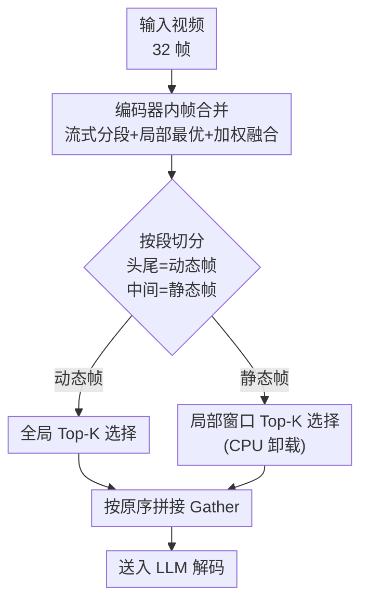

# EarlyTom: Early Token Compression Completes Fast Video Understanding

**会议**: CVPR 2026  
**arXiv**: [2605.30010](https://arxiv.org/abs/2605.30010)  
**代码**: https://viridisgreen.github.io/EarlyTom (项目主页)  
**领域**: 视频理解 / Video-LLM 推理加速  
**关键词**: 视觉 token 压缩, 视频大模型, TTFT, 帧合并, 免训练

## 一句话总结
EarlyTom 是一个免训练的视频 token 压缩框架，它把压缩点从"视觉编码器之后"提前到"视觉编码器内部"做帧合并，再配一套解耦的空间 token 选择策略，在 LLaVA-OneVision-7B 上把首 token 时延（TTFT）最多降 $2.65\times$、FLOPs 降 61%，同时精度保持在全 token 基线的 96% 以上。

## 研究背景与动机

**领域现状**：视频大模型（Video-LLM）做视频理解效果很强，但一段视频会被切成大量帧、每帧又编码成几百个视觉 token，token 数量爆炸导致推理又慢又贵。为此社区做了大量 token 压缩工作，按压缩位置分两类：一类在 LLM 内部裁 token（FastV、SparseVLM、PyramidDrop），一类在进 LLM 之前裁（VisionZip、LLaVAPruMerge），还有混合派（HoliTom、FastVID、DyCoke）。

**现有痛点**：这些方法几乎都在"视觉编码器之后"才动手，把视觉编码器本身当成不可优化的黑盒。但作者对首 token 时延（TTFT，time-to-first-token）做拆解后发现：视觉编码阶段在基线里就占了 36.3% 的 TTFT（323 ms），而在已经优化了 LLM prefill 的 SOTA 方法里这个比例反而更刺眼——HoliTom 占 55.8%、VisionZip 占 68.4%，视觉编码成了新的头号瓶颈。更糟的是 HoliTom 这类方法的压缩本身还引入额外开销（visual token processing 阶段比基线多 78 ms，+121.9%）。

**核心矛盾**：现有方法把 token 留存率压到 10–25% 看着很激进，但因为没碰视觉编码器，TTFT 仍卡在 458–661 ms 下不来。压缩做得再狠，只要还在编码器之后，就绕不开"先把全量帧完整编码一遍"这个最贵的步骤。

**本文目标**：把压缩动作搬进视觉编码器内部，在编码过程中就把冗余帧合并掉，让进入后续阶段的 token 从源头变少，从而直接砍掉视觉编码时延，且不引入额外训练、几乎不增加开销。

**切入角度 + 核心 idea**：作者观察到相邻视频帧高度冗余（编码器中间层的逐帧 cosine 相似度很高），于是"在编码器内部就边编码边合并相似帧"；同时还发现 SigLIP 注意力里存在 **sink token**（query norm 异常大、无视内容地霸占注意力），导致直接用注意力分数做 top-K 选择会引入偏置，于是再设计一套"解耦"的空间选择来规避。一句话：**把 token 压缩从编码器之后提前到编码器内部（early），并用解耦选择消除 sink token 偏置**。

## 方法详解

### 整体框架
EarlyTom 是一个免训练框架，要解决的是"视觉编码阶段占了 TTFT 一大半却没人优化"这件事。整条流水线分两个串行阶段：**Stage I 在视觉编码器内部做时序帧合并**（把冗余帧在编码途中就合掉，直接减少编码时延），**Stage II 在编码完成后做空间 token 选择**（把每帧内的 token 进一步裁掉，且避开 sink token 偏置），最后把两路结果按原始顺序拼回送进 LLM 解码。两阶段一前一后，分别压"时间维"和"空间维"的冗余。

> 说明：图中"编码器内帧合并"对应关键设计 1，动态/静态两路 Top-K 选择对应关键设计 2，CPU 卸载对应关键设计 3。

### 关键设计

**1. 编码器内帧合并：在视觉编码途中就把冗余帧合掉，从源头砍 TTFT**

针对的痛点是"视觉编码阶段最贵但没人压"。EarlyTom 不在编码后才动手，而是在视觉编码器的若干选定层（实验里从第 6 层开始最优）插入帧合并，分三步走。第一步**流式分段**：逐帧算相邻帧的 cosine 相似度（对应空间位置 token 相似度取平均），并用指数滑动平均（EMA）平滑——$\hat{s}_t = \alpha s_t + (1-\alpha)\hat{s}_{t-1}$，当 $\hat{s}_t < \tau_{\mathrm{seg}}$ 时切一刀作为段边界。第二步**中间帧合并**：对一段内除首尾外的中间帧，用"局部最优"准则——当且仅当 $s_i > \tau_{\mathrm{merge}}$ 且 $s_i > s_{i+1}$（即这对帧足够像、且比下一对更像）才合并 $F_i$ 与 $F_{i+1}$，保证只合最相似的帧、不破坏时序连续性。第三步**加权融合**：合并不是简单平均，而是按相似度加权 $\hat{F} = \frac{s_i F_i + s_{i+1} F_{i+1}}{s_i + s_{i+1}}$，让融合后的表示更靠近语义重要的内容、减少时序变化不均带来的歧义。因为压缩发生在编码器内部、合掉的帧后续层就不再算了，所以能直接削减最贵的视觉编码时延，且整个过程无需训练、开销几乎可忽略

**2. 解耦的空间 token 选择：把帧分成动态/静态两路、用不同策略避开 sink token 偏置**

针对的痛点是 SigLIP 注意力里的 sink token——某些固定空间位置的 token query norm 异常大（$|Q_{\text{sink}}|_2 \gg |Q_p|_2$），无视画面内容就霸占注意力（形成跨帧竖条纹），导致 FastVID、HoliTom 那种纯 Top-K 选择会被 sink token 带偏、造成跨帧分布漂移。EarlyTom 的解法是"解耦"：把 Stage I 合并后的帧 $\hat{F}\in\mathbb{R}^{N\times L\times D}$ 切成**动态帧**（每段的头尾帧，判别力最强）和**静态帧**（段中间帧），两路分开选。动态帧做**全局 Top-K**：按逐 token 注意力分选最重要的，选择比例还要重标定 $\hat{r} = \frac{r}{(\frac{B-N}{B})\cdot L}$（$B$ 为初始帧数如 32），把 Stage I 已合并的比例一并算进去以达到预设总压缩率，保住最具运动信息的 token。静态帧做**局部窗口 Top-K**：先把 token 划成 $M=\lceil L/w \rceil$ 个等宽窗口（$w=\lfloor L/\hat{r}\rfloor$），每个窗口内只取注意力最高的那一个 token——这样选出的静态帧分布更贴近原始分布（实验图 5 显示比 vanilla top-K 更接近），从而避开 sink token 把所有名额吸走的偏置。两路选完按原始顺序 Gather 拼回。这种"动态求显著、静态保分布"的解耦比单一 Top-K 更能兼顾运动信息和空间均匀性

**3. CPU–GPU 异构协同：把静态选择卸到 CPU，榨干闲置算力提吞吐**

这是一个系统层的协同设计，针对"动态 token 选择因候选集大而更耗时"的观察。既然所有帧已经按相似度分好了段，作者就把分段级的**静态 token 选择放到 CPU 上做**，同时让 GPU 专注决定动态 token 保留哪些。利用本来空闲的 CPU 算力做这部分串行选择，GPU 不被静态选择阻塞，整体处理速度上去、又保持成本效率。实现上还配了自定义 Triton kernel 保证算子效率，并复用了 HoliTom 的 inner-LLM 合并技术。这个设计单看不起眼，但它是 EarlyTom 在"留存率相同"时吞吐还能领先的关键工程支撑

### 损失函数 / 训练策略
EarlyTom 是**完全免训练**的（training-free），不引入任何可学习参数，全部依赖相似度阈值与注意力分数做规则化的合并与选择。基于 LLaVA-OneVision-0.5B/7B 实现，视觉编码器用预训练 SigLIP，统一采样 32 帧；TTFT 用 NVIDIA Nsight Systems 测，吞吐取 10 次推理（2 次 warm-up 后）均值，FLOPs 按 HoliTom 协议（含视觉编码 + LLM prefill）计算，评测走 LMMs-Eval 框架。

## 实验关键数据

### 主实验（LLaVA-OV-7B，10% 留存率，A100）
EarlyTom 在 TTFT、FLOPs、吞吐三项上全面领先免训练 SOTA，精度保持在基线 96% 以上。

| 方法 | 留存率 | FLOPs(T)↓ | TTFT(ms)↓ | 吞吐↑ | 四基准 Avg↑ | Score% |
|------|--------|-----------|-----------|-------|-------------|--------|
| LLaVA-OV-7B (全 token) | 100% | 82.6 | 889.9 | 24.4 | 58.6 | 100 |
| VisionZip (CVPR'25) | 10% | 45.2 | 458.5 | 28.5 | 53.5 | 91.6 |
| HoliTom (NeurIPS'25) | 10% | 44.6 | 556.6 | 29.0 | 57.9 | 99.1 |
| **EarlyTom** | 10% | **32.2** | **336.2** | **31.6** | 56.2 | 96.2 |
| **EarlyTom** | 25% | 36.5 | 426.3 | **32.9** | 58.2 | 99.7 |

注：相对全 token 基线 889.9 ms，EarlyTom 10% 设置下 TTFT 336.2 ms 即 $2.65\times$ 提速；FLOPs 32.2T vs 82.6T 约降 61%。25% 设置精度 58.2（Score 99.7%）几乎无损。

### 跨 backbone（LLaVA-OV-0.5B，A100）
| 方法 | 留存率 | TTFT(ms)↓ | 吞吐↑ | Avg↑ | Score% |
|------|--------|-----------|-------|------|--------|
| LLaVA-OV-0.5B (全) | 100% | 413.7 | 42.7 | 40.5 | 100 |
| HoliTom | 25% | 519.4 | 35.2 | 41.0 | 101.2 |
| **EarlyTom** | 25% | **331.5** | **47.8** | 40.7 | 100.4 |
| **EarlyTom** | 10% | **280.1** | 43.9 | 39.4 | 97.3 |

小模型上 EarlyTom 同样把 TTFT 压到最低、吞吐拉到最高，验证了架构无关性。

### 消融实验

**模块贡献（留存率 0.2）**
| 配置 | 留存率 | MVBench | VideoMME | EgoSchema | Avg |
|------|--------|---------|----------|-----------|-----|
| Vanilla（全 token） | 100% | 58.3 | 58.6 | 60.4 | 59.1 |
| 仅 Stage I（帧合并） | 73.9% | 57.9 | 57.0 | 60.3 | 58.4 |
| 仅 Stage II（空间选择） | 20% | 57.3 | 57.6 | 60.4 | 58.4 |
| **EarlyTom（两者）** | 20% | 57.8 | 58.1 | 60.6 | **58.8** |

**采样方式对比（留存率 0.2）**
| 采样 | 吞吐↑ | Avg↑ | 说明 |
|------|-------|------|------|
| Random | 35.3 | 57.8 | 最快但丢信息 |
| Top-K | 31.5 | 58.4 | 准但慢（$O(N\log K)$ 全局排序）|
| **EarlyTom（局部窗口）** | 33.4 | **58.8** | 兼顾效率与精度 |

**起始合并层（留存率 0.2）**：Layer 4 时延最低（380 ms）但精度掉；Layer 6 在精度（Avg 58.9）和吞吐（32.3）间最平衡，故默认从第 6 层开始合并。

### 关键发现
- 两个阶段单独用都只能达到 Avg 58.4，合在一起反而升到 58.8，说明时序合并与空间选择互补、不是简单叠加。
- 局部窗口采样精度（58.8）比全局 Top-K（58.4）更高且更快，因为它绕开了 sink token 把名额吸走的偏置，分布更接近原图。
- TTFT 和吞吐不成正比：因为帧合并依赖编码器中间层 hidden state，起始层越浅省得越多但精度越脆，存在层选择的甜点。

## 亮点与洞察
- **把瓶颈量化清楚再动手**：先用 Nsight 拆 TTFT，发现"越优化 LLM 的方法、视觉编码占比越离谱（最高 68.4%）"，这个 profiling 本身就很有说服力，直接立住了"压编码器内部"的动机。
- **sink token 这个反例很关键**：指出 SigLIP 注意力被异常 norm 的 sink token 霸占，所以纯 Top-K 选 token 天然有偏——这解释了为什么要"解耦 + 局部窗口"，是个可迁移到其他 ViT token 压缩任务的洞察。
- **"动态求显著、静态保分布"的二分思路**：对运动帧用全局 Top-K 抓显著、对静止帧用局部窗口保均匀，这种按帧性质分治的策略可以迁移到任何需要时空联合采样的视频任务。
- **系统协同补刀**：把静态选择卸到 CPU、配 Triton kernel，让"相同留存率下吞吐还能更高"，提醒做加速不能只算 FLOPs、要算真实墙钟时间。

## 局限与展望
- **依赖相似度阈值**：分段（$\tau_{\mathrm{seg}}$）、合并（$\tau_{\mathrm{merge}}$）都是预设阈值，Stage I 的留存率"sample-dependent"（消融表里写 73.9% 是均值），对不同冗余度的视频可能需要调参，泛化到极端场景（快切镜头/几乎静止长视频）的稳定性未充分讨论。
- **10% 激进压缩有可感知掉点**：7B 在 10% 设置 Score 降到 96.2%（LongVideoBench 从 60.4 掉到 52.4，较明显），说明长视频强依赖完整上下文的任务对早期帧合并更敏感。
- **耦合了 HoliTom 组件**：实现里复用了 HoliTom 的 inner-LLM 合并，纯"EarlyTom 自身"两阶段的独立增益边界不够清晰。
- **改进方向**：阈值自适应化（按视频冗余度动态定）、把帧合并层数也做成内容自适应、在更大/更长视频 backbone 上验证。

## 相关工作与启发
- **vs HoliTom（NeurIPS'25）**：HoliTom 做外-LLM 时空分段合并 + 内-LLM 合并，但压缩全在视觉编码之后，视觉编码仍占 55.8% TTFT 且额外开销 +78 ms；EarlyTom 把合并搬进编码器内部，相同 10% 留存率 TTFT 从 556.6 降到 336.2 ms，根本差别在"压缩点的前移"。
- **vs VisionZip（CVPR'25）**：VisionZip 在进 LLM 前按注意力分留 token 再聚类合并，属 pre-LLM；激进压缩（10%）时精度掉近 9%，而 EarlyTom 只掉约 4%，且 TTFT 更低（336 vs 458 ms）——说明早期合并比晚期裁剪更能保住有用特征。
- **vs FastVID（NeurIPS'25）**：FastVID 按时序+信息密度做时空剪枝，但仍是编码后操作且用 Top-K，会受 sink token 偏置影响；EarlyTom 的解耦局部窗口选择正是冲着这个偏置去的。
- **vs ToMe / PiToMe（ViT token merge）**：ToMe 在 ViT 内按 key 相似度合 token，是图像级、不针对视频时序冗余；EarlyTom 把"编码器内合并"的思路专门适配到视频帧级时序冗余，并叠加了 sink-aware 的空间选择。

## 评分
- 新颖性: ⭐⭐⭐⭐ "把压缩点前移到编码器内部 + sink token 偏置分析"角度新颖，但帧合并/Top-K 选择的具体算子是已有技术的组合。
- 实验充分度: ⭐⭐⭐⭐ 四基准 × 两 backbone × 多留存率 + 模块/采样/层数消融齐全，效率指标用真实 profiler 测；缺更长视频与更多 backbone 的压力测试。
- 写作质量: ⭐⭐⭐⭐ profiling 驱动动机清晰、两阶段逻辑顺，公式与图配合到位。
- 价值: ⭐⭐⭐⭐ 免训练、即插即用、直接降 TTFT $2.65\times$，对 Video-LLM 实际部署很实用。

<!-- RELATED:START -->

## 相关论文

- [\[CVPR 2026\] StreamingTOM: Streaming Token Compression for Efficient Video Understanding](streamingtom_streaming_token_compression_for_efficient_video_understanding.md)
- [\[CVPR 2026\] An Efficient Token Compression Framework for Visual Object Tracking](an_efficient_token_compression_framework_for_visual_object_tracking.md)
- [\[CVPR 2026\] Unified Spatiotemporal Token Compression for Video-LLMs at Ultra-Low Retention](unified_spatiotemporal_token_compression_for_video-llms_at_ultra-low_retention.md)
- [\[ICLR 2026\] FLoC: Facility Location-Based Efficient Visual Token Compression for Long Video Understanding](../../ICLR2026/video_understanding/floc_facility_location-based_efficient_visual_token_compression_for_long_video_u.md)
- [\[CVPR 2026\] VideoITG: Multimodal Video Understanding with Instructed Temporal Grounding](videoitg_multimodal_video_understanding_with_instructed_temporal_grounding.md)

<!-- RELATED:END -->
