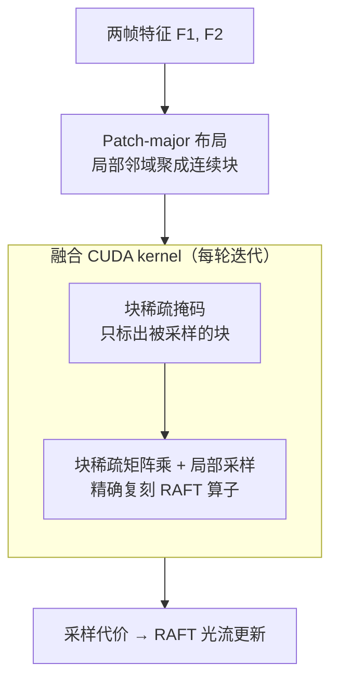

# Efficient All-Pairs Correlation Volume Sampling for Optical Flow Estimation

**会议**: CVPR 2026  
**arXiv**: [2505.16942](https://arxiv.org/abs/2505.16942)  
**代码**: 未在正文给出（DisneyResearch｜Studios + ETH Zürich）  
**领域**: 视频理解 / 光流估计 / 算子加速  
**关键词**: 光流估计, RAFT, 相关体, 块稀疏, CUDA kernel, 超高分辨率

## 一句话总结
针对 RAFT 系光流方法里「全配对相关体采样」在高分辨率下要么显存爆炸、要么算得慢的两难，本文从「实际只采样了 1.6% 的相关体」这一观察出发，设计了一个**块稀疏 + patch-major 布局 + 融合 CUDA kernel** 的采样算子：在数学上**逐位精确复刻** RAFT 的采样定义，却把时空复杂度从平方降到线性 $\mathcal{O}(n)$，端到端推理最多省 63–67% 时间，并在自建 8K 数据集上拿到精度-速度 Pareto 前沿的 SOTA。

## 研究背景与动机
**领域现状**：当代光流估计的主流是 RAFT 路线——先在两帧特征间构造一个**全配对相关体（all-pairs correlation volume）** $\mathbf{C}\in\mathbb{R}^{H_1\times W_1\times H_2\times W_2}$，再通过若干轮迭代，在当前光流估计的局部邻域里双线性采样匹配代价来更新光流。RAFT 给了两种采样实现，后续工作几乎都沿用其一。

**现有痛点**：两种实现各有死穴。**默认实现**一次性把完整 4D 相关体算出来存住，代价是显存随像素数**平方增长**——在 $1024\times448$ 分辨率下就要 719GB 来存相关体，高分辨率直接 OOM。**按需采样（on-demand）**虽然显存低，但每个像素现算 Eq.1、操作不亲和硬件、迭代间无法复用结果，实测**比默认慢一个数量级**。

**核心矛盾**：速度和显存之间存在硬 trade-off，二者不可兼得。正因如此，很多近期方法干脆**回避**全相关体（如用 1D 分解、低秩近似），或者**移除**相关体改用更大 backbone（ReCoVEr、WAFT）——但这些都以**牺牲精度**为代价。也因为算不动，许多方法只能在降采样分辨率上跑，丢失了细粒度细节。

**切入角度**：作者做了一个关键的实证分析——在 Sintel 上跑默认 RAFT，追踪到底哪些相关体格子被采样了。结论是：因为每轮 lookup 只在当前光流附近的 $(2r+1)^2$ 局部网格里采样、且迭代间邻域高度重叠，**整轮迭代下来平均只有 1.6% 的格子被真正用到**。既然绝大部分相关体是白算的，那就只算被用到的那部分。

**核心 idea**：把相关体表示成**块稀疏**格式、以「块」而非「像素」为粒度做计算决策，配合让局部邻域在内存里聚成连续块的 **patch-major 布局**，再融进单个 CUDA kernel——在**完全不改变 RAFT 数学定义**的前提下，把平方复杂度降成线性。

## 方法详解

### 整体框架
输入是从两帧抽出的 $D$ 维特征 $F^{1,2}\in\mathbb{R}^{H\times W\times D}$，输出是 RAFT 迭代每一轮所需的局部采样代价 $\mathcal{C}_r(\mathbf{y},\mathbf{x})$。整个算子的逻辑是「一次预处理 + 每轮迭代三步」：先把图像特征重排成 **patch-major 布局**（让一个 2D 空间块在内存里连续）；之后在 RAFT 的每一轮光流更新里（通常 4–32 轮），执行 (a) 根据当前采样网格**确定哪些块需要算**、设好计算掩码，(b) 用**块稀疏矩阵乘**只算这些块，(c) 在算出的块上**局部采样**。高层实现会把掩码和块稀疏相关体显式存住，而最终的**融合 CUDA kernel** 把三步串进单个 thread block、一行块算完即采样、中间结果不落地全局显存，从而做到 $\mathcal{O}(n)$ 时空复杂度。该算子和 RAFT 原定义逐位等价（端点误差差异仅 0.03%）。

### 关键设计

**1. 块稀疏化采样：只算被用到的那 1.6%**

痛点很直白——默认实现把整个相关体都算出来存住，可实测全程只有 1.6% 的格子被采样，剩下 98.4% 纯属浪费显存和算力。最朴素的修法是用一个二值 mask 逐像素记录哪些值需要算，但这个 mask 本身就和完整相关体一样大、一样存不下，而且逐像素现算又退化成了慢的按需采样。作者的解法是**把决策粒度从像素提到块**：把相关体 $\mathbf{C}$ 表示成块稀疏格式，以块为单位决定算不算。建掩码时，取 Eq.1 定义的整数网格采样位置，对块大小 $B$ 做整除得到块索引，再做采样的**逆操作（scatter）**把这些块在掩码里置 1——因为是采样的逆运算，能保证所有会被采样到的位置都已标记为「需计算」。以块为粒度虽然让需算的格子比例略升（一个块只要有一个值被用就整块算），但只要块够小，比例仍远低于满矩阵，而块本身又是硬件友好的稠密小矩阵

**2. Patch-major 布局：把 2D 局部邻域在内存里聚成连续块**

仅仅块稀疏还不够——RAFT 的采样网格是定义在 **2D 邻域**上的，当把图像按常规行优先 flatten 成一维后，原本相邻的 2D 点会被打散到很多个不相邻的列、跨越很多块，块稀疏的「稀疏」就被稀释了。为此作者改变 flatten 的布局：把图像按 **patch-major** 方式重排——先把图 pad 成 $B$ 的整数倍并切成 $B^2$ 大小的 tile，每个 tile 内部行优先 flatten，再把所有 tile 行优先排开，最终连续地存进一块内存。这样一个 2D 空间块在内存里就是连续的一段，被采样的区域天然聚成少数几个块。文中图 3 显示这种「块感知」布局**在零额外计算开销下显著提升了稀疏度**——它是块稀疏能真正省下计算的前提

**3. 三步块稀疏算子：精确复刻 RAFT，而非近似**

这是算法主体，目标是在不近似的前提下替换掉 Eq.2 的稠密相关体计算。每轮迭代三步：(a) **设计算掩码**——如上用 scatter 标出需算的块；(b) **稀疏相关体计算**——只对掩码非零的块做矩阵乘，每个块是两个 $B^4\times D$ 小矩阵的乘积（块高 $B=8$），硬件上高度优化、算得快，且只把非零块存进显存；(c) **稀疏体采样**——对每个待查代价值，先算它落在哪个块、gather 到该块在内存的位置、算出块内相对坐标，再像 baseline 一样在块内局部采样。多尺度相关体（RAFT 的 4 级金字塔）就对每一级独立跑、取平均池化后的目标特征。这一设计与那些「回避/移除相关体」的近似方法本质不同：它**仍然是 RAFT 那个精确算子**（实测端点误差仅差 0.03%），只是不再算白算的部分，因此可作为 drop-in 替换直接塞进 RAFT 及其变体而不掉精度

**4. 融合 CUDA kernel + 隐式投票掩码：做到 $\mathcal{O}(n)$ 时空**

高层实现要显式存掩码和块稀疏体，仍有可观的显存和访存开销。作者把三步**融进单个 CUDA kernel**：相关体每一**行块**由一个 thread block 串行地「算一块、立刻采样一块」，每个线程负责一个源像素（采样一行），所有行块互相独立，因此整套流程的中间结果**完全不写回全局显存**，只用 shared memory 和寄存器，从而把时空复杂度都压到输入像素数的线性 $\mathcal{O}(n)$。其中最巧的是**隐式计算掩码**：为避免存/遍历整行掩码，每个线程先算出自己要采样的块索引（常用参数下不超过 9 个）并按严格递增存进寄存器数组；然后所有线程通过 shared memory 上的**原子最小值（atomic minimum）投票**选出下一个要算的最小块，投中的线程把本地指针前移。选定块后，所有线程联合计算该相关 tile、经 shared memory 交换寄存器值使每个线程拿到自己源像素的全部值，直接采样得到部分代价、以残差形式累加进输出 buffer；扫完整行块后 buffer 里就是精确的相关值。kernel 用 CUTLASS CuTe DSL 实现，针对 Ampere 架构的 warp-level MMA tensor core，bfloat16 输入、float32 累加

**5. 级联推理：SEA-RAFT 的免训练大位移补丁**

这是算子之外的一个独立贡献，针对高分辨率推理的一个副作用：在高分辨率上估光流虽然能捕捉细粒度细节，却**变得难以估计大位移**。作者给 SEA-RAFT 加了一个**测试期、零额外训练**的级联初始化：在做任何迭代更新前，递归地用低分辨率估计来初始化光流——只要输入最小边 $>800$px，就把输入双线性降到 $1/4$ 分辨率先估一遍，再用 $1/2$ 降采样的输出来初始化当前光流（光流本身在 $1/8$ 分辨率上更新）。它相当于 RAFT warm-start 初始化的多分辨率版本，但与 MS-RAFT+ 不同，**不需要训练多个分辨率模块**。配合本文的高效采样器，就在 8K 上同时拿到了大位移精度和细节

## 实验关键数据

### 隔离测试：只测相关采样算子
在 Sintel train（1041 样本）上，固定 $2048\times896$ 输入、$256$ 通道、$32$ 轮迭代，对比默认实现 / 按需采样 / 本文（NVIDIA GH200 / A100）。核心结论：算子在**同等显存下运行时间降 90%+**，或**同等运行时间下显存降最多 99%**，且运行时间和显存都随像素数线性增长。

| 方法 (RAFT, 输入宽) | 默认 时间/显存 | 按需采样 时间/显存 | 本文 时间/显存 |
|------|------|------|------|
| $1024$-$1/8$ | 0.07s / 3.42GB | 0.56s / 3.23GB | **0.09s / 3.23GB** |
| $2048$-$1/4$ | 0.25s / 8.78GB | 0.89s / 4.08GB | **0.25s / 4.08GB** |
| $4096$-$1/2$ | OOM | 2.62s / 7.46GB | **0.96s / 7.46GB** |
| $8192$-$1/1$ | OOM | 10.47s / 20.96GB | **3.43s / 20.96GB** |

- vs 按需采样：$4096$ 下 $0.96/2.62\approx$ **快 63%**，$8192$ 下 $3.43/10.47\approx$ **快 67%**，且显存与按需采样持平。
- vs 默认实现：运行时间持平或更快，但默认在 $\ge4096$ 直接 OOM；默认在 $1024\times448$ 就需 719GB 存相关体。

### 8K 端到端：自建 Charge 数据集（332 对，$8192\times3432$，80GB 显存上限）
列出每个方法在 80GB 内能跑、且 1px 误差最优的尺度；EPE 为端点误差，LM 为大位移（位移 >128px）子集。

| 方法 | 尺度 | 1px↓ | EPE↓ | LM-1px↓ | LM-EPE↓ | 端到端提速 |
|------|------|------|------|---------|---------|------|
| RAFT | $4096$-$1/2$ | 18.9 | 5.90 | 49.8 | 36.41 | **−63%** (2.62→0.96s) |
| MS-RAFT+ | $4096$-$1/2$ | 14.5 | 1.92 | 34.6 | 32.03 | −25% (5.51→4.15s) |
| CCMR | $4096$-$1/2$ | 15.8 | 2.16 | 39.7 | 42.86 | −16% |
| DPFlow | $8192$-$1/1$ | 16.5 | 1.92 | 34.4 | **18.03** | −9% |
| SEA-RAFT | $4096$-$1/2$ | 16.8 | 4.94 | 39.8 | 39.83 | −33% (0.62→0.42s) |
| **SEA-RAFT (级联)** | $8192$-$1/1$ | **13.3** | 2.70 | **31.6** | 21.53 | −34% |
| **SEA-RAFT (级联)** | $4096$-$1/2$ | 15.8 | **1.90** | 36.8 | 18.58 | −37% |

### 关键发现
- **大多数 RAFT 系方法端到端提速 >30%**：因为相关采样占了整体运行时间相当大一块，把它降下来直接拉低总耗时；对本就为效率设计的 SEA-RAFT 也还能再省约 33%。
- **级联 SEA-RAFT 拿下最优 1px（13.3%）和最优大位移 1px（31.6%）**：证明配上高效采样器后，基于相关体的方法在精度上也能反超那些为省算力而牺牲精度的「无相关体」方法。
- **精度-速度 Pareto 前沿**：很多先前方法在 8K 上要么跑不动、要么质量退化；本文让 cost-volume 方法在 8K 上同时占住速度和质量两头。
- **块高 $B=8$** 是稀疏度和块计算效率的折中；算子与 RAFT 数学等价（EPE 差 0.03%），可放心当 drop-in 替换。

## 亮点与洞察
- **「先量化稀疏度，再据此设计算子」的范式**：1.6% 这个实测数字是整篇文章的地基——它把「相关体大多是白算的」从直觉变成可操作的设计依据，块大小、布局都是围绕「如何高效只算这 1.6%」反推出来的。
- **patch-major 布局是「免费的稀疏放大器」**：同样的块稀疏，换个内存布局让 2D 邻域聚成连续块，稀疏度显著提升却零额外计算——这种「不改数学、只改 layout 就提速」的思路可迁移到任何带 2D 局部窗口的算子。
- **不近似、可逐位复刻**是它和一众高效光流方法的根本区别：别人省钱靠改架构/降精度，它纯靠工程把白算的部分省掉，因此能无痛塞进现有 RAFT 生态。
- **隐式投票掩码很精巧**：用 shared memory 上的 atomic-min 让一个 thread block 内的线程协同决定「下一个该算哪块」，省掉了显式掩码的存储和遍历，是把高层算法压成 $\mathcal{O}(n)$ kernel 的关键一招。
- **级联推理几乎零成本**：纯测试期、不训练、只是多分辨率 warm-start，就把高分辨率下「丢大位移」的毛病补上了，思路可复用到其它迭代式 refine 网络。

## 局限与展望
- **加速集中在「相关采样」这一算子**：端到端收益取决于相关采样在总耗时里的占比，对那些本就不怎么用全相关体、或瓶颈在 backbone 的方法（如 WAFT、ReCoVEr）收益有限甚至不适用。
- **强依赖底层硬件特性**：融合 kernel 用 CUTLASS CuTe DSL、面向 Ampere warp-level MMA tensor core、bfloat16 输入，迁移到其它架构/精度需要重新实现与调优；正文未给出代码与可复现脚本（⚠️ 以原文/补充材料为准）。
- **块高 $B$ 是固定超参**：$B=8$ 是经验折中，不同分辨率/迭代轮数下是否仍最优、能否自适应选块，文中未展开。
- **8K 数据集只含前向光流、单一来源**：基于 Blender 电影 Charge 的 332 对、仅前向流，真实拍摄的 8K 评测仍缺位；级联推理的 $800$px 阈值、$1/4\to1/2$ 降采样比例也偏经验。
- **大位移仍非全胜**：级联 SEA-RAFT 拿了最优 1px，但大位移 EPE（18.58/21.53）并未全面碾压 DPFlow（18.03），说明大位移这块还有空间。

## 相关工作与启发
- **vs 默认 RAFT 相关体实现**：默认一次算全 4D 体、平方显存、高分辨率必 OOM；本文只算被采样的块，线性显存，数学上等价但能跑到 8K。
- **vs RAFT 按需采样**：按需虽省显存但慢（操作不亲和硬件、无复用）；本文同样低显存却快 63–67%，靠的是块化的硬件友好矩阵乘 + 融合 kernel 复用。
- **vs Flow-1D / SCV / HCVFlow 等「回避全相关体」**：它们用 1D 分解、低秩、稀疏 cost volume 来绕开平方代价，但都掉精度；本文不改算子数学定义，省钱不掉精度。
- **vs ReCoVEr / WAFT 等「移除相关体」**：它们干脆去掉 cost volume、改用更大 backbone 补偿；本文反向证明 cost volume 不必背负「贵」的成见，可以又便宜又准。
- **vs MS-RAFT+（多分辨率训练）**：MS-RAFT+ 靠训练多个分辨率模块处理多尺度；本文级联推理是纯测试期、免训练的多分辨率 warm-start，更轻量。
- **vs FlashAttention / Neighborhood Attention**：同属「为常用算子写省显存高效实现」的思路谱系，但本文针对的是全配对相关体采样这一光流特有算子，并额外引入了块稀疏 + patch-major 的算法级改进。

## 评分
- 新颖性: ⭐⭐⭐⭐ 不是新架构而是算子级重写，但「实测稀疏度→块稀疏+patch-major+融合 kernel→逐位复刻 RAFT」这条线既扎实又少见。
- 实验充分度: ⭐⭐⭐⭐ 隔离 + 端到端 + 自建 8K 数据集 + 多硬件，覆盖全面；但代码未公开、消融（块大小等）多在补充材料。
- 写作质量: ⭐⭐⭐⭐ 动机清晰、分析驱动设计，逻辑顺；kernel 细节偏密、部分数值需查补充材料。
- 价值: ⭐⭐⭐⭐⭐ 作为 drop-in 替换能让整个 RAFT 生态在高分辨率下提速 30–67% 且不掉精度，实用价值很高。

<!-- RELATED:START -->

## 相关论文

- [\[CVPR 2026\] U2Flow: Uncertainty-Aware Unsupervised Optical Flow Estimation](u2flow_uncertainty_aware_unsupervised_optical_flow_estimation.md)
- [\[CVPR 2026\] From Contrast to Consistency: Rethinking Event-based Continuous-Time Optical Flow Estimation](from_contrast_to_consistency_rethinking_event-based_continuous-time_optical_flow.md)
- [\[ICCV 2025\] MEMFOF: High-Resolution Training for Memory-Efficient Multi-Frame Optical Flow Estimation](../../ICCV2025/video_understanding/memfof_high-resolution_training_for_memory-efficient_multi-frame_optical_flow_es.md)
- [\[AAAI 2026\] BAT: Learning Event-based Optical Flow with Bidirectional Adaptive Temporal Correlation](../../AAAI2026/video_understanding/bat_learning_event-based_optical_flow_with_bidirectional_adaptive_temporal_corre.md)
- [\[CVPR 2026\] Matching Every Pair to Track Every Point: PairFormer for All-Pairs Tracking and Video Trajectory Fields](matching_every_pair_to_track_every_point_pairformer_for_all-pairs_tracking_and_v.md)

<!-- RELATED:END -->
