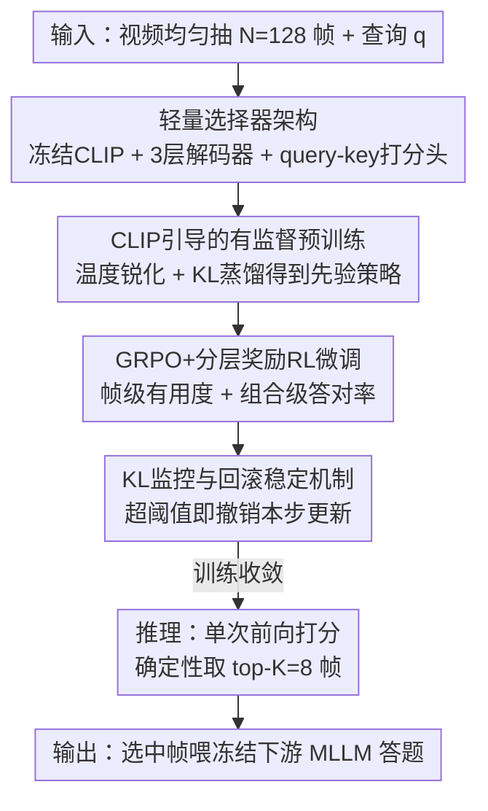

# Efficient Frame Selection for Long Video Understanding via Reinforcement Learning

**会议**: CVPR 2026  
**论文**: [CVF Open Access](https://openaccess.thecvf.com/content/CVPR2026/html/Qin_Efficient_Frame_Selection_for_Long_Video_Understanding_via_Reinforcement_Learning_CVPR_2026_paper.html)  
**代码**: 无  
**领域**: 视频理解 / 多模态VLM  
**关键词**: 关键帧选择, 长视频理解, 强化学习, GRPO, 多模态大模型  

## 一句话总结
针对长视频理解中"均匀采样漏掉关键帧"的问题，本文训练一个轻量、即插即用的查询自适应帧选择器——先用冻结 CLIP 蒸馏出语义相关性先验，再用改进的 GRPO（带帧级+组合级分层奖励）直接以下游 MLLM 答对率为信号微调，在四个中长视频 benchmark 上平均涨 +3.28%、长视频上更明显。

## 研究背景与动机
**领域现状**：多模态大模型（MLLM）在视频问答上进展迅速，但受限于上下文窗口和算力，绝大多数模型在喂给 LLM 之前都用**均匀采样**（uniform sampling）把视频抽成固定几帧。

**现有痛点**：长视频里真正有用的"关键时刻"往往稀疏且分布不均，均匀采样很容易整段漏掉关键证据，留下一堆冗余帧，导致推理出错。为缓解这点，已有工作走了几条路：AKS 给信息密集片段动态多分配采样；FRAG、M-LLM Based Selection 直接拿一个大模型当打分器逐帧评估 query 相关性；FrameVoyager 用预测 loss 监督学一个排序函数。

**核心矛盾**：这些方法各有硬伤。一是**用 MLLM 在线打分代价高、延迟大**；二是它们优化的是**代理目标**（query–frame 相关性、预测 loss），而"看起来相关"不等于"对答题有用"——选一堆高度相似的高相关帧会造成冗余，而真正关键的线索可能单帧看相关性很弱、组合起来才致命。代理信号和真实任务效用之间存在系统性偏差。

**本文目标**：造一个又轻又准的帧选择器，要满足三点——(1) 不靠在线大模型打分，开销极小、即插即用；(2) 优化目标直接对齐下游答题正确率，而非相关性代理；(3) 能在帧组合层面权衡相关性、多样性与时序覆盖。

**核心 idea**：用**两阶段训练**——先用冻结 CLIP 蒸馏出相关性先验做好初始化，再用**改进的 GRPO + 分层奖励**让选择器在真实任务里探索帧组合，直接拿下游 MLLM 答对与否当奖励，学会"选对组合"而不是"选最相关"。

## 方法详解

### 整体框架
给定视频 $V$ 和文本查询 $q$，先均匀抽出 $N=128$ 帧候选池，目标是从中选出紧凑的 $K=8$ 帧（$K\ll N$）喂给冻结的下游 MLLM，使其答题准确率最大化。形式化为**查询条件下的打分-选择问题**：选择器策略 $\pi_\theta$ 给每帧打分并输出一个分布 $P_{\pi_\theta}$，推理时直接取 top-$K$。

整条 pipeline 是"一个轻量选择器 + 两阶段训练 + 稳定化机制"：选择器结构本身极简（冻结 CLIP 特征 + 三层 Transformer 解码器 + query-key 打分头）；训练第一阶段用 CLIP 当老师蒸馏相关性，第二阶段用 RL 直接优化任务效用，期间靠 KL 监控+回滚防止策略崩。下图自上而下对应下面四个关键设计：

### 关键设计

**1. 轻量选择器架构：用冻结 CLIP + 极简解码器 + query-key 打分头，把"打分器"做到几乎零开销**

针对"用 MLLM 在线打分太贵"的痛点，本文把选择器拆成三块且大部分冻结：特征提取器用冻结的 CLIP ViT-L/14，直接拿它强大的跨模态对齐先验，得到查询嵌入 $e_q\in\mathbb{R}^d$ 和各帧嵌入 $e_{f_i}\in\mathbb{R}^d$；上下文模块是一个仅三层、隐维 $d$ 的 Transformer 解码器，让信息在帧之间流动做时序上下文细化。

关键在最后的打分头：作者**没有**用普通全连接层把上下文特征映射成 $N$ 个分数，而是引入一个简化的 **query-key 注意力头**，把打分显式地条件在查询上——查询嵌入经解码器富集图像上下文得到 $Q'\in\mathbb{R}^{d_k}$，而帧表示**不被解码器更新**、直接投影成 $K_i\in\mathbb{R}^{d_k}$，第 $i$ 帧的标量分数为

$$s_i = \frac{Q' K_i^\top}{\sqrt{d_k}}, \qquad P_{\pi_\theta}(i)=\mathrm{softmax}\big((s_j)_{j=1}^N\big)_i$$

这样整个选择器算力占用极小，可即插即用挂到各种 MLLM 前面；而且不同于一次性排序（one-shot ranking），它**显式评估全部 $N$ 帧**，为后续 RL 阶段探索"更好的帧组合"保留了空间。

**2. CLIP 引导的有监督预训练：先蒸出一个"锐化的相关性先验"，给 RL 一个好起点**

纯 RL 训练选择器既不稳又费样本，所以第一阶段先做有监督蒸馏，目的是拿到一个可靠初始化。对每个 query–frame 对算余弦相似度 $c_i=\mathrm{sim}(e_q,e_{f_i})$；由于最终只选少数几帧，作者希望分布更"尖"，于是用温度系数 $\tau<1$ 做锐化：

$$P_{\text{CLIP}}(i)=\frac{\exp(c_i/\tau)}{\sum_{j=1}^N \exp(c_j/\tau)}$$

选择器通过最小化 KL 散度 $L_{ST}=D_{KL}\big(P_{\text{CLIP}}\,\|\,P_{\pi_\theta}\big)$ 去对齐这个锐化分布，得到带可靠语义相关先验的基策略 $\pi_{\text{ref}}$（实验里 $\tau=0.03$、训 54 epoch）。这一步本质是把 CLIP 的跨模态对齐知识"灌"进轻量选择器，避免后面 RL 从随机策略冷启动。

**3. 改进的 GRPO + 分层奖励：把训练信号从"相关性代理"换成"下游答对率"，并在帧级和组合级双重打信用**

这是全文核心。高相关 ≠ 对答题有用：选一堆相似高相关帧会冗余，关键线索可能单帧弱相关、组合才有效，时序推理还要求选出"共同支撑多步推理"的帧。于是第二阶段把选帧建模成**一步 RL**——把每帧当作一个 token，从概率 $p_i=\mathrm{softmax}(s)_i$ 中**无放回采样** $K$ 帧组成子集 $I$，对每个 query 并行采 $G$ 个 rollout，每个子集喂下游 MLLM 得到标量奖励。

但"答对=1、答错=0"这个二值信号太稀疏，且因为动作是一个集合，成败的信用会在帧之间纠缠，容易误罚有用帧、误奖无用帧。本文用**分层奖励**给出更密、更对齐的信号：

- **帧级有用度**：用 Qwen2-VL 给选中集合里每帧打 0–5 的有用度分 $h_i$（5=直接决定答案，0=无用或误导），再做集合内中心化标准化得到帧级优势 $\hat{A}^{(i)}_{\text{frame}}=\big(h_i-\bar h\big)\big/\sqrt{\mathrm{Var}(h)+\epsilon}$，鼓励策略在已选帧里优先抬高最有用的那些。
- **组合级成功**：$G$ 个组合各自拿下游任务的二值奖励 $r^{(g)}_{\text{task}}\in\{0,1\}$，在 $G$ 个 rollout 间做组内标准化得 $\hat{A}^{(g)}_{\text{comb}}=\big(r^{(g)}_{\text{task}}-\bar r\big)\big/\sqrt{\mathrm{Var}(r)+\epsilon}$，把"同一 query 下相对同伴谁更好"的信用均匀传给构成该组合的帧。

两者加权聚合成最终每帧优势 $\hat{A}_i=\lambda_f \hat{A}^{(i)}_{\text{frame}}+\lambda_s \hat{A}^{(i)}_{\text{comb}}$，再代入 GRPO 的裁剪目标

$$J_{RL}(\theta)=\mathbb{E}_i\Big[\min\big(r_i \hat A_i,\ \mathrm{clip}(r_i,1-\epsilon_c,1+\epsilon_c)\hat A_i\big)\Big],\quad r_i=\frac{\pi_{\theta_t}(f_i\mid q,f_{<i})}{\pi_{\theta_{t-1}}(f_i\mid q,f_{<i})}$$

这样既保留组合级的端任务对齐，又用帧级有用度补上密集、结构化的信用分配。⚠️ 帧级/组合级两个优势记号与原文公式编号对应，权重 $\lambda_f,\lambda_s$ 原文未给具体取值，以原文为准。

**4. KL 监控与硬回滚：不加 KL 惩罚项，而是当"运行时监工"，越界就立刻撤销这一步**

常规 GRPO 把 KL 当损失项加进去，但作者认为 KL 惩罚是**事后**的——等策略已经迈了过大的一步、KL 项才来罚，这时策略可能已漂太远，恢复又慢又不稳（实验观察到训练中 KL 会突然"尖峰"飙升，一旦冲上去常把优化带进难以回头的坏轨迹）。

所以本文**故意去掉显式 KL 惩罚项**，改把 KL 当实时监控量：每步算 $D_{KL}(\pi_{\theta_t}\|\pi_{\theta_{t-1}})$，一旦超过阈值 $\delta_{KL}$ 就执行硬回滚——把参数退回 $\theta_t\leftarrow\theta_{t-1}$ 并丢弃这个 batch。这套"监控+回滚"把破坏稳定的梯度即时拦下，又允许在信任域内大胆更新，相比滞后的损失惩罚反应更快。

### 损失函数 / 训练策略
- **Stage 1**（蒸馏）：AdamW，lr $1\times10^{-4}$，batch 64，温度 $\tau=0.03$，训 54 epoch，目标 $L_{ST}=D_{KL}(P_{\text{CLIP}}\|P_{\pi_\theta})$。
- **Stage 2**（RL）：GRPO 风格，lr $1\times10^{-6}$，裁剪 $\epsilon=0.2$，**仅训 1 epoch**；下游打奖励的 MLLM 用 Qwen2-VL。
- 训练数据：从 LLaVA-178K 的 YouTube 子集筛 2–3 分钟视频（够复杂又代表长视频挑战）。硬件：8×NVIDIA L20。
- 推理：均匀抽 $N=128$ 帧，单次前向算分，确定性取 top-$K=8$ 喂下游 MLLM。

## 实验关键数据

### 主实验
四个中长视频 benchmark（LongVideoBench/8min、VideoMME/17min、EgoSchema/3min、MLVU/12min），对每个下游 MLLM 比较"均匀采样 vs 本文选择器"，处理帧数严格一致。所有模型-数据集组合上选择器都涨，**平均 +3.28%**，长视频涨幅更大（MLVU 平均 +6.16%，LongVideoBench 平均 +3.87%；短视频 EgoSchema 平均 +0.99%）。

| 下游 MLLM | 规模 | LongVideoBench | VideoMME | EgoSchema | MLVU |
|--------|------|------|------|------|------|
| LLaVA-NeXT-Video | 7B | 39.7→41.6 | 39.3→40.6 | 38.5→39.2 | 42.9→**47.2** (+4.3) |
| LLaVA-NeXT-Video | 34B | 48.3→49.9 | 48.2→49.6 | 42.5→43.1 | 49.2→**56.8** (+7.6) |
| InternVL2 | 8B | 35.7→40.5 (+4.8) | 34.3→36.5 | 38.4→38.6 | 41.3→47.7 (+6.4) |
| InternVL2 | 40B | 49.2→54.3 | 54.0→56.3 | 42.0→43.6 | 43.9→**51.0** (+7.1) |
| VideoLLaMA3 | 7B | 50.3→55.6 | 55.1→57.3 | 53.5→53.8 | 57.4→64.0 (+6.6) |
| Qwen2-VL | 7B | 51.1→56.5 | 53.1→56.1 | 56.5→58.0 | 52.4→58.9 (+6.5) |

模型越大、长视频上涨幅越明显（如 MLVU 上 LLaVA-NeXT-Video 7B +4.3% vs 34B +7.6%），印证"短视频本身任务相关内容已密集，长视频证据稀疏、选帧更关键"。

**与其他选帧方法对比**（Qwen2-VL-7B / LongVideoBench）：

| 方法 | 准确率(%) | 选帧耗时(s) |
|------|------|------|
| Random | 49.7 | / |
| Uniform | 51.1 | / |
| CLIP-TopK | 55.7 | 3.34 |
| AKS | 55.9 | 7.84 |
| **Ours** | **56.5** | 3.36 |

本文在与 CLIP-TopK 几乎相同的选帧耗时下拿到最高准确率，比 Uniform +5.4%、比强基线 CLIP-TopK +0.8%、比 AKS +0.6% 且快一倍多（3.36s vs 7.84s）。在 VILA-1.5-8B backbone 上对比 SOTA 选择器，LongVideoBench/VideoMME 上涨幅最高（+6.1 / +3.7，vs Q-Frame +4.5 / +3.2）。

### 消融实验
VideoMME / Qwen2-VL backbone：

| 配置 | 准确率(%) | 说明 |
|------|------|------|
| Ours (Full Model) | 56.5 | 完整模型 |
| w/o RL Stage | 55.1 | 只蒸 CLIP 相关性，掉 1.4% |
| w/o Pre-training Stage | 54.8 | 纯 RL 冷启动，掉 1.7% |
| w/o hierarchical reward | 55.6 | 只用组合级奖励，掉 0.9% |
| w/o KL monitor | 55.2 | 去掉监控回滚，掉 1.3% |

不同选帧数 $K$（LongVideoBench）：

| 帧数 $K$ | Qwen2-VL-7B Uniform | Qwen2-VL-7B Selector | LLaVA-NeXT-34B Uniform | LLaVA-NeXT-34B Selector |
|------|------|------|------|------|
| 2 | 46.8 | 52.1 | 45.1 | 49.3 |
| 4 | 49.4 | 54.5 | 47.0 | 50.7 |
| 8 | 51.1 | 56.5 | 48.3 | 49.9 |
| 16 | 52.8 | 55.9 | 50.1 | 50.2 |

### 关键发现
- **预训练阶段贡献最大**：去掉它（纯 RL 冷启动）掉 1.7%，是单项掉点最多的，印证"纯 RL 不稳、需要 CLIP 先验做好初始化"的设计动机。
- **分层奖励确有必要**：只用常规 GRPO 的组合级奖励掉 0.9%，说明帧级有用度提供的密集信用分配能缓解集合动作里的信用纠缠。
- **KL 监控防崩**：训练中确实出现 KL 尖峰，去掉监控回滚从 56.5% 掉到 55.2%；尖峰一旦发生常把优化带进难恢复的坏轨迹。
- **少而精胜过多而杂**：选 2 帧（52.1）就能逼近甚至超过均匀采样 8 帧（51.1），说明"选对帧"比"选更多帧"更重要——这也是长视频场景下选择器价值的最佳注脚。

## 亮点与洞察
- **把"选帧"当 token 采样做一步 RL**：每帧视作一个 token、无放回采子集、并行 $G$ 个 rollout，直接复用 LLM 的 GRPO 机制，工程上优雅，credit assignment 也更稳。
- **奖励从相关性代理换成下游答对率**，并用帧级 LLM 打分（0–5 有用度）+ 组合级答对率两层信号缓解"集合动作信用纠缠"，是把 RLHF 思路迁到视觉选帧的一个干净范式。
- **KL 当监工而非惩罚项**：不少 GRPO/PPO 实现都被 KL 惩罚的滞后性坑过，这里"超阈值即硬回滚"的做法简单粗暴但有效，可迁移到其他不稳的 on-policy 微调。
- **训练成本低得意外**：RL 阶段只训 1 epoch、8 张 L20 就够，选择器本体几乎零参数开销，即插即用属性强。

## 局限与展望
- **训练数据偏窄**：训练只用 LLaVA-178K 中 2–3 分钟的 YouTube 视频，对几十分钟级超长视频、第一人称/专业领域视频的泛化性未充分验证。
- **奖励依赖 Qwen2-VL 打分**：帧级有用度和组合级奖励都靠 Qwen2-VL 生成，⚠️ 若该 reward model 本身有偏，选择器可能继承其偏差；论文未报告换不同 reward model 的鲁棒性。
- **$K$ 固定且确定性 top-K**：推理固定选 8 帧、确定性截断，缺乏按视频/查询难度自适应调整帧数的能力；表 6 也显示 LLaVA-NeXT-34B 在 $K=8$ 反而略低于均匀采样，说明增益对下游模型/帧数组合敏感。
- **权重 $\lambda_f,\lambda_s$ 等关键超参未给具体值**，复现需自行调参。

## 相关工作与启发
- **vs AKS（训练-free 自适应采样）**：AKS 靠规则平衡相关性与时序覆盖、无需训练但选帧慢（7.84s）；本文需训练但选帧快一倍多（3.36s）且准确率更高，且优化目标直接对齐答对率而非启发式覆盖。
- **vs FRAG / M-LLM Based Selection**：它们用大模型在线逐帧打分、开销大且优化的是 query 相关性代理；本文把大模型只用在**训练期**打奖励，推理期是轻量选择器单次前向，且 RL 让它学会"组合级有用"而非单帧相关。
- **vs FrameVoyager / Q-Frame**：FrameVoyager 用预测 loss 监督学排序、仍是代理目标；本文 VILA-1.5-8B backbone 上 LongVideoBench/VideoMME 涨幅超过 Q-Frame，且参数效率更高（表 3 标注 0.425B 选择器 vs MLLM-based 的 1.5B）。

## 评分
- 新颖性: ⭐⭐⭐⭐ 把选帧建成 token 级一步 RL + 帧/组合分层奖励 + KL 监控回滚，组合拳清晰，但各组件多为已有技术的巧妙迁移。
- 实验充分度: ⭐⭐⭐⭐ 6 个下游模型 × 4 benchmark + 4 类消融 + 帧数扫描，覆盖充分；但缺超长视频与 reward model 鲁棒性验证。
- 写作质量: ⭐⭐⭐⭐ 动机-方法-实验链条顺，公式完整；部分超参（$\lambda$）缺值略影响复现。
- 价值: ⭐⭐⭐⭐ 即插即用、低成本、长视频增益明显，实用性强，是长视频 MLLM 预处理的好组件。

<!-- RELATED:START -->

## 相关论文

- [\[CVPR 2026\] Incentivizing Versatile Video Reasoning in MLLMs via Data-Efficient Reinforcement Learning](incentivizing_versatile_video_reasoning_in_mllms_via_data-efficient_reinforcemen.md)
- [\[CVPR 2026\] GIFT: Global Irreplaceability Frame Targeting for Efficient Video Understanding](gift_global_irreplaceability_frame_targeting_for_efficient_video_understanding.md)
- [\[CVPR 2026\] DIvide, then Ground: Adapting Frame Selection to Query Types for Long-Form Video Understanding](divide_then_ground_adapting_frame_selection_to_query_types_for_long-form_video_u.md)
- [\[CVPR 2026\] Thinking with Drafts: Speculative Temporal Reasoning for Efficient Long Video Understanding](thinking_with_drafts_speculative_temporal_reasoning_for_efficient_long_video_und.md)
- [\[CVPR 2026\] Wavelet-based Frame Selection by Detecting Semantic Boundary for Long Video Understanding](wavelet-based_frame_selection_by_detecting_semantic_boundary_for_long_video_unde.md)

<!-- RELATED:END -->
