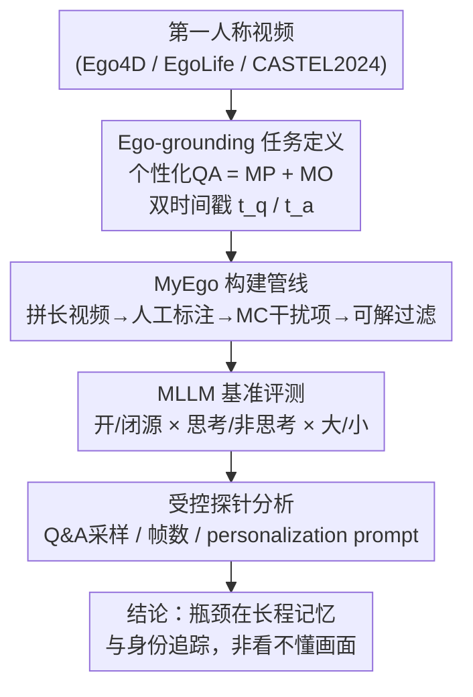

# Ego-Grounding for Personalized Question-Answering in Egocentric Videos

**会议**: CVPR 2026  
**论文**: [CVF Open Access](https://openaccess.thecvf.com/content/CVPR2026/html/Xiao_Ego-Grounding_for_Personalized_Question-Answering_in_Egocentric_Videos_CVPR_2026_paper.html)  
**代码**: 无（论文未提供）  
**领域**: 视频理解 / 多模态VLM  
**关键词**: 自我中心视频, 个性化问答, ego-grounding, VideoQA 基准, 长程记忆

## 一句话总结
本文提出 **MyEgo**——首个针对「个性化自我中心视频问答」的诊断性基准（541 段长视频、5K 道问"我的东西/我的活动/我的过去"的问题），系统检验主流 MLLM 是否能做 **ego-grounding**（理解、记住、追踪"戴相机的人/我"）；结果发现 GPT-5 仅 46% 准确率、落后人类近 40 个点，且放大模型规模和加思维链都救不了，瓶颈在长程记忆与身份追踪。

## 研究背景与动机
**领域现状**：随着智能眼镜等可穿戴设备普及，第一人称（egocentric）视频成为记录个人日常经历的重要媒介。要让 AI 助手帮用户回忆"我看过/做过/碰过什么"，前提是它能做 **ego-grounding**：在"我的"第一人称视频里搞清"我""我的东西""我的活动""我的过去"。现有 MLLM 凭借强视觉推理 + 长上下文看似有希望胜任。

**现有痛点**：自我中心视频里，戴相机的人本身往往只**部分可见**（手、胳膊、自我运动、偶尔的反光），既看不到全脸又没有稳定外观锚点。现有 VideoQA / 自我中心基准（EgoSchema、EgoMemoria、EgoThink 等）测的是通用第一人称理解，没人专门测"个性化指代消解"——区分"我"和旁边的人、在多个相似物体里认出"我用过的那个"。

**核心矛盾**：成功的 ego-grounding 同时需要**空间辨别**（把戴相机者和近旁他人/相似物体分开）和**长程时序推理**（回忆几十秒甚至几分钟前、当下已不可见的交互）。而当前 MLLM 大多一次只处理 8–32 帧，长程整合能力受限；更糟的是它们倾向用短期外观线索而非真正"锚定"身份，一旦真实指代物离开画面就答错。

**本文目标**：不是提新模型，而是构造一个能**专门诊断 ego-grounding 是否成立**的数据集与评测，把失败拆解清楚（是空间分不清，还是记不住"我"和"我的过去"）。

**切入角度**：作者从一个朴素观察出发——人类做这种"那是我的抹布吗"的题轻而易举，但同一道题在指代物**离开画面、且另一人拿着相似物出现后再问**，所有 MLLM 都翻车。这说明问题不在"看懂当前帧"，而在"维持跨时间的身份/物体表征"。

**核心 idea**：把"个性化第一人称指代"显式做成可控的诊断题——每题都绑定 **question moment（提问时刻）** 与 **answer moment（证据出现时刻）** 两个时间戳，并刻意设计需要区分"我 vs 他人""我的物体 vs 相似干扰物"的题，从而把模型在记忆与追踪上的短板暴露出来。

## 方法详解

### 整体框架
这是一篇**基准 + 诊断分析**论文，不提出新模型，"方法"即：① 把个性化自我中心 QA 形式化成可度量的 ego-grounding 任务；② 用一条人工主导的管线构建 MyEgo 数据集；③ 设计三组受控探针，把 MLLM 的失败定位到"长程记忆/关键帧检索"而非"看不懂画面"。整体流向是：定义任务 → 构建数据 → 基准评测一大批 MLLM → 受控分析找瓶颈 → 给出结论。

### 关键设计

**1. Ego-grounding 任务定义：把"个性化第一人称指代"拆成两类可诊断难点**

作者把"自我中心个性化 VideoQA"形式化为：在流式第一人称视频中回答需要**锚定第一人称指代**（"I""my"）的问题。这类题刻意落在两个对当前 MLLM 最致命的维度上：**MP（Multi-Person）**——要把戴相机者"我"和场景里其他人区分开（如"我的抹布"在哪只手、哪只手是我的）；**MO（Multi-Object）**——要在多个**同类、外观相似**的实例里认出"我交互过的那一个"（如把我用过的绿色棋子与他人的红色、未用的蓝色区分开）。这两类难点直接打在前述"空间辨别 + 长程追踪"的痛点上：只有真正把指代物锚定到"我"的轨迹，才答得对。

为了让难度可控、可量化，每道题都标注两个时间戳：**提问时刻 $t_q$** 与**答案证据出现时刻 $t_a$**，且恒有 $t_a \le t_q$。据此把题分成两档——若 $t_q - t_a \le 2\text{s}$ 记为 **Current**（答案就在当前），否则记为 **Previous**（答案在更早的历史里）。数据集里 $t_q$ 与 $t_a$ 的平均间隔约 20 秒，70.6% 的题属于 Previous，这个时间差本身就逼着模型必须回忆并维持稳定的"我"概念。评测输入是从视频起点到 $t_q$、以最高 1 fps 采样的固定帧数（多数模型 32 帧），刻意模拟"流式提问"的真实设定。

**2. MyEgo 构建管线：用人工主导的多步流程造出"逼模型 ego-ground 才答得对"的诊断题**

作者发现单靠 GPT-5/Gemini-2.5 Pro 自动出题不行——模型抓不住"个性化、上下文特定"的微妙之处，于是用一条**人工为主**的管线构建数据（如框架图中 C 节点的四步）。**视频侧**：从 Ego4D、EgoLife、CASTEL2024 三个公开数据集取材，剔除单人视频只留多人场景；EgoLife 原始是 30 秒短片，按录制顺序拼接成约 10 分钟长视频；用混入背景的黑色遮罩抹掉左上角动态时间戳水印；CASTEL2024 含大量无信息片段，裁剪成 6–20 分钟的连续活动片段。最终得到 **541 段、平均 9.2 分钟**的视频（Ego4D 182 / EgoLife 257 / CASTEL2024 102）。**标注侧**：招募并培训 10 名学生按三条原则人工出题——*Egocentric*（必须第一人称口吻）、*Personalized*（内容必须凸显"我"与他人的区别、迫使模型先判断哪个物体/动作属于戴相机者）、*Visual Answer*（答案简短且在视频里可见），同一标注者同时标注 GT 答案与 $t_q$/$t_a$，共得 5,012 道开放式（OE）问题。

为支持更标准化的评测，再把 OE 题增强成多选（MC）：用 Gemini-2.5 Pro 输入"视频+问题+GT"生成 4 个**可在视频中验证存在**的干扰项，优先选择**时序相关**（出现在 $t_q$ 或 $t_a$）或**语境混淆**（如"他人做的动作 vs 我做的"）的干扰；yes/no 题视为 2 选项。关键的**去偏过滤**一步：仿照已有做法，只给视频帧 + 选项（**不给问题**）喂给 Gemini-2.5 Pro 和 GPT-5，两模型都能猜对的题说明"光看选项就能蒙"，将其挑出并人工重做干扰项，确保答对必须真正 ego-ground。最终 5,012 题同时具备 OE 与 MC 形式，MC 中含 953 道 2 选、4,059 道 5 选。

**3. 受控探针分析：三组对照实验把失败精确定位到"记忆/检索"而非"看不懂"**

光报准确率说明不了根因，作者设计三组受控对照。**(a) Q&A moment-aware 采样 vs 均匀采样**：不再均匀采样，而是在 $t_a$ 与 $t_q$ 各自的 $\pm 1.5\text{s}$ 区间内各取 8 帧、拼成 16 帧输入（两区间重叠则合并后均匀取 16 帧）。若只要把关键帧直接喂给模型就大幅涨点，就证明模型不是"看不懂"而是"没采到/记不住"关键证据。**(b) 帧数分析**：把 InternVL3-8B、LLaVA-Video 的输入帧数从 8 扫到 64（均匀采样），以及在 MC 设定下从 $t_q$ 往回以 1 fps 采 1–48 帧（backward sampling），检验"多帧是否一定更好"。**(c) personalization-aware prompting 消融**：对 prompt 做两种系统改动——*Enhanced*（把问题里的"I""my"替换成"the camera wearer('s)"，强提醒"我"指谁）与 *Remove*（彻底去掉个性化线索），测模型对"是否被明确告知要做个性化推理"的敏感度。三组探针共同把结论钉死：模型缺的是长程记忆、时序追踪与精准检索，而非基础视觉理解。

## 实验关键数据

### 主实验
评测覆盖闭源（GPT-5、Gemini-2.5 Pro）与一大批开源 MLLM（Qwen2.5/3-VL、InternVL2.5/3/3.5、LLaVA-OneVision/Video、MiniCPM-V 4.5、LongVA/LongVU、Flash-VStream、Dispider 等），并用 2 名未参与标注的学生在 300 题子集上测人类水平。OE 用 GPT-5 mini 做二元判分（与人类一致率 94%），同时给 0–5 的 match Score；MC 报准确率。

| 模型 | MC-2 | MC-5 | OE-Cur. | OE-Pre. | OE-Avg. (Acc) |
|------|------|------|---------|---------|---------------|
| 人类 | 95.1 | 92.1 | 84.0 | 85.0 | **84.7** |
| GPT-5（闭源） | 66.4 | 53.7 | 51.1 | 44.0 | **46.1** |
| Gemini-2.5 Pro（闭源） | 61.8 | 45.5 | 42.4 | 40.3 | 40.9 |
| Qwen3-VL-8B-Instruct | 55.0 | 36.6 | 37.4 | 36.0 | 36.4（开源 OE 最佳） |
| InternVL3-8B | 54.5 | 38.4 | 34.7 | 34.1 | 34.3（开源 MC 较强） |
| LLaVA-Video | 54.8 | 36.0 | 37.4 | 33.9 | 35.0 |
| InternVL2.5-8B | 53.1 | 36.6 | 27.2 | 23.5 | 24.5 |

关键观察：① 所有模型落后人类 33%~55%，GPT-5 综合最强但没有任何模型在所有类别都领先；② 多数模型在 2 选 MC 上只到约 50%（接近随机），因为干扰项被刻意做成"不真正锚定提问者就会被误导"；③ InternVL 系列从 MC 转 OE 大幅掉点，暗示其 MC 成绩多靠"选项捷径"而非忠实多模态推理；④ **Previous 题普遍比 Current 难**，印证追踪/记忆是瓶颈。

### 消融与受控分析

**Q&A moment-aware 采样（仅 16 帧 vs 均匀采样）显著涨点，且 Previous 题涨得更猛：**

| 模型 | 采样 | Acc@Cur. | Acc@Pre. |
|------|------|----------|----------|
| Gemini-2.5 Pro | 均匀 → Q&A | 42.4 → 49.3 (↑6.9) | 40.3 → 51.5 (**↑11.2**) |
| Qwen2.5-VL-7B | 均匀 → Q&A | 37.7 → 43.4 (↑5.7) | 33.2 → 42.4 (**↑9.2**) |
| Qwen3-VL-8B-Think | 均匀 → Q&A | 38.4 → 41.3 (↑2.9) | 32.0 → 41.1 (↑9.1) |
| LLaVA-Video | 均匀 → Q&A | 36.3 → 37.7 (↑1.4) | 33.7 → 41.6 (↑7.9) |

**personalization prompt 消融（Enhanced 提醒"我"指谁 / Remove 去掉个性化线索）：**

| 模型 | OE（Orig→Enh→Rem） | MC（Orig→Enh→Rem） |
|------|---------------------|---------------------|
| InternVL3.5-8B | 33.1 → 33.2 → 31.7 (↓1.4) | 39.5 → 41.1 → 38.5 |
| LLaVA-Video | 34.5 → 35.9 → 35.3 | 37.5 → 38.1 → 37.5 |

### 关键发现
- **更多帧 ≠ 更好**：均匀采样下 InternVL3-8B 在 16 帧达峰、之后略降；LongVA/LongVU 用 128 帧相比默认 32 帧在 Current/Previous 上都没提升。作者推测多帧引入噪声，反而污染本就只部分可见的 ego 线索。MC 的 backward 采样里，1→8 帧涨幅最大（+6.8%/+7.1%），之后进入平台期——**信息相关性比数量更关键**。
- **"思考"与"放大规模"都救不了**：Qwen3-VL-8B-Thinking、InternVL3.5-8B-Thinking 相比非思考版几乎无增益，与"长 CoT 在通用视频任务有帮助"的已有结论冲突；同族里 4B 小模型甚至能持平/超过大模型，说明通用规模化解决不了 MyEgo。
- **准确率随时间衰减**：均匀采样下，第 1 分钟内提问准确率最高，8 分钟后最低；而 Q&A moment 采样在每个时间分箱都稳定超过均匀采样，进一步坐实"关键帧 grounding"的重要性。
- **Enhanced prompt 整体小幅有益、Remove 普遍掉点**：模型对 prompt 改动不极端敏感，但"明确提醒 I 指戴相机者"通常有帮助，去掉个性化线索则普遍降分（InternVL3.5-8B 掉 1.4–1.6%）。

## 亮点与洞察
- **把抽象的"理解我"做成可量化诊断**：双时间戳 $t_q$/$t_a$ + Current/Previous 二分，是本文最巧的设计——它把"看懂当前帧"和"记住过去的我"两种能力解耦，让失败可定位，这套时间戳协议可迁移到任何需要考察长程记忆的流式 VideoQA。
- **"不给问题、只看选项+帧"的去偏过滤**很值得借鉴：用两个强模型当"作弊探测器"，凡是不看问题也能蒙对的题就重做干扰项，从数据侧逼出 ego-grounding 的真实难度，避免基准被选项捷径刷分。
- **最"啊哈"的反直觉点**：思维链和模型规模在这里集体失效，且更多帧反而可能更差——提示"个性化第一人称理解"是一类与通用视频理解**正交**的能力，靠堆算力/堆帧/堆推理都补不上，必须显式建模记忆与身份锚定。

## 局限与展望
- **只诊断、不解决**：本文是基准 + 分析，没给出能真正做好 ego-grounding 的模型；Q&A moment 采样虽涨点，但它依赖"已知答案时刻"这一 oracle 信息，现实里恰恰需要模型自己去检索关键时刻。
- **评测依赖 LLM 评判**：OE 用 GPT-5 mini 判分（一致率 94% 已不错，但仍有 6% 偏差），可能对措辞不同但语义正确的答案有系统性误差。⚠️ 具体偏差分布以原文 Supplementary 为准。
- **MC 干扰项由 Gemini 生成**：尽管有人工过滤与重做，自动生成的干扰项仍可能引入风格偏差；2 选题多数模型仅约随机水平，也说明 MC 难度分布不均。
- **改进方向**：作者明确指向短期"更强长程记忆"、长期"真正的个性化推理"，以及"更智能的关键时刻检测"（替代 oracle 采样）——把"该看哪一段"做成可学习模块，是最直接的后续。

## 相关工作与启发
- **vs EgoSchema / EgoMemoria / EgoThink**：它们测通用第一人称理解，MyEgo 专测"区分我 vs 他人、我的物体 vs 相似干扰物"的个性化指代，难度维度正交。
- **vs QAEgo4D / EgoLifeQA**：同样强调情景记忆，但它们不要求把回忆到的时刻**链接回当前场景去 ego-ground 戴相机者**，MyEgo 正是补这一环。
- **vs EgoTextVQA / EgoBlind**：同属自我中心助手方向，但分别聚焦场景文字、盲人辅助；MyEgo 聚焦长视频流中的个性化 ego-grounding。
- **vs 个性化 VLM（靠额外视觉范例/文本画像适配用户）**：本文不引入外部用户画像，而是要求模型**直接从过去的自我中心视频本身**做个性化，这需要前人较少探索的视觉记忆与身份追踪。

## 评分
- 新颖性: ⭐⭐⭐⭐⭐ 首个把"个性化 ego-grounding"做成可诊断基准，MP/MO + 双时间戳的设计切口很准。
- 实验充分度: ⭐⭐⭐⭐⭐ 覆盖开/闭源、思考/非思考、大/小规模 + 人类基线，三组受控探针把失败根因钉得很实。
- 写作质量: ⭐⭐⭐⭐ 动机与失败案例讲得清楚；部分分析细节散在 Supplementary，正文略需跳读。
- 价值: ⭐⭐⭐⭐⭐ 暴露了通用 MLLM 在第一人称长程记忆上的硬伤，为可穿戴个性化助手指明了明确研究方向。

<!-- RELATED:START -->

## 相关论文

- [\[CVPR 2026\] Do You See What I Am Pointing At? Gesture-Based Egocentric Video Question Answering](do_you_see_what_i_am_pointing_at_gesture-based_egocentric_video_question_answeri.md)
- [\[CVPR 2026\] Minerva-Ego: Spatiotemporal Hints for Egocentric Video Understanding](minerva-ego_spatiotemporal_hints_for_egocentric_video_understanding.md)
- [\[CVPR 2026\] HERBench: A Benchmark for Multi-Evidence Integration in Video Question Answering](herbench_a_benchmark_for_multi-evidence_integration_in_video_question_answering.md)
- [\[CVPR 2026\] MovieRecapsQA: A Multimodal Open-Ended Video Question-Answering Benchmark](movierecapsqa_a_multimodal_open-ended_video_question-answering_benchmark.md)
- [\[CVPR 2026\] Mistake Attribution: Fine-Grained Mistake Understanding in Egocentric Videos](mistake_attribution_fine-grained_mistake_understanding_in_egocentric_videos.md)

<!-- RELATED:END -->
