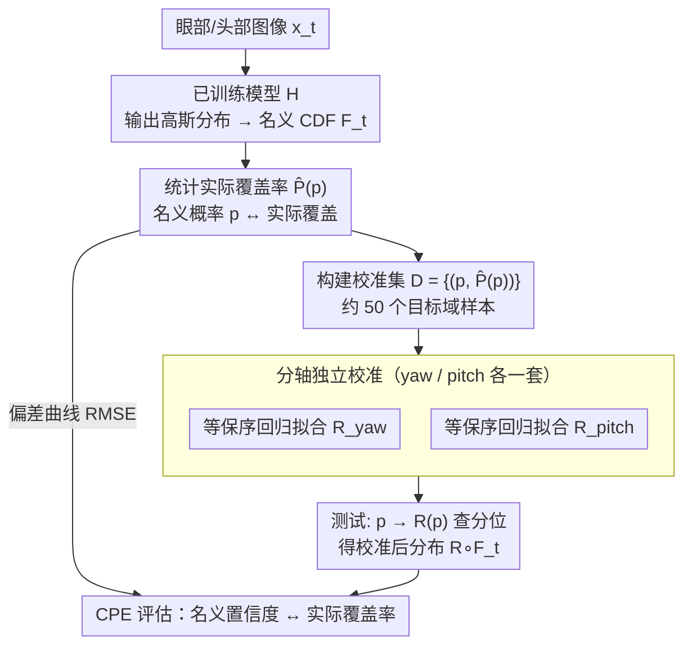

# Enhancing Accuracy of Uncertainty Estimation in Appearance-based Gaze Tracking with Probabilistic Evaluation and Calibration

**会议**: CVPR 2026  
**arXiv**: [2501.14894](https://arxiv.org/abs/2501.14894)  
**代码**: 有（项目主页提供）  
**领域**: 视频理解  
**关键词**: 视线追踪, 不确定性估计, 后验校准, 域偏移, 覆盖概率误差

## 一句话总结
提出一种数据高效的后验校准方法，通过等保序回归将不确定性感知视线追踪模型的预测分布与真实观测分布对齐，并引入 Coverage Probability Error (CPE) 指标替代不可靠的误差-不确定性相关性(EUC)来评估不确定性质量。

## 研究背景与动机
基于外观的视线追踪（appearance-based gaze tracking）通过深度学习直接从眼部/面部图像预测注视角度，是驾驶监控等安全关键应用的核心技术。仅给出点估计不够，系统需要知道"这次估计有多可靠"，因此不确定性估计至关重要。

**现有痛点**：

**域偏移导致不确定性失准**：现有不确定性感知模型（heteroskedastic regression、quantile regression 等）的不确定性估计仅在训练域内有效；当测试数据的光照、相机、受试者等发生变化时，预测的方差数值变得不可靠——模型可能对错误预测给出过高置信度

**评价指标有缺陷**：广泛使用的 EUC（Error-Uncertainty Correlation）假设不确定性与预测误差相关，但这是虚假相关——不确定性来源于 aleatoric 和 epistemic 因素而非预测误差本身，因此 EUC 无法可靠评估不确定性质量

**参数级适应代价高**：meta-learning 或 transfer learning 可以纠正不确定性，但需要大量目标域数据重新学习条件分布

**核心 idea**：不修改模型参数，用后验输出校准（post-hoc calibration）——学一个单调映射函数将名义概率映射到实际覆盖概率，使校准后的分布逼近真实分布。仅需约 50 个校准样本。

## 方法详解

### 整体框架
论文要解决的是一个很实际的落地问题：一个已经训练好的不确定性感知视线追踪模型，换到新场景（不同光照、相机、受试者）后，它给出的方差还可不可信？作者不去碰模型参数，而是在模型输出端挂一个轻量的"翻译层"。具体地，已训练模型 $H$ 对每张输入图像 $x_t$ 输出一个高斯分布——均值是预测的注视角度，方差是它自报的不确定性，对应一条累积分布函数（CDF）$F_t$。问题在于这条 CDF 是名义上的、在新域里往往偏了。校准流程在 $F_t$ 之后串一个单调映射 $R$，把名义概率换成实际覆盖概率，得到校准后的分布 $R \circ F_t$。整套方法只需要约 50 个目标域样本、无需任何梯度训练，因此能即插即用地贴到任意输出概率分布的视线模型上。

### 关键设计

**1. Coverage Probability Error（CPE）：用一个直接度量分布匹配度的指标取代不可靠的 EUC**

社区长期用 EUC（误差-不确定性相关性）来评判不确定性的好坏，但这其实是个虚假相关——不确定性来自 aleatoric 和 epistemic 因素，本就不该和单次预测误差强绑定，所以 EUC 高低说明不了校准得好不好。作者改为直接问一个更本质的问题：模型声称的"名义置信度"和"实际覆盖率"对得上吗？对每个名义概率 $p$，统计真实标签落在对应分位数以下的实际比例 $\hat{P}(p)$，理想校准应当处处满足 $\hat{P}(p)=p$。CPE 就是这条偏差曲线在整个概率区间上的 RMSE：

$$CPE = \sqrt{\frac{1}{n}\sum_{i=0}^{n} p_{err}\left(\frac{i}{n}\right)^2}, \quad p_{err}(p) = \left|p - \hat{P}(p)\right|$$

这本质上是 proper scoring rule 的思路：直接拿预测分布去比观测分布，而不绕道误差。直观地说，$CPE=0.05$ 意味着一个名义 80% 的置信区间实际大概覆盖 70%–90%，偏差被压在 5 个百分点量级。

**2. 等保序回归校准器：用非参数单调映射捕捉新域里的非线性失准**

有了 CPE 暴露的失准，怎么修？关键约束是校准映射必须单调（否则会破坏 CDF 的有序性），且不能对失准形态做过强假设——temperature scaling 这类方法默认线性/仿射的修正关系，在域偏移造成的非线性失准面前并不够用。作者收集校准集 $D=\{(p_i,\hat{P}(p_i))\}$，用等保序回归（isotonic regression）拟合一个单调递增映射 $R:[0,1]\to[0,1]$，天然满足 $R(p_i)\le R(p_{i+1})$。测试时不再用名义概率 $p$ 取分位数，而是先映射成 $\tilde p=R(p)$ 再去查，使校准后落入比例趋近名义值：

$$\frac{\sum_{t=1}^{T} I\{\theta_t \leq F_t^{-1}(R(p))\}}{T} \to p$$

它之所以有效，一是非参数形式能贴合任意非线性失准曲线，二是等保序回归本身就保证了单调性这一硬约束，三是拟合只是一行 sklearn 调用、约 50 个样本就够，数据效率远高于 meta-learning 那种要大量目标域数据重学条件分布的路线，四是全程不动原模型参数，对已上线的系统极友好。

**3. 分轴独立校准：让 yaw 和 pitch 各修各的**

注视角度的水平（yaw）和垂直（pitch）两个分量在新域里的失准程度往往不一样——比如水平方向更受头部偏转影响，两轴的方差偏移并不同步。如果用一条共享的映射去校准，会被迫在两轴之间折中。作者干脆为 yaw 和 pitch 各拟合一个独立的 $R$，让每个轴的校准后分布分别去逼近自己那一维的真实观测分布，匹配得更精细。

### 损失函数 / 训练策略
- 基础模型使用 heteroskedastic NLL loss 训练：$NLL_t = \frac{1}{2}\ln(\hat{\sigma}_t^2) + \frac{l_{n,t}}{2\hat{\sigma}_t^2}$，其中 $l_{n,t}$ 为 smooth L1 loss
- 校准器无需梯度训练，仅用 isotonic regression 拟合（sklearn 一行代码）
- ResNet-18 和 ResNet-50 两种 backbone

## 实验关键数据

### 主实验

| 测试场景 | 训练集→测试集 | Backbone | CPE (未校准) | CPE (校准后) | 改善幅度 | 角度误差 (未校准) | 角度误差 (校准后) |
|----------|-------------|----------|-------------|-------------|---------|-----------------|-----------------|
| 跨被试 | MPII→MPII | ResNet18 | 23.17% | 5.18% | ↓78% | 5.77° | 5.09° (↓12%) |
| 跨被试 | RTGene→RTGene | ResNet18 | 19.60% | 5.26% | ↓73% | 12.36° | 10.55° (↓15%) |
| 跨数据集 | MPII→RTGene | ResNet18 | 20.60% | 4.75% | ↓77% | 13.71° | 10.12° (↓26%) |
| 跨数据集 | RTGene→MPII | ResNet18 | 27.21% | 4.84% | ↓82% | 18.46° | 14.50° (↓21%) |
| 跨数据集 | MPII→RTGene | ResNet50 | 20.10% | 4.63% | ↓77% | 13.89° | 9.50° (↓32%) |

所有场景 CPE 改善均超 70%，统计显著（Mann-Whitney U 检验 p<0.05）。

### 消融实验

| 校准样本数 | CPE (%) | 趋势说明 |
|-----------|---------|---------|
| 0 (未校准) | ~40% | 基线 |
| 10 | ~15% | 大幅改善 |
| 20 | ~10% | 持续改善 |
| 50 | ~5% | 接近饱和 |
| 100 | ~5% | 几乎无进一步改善 |

| 95% CI 覆盖率 | 分位回归 | 未校准模型 | 校准后模型 | 理想值 |
|---------------|---------|-----------|-----------|-------|
| Case 1 | 40.5% | 41.1% | **88.0%** | 95% |
| Case 5 | 34.3% | 47.8% | **86.7%** | 95% |
| Case 8 | 16.4% | 46.2% | **88.6%** | 95% |

### 关键发现
- CPE 从 8-45% 范围一致降至 ~5%，稳定性极强
- 仅需 50 个校准样本即达饱和，数据效率远高于 meta-learning 等方法
- 校准还带来副产品——角度误差降低 7-32%，因为校准后的中位数比原始均值更鲁棒
- EUC 在校准前后几乎不变（始终 ~0.1-0.26），完全无法反映校准带来的真实改善，进一步证明 EUC 是不可靠指标

## 亮点与洞察
- 精准指出了视线追踪领域长期忽视的问题：不确定性估计在域偏移下严重失准，而社区一直在用有缺陷的 EUC 评价
- CPE 是一个通用的不确定性评估指标，不限于视线追踪领域
- 后验校准方法极度简洁（isotonic regression + ~50 样本），即插即用，不修改原模型
- 实验设计非常系统：4 种域偏移场景 × 2 种 backbone × 3 折交叉验证

## 局限与展望
- 校准假设校准集和测试集来自相同分布，当域偏移持续变化时（如从室内到室外）可能需要在线更新校准器
- 仅在 ResNet-18/50 + 高斯分布假设的模型上验证，未测试更复杂的模型架构（如 Transformer）或非参数分布
- MPIIGaze 和 RTGene 都是相对受控的数据集，更大域偏移（如极端光照、不同种族）的表现未知
- 校准器本身不提供不确定性估计，无法得知校准的可靠程度
- 未与贝叶斯神经网络、MC Dropout 等方法对比

## 与相关工作的对比
- **Platt Scaling / Temperature Scaling**：这些经典校准方法针对分类任务设计，假设 logit 到概率的映射是线性/仿射的。本文的 isotonic regression 校准器是非参数化的，对回归任务的非线性失准更具表达力，且不需要验证集上的梯度优化
- **Quantile Regression**：分位回归直接学习条件分位数，理论上可以避免分布假设。但实验显示分位回归在域偏移下同样严重失准（95% CI 覆盖率仅 16-40%），表明其学到的分位数也是域相关的。本文的后验校准方法可以叠加在分位回归之上进一步改善
- **MC Dropout / Deep Ensembles**：这些 epistemic 不确定性估计方法需要多次前向传播或训练多个模型，推理成本高。本文的方法仅需单次前向传播 + 后处理查表，实际部署代价几乎为零
- **Meta-learning 域适应**：如 FADA、MAML-based 方法可以在目标域微调不确定性估计，但需要较大的目标域标注数据和额外训练。本文仅需 ~50 个样本且无需梯度更新

## 启发与关联
- **CPE 指标的通用性**：CPE 不依赖于具体任务，可以直接用于评估任何输出概率分布的预测模型（如姿态估计、深度估计、天气预报）的不确定性质量。可以考虑在医学图像分割的不确定性评估中引入 CPE
- **后验校准的范式价值**："不修改模型，只修正输出分布" 这一思路对部署中的模型非常友好——模型已经上线，但发现在新场景下不确定性不准，只需收集少量新场景数据做校准即可
- **对视线追踪下游应用的影响**：校准后的不确定性可以用于驾驶场景中的注意力分配决策——当视线估计不确定性高时自动切换到更保守的驾驶策略

## 评分
- 新颖性: ⭐⭐⭐⭐ CPE 指标和校准方法思路清晰，但技术贡献主要在组合而非开创
- 实验充分度: ⭐⭐⭐⭐⭐ 4 种域偏移场景+2 种backbone+交叉验证+样本量消融+case study，非常系统
- 写作质量: ⭐⭐⭐⭐ 逻辑清晰，图表直观，但部分符号略显冗余
- 价值: ⭐⭐⭐⭐ 方法实用性极强，CPE 指标对整个不确定性估计领域有参考价值

<!-- RELATED:START -->

## 相关论文

- [\[CVPR 2026\] U2Flow: Uncertainty-Aware Unsupervised Optical Flow Estimation](u2flow_uncertainty_aware_unsupervised_optical_flow_estimation.md)
- [\[CVPR 2026\] Dual-level Adaptation for Multi-Object Tracking: Building Test-Time Calibration from Experience and Intuition](tcei_test_time_calibration_experience_intuition_mot.md)
- [\[CVPR 2026\] StreamGaze: Gaze-Guided Temporal Reasoning and Proactive Understanding in Streaming Videos](streamgaze_gaze-guided_temporal_reasoning_and_proactive_understanding_in_streami.md)
- [\[CVPR 2026\] VirtueBench: Evaluating Trustworthiness under Uncertainty in Long Video Understanding](virtuebench_evaluating_trustworthiness_under_uncertainty_in_long_video_understan.md)
- [\[ECCV 2024\] SLAck: Semantic, Location, and Appearance Aware Open-Vocabulary Tracking](../../ECCV2024/video_understanding/slack_semantic_location_and_appearance_aware_open-vocabulary_tracking.md)

<!-- RELATED:END -->
