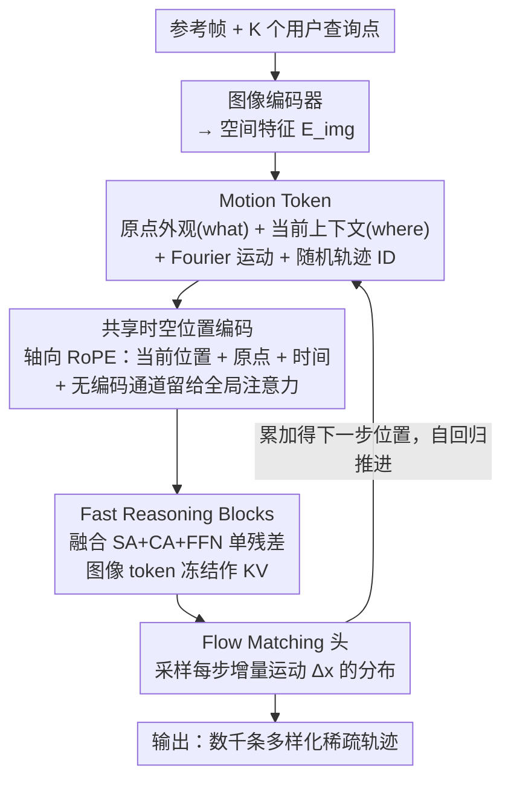

# Envisioning the Future, One Step at a Time

**会议**: CVPR 2026  
**arXiv**: [2604.09527](https://arxiv.org/abs/2604.09527)  
**代码**: [http://compvis.github.io/myriad](http://compvis.github.io/myriad)  
**领域**: 视频理解/运动预测  
**关键词**: 开放集运动预测, 稀疏轨迹, 自回归扩散模型, 未来预测, 世界模型

## 一句话总结

本文将开放集未来场景动态预测建模为稀疏点轨迹的逐步推理，通过自回归扩散模型实现从单张图像快速生成数千种多样化未来假设，速度比稠密模型快数个数量级。

## 研究背景与动机

**领域现状**：大多数未来预测方法依赖密集视频或潜空间预测，将大量容量消耗在外观而非底层运动轨迹上，导致大规模未来假设探索成本极高。

**现有痛点**：(1) 稠密视频生成方法付出"视觉税"——必须渲染每个像素才能推理运动；(2) 单步预测方法无法处理多接触长时序场景；(3) 物理引擎方法无法泛化到开放集运动。

**核心矛盾**：真实世界的动态高度复杂和随机——需要考虑大量可能的未来，但稠密预测使这种探索在计算上不可行。

**本文目标**：在避免视觉税的前提下，实现开放集、逐步、可大规模采样的运动预测。

**切入角度**：类比人类认知——我们不"画"未来的图片，而是追踪重要的变化。利用稀疏性使预见未来成为可能。

**核心idea**：将运动预测建模为用户定义的稀疏点轨迹上的逐步自回归扩散过程。

## 方法详解

### 整体框架

这篇论文想做的事很反直觉：不去"画"未来的图像，而是只追踪画面里少数几个点会往哪走。给定一张参考帧 $\mathcal{I}_0$ 和用户指定的 $K$ 个可见查询点，模型自回归地一步步吐出每个时间步的增量运动 $\Delta x_t^{(i)}$，把"预测未来"变成在稀疏点轨迹上的逐步推理。每一步本身是一个小的条件扩散模型，只负责预测一段局部、短程、相对好猜的位移；长时序的复杂动态则由这些短步骤串接而成。

形式上，模型把联合分布沿时间和轨迹两个维度做因果分解：

$$p_\theta(\mathbf{x}_{1:T}\mid \mathbf{x}_0, \mathcal{I}_0) = \prod_t \prod_i p_\theta\!\left(x_t^{(i)} \mid \mathbf{x}_t^{(<i)}, \mathbf{x}_{<t}, \mathcal{I}_0\right)$$

也就是说，第 $i$ 条轨迹在时刻 $t$ 的位置，既看自己过去的历史，也看同一时刻已经生成的其他轨迹。直观上可以这样想：从单帧出发，给 30 个查询点各分配一个 motion token，模型一拍一拍地往前推，每拍都把每个点挪一小步；想要不同的未来，只需换一组扩散噪声重新采样一遍，就能在几乎不增加渲染成本的情况下铺出成千上万条不同的未来假设。

### 关键设计

**1. Motion Token：让每个点同时知道"自己是什么"和"现在在哪"**

自回归推理的第一个难点是：每个 (时间, 轨迹) 对要喂给 Transformer 的表征，必须既包含被追踪物体的身份，又包含它当前的处境，否则模型无从判断下一步该往哪挪。本文为此把三路信息融进一个 token：在原始位置 $x_0^{(i)}$ 采样的外观特征回答"这是什么"，在当前位置 $x_t^{(i)}$ 采样的局部上下文特征回答"它现在在哪、周围有什么"，再加上对当前位移 $\Delta x_t^{(i)}$ 做 Fourier 编码的运动信息。双位置采样是关键——只看原始外观会丢失点已经移动到哪里的事实，只看当前上下文又认不出目标本身。此外，每条轨迹还带一个随机方向的轨迹标识符 $id_{traj}^{(i)} \sim \mathcal{U}(\mathbb{S}^{d-1})$（单位球面上均匀采样的向量），用来在多点联合建模时区分不同轨迹。用随机方向而非固定整数索引，是为了不让模型去记"第 3 号点"这种死板编号，从而能无缝扩展到任意数量的查询点 $K$。

**2. 共享时空位置编码：让 motion token 和图像 token 站在同一套坐标系里**

Motion token 和图像 token 描述的是同一个画面，本文给两者套用**同一套**基于轴向 RoPE 的位置编码，而不是各编各的。每个 motion token 同时编码三处坐标——当前位置 $x_t^{(i)}$、原点 $x_0^{(i)}$、以及时间 $t$；图像 token 则把 $t=0$ 的位置同时填进这两个 2D 槽位。这套设计和 Motion Token 里的双位置采样是一体两面：做注意力时，motion token 既能顺着**原点坐标**去对齐「它是什么」(what) 的语义特征、又能顺着**当前坐标**去对齐「它现在周围有什么」(where) 的局部上下文。此外还专门预留出一段**不加任何位置编码**的通道，让模型保有一条做全局(语义)注意力的通路，不被局部坐标完全绑死。

**3. Fast Reasoning Blocks：把自回归推理的 kernel launch 砍下来**

自回归一拍一拍地推，最怕的就是每一步都慢——而传统 Transformer 层里自注意力、交叉注意力、FFN 各自一组算子，反复的 kernel launch 在逐步解码时累积成主要瓶颈。本文把这三者并到一个残差里同时算：

$$\mathbf{h} \leftarrow \mathbf{h} + SA(\mathbf{h}) + CA(\mathbf{h}, \mathbf{h}_{cross}) + FFN(\mathbf{h})$$

它们共享同一份预归一化、用融合投影一次算出多路的 query/key/value。配合上图像 token 全程冻结（只作为 cross-attention 的 key-value，不参与更新），motion token 则因果地同时 attend 自身历史和图像两条流，使得每步要启动的 kernel 数量大幅下降，采样速度也因此比稠密视频模型快了数个数量级。

**4. Flow Matching 参数化：让每一步的运动保留多种可能**

未来是随机的，同一个点下一步可能往左也可能往右；如果用确定性回归去拟合，模型会把这些可能性平均成一个"谁都不像"的中间值（mode averaging）。本文改用条件 Flow Matching 来建模每一步增量运动 $\Delta x_t^{(i)}$ 的分布，天然保留多模态性。更妙的是，因为每一步都是独立的一次去噪采样，长时序预测中的不确定性会随着步数自然累积、逐步张开——这正符合"越往后看越说不准"的物理直觉，而不是人为加噪声硬凑出来的发散。

### 损失函数 / 训练策略

在多样化的野外视频上训练，监督信号来自 Flow Matching 的标准条件概率流匹配损失。推理时用 KV 缓存复用历史 token 的注意力计算，进一步加速自回归解码。

## 实验关键数据

### 主实验

| 方法类型 | 预测精度 | 采样速度 | 多样性 |
|---------|---------|---------|--------|
| 稠密视频模型 | 高 | 极慢 | 低（成本限制） |
| 物理引擎方法 | 高（域内） | 中 | 低（域限制） |
| 本文方法 | 相当/更优 | 快数个数量级 | 高（数千假设） |

### 消融实验

| 配置 | 关键指标 | 说明 |
|------|---------|------|
| 无轨迹ID | 性能显著下降 | 多轨迹设置必需 |
| 无Fast Reasoning | 速度大幅下降 | 融合块关键 |
| 单步预测 | 长时序退化 | 逐步推理必要 |
| 完整模型 | 最优 | 各组件协同 |

### 关键发现

- OWM基准上精度匹配或超越稠密模型，同时采样速度快数个数量级
- 随机轨迹ID对多轨迹建模至关重要——固定ID导致模型记忆索引而非学习动态
- 逐步推理使长时序预测中的不确定性自然增长，符合物理直觉

## 亮点与洞察

- **"不画世界，追踪运动"的哲学**：完全避免视觉税，将计算集中在真正重要的运动动态上
- **Fast Reasoning Blocks的工程创新**：融合投影+冻结图像token+前缀注意力的组合显著提升了吞吐量
- **OWM基准的引入**：为开放集运动预测提供了标准化的评估框架

## 局限与展望

- 稀疏点轨迹无法捕捉形变、旋转等连续体运动
- 自回归方式在极长时序上仍会累积误差
- 运动预测与场景理解之间的gap有待弥合

## 相关工作与启发

- **vs 视频世界模型**: 它们付出巨大的视觉税来预测每个像素，本文证明稀疏轨迹足以捕捉运动本质
- **vs 物理引擎方法**: 物理引擎限于闭集域，本文在开放集上通过数据驱动学习实现泛化

## 评分

- 新颖性: ⭐⭐⭐⭐⭐ 稀疏轨迹+逐步自回归扩散的范式转变
- 实验充分度: ⭐⭐⭐⭐ OWM基准+多场景验证
- 写作质量: ⭐⭐⭐⭐⭐ 动机阐述精彩，类比深刻
- 价值: ⭐⭐⭐⭐⭐ 为未来预测开辟了高效且可扩展的新范式

<!-- RELATED:START -->

## 相关论文

- [\[CVPR 2026\] One-Shot Flow, Any-Time Frame: A Bidirectional Warping Framework for Event-Based Video Frame Interpolation](one-shot_flow_any-time_frame_a_bidirectional_warping_framework_for_event-based_v.md)
- [\[CVPR 2026\] Your One-Stop Solution for AI-Generated Video Detection](your_one-stop_solution_for_ai-generated_video_detection.md)
- [\[CVPR 2026\] StreamRAG: Enhancing Real-Time Video Understanding with Retrieval Augmentation](streamrag_enhancing_real-time_video_understanding_with_retrieval_augmentation.md)
- [\[CVPR 2026\] From Contrast to Consistency: Rethinking Event-based Continuous-Time Optical Flow Estimation](from_contrast_to_consistency_rethinking_event-based_continuous-time_optical_flow.md)
- [\[CVPR 2026\] Bootstrapping Video Semantic Segmentation Model via Distillation-assisted Test-Time Adaptation](bootstrapping_video_semantic_segmentation_model_via_distillation-assisted_test-t.md)

<!-- RELATED:END -->
