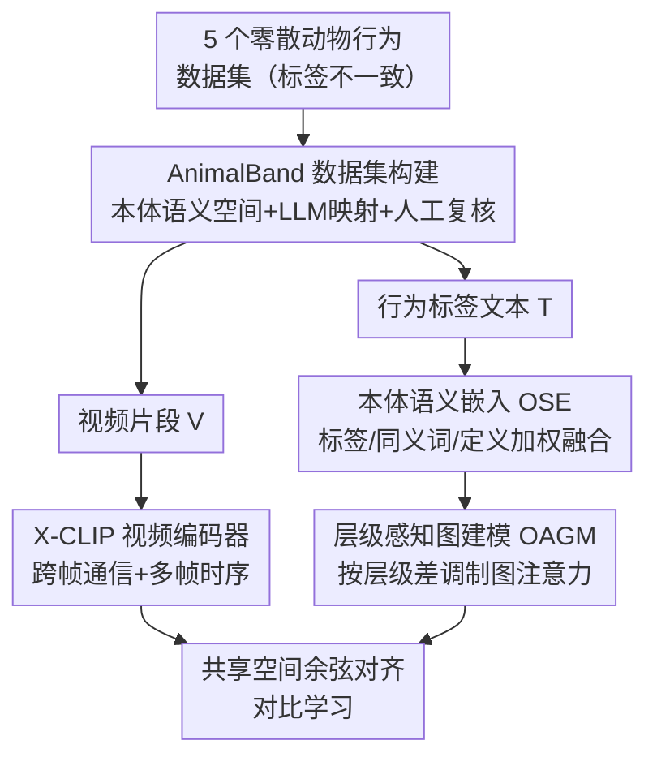

# EthoCLIP: Ontology-Enhanced Video-Language Pretraining for Animal Behavior Understanding

**会议**: CVPR 2026  
**论文**: [CVF Open Access](https://openaccess.thecvf.com/content/CVPR2026/html/Jing_EthoCLIP_Ontology-Enhanced_Video-Language_Pretraining_for_Animal_Behavior_Understanding_CVPR_2026_paper.html)  
**代码**: https://github.com/PRIS-CV/AnimalBand （有）  
**领域**: 视频理解  
**关键词**: 动物行为理解, 视频-语言对比学习, 本体知识, 层级图注意力, 数据稀缺  

## 一句话总结
针对动物行为视频"数据极度稀缺"的痛点，本文把专家构建的神经行为本体（NBO）当作归纳偏置注入 CLIP 式视频-语言对比学习：先用本体统一标注口径构建 7.4 万条视频的 AnimalBand 数据集，再用本体语义嵌入 + 层级感知图注意力把行为标签之间的"父子/同义"关系显式编码进文本端，从而在迁移与分类上显著超过传统骨干和通用 VLM，且只用 40%–60% 数据就能逼近全量效果。

## 研究背景与动机
**领域现状**：通用视觉-语言大模型在很多领域都很强，但动物行为理解几乎没有专用大模型。主流做法要么是从人体动作迁移过来的时空骨干（SlowFast、X3D、UniFormer V2），要么是 ActionCLIP 这类视觉-语言对齐方法，它们都默认有大规模预训练数据可用。

**现有痛点**：动物行为视频的标注极其昂贵——需要领域专家、长期观察，且拍摄的可控条件本身会干扰动物的自然行为。结果就是数据集规模都很小（论文 Fig.1 统计：动物行为数据集平均约 0.0168M 样本，而通用 VLM 预训练数据平均约 145.79M，差约 8678 倍）。更糟的是，不同数据集的行为标签口径互不相同——同一个动作有人标 "Hunting other animal"、有人标 "Eating food"、有人标 "Feeding"，既有标注不一致，又有层级粒度的鸿沟，直接合并会引入语义噪声。

**核心矛盾**：纯数据驱动的对比学习要靠海量样本才能学出细粒度行为区分和复杂语义关系，但这个领域恰恰拿不到海量样本。规模上不去 → 泛化差，这是一个被数据瓶颈死死卡住的矛盾。

**本文目标**：在不依赖大规模数据的前提下，让模型仍能学到行为之间的细粒度语义差异和层级依赖。拆成两件事：(1) 把多个零散数据集统一到一个语义空间；(2) 把行为的层级先验显式喂给模型。

**切入角度**：与其堆数据，不如借专家知识。作者引入 OBO Foundry 成员、由动物行为专家构建的 **Neuro Behavior Ontology (NBO)** 作为归纳偏置——它给出专业标注（同义动词归一到同一本体标签，如 Diving/Drifting/Sinking 都归为 aquatic locomotion）、多层级结构（body part movement → mouth movement → jaw movement → biting）和定义/同义词，正好补足小数据无法提供的语义信息。

**核心 idea**：用"本体知识增强"代替"纯数据扩张"——本体既用来标准化数据（建 AnimalBand），又用来增强模型文本端的语义表征（OSE + 层级图建模），从而缓解数据稀缺。

## 方法详解
整个工作分两块：先构建数据集 AnimalBand（用本体统一标签口径），再在其上训练 EthoCLIP（CLIP 式双塔，文本端注入本体语义）。视觉端直接复用 X-CLIP，不是创新点；创新集中在数据构建和文本端的两个本体增强模块。

### 整体框架
EthoCLIP 是一个 CLIP 风格的双塔对比学习框架：视频经 X-CLIP 视频编码器 $f_v$ 得到时空特征，行为标签文本经文本编码器 $f_t$ 得到语义特征，两者映射到共享 $d$ 维空间，通过最大化匹配视频-文本对的余弦相似度做对齐。关键在于文本端——标签不是直接编码，而是先经本体语义嵌入（OSE）把"标签+同义词+定义"加权融合，再经层级感知图建模（OAGM）让标签之间按本体层级互相传递信息。整条管线从"零散标注的多个数据集"出发，先标准化成 AnimalBand，再训练出能感知行为层级的对齐模型。

### 关键设计

**1. AnimalBand：用本体统一多源数据的标签口径**

针对"各数据集标签互不一致、无法合并"的痛点。作者先从 NBO（6 层、466 个行为术语）按两条原则手工筛出 160 个行为标签：一是**可视观察性**——剔除 fear conditioning、spatial memory 这类描述内部神经/心理过程、无法从画面直接看到的术语；二是**通用性**——剔除过细或情境特定的术语（如 "aggressive behavior towards female mice"），保留跨物种通用、利于标准化的标签，大多数标签还附带同义词和定义。然后用 GPT-5 把 5 个源数据集（Animal Kingdom、MammalNet、LoTE-Animal、MammAlps、PanAf20K）的异构标签映射到这套统一 NBO 标签上，映射遵循三条核心原则：语义优先（候选标签与目标标签含义高度对齐）、粒度与典型性（偏好中等具体且有代表性的标签）、可观察性（语义相当时优先可直接观察的行为而非状态）。所有自动映射再经人工逐条复核校正。最终 AnimalBand 含 74,671 条视频、>800 个物种、横跨哺乳/昆虫/爬行/两栖/鸟/鱼/海洋 7 大类，标签呈 6 层级、长尾分布，并保留单标签与多标签混合。作者用 t-SNE 验证：相比原数据集标签特征"部分割裂或重叠"，AnimalBand 的标签空间更一致、更全；映射前后标签相似度全部 >0.6、均值 0.87。

**2. 本体语义嵌入（OSE）：把同义词与定义可控地融进标签特征**

针对"小数据下标签语义太单薄"的痛点，但又要防止"同义词/定义里的冗余信息淹没核心语义、干扰视觉-文本对齐"。作者用预训练 CLIP 文本编码器分别编码原始标签 $\mathbf{l}$、$K$ 个同义词 $\{\mathbf{s}_k\}$ 和定义 $\mathbf{d}$，再做加权融合：

$$\mathbf{t} = \alpha \mathbf{l} + \beta \frac{1}{K}\sum_{k=1}^{K}\mathbf{s}_k + \gamma \mathbf{d}, \quad \alpha > \beta,\gamma,\ \alpha+\beta+\gamma=1$$

给原始标签最高权重 $\alpha$、同义词和定义较低权重，从而"保留核心语义 + 适度语义扩展"。对于超过 CLIP tokenizer 77 token 上限的长定义，先切块、各自编码，再沿特征维做逐元素最大池化聚合。消融（Table 7）显示：直接拼接 label+synonym+definition 会因冗余掉点（61.40），LLM 抽关键词虽减冗余但可能漏掉重要语义（61.92），而 OSE 的加权策略取到最优（62.54）——说明"加权"而非"拼接/抽取"才是用好同义词与定义的关键。

**3. 层级感知图建模（OAGM）：让标签按本体层级方向传递信息**

针对"本体的层级结构没被显式利用"的痛点。普通图把所有节点等同看待，但本体节点有明确的层级位置：高层节点是更宽泛的行为类别，应对低层节点提供强指导；低层节点是具体行为，对高层的反向影响要被抑制以保护宽泛类别的语义完整。作者据此提出层级感知图注意力。节点嵌入 $\mathbf{H}\in\mathbb{R}^{N\times C}$ 先线性投影 $\mathbf{H}'=\mathbf{H}\mathbf{W}$；对节点对 $(i,j)$ 算标准 GAT 分数 $e_{ij}=\text{LeakyReLU}(\mathbf{a}^\top[\mathbf{H}'_i\,\|\,\mathbf{H}'_j])$；再引入层级差 $\Delta l_{ij}=l_j-l_i$ 并算层级权重：

$$g_{ij}=\sigma(-\lambda\,\Delta l_{ij}),\qquad \tilde{e}_{ij}=e_{ij}\cdot g_{ij}$$

其中 $\lambda>0$、$\sigma$ 为 sigmoid。当 $j$ 比 $i$ 层级更高（$\Delta l_{ij}>0$）时 $g_{ij}$ 偏小、反之偏大，从而实现"高层→低层强、低层→高层弱"的非对称传递。归一化注意力 $\alpha_{ij}=\text{softmax}_j(\tilde{e}_{ij}/\sqrt{C})\cdot A_{ij}$（$A$ 为邻接矩阵），节点更新为 $\mathbf{H}^{\text{out}}_i=\mathbf{H}'_i+\tau\sum_j\alpha_{ij}\mathbf{H}'_j$，$\tau$ 为可学习的尺度平衡参数。作者堆叠多层做多跳传播，让同一层级链上的节点互相影响并接收更远节点的信息。消融（Table 6）显示跳数在 2 跳达到峰值（62.98），3 跳反而下降——作者归因于远距离连接导致语义表征过度同质化。

### 损失函数 / 训练策略
沿用 CLIP 式视频-文本对比对齐（最大化匹配对余弦相似度）。预训练后骨干冻结，下游分类按 Pangea 做法接一个轻量可学习 MLP 转换预测分数；也可部分解冻时序建模 transformer 与 prompt 模块以进一步提升。AnimalBand 按 8:2 划分训练/测试做域内分类评测。

## 实验关键数据

### 主实验
迁移学习：在 AnimalBand 预训练后，迁到 3 个不在训练源里的下游数据集（Panda、SheepActivity、ChimpACT，分别来自野生保护区/养殖场/动物园），Panda 与 SheepActivity 用 Acc@1、ChimpACT 用 mAP。

| 方法 | 预训练 | 微调 | Panda | SheepActivity | ChimpACT | 均值 |
|------|--------|------|-------|---------------|----------|------|
| UniFormer V2（传统SOTA） | Kinetics-710 | ✓ | 84.40 | 90.48 | 65.03 | 79.97 |
| ActionCLIP | JFT | ✓ | 80.80 | 92.86 | 67.23 | 80.30 |
| Qwen2.5-VL-7B（通用VLM） | 4.1T tokens | × | 34.80 | 63.10 | 25.55 | 41.15 |
| X-CLIP-merge（直接合并） | Direct merge | × | 73.60 | 79.76 | 53.75 | 69.04 |
| X-CLIP-AnimalBand | AnimalBand | × | 82.40 | 82.14 | 58.24 | 74.26 |
| **EthoCLIP** | AnimalBand | × | 84.80 | 85.71 | 63.82 | 78.11 |
| **EthoCLIP** | AnimalBand | ✓ | **92.40** | **96.43** | **74.32** | **87.72** |

两个对照很说明问题：① 同为冻结 X-CLIP，AnimalBand 预训练比直接合并标签平均相对提升 7.56%（74.26 vs 69.04），证明本体标准化本身有用；② 通用 VLM（InternVL/VideoLLaMA/Qwen-VL）即便见过上亿数据也大幅落后（Qwen2.5-VL-7B 仅 41.15），印证动物域与通用预训练域之间存在显著 gap，需要专用模型。EthoCLIP 微调后均值 87.72，相对 ActionCLIP 提升约 9.24%。

### 消融实验
在 AnimalBand 测试集（按频次分 head/medium/tail）做组件消融，指标为 mAP。

| 配置 | Head | Middle | Tail | Overall |
|------|------|--------|------|---------|
| baseline | 81.76 | 70.93 | 50.36 | 61.20 |
| + OSE | 81.55 | 70.95 | 52.73 | 62.54 |
| + OAGM | 82.61 | 71.35 | 51.66 | 62.25 |
| + OSE + OAGM（Full） | 82.54 | 71.12 | 53.27 | 62.98 |

OSE 单独带来约 2.19% 相对提升、OAGM 约 1.71%，两者叠加进一步提升至 62.98。值得注意的是收益主要落在**尾部类别**（Tail 从 50.36 提升到 53.27），说明本体语义增强对小样本/长尾行为帮助最大——这正切中数据稀缺的痛点。

### 关键发现
- **数据效率**：在 Panda 上，EthoCLIP 仅用 40%–60% 预训练数据就能逼近"100% 直接合并数据"的效果（Table 5：100% AnimalBand 84.80，60% 仍有 74.40，与 100% merge 的 73.60 相当），直接验证"本体先验缓解大数据依赖"的主张。
- **跳数敏感性**：OAGM 在 2 跳最优，3 跳因远程连接导致语义过度同质化而下降。
- **文本编码方式**：加权融合（OSE）优于直接拼接（冗余掉点）和关键词抽取（漏语义），说明"如何用同义词/定义"比"用不用"更关键。
- **长尾增益最大**：OSE 在 Tail 上提升 +2.37（绝对），是全模型尾部提升的主力。

## 亮点与洞察
- **把"专家本体"当归纳偏置而非后处理规则**：很多工作用 ontology 做标签清洗，本文进一步把层级结构编码进图注意力的消息传递方向，让"分类学层级"直接参与表征学习——这是把符号知识喂进对比学习的一个干净示范。
- **非对称层级权重 $g_{ij}=\sigma(-\lambda\Delta l_{ij})$ 设计巧妙**：用一个 sigmoid + 层级差就实现"父节点强指导、子节点弱反馈"的方向性约束，比无向 GAT 更贴合本体语义，且几乎零额外参数。
- **加权融合而非拼接**：OSE 用 $\alpha>\beta,\gamma$ 显式保护核心标签语义，避免长定义/同义词噪声淹没标签——这个"可控语义扩展"思路可迁移到任何"标签+描述"的文本端增强场景。
- **数据集构建本身是贡献**：AnimalBand 用 LLM 映射 + 人工复核把 5 个数据集统一到一致语义空间，映射相似度均值 0.87，为该领域提供了可复用的标准化基座。

## 局限与展望
- **本体覆盖不全**：作者自己承认 NBO 无法完美覆盖所有行为，手工筛掉了不可视观察和过细的术语，意味着部分细粒度/情境特定行为被排除在统一空间外。
- **依赖 GPT-5 + 人工复核**：标签映射环节既要强 LLM 又要专家逐条校验，扩展到新数据集时成本不低，且映射质量上限受 LLM 与本体共同约束。
- **视觉端无创新**：直接套用 X-CLIP，性能受限于该骨干的时空建模能力；⚠️ 论文未深入讨论视觉端与本体语义如何更紧耦合，文本端的层级先验未反哺视觉表征。
- **冻结评测为主**：主表里 EthoCLIP 冻结（78.11）虽超 X-CLIP，但要拉满（87.72）仍需微调，纯冻结相对传统微调 SOTA（UniFormer V2 79.97）并非全面领先；多标签场景（ChimpACT）冻结时 mAP 仅 63.82，仍有较大空间。

## 相关工作与启发
- **vs X-CLIP（基线骨干）**：EthoCLIP 直接复用其视频编码器，区别只在文本端加了 OSE + OAGM。同为冻结时 EthoCLIP 全面超过 X-CLIP（78.11 vs 74.26），证明增益来自本体增强而非视觉骨干。
- **vs ActionCLIP**：同属视觉-语言对齐路线，但 ActionCLIP 没有领域先验、依赖大规模预训练（JFT）；EthoCLIP 用本体先验在小数据上反超，迁移均值相对提升约 9.24%。
- **vs 通用 VLM（InternVL/VideoLLaMA/Qwen-VL）**：通用 VLM 见过上亿~万亿 token 数据但在动物域大幅落后（最高仅 41.15），说明规模不能替代领域专门化，反向支撑了"建专用数据集 + 专用模型"的必要性。
- **vs 直接合并多数据集（X-CLIP-merge）**：直接合并保留了标签不一致与冗余，本体标准化后平均相对提升 7.56%，凸显语义统一的价值。

## 评分
- 新颖性: ⭐⭐⭐⭐ 把专家本体的层级结构以非对称图注意力显式注入视频-语言对比学习，角度新颖且贴合动物域数据稀缺痛点。
- 实验充分度: ⭐⭐⭐⭐ 迁移+域内双设置、组件/跳数/文本编码/数据比例多维消融，3 下游数据集覆盖野外/养殖/动物园；视觉端缺更深入分析。
- 写作质量: ⭐⭐⭐⭐ 动机链条清晰、公式完整、图表对应；个别本体细节（OAGM 多层堆叠超参）略简。
- 价值: ⭐⭐⭐⭐ 同时贡献 7.4 万条标准化数据集 AnimalBand 与可复用的本体增强方法，对动物行为这一冷门但生态意义大的方向有实质推动。

<!-- RELATED:START -->

## 相关论文

- [\[CVPR 2026\] Cluster-Wise Spatio-Temporal Masking for Efficient Video-Language Pretraining](cluster-wise_spatio-temporal_masking_for_efficient_video-language_pretraining.md)
- [\[CVPR 2026\] Affordance-First Decomposition for Continual Learning in Video–Language Understanding](affordance-first_decomposition_for_continual_learning_in_video-language_understa.md)
- [\[CVPR 2026\] UFVideo: Towards Unified Fine-Grained Video Cooperative Understanding with Large Language Models](ufvideo_towards_unified_fine-grained_video_cooperative_understanding_with_large_.md)
- [\[CVPR 2026\] Alert-CLIP: Abnormality-aware Latent-Enhanced Representation Tuning of CLIP for Video Anomaly Detection](alert-clip_abnormality-aware_latent-enhanced_representation_tuning_of_clip_for_v.md)
- [\[CVPR 2026\] Understanding Temporal Logic Consistency in Video-Language Models through Cross-Modal Attention Discriminability](understanding_temporal_logic_consistency_in_video-language_models_through_cross-.md)

<!-- RELATED:END -->
