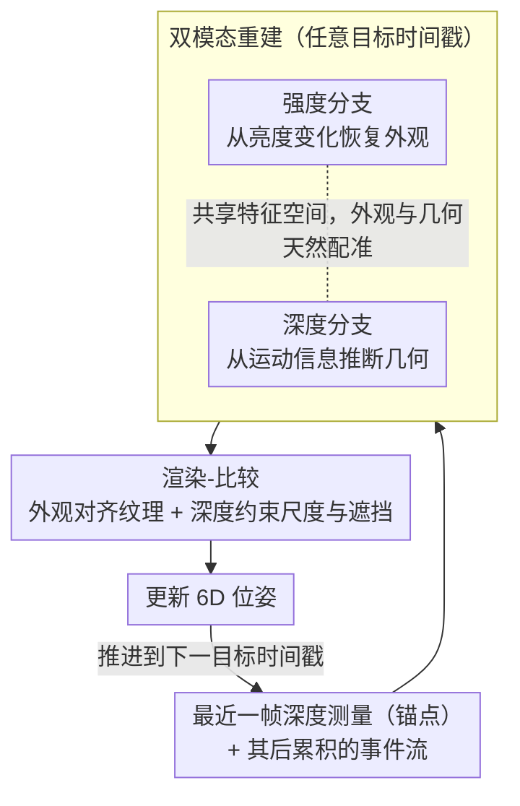

# Event6D: Event-based Novel Object 6D Pose Tracking

**会议**: CVPR 2026  
**arXiv**: [2603.28045](https://arxiv.org/abs/2603.28045)  
**代码**: [https://chohoonhee.github.io/Event6D](https://chohoonhee.github.io/Event6D)  
**领域**: 视频理解  
**关键词**: 事件相机, 6D位姿追踪, 新目标泛化, 双模态重建, 合成到真实迁移

## 一句话总结

EventTrack6D 提出事件-深度融合的 6D 位姿追踪框架，通过在任意时间戳重建强度和深度图像来弥补事件相机与深度帧率的差异，在仅合成数据训练的条件下以 120+ FPS 实现了对未见目标的鲁棒追踪。

## 研究背景与动机

事件相机提供微秒级延迟，非常适合快速动态场景中的 6D 目标位姿追踪——传统 RGB-D 方案受限于运动模糊和大像素位移。但事件相机的稀疏异步输出与标准位姿估计框架不兼容，且现有事件相机 6D 位姿数据集规模小、运动类型有限。

**核心挑战**：深度帧率通常远低于事件流的时间分辨率，两者间存在时间间隙。需要在深度帧之间填补密集的光度和几何信息。

## 方法详解

### 整体框架

这篇论文要解决的是：事件相机能提供微秒级时间分辨率，但位姿追踪还需要的深度图却来自帧率低得多的深度传感器，两者在时间轴上对不齐——深度帧之间有一大段"空白"，没有任何密集的光度和几何信息可供追踪器使用。Event6D 的思路是把这段空白"补"出来：它以最近一帧深度测量为锚点，用其间累积的事件流在任意时间戳同时重建出一张强度图和一张深度图，于是追踪器在每个事件时刻都拿得到密集的外观+几何线索，再走渲染-比较（render-and-compare）的范式逐步更新 6D 位姿。整条链路只在合成数据上训练，却能零样本迁移到真实场景里没见过的目标。

### 关键设计

**1. 双模态重建：在任意时间戳同时补出强度和深度，对齐两种传感器的时间分辨率**

追踪器真正缺的不是事件本身，而是深度帧之间那段没有密集信息的时间间隙——光度看不到、几何也不更新，追踪只能停在低帧率上。这里的做法是让重建以最近一帧深度测量为条件，再用其后累积的事件流向任意目标时间戳外推：强度分支从事件记录的亮度变化恢复场景外观，深度分支从事件隐含的运动信息推断几何变化，两个分支共享同一特征空间，使得重建出的外观和几何天然配准。之所以要"双"模态而不是只补一种，是因为渲染-比较既要靠外观对齐纹理、又要靠深度约束尺度与遮挡——单独一种模态都会让比较缺一条腿（消融里仅强度或仅深度都明显掉点）。把深度帧当锚点而非纯靠事件盲推，也让重建的尺度有据可依，比无条件的纯事件重建稳定得多。

**2. 大规模合成基准套件：用足够多的目标和运动撑起"训练得动"的泛化数据**

要让模型学会追踪从没见过的目标，前提是训练时见过足够多样的目标外观和运动模式，而现有事件相机 6D 数据集小到撑不起这件事（如 YCB-Ev 仅 21 个目标）。为此作者构建了三段式基准：EventBlender6D 合成训练集（495,840 样本、1033 个目标，覆盖多样运动）、一套模拟评测集、以及一套真实事件评测集。合成管线之所以可行，是因为事件可以从渲染序列里仿真生成，绕开了真实事件+深度+位姿三者同步标注的高昂成本；目标数量从 21 量级拉到 1033 量级，正是后面"零样本迁移到新目标"能成立的数据基础。

**3. 新目标零样本泛化：只在合成数据上训练，测试时不为新目标做任何微调**

实际部署里不可能为每个新出现的目标都重新采数据、重新训一遍模型，所以追踪能力必须是"目标无关"的。Event6D 把这点压到训练分布上解决——靠 1033 个目标和多样运动让模型学到的是通用的"重建+渲染比较"机制，而不是记住某几个特定物体。测试时直接面对真实场景里的未见目标，不微调、不做目标特定适配，配合 120+ FPS 的推理速度，让事件相机的微秒级低延迟优势真正落到追踪应用上。

### 损失函数 / 训练策略

训练目标由三部分组成：强度重建损失 + 深度重建损失 + 位姿估计的渲染-比较损失，前两项监督双模态重建、后一项闭环约束追踪精度。全程只用合成数据训练，再零样本迁移到真实场景。

## 实验关键数据

### 主实验

| 方法 | 数据类型 | FPS | 新目标泛化 | 快速运动鲁棒性 |
|------|---------|-----|-----------|--------------|
| 传统 RGB-D 方法 | RGB-D | <30 | 否 | 差（运动模糊） |
| EventTrack6D | 事件+深度 | **120+** | **是** | **强** |

在高动态场景中显著优于传统方法。

### 消融实验

| 配置 | 追踪精度 | 说明 |
|------|---------|------|
| 仅强度重建 | 中等 | 缺乏几何信息 |
| 仅深度重建 | 中等 | 缺乏外观信息 |
| 双模态重建 | 最优 | 光度+几何互补 |
| 无深度条件 | 差 | 深度条件是关键 |

### 关键发现

- 双模态重建的互补性至关重要——仅用一种模态性能显著下降
- 合成到真实的零样本迁移效果好，说明 1033 个目标的多样性足以学到通用追踪能力
- 120+ FPS 使得事件相机的微秒级延迟优势在追踪应用中得以体现

## 亮点与洞察

- **事件相机的6D追踪落地**：首次系统验证了事件相机在新目标6D追踪中的实用性，120+ FPS 对机器人操作等实时应用很有价值
- **大规模合成数据的策略**：用 1033 个目标的合成数据训练泛化模型，绕过了真实数据标注的瓶颈
- **深度条件重建**：以深度帧为锚点做插值重建，比纯事件重建更稳定

## 局限与展望

- 事件相机的成本和可用性仍限制了实际部署
- 深度相机的帧率仍是瓶颈——如果深度帧间隔太长，重建质量下降
- 合成到真实的域差距在某些极端场景下可能显现
- 未来可探索纯事件（无深度）的追踪方案

## 相关工作与启发

- **vs 传统RGB-D追踪 (BundleSDF等)**: 帧率受限且有运动模糊，EventTrack6D 用事件相机根本性地解决了这些问题
- **vs YCB-Ev/E-POSE 数据集**: 规模太小且运动有限，EventBlender6D 提供了更大规模更多样的基准
- **vs FoundationPose**: FoundationPose 在静态或慢速场景下优异，但快速运动时退化

## 评分

- 新颖性: ⭐⭐⭐⭐ 事件相机+6D追踪的结合有价值，大规模基准有贡献
- 实验充分度: ⭐⭐⭐⭐ 合成+真实双重验证，消融充分
- 写作质量: ⭐⭐⭐⭐ 基准描述详细
- 价值: ⭐⭐⭐⭐ 对机器人/AR领域有应用价值

<!-- RELATED:START -->

## 相关论文

- [\[CVPR 2026\] SpikeTrack: High-performance and Energy-efficient Event-Based Object Tracking with Spiking Neural Network](spiketrack_high-performance_and_energy-efficient_event-based_object_tracking_wit.md)
- [\[CVPR 2026\] SDTrack: A Baseline for Event-based Tracking via Spiking Neural Networks](sdtrack_a_baseline_for_event-based_tracking_via_spiking_neural_networks.md)
- [\[CVPR 2026\] EgoXtreme: A Dataset for Robust Object Pose Estimation in Egocentric Views under Extreme Conditions](egoxtreme_a_dataset_for_robust_object_pose_estimation_in_egocentric_views_under_.md)
- [\[CVPR 2026\] MER-Tracker: Towards High-Speed 3D Point Tracking via Multi-View Event-RGB Hybrid Cameras](mer-tracker_towards_high-speed_3d_point_tracking_via_multi-view_event-rgb_hybrid.md)
- [\[CVPR 2026\] Hypergraph-State Collaborative Reasoning for Multi-Object Tracking](hypergraph-state_collaborative_reasoning_for_multi-object_tracking.md)

<!-- RELATED:END -->
