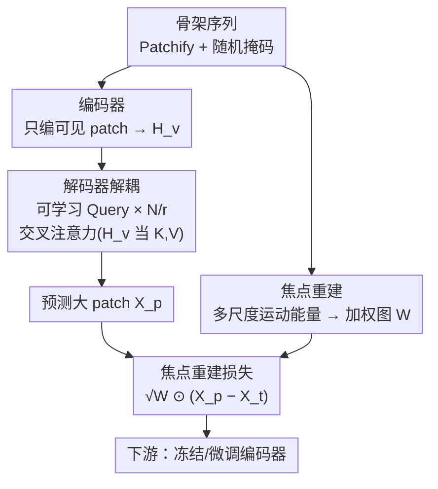

# Exploring Adaptive Masked Reconstruction for Self-Supervised Skeleton-Based Action Recognition

**会议**: CVPR 2026  
**论文**: [CVF Open Access](https://openaccess.thecvf.com/content/CVPR2026/html/Sun_Exploring_Adaptive_Masked_Reconstruction_for_Self-Supervised_Skeleton-Based_Action_Recognition_CVPR_2026_paper.html)  
**代码**: https://github.com/AshenOne1005/AMR  
**领域**: 视频理解 / 自监督学习  
**关键词**: 骨架动作识别, 掩码重建, 自监督预训练, 交叉注意力解码器, 运动能量引导

## 一句话总结
针对骨架掩码自编码器（MAE）训练慢、且对所有时空区域一视同仁的问题，AMR 用「解耦的交叉注意力解码器」实现「预测更少更大 patch」来大幅加速，再用「运动能量引导的焦点重建」把大 patch 重建的注意力压到高运动区域，在 NTU-60/120、PKU-II 上既快 8 倍又涨点，超过现有 SOTA。

## 研究背景与动机
**领域现状**：骨架动作识别用人体关键点表示动作，轻量且对光照/背景鲁棒。自监督路线目前主流是「对比学习」和「骨架掩码重建」两支，后者借鉴视觉 MAE——把骨架序列切成时空 patch，随机掩掉绝大部分（常见保留 10%），逼模型从可见上下文重建被掩 patch，从而学到结构与语义表示。配合 ViT 的长程时空建模能力，掩码重建近年普遍是 SOTA。

**现有痛点**：骨架 MAE 有两个硬伤。一是**慢**：骨架动作天然帧多，切 patch 后形成超长序列（现有方法常需预测 750 个 patch），而掩码重建的解码器又比视觉 MAE 的轻量解码器重得多，自注意力在长序列上的开销巨大，**绝大部分训练算力都耗在解码上**。二是**无差别重建**：标准方法对所有被掩区域用统一的 MSE 目标，不区分语义重要性。但动作语义恰恰集中在剧烈运动的少数区域，把有限建模能力均摊到大量冗余静态区域，既增加重建难度又削弱对关键运动动态的建模。

**核心矛盾**：想加速，最直接是「预测更少但更大的 patch」来缩短解码序列；但大 patch 内部信息更复杂、依赖更难捕捉，直接放大 patch 会**显著掉点**。于是「效率」和「性能」在 patch 尺度这个旋钮上对立。

**本文目标**：拆成两个子问题——(1) 如何在不改编码器的前提下灵活地预测更大 patch 并砍掉冗余解码计算；(2) 如何把大 patch 重建的难度降下来、让性能逼近小 patch。

**切入角度**：作者观察到，标准解码器里「mask token 之间的自注意力」是冗余的——随机初始化的 mask token 本身没有语义，只靠它们和可见 patch 特征做交叉注意力就足够 context-aware；同时，骨架的判别性语义高度集中在高运动区域。

**核心 idea**：用「交叉注意力解码器 + 可学习 query」解耦编解码器、靠调 query 数量自由控制预测 patch 大小（解决效率），再用「运动能量加权的焦点重建损失」把大 patch 的建模重心引到关键运动区（解决掉点）。

## 方法详解

### 整体框架
AMR 沿用掩码骨架重建的两阶段范式：预训练时把骨架序列 patch 化、随机掩码、编码器只处理少量可见 patch，解码器重建被掩部分；下游再冻结/微调编码器接分类头。AMR 的两处改动都落在「解码 + 重建损失」这一段。

输入骨架序列 $X \in \mathbb{R}^{T \times V \times C}$（$T$ 帧、$V$ 关节、$C$ 通道）。先把每个关节连续 $l$ 帧打成一个时空 patch，得到 $X' \in \mathbb{R}^{T_e \times V \times (l \times C)}$（$T_e=T/l$），经全连接嵌入并展平为 $E \in \mathbb{R}^{N \times C_e}$（$N=T_e \times V$）。随机掩掉绝大部分，只把可见子集 $E_v \in \mathbb{R}^{N_v \times C_e}$ 喂给 Transformer 编码器，得到 $H_v$。整条流水线在解码端分叉：**解码器解耦**用一组可学习 query 取代「拼接 mask token」的标准解码，靠改 query 数量直接决定要重建的 patch 数量与粒度；**焦点重建**先量化每个时空窗口的运动能量、生成加权图，再把权重灌进重建损失。

### 关键设计

**1. 解码器解耦：用交叉注意力 + 可学习 query 把「预测更大 patch」变成调一个数字**

慢的根源是解码器自注意力在长序列上的开销，自然想法是缩短解码序列（即重建更少更大的 patch）。但标准解码器把「可见特征 + mask token」拼成 $H_e=[H_v\Vert M]$ 后整体做自注意力，解码器和编码器**紧耦合**：在不动编码器输出 $H_v$ 的情况下没法灵活改预测目标的粒度；强行对 $H_e$ 下采样去匹配更少的目标 patch，又会丢语义、掉点。

作者拆开标准解码的两部分计算——mask token 之间的自注意力、mask token 与可见特征的交叉注意力——并指出前者冗余：随机初始化的 mask token 没有语义，光靠和 $H_v$ 的交叉注意力就够 context-aware（消融见 Table 6）。于是解码器简化为「交叉注意力层 + FFN」：以一组可学习 query 向量 $H_q \in \mathbb{R}^{N_t \times C_e}$（带可学习时空位置编码）作输入，可见特征 $H_v$ 同时当 key 和 value：

$$H_q \leftarrow \mathrm{MCA}(H_q, H_v) + H_q, \qquad H_q \leftarrow \mathrm{FFN}(H_q) + H_q$$

关键收益是**灵活性**：要把目标 patch 放大到原始的 $r$ 倍（覆盖 $r$ 倍帧数），只需把 query 数 $N_t$ 设成 $N/r$ 即可生成维度匹配的预测 $X_p \in \mathbb{R}^{(N/r)\times(r\cdot l\cdot C)}$，**完全不动编码器**。解码序列变短直接砍掉计算开销——AMR 只需预测 125 个 patch（现有方法 750），这是 8 倍加速的主因。

**2. 焦点重建：用运动能量给重建损失加权，把大 patch 的建模重心引到关键运动区**

解耦让大 patch 可预测，但大 patch 信息更杂、冗余更多，难精确捕捉判别性运动语义，单靠解耦仍会掉点。作者的处理是：骨架动作的判别线索集中在剧烈运动区域，静态区域多为冗余，于是用**局部运动能量**作为重要性度量，动态分配重建权重。

具体把序列沿时间切成 $T_w=T/n$ 个不重叠窗口（每个 $n$ 帧）。对某关节在一个窗口内的切片 $S \in \mathbb{R}^{n \times C}$，运动能量定义为各帧相对窗口均值位移的平方范数均值：

$$e_s = \frac{1}{n}\sum_{t=1}^{n}\lVert s_t - \mu\rVert_2^2, \quad \mu=\frac{1}{n}\sum_{t=1}^{n}s_t$$

再用一个「良态」的权重函数把能量映射成 $[0,1]$ 的系数：

$$w(e_s) = \frac{1}{1 + k\cdot e_t/(e_s+\epsilon)}$$

其中 $e_t$ 是自适应阈值（取整条序列所有窗口运动能量的平均），$k>0$ 控制曲线弯曲程度，$\epsilon$ 防除零。其行为是：当窗口能量远低于阈值时 $w\to 0$（静态冗余区被压低），$e_s \gg e_t$ 时 $w\to 1$（高运动区保留）。由于经验上运动能量跨数量级波动，这个函数能平滑适配大动态范围。最后把权重 $W$ 沿窗口帧和通道广播、reshape 成与 $X_p$ 同形，嵌入焦点重建损失（见下）。其效果是模型把有限容量花在关键运动语义上，在大 patch 上仍学到判别性强的表示。

**3. 多尺度时间窗融合：单一窗口尺度顾此失彼，多尺度让关键关节的判定更稳**

只用一个时间窗量化运动能量必有偏差：短窗漏掉缓变细节，长窗抓不住快速运动。AMR 在多个尺度（实验取 $n=4,8,12$）分别算关节运动能量再融合，得到兼顾长短时线索的关节重要性度量。论文的可视化（"脱帽"动作）显示：单窗权重在时间轴上有若干瞬时高权重尖峰、不稳定，多尺度融合后更连续平滑，且减少了对低判别关节的误判——说明多尺度能更一致地捕捉动作相关的关键关节，鲁棒性更好。

### 损失函数 / 训练策略
最终的焦点重建损失在标准 MSE 上加运动能量权重：

$$\mathcal{L} = \frac{1}{N}\left\lVert \sqrt{W}\odot(X_p - X_t)\right\rVert_F^2$$

其中 $\odot$ 为逐元素相乘，$X_t$ 是把原输入（或其变体）按目标粒度 patch 化得到的重建目标。$\sqrt{W}$ 的写法使权重在平方后对应 $W$，等价于对每个区域的重建误差按运动重要性加权。下游评测用线性评估（冻结编码器、接线性分类器训 100 epoch、batch 256、初始学习率 0.01 余弦退火到 0）、半监督、迁移学习三套协议。

## 实验关键数据

### 主实验
NTU-60 x-sub 线性评估下与其它掩码重建方法对比（单卡 L20，相同硬件）：

| 方法 | Patch 数 | FLOPs | 训练时长 | 加速 | NTU-60 x-sub | NTU-60 x-view | PKU-II x-sub |
|------|---------|-------|---------|------|------|------|------|
| SkeletonMAE | 750 | 13.7G | 29.9h | 1× | 74.8 | 77.7 | 36.1 |
| MAMP | 750 | 13.7G | 29.9h | 1× | 84.9 | 89.1 | 53.8 |
| S-JEPA | 750 | 32.8G | 139.8h | 0.2× | 85.3 | 89.8 | 53.5 |
| GFP | 251 | 4.1G | 4.9h | 6.1× | 85.9 | 92.0 | 56.2 |
| NAT w/ Con | 750 | 32.8G | 46.6h | 0.6× | 86.9 | 91.0 | 55.3 |
| **AMR (本文)** | **125** | **3.8G** | **3.7h** | **8.1×** | **87.4** | **92.3** | **60.3** |

AMR 在最少的 patch 数（125）和最短训练时长（3.7h）下取得最高精度，PKU-II x-sub 比次优 GFP（56.2）猛涨到 60.3，验证了焦点重建在更难数据集上的有效性。NTU-120 上 AMR 取得 x-sub 81.1 / x-setup 81.9，超过 S-JEPA（79.6/79.9）、GFP（79.1/80.3）等。

### 消融实验
核心组件消融（统一重建 125 个 patch；DD=解耦解码器，FR=焦点重建）：

| 配置 | NTU-60 | NTU-120 | 说明 |
|------|--------|---------|------|
| Baseline1（解码器掩码选目标） | 84.8 | 76.3 | 标准自注意力解码 + decoder masking 选少量目标 |
| Baseline2（下采样匹配目标数） | 78.9 | 70.2 | 下采样致信息丢失，掉点最猛 |
| Baseline + DD | 86.0 | 80.1 | 换上解耦交叉注意力解码器 |
| Baseline + DD + FR | **87.4** | **81.1** | 完整 AMR |

解码器设计消融（Table 6）：仅交叉注意力（MCA）得 NTU-60 87.4 / NTU-120 81.1，额外加回 mask token 间的自注意力（MCA+MSA）变成 87.2 / 81.2，**无统计显著变化**，直接证实「mask token 间自注意力冗余、可安全移除」。

### 关键发现
- **解耦解码器本身就很强**：在大 patch 设定下，标准解码（Baseline1/2）大幅掉点（尤其下采样的 Baseline2 跌到 78.9），换成 DD 直接回到 86.0；FR 再补 +1.4（→87.4）。可见两个组件分别解决「效率灵活性」和「掉点」两个问题。
- **对 patch 放大鲁棒**（Figure 3）：随 $r$ 从 1 增到 30，w/o FR 变体虽逊于完整 AMR 但仍显著超过基线解码；完整 AMR 在 $r=6$ 时性能仍近峰值（87.4），实现效率—性能的良好折中。
- **半监督低资源优势最明显**：NTU-60 仅 1% 标注时，AMR x-sub 72.2 / x-view 74.4，超过 GFP（71.8/72.9）等，说明学到的表示泛化性强、少样本可迁移。
- **超参 $k$ 不敏感**：$k=0.01$ 最佳（87.4/81.1），$k=0.001$、$k=0.1$ 仅小幅波动。

## 亮点与洞察
- **「调 query 数量 = 调 patch 粒度」是个很干净的解耦**：把「重建多大 patch」从架构问题降维成一个超参，编码器完全不用动，这种把灵活性外包给 query 的做法可迁移到其它掩码重建/检测的解码端。
- **「mask token 间自注意力冗余」的实证很有说服力**：直接加回自注意力却毫无增益（Table 6），用反证法干净地支撑了砍计算的合理性，是省算力的关键洞察。
- **运动能量加权把先验注入损失而非掩码**：与 MAMP（用运动决定掩谁）、ActCLR（用梯度找动作区做对比学习）不同，AMR 把运动先验直接嵌进重建损失，专门针对「大 patch 冗余」这个新问题，思路上更对症。
- 权重函数 $w(e_s)=1/(1+k e_t/(e_s+\epsilon))$ 的自适应阈值（用序列自身平均能量）让权重对不同动作的能量量级自动归一，是个轻巧但实用的设计。

## 局限与展望
- 焦点重建依赖手工定义的运动能量（位移平方范数）与固定的多尺度窗口 $\{4,8,12\}$，对不同帧率/动作节奏可能需要重调；窗口尺度是否能自适应学习，论文未探索。⚠️ 论文未给出跨帧率鲁棒性实验。
- 方法专门为「大 patch 重建」设计，迁移学习（Table 4）上 AMR 与 MAMP/NAT 几乎打平（如 NTU-120→PKU-II 73.0 vs 73.2），说明在标准迁移设定下增益不如线性评估那么突出。
- 运动能量是纯几何位移度量，对「细微但语义关键」的动作（如手指动作幅度小但重要）可能低估其权重，存在把判别区误压的风险。

## 相关工作与启发
- **vs MAMP**：MAMP 用帧间位移决定**掩哪些 patch**（运动引导掩码策略），AMR 把运动先验放进**重建损失加权**，目标是降低大 patch 重建的冗余、提升特征判别性，两者用相似的运动先验但解决的问题不同。
- **vs S-JEPA / NAT**：都是掩码重建 SOTA，但仍预测 750 个 patch、训练动辄数十甚至上百小时；AMR 靠解耦把目标降到 125 个、3.7h 训完，精度反而更高，核心区别是「预测更少更大 patch + 焦点引导」。
- **vs GFP**：GFP 也走「更少 patch（251）」的高效路线（4.9h、6.1×），但在解码端用下采样匹配目标数会丢信息；AMR 用 query 解耦避免下采样、并叠加焦点重建，125 patch / 3.7h 下全面更优。

## 评分
- 新颖性: ⭐⭐⭐⭐ 「query 解耦控制 patch 粒度」+「运动能量加权焦点重建」组合自然且对症，单看各部件不算颠覆但解决了实际的效率—性能矛盾。
- 实验充分度: ⭐⭐⭐⭐⭐ 三数据集 × 线性/半监督/迁移三协议，核心组件、解码器设计、patch 尺度、超参消融齐全。
- 写作质量: ⭐⭐⭐⭐ 动机—方法—实验链路清晰，公式与可视化到位；个别符号（如 $\sqrt{W}$ 的处理）需对照原文确认。
- 价值: ⭐⭐⭐⭐⭐ 8 倍加速且涨点，给骨架自监督预训练立了一个又快又强的实用基线，有代码可复现。

<!-- RELATED:START -->

## 相关论文

- [\[CVPR 2026\] Self-Paced and Self-Corrective Masked Prediction for Movie Trailer Generation](self-paced_and_self-corrective_masked_prediction_for_movie_trailer_generation.md)
- [\[CVPR 2026\] SkeletonContext: Skeleton-side Context Prompt Learning for Zero-Shot Skeleton-based Action Recognition](skeletoncontext_skeleton-side_context_prompt_learning_for_zero-shot_skeleton-bas.md)
- [\[CVPR 2026\] Boosting Self-Supervised Tracking with Contextual Prompts and Noise Learning](boosting_self-supervised_tracking_with_contextual_prompts_and_noise_learning.md)
- [\[ICCV 2025\] Adaptive Hyper-Graph Convolution Network for Skeleton-Based Human Action Recognition](../../ICCV2025/video_understanding/adaptive_hyper-graph_convolution_network_for_skeleton-based_human_action_recogni.md)
- [\[ICCV 2025\] Adaptive Hyper-Graph Convolution Network for Skeleton-based Human Action Recognition with Virtual Connections](../../ICCV2025/video_understanding/adaptive_hyper_graph_convolution_network_skeleton_action_recognition.md)

<!-- RELATED:END -->
