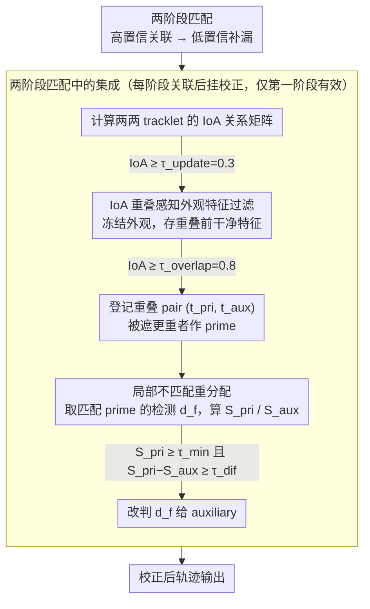

# FC-Track: Overlap-Aware Post-Association Correction for Online Multi-Object Tracking

**会议**: CVPR 2026  
**arXiv**: [2603.12758](https://arxiv.org/abs/2603.12758)  
**代码**: 待确认  
**领域**: 视频理解  
**关键词**: 多目标跟踪, 身份切换校正, 重叠感知, 后关联校正, 在线跟踪

## 一句话总结
提出 FC-Track，一种轻量级的后关联校正框架，通过基于 IoA（Intersection over Area）的重叠感知外观特征过滤和局部不匹配重分配策略，在在线 MOT 中显式纠正由目标重叠引起的身份切换错误，将长期身份切换比例降至 29.55%。

## 研究背景与动机
多目标跟踪（MOT）是机器人感知、自动驾驶、视频分析等场景的核心组件。主流的 tracking-by-detection 范式先检测、后关联，但在拥挤场景下频繁的遮挡和目标重叠导致关联错误不可避免。

**核心矛盾**：一旦发生关联错误（检测框被分配到错误的 tracklet），这个错误会沿时间传播——后续帧中模型使用了错误 tracklet 的外观特征来匹配，导致长期身份切换（long-term ID switch），严重降低跟踪一致性。

**现有方法的不足**：
1. 大多数方法把关联决策视为不可逆的——一旦匹配完成就不再修正
2. 改进关联精度的方法（更好的外观模型、运动模型）只能减少错误发生的概率，但无法在错误发生后纠正
3. 离线/全局优化方法可以回溯修正，但不满足实时性要求
4. 现有在线校正方法（如 OC-SORT）主要处理运动模型误差，没有显式针对重叠导致的关联错误

**核心 idea**：在关联阶段之后加一个轻量的纠错模块——检测重叠 tracklet pair，冻结重叠期间的外观特征更新，用重叠前保存的干净外观特征来判断是否发生了身份交换并纠正。

## 方法详解

### 整体框架
FC-Track 想解决的是一个被主流 tracking-by-detection 忽视的问题：关联一旦出错就再也不回头。它不去改进关联本身，而是在标准的"检测→关联"完成之后挂一个轻量纠错模块，专门盯着因目标重叠而被污染的那部分匹配结果。每一帧走完正常关联后，FC-Track 先扫一遍所有 tracklet 两两之间的重叠程度，把重叠太深的 pair 标记出来并冻结它们的外观特征，避免两个目标的特征在遮挡期间互相串味；然后只对这些重叠 pair 的匹配结果做一次外观相似度的二次核对，发现检测框其实更像另一个 tracklet 时就把它改判过去。整个模块是纯推理时插件，不引入任何可学习参数。

### 关键设计

**1. IoA 重叠感知外观特征过滤：在目标重叠期间冻结外观，防止两条轨迹的特征互相污染**

身份切换的根源在于：当两个目标贴在一起时，检测框会同时框进对方的像素，此刻若还照常更新外观特征，tracklet 的"长相记忆"就被对方掺了进去，等目标分开后已经分不清谁是谁。FC-Track 用 IoA（Intersection over Area，交集面积除以参考框面积）来量化这种重叠：对每一对 tracklet 算 IoA，一旦超过更新阈值 $\tau_{update}=0.3$ 就停止更新该 tracklet 的外观，把最后一帧非重叠时的干净特征保存下来当作基准；当 IoA 进一步超过重叠阈值 $\tau_{overlap}=0.8$，就把这两条轨迹正式登记成一个重叠 pair $(t_{pri}, t_{aux})$。这里特意用 IoA 而不是常见的 IoU，是因为遮挡往往是不对称的——小目标被大目标整个盖住时，并集很大导致 IoU 偏低、容易漏判，而 IoA 以被遮挡那个框的面积为分母，能直接反映"它被盖了多少"，接近 1。pair 里谁当 prime、谁当 auxiliary，也由此决定：被当作分母（面积更小、遮得更狠）的那条作为 prime，后续重分配以它为索引键。

**2. 局部不匹配重分配：用重叠前的干净特征，把错配的检测改判回真正的主人**

冻结只是止损，真正纠错靠这一步。对一个重叠 pair $(t_{pri}, t_{aux})$，取当前帧匹配到 prime 的检测 $d_f$，分别算它和两条轨迹干净特征之间的外观距离：

$$S_{pri} = \text{Distance}(F_{det}[d_f], F_{trk}[t_{pri}]), \quad S_{aux} = \text{Distance}(F_{det}[d_f], F_{trk}[t_{aux}])$$

判定用一组双阈值条件：当 $S_{pri} \geq \tau_{min}$（说明这个检测和 prime 其实长得并不像，匹配本身就不太可靠）**同时** $S_{pri}-S_{aux} \geq \tau_{dif}$（auxiliary 明显更接近）时，才把 $d_f$ 从 prime 改判给 auxiliary。举例来说，一个原本匹配给 prime 的检测，若它到 prime 的距离 0.9、到 auxiliary 只有 0.3，两个条件（$0.9\geq\tau_{min}$、$0.9-0.3\geq\tau_{dif}$）都满足，就判定发生了身份交换并纠正。$\tau_{min}=0.8$、$\tau_{dif}=0.4$ 这组偏严的阈值是刻意设的——宁可少纠也不要误纠，只在高置信场景下出手；而比较的基准始终是重叠前保存的干净特征，而非重叠期间被污染的版本，否则纠错本身也会被噪声带偏。

**3. 两阶段匹配中的集成：把校正插进两阶段关联的每一阶段，但只在高置信那一阶段真正起作用**

主流 tracker 普遍采用两阶段匹配——先用高置信检测关联、再用低置信检测补漏，FC-Track 在每个阶段关联完成后都跑一遍上述校正。但消融发现两阶段的收益并不对称：第一阶段（高置信关联）做校正明显有效，第二阶段（低置信、本就模糊的匹配）几乎没有提升。原因也很直白——低置信匹配连"对错"本身都难以判断，外观距离的可信度下降，强行纠正反而没意义。所以实践中真正贡献来自第一阶段的校正。

### 损失函数 / 训练策略
FC-Track 是纯推理时的后处理模块，**无需训练**，没有任何可学习参数。全部行为由四个固定超参数控制：$\tau_{update}=0.3$（开始冻结外观）、$\tau_{overlap}=0.8$（登记重叠 pair）、$\tau_{min}=0.8$ 与 $\tau_{dif}=0.4$（重分配的双阈值门槛）。整套模块基于 TrackTrack（当前 SOTA 在线 tracker）实现，外观距离默认用余弦距离（消融中优于欧氏距离）。

## 实验关键数据

### 主实验

| 方法 | 数据集 | HOTA↑ | MOTA↑ | IDF1↑ | AssA↑ | IDs↓ | FPS |
|------|--------|-------|-------|-------|-------|------|-----|
| ByteTrack | MOT17 | 63.05 | 80.25 | 77.30 | 61.98 | 2196 | 29.6 |
| BoT-SORT | MOT17 | 65.05 | 80.55 | 80.23 | 65.49 | 1212 | 6.8 |
| TrackTrack | MOT17 | 66.94 | 81.71 | 82.78 | 66.80 | 837 | 5.9 |
| **FC-Track** | **MOT17** | **66.95** | **81.73** | **82.81** | **67.81** | **837** | **5.7** |
| TrackTrack | MOT20 | 65.61 | 77.52 | 80.82 | 67.35 | 719 | 0.7 |
| **FC-Track** | **MOT20** | **65.67** | **77.52** | **80.90** | **67.48** | **719** | **0.6** |

### 消融实验——身份切换持续时间分析（MOT17 val）

| Tracker | 切换次数↓ | 平均持续帧↓ | 中位持续帧↓ | 长期切换比例↓ | IDTP↑ | IDFP↓ |
|---------|----------|------------|------------|-------------|-------|-------|
| ByteTrack | 201 | 33.04 | 11 | 50.25% | 40434 | 13456 |
| BoT-SORT | 199 | 32.89 | 5 | 38.69% | 41757 | 12133 |
| TrackTrack | 236 | 22.88 | 5 | 36.86% | 42144 | 11746 |
| **FC-Track** | **308** | **18.33** | **3** | **29.55%** | **42305** | **11585** |

| 消融配置 | HOTA↑ | IDF1↑ | AssA↑ | 说明 |
|---------|-------|-------|-------|------|
| Baseline (TrackTrack) | 69.40 | 81.86 | 73.57 | 无校正 |
| + Euclidean distance | 69.48 | 81.90 | 73.71 | 欧氏距离 |
| + Cosine distance | **69.67** | **82.12** | **74.08** | 余弦距离（更优） |
| Stage 1 only | 69.67 | 82.12 | 74.08 | 一阶段校正有效 |
| Stage 2 only | 69.40 | 81.86 | 73.57 | 二阶段校正无效 |

### 关键发现
- FC-Track 的身份切换次数虽略多（308 vs 236），但**平均持续帧大幅缩短**（18.33 vs 22.88），中位数仅 3 帧——说明错误能被迅速纠正
- **长期身份切换比例从 36.86% 降至 29.55%**，这是核心贡献：即使偶尔发生身份切换也能快速恢复
- IDTP 增加（42305 vs 42144）而 IDFP 减少（11585 vs 11746），说明更多帧被正确关联
- 余弦距离优于欧氏距离，因为外观特征的方向比幅度更有区分力
- 校正在第一阶段（高置信匹配）有效，在第二阶段（低置信匹配）无效——低置信匹配本身就难以判断对错

## 亮点与洞察
- 视角新颖：不追求"避免错误"而是"错了能改"——这在实际部署中更实用
- 方法极其轻量：无需训练、无需额外网络、仅 4 个超参数，作为即插即用模块几乎无计算开销
- 引入 ID switch duration 分析，比单纯计数 ID switch 更能反映跟踪质量
- IoA 替代 IoU 的设计很有道理——对不对称遮挡（小目标被大目标盖住）更敏感

## 局限与展望
- 在标准指标（HOTA、IDF1）上的提升很小（MOT17 上 HOTA 仅 +0.01），主要改善体现在 ID switch duration 分析中
- 仅在 TrackTrack 上验证，应在 ByteTrack、BoT-SORT 等更多 baseline 上测试通用性
- 重叠阈值 $\tau_{overlap}=0.8$ 相当严格，温和遮挡（IoA 0.3-0.8）可能漏掉
- 只考虑两两重叠，三个或更多目标同时重叠的场景未处理
- 外观特征冻结可能在长时间遮挡后过期（目标外观变化），需要更优雅的特征更新策略
- FPS 略有下降（5.9→5.7），在更极端的实时要求下需要优化

## 相关工作与启发
- OC-SORT 在遮挡期间构建虚拟轨迹来纠正运动模型误差，本文处理的是外观/关联层面的误差，两者互补
- UnfcTrack 用 unfalsified control 建模外观变化序列，思路更复杂但更全面
- 对 MOT 社区的启发：后关联校正应成为标准 pipeline 的一部分，而非可选模块

## 评分
- 新颖性: ⭐⭐⭐⭐ "纠错优于避错"的理念新颖，IoA-based 校正设计合理，但技术深度一般
- 实验充分度: ⭐⭐⭐⭐ MOT17+MOT20 标准测试集 + ID switch duration 分析，消融完整，但缺少多 baseline 验证
- 写作质量: ⭐⭐⭐ 结构清晰但写作质量一般，部分描述过于冗余
- 价值: ⭐⭐⭐⭐ 即插即用的轻量模块对工业部署有实际价值，ID switch duration 分析有方法论贡献

<!-- RELATED:START -->

## 相关论文

- [\[CVPR 2026\] Occlusion-Aware SORT: Observing Occlusion for Robust Multi-Object Tracking](occlusion-aware_sort_observing_occlusion_for_robust_multi-object_tracking.md)
- [\[CVPR 2026\] Out of Sight, Out of Track: Adversarial Attacks on Propagation-based Multi-Object Trackers via Query State Manipulation](out_of_sight_out_of_track_adversarial_attacks_on_propagation-based_multi-object_.md)
- [\[CVPR 2026\] Dual-level Adaptation for Multi-Object Tracking: Building Test-Time Calibration from Experience and Intuition](tcei_test_time_calibration_experience_intuition_mot.md)
- [\[CVPR 2026\] STORM: End-to-End Referring Multi-Object Tracking in Videos](storm_referring_multi_object_tracking.md)
- [\[CVPR 2026\] Event6D: Event-based Novel Object 6D Pose Tracking](event6d_event-based_novel_object_6d_pose_tracking.md)

<!-- RELATED:END -->
