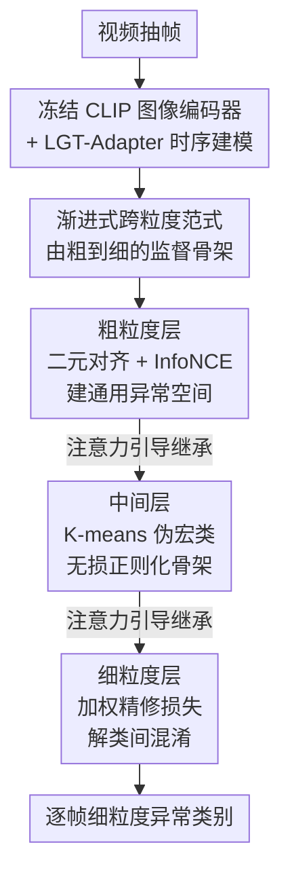

# Fine-VAD: Towards Fine-Grained Video Anomaly Detection via Progressive Cross-Granularity Learning

**会议**: CVPR 2026  
**论文**: [CVF Open Access](https://openaccess.thecvf.com/content/CVPR2026/html/Zhang_Fine-VAD_Towards_Fine-Grained_Video_Anomaly_Detection_via_Progressive_Cross-Granularity_Learning_CVPR_2026_paper.html)  
**代码**: 未公开（论文未提供仓库链接）  
**领域**: 视频理解  
**关键词**: 细粒度视频异常检测, 跨粒度渐进学习, CLIP 对齐, 弱监督, 伪宏类聚类  

## 一句话总结
针对"每类异常样本太少"的细粒度视频异常检测难题，本文提出渐进式跨粒度学习范式——先用海量二元标签学通用异常表示、再用 K-means 伪宏类搭中间语义骨架、最后用稀疏类别标签精修，并以 CLIP 对齐实现为 Fine-VAD，在 UCF-Crime / XD-Violence 上把细粒度异常分类的平均 mAP 相对提升达 47.7%。

## 研究背景与动机
**领域现状**：传统视频异常检测（VAD）只回答"这段视频里有没有异常"，但现实场景（公共安全）里不同异常需要不同响应措施，于是研究重心转向**细粒度 VAD**——不仅检测异常，还要识别它属于哪一类（纵火 / 斗殴 / 车祸等）。近期主流做法是借 CLIP 等视觉-语言模型的预训练表示来缓解数据稀缺。

**现有痛点**：细粒度 VAD 有两个由"异常的上下文依赖性"带来的硬骨头。其一是**类间混淆**：语义不同的异常常由相似视觉基元构成，比如纵火和爆炸都有火光浓烟，特征纠缠、类别边界模糊。其二是**类内变化**：同一类异常在不同场景下外观差异巨大，纵火可以是角落里一点火星，也可以是吞没整车的大火，尺度、背景、运动都不同，难以学到一致的类别表示。

**核心矛盾**：最直接的解法是"大规模细标注数据集上训练"，但异常事件的上下文依赖性使得为每个类别收集足够样本几乎不可行。早期工作用视频级类别标注做有监督，受困于每类样本太少（学不到类内变化）；CLIP 系方法虽缓解了数据稀缺，但 CLIP 是图文对齐预训练、缺乏对物体属性/动作动态/交互语义的细粒度理解，导致视觉相似异常被混淆。**根本矛盾在于：细粒度类别标签稀缺，而模型却要直接学每个类别的判别特征。**

**切入角度**：作者抓住一个关键观察——**虽然每个细类标注稀少，但粗粒度标签（二元异常/正常）相对充裕**。与其硬学每一类，不如让监督信号"由粗到细渐进"：粗标签覆盖广、能学到跨类别共享的稳定异常表示（压类内变化）；细标签则在这个空间上划语义边界（解类间混淆）。

**核心 idea**：用"二元 → 伪宏类 → 细类"三级渐进的跨粒度监督，把特征空间从通用异常模式逐步雕刻成类别专属语义，从而绕开细粒度标签稀缺的瓶颈。

## 方法详解

### 整体框架
Fine-VAD 的输入是一段视频，输出是逐帧的细粒度异常类别。整条管线建立在冻结的 CLIP（ViT-B/16）之上：先把视频抽帧（每 16 帧采样）送入冻结的 CLIP 图像编码器，再用 **LGT-Adapter**（局部+全局时序适配器）补足图像 CLIP 缺失的时序建模，得到视频特征 $f_V$。随后进入本文核心——**渐进式跨粒度学习**：同一份视频特征 $f_{video}$ 依次和三层文本嵌入做余弦相似度对齐，生成三张对齐图 $M_{coarse} \to M_{inter} \to M_{fine}$，每一层都从上一层继承注意力引导，让特征空间连续演化：通用异常模式 → 粗类别边界 → 类别专属语义。值得强调的是，LGT-Adapter 只是一个参考实现，整个范式是**架构无关**的（换成 CNN/Transformer/MLLM 都能涨点）。

### 关键设计

**1. 渐进式跨粒度学习范式：用充裕的粗标签为稀缺的细标签铺路**

这是全文的灵魂，直接回应"细类标签稀缺却要学细类判别特征"的根本矛盾。范式把学习拆成三级语义粒度递增的对齐：粗级用充裕的二元标签 $y_b$ 把所有异常锚定到共享表示、形成统一异常空间（缓解类内变化）；中间级把语义/视觉相似的类别聚成 $K$ 个宏类、用伪标签 $y_p$ 划出粗类别边界，防止模型在稀疏细监督下坍缩；细级再引入真值类别标签 $y_m$ 精修、强化类别专属语义（解类间混淆）。三级不是简单叠加，而是**互相强化**——消融显示单用细标签只有 8.64% mAP，逐级加上粗级（+2.29%）、中间级（+2.96%）后达 14.99%。它区别于传统多任务/分阶段 VAD（那些是给正常模式做特征增强），这里的跨粒度监督提供的是**朝细粒度演化的渐进语义引导**。

**2. 粗粒度层：二元对齐 + 对比损失，先搭稳定的通用异常空间**

针对类内变化，粗级用最充裕的监督先把地基打牢。把时序增强后的 $f_V$ 经前馈层投影成帧级特征 $f_{video} \in \mathbb{R}^{n\times d}$，从冻结 CLIP 文本编码器取"正常/异常"两个文本嵌入 $E_{coarse}=[e_{norm}; e_{anom}]$，逐帧算余弦相似度得粗对齐图 $M_{coarse}=\mathrm{sim}(f_{video}, E_{coarse}) \in \mathbb{R}^{n\times 2}$。损失上联合二元交叉熵与 InfoNCE 对比损失：

$$\mathcal{L}_{bce} = -\frac{1}{N}\sum_{i=1}^{N}\big[\, y_i \log s_{i,1} + (1-y_i)\log(1-s_{i,1})\,\big]$$

其中 $s_{i,1}$ 是经 top-$T$ 池化后的异常分数。对比项让异常表示紧凑、与正常流形清晰分离。消融证实加上 $\mathcal{L}_{cts}$ 带来 +1.97% mAP，说明早期形成紧致的异常感知空间为后续阶段提供了更强基座。

**3. 中间层：K-means 伪宏类 + 跨注意力引导，做"无损"结构正则化骨架**

这一层解决"直接跳到细类会被稀疏监督带崩"的问题，是承上启下的关键。先把真值类别嵌入 $\{e_1,\dots,e_M\}$ 用标准 K-means 聚成 $K$ 个伪宏类：

$$\arg\min_{\{C_k\}}\sum_{k=1}^{K}\sum_{e_i\in C_k}\|e_i-\mu_k\|^2,\quad \mu_k=\frac{1}{|C_k|}\sum_{e_i\in C_k}e_i$$

以簇心 $\mu_k$ 作宏类伪嵌入 $E^k_{pseudo}$，连同正常原型 $e_0$ 拼成 $K{+}1$ 个原型。然后注入粗级语义：用粗对齐图当 query、视频特征当 key-value 做跨注意力得引导嵌入 $E^{coarse}_{guide}=\mathrm{Attention}(M_{coarse}, f_{video})$，再经轻量 FFN 残差融合 $\hat{E}_{pseudo}=\mathrm{FFN}([E^{aug}_{pseudo}, \mathrm{pool}(E^{coarse}_{guide})])+E_{pseudo}$，最后算中间对齐图 $M_{inter}=\mathrm{sim}(f_{video}, \hat{E}_{pseudo})$。这一层**刻意不加任何有监督损失**——伪标签本身带噪，强加监督会过拟合噪声；它只作为结构正则项靠软注意力引导塑形特征空间。消融极有说服力：在这一层加 $\mathcal{L}_{mce}$ 反而掉 2.41%，加 $\mathcal{L}_{mce}+\mathcal{L}_{cts}$ 掉 3.03%，印证它"当骨架而非监督分支"才最优。

**4. 细粒度层：加权精修损失，专攻视觉相似类别的细分**

末级针对类间混淆做最后一刀。它继承中间对齐图 $M_{inter}$ 的引导（同样按 Eq. 4-5 算注意力引导嵌入和精修类别嵌入 $\hat{E}_{fine}$），得细对齐图 $M_{fine}=\mathrm{sim}(f_{video}, \hat{E}_{fine}) \in \mathbb{R}^{n\times(M+1)}$。损失用**加权交叉熵**，对落在同一伪宏类 $C_p(i)$ 内的相似类别加大权重：

$$\mathcal{L}_{refine}=-\frac{1}{N}\sum_{i=1}^{N}\sum_{j=0}^{M}\alpha_{i,j}\,y_{i,j}\log s_{i,j},\quad \alpha_{i,j}=\begin{cases}\omega, & j\in C_p(i)\\ 1, & \text{否则}\end{cases}$$

权重 $\omega>1$ 专门放大"组内"判别——也就是把纵火/爆炸这类视觉相近、被聚到同一宏类的难分对推得更开。这一层**不再用对比损失**，因为在标签稀疏下其推拉机制会破坏类内紧致性（消融 ID 9 加 $\mathcal{L}_{cts}$ 反掉 0.13% 印证）。整体目标为 $\mathcal{L}=\mathcal{L}_{bce}+\lambda_1\mathcal{L}_{cts}+\lambda_2\mathcal{L}_{refine}$。

> ⚠️ **三层一致性**：框架图自上而下的"粗 → 中间 → 细"三个贡献节点，分别对应关键设计 2/3/4，设计 1 是统领三者的范式；CLIP+LGT-Adapter 是脚手架编码节点，不单列设计点。

### 损失函数 / 训练策略
训练时 CLIP 图像和文本编码器**全程冻结**。每级先对帧级对齐图 $M$ 的每一行做 top-$T$ 池化、取选中值的均值得到类别级相似度向量 $S=\{s_0,\dots,s_m\}$，作为后续损失输入（弱监督 MIL 聚合）。粗级数据充裕，用 $\mathcal{L}_{bce}+\lambda_1\mathcal{L}_{cts}$；中间级无监督损失，只做结构正则；细级用加权精修损失 $\mathcal{L}_{refine}$。推理时对细对齐图 $M_{fine}$ 设阈值 $\sigma$：某帧与某细类嵌入相似度超阈即判为该类、否则正常。关键超参：$K{=}4$，top-$T$ 中 $T{=}16$，UCF-Crime 取 $\lambda_1{=}\lambda_2{=}1$、XD-Violence 取 $\lambda_1{=}10^{-4},\lambda_2{=}1$；AdamW，batch 64，学习率 $1\times10^{-5}$，单卡 RTX 4090 训 10 epoch。

## 实验关键数据

### 主实验
评测协议沿用视频动作检测的 mAP@IoU（0.1~0.5）并报告平均 AVG，只在测试集异常视频上计算。在 UCF-Crime（13 类）和 XD-Violence（6 类）两个基准上对比图像异常检测、弱监督 VAD、细粒度 VAD、MLLM 四类方法。

| 数据集 | 指标 | Fine-VAD (本文) | 之前最佳 ExVAD [8] | 提升 |
|--------|------|------|----------|------|
| UCF-Crime | AVG mAP% | **14.99** | 10.15 | 相对 +47.7% |
| UCF-Crime | mAP@0.1% | **21.43** | 16.51 | +4.92 |
| XD-Violence | AVG mAP% | **31.87** | 28.23 | 绝对 +3.64 |
| XD-Violence | mAP@0.5% | **21.58** | 18.35 | +3.23 |

值得注意：ExVAD 建立在大型 LLaMA 3.1 之上，而 Fine-VAD 不依赖任何大模型却在所有 IoU 阈值上全面领先；MLLM 方法（VERA 4.94、Qwen2.5-VL-7B 4.50）在 UCF-Crime 上反而很弱，说明细粒度 VAD 对通用大模型仍是硬挑战。

**架构适配性**（范式即效果的来源）：把三级方案套到不同骨干上均稳定涨点——

| 变体 | 骨干 | UCF-Crime 增益 | XD-Violence 增益 |
|------|------|------|------|
| FineCNN | I3D | +2.97% | +1.93% |
| FineMLLM | Qwen2.5-VL-7B | +8.47% | +14.93% |

### 消融实验
| 配置 | AVG mAP% | 说明 |
|------|---------|------|
| 仅细级（ID 1） | 8.64 | 稀疏标签不足以学判别表示 |
| +粗级（ID 2） | 10.93 | 通用异常模式打地基，+2.29% |
| +中间级（ID 3） | 11.60 | 粗类别结构先于细精修，+2.96% |
| 完整三级（ID 4） | **14.99** | 三级互相强化 |
| 去时序适配器（ID 5） | 5.62 | 暴跌，时序推理对细粒度必不可少 |
| 换 Transformer / GCN / TA 等 | 12.01~14.56 | 换骨干仍超原 SOTA，范式通用 |

损失消融（UCF-Crime）：中间级**加**监督损失 $\mathcal{L}_{mce}$ 反掉 2.41%、加 $\mathcal{L}_{mce}+\mathcal{L}_{cts}$ 掉 3.03%（证实它该当无损正则项）；细级用 $\mathcal{L}_{refine}$（14.99%）显著优于普通多类 CE，且再叠 $\mathcal{L}_{cts}$ 小掉 0.13%。

### 关键发现
- 三级**非简单叠加而是互相强化**：粗级压类内变化、中间级注入语义结构、细级解类间混淆，t-SNE 可视化显示特征随级别推进越来越紧致可分。
- 中间层"无损更好"是反直觉亮点：伪标签带噪，把它当软注意力骨架比当监督分支高 2~3 个点。
- 伪宏类数 $K{=}4$ 在两个数据集都最优；$K$ 太小会合并语义相异类、太大会因每组样本不足导致聚类不稳。$K$ 是数据集相关的、和类别空间复杂度挂钩（XD-Violence 类别少，$K{=}3$ 也接近最优）。
- 去掉时序适配器掉到 5.62%，时序建模对细粒度异常理解是刚需。

## 亮点与洞察
- **"粗标签廉价、细标签昂贵"的非对称性被巧妙利用**：与其在稀缺细标签上硬卷，不如让充裕粗标签先把特征空间结构化，是数据稀缺任务里很可迁移的思路。
- **用聚类伪宏类做"中间脚手架"且刻意不加损失**：把噪声伪标签从"监督目标"降级为"注意力正则骨架"，避免过拟合噪声——这个"该监督的地方监督、该留白的地方留白"的取舍很值得借鉴到其他半监督场景。
- **加权精修损失只放大组内难分对**：把判别预算精准花在被聚到一起的视觉相似类别上，比一视同仁的多类 CE 更对症。
- **范式架构无关**：CNN/Transformer/MLLM 都能涨点，证明收益来自学习范式本身而非某个网络设计，可作为即插即用的训练 recipe。

## 局限与展望
- 作者承认：当前假设每段视频**至多一个主导异常类型**，未来需扩展到多异常共现、并研究异常间交互如何影响细粒度识别。
- 自己发现的局限：方法重度依赖 CLIP 文本嵌入的语义质量，对 CLIP 覆盖不好的罕见/专业异常类别可能力不从心；伪宏类靠 K-means 在类别嵌入上聚类，类别极少（如 6 类）时分组自由度低，$K$ 调参空间有限。
- 改进思路：把 $K$ 从固定值改为自适应（按类别空间复杂度动态决定），或用层次聚类得到多级宏类、与三级监督天然对齐。

## 相关工作与启发
- **vs VadCLIP [29]（AAAI'24）**：同样基于 CLIP，但它直接用类别文本增强视觉表示、单级对齐，缺乏由粗到细的渐进引导，故在视觉相似类（爆炸/斗殴）上严重混淆；Fine-VAD 复用其 LGT-Adapter 却把对齐升级为三级，UCF-Crime AVG 从 6.68% 提到 14.99%。
- **vs ExVAD [8]（ICML'25）**：之前最佳，建立在大型 LLaMA 3.1 之上；Fine-VAD 不用任何大模型、靠跨粒度范式反超 47.7%，说明"好的监督结构"可以省掉"堆大模型"。
- **vs 传统多任务/分阶段 VAD [20,38,39]**：那些用预测/重建等辅助任务建模**正常**模式做特征增强；本文的分级监督不是建模正常，而是构造利于**区分不同异常类别**的判别空间，目标根本不同。

## 评分
- 新颖性: ⭐⭐⭐⭐ "用粗标签为细标签铺路 + 中间层无损正则"的渐进跨粒度范式角度新颖且自洽
- 实验充分度: ⭐⭐⭐⭐ 两基准 + 四类基线 + 三层/损失/$K$/时序适配器全套消融 + 跨架构验证，较充分
- 写作质量: ⭐⭐⭐⭐ 动机—范式—实现—消融逻辑清晰，公式与图示对应到位
- 价值: ⭐⭐⭐⭐ 细粒度 VAD 的强基线，架构无关的训练范式可即插即用迁移

<!-- RELATED:START -->

## 相关论文

- [\[CVPR 2026\] Text-guided Fine-Grained Video Anomaly Understanding](text-guided_fine-grained_video_anomaly_understanding.md)
- [\[CVPR 2026\] Mistake Attribution: Fine-Grained Mistake Understanding in Egocentric Videos](mistake_attribution_fine-grained_mistake_understanding_in_egocentric_videos.md)
- [\[CVPR 2026\] UFVideo: Towards Unified Fine-Grained Video Cooperative Understanding with Large Language Models](ufvideo_towards_unified_fine-grained_video_cooperative_understanding_with_large_.md)
- [\[CVPR 2026\] Frame2Freq: Spectral Adapters for Fine-Grained Video Understanding](frame2freq_spectral_adapters_for_fine-grained_video_understanding.md)
- [\[AAAI 2026\] FineVAU: A Novel Human-Aligned Benchmark for Fine-Grained Video Anomaly Understanding](../../AAAI2026/video_understanding/finevau_a_novel_human-aligned_benchmark_for_fine-grained_video_anomaly_understan.md)

<!-- RELATED:END -->
