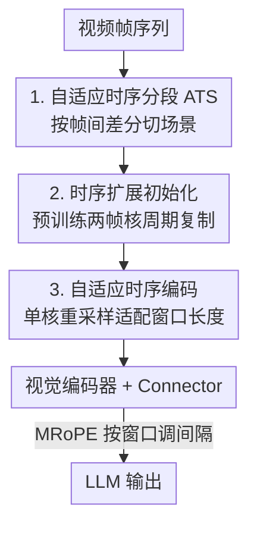

# FlexiVideo: Variation-Aware Temporal Dynamics Modeling for Efficient Video Understanding

**会议**: CVPR 2026  
**论文**: [CVF Open Access](https://openaccess.thecvf.com/content/CVPR2026/html/Peng_FlexiVideo_Variation-Aware_Temporal_Dynamics_Modeling_for_Efficient_Video_Understanding_CVPR_2026_paper.html)  
**代码**: https://github.com/AI9Stars/FlexiVideo  
**领域**: 视频理解  
**关键词**: 视频MLLM, 时序动态建模, 高效编码, 视觉混淆, 自适应分段

## 一句话总结
FlexiVideo 不再对所有视频帧用固定的多帧编码窗口，而是先按帧间差分把视频切成"内部视觉变化平缓"的场景片段，再用一个可动态调整时序窗口的共享 3D 卷积核做场景级编码，从而在把视觉 token 砍掉 43.5% 的同时还能在 6 个视频基准上稳定超过 Qwen2.5-VL-3B。

## 研究背景与动机

**领域现状**：当前视频 MLLM 普遍遵循"感知—认知"范式——视觉编码器先把帧压成紧凑表示，再交给 LLM 理解。为了对付视频的视觉冗余，主流做法有两条线：一是对编码后的特征用固定压缩比做时空压缩，二是在 token 层面剪掉/合并与 query 无关或冗余的 token。最新的 Qwen2.5-VL 则更进一步，用 3D 卷积把**相邻两帧**打包成一个 patch，直接把编码开销砍半。

**现有痛点**：前两条线虽然有效，但都建立在**逐帧特征提取**之上，视觉编码阶段的算力开销并没有省掉。而 Qwen2.5-VL 这种固定两帧编码，作者通过 pilot 实验发现了一个更隐蔽的问题——当被打包的两帧差异很大（如场景切换）时，模型会陷入**视觉混淆（visual confusion）**，在描述动作或事件时产生幻觉或错误。

**核心矛盾**：自然视频的时序动态是**异质**的——大段低动态帧（视觉变化极小）中点缀着短促但语义关键的高动态转场。固定窗口编码对这种异质性"一视同仁"，于是陷入两难：窗口大了，高动态帧对被混在一起 → 视觉混淆、掉点；窗口小了（逼近逐帧），混淆少了但 token 数和算力暴涨。pilot 实验还揭示了第二层矛盾：高动态序列其实**蕴含更丰富的语义线索**（把差异帧重复消除后模型反而表现更好），说明动态既是混淆来源、又是语义富矿。

**本文目标**：设计一个"既能感知信息性视觉变化、又能抵抗破坏性视觉波动"的编码方式，让编码窗口随局部视觉变化自适应伸缩。

**核心 idea**：把"对每帧一视同仁"换成"按视觉变化分场景"——把视觉变化平缓的连续帧归并成长场景做一次性场景级压缩，把剧烈变化的区域切成密集短场景保留细粒度运动，再用一个共享的可重采样卷积核去适配不同长度的场景窗口。

## 方法详解

### 整体框架

FlexiVideo 从 Qwen2.5-VL 初始化，核心是在视觉编码器**之前/之中**插入一个轻量预处理机制，把"图像级编码"升级为"场景级编码"。整条 pipeline 是：视频帧序列先进 **自适应时序分段（ATS）** 模块，按帧间差分把序列切成 $K$ 个内部变化平缓的场景；每个场景再交给 **动态时空嵌入（DSTE）** 模块，DSTE 分两步——先用**时序扩展初始化**把预训练的两帧 patch embedding 权重无痛扩展到更长的时序感受野，再用**自适应时序编码**让单个 3D 卷积核动态适配每个场景的长度，把一个场景压成固定数量的 token；最后这些 embedding 经视觉编码器和 connector 产出最终视觉 token 喂给 LLM。整个机制不改 backbone，只引入极少量可训练参数。

### 关键设计

**1. 自适应时序分段（ATS）：按视觉变化把视频切成"内部平缓"的场景**

针对"固定窗口对异质动态一视同仁"这个痛点，ATS 借鉴人眼"对动态区域时间敏感、对静态区域长时间整合"的特性，在特征编码**之前**就按局部运动强度把帧序列重新分段。具体地，先用帧间差分度量两帧的视觉变化：给定第 $t$ 帧 $f_t\in\mathbb{R}^{C_{in}\times H\times W}$（已用 ImageNet 统计量归一化），它相对参考帧 $f_{t_0}$ 的变化定义为逐像素 L2 距离的空间平均：

$$\Delta(f_t, f_{t_0}) = \frac{1}{H\times W}\sum_{i=1}^{H}\sum_{j=1}^{W}\left\|f_t(i,j)-f_{t_0}(i,j)\right\|_2$$

给定时序变化阈值 $\tau$，从参考帧 $t_0$ 出发，相对静态的片段长度 $l$ 取"差分始终不超过 $\tau$ 的最长连续帧数"：$l=\max\{n \mid \Delta(f_{t_0+m}, f_{t_0})\le\tau,\ \forall m\in\{0,\dots,n-1\}\}$。于是 $\{f_{t_0},\dots,f_{t_0+l-1}\}$ 被切成一个场景，下一个场景以 $f_{t_0+l}$ 为新参考帧迭代下去，把原本 $T$ 帧重组成 $K$ 个长度不一的场景 $\{l_1,\dots,l_K\}$，满足 $\sum_k l_k=T$。这样平缓区被归并成长场景以利用时序冗余、剧烈区被切成密集短场景以保运动细节——计算焦点在特征提取**之前**就被重新分配了，几乎零额外成本。论文实测 $\tau=0.2$。

**2. 时序扩展初始化：让预训练的两帧核"免训练"获得长时序感受野**

ATS 切出来的场景往往比 2 帧长得多，但 Qwen2.5-VL 的 patch embedding 是为固定两帧的 3D 卷积训练的，直接用更长窗口会因为权重不匹配而行为漂移。这一步要解决的就是"如何在不从头训练的前提下把短时序核扩成长时序核"。给定初始 patch embedding 权重 $W_{old}\in\mathbb{R}^{C_{out}\times C_{in}\times T_{old}\times p\times p}$，设扩展比 $r=T_{init}/T_{old}$，扩展后的核 $W_{init}$ 沿时间维做**周期复制 + 归一化**：

$$W_{init}[:,:,t,:,:] = \frac{1}{r}\cdot W_{old}[:,:,\,t \bmod T_{old},:,:],\quad t=0,\dots,T_{init}-1$$

即把原核沿时间循环平铺，再用 $1/r$ 缩放保证卷积响应量级不变。这种即插即用的策略让模型在微调早期就能捕获长程依赖，把"从头训长时序编码器"的开销几乎抹平；论文称把 Qwen2.5-VL 的时序窗口这样放大后模型行为退化可忽略。FlexiVideo 实际配置时序维度为 6。

**3. 自适应时序编码：单个 3D 核动态重采样以适配任意场景长度**

时序扩展给了一个固定长度 $T_{init}$ 的长核，但场景长度是变化的——固定窗口既做不到动态时序建模、又会在变化剧烈处重新引发视觉混淆。最朴素的办法是为每种时序长度训练一组独立卷积核，但参数冗余且学不到跨尺度共享的时序模式。受 FlexiViT 在**空间**维度自适应 patch size 的启发，FlexiVideo 把这一思路扩到**时间**维度：让单个核动态适配任意时序长度。

形式化地，针对某个空间位置的时序信号 $u\in\mathbb{R}^{T_{init}}$，当输入时序分辨率变化时，信号需从 $T_{init}$ 重采样到 $T_{new}$，建模为线性变换 $u_{resized}=Bu$（$B\in\mathbb{R}^{T_{new}\times T_{init}}$ 是时序插值矩阵）。目标是让"适配后的核 $w_{new}$ 作用在重采样信号上"逼近"原核 $w$ 作用在 $u$ 上"，即 $\langle u, w\rangle \approx \langle Bu, w_{new}\rangle$，转成最小二乘问题：

$$w_{new} = \arg\min_{w_{new}}\ \mathbb{E}_{u\sim\mathcal{U}}\big[(\langle u, w\rangle - \langle Bu, w_{new}\rangle)^2\big]$$

其闭式解为 $w_{new}=Pw$，其中 $P=B(B^TB)^{-1}=(B^T)^{+}$ 是 $B^T$ 的伪逆（$T_{new}>T_{init}$ 与 $T_{new}<T_{init}$ 同形式）。这个变换可逐通道、逐空间位置独立计算，开销可忽略；于是对 ATS 产出的任意长度 $T_k$ 的场景，都能从共享预训练权重动态生成对应的 patch embedding 核。整段视频的视觉 embedding 总数为 $N=\sum_{k=1}^{K}\big(\tfrac{H}{p}\big)\times\big(\tfrac{W}{p}\big)$——注意它**不再依赖帧数**，长场景用大窗口减 token、短场景用小窗口保细节，在不增参数的前提下实现真正的多粒度时序感知。

### 损失函数 / 训练策略
两个模块串联后（Sec. 3.3），还在 MRoPE 时序维度上重设位置编码：视觉变化平缓的场景分配更大的编码间隔、剧烈区分配更小间隔，使位置编码与每个时序窗口对齐。训练上全参微调 140k 样本（35k 图像采自 PixMo + 105k 视频，含 75k LLaVA-Video-178K + 30k ShareGPT4Video），学习率 $1\times10^{-5}$、全局 batch 64、warm-up 0.03，4 机 × 8×A100-80GB。对图像输入则用帧重复增强静态表示学习。

## 实验关键数据

### 主实验

FlexiVideo-3B 从 Qwen2.5-VL-3B 初始化，在 6 个视频基准上平均提升 2.7%，并在 Video-MME（w/o sub.）刷到 62.5% 的新 SOTA：

| 基准 | 指标 | Qwen2.5-VL-3B | FlexiVideo（本文） | 提升 |
|------|------|---------------|-------------------|------|
| Video-MME（w/o sub.） | Acc | 61.5 | **62.5** | +1.0 |
| LongVideoBench | Acc | 54.2 | **57.0** | +2.8 |
| MLVU（M-Avg） | Acc | 68.2 | **69.6** | +1.4 |
| LVBench | Acc | 43.3 | **46.0** | +2.7 |
| MotionBench | Acc | 55.8† | **57.3** | +1.5 |
| FavorBench | Acc | 37.1 | **46.8** | +9.7 |

运动类基准（MotionBench / FavorBench）提升最显著，印证 ATS 对细粒度时序动态的建模收益；长视频基准（LongVideoBench / LVBench）的提升则主要来自 DSTE 对场景级窗口的动态调整。

### 消融实验

固定编码 vs. 动态编码（MotionBench @8fps、MLVU @576 帧，同初始化、同语言模型、同训练配置）：

| 基准 | 编码方式 | #Tokens | 显存峰值 | Acc |
|------|---------|---------|---------|------|
| MotionBench | 固定 2 帧 | 24097.9 | 15.7 GB | 55.5 |
| MotionBench | 固定 6 帧 | 7821.5 | 10.1 GB | 54.4 |
| MotionBench | **Dynamic（本文）** | 14010.6 | 11.3 GB | **57.3** |
| MLVU | 固定 2 帧 | 38245.8 | 20.7 GB | 65.5 |
| MLVU | 固定 6 帧 | 12748.6 | 11.9 GB | 60.3 |
| MLVU | **Dynamic（本文）** | 30722.3 | 16.2 GB | **69.6** |

### 关键发现
- **固定窗口的双输困局被验证**：窗口从 2 加到 6，token 和显存确实降了，但精度反而掉（MotionBench 55.5→54.4、MLVU 65.5→60.3）——大窗口加剧视觉混淆。FlexiVideo 的动态窗口在 token/显存介于两者之间时精度反超两端，说明"按变化分配窗口"是真正打破 trade-off 的关键，而非简单换更大或更小的固定窗口。
- **效率优势随帧率放大**：作者定义新指标 $\text{Kpixel Per TFLOPs}=\frac{H\times W\times T}{1000\times\text{TFLOPs}}$（单纯 FLOPs 不能反映 token 预算固定时空间分辨率自适应的收益）。帧数越多、相邻帧越相似，FlexiVideo 能以更高空间分辨率联合编码更多帧，该指标随帧数显著上升——在 MotionBench@10FPS 上比 Qwen2.5-VL-3B 砍 43.5% 视觉 token 仍 +1.3%。
- **特征空间更平滑**：case 分析（双 baton 表演 + 评委打分两事件）显示，事件内两模型特征都连贯；但在事件转场处 Qwen2.5-VL 无差别编码大差异帧 → 视觉混淆 → 幻觉响应，FlexiVideo 靠动态分段把窗口内变化压低，跨事件边界依然平滑稳定。

## 亮点与洞察
- **把"FlexiViT 的空间自适应 patch size"迁移到时间维**，并给出伪逆闭式解，让单核免训练支持任意时序窗口——这个"权重重采样"思路很优雅，几乎零参数、零额外训练就拿到多粒度时序感知，可迁移到任何用 3D patch embedding 的视频编码器。
- **pilot 实验先把问题钉死再设计方法**：先证明"高动态帧对加剧视觉混淆"且"消除帧间差异（帧重复）反而提分"，再据此推出"分段 + 动态窗口"，动机链条完整且有反直觉发现（高动态既是噪声源又是语义富矿）。
- **token 数与帧数解耦**：$N$ 只跟场景数和空间分辨率有关，这让高帧率/长视频场景下 token 不再随帧数线性爆炸，是它在 LVBench 这类极长记忆基准上吃得开的根因。

## 局限与展望
- 作者自陈超参未充分调优，进一步优化有望在精度和效率上再涨；分段质量高度依赖阈值 $\tau$（论文取 0.2），不同帧率/内容下 $\tau$ 的鲁棒性与自适应没充分展开。⚠️ 帧间差分用的是**像素级 L2**，对全局光照变化、相机抖动、转场特效可能误判为"高动态"从而过度切分，论文未讨论这类退化场景。
- 验证主要在 3B 规模、以 Qwen2.5-VL 为唯一 backbone，能否泛化到更大模型或不同视觉编码器（非 3D conv patchify）未知。
- 改进思路：把固定阈值 $\tau$ 换成可学习/内容自适应的分段策略，或用语义而非纯像素差分来界定场景边界，可能进一步缓解像素级度量的误判。

## 相关工作与启发
- **vs Qwen2.5-VL（固定两帧 3D conv）**：两者都想靠多帧联合编码省 token，但 Qwen2.5-VL 用**固定**两帧窗口，遇到高动态帧对就视觉混淆掉点；FlexiVideo 用**动态**窗口随视觉变化伸缩，既保了运动细节又抑制了混淆，是对它的直接改进。
- **vs token 剪枝/合并类（LLaMA-VID、LongVU 等）**：它们在编码**之后**剪 token，仍要付逐帧编码的算力，且剪枝可能破坏时序连续性；FlexiVideo 把压缩前移到**embedding 阶段**做场景级一次性压缩，从源头降编码负担。
- **vs 像素级裁剪/快慢帧（Video-LLaMA3、Keye-VL 1.5）**：它们在原始帧上剪 patch 或对慢帧降分辨率，FlexiVideo 则是按场景动态调时序窗口，粒度落在"时序聚合"而非"空间降采样"，两者思路正交、可结合。

## 评分
- 新颖性: ⭐⭐⭐⭐ 把 FlexiViT 的空间自适应优雅地搬到时间维，配 pilot 实验把"视觉混淆"问题立住，切入角度新但仍基于已有 3D patchify 框架。
- 实验充分度: ⭐⭐⭐⭐ 6 个基准 + 固定窗口消融 + 效率指标 + case 分析较完整，但仅 3B/单 backbone、缺 $\tau$ 敏感性曲线。
- 写作质量: ⭐⭐⭐⭐ 问题—动机—方法链条清晰，公式与图配合好；个别句子有语法瑕疵。
- 价值: ⭐⭐⭐⭐ 即插即用、近零额外参数、高帧率长视频场景实用价值高，已开源代码与权重。

<!-- RELATED:START -->

## 相关论文

- [\[CVPR 2026\] Thinking with Drafts: Speculative Temporal Reasoning for Efficient Long Video Understanding](thinking_with_drafts_speculative_temporal_reasoning_for_efficient_long_video_und.md)
- [\[CVPR 2026\] CVA: Context-aware Video-text Alignment for Video Temporal Grounding](cva_context-aware_video-text_alignment_for_video_temporal_grounding.md)
- [\[AAAI 2026\] Explicit Temporal-Semantic Modeling for Dense Video Captioning via Context-Aware Cross-Modal Interaction](../../AAAI2026/video_understanding/explicit_temporal-semantic_modeling_for_dense_video_captioning_via_context-aware.md)
- [\[CVPR 2026\] Cluster-Wise Spatio-Temporal Masking for Efficient Video-Language Pretraining](cluster-wise_spatio-temporal_masking_for_efficient_video-language_pretraining.md)
- [\[CVPR 2026\] GIFT: Global Irreplaceability Frame Targeting for Efficient Video Understanding](gift_global_irreplaceability_frame_targeting_for_efficient_video_understanding.md)

<!-- RELATED:END -->
