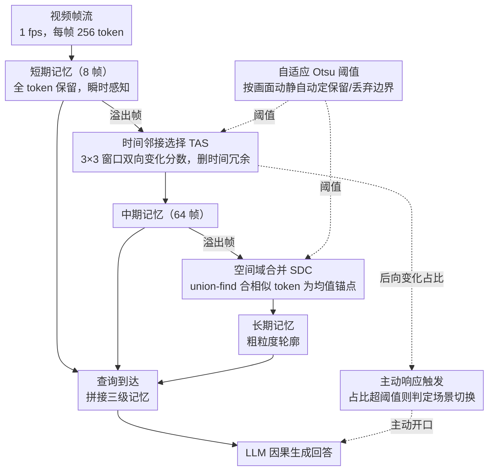

# FluxMem: Adaptive Hierarchical Memory for Streaming Video Understanding

**会议**: CVPR 2026  
**arXiv**: [2603.02096](https://arxiv.org/abs/2603.02096)  
**代码**: [https://github.com/YiwengXie/FluxMem](https://github.com/YiwengXie/FluxMem)  
**领域**: 视频理解  
**关键词**: 流式视频理解, 层级记忆, 视觉token压缩, 自适应阈值, training-free

## 一句话总结
提出 FluxMem，一个无需训练的流式视频理解框架，通过层级化记忆设计（短期/中期/长期）和两个自适应 token 压缩模块（TAS 去时间冗余 + SDC 去空间冗余），在丢弃 60-70% 视觉 token 的同时在 StreamingBench 和 OVO-Bench 上取得新 SOTA。

## 研究背景与动机
多模态大模型在离线视频理解中表现优异，但实际应用（机器人操控、自动驾驶、智能眼镜）需要实时处理连续视频流。流式视频理解的核心挑战是如何在有限的计算/内存预算下有效记忆长期时序上下文，并在查询到达时因果地生成响应。

**现有方法的不足**：

**KV cache 管理**（ReKV、LiveVLM）：在 LLM prefill 阶段才做去重，此前的视觉编码已消耗大量计算

**查询引导过滤**（TimeChat-Online）：依赖文本查询来选择视觉内容，但流式场景中查询可能在视频之后才到达，无法提前过滤

**固定压缩策略**：现有 token 压缩方法对所有帧使用统一的裁剪/合并策略，忽略了记忆的时间依赖性——近帧需要保留高分辨率细节用于当前推理，远帧可以更激进地压缩

**核心 idea**：模仿人类记忆的衰减特性，设计层级化记忆（短/中/长期），近期记忆保持完整，远期记忆逐级压缩。压缩阈值不用人工调参，而是基于 Otsu's method 自适应确定。

## 方法详解

### 整体框架
FluxMem 要解决的是「在内存/计算预算有限的前提下，让流式视频模型记住足够长的历史上下文」。它的做法是把视觉记忆按时间远近分成三级，越远的记忆压得越狠，模仿人类记忆「近事清晰、旧事模糊」的衰减规律。

具体来说，帧以级联方式从近到远流过三级记忆：刚进来的帧落在**短期记忆 $\mathcal{M}^s$**（容量 $c_s=8$ 帧），保留全部视觉 token 供当前瞬时感知；短期溢出的帧先经 TAS 去掉时间冗余，降级到**中期记忆 $\mathcal{M}^m$**（容量 $c_m=64$ 帧）；中期再溢出的帧又经 SDC 合并空间冗余，沉淀到**长期记忆 $\mathcal{M}^l$** 成为紧凑表示。整个降级过程的保留/丢弃边界由**自适应 Otsu 阈值**随画面动静自动确定，TAS 顺手算出的变化统计量又被**主动响应触发**复用来检测场景切换。任何时刻查询到达，就把三级记忆拼起来送进 LLM 因果地生成回答。整个过程严格单向、不回看未来帧，因此天然适配流式场景。

### 关键设计

**1. 时间邻接选择（Temporal Adjacency Selection, TAS）：在短期→中期边界砍掉时间上没变化的 token**

流式视频里相邻帧高度相似，若把每帧 256 个 token 原样塞进记忆，大量都是重复的背景。TAS 的判断标准是「这个 token 相对前后帧是否带来了新信息」。对每个空间位置 $(h,w)$，它不在同位置硬比，而是在相邻帧的 $3\times 3$ 窗口里找最相似的 token，取最小余弦距离作为前向/后向变化分数：

$$s_{t,h,w}^{-} = \min_{(i,j) \in \mathcal{N}_{3\times 3}(h,w)} d(v_{t,h,w}, v_{t-1,i,j}), \quad s_{t,h,w}^{+} = \min_{(i,j) \in \mathcal{N}_{3\times 3}(h,w)} d(v_{t,h,w}, v_{t+1,i,j})$$

再用 Otsu's method 分别求出前向/后向阈值 $\Theta_t^{-}$、$\Theta_t^{+}$，只要 token 对前帧**或**后帧之一有显著变化就保留：$(s_{t,h,w}^{-} > \Theta_t^{-}) \lor (s_{t,h,w}^{+} > \Theta_t^{+})$。这里三个细节决定了它好用：$3\times 3$ 窗口而非同位置比较，容忍轻微运动/抖动，不会因为物体平移一两个 patch 就误删；双向取并集，既保住「这一帧刚出现的新内容」又保住「下一帧将消失、当前是最后一眼的内容」；整套只需单遍扫描，复杂度 $\mathcal{O}(HW)$，不破坏因果性。

**2. 空间域合并（Spatial Domain Consolidation, SDC）：在中期→长期边界把空间上挨着又相似的 token 并成一个**

TAS 解决了时间冗余，但同一帧内大片相似区域（天空、墙面）仍占着多个 token。SDC 在 TAS 保留下来的 token 上做空间合并：在原始 $3\times 3$ 邻域内，把距离 $\le \Theta_t$（同样由 Otsu 给出）的 token 两两连边构成稀疏图，用 union-find 求连通分量 $\{C_{t,k}\}_k$，每个分量塌缩成它的均值锚点：

$$a_{t,k} = \frac{1}{|C_{t,k}|} \sum_{(i,j) \in C_{t,k}} v_{t,i,j}$$

之所以放在 TAS 之后做，是因为此时 token 集已经稀疏，构出的图边很少，union-find 近线性就能跑完；而把局部相似区域并成重心锚点，既保住该区域的语义又把 token 数量大幅压下来，正好契合「长期记忆只需粗略轮廓」的定位。

**3. 自适应 Otsu 阈值：让 TAS 和 SDC 的压缩力度随画面动静自动调，免去人工调参**

前两个模块都依赖一个阈值来区分「该留」和「该删」，固定阈值的麻烦在于：静态场景下分数普遍偏低，阈值太高会把该留的也留太多（浪费），动态场景下分数普遍偏高，同一个阈值又会误删（损失信息）。FluxMem 把「哪些 token 该保留」直接当成一个二值分割问题，套用经典的 Otsu's method——找到使前景/背景两类间方差最大的阈值：

$$\Theta_t = \arg\max_{\theta} \left[\omega_1(\theta)\,\omega_2(\theta)\,(\mu_1(\theta) - \mu_2(\theta))^2\right]$$

TAS 里它分析的是时间相似度分数的分布，SDC 里分析的是空间距离的分布。好处是零额外可学习参数：运动剧烈时分数整体抬高，Otsu 自动把阈值推高、保留更多 token；画面静止时则自动压低阈值、更激进地压缩。消融显示这种自适应阈值在 42.8% 丢弃率下就能达到固定阈值 29.4% 丢弃率的精度，压缩效率约提升 45%。

**4. 主动响应触发（Proactive Response Triggering）：白嫖 TAS 的统计量来检测场景切换、让模型主动开口**

流式助手不能只被动等查询，遇到场景切换最好能主动响应，但额外跑一个切换检测器又增加开销。FluxMem 注意到 TAS 已经算好了每个 token 的后向变化分数，于是直接复用：统计超过阈值的 token 占比

$$r_t^{-} = \frac{1}{HW}\sum_{h,w} \mathbf{1}[s_{t,h,w}^{-} > \Theta_t^{-}]$$

当 $r_t^{-} > \gamma$ 时判定发生场景切换并触发输出。逻辑很直白——镜头一切，大量 token 同时变化，$r_t^{-}$ 自然飙升，而这个量本就是 TAS 的副产品，检测几乎零额外计算。

### 一个完整示例：一帧 token 如何逐级被压

假设在线设置下每帧编码出 256 个视觉 token，短期容量 8 帧。

- **进短期**：第 9 帧到来，最旧的那帧从短期溢出。在它还在短期时，256 个 token 全数保留，保证当前感知不丢任何细节。
- **过 TAS 进中期**：溢出帧与前后帧逐 token 比对，背景墙、静止的桌面这些和邻帧几乎一致的 token 被判为时间冗余删掉，只有运动的手、移入的新物体等带来变化的 token 留下——约保留一半多 ⚠️（消融中「M only」对应 43.2% 丢弃率，以原文为准），256 个降到一百多个进入中期记忆。
- **过 SDC 进长期**：当中期也满了（64 帧），这帧继续下沉，SDC 把它内部仍挨在一起又相似的 token（比如同一片渐变天空的几个锚点）用 union-find 并成均值锚点，token 再缩到几十个 ⚠️（「L only」对应 85.1% 累计丢弃率），成为长期记忆里的粗粒度轮廓。
- **查询时刻**：用户问「刚才桌上多了什么」，短期的 8 帧完整细节 + 中期的运动主体 + 长期的场景轮廓拼接送进 LLM，近事看得清、旧事记得住，整体却只占完整序列约 35% 的 token。

这条链路也解释了为什么三级缺一不可：去掉短期，即时问题答不准；去掉中长期，长程上下文记不住。

### 损失函数 / 训练策略
- **完全无需训练**：FluxMem 是即插即用的推理时模块
- 基于 Qwen2.5-VL-7B 实现
- 在线设置：1 fps 采样，每帧 256 token，最多 256 帧
- 离线设置：1 fps，每帧 64 token，最多 1024 帧

## 实验关键数据

### 主实验

| 方法 | 类型 | StreamingBench (real-time) | OVO-Bench (real-time) | OVO-Bench (overall) | VideoMME | MLVU |
|------|------|--------------------------|----------------------|---------------------|----------|------|
| Qwen2.5-VL (baseline) | 离线 | 73.9 | 63.3 | 49.8 | 63.3 | 67.9 |
| TimeChat-Online | 训练式 | 75.3 | 61.4 | 47.6 | 63.3 | 65.4 |
| StreamForest | 训练式 | 77.3 | 61.2 | 55.6 | 61.9 | 69.6 |
| ViSpeak | 训练式 | 74.4 | 66.3 | — | — | — |
| **FluxMem** | **无训练** | **76.4** | **67.2** | **53.3** | **65.3** | **73.1** |

FluxMem 在在线任务上超越所有 training-based 方法（StreamingBench 76.4 vs StreamForest 77.3，OVO-Bench 67.2 vs ViSpeak 66.3），且在离线视频 MLVU 上达 73.1（比 baseline +5.2）。

### 消融实验

| 记忆配置 | Token 丢弃率 | MLVU | VideoMME | StreamingBench | 平均 |
|---------|-------------|------|---------|---------------|------|
| S only | 0% | 67.8 | 63.3 | 73.9 | 68.3 |
| M only | 43.2% | 69.9 | 65.5 | 74.7 | 70.0 |
| L only | 85.1% | 70.9 | 62.0 | 75.9 | 69.6 |
| S+M+L (完整) | **64.3%** | **73.1** | **65.3** | **76.4** | **71.6** |

| 效率指标 | 数据集 | Baseline | FluxMem | 改善 |
|---------|--------|----------|---------|------|
| 延迟 (ms) | OVO-Bench | 2701 | 812 | ↓69.9% |
| GPU 峰值内存 (GB) | OVO-Bench | 35.8 | 23.5 | ↓34.5% |
| 延迟 (ms) | MLVU | 3614 | 2014 | ↓44.3% |
| 准确率 | OVO-Bench | 49.8 | 53.3 | +3.5 |

### 关键发现
- **层级互补性**：M+L 组合 MLVU 得分 73.1 远超单用 M（69.9）或 L（70.9），TAS 和 SDC 分别捕捉时间变化和空间结构，互为补充
- **短期记忆对在线任务关键**：S+L 在 StreamingBench 达 77.0，高于 S alone（73.9）和 L alone（75.9），近帧细节对即时感知不可或缺
- **自适应阈值远优于固定阈值**：中期记忆中自适应阈值在 42.8% 丢弃率下达到固定阈值在 29.4% 丢弃率下的同等精度，压缩效率提高 45%
- **FluxMem 在 50-70% Token 丢弃范围内一致优于所有对比方法**（FIFO、Uniform、Random、DTD）

## 亮点与洞察
- **完全无需训练**的设计是最大亮点——即插即用，适配任何 MLLM，免除了 SFT 的数据收集和训练成本
- Otsu's method 用于 token 压缩是巧妙的类比：将"哪些 token 该保留/丢弃"转化为经典的二值分割问题
- 层级记忆设计优雅地映射了视频信息的时间衰减特性
- TAS 的双向布局 + SDC 的 union-find 合并，每帧仅增加 4.1ms 额外开销

## 局限与展望
- 层级记忆的容量划分（短期 8, 中期 64）是手动设置的，不同任务/视频可能有不同最优配置
- Otsu 假设分数分布为双峰分布，对于单调或多峰分布可能不是最优分割
- 仅基于 Qwen2.5-VL-7B 验证，对其他 MLLM（LLaVA、InternVL）的适配性未测试
- 在极高帧率（如 30fps）下的表现未知——当前实验均为 1fps
- 空间合并使用均值锚点可能丢失细节纹理信息，对需要空间精度的任务（如 OCR）可能不利

## 与相关工作的对比
- **LiveVLM / ReKV（KV cache 管理）**：这些方法在 LLM prefill 阶段才做去重，视觉编码器已经处理了所有 token，计算浪费。FluxMem 在 token 进入 LLM 之前就完成压缩，直接减少 LLM 的输入长度，从根源降低延迟
- **TimeChat-Online（查询引导过滤）**：依赖文本查询来选择视觉 token，但流式场景中查询可能远在帧到达之后。FluxMem 的 TAS/SDC 完全基于视觉内容自身的信息密度做压缩，不需要文本条件
- **StreamForest（训练式）**：StreamForest 在 StreamingBench 上达 77.3 略高于 FluxMem 的 76.4，但需要专门的 SFT 数据和训练。FluxMem 零训练即插即用，且在 OVO-Bench 和 MLVU 上反超
- **FastV / DTD（静态 token 裁剪）**：这些方法对所有帧使用统一的裁剪策略，不区分近帧/远帧。FluxMem 的层级设计让近帧保留完整细节、远帧激进压缩，更符合视频信息的时间衰减特性
- **StreamMem**：同样采用记忆层级设计，但需要训练一个记忆控制器模块。FluxMem 用经典的 Otsu 阈值替代了可学习的门控，简洁且泛化性更好

## 启发与关联
- **层级记忆范式的通用性**：短/中/长期记忆的设计不限于视频理解，可以迁移到流式文档理解（近段落保留完整→旧段落压缩摘要）、实时对话（近轮完整→旧轮压缩）等序列场景
- **Otsu 用于信息密度分割的启发**：将 "保留 vs 丢弃" 建模为二值分类是一个优雅的类比。类似地，自适应量化（如图像编码中的自适应比特分配）也可以用 Otsu 来决定每个区域的量化精度
- **与 token merging (ToMe) 的关系**：SDC 的 union-find 合并与 ToMe 的二部图匹配思路相似，但 SDC 仅在稀疏 token 集上操作效率更高。两者结合可能进一步提升压缩率
- **主动触发机制的扩展**：TAS 的副产品——场景变化检测——可用于视频分割、关键帧提取等下游任务，实现多任务共享计算

## 评分
- 新颖性: ⭐⭐⭐⭐ 层级记忆 + Otsu 自适应阈值的组合新颖，但单个组件（TAS/SDC）的技术复杂度不高
- 实验充分度: ⭐⭐⭐⭐⭐ 5 个 benchmark（2 在线 + 3 离线）、效率分析、层级消融、阈值分析、多方法对比，非常完整
- 写作质量: ⭐⭐⭐⭐⭐ 结构清晰，Algorithm 伪代码完整，图表丰富且信息量大
- 价值: ⭐⭐⭐⭐⭐ training-free + 显著效率提升 + SOTA 性能，对流式视频理解领域有很强的实用价值

<!-- RELATED:START -->

## 相关论文

- [\[CVPR 2026\] OASIS: On-Demand Hierarchical Event Memory for Streaming Video Reasoning](oasis_on-demand_hierarchical_event_memory_for_streaming_video_reasoning.md)
- [\[ACL 2026\] HERMES: KV Cache as Hierarchical Memory for Efficient Streaming Video Understanding](../../ACL2026/video_understanding/hermes_kv_cache_as_hierarchical_memory_for_efficient_streaming_video_understandi.md)
- [\[CVPR 2026\] VideoARM: Agentic Reasoning over Hierarchical Memory for Long-Form Video Understanding](videoarm_agentic_reasoning_over_hierarchical_memory_for_long-form_video_understa.md)
- [\[CVPR 2026\] StreamingTOM: Streaming Token Compression for Efficient Video Understanding](streamingtom_streaming_token_compression_for_efficient_video_understanding.md)
- [\[CVPR 2026\] Streaming Video Crime Anticipation with Spatio-Temporal Causal Reasoning](streaming_video_crime_anticipation_with_spatio-temporal_causal_reasoning.md)

<!-- RELATED:END -->
