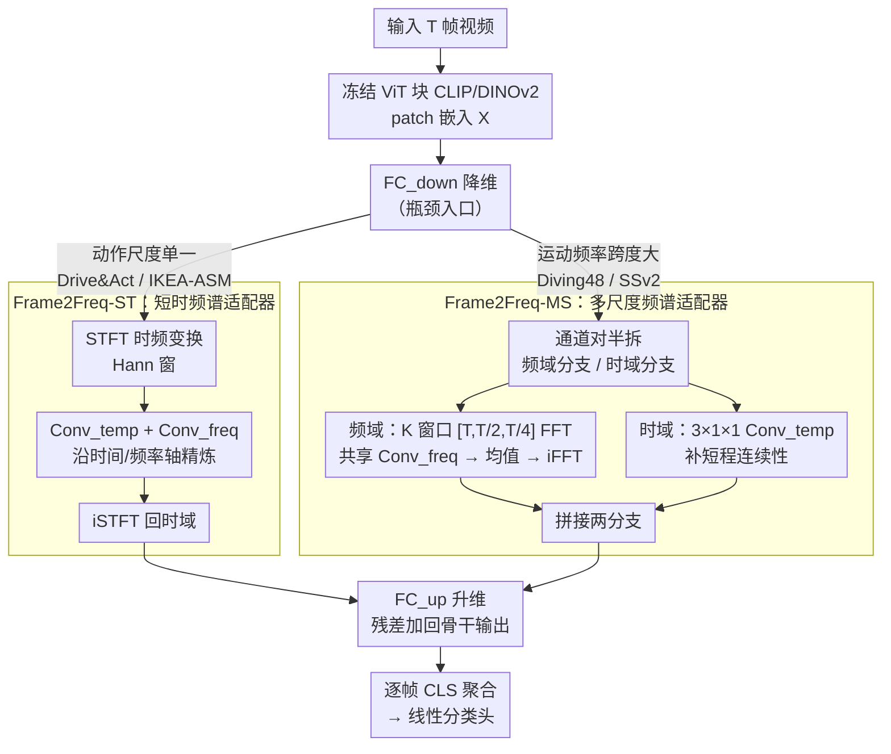

<!-- 由 src/gen_stubs.py 自动生成 -->
# Frame2Freq: Spectral Adapters for Fine-Grained Video Understanding

**会议**: CVPR2026  
**arXiv**: [2602.18977](https://arxiv.org/abs/2602.18977)  
**代码**: [th-nesh/Frame2Freq](https://github.com/th-nesh/Frame2Freq)  
**领域**: 视频理解  
**关键词**: 频域适配器, 参数高效微调, 图像-视频迁移, 细粒度动作识别, 快速傅里叶变换, Vision Foundation Model

## 一句话总结

提出 Frame2Freq——首个在频域进行时序建模的 PEFT 适配器族，通过 FFT 将冻结 VFM 的帧嵌入变换到频谱空间并学习频带级滤波，在五个细粒度动作识别基准上以 <10% 的可训练参数超越全量微调模型。

## 背景与动机

1. **图像预训练骨干迁移到视频的核心痛点**：现有时域适配器（卷积/注意力）只捕获静态图像线索和极快闪烁变化，忽略了中频运动信号，而中频段恰好承载了区分细粒度动作（如"开瓶"vs"关瓶"）的关键信息。
2. **频谱区分性分析揭示偏差**：作者受 ANOVA 启发设计了 Frequency Discriminability Analysis，定量展示 ST-Adapter 等传统适配器将判别能量集中在低频和高频两端，中频段利用严重不足。
3. **细粒度动作的频域特征天然明显**：在 Diving48 上对视频做 3D FFT 后，不同翻腾次数/身体姿态呈现出截然不同的频谱模式（翻腾越多→高频能量越高，tuck vs pike→十字方向分量不同），这在 RGB 空间难以观察。
4. **对称动作对的区分需求迫切**：Drive&Act、IKEA-ASM 等数据集中大量存在"拿起"vs"放下"等近对称动作对，仅靠空间外观无法区分，必须精确捕获运动相位差异。
5. **全量微调成本过高**：VFM 参数量达上亿级别，全量微调不现实；而现有 PEFT 方法（AIM、DualPath、ST-Adapter）均在时域操作，未利用频域结构。
6. **领域特定小数据集的泛化挑战**：驾驶监控、家具组装、人机交互等场景数据量仅数千条，需要高效适配器在少量参数下获得强泛化能力。

## 方法详解

### 整体框架

Frame2Freq 想解决的是：图像预训练的 VFM 迁到视频时，现有时域适配器只盯着静态线索和极快闪烁，恰好漏掉了区分细粒度动作的中频运动信号。它的做法是在冻结 ViT 骨干（CLIP/DINOv2）每个 Transformer 块后插一个轻量适配器：输入 $T$ 帧经 ViT 得到 patch 嵌入 $X \in \mathbb{R}^{T \times N \times D}$，适配器走 $\text{FC}_{down} \to \text{频域/时域分支} \to \text{FC}_{up}$ 的瓶颈结构，把时序信息搬到频谱空间做滤波，再残差加回骨干输出，最后逐帧 CLS 聚合接线性分类头。频域/时域分支有两种实现变体——Frame2Freq-ST 与 Frame2Freq-MS，分别对应单尺度和多尺度的运动数据集。

### 关键设计

**1. Frame2Freq-ST：短时频谱适配器，专治动作尺度单一的领域数据**

对动作频率跨度不大的场景（Drive&Act、IKEA-ASM），用短时变换就够。ST 对降维后的嵌入沿时间轴做 STFT（Hann 窗），得到时频联合表示 $\tilde{X} \in \mathbb{C}^{B \times N \times F \times T' \times C_a}$，再用两个深度可分离 3D 卷积分别沿时间轴（$\text{Conv}_{temp}$）和频率轴（$\text{Conv}_{freq}$）精炼，捕获短时过渡和邻近频带关系，iSTFT 回时域后经 $\text{FC}_{up}$ 恢复维度。整支只有 3.5M 可训练参数，比同框架的 ST-Adapter 还轻，却能直接对准被忽视的中频段。

**2. Frame2Freq-MS：多尺度频谱适配器，覆盖运动频率跨度大的复杂场景**

像 Diving48、SSv2 这种一个动作里混着快慢多种运动，单一窗口抓不全，需要多尺度。MS 把降维后的通道对半拆成频域分支 $X_{freq}$ 和时域分支 $X_{temp}$：频域分支在 $K$ 个窗口 $\{w_k\} = [T, T/2, T/4]$ 下分别做 FFT，各尺度经共享深度卷积 $\text{Conv}_{freq}$ 精炼后取平均再 iFFT 回时域；时域分支则用 $(3\times1\times1)$ 卷积 $\text{Conv}_{temp}$ 补短程时序连续性。两分支拼接后过 $\text{FC}_{up}$ 恢复，共 7.3M 可训练参数。多窗口让它能同时看清不同时间尺度的运动相位，这正是区分对称动作对的关键。

### 损失函数 / 训练策略

只用标准交叉熵分类损失，无额外辅助损失；训练 60 epoch，均匀采样 16 或 32 帧。

## 实验关键数据

### 主实验结果

| 数据集 | 方法 | Backbone | 可训练参数 | Top-1 Acc |
|---------|------|----------|-----------|-----------|
| Diving48 | ST-Adapter | ViT-B/16 CLIP | 7M | 90.4% |
| Diving48 | **Frame2Freq-MS** | ViT-B/16 CLIP | 7.3M | **92.2%** (+1.8) |
| Diving48 | ORViT (全量) | ViT-B/16 | 160M | 88.0% |
| SSv2 | ST-Adapter | ViT-B/16 CLIP | 14M | 69.5% |
| SSv2 | **Frame2Freq-MS** | ViT-B/16 CLIP | 14M | **70.4%** (+0.9) |
| SSv2 | **Frame2Freq-MS** | ViT-L/14 CLIP | 19M | **72.1%** |
| Drive&Act | ST-Adapter | DINOv2 | 7.1M | 75.2% |
| Drive&Act | **Frame2Freq-ST** | DINOv2 | 3.5M | **82.0%** (+6.8) |
| IKEA-ASM | ST-Adapter | DINOv2 | 7.1M | 70.5% |
| IKEA-ASM | **Frame2Freq-ST** | DINOv2 | 3.5M | **78.1%** (+7.6) |
| HRI-30 | ST-Adapter | DINOv2 | 7.1M | 85.5% |
| HRI-30 | **Frame2Freq-MS** | DINOv2 | 7.3M | **89.8%** (+4.3) |

在对称动作对上优势尤为显著：Drive&Act 对称子集 +10.5%（66.4→77.1），IKEA-ASM 对称子集 +11.8%（68.5→80.3）。

### 消融实验

| 消融项 | 设置 | SSv2 | Diving48 |
|--------|------|------|----------|
| 仅频域卷积 | — | 67.5 | 90.9 |
| 仅时域卷积 | — | 69.1 | 90.4 |
| **频域+时域（Frame2Freq）** | — | **69.7** | **92.2** |
| 多尺度窗口 [T] | 单尺度 | 69.0 | 91.5 |
| 多尺度窗口 [T,T/2,T/4] | 三尺度 | **69.7** | **92.2** |
| 多尺度窗口 [T,T/2,T/4,T/8] | 四尺度 | 69.4 | 91.0 |
| 适配器仅放 1-4 层 | 浅层 | 55.8 | 67.6 |
| 适配器放全部 1-12 层 | 全层 | **69.7** | **92.2** |

- 频域+时域互补效果最佳；三尺度窗口为最优配置，再加细粒度（T/8）反而饱和下降。
- 简单 mean/concat 融合优于 gated 和 learnable fusion，说明两分支已天然互补。

## 亮点

- **首创频域 PEFT 适配器**：首次将 FFT/STFT 用于冻结 VFM 的图像→视频时序适配，开辟全新方向。
- **理论分析扎实**：Frequency Discriminability Analysis（受 ANOVA 启发）定量揭示了现有适配器的频谱偏差，为方法设计提供了有力动机。
- **两种变体灵活适配**：Frame2Freq-ST（3.5M 参数）适合单尺度领域数据，Frame2Freq-MS（7.3M）适合复杂多尺度场景，用户可按需选择。
- **参数效率极高**：以 <10% 的可训练参数在 4/5 个数据集上超越全量微调模型。
- **对称动作识别突破**：在最具挑战性的对称动作对上取得 +10% 以上的提升。

## 局限与展望

- SSv2 上增益最小（+0.9%），在粗粒度标签场景下频域建模优势有限。
- Frame2Freq-ST 在 Diving48 上仅 75.1%（单尺度难以处理多组成复合运动），两变体选择需要先验知识。
- 仅使用标准交叉熵损失，未探索频域对比损失或频带级监督信号。
- 当前仅验证了 ViT-B/16 和 ViT-L/14 两种骨干，未扩展到更大模型（如 ViT-G）。
- STFT 窗口大小和多尺度配置 $[T, T/2, T/4]$ 为手工设定，未做自适应学习。
- 未探索小波变换、多分辨率滤波器等更丰富的时频分析工具（作者在结论中也提到了此方向）。

## 与相关工作的对比

- **vs ST-Adapter**：Frame2Freq 直接构建在 ST-Adapter 框架之上，将时域深度卷积替换/增强为 FFT 分支，在所有基准上均有提升（+0.9~+7.6%）。
- **vs AIM / DualPath**：这些方法同为 PEFT 但仅在时域操作，Diving48 上落后 Frame2Freq-MS 约 3.5%。
- **vs DTF-Transformer**：DTF 也用了 1D FFT 滤波器做视频时序建模，但需要全量微调（88M 参数），Frame2Freq 以 7.3M 参数达到相当甚至更优的性能。
- **vs VFPT**：唯一使用频域的 PEFT 方法，但仅用于空间域适配，Frame2Freq 首次将频域推向时序维度。
- **vs 全量微调（ORViT、Uniformerv2）**：Frame2Freq-MS 以不到 1/10 的参数量在 Diving48 上超出 ORViT 4.2%，在 SSv2 上与 Uniformerv2 持平。

## 评分

- 新颖性: ⭐⭐⭐⭐⭐ — 频域 PEFT 适配器为全新范式，频谱区分性分析提供了坚实的理论支撑
- 实验充分度: ⭐⭐⭐⭐⭐ — 5 个数据集、两种骨干、few-shot、多维度消融，实验设计全面
- 写作质量: ⭐⭐⭐⭐ — 动机清晰、分析深入，但公式符号偶有冗余
- 价值: ⭐⭐⭐⭐⭐ — 为 VFM 视频适配开辟频域新路线，对细粒度动作识别有即时实用价值

<!-- RELATED:START -->

## 相关论文

- [\[CVPR 2026\] Text-guided Fine-Grained Video Anomaly Understanding](text-guided_fine-grained_video_anomaly_understanding.md)
- [\[CVPR 2026\] Mistake Attribution: Fine-Grained Mistake Understanding in Egocentric Videos](mistake_attribution_fine-grained_mistake_understanding_in_egocentric_videos.md)
- [\[CVPR 2026\] UFVideo: Towards Unified Fine-Grained Video Cooperative Understanding with Large Language Models](ufvideo_towards_unified_fine-grained_video_cooperative_understanding_with_large_.md)
- [\[AAAI 2026\] FineVAU: A Novel Human-Aligned Benchmark for Fine-Grained Video Anomaly Understanding](../../AAAI2026/video_understanding/finevau_a_novel_human-aligned_benchmark_for_fine-grained_video_anomaly_understan.md)
- [\[ICLR 2026\] Let's Split Up: Zero-Shot Classifier Edits for Fine-Grained Video Understanding](../../ICLR2026/video_understanding/lets_split_up_zero-shot_classifier_edits_for_fine-grained_video_understanding.md)

<!-- RELATED:END -->
