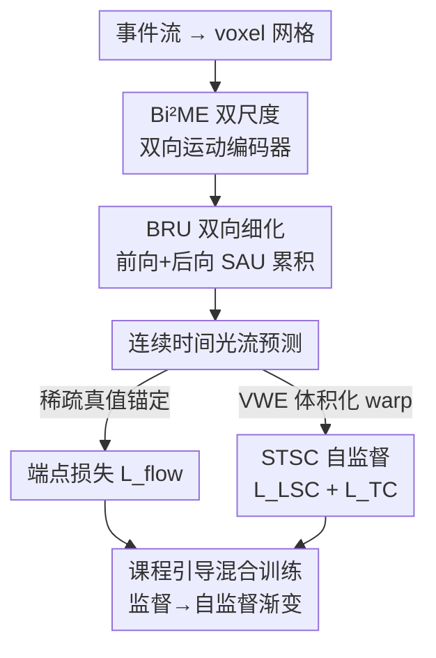

# From Contrast to Consistency: Rethinking Event-based Continuous-Time Optical Flow Estimation

**会议**: CVPR 2026  
**arXiv**: [2605.25570](https://arxiv.org/abs/2605.25570)  
**代码**: 待确认  
**领域**: 视频理解 / 事件相机 / 光流估计  
**关键词**: 事件相机, 连续时间光流, 时空结构一致性, 自监督, 课程学习

## 一句话总结
针对事件相机连续时间光流缺乏密集真值、而对比度最大化（CM）又只追求"对齐到一点"忽略轨迹连续性的问题，本文提出**时空结构一致性（STSC）** 自监督范式，把事件看成时空流形上的采样而非待对齐的散点，配合双向多尺度网络和课程引导的混合监督训练，在 DSEC-Flow / MVSEC 上同时刷新标准光流和高时间分辨率（HTR）光流的 SOTA（DSEC EPE 0.663，相对 BFlow 降 11.6%）。

## 研究背景与动机
**领域现状**：事件相机以微秒级延迟、高动态范围异步记录亮度变化，天然适合做高时间分辨率（HTR）的连续时间光流。当前主流是两条路：一是 RAFT 系的监督学习（E-RAFT、TMA、IDNet 等），靠事件 voxel 网格 + 相关体迭代细化；二是自监督的对比度最大化（Contrast Maximization, CM），通过让"warp 后事件图像（Image of Warped Events, IWE）"更锐利来反推运动。

**现有痛点**：连续时间光流的根本瓶颈是**缺乏时序密集的真值标注**——真实数据集只有稀疏的轨迹端点（LTR-GT），监督学习无法充分利用事件的时间精度。而 CM 自监督的核心目标是"把所有事件 warp 到同一参考时刻、让 IWE 尽量锐利"，这个目标**只关心终点对齐、完全丢掉了运动轨迹的时间连续性和结构连贯性**：复杂/非线性运动下，事件被强行压扁到一帧，轨迹被扭曲，还容易陷入"投影坍缩（Projection Collapse）"。即便像 BFlow 用 Bézier 曲线显式参数化整条轨迹，在真实数据上也只有稀疏端点约束，中间轨迹缺乏先验、物理上不可信。

**核心矛盾**：CM 把事件当成"无序的、待对齐的散点"，对齐目标（锐利 IWE）和"物理真实的连续运动场"之间存在错位——锐利不等于轨迹正确。

**切入角度与核心 idea**：作者观察到，同一物理表面触发的事件在运动中**天然保持局部结构、构成一个时序稳定的时空流形**。于是换个视角：不再把事件当散点对齐，而是把它们当作**内在结构化时空流形上的采样**。据此提出**时空结构一致性（STSC）**，从两个互补角度约束学习——局部结构稳定 + 轨迹连续，引导网络重建真实运动场而非只优化端点对齐。

## 方法详解

### 整体框架
STSC-Flow 的输入是一段事件流（转成 voxel 网格），输出是连续时间光流。整条管线分两块：**自监督目标（STSC）** 提供"密集运动先验"，**网络架构（Bi²ME + BRU）** 负责把多尺度、双向时序的运动特征抽出来并细化，二者由**课程引导的锚定混合训练**缝合——训练初期靠稀疏真值锚定运动尺度，后期逐步切换到 STSC 自监督。

STSC 的关键载体是**体积化 warp 事件（Volumetric Warped Events, VWE）**：传统 CM 把所有事件 warp 到单一参考时刻（IWE，丢掉时间维），VWE 则把每个时间 bin 对齐到共同参考中心、**保留 bin 内的相对时间结构**，得到一个共享参考系下的 3D 时空体。在这个体上施加两条自监督损失：局部结构一致性 $\mathcal{L}_{\mathrm{LSC}}$（同一空间位置在不同相对时间相上应保持结构稳定）和轨迹一致性 $\mathcal{L}_{\mathrm{TC}}$（不同源 bin 应沿一致运动轨迹）。

网络侧：voxel 网格先经 **Bi²ME** 双尺度双向编码器抽运动特征 → **BRU** 双向细化模块（内含两个反向遍历的 SAU）做前向/后向时序累积 → 聚合双向状态得到最终连续光流。

### 关键设计

**1. 时空结构一致性 STSC：用流形先验替代"锐利 IWE"目标**

这是全文的根基，直接针对 CM 只追求端点对齐、丢掉轨迹连续性的痛点。作者先构造 VWE：给定参考时刻 $t_0$，每个 bin 中心 $c_b$ 的时移为 $\Delta_b = t_0 - c_b$，bin 内事件保留相对时间 $\xi_i = t_i - c_b$，得到 $\mathrm{VWE}_b(\mathbf{x},\xi)=\sum_{i}\sigma_i\,\kappa_s(\mathbf{x}-\mathcal{W}_{t_i\to t_i+\Delta_b}(\mathbf{x}_i))\,\kappa_t(\xi-\xi_i)$，对所有 bin 求和得完整体 VWE。和单时刻 warp 不同，它同时保留了 **跨 bin 对齐** 和 **bin 内时间微结构**。

在 VWE 上施加两条互补约束。**局部结构一致性** $\mathcal{L}_{\mathrm{LSC}}$：先对每个相对时间 $\xi$ 用核 $w_\xi$ 聚合邻域得 $\mathcal{V}(\mathbf{x},\xi)$，再取所有相对时间相的均值结构 $\overline{\mathcal{V}}(\mathbf{x})=\frac{1}{K}\sum_k \mathcal{V}(\mathbf{x},\xi_k)$，然后惩罚每个相位对均值的偏离 $\mathcal{L}_{\mathrm{LSC}}=\frac{1}{K}\sum_k\sum_{\mathbf{x}}\|\mathcal{V}(\mathbf{x},\xi_k)-\overline{\mathcal{V}}(\mathbf{x})\|_2^2$——逼着对齐后的事件体在时间轴上保持稳定局部结构，而不是因运动补偿不准而忽明忽暗。**轨迹一致性** $\mathcal{L}_{\mathrm{TC}}$：对每个归一化 bin 体算时空梯度场 $\mathcal{G}_b=\nabla_{(\mathbf{x},\xi)}\mathrm{norm}(\mathrm{VWE}_b)$，再最小化梯度场跨源 bin 的方差 $\mathcal{L}_{\mathrm{TC}}=\frac{1}{K}\sum_k\sum_{\mathbf{x}}\mathrm{Var}_b(\mathcal{G}_b(\mathbf{x},\xi_k))$——逼着相邻时刻的事件沿平滑一致的轨迹运动。两条损失合起来等于给中间轨迹补上了 CM 缺失的密集物理先验，所以在更高采样率下轨迹反而更稳（见 Table 5）

**2. Bi²ME 双尺度双向运动编码器：把运动锚定到时间边界**

针对运动在空间上异质（既有全局大位移又有细小结构）的问题，Bi²ME 用双分辨率分支：低分辨率 $\{F_L^t\}$ 抓全局运动上下文，高分辨率 $\{F_H^t\}$ 保细节结构。它把运动**双向锚定到时间窗的首尾边界**，构造前向/后向相关体 $C_f^t = F_L^1 (F_L^t)^\top/\sqrt{D}$、$C_b^t = F_L^t (F_L^B)^\top/\sqrt{D}$（$F_L^1, F_L^B$ 是首/末 bin 特征）。同时在高分辨率特征上做运动感知差分（MADiff）$M_f^t = F_H^t - F_H^1$、$M_b^t = F_H^t - F_H^B$，增强对细结构的敏感度（这正是 LSC 所需的）。相关体、差分特征与原特征流融合，输出双向运动增强特征序列喂给细化模块

**3. BRU 双向细化 + SAU 跨尺度交织：用二阶中心差分换无偏时序特征**

单向递归更新只相当于一阶差分，对遮挡和加速度不鲁棒。作者把"结合过去与未来 = 二阶中心差分近似"作为理论依据（推导在补充材料），让 **BRU** 用两个反向遍历的 SAU 做对称前向（$t{=}1{\to}B$）/后向（$t{=}B{\to}1$）累积，末步融合双向隐状态，得到同时利用过去和未来证据的无偏估计。每个 **SAU（Scale Alternating Unit）** 是双分支递归结构：1/8 分辨率的全局记忆单元 GMU + 1/4 分辨率的细节细化单元 DRU，再用 **Weaving Gate** 自适应混合两支信息——$g_L^t = \sigma(\mathrm{Conv}_{3\times3}([h_L^{t-1}, \tilde{h}_H^{t-1}, x_L^t]))$，$h_L^{\mathrm{mix}} = g_L^t \odot \tilde{h}_H^{t-1} + (1-g_L^t)\odot h_L^{t-1}$，让粗尺度时序运动和细尺度空间细节交替耦合，兼顾空间精度与时间一致性

**4. 锚定式课程引导混合训练：从监督点约束平滑过渡到自监督流形正则**

虽然 STSC 理论上能纯自监督学连续光流，但从零直接优化常不稳定、易坍缩。作者用稀疏真值做"初始化锚"，按课程学习渐变：监督权重 $\lambda_{flow}(e)=\max(0, 1-e/E_c)$ 随 epoch $e$ 线性衰减（$E_c$ 是课程长度），自监督权重 $\lambda_{LSC}(e)=\lambda_{TC}(e)=(1-\lambda_{flow}(e))/2$ 相应上升，总目标 $\mathcal{L}=\lambda_{flow}\mathcal{L}_{flow}+\lambda_{LSC}\mathcal{L}_{LSC}+\lambda_{TC}\mathcal{L}_{TC}$。早期靠真值（多尺度端点 $\ell_1$ 损失 $\mathcal{L}_{flow}=\sum_{j=1}^2\gamma_j\|\mathbf{u}^{gt}-\mathbf{u}^j\|_1$，$\gamma_1{=}0.25,\gamma_2{=}0.75$）立住运动尺度和全局结构，后期逐渐交给 STSC 利用密集时间一致性线索。这样实现"10 Hz 监督训练、理论上无界推理时间分辨率"

### 损失函数 / 训练策略
总损失为三项加权和（公式 16），权重由课程进度 $e/E_c$ 控制。监督端点损失偏重细尺度（$\gamma_2{=}0.75$）。优化器 Adam + One-Cycle，峰值学习率 $1.3\times10^{-4}$；DSEC-Flow 训 200 epoch（batch 2，100 ms 窗分 $B{=}15$ bin），MVSEC 训 30 epoch（batch 4，dt=1 用 $B{=}5$、dt=4 用 $B{=}15$）；连续运动用二次 Bézier 轨迹（控制点参数化）建模，每样本 4 次迭代更新；单卡 RTX 4090。

## 实验关键数据

### 主实验
DSEC-Flow（HTR 标记表示高时间分辨率方法）：

| 方法 | EPE↓ | 3PE↓ | 2PE↓ | 1PE↓ | AE↓ | FWL↑ | HTR |
|------|------|------|------|------|------|------|-----|
| BFlow（前best HTR） | 0.750 | 2.44 | 4.41 | 11.90 | 2.68 | 1.98 | ✓ |
| ResFlow | 0.754 | 2.50 | 4.24 | 11.22 | 2.73 | 2.14 | ✓ |
| IDNet（前best LTR） | 0.719 | 2.04 | 3.50 | 10.07 | 2.72 | 1.97 | |
| EDCFlow | 0.720 | 2.10 | 3.60 | 10.00 | 2.65 | – | |
| **Ours** | **0.663** | **1.60** | **2.67** | **7.94** | **2.53** | **2.18** | ✓ |

- EPE 0.663，比前 best LTR（IDNet 0.719）相对降 7.8%，比 HTR 最强 BFlow（0.750）相对降 11.6%。
- 鲁棒性指标提升更大：3PE 比 IDNet 降 21.6%、比 BFlow 降 34.4%；2PE 比 IDNet 降 23.7%、比 BFlow 降 39.5%。
- HTR 专用的 FWL 2.18，超过前 best HTR 方法 ResFlow（2.14）。

MVSEC（两种时间间隔）：

| 方法 | dt=1 EPE↓ | dt=1 %Out↓ | dt=4 EPE↓ | dt=4 %Out↓ |
|------|-----------|------------|-----------|------------|
| EDCFlow（前best） | 0.23 | 0.00 | 0.67 | 0.85 |
| TMA | 0.25 | 0.07 | 0.70 | 1.08 |
| **Ours** | **0.22** | **0.00** | **0.62** | **0.78** |

稀疏事件条件（dt=4）下 EPE/%Out 比 EDCFlow 相对改善 7.5%/8.2%；稠密条件（dt=1）EPE 最低且 %Out 持平最佳。

### 消融实验
架构 + STSC 逐组件叠加（DSEC-Flow，IDNet backbone 起步）：

| 配置 | EPE↓ | 3PE↓ | 1PE↓ | FWL↑ |
|------|------|------|------|------|
| Baseline | 0.728 | 2.11 | 10.03 | 1.97 |
| + Bi²ME | 0.703 | 1.92 | 9.15 | 1.97 |
| + Bi²ME + SAU | 0.688 | 1.73 | 8.65 | 1.99 |
| + Bi²ME + SAU + BRU | 0.672 | 1.62 | 8.22 | 2.04 |
| + 全部（含 STSC） | **0.663** | **1.60** | **7.94** | **2.18** |

SAU 设计对比（Table 4）：单尺度 Concat+GRU 0.687 / 双尺度并行 GRU 0.684 / SAU（含跨尺度交互）0.672 EPE——跨尺度交织优于简单拼接或独立分支。

STSC 对 HTR 轨迹质量的影响（Table 5，不同采样率下 FWL↑）：

| 方法 | 10 Hz | 50 Hz | 100 Hz | 150 Hz |
|------|-------|-------|--------|--------|
| BFlow | 2.05 | 2.02 | 2.00 | 1.98 |
| Ours (w/o STSC) | 2.04 | 2.01 | 1.99 | 1.99 |
| Ours (STSC) | **2.07** | **2.14** | **2.17** | **2.18** |

### 关键发现
- **STSC 是 HTR 质量的关键**：没有 STSC 时 FWL 随采样率升高而退化（甚至略降），加上 STSC 后 FWL 随分辨率单调上升（2.07→2.18），而 BFlow 反向下降（2.05→1.98）——说明 STSC 真正约束了中间轨迹的物理真实性，采样越密优势越明显。
- **架构贡献递进**：Bi²ME 单独把 EPE 从 0.728 降到 0.703（−3.4%、3PE −9%），SAU 再降到 0.688，BRU 再到 0.672；最后 STSC 把 EPE 收到 0.663 并把 FWL 从 2.04 拉到 2.18，说明架构主要降 EPE、STSC 主要提轨迹质量。
- **BRU 的双向累积在遮挡/边界区贡献最大**，定性图（Fig. 5）显示加 BRU 后运动边界更锐利连贯。

## 亮点与洞察
- **视角转换是真正的"啊哈"点**：把事件从"待对齐的无序散点"重新解读为"结构化时空流形上的采样"，由此 CM 的"锐利 IWE"目标被替换成"流形结构一致性"，一句话点破了 CM 范式的根本缺陷（对齐≠轨迹正确）。
- **VWE 的设计很巧**：传统 IWE 把所有事件压到一帧丢掉时间维，VWE 只对齐 bin 中心、保留 bin 内相对时间，得到 3D 时空体——这是后续两条一致性损失能成立的前提，思路可迁移到任何"需要保留时序微结构的事件聚合"任务。
- **课程引导把"监督锚定"和"自监督流形正则"无缝缝合**：用线性衰减的真值权重避免纯自监督从零训练的坍缩，是稀疏标注场景下很实用的工程范式。
- **二阶中心差分的类比**很有解释力：把双向递归累积解释成比单向（一阶差分）更无偏的二阶近似，给"为什么要双向"提供了理论说法而非纯启发式。

## 局限与展望
- **VWE / STSC 的计算开销**：在 3D 时空体上算邻域聚合、跨 bin 梯度方差，相比单帧 IWE 应该更重，论文未报告训练/推理的显存与速度代价，难判断实时性。
- **依赖稀疏真值锚定**：课程训练前期仍需 GT 立住运动尺度，并非完全无监督；在完全没有任何标注的新传感器/场景上能否启动，存疑。
- **轨迹用二次 Bézier 建模**：对高度非线性或多次变向的复杂运动，二次曲线的表达力可能不足，作者也把"更强运动先验"列为未来方向。
- **评测集中在 DSEC/MVSEC 两个驾驶向数据集**：在更剧烈、更稀疏的非驾驶场景（如快速机械、微观运动）上的泛化未充分验证。

## 相关工作与启发
- **vs CM 系（MultiCM / TamingCM / Motion-prior CM）**: 它们最大化 IWE 锐利度做自监督，只关心端点对齐、忽略时间连续性，复杂运动下轨迹扭曲且易投影坍缩；本文用 STSC 在保留时序结构的 VWE 上约束局部结构 + 轨迹一致，提供 CM 缺失的密集运动先验。
- **vs BFlow（显式轨迹参数化）**: BFlow 用 Bézier 曲线显式建模整条轨迹，但真实数据上只有稀疏端点约束、中间轨迹无先验，FWL 随采样率下降；本文同样用 Bézier 建模运动，但补上 STSC 自监督，FWL 随采样率单调上升，HTR 轨迹更可信。
- **vs RAFT 系监督方法（E-RAFT / TMA / IDNet / EDCFlow）**: 它们是 LTR（长时分辨率）端点监督的强 baseline，但受限于稀疏真值、不直接建模连续轨迹；本文以 IDNet backbone 为消融起点，叠加 Bi²ME/SAU/BRU 架构与 STSC，在标准 EPE 和 HTR FWL 上同时超过它们。
- **vs 累积/残差隐式监督（EVA-Flow / ResFlow）**: 它们用稀疏 GT 隐式监督 HTR 流，但优化目标含糊、不保证中间轨迹的物理真实；STSC 用显式的结构 + 轨迹一致性把"物理可信"写进损失。

## 评分
- 新颖性: ⭐⭐⭐⭐⭐ 把事件从"待对齐散点"重解读为"时空流形采样"、用 STSC 替代 CM 的锐利目标，是范式级的视角创新。
- 实验充分度: ⭐⭐⭐⭐ 两个主流 benchmark + 多尺度 FWL 分析 + 逐组件消融都到位，但缺计算开销报告和更多样场景泛化。
- 写作质量: ⭐⭐⭐⭐ 动机推导清晰、公式完整，VWE/STSC 概念解释到位；部分模块（SAU/BRU 内部）依赖补充材料。
- 价值: ⭐⭐⭐⭐⭐ 同时刷新标准与 HTR 光流 SOTA，且 STSC 思路对整个事件视觉的连续时间建模有普适启发。

<!-- RELATED:START -->

## 相关论文

- [\[ECCV 2024\] Motion-prior Contrast Maximization for Dense Continuous-Time Motion Estimation](../../ECCV2024/video_understanding/motion-prior_contrast_maximization_for_dense_continuous-time_motion_estimation.md)
- [\[CVPR 2026\] Efficient All-Pairs Correlation Volume Sampling for Optical Flow Estimation](efficient_all-pairs_correlation_volume_sampling_for_optical_flow_estimation.md)
- [\[CVPR 2026\] U2Flow: Uncertainty-Aware Unsupervised Optical Flow Estimation](u2flow_uncertainty_aware_unsupervised_optical_flow_estimation.md)
- [\[CVPR 2026\] One-Shot Flow, Any-Time Frame: A Bidirectional Warping Framework for Event-Based Video Frame Interpolation](one-shot_flow_any-time_frame_a_bidirectional_warping_framework_for_event-based_v.md)
- [\[CVPR 2025\] EDCFlow: Exploring Temporally Dense Difference Maps for Event-based Optical Flow Estimation](../../CVPR2025/video_understanding/edcflow_exploring_temporally_dense_difference_maps_for_event-based_optical_flow_.md)

<!-- RELATED:END -->
