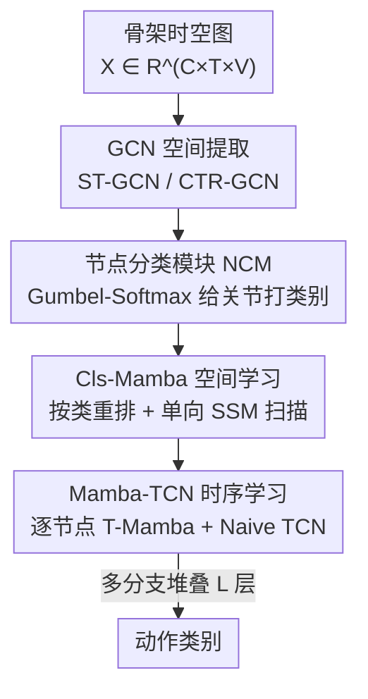

# Gamba: Mamba-based Graph Convolutional Network with Dynamic Graph Topology Learning for Action Recognition

**会议**: CVPR 2026  
**论文**: [CVF Open Access](https://openaccess.thecvf.com/content/CVPR2026/html/Zhou_Gamba_Mamba-based_graph_convolutional_network_with_dynamic_graph_topology_learning_CVPR_2026_paper.html)  
**代码**: https://github.com/RCEricZhou/Gamba  
**领域**: 视频理解  
**关键词**: 骨架动作识别、Mamba、图卷积网络、动态图拓扑、状态空间模型  

## 一句话总结
针对"直接把 GCN 和 Mamba 堆在一起会让 Mamba 沿着物理上不相邻的关节顺序乱扫"这一问题，Gamba 先用一个节点分类模块把骨架关节按运动类别重排成对 Mamba 友好的序列，再用单向扫描的状态空间模型同时建模类内局部与类间全局关系，配合 Mamba-TCN 做时序建模，在 NTU RGB+D 60/120 与 NW-UCLA 上以更低的自注意力开销刷到 SOTA。

## 研究背景与动机

**领域现状**：基于骨架的人体动作识别（HAR）目前主流是图卷积网络（GCN）。从 ST-GCN 开始确立了"关节为节点、骨骼/运动为边"的时空图范式；后续工作分两条线——静态拓扑（MS-G3D、HD-GCN 等用预定义固定结构）和动态拓扑（2s-AGCN、CTR-GCN、InfoGCN 等用自注意力生成自适应邻接矩阵）。

**现有痛点**：作者指出三个具体问题。其一，静态拓扑死守人体物理连接，无法捕捉"复杂动作里跨关节协同"这类非物理连接相关性；动态拓扑虽然能学，但自注意力做全局两两相似度计算开销大。其二，时序侧的 TCN 感受野受限——单尺度卷积核抓不住不同粒度的动作模式，多尺度 TCN 又只是线性加权/通道拼接，无法表达细粒度短时序与全局长时序之间的非线性耦合。其三，现有把 Mamba 引入 GCN 的工作（如双流框架、Simba）只是简单堆叠两个模块，忽视了**图结构数据与 Mamba 序列建模之间的内在矛盾**。

**核心矛盾**：Mamba 本质是 RNN 的变体，只能吃一维序列且对 token 顺序敏感；而骨架是邻接矩阵描述的图，关节在内存里"连续"但物理上未必相邻。如果把原生节点顺序直接喂给 Mamba，它的顺序学习机制会从"内存相邻但物理无关"的关节对里学到虚假相关（spurious correlation）。给图数据强行套图像里的多向扫描（如 Vision Mamba 的 8 向扫描）既缺物理依据又带来冗余计算。

**本文目标**：在一个统一框架里，既保留 GCN 的结构表达，又发挥 Mamba 高效建模长程依赖的优势，同时让扫描顺序符合骨架的运动语义。

**核心 idea**：用"语义引导的节点分类 + 重排"替代盲目的多向扫描——先给每个关节分配类别标签、把同类关节聚到一起形成对状态空间模型友好的序列，再用单向扫描一次性拿到类内局部与类间全局关系。

## 方法详解

### 整体框架
Gamba 的骨干沿用 DeGCN 的多分支结构（$L_2$ 个对称镜像分支并行，每个分支串联 $L_1$ 个基本单元）。每个基本单元由两部分串行组成：先是负责空间建模的 **Mamba-GCN 模块**（GCN + 分类引导的 Cls-Mamba），再是负责时序建模的 **Mamba-TCN 模块**。

数据流是这样的：原始骨架先过 GCN 做空间特征提取（第一层用 ST-GCN，后续层用 CTR-GCN），通过邻接矩阵聚合邻居信息拿到拓扑关系；GCN 的输出送入**节点分类模块（NCM）**给每个关节打类别标签；根据分类结果把节点序列重排成"最适合状态空间模型处理"的顺序，再喂给 **S-Mamba** 抽取 GCN 可能漏掉的局部运动与全局时空特征——NCM + S-Mamba 合起来就是 **Cls-Mamba**。之后进入时序侧：**T-Mamba** 沿时间维捕捉每个关节跨帧的长程依赖，**Naive TCN** 再做局部聚合，两者构成 **Mamba-TCN**。

GCN 用标准谱图卷积：

$$H^{(l+1)} = \sigma\!\left(\hat{D}^{-\frac{1}{2}}\hat{A}\hat{D}^{-\frac{1}{2}}H^{(l)}W^{(l)}\right)$$

其中 $\hat{A}=A+I$ 是带自连接的邻接矩阵，$\hat{D}$ 是度矩阵。Mamba 用到的状态空间模型（SSM）离散形式为 $h_k = \bar{A}h_{k-1} + \bar{B}x_k,\; y_k = \bar{C}h_k + \bar{D}x_k$，其中 $\bar{A}=\exp(\Delta A)$、$\bar{B}=((\Delta A)^{-1}(\exp(\Delta A)-I))\cdot\Delta B$，靠选择性机制以线性复杂度建模长程依赖。

### 关键设计

**1. 节点分类模块（NCM）：给关节打"运动类别"标签，把图序列重排成 Mamba 能读懂的顺序**

这一步直击"原生节点顺序对 Mamba 没有物理意义"的痛点。作者的观察是：关节之间的相关性和它所属的运动类别强相关——比如"摸头"动作里，右手与左手才是关键协同节点，而它们在原始关节编号里未必相邻。NCM 因此先用 MLP 对每个节点打分 $Y=\text{LogSoftmax}(\text{MLP}(X))$，再用 Gumbel-Softmax 采样出离散类别：

$$g_i = -\log(-\log(u_i)),\quad y_i = \frac{\exp((\log x_i + g_i)/\tau)}{\sum_{j=1}^{k}\exp((\log x_j + g_j)/\tau)}$$

其中 $u_i\sim\text{Uniform}(0,1)$ 提供噪声 $g_i$，$\tau$ 是控制输出平滑度的温度。Gumbel 噪声让节点不会被永远钉死在某一类，既增加数据多样性又抑制过拟合。作者强调这是**首个给运动关节赋予类别标签来辅助相关性学习**的工作；NCM 全程无监督，和整个模型联合优化。重排的好处是把同类关节聚到一起，让后续 SSM 的隐状态演化与骨架物理连通性一致，从而学到语义上更有意义的特征。

**2. Cls-Mamba 动态图空间学习：单向扫描同时拿下类内局部与类间全局关系**

这一步是为了"在不做多向扫描的前提下，既抓局部又抓全局"。拿到 NCM 的分类结果后，先把同类节点聚合，再为每一类生成优化序列送进 SSM。对第 $i$ 类（共 $k$ 类、第 $i$ 类含 $n_i$ 个节点）做类内扫描：

$$y_j^i = \bar{C}(\bar{A}h_{j-1} + \bar{B}x_j^i) + \bar{D}x_j^i,\quad i\in[1,k],\, j\in[1,n_i]$$

由于所有节点最终作为一条序列输入，模型还通过层级拼接捕捉跨类别的全局相关：$y = \text{SSM}(\text{Concat}(\text{SSM}(x_{i-1}),\, x_i))$。这样一来，类内 SSM 负责局部细节、跨类 SSM 负责全局依赖，**一次单向扫描**就覆盖了两个层次，省掉了 Vision Mamba 式多向扫描的冗余计算。作者指出 Cls-Mamba 因此可以堆到和 GCN 一样深，支撑更深的网络获得更强表达力——这正是"解决 GCN 图处理与 SSM 序列建模结构不兼容"的关键。

**3. Mamba-TCN（MTCN）：逐节点时序建模，先 Mamba 抓长程再 TCN 聚局部**

这一步针对传统 TCN 感受野受限、只会局部特征融合的问题。骨架天然含每个关节跨 $T$ 帧的时序特征，正好适合 Mamba 的序列建模。作者把输入张量 $X\in\mathbb{R}^{B\times C\times T\times V}$ reshape 成 $X_t\in\mathbb{R}^{(B\cdot V)\times T\times C}$，**对每个节点单独**处理它的 $T$ 帧序列，避免不同关节/肢体在时序建模时相互干扰：

$$H_t = \text{SSM}(X_t),\qquad Y = \text{TCN}(H_t)$$

Mamba 先靠选择性机制自适应捕捉不同时间跨度的关键依赖（长程），输出再交给 Naive TCN 沿 $T$ 维做局部聚合（短程）。这种"先全局后局部、分层互补"的设计，弥补了 TCN 单尺度核抓不住跨粒度非线性耦合的短板。

> 三者关系：NCM 把图变成对 Mamba 友好的序列，Cls-Mamba（NCM+S-Mamba）解决空间侧的图—序列矛盾，Mamba-TCN 解决时序侧的长程依赖——空间与时序两个 Mamba 模块各司其职，构成"协同式 Mamba-GCN"而非简单堆叠。

### 损失函数 / 训练策略
训练用四数据流（joint、bone、joint motion、bone motion）做特征融合后投票。优化器为 SGD，权重衰减 0.0005；共 80 epoch，前 5 epoch 线性 warmup，初始学习率 0.1，在第 35/55/75 epoch 以衰减因子 0.2 阶梯下降（NW-UCLA 初始学习率额外 10 倍缩放）。关节类别数 $k=64$，模型深度 $L=10$。NCM 无监督、与全模型联合优化。

## 实验关键数据

### 主实验
在 NTU RGB+D 60/120 与 NW-UCLA 三个基准上对比 SOTA（top-1 准确率 %，所有方法用相同四流融合）：

| 方法 | 年份 | NTU60 X-Sub | NTU60 X-View | NTU120 X-Sub | NTU120 X-Set | NW-UCLA |
|------|------|------|------|------|------|------|
| CTR-GCN | ICCV 2021 | 92.4 | 96.8 | 88.9 | 90.6 | 96.5 |
| HD-GCN | ICCV 2023 | 93.0 | 97.0 | 89.8 | 91.2 | 96.9 |
| BlockGCN | CVPR 2024 | 93.1 | 97.0 | **90.3** | 91.5 | 96.9 |
| Skeleton MixFormer | ACMMM 2023 | 93.0 | 97.0 | 90.0 | 91.3 | 97.2 |
| **Gamba（本文）** | CVPR 2026 | **93.4** | **97.3** | 90.1 | **91.9** | **97.3** |

Gamba 在 NTU60 两个 benchmark、NTU120 X-Set 和 NW-UCLA 上均取得最佳，仅在 NTU120 X-Sub 上以 90.1 略低于 BlockGCN 的 90.3（屈居第二），整体显著优于同为骨干的 CTR-GCN。

### 消融实验
在 NTU60 X-View 的 joint 模态上拆模块（NCM=节点分类，S-Mamba=空间 Mamba，T-Mamba=时序 Mamba）：

| GCN | NCM | S-Mamba | T-Mamba | TCN | Acc(%) | 说明 |
|-----|-----|---------|---------|-----|--------|------|
| ✓ | | | | ✓ | 95.8 | baseline（无任何 Mamba） |
| ✓ | ✓ | ✓ | | ✓ | 96.0 | 加 Cls-Mamba，+0.2 |
| ✓ | | ✓ | ✓ | ✓ | 95.7 | 只加 T-Mamba，几乎无提升 |
| ✓ | | ✓ | | ✓ | 95.8 | 仅 S-Mamba（无 NCM），不涨 |
| ✓ | ✓ | ✓ | ✓ | ✓ | **96.5** | 完整模型 |

### 关键发现
- **NCM 是 Cls-Mamba 涨点的关键**：在 Cls-Mamba 内部，加上节点分类模块让准确率提升 0.8%，说明"重排序列"才是 Mamba 学到有效特征的前提；单加 T-Mamba 或没有 NCM 的 S-Mamba 几乎不涨，印证了"朴素堆 Mamba 无效"的论点。
- **Mamba 越多越好、要插在每个 GCN 之后**：Mamba 插入层数 3/6/9 对应准确率 95.4/95.6/96.5，每个 GCN 后都接 Mamba 时最优，说明 Mamba 持续补足了 GCN 抓不到的全局序列特征。
- **超参鲁棒**：TCN 卷积核 3/5/7 对应 95.6/96.5/95.7，$k{=}5$ 最佳；类别数 $k=32/64/128$ 较稳定，$k=64$ 最优。
- **效率与可解释性**：Gamba 4.5M 参数、11.1G FLOPs，FLOPs 低于 BlockGCN（11.9G）、MDR-GCN（15.3G）、CTR-GCN（14.4G）；定性上"摸头"动作里 NCM 正确凸显右手（节点 9）与左手（节点 24/25）的高相关，邻接矩阵比传统模型更直观。

## 亮点与洞察
- **"先分类再扫描"这个切入点很巧**：把"Mamba 对顺序敏感"从缺点变成可控变量——既然顺序重要，那就用一个可学习的分类器主动决定顺序，让物理/语义相关的关节在序列里相邻。这比无脑多向扫描省算力，又比固定拓扑更灵活。
- **Gumbel-Softmax 的双重用途**：既实现了离散类别的可微采样，又借噪声项天然带来正则化（防止节点固定归类导致过拟合），一举两得。
- **空间与时序双 Mamba 各打一处**：空间侧 Cls-Mamba 解决"图→序列"的结构矛盾，时序侧 Mamba-TCN 解决"长程→局部"的感受野矛盾，没有把一个 Mamba 硬塞去兼顾两件事——这种"对症下药"的拆分思路可迁移到其它图+序列混合任务（如交通流、分子动力学）。

## 局限与展望
- 参数量 4.5M 明显高于 CTR-GCN（1.2M）/BlockGCN（1.3M），虽然 FLOPs 更低，但参数膨胀近 4 倍，端侧部署性价比存疑。
- NTU120 X-Sub 上没能超过 BlockGCN，说明在大类别、跨被试的难设定下，分类重排带来的增益会被稀释；⚠️ 论文未深入分析此处为何掉队。
- 类别数 $k$、Gumbel 温度 $\tau$ 等需手工调（$k=64$、模型深度 10），NCM 学到的"运动类别"语义缺乏可解释的监督，只能靠下游精度间接验证；⚠️ 论文未给出 $\tau$ 的取值与敏感性。
- 仅在骨架模态、固定 25 关节体系上验证，对噪声/遮挡骨架、跨数据集泛化的鲁棒性未测。

## 相关工作与启发
- **vs CTR-GCN/InfoGCN（自注意力动态拓扑）**：它们用自注意力做全局两两相似度生成自适应邻接矩阵，计算开销大且只在空间维；Gamba 用单向 SSM 替代自注意力，以线性复杂度同时建模类内局部与类间全局，并显式把时序长程依赖纳入（Mamba-TCN）。
- **vs 直接堆叠的 Mamba-GCN（双流框架、Simba）**：那些工作里 Mamba 与 GCN 要么独立工作、要么 Mamba 只是 Transformer 的廉价替身，没解决"图节点顺序对 Mamba 的影响"；Gamba 用 NCM 重排序列，让 SSM 隐状态演化与骨架物理连通性一致，是真正"协同"而非"拼接"。
- **vs 多尺度 TCN（MS-G3D、CTR-GCN 的 TCN）**：多尺度 TCN 靠线性加权/通道拼接融合不同尺度，抓不住跨粒度非线性耦合；Mamba-TCN 用 Mamba 选择性机制自适应捕捉不同时间跨度后再交 TCN 聚合局部，分层互补。

## 评分
- 新颖性: ⭐⭐⭐⭐ 首次用节点分类重排把图变成对 Mamba 友好的序列，切入点新颖，不只是堆模块。
- 实验充分度: ⭐⭐⭐⭐ 三大基准 + 模块/层数/核大小/类别数多维消融 + 参数效率对比，较扎实；缺跨数据集与遮挡鲁棒性。
- 写作质量: ⭐⭐⭐⭐ 动机—矛盾—方案链条清晰，图示（节点重排、隐状态演化）到位；部分公式记号略简。
- 价值: ⭐⭐⭐⭐ 为"图数据 + 序列模型"的深度融合提供了可扩展范式，骨架 HAR 之外有迁移潜力。

<!-- RELATED:START -->

## 相关论文

- [\[ICCV 2025\] Adaptive Hyper-Graph Convolution Network for Skeleton-Based Human Action Recognition](../../ICCV2025/video_understanding/adaptive_hyper-graph_convolution_network_for_skeleton-based_human_action_recogni.md)
- [\[ICCV 2025\] Adaptive Hyper-Graph Convolution Network for Skeleton-based Human Action Recognition with Virtual Connections](../../ICCV2025/video_understanding/adaptive_hyper_graph_convolution_network_skeleton_action_recognition.md)
- [\[CVPR 2026\] HieraMamba: Video Temporal Grounding via Hierarchical Anchor-Mamba Pooling](hieramamba_video_temporal_grounding_via_hierarchical_anchor-mamba_pooling.md)
- [\[CVPR 2026\] MS-Temba: Multi-Scale Temporal Mamba for Understanding Long Untrimmed Videos](ms-temba_multi-scale_temporal_mamba_for_understanding_long_untrimmed_videos.md)
- [\[CVPR 2026\] Towards Spatio-Temporal World Scene Graph Generation from Monocular Videos](towards_spatio-temporal_world_scene_graph_generation_from_monocular_videos.md)

<!-- RELATED:END -->
