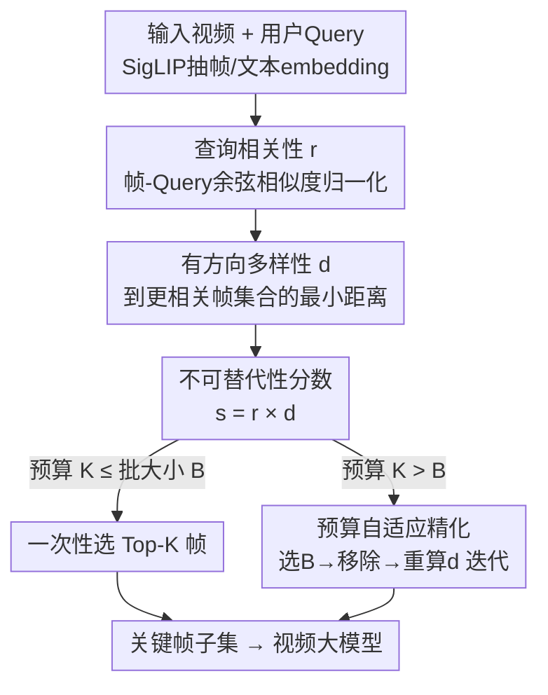

# GIFT: Global Irreplaceability Frame Targeting for Efficient Video Understanding

**会议**: CVPR 2026  
**论文**: [CVF Open Access](https://openaccess.thecvf.com/content/CVPR2026/html/Ma_GIFT_Global_Irreplaceability_Frame_Targeting_for_Efficient_Video_Understanding_CVPR_2026_paper.html)  
**代码**: 无（论文未公开仓库）  
**领域**: 视频理解 / 视频大模型效率  
**关键词**: 关键帧选择, 视频VLM, 训练免费, 全局不可替代性, 长视频理解

## 一句话总结
GIFT 是一个免训练的关键帧选择框架，把"选哪些帧喂给视频大模型"从贪心式逐帧加点，重构成全局评估每一帧的"不可替代性"（相关性高 × 在更相关帧中视觉上孤立），再用"预算自适应精化"随帧预算增大逐步补回时序上下文，在 LLaVA-Video-7B 上相比均匀采样最高平均提升 12.5%。

## 研究背景与动机
**领域现状**：视频大语言模型（Video VLM，如 LLaVA-Video、Qwen2.5-VL）要把视频拆成一帧帧图像送进 LLM，但密集采样会产生海量视觉 token，而 self-attention 是二次复杂度，导致显存和延迟爆炸。为压成本，绝大多数模型用**均匀采样**（等时间间隔取帧）来减少输入帧数。

**现有痛点**：均匀采样把所有帧一视同仁，无视"关键信息往往集中在少数瞬间"这一事实，于是大量冗余、与问题无关的帧被塞进来——既浪费算力预算，又把模型注意力从关键信息上引开，反而掉点。于是关键帧选择成了研究重点，但现有免训练方法（BOLT、AKS、MDP3 等）有两个根本缺陷。

**核心矛盾**：作者把它归为两条"设计哲学"上的病。其一是**贪心决策的近视（Myopia）**：现有方法每步只基于当前状态做一个局部最优且不可撤销的选择，缺全局视角，一个早期的次优决策会沿着选择序列传播放大，最终陷入局部最优。其二是**解耦准则的脆弱（Decoupled Criteria）**：把"查询相关性"和"内容多样性"当成两个独立目标，靠手调超参 $\lambda$ 去平衡——追多样性时常牺牲时序连贯、引入噪声帧；更糟的是，一旦某个次优帧因微弱的多样性优势被错选，真正最优的帧反而会因为"和这个次优帧太像"而被多样性机制永久排除。

**本文目标**：找到一个统一准则，既能从全局视角衡量每帧价值、又能兼顾相关性/多样性/时序连贯三者，而且不用训练、可即插即用到各种 VLM。

**切入角度**：作者换了个提问方式。贪心方法问"下一个该加哪帧最好？"，GIFT 改问一个更强的问题——"这一帧存在更优替代品吗？"。对帧 $F_i$ 而言，"更优替代品"指任何与它**视觉相似且查询相关性更高**的帧 $F_j$；若存在这样的 $F_j$，则 $F_i$ 的贡献基本是冗余的。

**核心 idea**：用"是否存在更优替代品"直接量化每一帧的**全局不可替代性（irreplaceability）**，把多样性重新定义为**有方向的、以相关性为条件**的概念，从而把"平衡两个指标"变成"最大化单一统一属性"。

## 方法详解

### 整体框架
GIFT 接收一段视频和用户 query，输出预算为 $K$ 的关键帧子集，整条管线免训练。先用预训练 SigLIP 抽每帧的视觉 embedding $f_i$ 和 query 的文本 embedding $q$（为效率先均匀采 128 个候选帧），然后分两个阶段工作：

**阶段 1（初始选择）**：对每个候选帧算两个量——查询相关性 $r_i$（与 query 的余弦相似度，归一化）和**有方向多样性** $d_i$（它到"所有比它更相关的帧"集合的最小距离），两者相乘得到不可替代性分数 $s_i = r_i \times d_i$，选分最高的一批帧。

**阶段 2（预算自适应精化，Budget-Aware Refinement）**：如果帧预算 $K$ 超过批大小 $B$，就触发迭代精化——每轮选一小批 $B$ 帧、从候选池移除、再对剩余帧重算 $d_i$，循环到选满 $K$ 帧。移除已选帧会解除它们对邻帧的"压制"，让原本被压住但对时序上下文很关键的邻帧重新冒头。

整个流程可以图文对照如下：

### 关键设计

**1. 有方向多样性：把多样性变成以相关性为条件的"找替代品"**

这是全文最核心的一招，针对的就是上面"解耦准则"的病。传统多样性度量一帧到**所有**其他帧的（平均/最小）距离，目标是"视觉上最新奇"，结果常把与 query 无关的噪声帧（静态空镜、模糊镜头）当成"多样"选进来。GIFT 把多样性改成**单向有方向**的：只衡量一帧 $F_i$ 到它"潜在替代品集合" $C_i$ 的最小距离，而 $C_i$ 被定义为**所有比它查询相关性更高的帧**。形式化为：

$$d_i = \begin{cases} \min_{j \in C_i}\ \lVert f_i - f_j\rVert_2^2, & C_i \neq \varnothing \\ \max_{F_j,F_k \in F_v}\ \lVert f_j - f_k\rVert_2^2, & C_i = \varnothing \end{cases}, \quad C_i = \{j \mid r_j > r_i\}$$

其中 $r_i$ 是归一化后的相关性。这个条件式有很强的甄别力：$d_i$ 很小，说明在它附近的视觉空间里存在一个相关性更高的"更优替代品" $F_j$，于是 $F_i$ 的贡献基本被替代品吸收，是冗余的——直接给它低分作为对冗余的强惩罚；$d_i$ 很大，则说明它要么是全视频最相关的帧（$C_i=\varnothing$，没人能挑战它，直接赋予 embedding 空间里的最大距离），要么虽有更相关的帧但它们在视觉上都离它很远，意味着它携带了别人没有的独特信息。关键区别在于：传统多样性找"视觉上新奇"，有方向多样性找"信息上真正独一无二"——靠相关性给多样性定了方向，从根上把噪声帧排除在外。

**2. 不可替代性分数与全局选择：把组合优化坍缩成排序取 Top-K**

针对"贪心近视"的病。作者把帧重要性的两个分量直接相乘得到全局静态分数：

$$s_i = r_i \times d_i$$

乘法保证只有**既高度相关（$r_i$ 大）又对潜在替代品独一无二（$d_i$ 大）**的帧才拿到最高优先级；任一分量低就被压下去。它的妙处在于：因为每帧的不可替代性是基于全局评估一次性算出的**静态分数**，原本那个"最大化子集总分"的 NP-hard 组合优化问题，就**坍缩成简单地挑分数最高的 $K$ 帧**——既拿到了全局视角（每帧分数都看了全视频上下文），又避开了贪心法那种"早期错选沿序列传播放大"的误差累积。

**3. 预算自适应精化（BAR）：用"选-移除-重评"迭代把时序上下文补回来**

不可替代性分数擅长揪出最关键瞬间，但它对视觉相似帧的内在压制会**误伤时序上下文**：进球瞬间这种细粒度时序推理任务，需要射门动作的连续帧，而紧邻关键帧的那些帧会因"和关键帧太像"被压成低分。而且帧预算越大问题越糟——主关键帧选完后，算法可能被迫去选那些孤立、低相关但"有方向多样性虚高"的噪声帧，而不是更相关却被压住的次级帧。

BAR 的核心原则是**让选择重心随预算迁移**：低预算时优先最大化关键信息覆盖；预算变大时，重心自然转向在已选关键帧周围补时序上下文。实现上是一个 `select → remove → re-evaluate` 的迭代（Algorithm 1）：每轮选当前分数最高的一批 $B$ 帧 $\mathcal{B} = \arg\max^b_{i \in I_{cand}} s_i$，把它们从候选池移除（$I_{cand} \leftarrow I_{cand} \setminus \mathcal{B}$），然后对**剩余所有帧重算 $d_i$ 和 $s_i$** 再进下一轮，直到选满 $K$。关键在于：移除已选关键帧后，它们对邻帧的压制随之解除，那些"曾被压住但对上下文至关重要"的邻帧就能在后续轮次冒出来被选中。于是 GIFT 自然地从"捕捉单个最关键瞬间"过渡到"重建整段事件叙事"，且因为噪声帧始终与 query 对不齐、分数恒低，这个过程对噪声天然鲁棒。批大小 $B$ 控制重评粒度：太小会过度围着最早几个关键帧堆上下文，太大则退化成一次性选择、来不及释放压制，实验定 $B=9$ 最优。

### 一个例子：进球片段
设 query 是"谁打进了第三个球？"。第一轮，"球越过球门线"那一帧因 query 相关性极高被先选中；若不做精化，射门动作的其余帧会被这个关键帧压制（视觉相似 → $d$ 低 → $s$ 低），模型只看到球进了却看不到是谁射的。BAR 在预算允许时把"越线帧"移出候选池，解除其压制，射门起跳、摆腿等紧邻帧的 $d_i$ 重算后回升，在后续轮次被陆续选入，最终模型拿到完整动作序列，答出"白色 10 号球衣"。

## 实验关键数据

### 主实验
在 LLaVA-Video-7B 上、四个基准（MVBench / LongVideoBench / MLVU / VideoMME）对比均匀采样、BOLT(CVPR2025)、AKS(CVPR2025)。下表为各帧预算下的平均得分（%，以 LLaVA-Video 64 帧=100% 为基准）：

| 帧预算 | 均匀采样 | BOLT | AKS | GIFT(本文) |
|--------|---------|------|-----|-----------|
| 32 | 96.5 | 100.0 | 98.9 | **100.6** |
| 16 | 93.4 | 97.8 | 97.0 | **99.2** |
| 8 | 90.6 | 93.9 | 94.9 | **97.3** |
| 4 | 85.6 | 89.6 | 91.7 | **93.9** |

GIFT 在所有预算上全面领先，且预算越紧优势越大：仅 4 帧时保留了 64 帧性能的 93.9%，比均匀采样高 8.3%、比最强 baseline 高 2.2%。在短视频 VideoMME-Short 上，8 帧得 74.0、4 帧得 69.8，分别超第二名 1.4% 和 3.9%，说明它不会为追视觉多样性而过度惩罚邻帧、能保住关键事件周围的上下文。

跨模型即插即用（8 帧预算，部分基准摘录，→为 GIFT 带来的绝对提升）：

| 模型 | LongVideoBench | MLVU | VideoMME-Overall |
|------|---------------|------|------------------|
| VILA-V1.5 + GIFT | 47.1→50.9 (+3.8) | 49.8→56.7 (+6.9) | 48.4→52.8 (+4.4) |
| LLaVA-OneVision + GIFT | 54.3→59.6 (+5.3) | 58.5→67.3 (+8.8) | 53.9→58.8 (+4.9) |
| Qwen2.5-VL + GIFT | 52.7→58.3 (+5.6) | 53.8→62.8 (+9.0) | 53.6→58.1 (+4.5) |
| VideoLLaMA3 + GIFT | 54.8→59.2 (+4.4) | 59.1→70.7 (+11.6) | 59.1→63.6 (+4.5) |

即使在 Qwen2.5-VL、VideoLLaMA3 这类更强基线上 GIFT 仍有显著增益（VideoLLaMA3-8帧 MLVU 从 59.1 升到 70.7，+19.6%），证明它是模型无关的即插即用模块。

### 消融实验
两个核心模块的拆解（LLaVA-Video，32 帧；以均匀采样=100% 为基准），以及 BAR 中批大小 $B$ 的敏感性（LVB + VideoMME 平均）：

| 配置 / 设置 | 关键指标 | 说明 |
|------------|---------|------|
| Full GIFT | LVB 103.8% | 完整模型 |
| 用标准多样性替换有方向多样性 | LVB 103.8%→101.7% | 改回到所有帧均距，掉点，易选噪声帧 |
| 去掉 BAR（静态一次性打分） | LVB −0.5%、MLVU −2.7% | 初始压制固定，被迫选孤立噪声帧 |
| BAR $B=6$ | 平均 62.5 | 重评过频，过度堆早期上下文 |
| BAR $B=9$（默认） | 平均 **62.6** | 粒度最优 |
| BAR $B=12$ | 平均 61.9 | 近似一次性选择，释放压制不及时 |

### 关键发现
- **有方向多样性是主引擎**：换成相关性无关的标准多样性，长视频 LongVideoBench 从 103.8% 掉到 101.7%——传统多样性只找"视觉新奇"，会把噪声帧当多样选进来；用相关性给多样性定向才是稳健性的关键。
- **BAR 主要救时序任务**：去掉它在 MLVU 掉 2.7%、LVB 掉 0.5%；它解决的是"静态打分会过度压制邻帧、被迫选噪声帧"的问题，预算越大越需要。
- **$B$ 存在甜点**：所有 $B$ 设置都显著超均匀采样，但 $B=9$ 最优——太小过度围着首批关键帧堆上下文，太大退化成一次性选择来不及释放压制。
- **越缺帧越占便宜**：4 帧时 GIFT 保留 93.9% 性能、领先优势最大，正是因为全局视角天然对冗余/噪声帧鲁棒。

## 亮点与洞察
- **把多样性"定向"是真正的关键转折**：传统做法是"我要和所有人都不一样"，GIFT 改成"我只在比我更相关的人里找替代品"，一刀把"视觉新奇"和"信息独特"区分开。这个相关性条件化的视角，可迁移到任何"相关性 vs 多样性 trade-off"的子集选择问题（检索去重、样本选择、数据蒸馏）。
- **乘法 + 全局静态分把 NP-hard 拍成排序**：$s=r\times d$ 让组合优化坍缩为 Top-K 排序，既省算力又规避贪心误差传播，是"换问法换掉整个求解范式"的漂亮例子。
- **"移除-解压制"实现预算自适应**：用迭代移除已选帧来动态解除对邻帧的压制，等价于让算法随预算从"抓关键点"平滑过渡到"补叙事链"，无需任何额外超参或训练。
- **完全免训练、即插即用**：只依赖现成 SigLIP 抽特征，落到任意 VLM 上都涨点，工程上几乎零接入成本。

## 局限与展望
- **依赖 SigLIP 特征质量**：相关性和多样性全建在 SigLIP 的视觉/文本 embedding 上，若该编码器对某类视频（如领域特殊、画质差）对齐能力弱，不可替代性分数会失真。⚠️ 论文未讨论编码器替换的敏感性。
- **候选帧上限 128**：为效率先均匀采 128 帧再选，对超长视频（数小时）仍可能在第一步就漏掉关键瞬间，全局性受限于这 128 帧候选池。
- **$d_i$ 的孤立噪声帧隐患仅靠 BAR 缓解**：纯阶段 1 下，孤立低相关帧会因 $d$ 虚高被选；这是机制性弱点，BAR 缓解但未根除，预算极小、又来不及精化时仍可能中招。
- **"更优替代品"是硬阈值定义**：$C_i$ 用 $r_j > r_i$ 的硬比较划定替代品集合，相关性接近的帧间排序对噪声敏感，连续松弛或软加权可能更稳。

## 相关工作与启发
- **vs 均匀采样**：均匀采样等间隔取帧、一视同仁；GIFT 按不可替代性挑帧，把预算花在关键瞬间上，所有预算下都更强，且越缺帧差距越大。
- **vs BOLT (CVPR2025)**：BOLT 用逆变换采样从 query 相关性的累积分布里概率性抽帧；GIFT 不靠采样而是确定性地全局打分排序，避开了概率抽样的方差与对相关性单一维度的依赖。
- **vs AKS (CVPR2025)**：AKS 用递归划分自适应选帧、优化"相关性 vs 时序覆盖"的 trade-off，本质仍是解耦平衡 + 局部决策；GIFT 用相关性条件化的有方向多样性把两者统一成单一分数，并用 BAR 全局迭代，跳出了局部最优。
- **vs MDP3 / Q-Frame 等**：这些方法（DPP+MDP 联合优化、动态分辨率分级）大多仍把相关性与多样性当独立目标、依赖贪心逻辑；GIFT 的差异在于**重新定义多样性使其条件于相关性**，并用随预算自适应的动态选择过程取代固定贪心。

## 评分
- 新颖性: ⭐⭐⭐⭐⭐ 把多样性"定向化"并坍缩组合优化为排序，是视角层面的真创新
- 实验充分度: ⭐⭐⭐⭐ 4 基准 × 4 预算 × 5 个 VLM 很全，但缺与更多 SOTA（MDP3/Q-Frame）的直接同表对比
- 写作质量: ⭐⭐⭐⭐⭐ 动机—公式—算法—消融环环相扣，进球例子讲得很直观
- 价值: ⭐⭐⭐⭐⭐ 免训练、即插即用、缺帧场景大涨点，长视频部署实用价值高

<!-- RELATED:START -->

## 相关论文

- [\[CVPR 2026\] Efficient Frame Selection for Long Video Understanding via Reinforcement Learning](efficient_frame_selection_for_long_video_understanding_via_reinforcement_learnin.md)
- [\[ACL 2026\] CRAFT: Critic-Refined Adaptive Key-Frame Targeting for Multimodal Video Question Answering](../../ACL2026/video_understanding/craft_critic-refined_adaptive_key-frame_targeting_for_multimodal_video_question_.md)
- [\[CVPR 2026\] DIvide, then Ground: Adapting Frame Selection to Query Types for Long-Form Video Understanding](divide_then_ground_adapting_frame_selection_to_query_types_for_long-form_video_u.md)
- [\[CVPR 2026\] Thinking with Drafts: Speculative Temporal Reasoning for Efficient Long Video Understanding](thinking_with_drafts_speculative_temporal_reasoning_for_efficient_long_video_und.md)
- [\[CVPR 2026\] Token Reduction via Local and Global Contexts Optimization for Efficient Video Large Language Models](token_reduction_via_local_and_global_contexts_optimization_for_efficient_video_l.md)

<!-- RELATED:END -->
