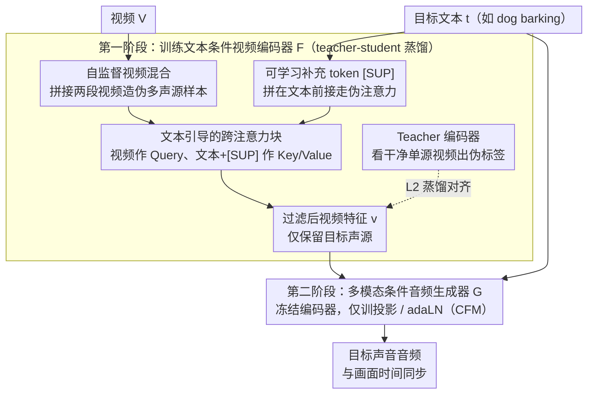

# Hear What Matters! Text-conditioned Selective Video-to-Audio Generation

**会议**: CVPR 2026  
**arXiv**: [2512.02650](https://arxiv.org/abs/2512.02650)  
**代码**: [https://jnwnlee.github.io/selva-demo/](https://jnwnlee.github.io/selva-demo/)  
**领域**: 视频理解 / 音频生成  
**关键词**: 选择性音频生成, 视频到音频, 文本条件, 跨模态注意力, 自监督视频混合

## 一句话总结

SelVA 提出了文本条件的选择性视频到音频（V2A）生成任务，通过可学习的补充 token [SUP] 和自监督视频混合策略，使模型能够根据文本提示从多声源视频中仅生成用户指定的目标声音，在音频质量、语义对齐和时间同步上均超越现有方法。

## 研究背景与动机

1. **领域现状**：视频到音频（V2A）生成已取得显著进展，MMAudio、ReWaS 等模型可以从视频内容生成时间同步的音频。现有方法通常一次性生成包含所有声源的整体音轨。

2. **现有痛点**：在专业音频制作（Foley）中，声音设计师需要逐轨制作每个声源的音频，然后分别混音。但现有 V2A 模型只能生成单一的混合音轨，即使只需微调一个声音也必须重新合成整个音频，严重影响实际可用性。

3. **核心矛盾**：现有方法使用冻结的视觉编码器提取特征，这些特征包含了视频中所有物体的视觉信息（包括与目标声音无关的信息），导致生成器无法选择性地只产生目标声音。文本在现有方法中仅作为辅助语义补充，未被用作声源的显式选择器。

4. **本文目标** (1) 如何用文本作为显式选择器，从多声源视频中提取仅与目标声音相关的视觉特征？(2) 在没有单声源标注数据的情况下，如何训练选择性生成能力？(3) 如何设计高效的视频编码器微调策略，避免注意力机制中的伪相关性？

5. **切入角度**：受人类听觉选择性注意力的启发——人可以在嘈杂环境中聚焦于特定声源，模型也应该能通过文本指引关注视频中特定的声音来源。此外，作者观察到 ViT 中的 high-norm artifact 问题（注意力集中在无关 token 上），提出用额外 token 来吸收这些伪注意力。

6. **核心 idea**：将文本提示重新定位为视频特征的显式调制器，通过可学习 [SUP] token 抑制无关视觉激活，结合自监督视频混合策略实现无需单声源标注的选择性音频生成。

## 方法详解

### 整体框架

SelVA 想解决的是：一段视频里有好几个声源，但用户只想要其中一个——比如画面里猫狗同框，文本说 "dog barking"，模型就该只生成狗叫，不带猫叫。整条 pipeline 由两个模块串起来：先用一个**文本条件视频编码器** $\mathcal{F}$ 把视频里跟目标声音无关的视觉信息过滤掉，再用一个**多模态条件音频生成器** $\mathcal{G}$ 从过滤后的特征生成音频，形式化为 $A_i = \mathcal{G}(\mathcal{F}(V, \mathbf{t}_i), \mathbf{t}_i)$。关键在于文本 $\mathbf{t}_i$ 不再只是辅助语义，而是同时进入编码器（决定看什么）和生成器（决定生成什么）。训练分两阶段且解耦：第一阶段用 teacher-student 蒸馏教编码器学会"按文本选特征"，第二阶段冻住编码器只训生成器，避免两个模块互相牵扯。

### 关键设计

**1. 文本引导的跨注意力块：让冻结的视觉编码器被文本"挑着看"**

以往 V2A 方法用一个冻结的视觉编码器一股脑抽取所有物体的特征，生成器拿到的是包含全部声源的"大杂烩"，自然没法只产生目标声音。SelVA 的做法是在冻结的 Synchformer 空间-时间注意力块之后插入一层轻量跨注意力：以视频隐藏向量 $\mathbf{h_v}$ 作 Query，文本嵌入 $\bar{\mathbf{t}}$ 作 Key/Value，即 $\mathbf{h_{vt}} = \text{Cross-Attn}(Q=\mathbf{h_v}, K=\bar{\mathbf{t}}, V=\bar{\mathbf{t}})$，再经一个可学习的空间注意力池化层得到最终视频特征 $\mathbf{v}$。这样文本就成了视觉特征的显式调制器——编码器在参数高效微调（只动这层注意力）下学会按文本意图过滤画面，只把跟目标声音相关的语义留下来。

**2. 可学习补充 token [SUP]：用"垃圾桶 token"吸走错放的注意力**

光加跨注意力还不够：模型仍会盯着画面里非目标物体的运动（旁边的猫一动就想给它配叫声），这源于 ViT 里常见的 high-norm artifact——某些高范数 token 会把注意力吸过去。SelVA 的应对是在文本嵌入前面拼接 $N=5$ 个可学习 token，$\mathbf{t}_{\texttt{[SUP]}} = [\texttt{[SUP]} \oplus \mathbf{t}]$，用拼接后的序列当跨注意力的 Key/Value。这些额外 token 专门去"接住"那些本会错落在非目标运动 patch 上的伪注意力，相当于给注意力配了个垃圾桶。可视化里能直接看到效果：没有 [SUP] 时注意力散在整个画面，加上后精确收束到文本描述的目标区域。把这几个 token 加在文本端而不是视觉 token 序列里，是因为视觉序列每层都要算、开销大，文本端则几乎不增加计算。

**3. 自监督视频混合策略：没有单声源标注，就自己造多声源样本**

选择性生成最缺的是带分离标注的数据——真实视频通常多声源混在一起，没人标"哪段画面对应哪个声音"。SelVA 用自监督的方式绕开：随机取两段视频 $V_{\text{tar}}$ 和 $V_{\text{pair}}$，按比例 $\lambda \sim \text{Beta}(\alpha, \alpha)$ 水平拼接成混合视频 $V = [V_{\text{tar}} \oplus V_{\text{pair}}]$（混合概率 0.75，且约束 $\lambda > 0.2$ 保证目标视频不会被挤得太小），再随机挑其中一段的音频-文本对作训练目标。这就人为造出了"伪多声源"样本——画面里明明有两个东西，却只要求模型生成其中一个的声音，逼着它通过文本线索去定位并只提取目标那半边的视觉特征。思路借鉴了音视频分离领域，但完全不需要任何单声源标注，可以直接在 VGGSound 这类 in-the-wild 数据上跑。

### 一个完整示例：一段"猫+狗"混合视频怎么走完训练

假设第一阶段随机抽到目标视频 $V_{\text{tar}}$ 是一只狗在叫、配对视频 $V_{\text{pair}}$ 是一只猫在动，按 $\lambda=0.6$ 水平拼成左狗右猫的混合画面，目标文本取 $\mathbf{t}_{\text{tar}}=$"dog barking"。混合视频送进 Student 编码器：跨注意力以 "dog barking" 为 Key/Value 调制画面，5 个 [SUP] token 接走那些想跑去关注右侧猫运动的注意力，于是输出特征 $\mathbf{v}$ 基本只编码左侧狗的视听对应关系。与此同时，Teacher 编码器（原始 Synchformer）只看**干净的单源** $V_{\text{tar}}$（纯狗）产出伪标签特征。蒸馏损失逼 Student 在"脏的混合输入"下也对齐 Teacher 在"干净单源"下的特征——等价于教 Student 学会把猫从画面里"看没"。第二阶段编码器冻结，这个只含狗的 $\mathbf{v}$ 连同文本一起喂给生成器，生成器据此合成与画面狗叫时间同步的音频，全程没用到任何"猫狗已分离"的标注。

### 损失函数 / 训练策略

- **第一阶段（视频编码器训练）**：teacher-student 蒸馏。Teacher（原始 Synchformer）接收单源视频 $V_{\text{tar}}$ 生成伪标签特征 $\mathbf{v}_{\text{tar}}$；Student 接收混合视频和目标文本，最小化 L2 损失 $\|\mathcal{F}_S([V_{\text{tar}} \oplus V_{\text{pair}}], \mathbf{t}_{\text{tar}}) - \mathcal{F}_T(V_{\text{tar}})\|^2$。
- **第二阶段（生成器训练）**：冻结视频编码器，仅微调 MM-DiT 生成器的视频特征投影层 $W_{\mathbf{v}}$ 和 adaLN 模块 $W_\gamma, W_\beta$，用条件流匹配（CFM）目标；推理时 Euler solver 25 步采样，CFG 强度 $\gamma = 4.5$。
- 两阶段都只训各模型约 14% 的参数（编码器 19M、生成器 22M），其余权重全程冻结。

## 实验关键数据

### 主实验

在自建 VGG-MonoAudio benchmark 上评估，包含 67 个单声源视频、1071 个混合测试对（560 跨类 + 511 类内）：

| 方法 | FAD↓ | KAD↓ | IS↑ | CLAP↑ | IB↑ | DeSync↓ |
|------|------|------|-----|-------|-----|---------|
| ReWaS | 70.4 | 4.937 | 6.23 | 0.200 | 0.2454 | 1.364 |
| VinTAGe | 50.5 | 1.309 | 11.51 | 0.283 | 0.2850 | 1.292 |
| MMAudio-S-16k | 56.7 | 0.874 | 11.54 | 0.270 | 0.3135 | 0.802 |
| VOS+MMAudio | 60.0 | 0.878 | 12.11 | 0.291 | 0.3010 | 0.991 |
| **SelVA** | **51.7** | **0.676** | **13.07** | **0.292** | **0.3251** | **0.721** |

SelVA 在所有关键指标上取得最优或接近最优，特别是在时间同步（DeSync 0.721）和音频质量（KAD 0.676）上显著领先。

### 消融实验

| 配置 | DeSync↓ (Inter) | DeSync↓ (Intra) | 说明 |
|------|-----------------|-----------------|------|
| SelVA (完整) | 0.721 | 0.639 | 完整模型 |
| w/o Video Enc. FT | 0.868 | 0.734 | 去掉编码器微调，时间同步严重下降 |
| w/o V2A Gen. FT | 0.736 | 0.651 | 去掉生成器微调，音频质量下降 |
| w/o [SUP] tokens | 0.756 | 0.676 | 去掉 SUP，时间对齐变差 |
| w/o two-stage | 0.823 | 0.777 | 联合训练，语义和时间对齐均下降 |

### 关键发现

- 视频编码器微调对时间同步贡献最大（去掉后 DeSync 从 0.721 升到 0.868），说明让编码器学会文本引导的特征选择是核心
- [SUP] token 主要提升时间对齐（抑制了对非目标运动的错误跟踪），对音频质量和语义影响较小
- 联合训练（不分两阶段）导致模型"走捷径"——用文本语义替代视觉对应的声音事件，破坏时间同步
- 人类评估中 VOS 基线的 CLAP 分数与 SelVA 接近，但人类感知中 text-audio alignment 显著更低（3.78 vs 4.53），暴露了自动指标的局限

## 亮点与洞察

- **[SUP] token 的设计非常巧妙**：它不是加在视觉序列中增加编码器计算成本，而是加在文本序列中作为 Key/Value 的一部分，让跨注意力中的"注意力垃圾"被这些 token 吸收，计算开销极小但效果显著
- **自监督视频混合策略**使得训练不需要任何单声源标注数据，直接在 VGGSound 这样的 in-the-wild 数据集上训练，可扩展性强
- **两阶段训练的必要性**：将特征提取和声音生成解耦训练，避免了两个模块之间的循环依赖导致的训练不稳定

## 局限与展望

- VGGSound 训练数据噪声较多（含背景声和离屏声），更干净的数据或更好的数据过滤可能显著提升性能
- 文本标签通常是简单的"名词+动词"结构，模型对复杂文本描述的理解能力有限（如区分"男声歌唱"vs"男声打嗝"）
- 视频编码器偶尔无法持续跟踪目标运动变化，导致残留的声音替换问题
- 评估 benchmark VGG-MonoAudio 较小（仅 67 个视频），泛化性有待进一步验证

## 相关工作与启发

- **vs MMAudio**: MMAudio 不使用文本模态控制，SelVA 在其基础上加入文本条件视频编码器，保持了 MMAudio 强大的生成能力同时获得选择性控制
- **vs VOS+MMAudio**: VOS 方法依赖分割模型提供空间掩码，难以处理弥散声音（雨声、风声），且计算开销大；SelVA 仅用文本即可实现更灵活的控制
- **vs ReWaS / VinTAGe**: 这些方法用文本辅助语义但不用文本调制视觉特征，时间对齐能力明显不足

## 评分

- 新颖性: ⭐⭐⭐⭐ 首个用纯文本做显式声源选择的 V2A 方法，[SUP] token 设计有新意
- 实验充分度: ⭐⭐⭐⭐ 定量/定性/人类评估/消融齐全，但 benchmark 规模偏小
- 写作质量: ⭐⭐⭐⭐ 动机清晰，方法描述详尽，图表丰富
- 价值: ⭐⭐⭐⭐ 解决了实际音频制作中的真实需求，有较好的应用前景

<!-- RELATED:START -->

## 相关论文

- [\[CVPR 2026\] GoalForce: Teaching Video Models to Accomplish Physics-Conditioned Goals](goal_force_teaching_video_models_to_accomplish_physics-conditioned_goals.md)
- [\[CVPR 2026\] StreamReady: Learning What to Answer and When in Long Streaming Videos](streamready_learning_what_to_answer_and_when_in_long_streaming_videos.md)
- [\[CVPR 2025\] Learning Audio-Guided Video Representation with Gated Attention for Video-Text Retrieval](../../CVPR2025/video_understanding/learning_audio-guided_video_representation_with_gated_attention_for_video-text_r.md)
- [\[CVPR 2026\] CVA: Context-aware Video-text Alignment for Video Temporal Grounding](cva_context-aware_video-text_alignment_for_video_temporal_grounding.md)
- [\[CVPR 2026\] Do You See What I Am Pointing At? Gesture-Based Egocentric Video Question Answering](do_you_see_what_i_am_pointing_at_gesture-based_egocentric_video_question_answeri.md)

<!-- RELATED:END -->
