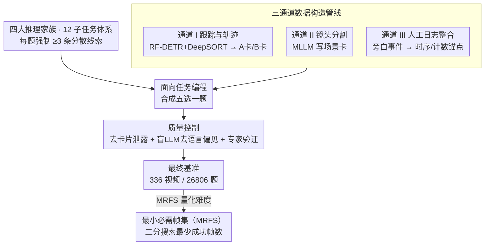

# HERBench: A Benchmark for Multi-Evidence Integration in Video Question Answering

**会议**: CVPR 2026  
**arXiv**: [2512.14870](https://arxiv.org/abs/2512.14870)  
**代码**: 无  
**领域**: 视频理解 / 多模态VLM  
**关键词**: 视频问答基准, 多证据整合, 帧选择, 长视频理解, 时间推理

## 一句话总结

HERBench 是一个专为多证据整合设计的视频问答基准，包含 26,806 个五选一问题，每题结构性地要求融合 ≥3 个时间分散的非重叠视觉线索；通过提出最小必需帧集（MRFS）指标揭示了当前 Video-LLM 的两个关键瓶颈：帧检索不足和证据融合失败。

## 研究背景与动机

1. **领域现状**：Video-LLM（如 GPT-4o、Gemini、Qwen2.5-VL 等）在现有 VideoQA 基准上取得了不错的分数，看似视频理解能力在快速进步。

2. **现有痛点**：近期审计研究揭示，这些高分往往源于语言先验或单线索捷径，而非真正的时间推理。模型可以仅看一帧或利用语言偏见就答对问题，现有基准无法区分"真正理解视频"和"走捷径"。

3. **核心矛盾**：现有 VideoQA 基准的问题设计允许单线索捷径——一个关键帧或文字常识就足以回答。这使得我们无法确定模型是否真正具备跨时间整合多条证据的能力。

4. **本文目标** (1) 设计一个结构性要求多证据整合（≥3 条分散线索）的基准；(2) 提出可度量"证据需求量"的量化指标 MRFS；(3) 诊断当前 Video-LLM 的具体失败模式——是帧选择的问题还是信息融合的问题。

5. **切入角度**：作者定义了"证据需求量"（Evidential Requirement, ER）的概念——回答一个问题所需的最少非冗余视觉证据数量。通过控制 ER ≥ 3，可以从根本上排除单线索捷径，使多证据推理成为不可绕过的要求。

6. **核心 idea**：通过结构性设计确保每个问题至少需要 3 条时间分散的视觉线索，配合 MRFS 指标量化帧融合难度，系统性揭示 Video-LLM 在帧检索与证据融合上的双重短板。

## 方法详解

### 整体框架

HERBench 不是一个新模型，而是一套用来"逼出"真实视频理解能力的评测基准。它要回答的问题是：当一道题结构性地需要至少 3 条分散在不同时刻的视觉线索时，今天的 Video-LLM 还能不能答对？围绕这个目标，基准的搭建分四步：先用一套 12 类任务的分类体系把"多证据整合"拆成 4 个推理家族，把"每题至少 3 条分散线索"焊进题目结构；再用一条三通道数据管线从轨迹、镜头、人工日志三个粒度抽取时空信息，交给面向任务编程（oriented task programming）合成五选一题；接着用一道质量控制关卡过滤掉卡片泄露和语言捷径，确保答案离不开视觉证据；最后用最小必需帧集（MRFS）指标把"这道题到底需要几帧才答得出"量化出来，让不同基准之间能横向比难度。最终规模是 336 个长视频（平均 395 秒）、26,806 道五选一题。

### 关键设计

**1. 四大推理家族与 12 个子任务：把"多证据"焊死进题目结构**

现有 VideoQA 基准的硬伤是单线索捷径——一帧关键画面或一句语言常识就能蒙对，于是高分测不出真实能力。HERBench 的对策是重新设计任务，让每道题在结构上都强制 $k \ge 3$：正确答案必须由视频里多个不同时刻的线索拼出，单帧或局部窗口拿不到。12 个子任务按需要的推理类型归为四个家族——时间推理与时序（TR&C，含镜头时序排列 TSO、多人持续时间推理 MPDR、动作序列完整性识别 ASII）逼模型理解事件先后、重叠与时长比较；指代与跟踪（R&T，含外观锚定行为交互 AGBI、外观锚定属性识别 AGAR、外观锚定定位轨迹 AGLT）逼模型跨时间维持同一目标的身份绑定；全局一致性与验证（GC&V，含虚假动作记忆 FAM、场景验证排列 SVA、虚假物体记忆 FOM）逼模型扫完全片去确认"有没有发生""缺了什么"；多实体聚合与计数（MEA&N，含多实体定位 MEGL、动作计数 AC、区域限制人数统计 RLPC）逼模型跨时间去重再做集合级聚合。这些类别名字看着和老基准重叠（时序、计数都不新），但关键差别是把"必须凑齐 ≥3 条线索"写进了每道题的答案路径，而不是放任单帧解。

**2. 三通道数据构造管线：从三个粒度抽信息，再刻意把线索拆散**

要批量造出"必须多帧才答得出"的题，光靠人工标注既慢又难保证证据分散，于是 HERBench 用三条互补的管线分头采集时空信息。管线 I 做目标跟踪与轨迹分析：用 RF-DETR + DeepSORT 拿到实体轨迹，按 TrackRank 分数只留前 20% 的实体，再给每条轨迹分别生成不重叠的 A-card（外观描述）和 B-card（行为/轨迹描述）。这里最关键的一笔是把"长什么样"和"做了什么"刻意放到视频里不同的时间帧——模型必须先靠 A-card 的外观在视频中定位到这个人，再跟踪到 B-card 描述的行为发生时刻才能作答，身份绑定就被做成了无法绕过的多帧推理。管线 II 做镜头分割：用镜头边界检测把视频切成语义片段，再让 MLLM 为每段写场景卡片，提供宏观的场景结构。管线 III 做人工标注整合：把人工验证过的旁白事件日志接进来，给事件时序和计数提供真实可靠的事实锚点。三条通道分别管微观实体动态、宏观场景、人工事实，互相补位，构出的题既证据分散又有据可查。

**3. 质量控制：堵住信息泄露和语言捷径两个后门**

自动化管线和"强制多帧"的设计要真正成立，必须先确认题目没被两条捷径绕过去。第一条是卡片泄露：A/B 卡片如果措辞相近，模型可能直接从一张卡片里读出答案，所以用 token 级相似度检查加人工审查把互相泄露的卡片剔除。第二条是语言偏见：凡是被 ≥3/4 个"盲做"（不看视频）的 LLM 答对的题一律丢弃，确保答案离不开视觉证据。此外抽 15% 题做分层专家验证，逐题确认 $k \ge 3$ 合规且答案唯一。最后用人类表现兜底——标注者在能看全片时准确率 88.8%，在给定 oracle 帧时升到 95.7%，说明题目对人是可解的，模型的低分是能力差距而非题目噪声。

**4. 最小必需帧集（MRFS）指标：把"这题需要几帧"量化成可比的数**

光说"我们的题更难"没有说服力，得有个量化指标证明证据需求量确实更高，还要能跟别的基准比。MRFS 的做法是：固定一个 MLLM $f$、一个帧选择器 $r$ 和帧预算 $x$，把"让模型从答错变答对所需的最少帧数 $k$"定义为这道题的最小必需帧集大小。计算时先把纯文本就能解的题剔掉（即语言先验已足够、$E(f(q, \varnothing), y) = 0$ 的那些），再在 $k \in [1, x]$ 上做自适应二分搜索找最小成功帧数，于是每道题只要 $O(\log x)$ 次模型调用就能定出 MRFS。和已有指标比，它既不像 Temporal Indispensability 那样只能区分单帧 vs 多帧，也不像 Certificate Length 那样依赖人工标注——MRFS 是全自动、以模型为中心的，直接量出"多证据聚合"这件事的难度。

## 实验关键数据

### 主实验

13 个 SOTA Video-LLM 评估，整体准确率仅 31-42%（随机猜 20%）：

| 模型 | TR&C Avg. | R&T Avg. | GC&V Avg. | MEA&N Avg. | 总体 |
|------|-----------|----------|-----------|------------|------|
| GPT-4.1 | 25.4 | 66.0 | 37.1 | 29.0 | 39.4 |
| Gemini-2.5-Flash | 29.7 | 69.9 | 34.9 | 26.8 | 40.3 |
| Qwen2.5-VL-72B | 26.9 | 70.9 | 36.6 | 24.4 | 39.7 |
| Ovis-2.5-9B | 18.9 | 73.5 | 46.8 | 29.2 | **42.1** |
| InternVL3.5-8B | 33.6 | 70.2 | 29.7 | 30.8 | 41.1 |

### 跨基准 MRFS 比较

| 基准 | 视频数 | 问题数 | MRFS↑ | 语言去偏 | 强制融合 |
|------|--------|--------|-------|---------|---------|
| MVBench | 4,000 | 4,000 | 3.52 | ✗ | ✗ |
| Video-MME | 900 | 2,700 | 5.31 | ✗ | ✗ |
| MINERVA | 223 | 1,515 | 5.14 | ✓ | ✗ |
| **HERBench** | **336** | **26,806** | **5.49** | **✓** | **✓** |

### 关键发现

- **帧检索瓶颈（Finding 1）**：自适应帧选择器虽优于均匀采样，但与 oracle 关键帧相比仍有显著差距——模型根本没找到关键证据帧
- **融合瓶颈（Finding 2）**：即使给了 oracle 帧，模型准确率也只有适度提升，说明模型无法正确分配注意力到所有关键帧并整合信息
- R&T 家族得分相对较高（~60-73%），因为这些任务中的外观描述提供了较强的视觉锚点；TR&C 和 MEA&N 家族得分最低（<30%），反映出模型在时序推理和多实体聚合上的严重短板
- 小模型（如 Ovis-2.5-9B）在某些任务上反而优于大模型（GPT-4.1），暗示问题不仅仅是模型规模

## 亮点与洞察

- **MRFS 指标的设计很精妙**：它不是简单计算需要多少帧，而是固定一个帧选择器后用二分搜索找最小成功帧数，同时排除纯文本可解的问题，使得跨基准比较公平且计算高效
- **A/B 卡片分离设计**：将外观描述和行为查询刻意放在不同时间帧，强制模型先通过外观描述在视频中定位目标，再跟踪到行为发生时刻才能回答，这种设计巧妙地将身份绑定做成了必须的多帧推理
- **双瓶颈诊断框架**：通过 oracle 帧实验将帧选择与融合推理解耦，明确指出"找到帧"和"用好帧"是两个独立的挑战，为后续研究指明了清晰的方向

## 局限与展望

- 基准部分通过自动化管线生成，可能存在残留的系统性偏差
- 仅有 336 个视频，场景多样性可能不足以代表所有真实场景
- MRFS 依赖于特定的帧选择器和模型，不同组合可能给出不同排序
- 主要评估现有模型的失败，但未提供改进模型的具体方案（纯诊断性质）
- R&T 任务准确率较高，可能意味着这部分任务的 ER 设计不够严格

## 相关工作与启发

- **vs Video-MME**: Video-MME 侧重更长的上下文，但不控制证据需求量；HERBench 通过结构性设计确保高 ER，证据密度而非视频长度是难度来源
- **vs MINERVA**: MINERVA 也做了语言去偏且 MRFS 较高，但它聚焦于多步推理和推理链审计，而非强制的多帧证据聚合
- **vs MVBench**: MVBench 覆盖多种时间推理任务但使用短视频，且问题常可通过单帧解答

## 评分

- 新颖性: ⭐⭐⭐⭐ 首个以证据需求量为核心设计理念的 VideoQA 基准，MRFS 指标有创新
- 实验充分度: ⭐⭐⭐⭐⭐ 评估了 13 个模型，跨基准 MRFS 比较，多维度诊断分析
- 写作质量: ⭐⭐⭐⭐ 框架清晰，任务分类体系完整，但论文较长
- 价值: ⭐⭐⭐⭐ 诊断了 Video-LLM 的关键短板，为领域进步提供了重要参考

<!-- RELATED:START -->

## 相关论文

- [\[CVPR 2026\] MovieRecapsQA: A Multimodal Open-Ended Video Question-Answering Benchmark](movierecapsqa_a_multimodal_open-ended_video_question-answering_benchmark.md)
- [\[CVPR 2026\] VSI: Visual-Subtitle Integration for Keyframe Selection to Enhance Long Video Understanding](vsi_visual-subtitle_integration_for_keyframe_selection_to_enhance_long_video_un.md)
- [\[CVPR 2026\] Do You See What I Am Pointing At? Gesture-Based Egocentric Video Question Answering](do_you_see_what_i_am_pointing_at_gesture-based_egocentric_video_question_answeri.md)
- [\[NeurIPS 2025\] EgoGazeVQA: Egocentric Gaze-Guided Video Question Answering Benchmark](../../NeurIPS2025/video_understanding/egogazevqa_egocentric_gaze_guided_video_question_answering.md)
- [\[CVPR 2026\] DIvide, then Ground: Adapting Frame Selection to Query Types for Long-Form Video Understanding](divide_then_ground_adapting_frame_selection_to_query_types_for_long-form_video_u.md)

<!-- RELATED:END -->
