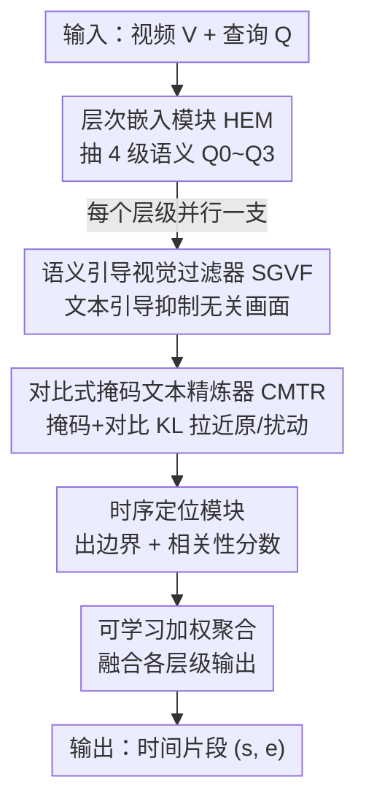

# HERO: Hierarchical Embedding-Refinement for Open-Vocabulary Temporal Sentence Grounding in Videos

**会议**: CVPR 2026  
**论文**: [CVF Open Access](https://openaccess.thecvf.com/content/CVPR2026/html/Han_HERO_Hierarchical_Embedding-Refinement_for_Open-Vocabulary_Temporal_Sentence_Grounding_in_Videos_CVPR_2026_paper.html)  
**代码**: https://github.com/TTingHan-HDU/HERO  
**领域**: 视频理解  
**关键词**: 时序句子定位, 开放词表, 层次化文本嵌入, 跨模态精炼, 对比学习  

## 一句话总结
本文提出"开放词表时序句子定位"（OV-TSGV）新任务并构建 Charades-OV / ActivityNet-OV 两个基准，配套设计即插即用框架 HERO——用层次化文本嵌入捕捉多粒度语义，再用语义引导的视觉过滤 + 对比式掩码文本精炼并行强化对齐，在标准与开放词表两类基准上都刷到 SOTA。

## 研究背景与动机
**领域现状**：时序句子定位（TSGV）的目标是给定一句自然语言查询，在未裁剪的长视频里定位出对应的时间片段 $(s, e)$。主流做法分为 proposal-based（生成候选片段再打分）和 proposal-free（直接回归边界），近期 DETR 风格模型在后者上效果更好。

**现有痛点**：现有模型几乎都在**闭词表**设定下训练与评测——测试查询的词汇和训练高度重合。已有研究指出这些模型容易过拟合数据集偏置（片段位置、时长分布），而不是真正学到鲁棒的视频-语言对齐。即便是为缓解偏置而提出的 Charades-CD / ActivityNet-CD，作者实测发现 test-ood 划分里 **96.06%（Charades）/ 86.73%（ActivityNet）的测试句子全部由训练词表里见过的词构成**，本质上仍是闭词表。

**核心矛盾**：真实世界的查询会带来"词表漂移"——把 "person holds a box" 里的 person 换成语义等价但训练没见过的 "human"，强基线 EMB 的定位就会显著崩掉。问题根源在于 token 级编码无法捕捉不同措辞之间的语义等价（"boy grabs skateboard" vs. "kid picks up object"），模型只会记训练模式而不会做语义抽象。

**本文目标**：把任务从闭词表推广到开放词表，要求模型在测试查询含**至少一个训练未见词**（novel object / action / 同义改写）时仍能准确定位；并提供能真正考察这一泛化能力的基准。

**切入角度**：作者把 TSGV 里模糊的"类别"概念形式化——查询 $q$ 的类别集合定义为其中所有词元 $C(q) \triangleq \{ w \mid w \text{ 是 } q \text{ 中的一个词元} \}$，于是 "person hold a box" 对应 $\{person, hold, box\}$，只要其中一词不在训练词表即为开放词表样本。

**核心 idea**：用"层次化语义嵌入 + 并行跨模态精炼"取代单层 token 编码，让模型在词法到概念多个粒度上对齐视频与文本，从而对未见表达鲁棒。

## 方法详解

### 整体框架
HERO 是一个**即插即用**的增强框架，可挂在任意"特征融合器 + 跨度预测器"两段式 TSG 模型上（论文以 EMB 为底座实例化）。给定视频特征 $V=\{v_t\}_{t=1}^T$ 和查询特征 $Q=\{q_i\}_{i=1}^L$，整条流水线是：**层次嵌入模块（HEM）** 先把查询抽成 $N$ 个从词法到概念的语义层级 $\{Q_i\}$；这些层级**并行**送入**跨模态过滤与精炼引擎（CFRE）**，每个分支内部用**语义引导视觉过滤器（SGVF）**压掉无关画面、用**对比式掩码文本精炼器（CMTR）**增强文本鲁棒性；精炼后的特征喂给**时序定位模块**，每层产出边界预测 $(P_i^s, P_i^e)$ 与相关性分数 $RS_i, RS_i^m$；最后用**可学习加权聚合**把各层级输出融成最终片段 $(s,e)$。

### 关键设计

**1. 层次化文本嵌入 HEM：用多粒度语义抵御未见措辞**

针对"token 级编码抓不住同义改写"的痛点，HEM 不再用单一层的文本表示，而是用一个 6 层 Transformer 编码器，把**输入嵌入 + 第 2/4/6 层输出**一起取出来，得到 4 级表示：$Q_0 = Q$，$Q_1 = \text{TransformerEncoder}_2(Q_0)$，$Q_i = \text{TransformerEncoder}_{2i}(Q_{i-1}),\ i=2,3$。低层保留"词是怎么表达的"（词法/句法线索），高层编码"词到底什么意思"（语义概念）。这样当测试出现训练没见过的同义词时，高层抽象仍能落在已学到的概念空间里，从而对齐成功——消融显示并行层数取 4 最优：2 层过分纠结字面、8 层又过度抽象丢掉细粒度 token 信息。

**2. 语义引导视觉过滤器 SGVF：用文本线索把无关画面压下去**

长视频里大量帧与查询无关，直接融合会引入噪声。SGVF 用交叉注意力做软过滤：以视频特征 $V$ 作 query、某一层文本 $Q_i$ 作 key/value 算注意力，再过 sigmoid 得到 0~1 的相关性系数去逐元素调制原始视频特征：

$$V_i^{attn} = \text{Softmax}\!\left(\frac{V Q_i^T}{\sqrt{d_k}}\right) Q_i, \qquad \hat{V}_i = V \odot \text{Sigmoid}(V_i^{attn})$$

其中 softmax 归一化注意力、sigmoid 把相关系数夹到 $[0,1]$，$\odot$ 为逐元素乘。效果是把背景噪声衰减、把语义相关的视觉信号放大，从而让后续融合在更干净的视觉证据上对齐——这一步在每个语义层级上各做一次。

**3. 对比式掩码文本精炼器 CMTR：用掩码+对比把文本表示练鲁棒**

为让模型在查询被改写/缺词时仍稳定，CMTR 借鉴对比学习：对每层查询随机掩码一部分 token 得到扰动版 $Q_i^m = \text{RandomMask}(Q_i)$，把它同样送进 SGVF 得到扰动视觉表示 $\hat{V}_i^m$。原始对 $\{Q_i, \hat{V}_i\}$ 与扰动对 $\{Q_i^m, \hat{V}_i^m\}$ 各自过定位模块算出相关性分数 $RS_i, RS_i^m$，跨层加权汇成 $RS, RS^m$，再用 KL 散度约束二者一致：

$$\mathcal{L}_{CL} = D_{KL}(RS \,\|\, RS^m)$$

直觉是：哪怕查询里掉了几个词，模型对"哪些帧相关"的判断也不该变——逼模型抓住语义骨架而非依赖某个具体词，从而对开放词表里的缺失/扰动输入更稳。

**4. 可学习加权聚合：让各语义层级按需出力**

4 个并行分支各自代表一个抽象层级的理解，谁该多说了算不能写死。HERO 用一组可学习标量权重 $\{W_i\}$ 融合：把随机初始化向量 $T_i \in \mathbb{R}^d$ 喂进一个轻量 MLP 得到 $W_i = \text{MLP}(T_i)$，最终输出为各层级输出的加权和 $O = \sum_{i=1}^{N} W_i O_i$。这样模型能自适应地决定不同查询下该更信词法层还是概念层，而不是简单平均。

### 损失函数 / 训练策略
总损失三项加权：$\mathcal{L} = \mathcal{L}_{TSGV} + \lambda_1 \mathcal{L}_{RS} + \lambda_2 \mathcal{L}_{CL}$。其中 $\mathcal{L}_{TSGV}$ 是底座（EMB）的主定位损失；$\mathcal{L}_{CL}$ 即上面的 KL 对比一致性损失；$\mathcal{L}_{RS}$ 是相关性分数损失，对原始与掩码两路的逐帧二元交叉熵取平均 $\mathcal{L}_{RS} = \tfrac{1}{2}\big(\mathcal{L}_{BCE}(V, RS) + \mathcal{L}_{BCE}(V, RS^m)\big)$，其中 $p(v_t)$ 是帧 $v_t$ 是否相关的真值、$RS(v_t)$ 是预测相关性。训练 20 epoch、batch 16、Adam、初始学习率 0.0005 线性衰减、梯度裁剪 1.0，$\lambda_1 = \lambda_2 = 0.1$；视频用 I3D 特征、查询用 300D GloVe，隐层维度统一 128。

## 实验关键数据

### 主实验
在两个开放词表基准 test-ov 划分上，HERO 全面超过 5 个 SOTA（R1@m 越高越好）：

| 数据集 | 指标 | EMB(底座) | 之前最好 | HERO | 提升 |
|--------|------|-----------|----------|------|------|
| Charades-OV | R1@0.3 | 61.54 | 61.87 (TR-DETR) | **64.74** | +2.87 |
| Charades-OV | R1@0.7 | 25.99 | 25.99 (EMB) | **27.20** | +1.21 |
| ActivityNet-OV | R1@0.3 | 40.22 | 40.22 (EMB) | **42.78** | +2.56 |
| ActivityNet-OV | R1@0.5 | 21.70 | 21.70 (EMB) | **25.23** | +3.53 |
| ActivityNet-OV | R1@0.7 | 10.78 | 10.78 (EMB) | **12.18** | +1.40 |

在标准闭词表 Charades-STA 上同样刷新 SOTA：R1@0.5 从 EMB 的 58.33 提到 **61.05**、R1@0.7 从 39.25 提到 **41.29**，优于 FlashVTG（60.11 / 38.01）等近期方法，说明该增强模块并非只在 OV 设定下有效。

### 消融实验
Charades-OV test-ov 上逐组件消融（HEM；CFRE = SGVF + CMTR）：

| HEM | SGVF | CMTR | R1@0.5 | R1@0.7 | mIoU | 说明 |
|-----|------|------|--------|--------|------|------|
| - | - | - | 42.31 | 25.22 | 41.93 | 底座 baseline |
| ✓ | - | - | 42.64 | 24.89 | 42.03 | 仅层次嵌入 |
| - | ✓ | - | 43.58 | 25.72 | 43.24 | 仅视觉过滤 |
| ✓ | ✓ | - | 45.10 | 26.70 | 44.00 | HEM+SGVF |
| - | ✓ | ✓ | 44.82 | 25.21 | 43.39 | CFRE 全开 |
| ✓ | ✓ | ✓ | **45.51** | **27.20** | **44.86** | 完整 HERO |

### 关键发现
- **三组件互补、缺一掉点**：完整模型在所有指标都最好；单独看 SGVF 比 HEM 单独更有用（R1@0.5 43.58 vs 42.64），但 HEM+SGVF 组合才把 R1@0.5 拉到 45.10，说明层次嵌入要配合跨模态精炼才能发挥。
- **HEM 并行层数有甜点**：4 个并行层最优——2 层过分关注字面词法、8 层过度抽象丢细粒度，4 层在"怎么表达"与"什么意思"之间取得平衡。
- **跨数据集泛化更强**：Charades-CD 训练、ActivityNet-CD 测试时，HERO 比此前方法 R1@0.3 +3.3%、R1@0.5 +1.36%、R1@0.7 +1.27%，说明收益来自语义抽象而非记某个数据集的偏置。
- ⚠️ 主结果中各 SOTA 的"第二好"列由我对照 Table 1 推得，个别项以原文加粗/下划线为准。

## 亮点与洞察
- **把 TSGV 的"开放词表"问题正式立起来**：先用统计戳穿 CD 基准其实仍是闭词表（96% 句子全是见过的词），再用 LLM 改写 + 人工校验造出真正含未见词的 Charades-OV / ActivityNet-OV，问题定义本身就是贡献。
- **"类别即词元"的形式化**很聪明：TSGV 里没有现成类别，作者把查询拆成词元集合、只要含一个未见词就算 OV 样本，让开放词表评测在自由文本任务上可操作。
- **即插即用**：HERO 不绑定具体 TSG 实现，作为辅助模块挂在两段式架构上即可，迁移成本低——这条思路可搬到其他需要语义鲁棒性的跨模态对齐任务。
- **掩码+KL 一致性**这招把"掉词也不该改变帧相关性判断"显式写成训练目标，是面向开放词表鲁棒性的轻量但对路的正则。

## 局限与展望
- 作者展望方向（few-shot 适配、持续学习、更广义开放世界多模态定位）暗示当前 HERO 仍是"训练期一次学好"，对完全新概念的在线适应未覆盖。
- ⚠️ HEM 的 4 级抽象、SGVF/CMTR 在每层各跑一份，并行分支带来的计算/显存开销论文未给量化，挂到更大底座上的成本待评估。
- OV 基准的"未见词"靠 LLM 改写生成，改写质量与真实世界词表漂移分布是否一致存在偏差风险；CMTR 的随机掩码比例等关键超参文中未细化。
- 底座固定为 EMB，论文虽称即插即用，但未在多个不同底座上系统验证增益是否一致。

## 相关工作与启发
- **vs EMB（底座）**: EMB 是强 proposal-free 基线但闭词表，换同义词即崩；HERO 在其上加层次嵌入 + 跨模态精炼，OV 设定下 Charades-OV R1@0.3 从 61.54 提到 64.74，标准设定也同步涨点。
- **vs DETR 风格（Moment-DETR / QD-DETR / TR-DETR）**: 它们靠 transformer 匹配和辅助任务强化定位，但仍限闭词表；HERO 的差异在于显式建模多粒度语义并用对比一致性抗词表漂移，OV 泛化更稳。
- **vs CD 去偏方法（因果干预 / 视频打乱 / 课程增强）**: 这些假设训练测试共享词表、只解分布偏置；HERO 指出真正的缺口是未见词，并给出基准 + 方法，把问题从"去偏"推进到"开放词表泛化"。

## 评分
- 新颖性: ⭐⭐⭐⭐⭐ 首次把 TSGV 推到开放词表，任务定义、基准、方法成套，填了实打实的空白
- 实验充分度: ⭐⭐⭐⭐ 标准+OV 双基准、逐组件消融、并行层数与跨数据集分析齐全，但缺多底座与计算开销量化
- 写作质量: ⭐⭐⭐⭐ 动机递进清晰、公式完整；个别表述（部分指标 caveat）需对照原文
- 价值: ⭐⭐⭐⭐⭐ 即插即用 + 开放词表基准，对真实场景视频定位有直接推动作用

<!-- RELATED:START -->

## 相关论文

- [\[CVPR 2026\] HieraMamba: Video Temporal Grounding via Hierarchical Anchor-Mamba Pooling](hieramamba_video_temporal_grounding_via_hierarchical_anchor-mamba_pooling.md)
- [\[CVPR 2026\] Decompose and Transfer: CoT-Prompting Enhanced Alignment for Open-Vocabulary Temporal Action Detection](decompose_and_transfer_cot-prompting_enhanced_alignment_for_open-vocabulary_temp.md)
- [\[CVPR 2026\] OmniVTG: A Large-Scale Dataset and Training Paradigm for Open-World Video Temporal Grounding](omnivtg_a_large-scale_dataset_and_training_paradigm_for_open-world_video_tempora.md)
- [\[CVPR 2026\] CVA: Context-aware Video-text Alignment for Video Temporal Grounding](cva_context-aware_video-text_alignment_for_video_temporal_grounding.md)
- [\[NeurIPS 2025\] DualGround: Structured Phrase and Sentence-Level Temporal Grounding](../../NeurIPS2025/video_understanding/dualground_phrase_temporal.md)

<!-- RELATED:END -->
