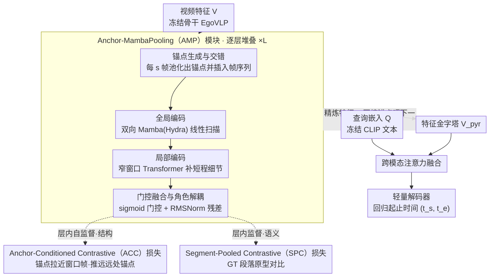

# HieraMamba: Video Temporal Grounding via Hierarchical Anchor-Mamba Pooling

**会议**: CVPR 2026  
**arXiv**: [2510.23043](https://arxiv.org/abs/2510.23043)  
**代码**: [https://vision.cs.utexas.edu/projects/hieramamba](https://vision.cs.utexas.edu/projects/hieramamba)  
**领域**: 视频理解  
**关键词**: 视频时间定位, 状态空间模型, Mamba, 层次化表示, 对比学习

## 一句话总结

HieraMamba 提出了基于 Mamba 的层次化视频时间定位架构，核心是 Anchor-MambaPooling（AMP）模块，用 Mamba 的选择性扫描将视频特征逐层压缩为多尺度锚点 token，配合 anchor-conditioned 和 segment-pooled 对比损失增强层次表示的紧凑性和判别性，在 Ego4D-NLQ、MAD 和 TACoS 上达到 SOTA。

## 研究背景与动机

1. **领域现状**：视频时间定位（Video Temporal Grounding）任务要求根据自然语言查询在未裁剪视频中定位起止时间。从预定义动作定位发展到自由文本查询，该任务支持 VQA、自动视频编辑等应用。现有方法如 ActionFormer、SnAG、DeCafNet 等已引入多尺度特征金字塔。

2. **现有痛点**：长视频（几分钟到数小时）带来两个交织的挑战：(a) **时间保真度问题**——许多方法通过固定长度池化、朴素下采样或固定窗口来降低计算成本，但这些操作丢弃了关键的时间线索或在窗口边界处割裂了时间结构；(b) **多粒度问题**——不同查询需要不同时间粒度（"侦探在图书馆做了什么"需要粗粒度理解，"侦探何时从书架抽出纸条"需要细粒度定位），单分辨率方法难以兼顾。

3. **核心矛盾**：Transformer 的二次方注意力成本是导致下采样和窗口化启发式方法的根源——为了处理长序列不得不牺牲时间分辨率。现有的多尺度模型（SnAG、DeCafNet、OSGNet）虽然引入了多尺度，但多尺度仍通过均匀下采样或粗池化产生，缺乏内容感知的压缩。

4. **本文目标** (1) 如何在线性时间复杂度内处理全长视频序列，避免下采样/窗口化？(2) 如何构建内容感知的多尺度层次表示，而非简单的下采样金字塔？(3) 如何确保层次锚点既紧凑（忠实汇总局部信息）又具判别性（与其他事件可区分）？

5. **切入角度**：人类的情景记忆天然具有层次结构——从房间的整体布局到手指的精确运动，可以无缝在时间尺度间切换。作者识别出 Transformer 的二次注意力是导致时间降采样的根源，提出用 Mamba 的线性时间选择性扫描替代，实现全分辨率的长程建模。

6. **核心 idea**：用 Mamba 的选择性扫描构建内容感知的层次化锚点压缩（而非朴素下采样），通过堆叠 AMP 模块形成从细到粗的多尺度时间金字塔，以线性复杂度实现精确的长视频时间定位。

## 方法详解

### 整体框架

输入：冻结的视频骨干（如 EgoVLP）提取的 clip 级特征 $V \in \mathbb{R}^{L_V \times D_v}$ 和冻结文本编码器（如 CLIP）提取的查询嵌入 $Q \in \mathbb{R}^{L_Q \times D_q}$。视频编码器是 $L$ 个 AMP 模块的层次堆叠，逐层产生精炼特征 $\tilde{V}^{(l)}$ 和下一层的锚点 $A^{(l+1)}$，形成特征金字塔 $\mathcal{V}_{\text{pyr}} = \{\tilde{V}^{(0)}, \ldots, \tilde{V}^{(L-1)}\}$。每层内部 AMP 先做锚点生成与交错，再用双向 Mamba 全局编码、窄窗口 Transformer 局部编码，最后用门控融合放行显著信息；同时 ACC 与 SPC 两个对比损失逐层施加在锚点上。金字塔与文本嵌入通过跨模态注意力融合后，由轻量解码器回归起止时间 $(t_s, t_e)$。

### 关键设计

**1. Anchor-MambaPooling（AMP）模块：让一次 Mamba 扫描同时干完"精炼"和"压缩"两件事**

长视频建模的核心矛盾是：要么保留全分辨率但付出二次方注意力代价，要么下采样省算力但丢掉时间细节。AMP 绕过这个二选一，它在每一层做三步。第一步是**锚点生成与交错**：每隔 $s$ 帧用局部窗口池化初始化一个锚点 token，再把锚点插到它所汇总的那段帧之前，拼成交错序列 $\hat{V} = [a_0, v_0, \ldots, v_{s-1}, a_1, v_s, \ldots] \in \mathbb{R}^{(L_0+L_1) \times D_v}$。第二步是**全局编码**：用 Hydra（双向 Mamba 扫描）处理这条交错序列，正向扫描让每个锚点从它前面的帧吸收信息，反向扫描让它从后面的帧吸收信息，整个过程是序列长度的线性复杂度。第三步是**局部编码**：再叠一个窄窗口 Transformer（窗口大小 5）补上短程细粒度的注意力模式。一层走完，AMP 同时吐出当前分辨率精炼后的特征 $\tilde{V}^{(l)}$ 和给下一层用的压缩锚点 $A^{(l+1)}$。

这个交错设计的妙处在于：锚点和帧特征共享同一遍 Mamba 扫描，于是信息是双向流动的——锚点把粗粒度上下文广播给邻近的帧，帧又把细节回灌去精炼锚点。和传统特征金字塔（ActionFormer 那种 stride pooling）相比，AMP 产生多尺度表示靠的是 token 级的内容感知压缩，而不是无差别的均匀下采样，所以该保留的关键瞬间不会在池化里被抹平。

**2. 门控融合与角色解耦：让全局结构和局部模式各司其职、只让显著信息上传**

AMP 内部有 Mamba（管全局）、窄窗口 Transformer（管局部）和 FFN 三个阶段，如果用无条件的残差加法把它们串起来，混合架构里常见的问题就会冒头——两条分支的角色变得模糊，谁该负责什么说不清。HieraMamba 的做法是阶段之间都接 RMS 归一化 + 残差，但把无条件残差换成可学习的 sigmoid 门控 $\boldsymbol{\sigma}$，由内容自己决定每个阶段的输出放行多少。这样 Mamba 捕全局长程、Transformer 捕局部细节的分工被显式钉死，门控又保证只有真正显著的信息才会沿层次往上传，避免噪声在金字塔里逐层放大。

**3. Anchor-Conditioned Contrastive（ACC）损失：用自监督逼锚点既"忠实"又"可区分"**

光靠架构压缩出来的锚点不一定是好锚点——它可能既没忠实汇总自己窗口里的内容，也和别的事件长得太像。ACC 是一个层内自监督目标，专门管这两件事。在每一层，它把锚点 $a_i^{(l+1)}$ 往它所汇总的那 $s$ 个帧 token（正样本 $\mathcal{P}_i^{(l)}$）拉近，把它和远处的锚点（负样本 $\mathcal{N}_i^{(l)}$，刻意留出时间间隔以免误伤相邻锚点）推远：

$$\mathcal{L}_{\text{acc}}(a_i^{(l+1)}) = -\log \frac{\sum_{p \in \mathcal{P}_i^{(l)}} \exp(a_i^{(l+1)} \cdot p / \tau)}{\sum_{c \in \mathcal{P}_i^{(l)} \cup \mathcal{N}_i^{(l)}} \exp(a_i^{(l+1)} \cdot c / \tau)}$$

拉近正样本对应"紧凑性"（锚点要像它窗口里的帧），推远负样本对应"区分度"（不同锚点要代表不同事件）。这里用多正样本而不是传统对比学习的单正样本，是因为一个锚点本来就要忠实代理多帧内容，多正样本 InfoNCE 自然契合这种"一对多"的代理关系，不会因为只锚一帧而丢掉窗口里其余的信息。

**4. Segment-Pooled Contrastive（SPC）损失：用监督信号把目标段落和周围内容拉开**

ACC 管的是结构层面的一致性，但锚点还得对得上查询语义——这正是 SPC 补的位。它是一个有监督目标，在每一层把 GT 段落 $[t_{\text{start}}, t_{\text{end}})$ 里的帧 token 池化成一个段落原型 $z_{\text{seg}}^{(l)}$，然后以段落内的帧为正、段落外的帧为负做对比。关键的细节是用池化后的原型当正锚点、而不是逐帧去对齐：一个动作段往往含"伸手→抓取→收回"这样的子动作，若强行把它们对齐到同一个表示反而失真，用原型就把这种内部多样性留住了。ACC（结构级自监督）和 SPC（语义级监督）于是互补——前者保证锚点本身的质量，后者保证锚点和查询语义对齐。

### 训练策略

总对比损失 $\mathcal{L}_{\text{contrast}} = \lambda_{\text{ACC}} \mathcal{L}_{\text{ACC}} + \lambda_{\text{SPC}} \mathcal{L}_{\text{SPC}}$，与标准的时间定位任务损失（边界回归 + 分类）联合优化。

## 实验关键数据

### 主实验

在 Ego4D-NLQ（使用 EgoVLP 特征）上的结果：

| 方法 | R@1 IoU=0.3 | R@1 IoU=0.5 | R@5 IoU=0.3 | R@5 IoU=0.5 | Avg. |
|------|------------|------------|------------|------------|------|
| SnAG | 15.72 | 10.78 | 38.39 | 27.44 | 23.08 |
| DeCafNet | 18.10 | 12.55 | 38.85 | 28.27 | 24.44 |
| RGNet | 18.28 | 12.04 | 34.02 | 22.89 | 21.81 |
| OSGNet | 16.13 | 11.28 | 36.78 | 25.63 | 22.46 |
| **HieraMamba** | **18.81** | **13.04** | **40.82** | **29.96** | **25.66** |

在 MAD 和 TACoS 上也达到 SOTA（论文报告了详细数据）。

### 方法特性对比

| 方法 | 朴素下采样 | 固定池化 | 二次方代价 | 滑动窗口 | Ego4D Avg.R |
|------|-----------|---------|-----------|---------|------------|
| 2D-TAN | ✓ | ✓ | ✓ | — | 6.46 |
| CONE | — | — | ✓ | ✓ | 17.67 |
| SnAG | ✓ | — | — | — | 23.08 |
| DeCafNet | ✓ | — | — | — | 24.44 |
| **HieraMamba** | **—** | **—** | **—** | **—** | **25.66** |

HieraMamba 是唯一一个同时避免了所有四种不良特性的方法。

### 关键发现

- 避免下采样和窗口化的好处在长视频上尤为明显——HieraMamba 在 Ego4D（8 分钟平均）和 MAD（数小时电影）上提升最大
- ACC 和 SPC 损失的贡献互补——ACC 主要提升层次内的锚点质量和一致性，SPC 主要提升与查询的语义对齐（消融实验见附录）
- Mamba + 窄窗口 Transformer 的全局-局部解耦效果优于纯 Mamba 或纯 Transformer
- 门控机制（sigmoid gate）优于无条件残差连接，说明内容自适应的信息传播对层次化模型很重要

## 亮点与洞察

- **AMP 的交错设计极为巧妙**：将锚点 token 插入到帧序列中一起参与 Mamba 扫描，既让锚点自然获得全局上下文总结能力（Mamba 的状态压缩），又让帧特征从锚点获得邻域摘要信息——一次扫描完成双向信息流，计算代价仅为序列长度的线性增长
- **"避免所有不良特性"的方法论**：通过系统性地分析现有方法的四种限制（下采样、固定池化、二次代价、滑动窗口），设计出一个同时规避所有问题的架构，体现了优雅的工程设计思路
- **ACC 损失的多正样本设计**：传统对比学习用单正样本，但在时间定位中一个锚点需要忠实代理多帧内容，多正样本 InfoNCE 自然地适配了这种需求

## 局限与展望

- 依赖冻结的视频骨干（EgoVLP/InternVideo），如果骨干提取的 clip 特征质量不足，后续层次化建模也无法弥补
- AMP 的步长 $s$ 是固定的超参数，对不同时间尺度的查询可能需要不同的步长——自适应步长值得探索
- Mamba 的单向因果结构需要通过双向 Hydra 补偿，这增加了复杂度——是否有更原生的双向 SSM 设计
- 论文未讨论推理速度——虽然理论上是线性复杂度，但 AMP 的交错、双向扫描和多层堆叠的实际速度需要验证
- 对比损失中的温度 $\tau$ 和负样本选择策略的敏感性分析不够充分

## 相关工作与启发

- **vs ActionFormer**: ActionFormer 首先引入时间特征金字塔，但通过 stride pooling 构建——信息有损。HieraMamba 用 Mamba 扫描替代池化，实现内容感知压缩
- **vs SnAG / DeCafNet / OSGNet**: 都是近期强基线，但仍然依赖均匀下采样来构建多尺度。HieraMamba 证明了通过 learned token 压缩打败了这些方法
- **vs CONE / RGNet**: 使用固定窗口的滑动窗口方法，SnAG 窗口边界破坏时间连续性。HieraMamba 用 Mamba 的全局状态避免了这个问题
- 这篇工作启发了一个方向：SSM 不仅可以作为 Transformer 的效率替代，还能作为学习层次压缩的工具

## 评分

- 新颖性: ⭐⭐⭐⭐ AMP 模块的交错扫描设计和双对比损失都有明确新意
- 实验充分度: ⭐⭐⭐⭐ 三个基准 SOTA，方法特性对比系统全面
- 写作质量: ⭐⭐⭐⭐⭐ 动机清晰，对比表格设计巧妙，图示直观易懂
- 价值: ⭐⭐⭐⭐ 为长视频时间定位提供了清晰的范式——线性复杂度 + 层次化内容压缩

<!-- RELATED:START -->

## 相关论文

- [\[CVPR 2026\] Mamba-VMR: Multimodal Query Augmentation via Generated Videos for Precise Temporal Grounding](mamba-vmr_multimodal_query_augmentation_via_generated_videos_for_precise_tempora.md)
- [\[CVPR 2026\] CVA: Context-aware Video-text Alignment for Video Temporal Grounding](cva_context-aware_video-text_alignment_for_video_temporal_grounding.md)
- [\[CVPR 2026\] SlotVTG: Object-Centric Adapter for Generalizable Video Temporal Grounding](slotvtg_object-centric_adapter_for_generalizable_video_temporal_grounding.md)
- [\[ICCV 2025\] Hierarchical Event Memory for Accurate and Low-latency Online Video Temporal Grounding](../../ICCV2025/video_understanding/hierarchical_event_memory_for_accurate_and_low-latency_online_video_temporal_gro.md)
- [\[CVPR 2026\] FluxMem: Adaptive Hierarchical Memory for Streaming Video Understanding](fluxmem_adaptive_hierarchical_memory_for_streaming_video_understanding.md)

<!-- RELATED:END -->
