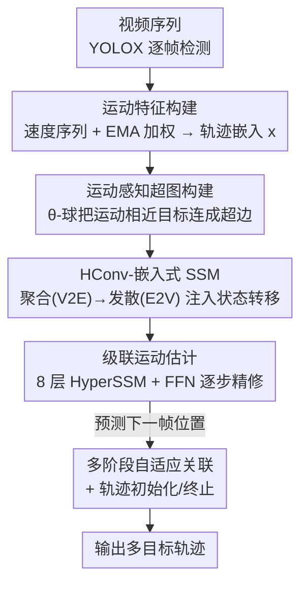

# Hypergraph-State Collaborative Reasoning for Multi-Object Tracking

**会议**: CVPR 2026  
**论文**: [CVF Open Access](https://openaccess.thecvf.com/content/CVPR2026/html/Song_Hypergraph-State_Collaborative_Reasoning_for_Multi-Object_Tracking_CVPR_2026_paper.html)  
**代码**: https://github.com/SkyeSong38/HyperMOT （有）  
**领域**: 视频理解 / 多目标跟踪  
**关键词**: 多目标跟踪, 运动估计, 超图, 状态空间模型, 协同推理

## 一句话总结
针对多目标跟踪里运动估计"各目标独立预测、易抖动、遮挡即断"的老毛病，本文提出 HyperSSM：用超图把运动状态相近的目标连成超边做"群体共识"，再把超图卷积嵌进状态空间模型（SSM）的状态转移里同时管时间平滑，从而让相关目标互相约束、彼此补全运动，在 MOT17/MOT20/DanceTrack/SportsMOT 四个线性与非线性基准上都拿到 SOTA。

## 研究背景与动机
**领域现状**：多目标跟踪（MOT）的主流是"tracking-by-detection"范式——先用检测器逐帧出框，再靠运动估计预测已有轨迹的下一帧位置，最后做检测与轨迹的关联。运动估计是这条链路的基石，因为只有把跨帧位移算准，身份才能稳定地接续下去。现有运动估计分两类：一类是手工卡尔曼滤波（KF）及其变体，假设匀速线性运动；一类是近年的可学习运动估计器（如 TrackSSM、DiffMOT），用数据驱动的网络去拟合复杂非线性动态。

**现有痛点**：作者点名两个长期未解的挑战。其一（C1）**运动噪声与不稳定**：吊诡的是，手工 KF 在 MOT17 这种简单线性轨迹上反而最稳，而可学习估计器虽然能建模非线性，但其本质上是概率性预测，常常引入抖动和波动，在线性场景里表现反而不如 KF 一致。其二（C2）**遮挡下的鲁棒性**：一旦目标被严重遮挡、视觉证据消失，无论 KF 还是可学习方法都难以维持时间连续性，轨迹会碎裂、身份会切换。

**核心矛盾**：这两个痛点的共同根源在于——**现有方法都是逐个目标独立估计运动**。每条轨迹只能靠自己有限的历史去推未来，没有外部信息来抑制自身的预测噪声；目标一旦不可见，就完全断了信息来源。可学习方法越想拟合复杂动态，单目标视角下的概率波动就越明显。

**本文目标**：让运动估计不再"单打独斗"，而是把存在运动相关性的目标拉到一起做联合推理——既要在某条轨迹变噪时用相关目标的共识把它拉回来（治 C1），又要在目标被遮挡时用相似运动模式的可见目标去概率性补全它的轨迹（治 C2）。

**切入角度**：作者观察到，场景里运动方向、速度相近的目标（比如同向行走的一群行人）其实蕴含强约束——如果其中一人被挡住，旁边同向移动者的运动趋势就能合理地推断出他的轨迹。但不能把所有目标无差别地聚合，否则会抹掉个体运动特征，所以要**有选择地**只关联运动状态高度相关的目标。这种"多对多、高阶"的关系恰好是普通图（边只连两点）表达不了的，而**超图**（一条超边可连多个顶点）天生适配。

**核心 idea**：用"超图做空间协同 + SSM 做时间平滑"的统一架构 HyperSSM，把超图卷积直接嵌入 SSM 的状态转移规则，让多目标空间共识与单轨迹时间连续性被同时优化。

## 方法详解

### 整体框架
HyperSSM 走的是 tracking-by-detection 五段式管线：YOLOX 检测器逐帧出候选框 → HyperSSM 运动估计模块预测已有轨迹的下一帧位置 → 多阶段自适应关联把轨迹与多置信度检测匹配 → 轨迹初始化/终止。其中**运动估计模块是全文创新所在**：它把每个目标的历史轨迹编码成运动特征，按运动相似度动态建超图，让相关目标在超图上"聚合再发散"地互相精修，并把这一空间协同过程嵌进 SSM 的时间递推里。模块由多层级联的 HyperSSM block 堆成，每层吃上一层的输出、在层间用隐状态传递信息，逐步把轨迹回归到真值。

输入是 $N$ 个目标在 $L$ 帧窗口内的位置信息 $P^N_L \in \mathbb{R}^{N\times L\times 4}$（每个框是 $(x,y,w,h)$），输出是平移一帧后的下一窗口位置 $P^N_{L_{t+1}}$。

### 关键设计

**1. 运动感知超图构建：用 θ-球只把"真同向同速"的目标连成超边**

要做协同推理，第一步得回答"哪些目标该互相约束"。作者把每个目标当作一个顶点，其运动特征 $x\in\mathbb{R}^d$ 构成顶点集 $V$；关键是这个运动特征怎么算——先对历史轨迹 $p_L\in\mathbb{R}^{L\times 4}$ 求逐帧位移得到速度序列 $v_t = p_t - p_{t-1}$，再用指数滑动平均（EMA）加权 $\hat v = \sum_{t=1}^{L}\alpha(1-\alpha)^{L-t}v_t$ 让近帧权重更高、抑制远帧噪声，最后过一个轨迹嵌入模块得到 $x$。建超边时不做无差别聚合，而是围绕每个运动特征建一个半径为阈值 $\theta$ 的 e-ball：$\text{ball}(v,e)=\{u\mid \|x_u-x_v\|_d<\theta,\ u\in V\}$，超边集 $E=\{\text{ball}(v,e)\mid v\in V\}$，并用 $|V|\times|E|$ 的关联矩阵 $H$ 表示。

这样设计直击痛点：只有运动方向、速度足够相近的目标才会被同一超边收进来，既保留了个体运动特征、又让"群体"有意义——这正是后面共识推理能抑噪、能跨目标补全的前提。消融显示 $\theta$ 太小会引入过多无效关联、太大则连接太少，$\theta=0.8$ 时最优。

**2. HConv-嵌入式 SSM：把超图的"聚合-发散"塞进 SSM 状态转移，一举管住空间共识与时间连续**

有了超图还不够——空间协同（超图）和时间平滑（SSM）若分开做，二者无法相互约束。本文的核心机制是把超图卷积（HConv）直接焊进 SSM 的递推里。HConv 本身做两件事：聚合阶段把顶点信息汇到超边 $x_e=\frac{1}{|N_v(e)|}\sum_{v\in N_v(e)} x_v\Theta$（V2E，形成群体共识），发散阶段再把超边特征带残差地散回顶点 $x'_v = x_v + \frac{1}{|N_e(v)|}\sum_{e\in N_e(v)} x_e$（E2V，做个体精修），矩阵形式为 $\text{HConv}(X)=\sigma(D_v^{-1}HWD_e^{-1}H^{T}X\Theta)$。

标准 SSM（S4）的递推是 $h_t=Ah_{t-1}+Bx_t,\ y_t=Ch_t+Dx_t$。HyperSSM 做了三处改动：(1) 在状态转移阶段对输入做 HConv，让隐状态从一开始就携带多目标交互信息；(2) 去掉冗余的 $D$ 参数避免过参数化，转而复用 HConv 里的可学习超图参数 $\Theta$；(3) 加残差把原始输入与变换后的隐状态合并、保住关键运动特征。最终算子为

$$h_t = A h_{t-1} + B\cdot\text{HConv}(X_t),\qquad Y_t = X_t + C h_t + \text{HConv}(X_t).$$

之所以有效：超图给出的"哪些目标该一起推"被作为关系约束直接注入了 SSM 的时序传播，于是空间群体一致性与时间轨迹平滑性被**同一套递推**联合优化——某条轨迹变噪时，超边里其他目标的共识通过 $\text{HConv}$ 进入状态转移把它拉稳；某目标遮挡不可见时，其隐状态仍能从同超边可见目标的动态里获得更新，从而完成跨目标运动补全。消融（Table 5）证实，固定检测与关联策略后，HyperSSM 比纯 SSM 在所有场景一致更好，且在非线性的 DanceTrack 上增益尤其大。

**3. 级联运动估计 + 协同跟踪管线：让信息在层间像信使一样逐步精修轨迹**

单个 HyperSSM block 只做一次协同，作者把它级联成多层运动估计模块：把 $N$ 个目标 $L$ 帧的位置编码成轨迹嵌入 $T^N_L$，作为 guidance 注入每一层；每层的输出喂给下一层，隐状态 $h$ 充当"信使"在级联层间传递信息，让轨迹一层层逼近真值，最后过 FFN 输出下一滑窗位置。消融显示层数超过 8 层收益递减、轨迹段长在 5 帧时性能峰值（太长会超出最优预测视野），故最终取 8 层 + 5 帧。

在整条跟踪管线上，关联不用经典匈牙利算法，而是采用强调轨迹级一致性的多阶段自适应关联：把检测分成 NMS 后保留的高置信、用于找回漏检的低置信、被 NMS 抑制的高置信三类，对每个轨迹-检测对算运动/空间/外观联合代价，在自适应阈值下迭代选最小互代价匹配。初始化则用"空间感知"策略——把已匹配轨迹的最新位置当锚点，锚点与剩余检测一起做 NMS，只有抑制后还存活的检测才用来建新轨迹，避免冗余/虚假轨迹。这套管线确保了创新的运动估计模块能真正落到稳定的身份维持上。

### 损失函数 / 训练策略
训练用滑窗内所有帧的 smooth L1 与 GIoU 联合损失：$L=\lambda_1\sum_t^L L_{L1}(P^t,P^t_{gt})+\lambda_2\sum_t^L L_{GIoU}(P^t,P^t_{gt})$。训练时用轨迹片段（而非图像），输入为 5 帧轨迹段的位置与运动数据；batch=128，Adam（lr=1e-4），8 层解码器；MOT17/MOT20/SportsMOT 训 360 epoch、DanceTrack 训 260 epoch。MOT17/MOT20/DanceTrack 只用 smooth L1，SportsMOT 因帧间位移更大额外加 GIoU 以加速收敛。

## 实验关键数据

### 主实验
在线性与非线性四个基准上均取得 SOTA（private 协议，HOTA 为主指标）：

| 数据集 | 运动类型 | 本文 HOTA | 此前最佳 motion-based | 备注 |
|--------|---------|-----------|----------------------|------|
| MOT17 | 线性 | **66.9** | DiffMOT 64.5 | IDF1 83.1 / MOTA 81.5 |
| MOT20 | 线性 | **65.2** | HybridSORT 63.9 | MOTA 80.0 / AssA 66.3 |
| DanceTrack | 非线性 | **65.7** | DiffMOT 62.3 | AssA 52.6（远超 DiffMOT 47.2）|
| SportsMOT | 非线性 | **78.5** | DiffMOT 76.2 | IDF1 80.0 / AssA 69.2 |

在 MOT17 上甚至同时超过了 KF 系（如 SparseTrack 65.1），打破了"可学习估计器在线性场景干不过 KF"的惯例。

### 消融实验
固定检测与关联策略、只替换运动估计模块（Table 5）：

| 运动模型 | MOT17 HOTA | DanceTrack HOTA | 说明 |
|----------|-----------|-----------------|------|
| Kalman | 64.5 | 47.0 | 线性强、非线性崩 |
| OC-Kalman | 64.6 | 52.5 | 改进 KF |
| SSM (TrackSSM) | 63.4 | 53.7 | 可学习但单目标 |
| **HyperSSM** | **65.5** | **59.7** | 线性持平 KF、非线性大幅领先 |

超参 $\theta$（运动相似度阈值，决定是否建超边）的消融（Table 6，MOT17）：

| θ | 0.5 | 0.7 | **0.8** | 0.9 | 0.95 | 0.98 |
|---|-----|-----|---------|-----|------|------|
| HOTA | 47.7 | 62.1 | **65.5** | 65.3 | 64.8 | 64.7 |
| IDF1 | 47.3 | 68.8 | **75.9** | 75.5 | 73.4 | 72.9 |

### 关键发现
- **协同推理的增益主要兑现在非线性/遮挡场景**：HyperSSM 相对纯 SSM 在 MOT17（线性）只涨约 2 个 HOTA，但在 DanceTrack（非线性、严重遮挡、频繁交叉）涨了 6 个（53.7→59.7），印证了"跨目标共识与补全"正是冲着 C1/C2 去的。
- **θ 呈倒 U 型且对小值极其敏感**：θ=0.5 时 HOTA 暴跌到 47.7，因为阈值太松会把不相关目标也连进超边、引入大量无效关联污染共识；太严（0.98）又连接太少、协同失效。0.8 是甜点。
- **层数与段长都有"最优视野"**：层数 >8、轨迹段 >5 帧后收益递减甚至下滑，说明协同精修和历史利用都存在边际效应，过长历史会超出最优预测窗口。
- **效率可调**：换不同大小 YOLOX（Table 7），大模型精度高（HyperSSM+YOLOX-X 达 135M 参数、17.5 fps），小模型更快（YOLOX-S 28.8 fps），可按部署权衡。

## 亮点与洞察
- **把"超图空间共识"焊进"SSM 时间递推"是真正的结构创新**：不是简单地把两个模块串起来，而是让超图卷积进入 SSM 的状态转移项 $B\cdot\text{HConv}(X_t)$，使空间相关性约束被时序传播自然携带——这比"先 GNN 后时序"的拼接更彻底，也解释了为何非线性场景增益大。
- **从"逐目标独立预测"转向"多目标高阶协同"是一个可迁移的范式转变**：作者明确指出，引入目标间高阶关系是运动估计的一条新原则。这个思路可迁移到轨迹预测、行人意图预估、群体行为分析等任何"个体被群体约束"的任务。
- **EMA 加权的运动特征 + θ-球建边**很朴素却很关键：它保证了超边收的是真·同向同速目标，既不抹个体、又能形成有意义的群体，是整套协同能 work 的地基。
- **遮挡补全的物理直觉清晰**："用同向可见者推断被挡行人轨迹"这一日常直觉被超图结构精确编码，是少见的"动机-机制"高度对齐的设计。

## 局限与展望
- **依赖运动相关性假设**：方法的根基是"场景里存在运动状态相近的目标群"。在目标稀疏、各自独立运动（如单人或互不相关的几个目标）的场景，超边退化、协同收益会消失，论文未充分讨论这种极端稀疏情形。
- **θ 是全局固定超参且高度敏感**：0.5→0.8 之间 HOTA 波动近 18 个点，且需逐数据集调；不同密度/运动模式场景可能需要不同 θ，缺少自适应阈值机制。
- **仍是 tracking-by-detection、强依赖 YOLOX 检测质量**：Table 7 显示换小检测器精度大幅下滑（YOLOX-S 仅 57.3 HOTA），协同推理无法弥补检测端的漏检。
- **作者承认的展望**：可扩展到更广的跟踪场景、或融合更丰富的模态（如外观、深度）来进一步增强协同运动推理。一个自然的改进是把 $\theta$ 做成可学习/场景自适应，或在超边里引入外观相似度而非仅运动相似度。

## 相关工作与启发
- **vs 查询式方法（MOTR 系 / MOTIP / SAMBA）**：它们把每个目标编码成持久 query、不显式建模运动，在目标数固定的高度非线性场景（DanceTrack）强，但 query 绑定固定目标、难应对目标增删，在线性 benchmark（MOT17/20）上 box 回归抖动明显。本文走显式运动估计路线，既避开了固定数量限制，又用协同推理压住了抖动。
- **vs 卡尔曼系（ByteTrack / BoT-SORT / OC-SORT）**：KF 靠匀速线性假设在监控类线性场景极稳，但非线性（舞蹈/运动）下崩盘。HyperSSM 在 MOT17 上追平甚至超过 KF，同时在非线性场景大幅领先，等于"既要 KF 的稳、又要可学习的非线性表达力"。
- **vs 单目标可学习运动估计（TrackSSM / DiffMOT / MambaMOT）**：它们都是逐目标独立预测，本文的差异在于引入超图把相关目标拉到一起联合推理——Table 5 中 HyperSSM 一致超过纯 SSM，正是这一点的直接证据。
- **vs 图学习式 MOT（GNN 做关联匹配）**：以往 GNN-MOT 把跨帧目标当节点、边表示潜在关联，仍是"逐目标分别跟"。本文用超图建模**同帧内多目标的运动相关性**做协同跟踪，捕获的是高阶交互，是对图式 MOT 的范式扩展。

## 评分
- 新颖性: ⭐⭐⭐⭐⭐ 超图协同 + 嵌入式 SSM 把"多目标高阶运动相关性"作为一等公民引入运动估计，范式层面的新意。
- 实验充分度: ⭐⭐⭐⭐ 四个线性/非线性基准全 SOTA，运动模型对照、θ/层数/段长/检测器消融齐备；缺稀疏场景与失败案例的定量分析。
- 写作质量: ⭐⭐⭐⭐ 动机-机制对齐清晰，bottom-up 叙述顺畅，图 1/2/3 配合好；部分公式排版（如 HConv 的 $X_v$ 下标）略含糊。
- 价值: ⭐⭐⭐⭐ "从独立预测到群体协同"的原则对跟踪/轨迹预测类任务有迁移价值，代码开源，工程可用。

<!-- RELATED:START -->

## 相关论文

- [\[CVPR 2026\] ProgTrack: A Multi-Object Tracking Algorithm with Progressive Matching Strategy](progtrack_a_multi-object_tracking_algorithm_with_progressive_matching_strategy.md)
- [\[CVPR 2026\] Out of Sight, Out of Track: Adversarial Attacks on Propagation-based Multi-Object Trackers via Query State Manipulation](out_of_sight_out_of_track_adversarial_attacks_on_propagation-based_multi-object_.md)
- [\[CVPR 2026\] Occlusion-Aware SORT: Observing Occlusion for Robust Multi-Object Tracking](occlusion-aware_sort_observing_occlusion_for_robust_multi-object_tracking.md)
- [\[CVPR 2026\] Dual-level Adaptation for Multi-Object Tracking: Building Test-Time Calibration from Experience and Intuition](tcei_test_time_calibration_experience_intuition_mot.md)
- [\[CVPR 2026\] VideoChat-M1: Collaborative Policy Planning for Video Understanding via Multi-Agent Reinforcement Learning](videochatm1_collaborative_policy_planning_for_vide.md)

<!-- RELATED:END -->
