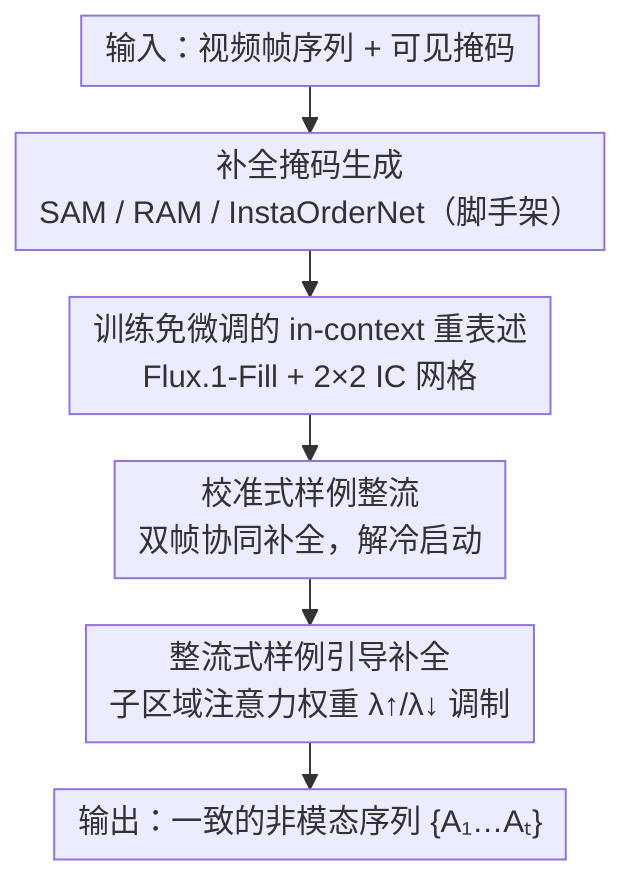

# Image Guides Images: Consistent Video Amodal Completion with Rectified In-Context Exemplar Guidance

**会议**: CVPR 2026  
**论文**: [CVF Open Access](https://openaccess.thecvf.com/content/CVPR2026/html/Kong_Image_Guides_Images_Consistent_Video_Amodal_Completion_with_Rectified_In-Context_CVPR_2026_paper.html)  
**代码**: https://github.com/xxyCSCV/IC-Amodal （有）  
**领域**: 视频理解 / 扩散模型 / 视频补全  
**关键词**: 视频非模态补全, 训练免微调, 视觉 in-context, 注意力调制, 扩散补全

## 一句话总结
IC-Amodal 提出一个**训练免微调**的视频非模态补全（VAC）框架：直接借用预训练图像 inpainting 模型（Flux.1-Fill），把 VAC 重述成"整流式 in-context 学习"——用双帧协同构造可靠样例解决冷启动，再通过子区域注意力权重调制把模型注意力锚定到样例上，从而在不训练的情况下同时拿到开放世界泛化和帧间一致性，超过需要在合成数据上微调的 SOTA。

## 研究背景与动机
**领域现状**：非模态补全（amodal completion）源自格式塔心理学，目标是从可见部分推断被遮挡物体的完整形状与外观。扩展到视频域（VAC）后，不仅要空间上补得合理，还要时间上跨帧一致。当前 SOTA（如 TACO、Diffusion-VAS）的主流做法是：在精心构造的非模态数据集上**微调专用视频生成模型**。

**现有痛点**：真实非模态数据对（遮挡前/遮挡后）极难采集，这些数据集往往规模小、分布不真实（多为合成或模拟遮挡）。这带来两个致命问题：训练开销大；更关键的是在真实世界、罕见或严重遮挡场景下**泛化能力受限**。

**核心矛盾**：要泛化就得用预训练大模型的开放世界知识，但预训练图像 inpainting 模型逐帧应用到视频时缺乏跨帧信息传播机制，会产生闪烁伪影和不一致补全。即"泛化（用图像先验）"与"时间一致性"之间存在直接冲突。

**本文目标**：在保留预训练模型泛化性的同时，确保 VAC 的时空一致性。作者把它分解为两个子问题——(1) 非模态任务没有现成样例（exemplar），如何为 in-context 学习构造样例？(2) 如何设计推理期机制，让模型显式聚焦于待补全物体特征、语义锚定到样例？

**切入角度**：视觉 in-context（IC）学习无需微调即可把任务先验注入预训练模型。但作者发现两个障碍：即使给真值（GT）样例，标准全局注意力也分不清"任务关键的非模态线索"和"无关上下文"；而且 IC 学习存在**冷启动**问题——非模态样例本身要靠 inpainting 生成，而 inpainting 模型倾向生成"看起来完整但与可见区结构不一致"的伪影。

**核心 idea**：用"整流式 in-context 样例引导"——双帧协同构造可靠样例（解冷启动）+ 子区域注意力权重调制（解上下文干扰），把训练免微调的图像 inpainting 模型改造成一致的 VAC 器。

## 方法详解

### 整体框架
IC-Amodal 以预训练 inpainting 模型 **Flux.1-Fill** 为底座（一个为补全任务微调过的 Flux 变体），输入是视频帧序列 $\{X_1,\dots,X_T\}$ 及其可见物体掩码 $\{M_1,\dots,M_T\}$，输出是完整物体外观序列 $\{A_1,\dots,A_T\}$。整条流水线的转法是：先用 SAM/RAM/InstaOrderNet 自动生成补全掩码（沿用 OW-Amodal，属脚手架步骤）；然后**第一阶段**用双帧协同把最可靠的两帧信息融合，整流出一个高质量样例对 $(X_{ex},A_{ex})$；**第二阶段**把样例对与每个目标帧拼成 $2\times2$ 的 IC 网格 $G_k=[X_{ex},A_{ex};X_k,I_{m,k}]$，让底座模型借自带的全注意力学到 $X_{ex}\to A_{ex}$ 的变换并迁移到 $X_k\to A_k$，同时通过注意力调制把焦点锚到样例上，逐帧生成一致的非模态序列。

### 关键设计

**1. 训练免微调的 in-context 重表述：把 VAC 变成"图教图"的类比学习**

针对"微调专用视频模型→泛化差"的痛点，作者完全不训练，转而把 VAC 重述为视觉 in-context 学习。具体把样例对 $(X_{ex},A_{ex})$（一帧原图及其非模态补全）与目标帧对 $(X_k,I_{m,k})$ 拼成 $2\times2$ 网格 $G_k=[X_{ex},A_{ex};X_k,I_{m,k}]$，其中 $I_{m,k}=M_k\odot X_k$ 是目标帧的可见部分。这个网格结构显式引导底座模型学习从 $X_{ex}\to A_{ex}$ 的"不完整→完整"变换，并把它套用到 $X_k\to A_k$，借 DiT 自带的全注意力隐式维持帧间一致性。这样既继承了 Flux.1-Fill 在大规模自然图像上的开放世界泛化，又给逐帧补全注入了一致性约束——这是"用图像先验做视频任务"的桥梁。

**2. 校准式样例整流：双帧协同解决冷启动的伪影问题**

IC 学习的前提是有可靠样例，但 VAC 是病态问题，初始样例只能靠 inpainting 生成，而 inpainting 模型有个已知毛病：倾向于在补全区按文本提示"凭空造出完整物体"，却忽略与目标物体可见区的结构一致性，产生伪影。一个坏样例会把错误传播到整段序列，造成全局补全困境。作者利用 VAC 的一个关键特性——**不同帧含有目标物体的互补信息**——做双帧协同整流：按"可见掩码覆盖越大、目标信息越完整"的直觉，选覆盖最大的帧作样例帧 $X_{ex}$，选覆盖次大且与 $X_{ex}$ 有**足够时间间隔**的帧作协同帧 $X_{ex\text{-}p}$（时间间隔保证两帧提供不同视角的互补信息）。把两帧及其掩码版拼成 $2\times2$ 网格同步补全，让物体信息自我整流，避免伪影，产出可靠样例。消融显示高质量样例对整段序列的质量与一致性至关重要。

**3. 整流式样例引导补全：子区域注意力权重调制锚定任务线索**

DiT 的自注意力能捕获全局信息、自带 in-context 能力，但 vanilla 注意力分不清任务关键线索和无关上下文，即使给 GT 样例也会失败。作者在 multimodal block 内对注意力权重做**子区域级**调制。把 query/key 索引划成五个不相交子集：文本 token $\Omega_T$ 和四个子图 token $\Omega_i$（$i\in\{1,2,3,4\}$），全局注意力 $A$ 看作块矩阵，$A_{i,j}$ 是子图 $j$ 到 $i$ 的注意力。聚焦三个与补全区 $I_{m,k}$ 相关的块——$A_{1,4}$（$X_{ex}\to I_{m,k}$）、$A_{2,4}$（$A_{ex}\to I_{m,k}$）、$A_{3,4}$（$X_k\to I_{m,k}$）。整流分两类：**放大正向引导**——把任务关键样例 $A_{ex}$ 对补全区的注意力乘 $\lambda^{\uparrow}$；**抑制无关干扰**——把无关区 $X_{ex},X_k$ 对补全区的注意力乘 $\lambda^{\downarrow}$：

$$\text{Attn}_{A_{ex}}=\lambda^{\uparrow}\cdot\text{Attn}_{A_{ex}},\quad \text{Attn}_{X_{ex}}=\lambda^{\downarrow}\cdot\text{Attn}_{X_{ex}},\quad \text{Attn}_{X_k}=\lambda^{\downarrow}\cdot\text{Attn}_{X_k}.$$

其余子区域注意力保持不变以维持正常交互。这样把模型全局注意力显式重定向到任务关键样例 $A_{ex}$，让它专注非模态补全优先级而非被无关上下文分心。与已有"文→图/参考→图"注意力操纵不同，由于 IC 子图间的信息交互，$A_{ex}\to X_{ex}$ 的变换信息也被增强并传递到补全区的特征学习。

### 损失函数 / 训练策略
本方法**完全无需训练/微调**：直接用公开预训练模型（Flux-fill 作底座），在 NVIDIA A6000 上推理即可输出一致的 VAC 结果。整流由推理期的注意力权重缩放（$\lambda^{\uparrow}/\lambda^{\downarrow}$）和帧选择规则驱动，没有可学习参数与损失函数。

## 实验关键数据

评测指标：**PSNR/SSIM/LPIPS** 衡量补全图像与真值非模态参考的保真度与感知质量；**IoU**（mean IoU）衡量非模态掩码对齐精度；**FVD** 衡量视频帧间一致性（越低越好）。底座 Flux-fill，A6000 推理。**IC-Amodal+** 指把原始补全输出与原可见区按 OW-Amodal 方式混合（blending）后的增强版本。

### 主实验
在 Kubric-Static / Kubric-Dynamic 两个 VAC 数据集上与图像/视频/非模态多类基线对比（节选）：

| 数据集 | 方法 | PSNR↑ | SSIM↑ | LPIPS↓ | IoU↑ | FVD↓ |
|--------|------|-------|-------|--------|------|------|
| Kubric-Static | Diffusion-VAS (CVPR25) | 21.358 | 0.845 | 0.101 | 84.3 | 228.05 |
| Kubric-Static | TACO (ICCV25) | 23.963 | 0.891 | **0.073** | 83.9 | **162.91** |
| Kubric-Static | IC-Amodal | 24.043 | 0.898 | 0.081 | 86.7 | 184.10 |
| Kubric-Static | IC-Amodal+ | **29.480** | **0.903** | **0.070** | **87.9** | 163.84 |
| Kubric-Dynamic | Diffusion-VAS (CVPR25) | 21.067 | 0.859 | 0.096 | 77.8 | 230.02 |
| Kubric-Dynamic | TACO (ICCV25) | 23.054 | 0.886 | 0.080 | 77.4 | 209.28 |
| Kubric-Dynamic | IC-Amodal | 24.705 | 0.910 | 0.070 | 85.5 | 188.81 |
| Kubric-Dynamic | IC-Amodal+ | **30.091** | 0.901 | **0.060** | 86.6 | **174.45** |

关键观察：在 Kubric-Dynamic 上，**无需任何训练**的 IC-Amodal 就超过了微调过的 Diffusion-VAS 和 TACO——PSNR 分别高出 3.638 dB 和 1.651 dB，FVD 分别降 41.21 和 20.47。加混合后 IC-Amodal+ 进一步拉开差距：PSNR 提升扩大到 9.024 dB 和 7.037 dB，FVD 降低 55.55 和 34.83。Static 上 FVD 仅略低于 TACO，其余指标 SOTA。视频专用方法 E2FGVI/Pix2Video 反而全面落后于非视频方法，根因是缺乏非模态补全意识——这反过来支撑了"有限视频微调会损害泛化"的论点。

### 消融实验
Table 2（Kubric-Dynamic）逐步加入 in-context（IC）、Sec 3.2 校准式样例整流、Sec 3.3 整流式引导补全：

| 配置 | IC | Sec 3.2 | Sec 3.3 | PSNR↑ | SSIM↑ | LPIPS↓ | IoU↑ | FVD↓ |
|------|----|---------|---------|-------|-------|--------|------|------|
| A-I | - | - | - | 23.69 | 0.845 | 0.099 | 81.2 | 278.25 |
| A-II | ✓ | - | - | 23.43 | 0.857 | 0.088 | 79.2 | 301.83 |
| A-III | ✓ | ✓ | - | 24.50 | 0.884 | 0.074 | 84.4 | 219.37 |
| Ours | ✓ | ✓ | ✓ | **24.71** | **0.910** | **0.070** | **86.6** | **188.81** |

### 关键发现
- **样例质量是命门**：A-II 直接上 vanilla IC（无整流）反而比 A-I 的 FVD 更差（301.83 vs 278.25），印证了"坏样例会全局传播错误"——in-context 不是免费午餐，没有可靠样例反而有害。
- **校准式样例整流贡献最大**：A-II→A-III 加入 Sec 3.2 后 FVD 从 301.83 骤降到 219.37、IoU 从 79.2 升到 84.4，说明双帧协同整流是把 IC 从"有害"扭转为"有用"的关键。
- **注意力整流补一致性的最后一公里**：A-III→Ours 加 Sec 3.3 后 FVD 再降到 188.81、SSIM 升到 0.910，专门改善帧间一致性。
- IC-Amodal 在严重遮挡、罕见/真实数据上鲁棒性突出，且学到的是"不完整→完整"变换而非简单复制样例（即使当前可见区结构与样例不完全匹配也能保持连贯补全）。

## 亮点与洞察
- **训练免微调还能超过微调 SOTA**：直接复用图像 inpainting 大模型的开放世界知识，用推理期机制补齐视频一致性，绕开了"采集真实非模态数据对"的死结，对数据稀缺任务是很有启发的范式。
- **诊断出 in-context 的两大陷阱并各个击破**：作者没有盲目套 IC，而是先实验揭示"GT 样例也会失败（注意力分不清线索）"和"冷启动（样例本身要生成）"，再针对性设计——这种"先证伪 naive 方案再补"的写法很有说服力。
- **子区域注意力调制可迁移**：把 DiT 全注意力按子图分块、对特定块乘 $\lambda^{\uparrow}/\lambda^{\downarrow}$ 来"指哪打哪"，这一思路可迁移到任何 grid-based in-context 生成任务（个性化、风格迁移、可控编辑），用来抑制无关上下文干扰。
- **双帧协同的帧选择规则简单但有效**：以可见掩码覆盖排序 + 时间间隔约束选互补帧，几乎零成本却显著提升样例可靠性。

## 局限与展望
- 强依赖底座 inpainting 模型（Flux.1-Fill）的能力上界，若底座在某类物体/纹理上本身泛化差，整流也难补救。
- 帧选择基于"可见掩码覆盖越大信息越完整"的直觉假设——当所有帧遮挡都很严重、没有"好帧"可选时，双帧协同的整流质量会受限。
- ⚠️ 真实世界数据与用户研究的定量结果放在补充材料，正文未给出，真实场景的绝对表现需看 supp。
- 推理期注意力调制引入了 $\lambda^{\uparrow}/\lambda^{\downarrow}$ 等超参，正文未给敏感性分析；其最优取值是否跨数据集稳定有待确认。
- Static 上 FVD 仍略逊于 TACO，说明在低运动场景一致性优势没那么明显。

## 相关工作与启发
- **vs TACO / Diffusion-VAS（微调式 VAC）**：他们在合成非模态数据上微调视频扩散模型，benchmark 强但真实遮挡泛化差且训练贵；IC-Amodal 完全不训练、靠图像先验 + IC，泛化与一致性兼得，在 Kubric-Dynamic 上反超它们。
- **vs OW-Amodal（训练免微调图像非模态）**：OW-Amodal 用预训练 inpainting + 迭代精修，计算贵且易误差累积，FVD 严重退化（缺乏帧间机制）；IC-Amodal 用 IC + 双帧整流一步到位，FVD 大幅领先。
- **vs Analogist / JeDI / IP-Prompt 等视觉 ICL**：这些方法面向生成/风格迁移，输入要么空间对齐、要么目标特征结构性给定；VAC 因遮挡造成特征错位且任务病态，vanilla ICL 会引入上下文噪声或生成无关物体——IC-Amodal 用显式整流机制专门解决这个语义锚定缺失问题。

## 评分
- 新颖性: ⭐⭐⭐⭐⭐ 把训练免微调 IC 学习引入 VAC，并诊断+解决其两大陷阱，范式新颖。
- 实验充分度: ⭐⭐⭐⭐ 主实验+消融充分，但真实数据/用户研究/超参敏感性都压到补充材料。
- 写作质量: ⭐⭐⭐⭐ 动机推导清晰、figure 2 的反例论证有力，公式与子区域定义略密。
- 价值: ⭐⭐⭐⭐⭐ 绕开非模态数据稀缺瓶颈，对自动驾驶/机器人等需要完整物体状态的下游有实用价值。

<!-- RELATED:START -->

## 相关论文

- [\[CVPR 2026\] Seeing Conversations: Communication Context Identification in Egocentric Video](seeing_conversations_communication_context_identification_in_egocentric_video.md)
- [\[CVPR 2026\] CVA: Context-aware Video-text Alignment for Video Temporal Grounding](cva_context-aware_video-text_alignment_for_video_temporal_grounding.md)
- [\[CVPR 2026\] Towards Data-Efficient Video Pre-training with Frozen Image Foundation Models](towards_data-efficient_video_pre-training_with_frozen_image_foundation_models.md)
- [\[CVPR 2026\] SAIL: Similarity-Aware Guidance and Inter-Caption Augmentation-based Learning for Weakly-Supervised Dense Video Captioning](sail_similarity-aware_guidance_and_inter-caption_augmentation-based_learning_for.md)
- [\[CVPR 2026\] VecAttention: Vector-wise Sparse Attention for Accelerating Long Context Inference](vecattention_vector-wise_sparse_attention_for_accelerating_long_context_inferenc.md)

<!-- RELATED:END -->
