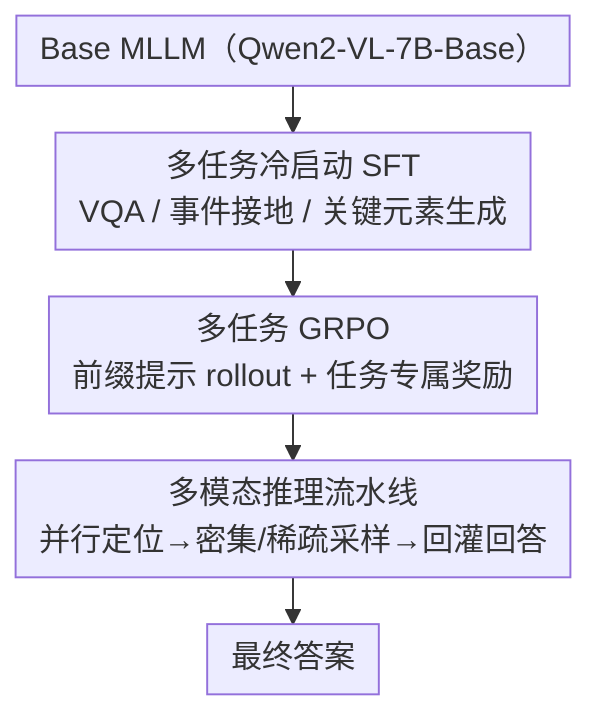

# Incentivizing Versatile Video Reasoning in MLLMs via Data-Efficient Reinforcement Learning

**会议**: CVPR 2026  
**论文**: [CVF Open Access](https://openaccess.thecvf.com/content/CVPR2026/html/Wang_Incentivizing_Versatile_Video_Reasoning_in_MLLMs_via_Data-Efficient_Reinforcement_Learning_CVPR_2026_paper.html)  
**代码**: https://github.com/Wang-Xiaodong1899/VideoReasoner  
**领域**: 视频理解  
**关键词**: 视频推理, 多模态大模型, 强化学习, GRPO, 数据高效, 多任务

## 一句话总结
本文提出 VideoReasoner：直接在 Base MLLM（Qwen2-VL-7B-Base）上用 3K 冷启动 + 5K 强化学习共 8K 数据，训练出"事件推理 / 关键帧推理 / 直接回答"三种视频推理能力，再在推理阶段把它们组合成"先定位关键事件与关键帧、再密集采样回灌生成答案"的流水线，在 7 个视频基准上大幅超过 Base 模型，并在多个基准上追平甚至超越用大规模数据训练的 Qwen2.5-VL-7B-Instruct。

## 研究背景与动机
**领域现状**：把强化学习（尤其是 DeepSeek-R1 式的可验证奖励 GRPO）从语言推理迁到多模态、用来增强视频 MLLM 的深度推理，是当前热门方向（如 Video-R1）。

**现有痛点**：(1) 现有视频 RL 框架训练不稳、成本高——Video-R1 要 165K 数据冷启动 + 260K 数据做 RL，且普遍建在 Instruct 模型上，而 Instruct 模型经过大规模 SFT 后有"直接给短答案"的强先验，反而抑制逐步推理，需要更大数据才能扭过来；(2) 现有方法只用**纯文本**推理路径，长链文本推理难以保证视觉信息的长期准确性，容易越推越错、产生幻觉；(3) 给更长的文本预算（>1K token）虽能激发自反思，却拖慢推理，成为真实视频应用的瓶颈。

**核心矛盾**：视频推理既要"推得对"又要"看得准"——纯语言推理链越长越偏离视觉证据；而要在 Instruct 模型上纠正"直接回答"先验又得砸大量数据。两者叠加导致现有方案要么贵、要么不可靠。

**本文目标**：(1) 不用 Instruct 模型、直接在 Base 模型上构建稳定高效的视频推理框架；(2) 把推理从纯文本扩展到"多模态元素"（事件、关键帧）以减少幻觉；(3) 把数据/训练成本压到极低（8K 级）。

**切入角度**：作者认为 Base 模型只经过多模态预训练、没有"直接回答"的诱导偏置，更适合多任务学习；同时视频里的"事件"和"关键帧"比文本能更清晰地表达信息，应该把它们作为推理的中间载体。

**核心 idea**：用"多任务冷启动 + 多任务 RL"先让 Base 模型学会三种视频推理能力，再在推理时让事件推理与关键帧推理并行、把定位到的视觉信息回灌模型生成直接回答——用多模态元素而非长文本链来支撑视频推理。

## 方法详解

### 整体框架
VideoReasoner 是一个两阶段训练 + 一个推理流水线的框架。先用多任务 SFT 冷启动让 Base MLLM 适配三种任务的输出格式（视频问答、事件接地、关键帧检测→关键元素生成），再用多任务 GRPO 真正强化其中的事件接地与视频问答能力，最后在推理阶段把三种能力串成"并行定位关键事件+关键帧 → 密集/稀疏采样 → 回灌生成答案"的流程。

### 关键设计

**1. 多任务冷启动 SFT：用统一指令把三种视频能力的"输出格式"教给 Base 模型**

Base 模型没有"直接回答"先验、但也不会任何特定任务格式，所以第一步是低成本冷启动。作者设计三个核心任务——**视频问答**、**视频事件接地**、**关键帧检测**，并用统一系统提示 + 不同任务前缀来区分：三类目标回答的最大区别就在前缀（"The answer is:" / "I want to locate the key event in the video." / "I want to output the key elements:"）。两个关键改造：(i) **关键帧检测重构为关键元素生成**——因为"关键帧"难以定义、MLLM 也难直接预测帧索引，于是让模型输出关键元素文本，再用视觉编码器检索对应帧；(ii) **事件接地用相对数值预测**——绝对时间预测高度依赖训练分布（在短视频上训出来就只会预测很小的时间值），改成预测时间比例 $[\text{start ratio}, \text{end ratio}]$，并插入两个可学习特殊 token `<|event_start|>` / `<|event_end|>` 让定位更稳。整个冷启动只用约 3K 样本（每任务约 1K），目标是"学会格式"而非"学透能力"。损失为标准的下一 token 预测：$p(X_a\mid X_v, X_{instruct})=\prod_{i=1}^{L}\pi_\theta(x_i\mid X_v, X_{instruct}, X_{a,<i})$，整条回答（含前缀）都参与计算。

**2. 多任务 GRPO：同一视频-问题用不同前缀 rollout 多任务，任务专属奖励互不干扰**

冷启动只让模型"会输出格式"，真正提升能力靠 RL。作者扩展 GRPO 到多任务：**数据层面**，对同一视频-query 用不同前缀提示让模型 rollout 出不同任务（选了事件接地 + 视频问答两个任务），从而一份数据多任务复用、提高数据利用率——而且无需人工造数据，直接复用 [50] 里同时带答案元数据和参考时间区间的数据集。**模型层面**，基于不同任务 rollout 的组内相对优势分别优化策略。多任务目标为

$$J_{\text{M-GRPO}}(\theta)=\mathbb{E}\Big[\frac{1}{G}\sum_{i=1}^{G}\big(\min(\rho_i A_i, \text{clip}(\rho_i, 1-\epsilon, 1+\epsilon)A_i)-\beta D_{KL}(\pi_\theta\|\pi_{ref})\big)\Big],$$

其中 $m=[X_v, q, g, p]$ 是拼上任务前缀 $p\in\{p_1,p_2\}$ 的多模态 query，$\rho_i=\pi_\theta(o_i\mid m)/\pi_{\theta_{old}}(o_i\mid m)$，优势 $A_i$ 用组内奖励标准化。与冷启动不同，**前缀 token 不计入 loss**，避免模型纠结于"输出哪种格式"或过拟合单一格式。奖励设计三项：**IoU 奖励**（事件接地：预测区间比例与真值的 IoU）、**格式奖励**（事件接地：是否正确预测两个特殊 token）、**准确率奖励**（视频问答：0/1）。巧妙之处在于——虽然两任务数据同 batch 采样，但 GRPO 只对 rollout token 算重要性权重，所以事件接地任务把 $r_{acc}$ 置 0、只优化 $r_{form}+r_{IoU}$，视频问答任务把 $r_{form}, r_{IoU}$ 置 0、只优化 $r_{acc}$，两任务目标不互相干扰：$r(o)=r_{IoU}+r_{form}+r_{acc}$。该阶段只用 5K 视频 query、不需要长 rollout，因此非常高效。

**3. 多模态推理流水线：并行定位关键事件与关键帧，把视觉证据回灌再回答**

训练完后，模型已具备事件接地、视频理解、关键帧检测三种能力，推理阶段把它们组合成一条减幻觉流水线。先把视频配上两种任务前缀**并行**喂给模型：一路输出关键事件的区间比例 $[S_r, E_r]$（乘视频时长得绝对区间 $[S_t, E_t]$），另一路输出关键元素——用文本编码器抽关键元素的文本嵌入、用视觉编码器抽均匀采样帧的视频嵌入，选相似度高的帧作为关键帧、得到一系列关键时间段。然后合并排序所有关键区间，对关键区间做**高 fps 密集采样**充分利用关键视觉信息；同时为防模型忽略全局，对其它非关键区域做**低 fps 稀疏采样**。最后把两部分采样帧合并排序、连同视频问答前缀一起回灌模型生成最终答案。这一步的本质是用"先定位、再聚焦采样"替代"长文本推理链"，让答案直接建立在被定位的视觉证据上，从而压低幻觉、也不需要长推理预算。

## 实验关键数据

### 主实验
基座 Qwen2-VL-7B-Base 全参微调；冷启动 3K（采自 [12,14,63]）、RL 5K（采自 [50]），每视频采 64 帧，H20 GPU。评测 7 个视频基准（Video-MME / LongVideoBench / MLVU / LVBench / VideoEval-Pro / VSI-Bench / MMVU）+ 时序接地 Charades-STA。

| 模型 | Video-MME Overall | MLVU | LVBench |
|------|-------------------|------|---------|
| Qwen2-VL-7B-Instruct | 59.3 | 61.7 | 39.7 |
| Baseline: Qwen2.5-VL-7B-Instruct | 62.4 | 63.0 | 37.7 |
| Baseline: Qwen2-VL-7B-Base | 58.3 | 61.4 | 36.8 |
| + RL (ours) | 60.8 | 63.0 | 38.4 |
| + VideoReasoner (ours) | 62.0 | 64.6 | — |

在 Base 上叠 RL 已在全部基准提升；再加推理流水线后整体追平/超过 Qwen2.5-VL-7B-Instruct（5 个基准超 Qwen2-VL-7B-Instruct、3 个超 Qwen2.5-VL-7B-Instruct），而总数据量仅 8K。

| 视频推理 | VSI-Bench | MMVU |
|----------|-----------|------|
| Qwen2.5-VL-7B-Instruct | 38.1 | 67.5 |
| + Video-R1 | 37.8↓ | 64.3↓ |
| + RL (ours) | **39.1**↑ | **68.0**↑ |
| Qwen2-VL-7B-Base | 28.9 | 61.1 |
| + RL (ours) | 33.7↑ (+4.8) | 62.4↑ (+1.3) |

时序接地 Charades-STA 上，冷启动后 Base 已超 Qwen2.5-VL-7B-Instruct，RL 后 mIoU 59.1 / R1@0.3 81.9 / R1@0.5 70.4 全面领先。幻觉基准 VideoHallu 上，纯文本 CoT 反而把分数从 34.3 砸到 6.6，而本方法升到 39.0，直接支撑"多模态推理减幻觉"的动机。

### 消融实验
| 配置 | 关键指标 | 说明 |
|------|---------|------|
| Baseline (Qwen2-VL-7B-Base) | Video-MME 58.3 | 未冷启动 |
| + Cold Start | 一致提升 | 冷启动稳定提升基线 |
| + RL（仅时序接地数据） | 仅长视频涨、其它降 | 该数据不以最终答案为奖励，伤准确率 |
| + RL（VQA + 时序接地） | 优于仅 VQA | 多任务 RL 有效 |

### 关键发现
- **纯文本 CoT 在视频上会反伤**：Video-R1 在 VSI-Bench/MMVU 上较 Instruct 基线下降，VideoHallu 上 CoT 把 34.3 砸到 6.6——印证长文本推理链脱离视觉证据会加重幻觉，是本文用多模态元素推理的核心论据。
- **多任务 RL 优于单任务**：只用时序接地数据做 RL 只在长视频场景有效、还会拖累其它任务（因为它不以最终答案作奖励）；VQA + 时序接地联合训练才稳定全面提升。
- **极致数据高效**：8K 数据（3K+5K）就让 Base 模型逼近用大规模数据训练的 Instruct 模型，凸显"在 Base 上做多任务学习"的样本效率优势。

## 亮点与洞察
- **"用 Base 不用 Instruct"的反直觉选择**：作者论证 Instruct 模型的"直接回答"先验反而是包袱，Base 模型无此偏置、更适合多任务推理学习——这个观察直接解释了为何只用 8K 数据就够。
- **把推理载体从文本换成视觉元素**：事件区间 + 关键帧作为可定位、可回灌的中间表示，比长文本链更贴近视觉证据，VideoHallu 上 +CoT 暴跌、+本方法上升的对照非常有说服力。
- **同前缀多任务 rollout 的数据复用**：同一视频-query 靠不同前缀生成不同任务 rollout，一份数据多任务用，且不计前缀 loss 避免格式过拟合——这套"前缀路由 + 奖励隔离"的多任务 GRPO 设计可迁移到其它多技能 RL 训练。
- **关键帧检测→关键元素生成的务实改造**：绕开"关键帧难定义、难直接预测索引"的坑，改成生成关键元素文本 + 编码器检索帧，工程上更落地。

## 局限与展望
- 框架刻意建在 **Base 模型**上以规避 Instruct 的先验差距，作者也坦言"如何在 Instruct 模型上弥合这个差距"留待后续，这意味着当前方案对已广泛部署的 Instruct 模型不一定直接最优。
- 推理流水线引入并行定位 + 密集/稀疏两路采样 + 回灌，**推理链路变长**，虽避免了长文本预算，但多次前向 + 编码器检索的整体时延论文未给量化对比。
- 多任务 GRPO 只选了事件接地 + 视频问答两个任务，关键帧推理能力主要在冷启动获得、未进入 RL，三种能力的强化并不均衡。
- 关键元素→关键帧依赖外部文本/视觉编码器的相似度检索，检索质量会直接影响回灌帧的有效性，论文未做检索器消融。

## 相关工作与启发
- **vs Video-R1**：Video-R1 用 165K+260K 大规模数据、纯文本 CoT、建在 Instruct 上；本文用 8K 数据、多模态元素推理、建在 Base 上，更省更稳，且在 VSI-Bench/MMVU 上反超。
- **vs Video-of-Thought**：VoT 把视频任务拆成低层感知到高层认知的子问题做逐步文本推理；本文不堆文本推理步骤，而是用事件/关键帧这类视觉中间元素，并把它们回灌生成答案。
- **vs Seed1.5-VL / InternVL3.5 等级联 RL 框架**：这些工作靠大规模 SFT+RL 级联、仍以语言推理为主；本文强调多模态元素推理 + 极低数据成本的差异化路线。

## 评分
- 新颖性: ⭐⭐⭐⭐ "多模态元素推理 + 多任务 GRPO + Base 模型"组合新颖，尤其用视觉元素替代长文本链的视角有价值。
- 实验充分度: ⭐⭐⭐⭐ 覆盖 7 个视频基准 + 时序接地 + 幻觉 + 多组消融，对照清晰；推理时延等成本量化略缺。
- 写作质量: ⭐⭐⭐⭐ 动机—方法—实验链条完整，三阶段框架讲得清楚。
- 价值: ⭐⭐⭐⭐ 8K 数据逼近大规模 Instruct 模型，代码开源，对低成本视频推理训练有直接参考意义。

<!-- RELATED:START -->

## 相关论文

- [\[CVPR 2026\] Efficient Frame Selection for Long Video Understanding via Reinforcement Learning](efficient_frame_selection_for_long_video_understanding_via_reinforcement_learnin.md)
- [\[CVPR 2026\] VAST: Video Ability-Stratified Taxonomy for Data-Efficient Video Reasoning](vast_video_ability-stratified_taxonomy_for_data-efficient_video_reasoning.md)
- [\[CVPR 2026\] Learning Transferable Temporal Primitives for Video Reasoning via Synthetic Videos](learning_transferable_temporal_primitives_for_video_reasoning_via_synthetic_vide.md)
- [\[CVPR 2026\] Learning to Assist: Physics-Grounded Human-Human Control via Multi-Agent Reinforcement Learning](learning_to_assist_physics-grounded_human-human_control_via_multi-agent_reinforc.md)
- [\[CVPR 2026\] VideoChat-M1: Collaborative Policy Planning for Video Understanding via Multi-Agent Reinforcement Learning](videochatm1_collaborative_policy_planning_for_vide.md)

<!-- RELATED:END -->
