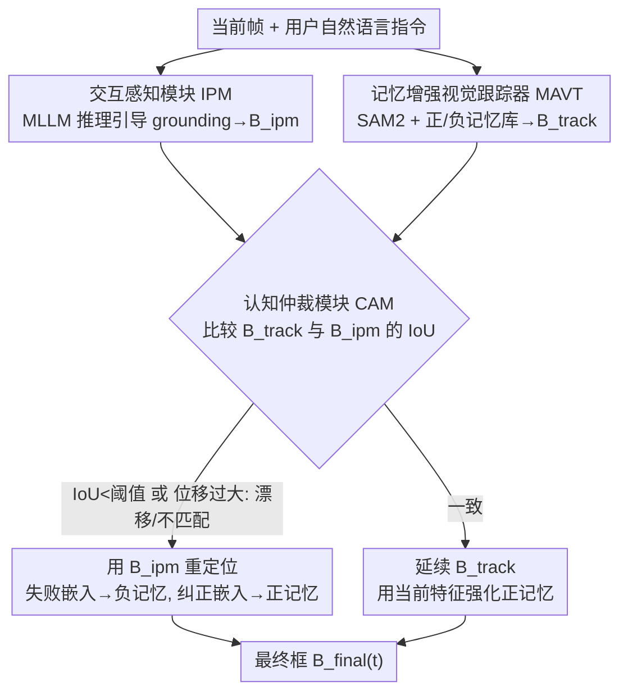

# Interactive Tracking: A Human-in-the-Loop Paradigm with Memory-Augmented Adaptation

**会议**: CVPR 2026  
**论文**: [CVF Open Access](https://openaccess.thecvf.com/content/CVPR2026/html/Huang_Interactive_Tracking_A_Human-in-the-Loop_Paradigm_with_Memory-Augmented_Adaptation_CVPR_2026_paper.html)  
**代码**: 基准/结果/分析在论文页 URL 公开（具体地址⚠️以原文为准）  
**领域**: 视频理解 / 视觉目标跟踪 / 人在回路  
**关键词**: 交互式跟踪、人在回路、自然语言指令、记忆增强、基准 InteractTrack

## 一句话总结
提出"交互式跟踪"新范式——用户可在视频任意时刻用自然语言指令引导/纠正跟踪器，配套发布首个大规模交互跟踪基准 InteractTrack（150 视频、14 万帧、四维评测协议）并实测 25 个 SOTA 跟踪器全部失效，再给出带正负记忆库的强基线 IMAT。

## 研究背景与动机

**领域现状**：视觉目标跟踪（VOT）是计算机视觉基石，给定首帧目标框后持续定位目标，广泛用于监控、自动驾驶、机器人。从 Siamese 系（SiamFC、SiamRPN）到 Transformer 系（TransT、STARK、MixFormer、OSTrack），再到像素级的 VOS（XMem、SAM2），技术不断进步。引入语言后还有 VLT（视觉-语言跟踪）和 RVOS（指代视频目标分割）。

**现有痛点**：现有跟踪器几乎都是"一次初始化、之后自动运行（fire-and-forget）"的非交互模式。可现实里跟踪很少是一锤子买卖——以一段篮球视频为例（论文 Fig.1）：观众注意力会从持球球员、转到另一名球员、再到快速移动的球、最后到另一个控球人。这种焦点的动态切换对人很自然，但现有系统初始化后只会自动跑、不支持用户在中途介入。VLT/RVOS 虽吃语言，但通常**只在初始化时做一次性 grounding 或离线运行**，无法处理时序上接连到来的用户指令，也撑不起实时人在回路交互。

**核心矛盾**：交互式跟踪要求模型**实时持续响应用户引导、理解自然语言、动态切换焦点**——它把感知、推理、人机交互紧耦合在一个连续反馈回路里，远难于传统跟踪。而现有范式（纯外观的 VOT、单次 grounding 的 VLT/RVOS）和现有基准（VOT、LaSOT、VideoCube、TNL2K 等）全是为**纯自动**设定造的，既没有交互机制、也没有衡量"响应性/适应性"的协议。

**本文目标**：① 定义交互式跟踪任务；② 造一个能系统评测"理解-响应-适应人类引导"能力的基准；③ 给一个能从用户反馈中学习、动态更新跟踪行为的基线。

**切入角度**：既然瓶颈在"没有交互监督的数据和协议"，那就先把数据和评测补齐——重新标注 150 段视频，给每段插入 4-5 条带时间戳的语言指令（初始化、漂移纠正、焦点精修、意图切换），并设计四维评测协议。

**核心 idea**：把人类智能当成自动感知的补充——让用户在任意帧用自然语言指令引导跟踪器，跟踪器靠一个带正/负记忆库的动态记忆机制从反馈中学习并即时调整。

## 方法详解

本文有三块贡献：基准 InteractTrack、四维评测协议、基线 IMAT。方法核心是 IMAT，它由三个模块协同：交互感知模块（IPM）做语言 grounding、记忆增强视觉跟踪器（MAVT）做稳定传播、认知仲裁模块（CAM）当高层决策控制器决定"保持还是纠正"。

### 整体框架

IMAT 把"视觉跟踪的时空一致性"和"多模态大模型（MLLM）的语义推理"统一起来。流程：用户初始化后 MAVT 持续跟踪；用户可在任意帧发自然语言指令 $P_t$（如"盯住中间那只黑熊"），IPM 据当前帧 $I_t$ + 指令做 grounding 给出语义对齐框 $B_{ipm}(t)$；CAM 在交互帧（用户发指令或检测到运动不一致时）把跟踪器预测 $B_{track}(t)$ 与 IPM 的 grounding 框做 IoU 比较，决定是**确认当前状态**还是**纠正轨迹并更新记忆库**。一致就强化正记忆继续传播，漂移/不匹配就用 $B_{ipm}(t)$ 重定位、把失败嵌入塞进负记忆、把纠正后嵌入塞进正记忆——这种"正反馈+负学习"的双向更新让 IMAT 在持续交互中不断变强。

### 关键设计

**1. 交互感知模块 IPM：人在回路的语义入口**

针对"现有跟踪器无法理解、无法响应用户指令"这一痛点，IPM 充当人在回路接口。任意帧 $t$ 用户可发自然语言查询 $P_t$，IPM 同时处理当前帧 $I_t$ 与查询 $P_t$ 做视觉-语言 grounding，输出语义对齐框 $B_{ipm}(t)$。实现上用基于 MLLM 的感知模型 **Rex-Omni** 实例化，把视觉特征与用户描述对齐——它输出的 grounding 框既可用来**重初始化**跟踪器、也可经 CAM **校验**当前跟踪状态。这一模块把"语言意图"翻译成"空间框"，是整个交互闭环的语义起点。

**2. 记忆增强视觉跟踪器 MAVT：正负双记忆库实现自适应外观学习与干扰抑制**

针对"跟踪器靠固定首帧模板、无法随反馈适应"的问题，MAVT 在 SAM2 之上扩展两个外部记忆库——正记忆 $M^+$ 与负记忆 $M^-$，每帧预测框条件于两个库：$B_{track}(t)=\mathrm{Tracker}(I_t; M^+, M^-)$。$M^+$ 存"已验证的目标线索"嵌入，让跟踪器随时间适应姿态、光照、尺度的合法变化；$M^-$ 存"干扰物、失败预测、被切换掉的旧目标"嵌入，帮跟踪器在曾经混淆/歧义的区域**抑制响应**。两个库都在**新颖性与多样性约束**下动态更新，保持紧凑又有表达力、避免冗余。相比 SAM2 只有正向记忆传播，负记忆是关键增量——它把"过去错在哪"显式编码进去，专治目标切换后跟回旧目标的问题。

**3. 认知仲裁模块 CAM：只在必要时介入的高层决策控制器**

针对"何时该信跟踪器、何时该信用户/语义"的矛盾，CAM 当高层控制器决定保持还是纠正。它在交互帧（用户指令触发 IPM 或跟踪器检测到运动不一致）被激活，用 IoU 比较跟踪器预测 $B_{track}(t)$ 与 IPM grounding 框 $B_{ipm}(t)$：$\mathrm{IoU}=\frac{\mathrm{area}(B_{track}\cap B_{ipm})}{\mathrm{area}(B_{track}\cup B_{ipm})}$。当 IoU 低于阈值 $\tau_{iou}$、或相邻框中心位移超过 $\delta_c$ 时判为潜在漂移，CAM 调 IPM 复核当前预测是否对应意图目标；若 grounding 结果显示不匹配，就用 $B_{ipm}(t)$ 重初始化、并把失败嵌入加进 $M^-$、纠正嵌入加进 $M^+$；若一致则延续传播、用当前特征强化 $M^+$。最终框 $B_{final}(t)=B_{ipm}(t)$（检测到漂移/不匹配时）或 $B_{track}(t)$（否则）。实践中初始化用 $\tau_{iou}^{init}=0.3$（避免重叠）、运行时仲裁用 $\tau_{iou}^{reinit}=0.6$。这种**选择性仲裁**只在必要时融合空间/语义/运动线索，兼顾效率、鲁棒与稳定。

### 一个完整示例

以篮球场景走一遍：用户先框定持球球员初始化，MAVT 用 SAM2 + 正记忆稳定传播。第 #42 帧用户发"盯住中间那只黑熊"（意图切换），IPM 把这句话 grounding 成一个新框 $B_{ipm}$；CAM 算它与当前 $B_{track}$ 的 IoU，发现远低于 $0.6$（指向了不同目标）→ 判为不匹配 → 用 $B_{ipm}$ 重初始化跟踪器，把"原球员"的嵌入丢进负记忆 $M^-$（以后别再跟回去）、把"黑熊"嵌入放进正记忆 $M^+$。之后若黑熊被遮挡、跟踪器漂移导致中心位移超 $\delta_c$，CAM 再次触发 IPM 复核重定位。整个过程里正记忆累积合法外观变化、负记忆累积该躲的干扰，跟踪行为随交互逐步收敛到用户真正想要的目标。

## 实验关键数据

InteractTrack 含 150 视频、>14 万帧、平均 947 帧/段、>700 条语言描述，覆盖六类场景（日常活动、体育分析、无人机、监控、野生动物、其他），所有序列按交互协议**重新标注**（不复用旧标签）。框由至少两名标注者独立核验、分歧由资深标注者裁决；语言走"人-GPT-人"流水线生成、含初始化/漂移纠正/焦点精修/意图切换等类型，目标缺失时也用 'absent' 标签显式标注。

四维评测协议：**Perception（感知）**——用户发指令帧上能否准确定位描述目标（IoU>0.5 判对，含 $Acc_{perc}$ 与 $Prec_{perc}$）；**Responsiveness（响应性）**——切换目标时预测框是否更靠近新目标 $G^{new}_t$ 而非旧目标 $G^{old}_t$ 且 IoU>0.5；**Tracking（跟踪能力）**——标准 AUC 与 Precision；**Interactiveness（交互分）**——用户指令把视频切成 K 段，对每段有效帧求 IoU 均值再对 K 段平均，衡量整段人机协作效果。

### 主实验（InteractTrack 测试集，统一交互协议；Ours 即 IMAT）

⚠️ 下表列名对应原文四维分组（交互分 / 响应性 / 感知 Acc·Prec / 跟踪 AUC·Prec·NormPrec），数值以原文 Table 2 为准。

| 方法 | 交互分↑ | 响应性↑ | 感知Acc↑ | 感知Prec↑ | 跟踪AUC↑ | 跟踪Prec↑ | NormPrec↑ |
|------|------|------|------|------|------|------|------|
| **Ours (IMAT)** | **45.25** | **41.20** | **52.78** | **49.63** | 45.86 | 49.63 | **60.90** |
| Sa2VA (RVOS) | 44.81 | 38.99 | 45.50 | 46.05 | 24.14 | 21.10 | 33.39 |
| VL-SAM2 (VOS) | 44.43 | 37.72 | 48.82 | 46.52 | 41.88 | 45.73 | 56.84 |
| SAMURAI (VOS) | 43.69 | 37.20 | 49.36 | 46.44 | 41.53 | 45.57 | 56.59 |
| DAM4SAM (VOS) | 43.19 | 37.62 | 49.89 | 46.58 | 43.79 | 48.74 | 59.72 |
| SUTrack (VLT) | 40.90 | 38.04 | 49.25 | 48.38 | 44.25 | 47.23 | 58.26 |
| MCITrack (VOT) | 40.38 | 37.93 | 47.97 | 47.48 | 44.98 | 47.92 | 59.61 |
| JointNLT (VLT) | 30.66 | 36.67 | 44.33 | 43.08 | 19.81 | 16.16 | 30.44 |

IMAT 在交互分（45.25）与响应性（41.20）上都最高，证明它对自然语言指令理解更强、对交互线索适应更快；同时跟踪 NormPrec（60.90）也最高，长时稳定性好。

### 各范式表现分析

| 范式 | 代表方法 | 强项 | 弱点（交互设定下） |
|------|------|------|------|
| VLT | SUTrack、DUTrack | 联合视觉-语言表示→响应性/感知较高 | 长序列定位退化、时序鲁棒性有限 |
| VOS | SAMURAI、VL-SAM2 | 分割先验→短时精度强 | 掩码跟踪易被遮挡/快速运动打断 |
| VOT | OSTrack、STARK、MixViT | 静态/受限条件下精度稳 | 不懂文本引导→交互场景表现弱 |
| RVOS | Sa2VA、VideoLISA | 能响应文本线索 | 时序稳定性差、持续交互鲁棒性低 |

### 关键发现
- **传统强不等于交互强**：25 个代表性跟踪器在常规自动设定下很能打，但全都难以泛化到动态、用户驱动的交互任务——这正是 InteractTrack 想暴露的 gap。
- **负记忆+仲裁是涨点关键**：IMAT 靠 IPM/MAVT/CAM 联合，把感知、跟踪、交互拧到一起，才在四维上一致领先；尤其负记忆显式编码"该躲的干扰"，对目标切换后不跟回旧目标很有用。
- **场景泛化好**：OPE 协议下六类场景成功率图里 IMAT 多数环境最佳（如日常活动 0.488），在体育/日常这类频繁目标切换、无人机/监控这类尺度变化与长时视角偏移场景都稳。

## 亮点与洞察
- **任务定义本身是最大贡献**：把"fire-and-forget 跟踪"重构成"任意时刻可语言介入的人在回路跟踪"，并配齐基准+协议+基线，是能开一个子方向的工作，而非单纯刷点。
- **四维评测协议设计巧**：感知/响应/跟踪/交互分把"理解指令-切换目标-稳定跟踪-整段协作"解耦成可量化维度，比单一 AUC/Precision 更能刻画交互能力。
- **正负双记忆库可迁移**：把"该记住的目标线索"与"该抑制的干扰/旧目标"分库存储、按新颖性+多样性更新，这套思路可迁到任何需要在线适应又怕被干扰带偏的跟踪/检测任务。
- **选择性仲裁省算力**：CAM 只在用户指令或运动不一致时才介入融合多模态线索，避免每帧都跑昂贵 MLLM grounding，是实用的工程权衡。

## 局限与展望
- IMAT 定位为"强基线"，三模块多是现成大模型（Rex-Omni、SAM2）拼装，IPM 的 grounding 质量、CAM 阈值（$\tau_{iou}^{init}=0.3$、$\tau_{iou}^{reinit}=0.6$、$\delta_c$）对结果影响大，论文未给系统的阈值敏感性消融⚠️。
- 自己看：主表只给绝对四维分，缺逐模块消融（去掉负记忆/去掉 CAM 各掉多少）来证明各组件贡献；交互分等绝对值整体偏低（IMAT 也才 45 上下），说明任务本身远未解决。
- 依赖 MLLM grounding 实时性存疑：每次交互帧调 Rex-Omni 的延迟在真正实时场景下能否满足，论文未充分量化。
- 基准虽覆盖六类场景但仅 150 视频，相对自动跟踪基准（LaSOT 280、TNL2K 700）规模偏小，密集交互标注的成本是天然瓶颈。

## 相关工作与启发
- **vs 传统 VOT（OSTrack、STARK、MixFormer）**：他们靠首帧固定模板做特征匹配，纯外观、不懂语言；本文要求实时响应语言指令、动态切换焦点，并用 IPM+CAM 把语义介入接进来。
- **vs VLT / RVOS（SUTrack、Sa2VA、VideoLISA）**：他们用 BERT/CLIP 或 MLLM 做单次 grounding、多为离线或一次性指定目标；本文支持序列化、运行时接连到来的用户指令与上下文更新。
- **vs SAM2 等交互分割基础模型**：SAM2 统一图像/视频交互但记忆是单向正传播；IMAT 在其上加负记忆 + 认知仲裁，把"用户反馈学习"做成持续闭环而非单次提示。

## 评分
- 新颖性: ⭐⭐⭐⭐⭐ 提出交互式跟踪新范式并配齐"基准+协议+基线"三件套，定义了一个能持续做下去的子方向。
- 实验充分度: ⭐⭐⭐⭐ 实测 25 个跟踪器、四维协议、六场景 OPE 很全面，但缺 IMAT 自身的逐模块消融与阈值敏感性。
- 写作质量: ⭐⭐⭐⭐ 任务动机、基准构建、协议、IMAT 三模块都讲清楚，篮球例子很有画面；表格列名分组稍密需对照原文。
- 价值: ⭐⭐⭐⭐⭐ 直击体育分析、无人机监控等真实人在回路需求，基准+协议会成为后续工作的事实标准。

<!-- RELATED:START -->

## 相关论文

- [\[CVPR 2026\] Dual-level Adaptation for Multi-Object Tracking: Building Test-Time Calibration from Experience and Intuition](tcei_test_time_calibration_experience_intuition_mot.md)
- [\[CVPR 2026\] RAGTrack: Language-aware RGBT Tracking with Retrieval-Augmented Generation](ragtrack_language-aware_rgbt_tracking_with_retrieval-augmented_generation.md)
- [\[CVPR 2026\] OmniVTG: A Large-Scale Dataset and Training Paradigm for Open-World Video Temporal Grounding](omnivtg_a_large-scale_dataset_and_training_paradigm_for_open-world_video_tempora.md)
- [\[CVPR 2026\] Learning to Assist: Physics-Grounded Human-Human Control via Multi-Agent Reinforcement Learning](learning_to_assist_physics-grounded_human-human_control_via_multi-agent_reinforc.md)
- [\[ECCV 2024\] Online Temporal Action Localization with Memory-Augmented Transformer](../../ECCV2024/video_understanding/online_temporal_action_localization_with_memory-augmented_transformer.md)

<!-- RELATED:END -->
