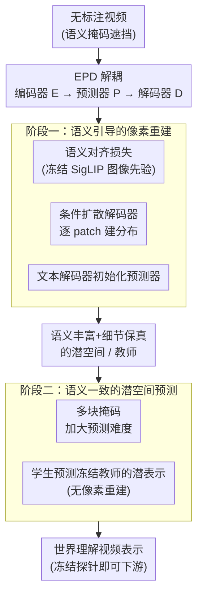

# InternVideo-Next: Towards World-Understanding Video Models

**会议**: CVPR 2026  
**论文**: [CVF Open Access](https://openaccess.thecvf.com/content/CVPR2026/html/Wang_InternVideo-Next_Towards_World-Understanding_Video_Models_CVPR_2026_paper.html)  
**代码**: https://github.com/OpenGVLab/InternVideo （论文称将发布）  
**领域**: 视频理解 / 自监督表示学习  
**关键词**: 掩码视频建模、自监督预训练、潜空间世界模型、扩散解码器、视频基础模型

## 一句话总结
InternVideo-Next 把传统掩码视频建模的"编码器-解码器"拆成 **编码器-预测器-解码器（EPD）** 三段，并用两阶段自监督预训练（阶段一：条件扩散解码器 + 图像级语义先验构造一个"既保细节又有高语义"的潜空间；阶段二：在该潜空间上向冻结教师做潜空间预测学世界知识），仅用公开无标注视频，就让一个**没有任何视频-文本监督**的模型在 K400/SSv2 等基准上首次超过视频-文本预训练对手。

## 研究背景与动机

**领域现状**：大规模视频表示学习主要两条路。一是**文本监督**（CLIP 风格的视频-文本对齐，如 InternVideo2、VideoPrism），在动作识别这类语义/以人为中心的任务上表现强；二是**自监督的掩码视频建模 MVM**（如 VideoMAE、V-JEPA），直接从视频时空结构里学。

**现有痛点**：文本监督依赖昂贵且嘈杂的合成字幕（视频字幕常由标题+ASR 拼凑），语义覆盖有限，难以捕捉深度、细粒度运动、因果关系这类**非语义的隐式世界知识**。而 MVM 虽能直接利用时空结构，却在 K400 这类"强依赖主体语义"的通用任务上一直落后于文本监督方法。

**核心矛盾**：作者认为这个差距不是 MVM 的内在局限，而是被忽视的**架构问题**：① **像素级重建** 收敛困难，且其低层像素需求与高层语义抽象天然冲突——线性解码器要求预测器输出能线性投影到像素、即"在像素空间可分"，这会逼着潜空间偏向低层细节、压制语义；② **潜空间预测**（如 V-JEPA 的对称教师-学生）容易走捷径（shortcut learning），学到肤浅的时序统计而非真正的世界知识。

**本文目标**：构造一个统一框架，让自监督视频模型同时做到——桥接像素保真与高层语义抽象、从预测中学到鲁棒时空动态/因果/3D 几何先验而不走捷径。

**切入角度**：把 MVM 的编码器-解码器显式解耦成 **Encoder-Predictor-Decoder（EPD）**，单独审视常被忽略的**预测器输出潜空间**。关键洞察是：编码器和预测器应共享一个"语义丰富又保真细节"的输出潜空间，这样预测器就成了一个**潜空间世界模型（Latent World Model）**，被迫用真实时空关系和隐式世界知识补全缺失内容，而非靠平凡相关。

**核心 idea**：用"条件扩散解码器 + 图像语义先验"先建好这个潜空间（阶段一），再在其上向冻结教师做潜空间预测学世界知识（阶段二）。

## 方法详解

### 整体框架
InternVideo-Next 的总思路是：先把 MVM 重新表述成 EPD 三段——**E**（ViT 编码器，从输入视频提时空表示）、**P**（轻量 Transformer，基于可见 token 预测被掩码区域的潜表示）、**D**（重建模块，把预测器输出潜表示映到目标空间，可以是像素也可以是目标潜表示）。这个解耦让人能单独检查"预测器输出潜空间"的质量，而这正是解决上述两个挑战的关键。在此之上分两阶段训练：**阶段一**用语义引导的像素重建，把潜空间构造成"语义对齐 + 细节保真 + 结构一致"；**阶段二**冻结阶段一得到的教师，在这个已经连贯的潜空间上做掩码潜空间预测，学时空动态与因果关系。整个过程只用公开无标注视频。

### 关键设计

**1. EPD 解耦：把"编码器-解码器"拆成"编码器-预测器-解码器"**

传统 MVM（如 MAE）是编码器-解码器：ViT 解码器直接拿编码器输出生成重建像素，预测器与解码器混在一起，其输出潜空间从未被单独审视。本文显式把它拆成 **E（编码）→ P（预测被掩码区域潜表示）→ D（映到目标空间）**。这一拆解的价值在于：它揭示了"编码器和预测器应共享一个语义丰富又保真细节的潜空间"这一被忽视的洞察——一旦强制如此，预测器就变成一个**潜空间世界模型**，必须用真实时空关系和隐式世界知识（几何、运动）去补全，而不是靠平凡相关；这反过来也增强了编码器表示里的语义抽象。后续两阶段都是围绕"如何把这个潜空间建好、用好"展开。

**2. 阶段一·条件扩散解码器：替掉线性解码器，化解"像素可分"与"语义抽象"的冲突**

像素重建框架里常用的线性解码器，要求预测器输出潜表示能被线性投影到像素、即在像素空间可分，这会损害"语义信息与细粒度细节"的平衡。本文改用一个**轻量条件扩散解码器**：对每个 patch 独立建模其分布——用一个由几层残差块组成的小 MLP 做去噪，条件向量 $z$ 由预测器产生、输出对应像素，噪声 schedule 为 cosine、训练 1000 步。因为它只建单个 patch 的潜分布，小 MLP 就够、开销很小。消融显示：把语义对齐朴素地塞进像素重建会因优化冲突掉点（K400 69.8 vs 单独对齐 70.7），但引入扩散解码器把这种退化**逆转成 +4.4% 增益**（74.2），证明扩散解码器让像素保真与高层语义得以共存。

**3. 阶段一·图像级语义先验 + 语义对齐损失 + 语义掩码**

视频-文本预训练受字幕稀疏嘈杂之苦，而**图像-文本**语料海量且字幕更干净、更全面。于是本文从冻结的图像语义模型（最终版用 SigLIP2-1B）注入图像级语义先验：用余弦相似度让"学生对掩码视频的编码"对齐"教师对完整视频可见区域的编码"：

$$\mathcal{L}_{sem} = -\cos\big(E(X_{vis}),\ \text{vis}(\text{SigLIP}(X))\big)$$

阶段一同时优化像素重建与语义对齐（等权）。配套的**语义掩码**用语义教师的注意力分数做 top-k，优先遮挡时序上信息量大的区域；预测器 $P$ 还用预训练**文本解码器（ModernBert-L 的后 5 层）初始化**，提供更好的语义先验和两个潜空间间的平滑翻译，因而比常规零初始化 ViT 需要更少层数。

**4. 阶段二·向冻结教师做语义一致的潜空间预测，杜绝走捷径**

阶段二在阶段一已对齐的潜空间上进一步学时空动态与因果。学生和教师都用阶段一权重初始化，阶段一的预测器也保留。用**多块掩码**（遮挡大块连续时空区域）加大预测难度、减少信息泄漏，逼模型学隐式世界知识。学生预测教师在被掩码区域的潜表示，**不做像素重建**，从而聚焦抽象语义与时序模式。关键区别于 V-JEPA：**教师是冻结的**（用阶段一初始化），因为阶段一潜空间本就保真细节且高语义，冻结它能防止 V-JEPA 式对称教师-学生带来的捷径学习/语义漂移。消融印证：换成零初始化的 V-JEPA 预测器、解冻目标、或换 SigLIP2/InternVideo2 当目标都会退化（如 K400 76.9→74.x、SSv2 显著下滑）。

### 损失函数 / 训练策略
阶段一：像素重建损失（扩散去噪）+ 语义对齐损失 $\mathcal{L}_{sem}$ 等权联合优化，掩码率 80%、学习率 1e-3。阶段二：掩码潜空间预测损失（学生→冻结教师）。消融用 32×A100、batch 1024、各 30 epoch；最终训练用 64×A100、batch 2048，阶段一 50 epoch、阶段二 100 epoch。预测器用 ModernBert-Large 后 5 层，语义教师最终版 SigLIP2-1B（消融用 SigLIP2-Large）。阶段一用 16 帧、阶段二用 32 帧以平衡精度与效率。

## 实验关键数据

### 主实验
冻结主干 + 单层注意力池化头的 "Attentive Probing"（探针）设置，K400/SSv2/COIN top@1（越高越好）。⚠️ 下表数据点为缓存 OCR 提取，个别小数位以原文为准。

| 模型 | ViT | 数据 | GPU-hrs | K400 ↑ | SSv2 ↑ | COIN ↑ |
|------|-----|------|---------|--------|--------|--------|
| **视频-文本预训练** | | | | | | |
| InternVideo2s2 | Large | 25.5M | - | 86.0 | 65.9 | 90.1 |
| InternVideo2s2 | 6B | 400M | 200K | 88.8 | 67.7 | 92.6 |
| VideoPrism | 1B | 618M | 250K | 87.2 | 68.5 | - |
| **仅视频数据（无文本）** | | | | | | |
| VideoMAEv2 | Large | 1.35M | - | 80.9 | 54.9 | 83.2 |
| V-JEPAv2 | Large | 22M | 10K | 83.3 | 72.0 | 85.9 |
| InternVideo2s1 | 6B | 2.1M | 110K | 86.0 | 59.0 | 90.3 |
| **InternVideo-Next s2** | Base | 1.1M | 3.4K | 85.9 | 70.1 | 91.4 |
| **InternVideo-Next s2** | Large | 1.1M | 9.7K | **88.4** | **73.0** | **93.6** |

亮点：InternVideo-Next-Large 仅用 1.1M 公开无标注视频、9.7K A100·时，就在 K400(88.4)、SSv2(73.0)、COIN(93.6) 上同时超过用 2530 万视频-文本对的 InternVideo2-Large，甚至逼近/超过 6B 量级模型，且是**首个无视频-文本监督却在 K400 与 SSv2 上同时超过视频-文本对手**的视频模型。它还在深度估计（ScanNet/KITTI）、目标跟踪（Waymo）等需要 3D/物理智能的隐式世界知识任务上展现强泛化，并能用 LiT 风格轻量微调拿到有竞争力的零样本视频-文本检索。

### 消融实验
阶段一组件（K400/SSv2，线性探针）：

| 配置 | K400 | SSv2 | 说明 |
|------|------|------|------|
| 像素重建 baseline | 47.2 | 28.1 | 语义抽象能力差 |
| 仅 SigLIP 对齐 | 70.7 | 32.1 | 加语义先验大涨 |
| 像素重建 + 对齐 | 69.8 | 31.8 | 朴素合并反掉点（优化冲突）|
| + 扩散解码器 | 74.2 | 35.4 | 逆转退化、+4.4% |
| + 文本解码器初始化 + Keep Both | 75.8 | 36.9 | 完整阶段一 |

阶段二组件（K400/SSv2）：

| 配置 | K400 | SSv2 | 说明 |
|------|------|------|------|
| 阶段一 | 75.8 | 36.9 | 起点 |
| 完整阶段二 | 76.9 | 56.9 | SSv2 大涨（时序抽象）|
| 换零初始化 V-JEPA 预测器 | 74.8 | 53.8 | 退化 |
| 解冻 / 换 SigLIP2 教师 | 75.4 | 45.7 | 显著退化 |
| 加无掩码 token 对齐损失 | 75.7 | 51.1 | 引入噪声、伤运动建模 |

### 关键发现
- **扩散解码器是阶段一的关键**：没有它，语义对齐与像素重建会因优化冲突互相拖累；有了它，两种监督完美互补，把现已少用的像素重建框架重新激活。
- **冻结、语义一致的教师是阶段二的关键**：解冻教师或换语义不一致的目标都会触发捷径/语义漂移；阶段一已保真高语义的潜空间冻结后当教师，逼学生学真正的预测性世界知识，SSv2 从 36.9 跃到 56.9。
- **预测器深度有甜点**：ModernBert-L 后 5 层 + 初始化最佳，胜过常见的 Depth-12 ViT，说明好的语义初始化能省层数。
- **掩码与帧数**：阶段一用语义掩码、阶段二用多块掩码各取所长；增加输入帧数（8→32）持续涨点，最终阶段一选 16 帧、阶段二选 32 帧。
- **阶段二加像素重建几乎无益**：阶段一编码器产出的目标已含足够像素细节，再加像素重建仅边际提升。

## 亮点与洞察
- **一个解耦视角点醒整条线**：把 MVM 拆成 EPD、把"预测器输出潜空间"单独拎出来审视，揭示"编码器/预测器应共享语义丰富又保真的潜空间"，predictor 由此升格为潜空间世界模型——这种"重新表述既有框架找出被忽略组件"的研究范式很值得学。
- **用图像语义先验绕开视频字幕之苦**：图像-文本语料干净又海量，借冻结 SigLIP 注入图像级语义、把视频侧学习聚焦到时序中心信息，是一条比"硬造视频字幕"更划算的路。
- **扩散解码器解开"像素可分 vs 语义抽象"的死结**：逐 patch 小 MLP 扩散解码，既保细节又不强迫潜空间在像素上线性可分，是个轻量却关键的替换。
- **冻结教师破解潜空间预测的捷径**：相比 V-JEPA 的对称动量教师，先用阶段一建好高质量潜空间再冻结当目标，直接堵住 shortcut learning，SSv2 暴涨。
- **极致数据/算力效率**：1.1M 公开视频 + 个位数千 A100·时就压过 25.5M 视频-文本对的对手，对"可复现、可扩展、无标注"的视频基础模型路线意义大。

## 局限与展望
- **依赖强图像语义教师**：阶段一吃 SigLIP2-1B 这类强图像模型，最终性能与该教师质量绑定；教师本身的偏置是否会传导到视频表示，论文未深究。⚠️
- **两阶段流程偏重**：EPD + 两阶段 + 扩散解码器 + 文本解码器初始化，组件多、超参多（掩码率、帧数、预测器层数），复现成本不低。
- **下游多为探针评测**：主结果以冻结探针展示表示质量，端到端微调、真实视频对话/具身下游的完整能力仍是"初步探索"。
- **改进方向**：把语义先验从图像扩到多教师/多模态、把阶段二的世界模型用于显式预测/规划（具身 AI）、以及更大规模/更长时序的扩展，都是自然的下一步。

## 相关工作与启发
- **vs VideoMAE / VideoMAEv2（像素 MVM）**：它们在像素域重建掩码 patch，主要抓低层外观、语义抽象弱；本文用 EPD + 扩散解码器 + 语义对齐，把像素重建框架"救活"并补上高层语义。
- **vs V-JEPA（潜空间预测）**：V-JEPA 用对称教师-学生预测特征，易走捷径、语义漂移，在外观密集和深度任务上吃亏；本文先建好高语义保真潜空间再**冻结教师**做预测，堵住捷径，K400 与深度任务同时受益。
- **vs InternVideo / InternVideo2（本系列前作）**：前作靠模型集成或对齐两教师在权重/嵌入层面融合视频先验与语言知识，仍没完全化解细节与语义的冲突；InternVideo-Next 从任务层面把 CLIP 级语义先验整进增强的视频重建框架，正面解决该冲突。

## 评分
- 新颖性: ⭐⭐⭐⭐⭐ EPD 解耦 + 扩散解码器 + 冻结语义教师两阶段，是对 MVM 的系统性重构，洞察清晰。
- 实验充分度: ⭐⭐⭐⭐⭐ 横跨识别/深度/跟踪/检索多任务，阶段一/二消融非常完整，数据/算力效率对比有说服力。
- 写作质量: ⭐⭐⭐⭐ 动机-洞察-方法链条扎实；缓存里图表 OCR 有错位，部分数字需对照原文。
- 价值: ⭐⭐⭐⭐⭐ 为"无文本监督、可复现、可扩展"的视频基础模型指出一条强路径，对具身/多模态下游意义大。

<!-- RELATED:START -->

## 相关论文

- [\[CVPR 2026\] UFVideo: Towards Unified Fine-Grained Video Cooperative Understanding with Large Language Models](ufvideo_towards_unified_fine-grained_video_cooperative_understanding_with_large_.md)
- [\[AAAI 2026\] UVLM: Benchmarking Video Language Model for Underwater World Understanding](../../AAAI2026/video_understanding/uvlm_benchmarking_video_language_model_for_underwater_world_understanding.md)
- [\[CVPR 2026\] Towards Data-Efficient Video Pre-training with Frozen Image Foundation Models](towards_data-efficient_video_pre-training_with_frozen_image_foundation_models.md)
- [\[CVPR 2026\] Understanding Temporal Logic Consistency in Video-Language Models through Cross-Modal Attention Discriminability](understanding_temporal_logic_consistency_in_video-language_models_through_cross-.md)
- [\[CVPR 2026\] OmniVTG: A Large-Scale Dataset and Training Paradigm for Open-World Video Temporal Grounding](omnivtg_a_large-scale_dataset_and_training_paradigm_for_open-world_video_tempora.md)

<!-- RELATED:END -->
