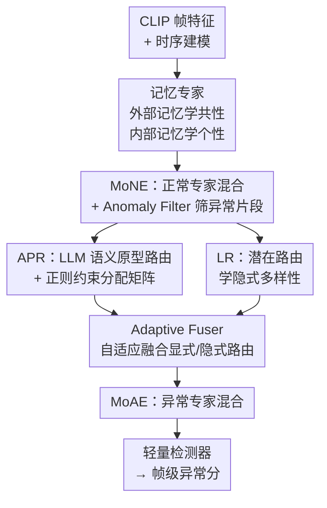

# Joint Learning of General and Diverse Patterns with Mixture of Memory Experts for Weakly-Supervised Video Anomaly Detection

**会议**: CVPR 2026  
**论文**: [CVF Open Access](https://openaccess.thecvf.com/content/CVPR2026/html/Sun_Joint_Learning_of_General_and_Diverse_Patterns_with_Mixture_of_CVPR_2026_paper.html)  
**领域**: 视频理解  
**关键词**: 弱监督视频异常检测, 记忆专家, 混合专家(MoE), CLIP, LLM 语义原型

## 一句话总结
MoME 用「内部记忆 + 共享外部记忆」的稀疏混合专家框架，让正常/异常两套专家在外部记忆里学共性、在内部记忆里学差异，再借 LLM 生成的异常语义原型来路由专家，从而同时兼顾泛化与判别，在 UCF-Crime 和 XD-Violence 上达到 SOTA（88.32% AUC / 86.15% AP）。

## 研究背景与动机
**领域现状**：弱监督视频异常检测（wVAD）只用视频级二分类标签训练，要在没有帧级标注的情况下定位异常片段。主流做法是多示例学习（MIL），把视频当成片段的 bag，逼正样本 bag 里的最高异常分超过负样本 bag。

**现有痛点**：现有方法在「泛化」和「判别」之间二选一。第一类（如 RTFM、UR-DMU）把所有异常当成同质的，只学一个通用异常模式（generic pattern），跨场景泛化好但判别力弱——可现实里异常天差地别：入店行窃靠细微动作语义，爆炸靠剧烈场景动态，一个统一模式根本刻画不了。第二类（如 GS-MoE、ITC）按类别标签把特征空间切开、给每类异常配专属子网络，判别力上来了却牺牲泛化：模型容易在某个类簇里过拟合（比如把"拿起物品"这种和 shoplifting 视觉相似的正常动作误判为异常），而且类别标签太粗，抹掉了类内差异和类间相似。

**核心矛盾**：通用模式 ↔ 类别专属模式之间存在 trade-off，而类别标签本身既粗糙又缺语义，无法作为刻画"异常多样性"的好向导。

**本文目标**：让一个模型**同时**学到通用模式（保泛化）和多样模式（保判别），并且多样性要由**细粒度语义**而非粗类标签来引导。

**切入角度**：作者把"通用"和"多样"分别交给两种记忆——共享的外部记忆聚合通用知识，每个专家私有的内部记忆刻画专门化模式；同时不让专家数量绑死在异常类别数上，而是用 LLM 把类名扩写成更可泛化的"异常原型"来做语义路由。

**核心 idea**：用「混合记忆专家（MoME）」——外部记忆学共性、内部记忆学个性、LLM 语义原型引导稀疏路由——来同时建模通用与多样的异常模式。

## 方法详解

### 整体框架
给定固定长度 $T$ 帧的正常视频 $V_n$ 和异常视频 $V_a$，先用冻结的 CLIP（ViT-B/16）视觉编码器抽帧级特征，再做时序建模得到 $X_n, X_a \in \mathbb{R}^{T\times d}$。核心是两套并列的记忆专家：**正常记忆专家混合（MoNE）** 负责正常模式，**异常记忆专家混合（MoAE）** 负责异常模式。两者都由"共享外部记忆（学通用）+ 多专家内部记忆（学多样）"组成，输出记忆增强特征送进一个轻量检测器算帧级异常分。

流程上是串行的：异常特征先过 MoNE，借"与正常模式最不像"这一信号筛出最可能异常的片段（Anomaly Filter），再把这批精炼特征送进 MoAE。MoAE 的路由由两条路构成——APR 用 LLM 语义原型做显式路由，LR（Latent Router）学隐式的潜在多样性，Adaptive Fuser 把两条路自适应融合。训练端用一组损失分别保证路由均衡、专家差异化和模式可判别。

### 关键设计

**1. 记忆专家：外部记忆学共性、内部记忆学个性**

针对"通用 ↔ 多样不可兼得"的核心矛盾，作者把一个专家拆成两块记忆：共享的外部记忆 $M_{ext}\in\mathbb{R}^{m\times d}$ 编码通用表征，私有的内部记忆 $M_{in}\in\mathbb{R}^{m\times d}$ 刻画专门化模式（$m$ 个记忆槽）。读取时把输入特征和两套记忆都投影到同一空间，用缩放点积注意力算相似度 $S_{in}=\sigma(QK_{in}^\top/\sqrt{d})$、$S_{ext}=\sigma(QK_{ext}^\top/\sqrt{d})$（这里 $\sigma$ 是沿记忆维的 sigmoid，不是 softmax，相当于让每个记忆槽独立打分），再把两路读出拼接 $H=\mathrm{concat}(S_{in}M_{in},\,S_{ext}M_{ext})\in\mathbb{R}^{T_i\times 2d}$，于是输出同时带有通用知识和专家特异知识。

两套记忆的更新方式刻意不同：内部记忆走反向传播慢慢学专家私货；外部记忆走 NTM 式的 erase-and-write 动态更新——先由输入算出擦除、门控、写入三个特征 $V_e,V_g,V_a$（$\sigma$ 限到 $[0,1]$ 做选择性擦写，$\tanh$ 限到 $[-1,1]$ 支持正负更新），用外部相似度 $S_{ext}$ 加权后做擦除-写入：$M_{ext}=M_{ext}\odot(1-\alpha\bar V_E)+\alpha\bar V_A$。这样外部记忆能跨样本持续累积"什么是普遍规律"，而内部记忆专注差异，正好对上"共性 + 个性"的诉求。消融显示去掉 $M_{ext}$ 在 XD 上掉 5.36% AP，证明这块外部通用记忆是泛化的关键载体。

**2. MoNE 与 Anomaly Filter：先用正常模式反向筛出异常片段**

正常数据没有显式监督，怎么把多样的正常模式分给不同专家？作者用一个 Latent Router（线性层）算路由分 $R_n^l=\mathrm{Softmax}(\mathrm{TopK}(W_lX_n^\top+b,\,k))$，按 top-$k$ 把每个片段分给最相关的潜在正常专家，各专家共享外部正常记忆 $M_{ext}^N$，聚合出正常表征 $H_n^N$ 和记忆相似度 $S_n^N$。

巧妙之处在 Anomaly Filter：把异常视频特征 $X_a$ 也喂进 MoNE，得到它与正常模式的相似度 $S_a^N$；**和正常模式最不像的片段，就最可能是真异常**——取 $I_{\hat a}=\mathrm{TopK}(1-S_a^N,\,T_a)$ 选出 $T_a$ 个最异常片段的下标，据此精炼出 $X_{\hat a}$ 再送入 MoAE。这一步等于用"正常侧的记忆"当一个无监督的异常定位器，把弱标签下"异常视频里到底哪几帧异常"这个老大难问题转成"离正常最远的几帧"，避免后续异常专家被大量正常背景帧干扰。

**3. APR：用 LLM 语义原型替代粗类标签来路由专家**

异常视频带类标签，但直接像 GS-MoE 那样把专家绑死到类别上很糟——异常常跨多类，固定类专家难训练。APR 的做法是：先用多个大语言模型对原始异常类名做扩写、人工挑出最可泛化的输出当作**异常原型（Anomaly Prototypes, AP）**，再用 CLIP 文本/视觉编码器抽原型语义特征 $T\in\mathbb{R}^{n\times d}$ 和视频特征，算跨模态相似度分布 $S=\mathrm{Softmax}\big(\frac{1}{\tau}\cdot\hat V_{\hat a}\hat T^\top\big)\in\mathbb{R}^{T_a\times n}$。

关键是一个**可学习的专家-原型分配矩阵** $A\in\mathbb{R}^{E_e\times n}$，把原型相似度映射成显式专家路由分 $G_{\hat a}^e=SA^\top$，再 top-$k$ softmax。为防止多个专家挤向同一批原型造成冗余，作者对 $A$ 加了正则 $L_{reg}$：类内项 $L_{intra}=-\frac1N\sum_i H(A_i)+\|AA^\top-I\|_F^2$（熵项促稀疏、正交项促专家差异），类间项 $L_{inter}$ 逼各列均衡利用。这样异常多样性由"语义原型"而不是离散类标签来引导，能捕捉类内差异并对齐跨类语义相近的模式，可视化显示加了正则后专家-原型分配更专一、更分散（图 6）。

**4. Latent Router + Adaptive Fuser：补上语义路由覆盖不到的潜在模式**

APR 是显式语义路由，但有些潜在异常模式语义原型覆盖不到。为此再并联一个 Latent Router 学隐式多样性 $R_{\hat a}^l=\mathrm{Softmax}(\mathrm{TopK}(W_lX_{\hat a}^\top+b,\,k))$，对应一批潜在异常专家。两路怎么融合？Adaptive Fuser（AF）是个条件网络：先把显式路由分 $R_{\hat a}^e$ 做 z-score 归一化（对齐到隐式分 $R_{\hat a}^l$ 的均值方差）后拼接，再叠上专家身份嵌入 $Z_i$ 和辅助路由特征 $Z_x$，过一个轻量网络重估出最终的显式/隐式专家权重 $F_{\hat a}^e, F_{\hat a}^l$。最终 MoAE 输出 $H_{\hat a}^A=\sum_{j\in\{l,e\}}\sum_i F_{\hat a,i}^j\Phi_{a,i}^j(X_{\hat a}^i, M_{ext}^A)$。AF 让两条路由通路不是简单相加而是按内容自适应配比，消融里去掉 AF 性能明显下降，说明显式与隐式两类线索都不可或缺、且需要被妥善平衡。

### 损失函数 / 训练策略
检测器是正常/异常共享的轻量 MLP，对 $H_n^N$ 和 $H_{\hat a}^A$ 算帧分，主损失为二分类 $L_{cls}=\mathrm{BCE}(y_n,0)+\mathrm{BCE}(y_{\hat a},1)$。此外：重建损失 $L_{rec}$ 用两个解码器引导 MoNE/MoAE 各学其模式（正确配对的重建要像、错配的要不像）；记忆监督损失 $L_m$ 直接约束四组记忆相似度（如 $S_n^N\to1$、$S_{\hat a}^N\to0$）；专家均衡损失 $L_b$ 用平方变异系数 $\mathrm{CV}(\hat G)$ 防止专家负载塌缩；记忆差异损失 $L_{div}=\sum_k \frac{2}{E_k(E_k-1)}\sum_{i<j}\|M_{in}^{k,i}-M_{in}^{k,j}\|_1$ 最大化专家内部记忆两两 $\ell_1$ 距离，强制专家学到真正不同的东西（因为单纯负载均衡并不保证多样——相似输入仍可能落到重叠专家）。配置上 MoNE 用 24 个潜在专家，MoAE 显式/隐式各 12 个，激活专家数 $k=1$，$T=256$、$T_a=16$。

## 实验关键数据

### 主实验
在两大基准 UCF-Crime（13 类异常监控视频，报 frame-level AUC）和 XD-Violence（多模态暴力检测，报 AP）上对比：

| 数据集 | 指标 | MoME | 之前最好(CLIP系) | 说明 |
|--------|------|------|----------|------|
| XD-Violence | AP % | **86.15** | DEN-VAD 86.13 / ITC 85.45 | 取得最佳 AP |
| UCF-Crime | AUC % | 88.32 | ITC 89.04 / VadCLIP 88.02 | CLIP 系里高度有竞争力 |

值得注意的是 ITC、GS-MoE 这类学类专属表征的方法在 UCF 上很强（GS-MoE 用 I3D 特征到 91.58），但到 XD 上明显回落；MoME 在两个数据集上更**均衡**，印证了"联合建模通用+多样"对鲁棒性的价值（UCF 类间可分性高、多样性低，恰好遮蔽了类专属方法的泛化短板）。

### 消融实验
模块消融（Table 3）与损失消融（Table 4）：

| 配置 | UCF AUC % | XD AP % | 说明 |
|------|---------|---------|------|
| 完整 MoME | **88.32** | **86.15** | 全模块全损失 |
| w/o $M_{ext}$ | 87.08 | 80.79 | 去外部记忆，XD 掉 5.36% AP |
| w/o APR | 86.57 | 82.86 | 去语义路由 |
| w/o LR | 86.78 | 80.49 | 去潜在路由 |
| w/o AF | 87.69 | 81.94 | 去自适应融合 |
| 仅 $L_{cls}$ | 63.73 | 26.11 | 监督严重不足 |
| $L_{cls}+L_m$ | 87.58 | 85.40 | 加记忆损失暴涨 |

### 关键发现
- **记忆监督损失 $L_m$ 贡献最大**：只用分类损失 AUC/AP 仅 63.73/26.11，加上 $L_m$ 直接飙到 87.58/85.40——说明记忆引导的监督才是这套框架真正吃饭的家伙，主分类损失反而信号稀薄。
- **外部记忆对 XD 尤其关键**：去掉 $M_{ext}$ 在 XD 掉 5.36% AP（UCF 只掉 1.24%），印证多样性更高的 XD 更依赖通用记忆来稳住泛化。
- **复杂动态类别提升最猛**：逐类看，Assault 的 AUC 比 VadCLIP 提升 53.8%、Robbery 提升 10.1%，这些正是"动作语义复杂"的异常，直接体现语义多样性建模的威力。
- **跨数据集鲁棒**：UCF→XD、XD→UCF 双向迁移下 MoME 都比 VadCLIP 性能更高且掉点相当，泛化更稳。
- **多事件视频**：单事件视频 MoME 和 VadCLIP 都能 AP>90%；事件数 >9 的极少数视频上 MoME 略逊，但样本量极小统计意义有限，整体仍优。

## 亮点与洞察
- **"离正常最远即异常"的 Anomaly Filter 很巧**：把弱标签下的异常帧定位问题，转化成用正常侧记忆相似度取反、top-$T_a$ 选片段，无需额外监督就给异常专家喂干净输入，是个可迁移到其它弱监督定位任务的 trick。
- **内/外双记忆解耦"共性 vs 个性"**：外部记忆 erase-write 跨样本累积通用规律、内部记忆反传学私货，这种"一份共享 + 多份私有"的记忆设计，本质上把 MoE 的"专家"概念延伸到了记忆层面，比单纯堆专家更直接地对应"通用-多样"这对矛盾。
- **用 LLM 把粗类名扩写成语义原型**：绕开"专家数绑死类别数"的桎梏，让稀疏 MoE 的专家数和异常类别解耦，是 LLM 语义知识注入传统检测管线的轻量范例。
- **差异损失 $L_{div}$ 点破了 MoE 常见误区**：负载均衡 ≠ 专家多样，作者直接最大化专家记忆的两两距离来强制差异化，思路干净。

## 局限与展望
- **APR 依赖人工挑原型**：异常原型是"多个 LLM 输出 + 人工选最可泛化"得到的，这一步主观且不可全自动化，原型质量对路由影响多大、换 LLM 是否敏感，论文没充分讨论。
- **UCF 上未夺第一**：AUC 88.32 低于 ITC(89.04) 和用 I3D 的 GS-MoE(91.58)，作者归因于 UCF 多样性低，但这也说明在类可分性高的场景下，联合建模的优势不明显。
- **多事件密集场景退化**：事件数 >9 时反而不如 VadCLIP，虽以"样本稀少"开脱，但真实长视频里密集异常恰恰是难点。
- **结构偏重**：MoNE 24 专家 + MoAE 24 专家 + 双记忆 + 多达 6 项损失，训练复杂度和调参成本不低，论文未给计算开销/推理速度对比。
- **可改进**：把人工选原型改成可学习的原型自动筛选、或让外部记忆在线适配测试域，或许能进一步提升跨域鲁棒性。

## 相关工作与启发
- **vs GS-MoE [2]**：同样用 MoE 做 VAD，但 GS-MoE 是 dense MoE、专家数绑死异常类别、靠类标签训练，泛化和多样性受限于粗类粒度；MoME 用 sparse MoE、靠 LLM 语义原型解耦专家与类别，泛化更好、更灵活。UCF 上 GS-MoE(I3D) 更高，但跨数据集和 XD 上 MoME 更均衡。
- **vs VadCLIP [37]**：本文沿用了它的时序建模，但 VadCLIP 偏单一通用模式；MoME 在其上叠加多专家+双记忆，逐类（尤其复杂动态类）和多事件鲁棒性都更强。
- **vs UR-DMU [43]**：UR-DMU 用记忆建模正常/异常，MoME 借鉴了记忆监督思路（$L_m$）但进一步引入"内部+外部"双记忆和专家路由，把记忆从单块扩成专家化结构。
- **vs 传统 MIL 方法（RTFM/Sultani 等）**：它们学单一通用异常模式，判别力弱；MoME 用专家混合显式建模多样性，在保持泛化的同时大幅提升判别。

## 评分
- 新颖性: ⭐⭐⭐⭐ 把"内/外双记忆 + LLM 语义原型路由"组合进稀疏 MoE 解 wVAD 的通用-多样矛盾，组合新颖但单个组件多有出处。
- 实验充分度: ⭐⭐⭐⭐ 两大基准 + 模块/损失双消融 + 跨域 + 多事件 + 逐类 + 多种可视化，较全面；缺计算开销对比。
- 写作质量: ⭐⭐⭐⭐ 动机的"泛化 vs 判别"二分讲得清楚，公式完整，图示到位。
- 价值: ⭐⭐⭐⭐ XD 上 SOTA、跨域更稳，Anomaly Filter 和双记忆设计有迁移价值。

<!-- RELATED:START -->

## 相关论文

- [\[CVPR 2026\] Weakly Supervised Video Anomaly Detection with Anomaly-Connected Components and Intention Reasoning](weakly_supervised_video_anomaly_detection_with_anomaly-connected_components_and_.md)
- [\[CVPR 2026\] Learning from Noisy Supervision: A Denoising-Debiasing Framework for Weakly Supervised Video Anomaly Detection](learning_from_noisy_supervision_a_denoising-debiasing_framework_for_weakly_super.md)
- [\[CVPR 2026\] The Road Less Seen: Segment Exploration for Weakly Supervised Video Anomaly Detection](the_road_less_seen_segment_exploration_for_weakly_supervised_video_anomaly_detec.md)
- [\[AAAI 2026\] Learning to Tell Apart: Weakly Supervised Video Anomaly Detection via Disentangled Semantic Alignment](../../AAAI2026/video_understanding/learning_to_tell_apart_weakly_supervised_video_anomaly_detection_via_disentangle.md)
- [\[CVPR 2026\] TLMA: Mitigating the Impact of Weakly Labeled Information for Video Anomaly Detection](tlma_mitigating_the_impact_of_weakly_labeled_information_for_video_anomaly_detec.md)

<!-- RELATED:END -->
