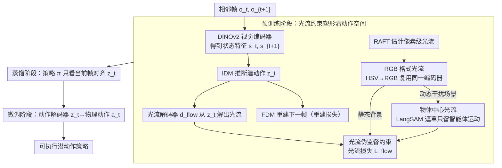

# LAOF: Robust Latent Action Learning with Optical Flow Constraints

**会议**: CVPR 2026  
**arXiv**: [2511.16407](https://arxiv.org/abs/2511.16407)  
**代码**: [GitHub](https://github.com/XizoB/LAOF)  
**领域**: 视频理解  
**关键词**: 潜动作学习, 光流约束, 具身智能, 模仿学习, 视频预训练

## 一句话总结

提出LAOF框架，利用智能体的光流作为伪监督信号约束潜动作学习，使潜动作表示对干扰更鲁棒，在LIBERO和PROCGEN上显著超越无监督基线，且在无标签条件下匹配或超越使用1%动作标签的监督方法。

## 研究背景与动机

从大规模无动作标签视频中学习潜动作表示是构建可扩展具身基础模型的关键路径。LAPO范式通过逆动力学模型（IDM）+前向动力学模型（FDM）的自编码框架联合训练潜动作，已在LAPA、GR00T N1等大规模具身模型中得到应用。

核心问题：LAPO隐含假设连续帧间的所有变化都由智能体的动作引起，但真实世界视频中存在大量**与动作无关的干扰**（如移动的背景物体、随机环境变化），且纯重建目标可能使潜动作与视觉外观纠缠。

现有解决方案：
- 添加少量动作标签监督（LAOM、villa-X）：在极端标签稀缺时交替训练不稳定，容易过拟合
- 离散化VQ-VAE：创建信息瓶颈但表达力受限

核心洞察：**光流提供了像素级的帧间运动信息**，天然抑制静态背景并强调运动物体，且预训练光流模型已有强跨场景泛化能力。光流可作为与动作高度相关的伪监督信号，无需人工标注。

## 方法详解

### 整体框架

LAOF 沿用 LAPO 的潜动作自编码骨架——逆动力学模型（IDM）从相邻帧 $(s_t, s_{t+1})$ 推断潜动作 $z_t$，前向动力学模型（FDM）再用 $z_t$ 重建下一帧——但在这套纯重建框架上挂了一个额外的光流解码分支，逼着潜动作去解释帧间的真实运动而不只是外观变化。整体训练分三个阶段递进：先在无标签视频上联合训练 IDM、FDM 和光流解码器，让潜动作空间被光流约束塑形；再把 IDM 的知识蒸馏到一个只看当前帧的潜动作策略 $\pi$，使推理时不再需要未来帧；最后用极少量动作标签训练一个动作解码器，把潜动作翻译成机器人能执行的物理动作。三阶段中真正影响表示质量的是预训练阶段，后两阶段只是把潜动作落地为可执行策略。

### 关键设计

**1. 光流伪监督约束：用像素级运动把潜动作钉在物理运动上**

LAPO 的隐含假设是「相邻帧的所有变化都由智能体动作引起」，可现实视频里背景物体在动、环境在随机变化，纯重建目标会让潜动作把这些与动作无关的干扰也一并编码进去，甚至退化成纯外观表示。LAOF 的做法是在 IDM 输出的潜动作上再接一个专用光流解码器 $d_{flow}: \mathcal{Z} \rightarrow \mathcal{F}_{rgb}$，要求潜动作不仅能重建下一帧、还能解码出该步的光流，预训练损失因此变成 $\mathcal{L}_{pretrain} = \mathcal{L}_{reconstruction} + \mathcal{L}_{flow}$。光流伪标签由预训练 RAFT 模型现成生成，无需任何人工标注。之所以选光流，是因为光流天然抑制静态背景、放大运动物体——运动正是动作的直接视觉结果，用它当辅助监督等于给潜动作加了一条「必须对应真实物理运动」的硬约束，把外观纠缠挤出去。

**2. RGB 格式光流：把光流伪装成图像，复用同一个视觉编码器**

光流原始形式是每像素的二维向量场 $(u,v)$，和 DINOv2 期望的 RGB 图像不兼容，若另起一个光流专用编码器既增加参数又割裂表示空间。LAOF 把光流向量转成极坐标，方向映射到 HSV 的色相、幅度映射到饱和度与亮度，再标准地从 HSV 转回 RGB，于是一张光流图就变成了一张普通彩色图，可以直接喂进同一个 DINOv2。幅度归一化用 $m_{norm} = \min(1.0, m/(\sigma\sqrt{H^2+W^2}))$，按画面对角线长度缩放后截断到 1，避免个别大位移把颜色饱和度拉爆。这样观测和运动走的是同一套编码管线，潜动作约束和重建约束落在同一个特征空间里，配合更顺。

**3. 物体中心光流：按场景自适应地只保留智能体相关的运动**

光流抑制静态背景的前提是背景确实静态。在机器人操作这类场景里全局光流自然就聚焦在机械臂和被操作物上，直接用即可；但在 PROCGEN 这类游戏场景里，背景里有大量与智能体无关的动态干扰（移动的敌人、滚动的画面），全局光流会把这些噪声也算进监督信号。LAOF 对后者用 LangSAM 先生成智能体的物体遮罩，再把遮罩逐元素乘到光流图上 $f_{rgb,t}^{sam} = mask_t \odot f_{rgb,t}^{all}$，只留下智能体自身引起的运动。这条「静态背景用全局、动态干扰用物体中心」的自适应规则，让光流约束在两类差异很大的环境里都能给出干净的伪监督。

### 损失函数 / 训练策略

预训练阶段，纯无标签版本就是重建损失加光流损失 $\mathcal{L}_{pretrain} = \mathcal{L}_{reconstruction} + \mathcal{L}_{flow}$。若手头还有少量动作标签，则加上动作监督项 $\mathcal{L}_{pretrain} = \mathcal{L}_{reconstruction} + (1-\lambda)\mathcal{L}_{flow} + \lambda\mathcal{L}_{action}$，权重 $\lambda = M/(N+M)$ 由有标签样本数 $M$ 与无标签样本数 $N$ 自动决定——标签越稀缺，权重越偏向光流伪监督，标签越多则越信任真实动作。蒸馏阶段让只看当前帧的策略对齐 IDM 推出的潜动作 $\mathcal{L}_{distillation} = \|\pi(\hat{z}_t|s_t,l_t) - z_t\|_2$；微调阶段再用真实动作训练动作解码器 $\mathcal{L}_{action} = \|d_{action}(\hat{a}_t|z_t) - a_t\|_2$。

## 实验关键数据

### 主实验 — LIBERO模仿学习

| 方法 | SPATIAL成功率 | OBJECT成功率 | GOAL成功率 | LONG成功率 | 平均提升 |
|------|-------------|-------------|-----------|-----------|---------|
| LAPO | 80.4% | 81.2% | 84.0% | 44.7% | 基线 |
| CoMo | 74.1% | 87.6% | 80.8% | 49.9% | +0.5 |
| CoMo w/ OF | 76.2% | **89.7%** | 82.6% | **57.9%** | +4.0 |
| **LAOF** | **82.5%** | 85.3% | **87.2%** | 52.0% | **+4.2** |
| LAOM-Action (1%标签) | 86.0% | 91.1% | 86.3% | 61.6% | +8.7 |
| **LAOF-Action (1%标签)** | **88.2%** | **95.9%** | **88.6%** | **63.7%** | **+11.5** |

### 消融实验 — 光流约束位置

| 配置 | 效果 | 说明 |
|------|------|------|
| 直接连接到潜动作 | 最优 | 光流解码器直接从z解码 |
| 通过FDM去约束 | 次优 | 间接约束效力减弱 |
| 无光流约束 | 基线 | LAPO原始方法 |

### 标签比例扩展实验

| 动作标签比例 | LAOF-Action vs LAOM-Action |
|-------------|---------------------------|
| 0% | LAOF ≥ LAOM-Action@1% |
| 1% | LAOF-Action 显著超越 |
| 5% | 仍有提升 |
| 10% | 光流约束仍有效 |

### 关键发现

- 无监督LAOF匹配甚至超越使用1%标签的LAOM-Action，证明光流伪监督的强效性
- 光流约束在标签比例增加到10%时仍然有效，说明两种信号互补而非冗余
- 连续潜动作一致优于离散VQ-VAE表示（两个benchmark均有验证）
- 提出的潜动作评估指标与下游任务性能高度相关（Pearson相关系数0.83/0.73）

## 亮点与洞察

- 光流作为伪监督信号的选择既自然又有效——像素级运动捕获是动作的直接视觉结果
- RGB格式光流统一了观测和运动的处理流程，仅需单一视觉编码器
- LAOF-Action的自适应权重设计（$\lambda=M/(N+M)$）随标签比例自动平衡两种信号
- 作为LAPO范式的扩展，可直接集成到现有具身基础模型训练流程中

## 局限与展望

- 依赖预训练光流模型（RAFT），光流估计错误会传播为噪声标签
- 物体中心光流依赖LangSAM的分割质量，复杂场景可能失效
- 仅在LIBERO（机器人操作）和PROCGEN（2D游戏）上验证，真实世界场景未测试
- 三阶段训练pipeline增加了工程复杂度

## 相关工作与启发

- **vs LAPO**: LAPO隐含静态背景假设，LAOF通过光流显式处理动态干扰
- **vs LAOM**: LAOM需要动作标签且交替训练不稳定；LAOF用无标签光流获得更稳定的训练
- **vs FlowVLA (并发)**: FlowVLA将光流离散化为token用于世界模型训练；LAOF使用连续光流约束学习潜动作，目标不同

## 评分

- 新颖性: ⭐⭐⭐⭐ 光流作为潜动作伪监督的idea自然且有效，但核心贡献是实验验证而非概念突破
- 实验充分度: ⭐⭐⭐⭐⭐ LIBERO+PROCGEN，连续vs离散，标签比例扫描，消融详细
- 写作质量: ⭐⭐⭐⭐ 方法清晰，问题定义精确，三阶段流程条理分明
- 价值: ⭐⭐⭐⭐ 对具身基础模型预训练有实际指导意义

<!-- RELATED:START -->

## 相关论文

- [\[CVPR 2026\] U2Flow: Uncertainty-Aware Unsupervised Optical Flow Estimation](u2flow_uncertainty_aware_unsupervised_optical_flow_estimation.md)
- [\[AAAI 2026\] BAT: Learning Event-based Optical Flow with Bidirectional Adaptive Temporal Correlation](../../AAAI2026/video_understanding/bat_learning_event-based_optical_flow_with_bidirectional_adaptive_temporal_corre.md)
- [\[ICCV 2025\] Unsupervised Joint Learning of Optical Flow and Intensity with Event Cameras](../../ICCV2025/video_understanding/unsupervised_joint_learning_of_optical_flow_and_intensity_with_event_cameras.md)
- [\[CVPR 2026\] SkeletonContext: Skeleton-side Context Prompt Learning for Zero-Shot Skeleton-based Action Recognition](skeletoncontext_skeleton-side_context_prompt_learning_for_zero-shot_skeleton-bas.md)
- [\[ICCV 2025\] PriOr-Flow: Enhancing Primitive Panoramic Optical Flow with Orthogonal View](../../ICCV2025/video_understanding/prior-flow_enhancing_primitive_panoramic_optical_flow_with_orthogonal_view.md)

<!-- RELATED:END -->
