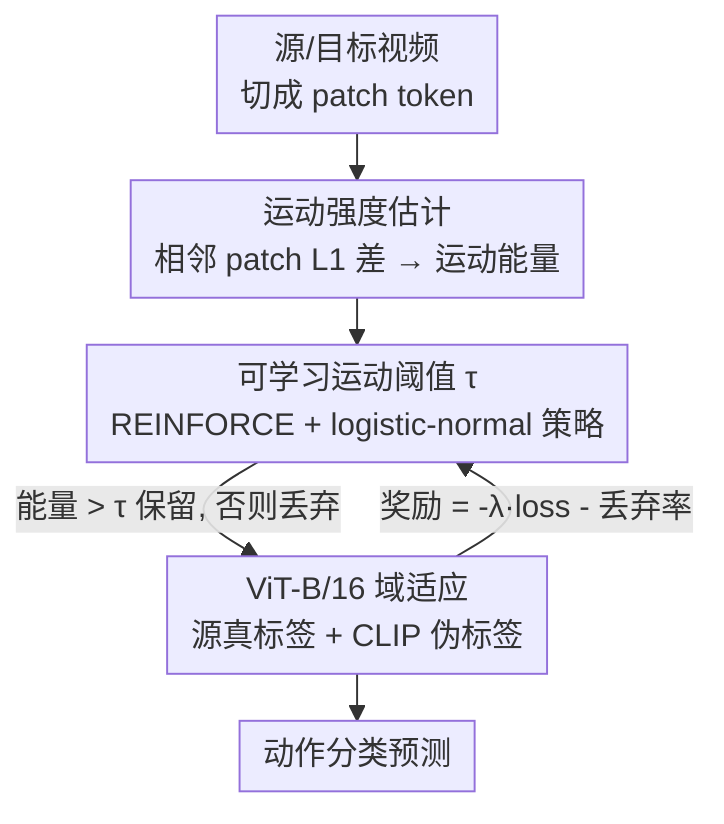

# Learnable Motion-Focused Tokenization for Effective and Efficient Video Unsupervised Domain Adaptation

**会议**: CVPR 2026  
**论文**: [CVF Open Access](https://openaccess.thecvf.com/content/CVPR2026/html/Liu_Learnable_Motion-Focused_Tokenization_for_Effective_and_Efficient_Video_Unsupervised_Domain_CVPR_2026_paper.html)  
**代码**: 论文未给出（⚠️ 以原文为准）  
**领域**: 视频理解 / 动作识别 / 无监督域适应  
**关键词**: 视频域适应、动作识别、token 剪枝、运动聚焦、强化学习阈值

## 一句话总结
LMFT 在视频域适应里用「相邻帧 token 的 L1 运动差」量化每个 patch 的运动强度，再用强化学习学一个可微调的运动阈值丢掉低运动（背景）token，只把动作相关 token 送进 ViT，从而同时缓解背景引起的域偏移、把训练时间砍掉 10–20 倍。

## 研究背景与动机
**领域现状**：视频无监督域适应（VUDA）要把在有标注源域上训的动作识别模型迁到无标注目标域，近来主流是基于 ViT 的方法（UDAVT、UNITE 等），靠 transformer 强表征拿 SOTA。

**现有痛点**：ViT 把源/目标视频里**每一个**时空 token 都送进自注意力，带来两个问题。第一，很多 token 对应静态或背景区域，与动作无关——同一个「跑步」动作出现在室内 vs 室外，背景差异会放大域偏移、干扰对「以动作为中心的运动语义」的迁移。第二，自注意力代价随 token 数平方增长，把冗余背景 token 一起算极其低效，VUDA 的计算效率几乎被现有研究忽视，限制了实际部署。

**核心矛盾**：背景 token 既是**域偏移的放大器**，又是**算力的浪费源**——两个问题同源，都是「无差别处理所有 token」造成的。

**本文目标**：(1) 在送进 ViT 前就识别并丢掉低运动冗余 token、保留动作相关 token；(2) 让这个丢弃过程自适应、可学习，而不是手调阈值。

**切入角度**：作者观察到「动作相关 = 运动丰富」。背景静止、动作区域有运动，那只要量化每个 patch 的时间运动强度，低于某阈值就丢，就能同时去掉背景偏移、减少 token 数。难点是「丢/留」是硬比较、不可微，没法直接学阈值。

**核心 idea**：用相邻时间 patch 的 L1 差当运动强度，用**强化学习（REINFORCE）学一个可学习的运动阈值** τ 来做不可微的 token 选择，奖励同时奖准确率和丢弃率，于是「更有效 + 更高效」一起拿到。

## 方法详解

### 整体框架
LMFT 是一个**联合训练框架**：源域有标注、目标域无标注，目标是把 ViT 模型 fϕ 适配到目标域。每段输入视频（无论源/目标）先被切成 patch token，然后 LMFT 模块估计每个 token 的运动强度、用一个 RL 学到的阈值 τ 把低运动 token 丢掉，只把运动丰富的 token 喂给 ViT-B/16；ViT 这边用源域真标签 + 目标域 CLIP 伪标签（经置信度过滤）做有监督训练，同时回传一个「准确率 + 丢弃率」的奖励去更新 τ 的策略。测试时用一个确定化的阈值 τ̂ 做稳定预测。整条链路是「tokenize → 运动强度估计 → RL 阈值选 token → ViT 域适应」的闭环，token 选择和域适应互相优化。

### 关键设计

**1. 运动强度估计：用 L1 时间差把「动作相关」量化成标量能量**

这是为了在不依赖光流/额外网络的前提下，分辨哪些 token 属于运动区域。对每个时空 patch $P_t^{x,y}$ 先沿时间维平均得代表帧 $\bar P_t^{x,y}$，再算相邻代表帧的逐像素 L1 差 $D_t^{x,y}=|\bar P_{t+1}^{x,y}-\bar P_t^{x,y}|$，对差图做全局平均池化得到标量「patch 运动能量」 $E_t^{x,y}=\frac{1}{C\cdot p\cdot p}\sum_{c,i,j} D_t^{x,y}[c,i,j]$。为让能量跨视频可比，在每段视频内做 min-max 归一化得 $\tilde E_t^{x,y}\in[0,1]$；第一个时间段没有前帧可差分，就补一个常数 1 保证它始终被保留。最终把所有空间位置的能量聚成张量 $E_{\text{motion}}\in\mathbb{R}^{N_t\times N_x\times N_y}$。整个估计几乎零额外开销，却给出了「哪里在动」的密集图谱。

**2. 可学习运动阈值 τ：把不可微的「丢/留」交给强化学习**

token 选择是硬比较——能量 $>\tau$ 保留、否则丢，得到二值掩码 $M_{t,x,y}$。手调 $\tau$ 既费力又难跨动作/域泛化，但直接反传又因为硬比较不可微。作者把 $\tau$ 做成可学习变量，用策略梯度 RL 学：策略 $\pi_\theta(\tau)$ 用 logistic-normal 分布（参数 $\theta=\{\mu,\log\sigma\}$）保证 $\tau\in(0,1)$，目标是最大化期望奖励 $J(\theta)=\mathbb{E}_{\tau\sim\pi_\theta}[R(\tau)]$，用 REINFORCE 估计梯度 $\nabla_\theta J=\mathbb{E}[(R(\tau)-b)\nabla_\theta\log\pi_\theta(\tau)]$，其中 $b$ 是滑动平均基线（$b\leftarrow 0.9b+0.1R(\tau)$）降方差。采样时先 $u\sim\mathcal{N}(\mu,\sigma^2)$ 再 $\tau=\text{sigmoid}(u)$，对数策略经变量替换有闭式 $\log\pi_\theta(\tau)=\log\mathcal{N}(\text{logit}(\tau);\mu,\sigma^2)-\log\tau-\log(1-\tau)$。只采一个标量 $\tau$、更新两个参数，开销可忽略，却让阈值随运动模式与域自适应调整。

**3. 奖励设计：在「准确率」和「丢弃率」之间显式权衡**

如果只奖准确率，模型会倾向少丢 token（不冒险）；要逼出效率就得把「丢得多」也写进奖励。作者对源/目标域各定义奖励 $R_{\text{src}}=-\lambda_{\mathcal{L}}\mathcal{L}_s-(1-\rho_s)$、$R_{\text{tgt}}=-\lambda_{\mathcal{L}}\mathcal{L}_t-(1-\rho_t)$，其中 $\mathcal{L}_s,\mathcal{L}_t$ 是源/目标域损失，$\rho_s,\rho_t$ 是丢弃率（丢掉 token 占总数比例），$\lambda_{\mathcal{L}}$ 平衡两项，总奖励 $R(\tau)=R_{\text{src}}+R_{\text{tgt}}$。$-(1-\rho)$ 这一项意味着**丢得越多奖励越高**，于是策略被推着在「不掉精度」的前提下尽量激进丢 token——这正是「有效 + 高效」同时成立的机制来源。

**4. VUDA 域适应框架：CLIP 伪标签 + 置信过滤 + 块对角注意力**

留下的 token 要真正用于跨域训练。目标域无标签，作者用零样本 CLIP（ViT-B/16）配模板「a video of a person {action}」生成伪标签，对视频帧编码后做时间平均池化、与文本嵌入算余弦相似度 + softmax 得类别分布 $q_i^T$；再做置信过滤：只有 $\max(q_i^T)>\gamma_c$ 的样本才保留并取 argmax 当伪标签，得到高质量子集。训练目标是源域交叉熵 $\mathcal{L}_s$ + 目标域伪标签交叉熵 $\mathcal{L}_t$ 的组合 $\mathcal{L}_{\text{da}}=\mathcal{L}_s+\lambda_t\mathcal{L}_t$。由于 LMFT 让每段视频 token 数不定长，作者用**块对角注意力掩码**把不同视频的序列拼接、却严格把注意力限制在各视频边界内，从而无填充地批处理。测试时为稳定，用蒙特卡洛估计策略期望 $\hat\tau=\mathbb{E}_{\epsilon\sim\mathcal{N}(0,1)}[\text{sigmoid}(\mu+\sigma\epsilon)]$（采 $K=100$ 个样本平均），训练后一次性算好、部署零额外开销。

### 损失函数 / 训练策略
ViT-B/16 用 VideoMAE 预训练权重初始化；每视频采 16 帧、tubelet $t_p=2$ 得 $N_t=8$，帧 resize 到 224×224；AdamW 训 20 epoch、weight decay 0.05、batch 32。策略初值 $\mu=0.01$、$\log\sigma=-1.0$；伪标签置信阈 $\gamma_c=0.8$、目标域损失权 $\lambda_t=0.5$、奖励系数 $\lambda_{\mathcal{L}}=10$。

## 实验关键数据

### 主实验
三个 VUDA 基准、21 个域适应设定。下表为 UCF↔HMDB_full（12 类）Top-1 准确率（⚠️ 原文 Table 标题为 Daily-DA，但表内列为 H→U / U→H，应为 UCF-HMDB，以原文为准）：

| 方法 | H→U | U→H | Avg. |
|------|------|------|------|
| Source Only | 93.3 | 81.9 | 87.6 |
| CO2A | 95.8 | 87.8 | 91.8 |
| UDAVT | 96.8 | 92.3 | 94.6 |
| UNITE | 92.5 | 95.0 | 93.8 |
| Ours w/o LMFT | 98.3 | 92.5 | 95.4 |
| **Ours (LMFT)** | **98.6** | **94.2** | **96.4** |
| Target Only（上界） | 98.9 | 97.2 | 98.1 |

三基准上一致超 SOTA：作者报告 Daily-DA、UCF-HMDB_full 上分别提升、ActorShift（人→动物，语义鸿沟大）上提升约 12%。「Ours w/o LMFT → Ours」证明运动聚焦 token 选择不仅没掉点、还涨点，同时更省算力。

### 效率分析
M→H 设定下与各 token 缩减法在准确率、吞吐（Clips/s）、GFLOPs、相对算力的对比：

| 方法 | 准确率↑ | Clips/s↑ | GFLOPs↓ | 相对算力↓ |
|------|------|------|------|------|
| ViT-B/16（全 token） | 72.1 | 3.8 | 266 | 1.00× |
| Random（随机丢） | 71.7 | 3.6 | 216 | 0.81× |
| ToMe | 72.5 | 1.8 | 242 | 0.91× |
| PruMerge | 71.7 | 3.5 | 493 | 1.85× |
| DivPrune | 72.9 | 0.2 | 223 | 0.84× |
| **LMFT (Ours)** | **74.2** | **3.9** | 217 | 0.82× |

与 VUDA 方法比，LMFT 在 M→H 上 74.2% 准确率、训练仅 2784s，而 UNITE 71.7%/27426s、DALL-V 58.3%/15526s——训练时间比最强 VUDA 方法 UNITE 快约 10–20 倍，GFLOPs 也从 358 降到 217。

### 关键发现
- **运动聚焦 > 随机丢**：Random 丢掉同等比例 token 反而掉点（72.1→71.7），LMFT 涨到 74.2，说明涨点来自「丢对了 token」（背景）而非单纯减 token。
- **比其他 token 缩减法更划算**：ToMe/DivPrune 要么吞吐崩（DivPrune 0.2 Clips/s）、要么 GFLOPs 反而暴涨（PruMerge 493），LMFT 在准确率、吞吐、算力三项同时占优——这些通用剪枝法没为域适应设计、且靠手调剪枝比例。
- **超参敏感性**：置信阈 $\gamma_c=0.8$ 给出最佳保真-准确率折中（Table 7）；奖励系数 $\lambda_{\mathcal{L}}$ 在 {0.1,1,10,100} 中取 10 最好（Table 9）；时间分辨率 $N_t\in\{2,4,6,8\}$ 下 LMFT 均优于全 token / 随机丢 / UNITE（Table 8）。
- **RL > Gumbel-softmax**：用 Gumbel-softmax 学选择不仅准确率更低，显存与训练时间也更差（Table 10），佐证用 REINFORCE 学标量阈值是更轻更稳的选择。

## 亮点与洞察
- **「背景既是域偏移源、又是算力浪费源」的统一视角**：把效果和效率两个看似独立的目标归到同一个动作——丢背景 token，于是一个设计同时解决两件事，这种「同源问题统一解」的思路很值得借鉴。
- **用 RL 学一个标量阈值**：面对不可微的硬选择，不去设计复杂的可微近似，而是只用 REINFORCE 学一个标量 τ，开销可忽略却拿到自适应。这把「不可微离散决策」轻量化的范式可迁移到很多 token/采样选择问题。
- **块对角注意力解决变长批处理**：token 选择后每视频长度不一，用块对角掩码拼接 + 限定注意力边界，无填充批处理——这是把「动态 token 数」工程落地的实用 trick。

## 局限与展望
- 运动强度纯靠 L1 像素差估计，对相机抖动、全局运动（如平移镜头）可能误判为「高运动」而保留背景 token，论文未充分讨论这类情形。
- 伪标签依赖零样本 CLIP，目标域若是 CLIP 覆盖差的动作类别（如 ActorShift 的动物动作），伪标签质量可能成为瓶颈，置信过滤只能缓解不能根治。
- 仅在 ViT-B/16 + VideoMAE 一种骨干上验证，更大模型或不同视频架构上的可迁移性未知。
- 改进方向：把运动估计从像素 L1 升级为对相机运动鲁棒的表示（如配准后差分），或让阈值随空间位置/时间段细粒度变化而非全局单一 τ。

## 相关工作与启发
- **vs UNITE / UDAVT 等 ViT-based VUDA**：它们处理全部 token、忽视效率，LMFT 先丢背景 token 再适应，既减域偏移又把训练时间砍 10–20 倍，是首个把「计算效率」当一等目标的 VUDA 工作。
- **vs ToMe / PruMerge / DivPrune 等 token 缩减法**：这些为通用 ViT 效率设计、靠手调剪枝比例或合并规则，没针对域适应；LMFT 用 RL 学阈值、按运动语义保留 token，既适配域适应又在准确率/吞吐/算力上全面占优。
- **vs RLT（run-length tokenization）**：RLT 也用 patch 时间差去重，但用固定规则；LMFT 把阈值变成 RL 可学变量，自适应不同动作与域。

## 评分
- 新颖性: ⭐⭐⭐⭐ 「运动聚焦 + RL 可学阈值」的组合在 VUDA 里是新角度，尤其首次把效率作为一等目标。
- 实验充分度: ⭐⭐⭐⭐⭐ 三基准 21 设定 + 训练/推理双效率分析 + 多组消融（阈值/奖励系数/时间分辨率/RL vs Gumbel），很完整。
- 写作质量: ⭐⭐⭐⭐ 方法推导清晰、公式齐全，但表格标题与列名有不一致处，需对照原文。
- 价值: ⭐⭐⭐⭐ 在保精度的同时大幅降训练成本，对实际部署 VUDA 有直接价值。

<!-- RELATED:START -->

## 相关论文

- [\[ICML 2026\] Return of Frustratingly Easy Unsupervised Video Domain Adaptation](../../ICML2026/video_understanding/return_of_frustratingly_easy_unsupervised_video_domain_adaptation.md)
- [\[CVPR 2026\] MaskAdapt: Learning Flexible Motion Adaptation via Mask-Invariant Prior for Physics-Based Characters](maskadapt_learning_flexible_motion_adaptation_via_mask-invariant_prior_for_physi.md)
- [\[CVPR 2026\] VideoNet: A Large-Scale Dataset for Domain-Specific Action Recognition](videonet_a_large-scale_dataset_for_domain-specific_action_recognition.md)
- [\[CVPR 2026\] Seeing Motion Through Polarity for Event-based Action Recognition](seeing_motion_through_polarity_for_event-based_action_recognition.md)
- [\[CVPR 2026\] Scene-Centric Unsupervised Video Panoptic Segmentation](scene-centric_unsupervised_video_panoptic_segmentation.md)

<!-- RELATED:END -->
